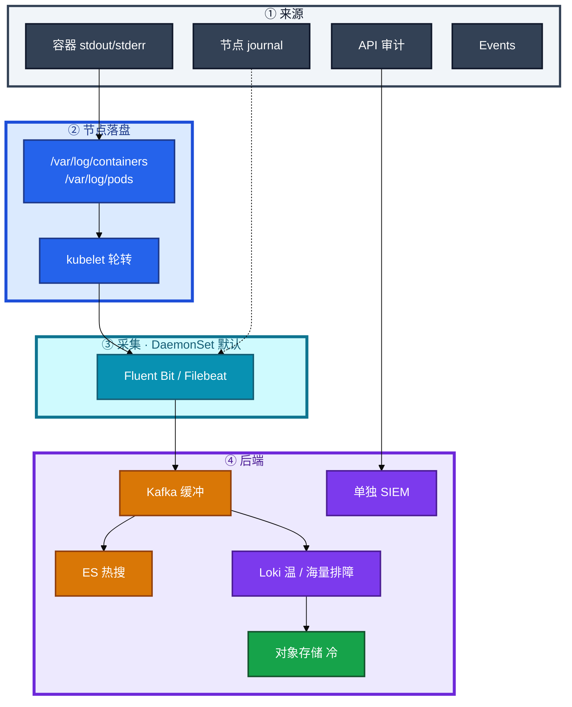
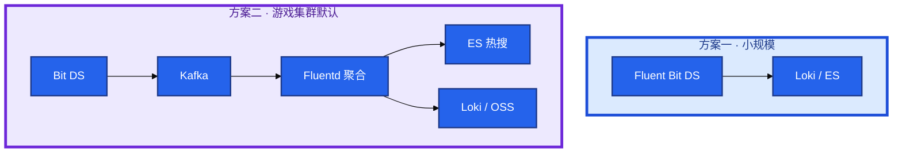
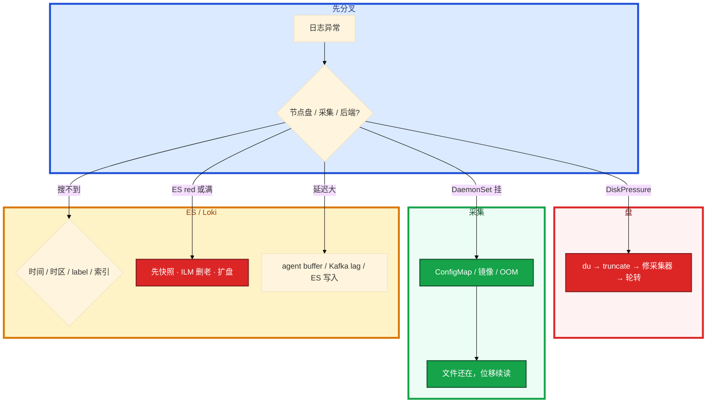

# 日志管理


活动夜大厅刚才崩了。群里有人问「日志呢」，另有人 `kubectl logs` 是空的。节点已经 DiskPressure，匹配服开始 Evict。有人去改 `/etc/logrotate.d`——那是主机日志，救不了容器路径。

**本章主线（日志就按这三步想）：**

1. **认链**：stdout → 节点文件 → 采集器 → 索引 / 对象存储。
2. **分对象**：kubelet 轮转容器日志；`/etc/logrotate.d` 管主机 — 改错对象救不了 DiskPressure。
3. **止血**：盘满先清节点；ES red 看 shard / 水位，不要先重启业务。

**读完你能：** 白板上画出 stdout 到能搜到的整条链；采集挂了能判断文件还在不在；会轮转、truncate、双写、热温冷；盘满和 ES red 分别怎么止血。

## 本章目录

- [1. 基本概念](#1-基本概念)
- [2. 架构图](#2-架构图)
- [3. 原理](#3-原理)
- [4. 安装部署](#4-安装部署)
- [5. 核心配置](#5-核心配置)
- [6. 命令与操作](#6-命令与操作)
- [7. 生产排障](#7-生产排障)
- [8. 必会 · 常考](#8-必会--常考)
- [合上书](#合上书问自己)

**本章不讲：** 本机 journald / rsyslog / **logrotate** → [02-22 日志运维](../../02-基础底座/22-日志运维/)；Prometheus、SLO、exemplar → [18 监控](../18-监控与可观测性/)；Events 排障、先落盘 → [17](../17-排障实战/)；API 审计策略字段 → [03](../03-API-Server/)；节点 DiskPressure 驱逐机制 → [16](../16-节点运行时与升级/)。

---

## 1. 基本概念

K8s 里能搜到之前，日志先是 **节点上的文件**。容器进程写 stdout/stderr，containerd 落到节点，kubelet 按大小轮转，采集器读文件再送走。`kubectl logs` 读的就是这些文件，不是一条魔法通道。

**值班里怎么认现象**（先听群里说什么，再对表）：

| 群里说的 | 技术含义 | 你的第一刀 |
|----------|----------|------------|
| `kubectl logs` 空 | 文件被转没 / 路径错 | 节点 `ls /var/log/containers` |
| 节点 DiskPressure | 容器日志或 overlay 满 | `du` 找最大文件 |
| Kibana 搜不到 | 时区/索引/label/采集 | 先确认文件在不在 |
| ES 红了 | shard/水位 | 先快照，别删主分片 |
| 采集器挂了 | 文件还在涨 | 修 DaemonSet，不是说日志没了 |

四类日志不要混成「都进同一个 index」：

| 类型 | 来源 | 用途 | 别混 |
|------|------|------|------|
| **容器日志** | stdout/stderr | 业务排障 | kubelet 轮转 |
| **节点日志** | journalctl | kubelet、containerd | 主机 logrotate（02-22） |
| **审计日志** | API Server | 谁动过什么 | 单独存、单独权限 |
| **Events** | K8s | 调度失败、拉镜像 | 易过期，P0 先落盘（17） |

> **记住**：kubelet 管 **容器日志文件** 的轮转；`/etc/logrotate.d` 管的是主机文件。改错对象救不了 DiskPressure。

**面试怎么说**：「容器日志是 stdout 落节点文件，kubelet 轮转，DaemonSet 采集；盘满先救节点 truncate，采集器挂了文件还在涨。」

---

## 2. 架构图

后面部署、命令、排障都对着这张图。



**读图三句话：**

1. **采集器只读挂载节点文件**，不代替 kubelet 轮转。
2. **活动高峰中间加 Kafka**：堆积在队列上，ES/Loki 按能力拉；Bit 直打 ES 会把写入打满。
3. **审计不进业务 index**；Events 另路，P0 先落盘。



---

## 3. 原理

### 3.1 从 stdout 到文件

**一句话：** 容器 stdout 由 containerd 写节点文件，kubelet 轮转，采集器只读。

**打个比方**：stdout 像员工往收发室扔纸条——纸条先堆在收发室柜子（节点文件），kubelet 定期清旧柜；快递员（采集器）来取走，不是员工直接寄到总部。

**现场走一遍**（CrashLoop 后 `kubectl logs --previous` 空）：

1. 看当前和上一轮：

```bash
kubectl logs battle-abc -n game -c battle --previous
kubectl get pod battle-abc -n game -o wide
```

2. `--previous` 空——可能轮转清了。SSH 节点：

```bash
ls -lh /var/log/containers/*battle*
ls -lh /var/log/pods/game_battle-abc*/
```

3. 屏幕：

```text
-rw-r----- 1 root root  52M  ...  battle-abc_battle-xxx.log
-rw-r----- 1 root root  48M  ...  battle-abc_battle-xxx.log.1
```

4. 文件在——`kubectl logs` 读的就是这份；上一轮可能被 `.1` 轮转走，时间窗口要对上。

5. 采集器位移还在则恢复后续读；丢了会重放或缺一段。

**输出解读**：

| 路径 | 含义 |
|------|------|
| `/var/log/containers/*.log` | 软链风格入口 |
| `/var/log/pods/<ns>_<pod>/<container>/` | 实体文件 |
| `*.log.1` | 上一轮轮转 |
| 采集器挂 | 文件继续涨，不等于「日志没了」 |

采集器挂了 **文件还在盘上继续涨**。不要假设「磁盘上的一定都进了 ES」。

**面试怎么说**：「kubectl logs 读的是节点 /var/log/pods 文件；--previous 空可能是轮转清了，我上节点 ls 确认实体还在不在。」

### 3.2 DaemonSet vs Sidecar

**一句话：** 默认每节点一个 DaemonSet 读 `/var/log/containers`；Sidecar 只给改不了 stdout 的例外。

**打个比方**：DaemonSet 像每栋楼一个邮差；Sidecar 像每个住户门口再雇一个专递——1000 户就是 1000 份工资。

**现场走一遍**（Java 战斗服写 `game.log` 不写 stdout）：

1. 错误做法：每个 Pod 塞 Fluent Bit sidecar → 1000 Pod = 1000×50–100Mi。

2. 正确顺序：能改就改 stdout；改不动才给 **该工作负载** Sidecar。

3. 验证 DaemonSet：

```bash
kubectl -n logging get ds fluent-bit -o wide
kubectl -n logging logs ds/fluent-bit --tail=20
```

4. 屏幕：

```text
[info] [input:tail:tail.0] inotify_fs_add(): inode=... watch=/var/log/containers/hall-xxx.log
[info] [output:loki:loki.0] HTTP status=204
```

5. records_out 在涨 → 采集正常。

**输出解读**：

| | DaemonSet | Sidecar |
|--|-----------|---------|
| 资源 | 节点级一份 | 每 Pod 50–100Mi |
| 故障面 | 一节点暂时不采，文件还在 | 只影响该 Pod |
| 坑 | 挂了盘继续涨 | 同 cgroup OOM 拖垮业务 |

Fluent Bit（C，<5Mi）边缘 DS；Fluentd（Ruby）Kafka 后聚合。multiline 能配在 DS 上就不要上 Sidecar。

**面试怎么说**：「默认 DaemonSet 只读挂载节点日志；Sidecar 只给写不了 stdout 的老应用，不是每个游戏 Pod 默认一个。」

### 3.3 EFK vs Loki：索引什么、查什么

**一句话：** ES 全文倒排任意搜；Loki 只索引 label，正文 grep 须先收窄。

**打个比方**：ES 像图书馆全文检索——慢但什么都能搜；Loki 像按书架号找书再翻页——书架号（label）不对，翻全书会超时。

**现场走一遍**（充值失败，要在日志里找）：

1. **排障 grep**（99% 大厅/战斗）：

```logql
{app="hall", namespace="game"} |= "user_login" |= "traceId=abc123"
```

2. Loki 先 label 收窄到 `app=hall`，再 grep 正文 `traceId`。

3. **复杂全文**（支付报文对账）→ ES KQL：

```text
index:payment-* AND orderId:"ORD-20240828-001"
```

4. Loki 全库 `|= "ORD-..."` 没 label → 慢/超时，不是坏了。

**输出解读**：

| | EFK | Loki |
|--|-----|------|
| 索引 | 全文倒排 | **只索引 label** |
| 查询 | KQL 任意搜 | label 收窄 + grep |
| 成本 | JVM、分片 | 轻、压缩高 |
| 适合 | 复杂全文、已有 ES 团队 | 海量排障、Grafana 一把 |
| 游戏默认 | Kafka 双写：热搜 ES，长期 Loki/OSS | |

`userId`、`traceId`、`pod_ip` **不能**当 Loki label——放正文或 structured metadata。Nginx access **先 Prometheus 指标再对 5xx 抽日志**。

**面试怎么说**：「排障 grep 用 Loki，先 label 再正文；复杂全文用 ES。游戏集群常见 Kafka 双写，label 基数和 Prometheus 一样不能乱打。」

### 3.4 结构化与三支柱

**一句话：** JSON 结构化 + traceId 才能把 Metrics、Logs、Traces 串成一条故事。

**打个比方**：三支柱像破案——监控发现「案发时间」（Metrics），日志是「证人证词」（Logs），Trace 是「监控录像回放」（Traces）；没有 traceId 就像证人说不清几点几分。

**现场走一遍**（Grafana P99 高了，要点到慢请求）：

1. 指标 exemplar 或 RED 面板发现 `gateway` P99 尖刺 10:30:15。

2. 日志搜：

```json
{"timestamp":"2024-01-15T10:30:15Z","level":"WARN","msg":"slow_query","traceId":"abc123","duration_ms":820}
```

3. 点 traceId → Tempo/Jaeger 看调用链：慢在 `payment-db` 查询 800ms。

4. 字段必须有：timestamp、level、msg；建议 service、pod、namespace、**traceId**。禁止密码、token、手机号。

**输出解读**：


traceId 在 Ingress/网关生成，HTTP header / gRPC metadata 往下传（14、18）。应用用 zap/structlog/Logback JSON，别指望采集器把纯文本解析完美。三套后端没有统一 traceId = 三份账单。

**面试怎么说**：「三支柱靠 traceId 串；Metrics exemplar 点进 Trace，日志 JSON 带 traceId。没 traceId 只能按时间碰运气。」

---

## 4. 安装部署

| 项 | 选 | 不选 |
|----|----|------|
| 采集形态 | 节点 DaemonSet，只读挂载 | 每个游戏 Pod 默认 Sidecar |
| 边缘 agent | Fluent Bit | 节点上满配 Fluentd |
| 高峰缓冲 | Kafka（或云队列） | Bit 直打 ES |
| 后端 | Loki 排障 + 按需 ES 热搜 | 所有行进同一个 ES index |
| 日志盘 | 独立分区 / 独立盘 | 和 etcd、容器可写层同盘 |

落地你实际看到什么：

| 路径 / 对象 | 内容 |
|-------------|------|
| `/var/log/containers/`、`/var/log/pods/` | **这就是数据** |
| kubelet `containerLogMaxSize` / `MaxFiles` | 容器文件轮转 |
| logging NS Fluent Bit DS | 每节点一个 agent |
| agent 位移文件 | 恢复从哪续读 |
| Kafka topic / ES index / Loki tenant | 后端 |

验收：DaemonSet desired=ready，agent `records_out` 在涨，抽一条已知日志能在 Grafana/Kibana 搜到。战斗节点日志量远大于控制面；采集器挂是 **P1**——长时间不采 → 盘满 → Evict。

---

## 5. 核心配置

| 参数 | 常见默认 | 生产怎么用 | 改错会怎样 |
|------|----------|------------|------------|
| `containerLogMaxSize` | ~10Mi | **50Mi** | 太小崩溃现场被转没 |
| `containerLogMaxFiles` | 3 | **5** | 同上 |
| 日志分区 | 跟根盘 | **独立盘** | 打满拖垮 kubelet/etcd |
| Loki label | 随便贴 | 低基数：app/ns/level | 高基数打爆 |
| ES 单 shard | 随手 50 | 目标 **10–50GB** | 分片爆炸 |
| ES 堆 | 机器一半 | **≤32Gi** | 超 32Gi 压缩指针失效 |
| flood watermark | 85%/90%/95% | 盯磁盘 | 超 85% 写入 429 |
| 热保留 | 无限 | **7–14 天** | 账单爆炸 |

保留分层：热 7–14 天；温 30–90 天；冷 6–12 月对象存储；交易 90 天热 + 1 年归档；审计 6–12 月单独库。ES ILM hot→warm→cold→delete。日志副本通常 **1** 够排障。

```yaml
# kubelet config
containerLogMaxSize: 50Mi
containerLogMaxFiles: 5
```

> **记住**：轮转再大也扛不住生产 DEBUG 和 CrashLoop 刷屏。根治在应用级别和采集器存活。

---

## 6. 命令与操作

### 6.1 值班速查

```bash
kubectl logs <pod> -n <ns> -c <c> --previous
kubectl -n logging get ds,po -o wide
kubectl -n logging logs ds/fluent-bit --tail=50
df -h /var/log && du -sh /var/log/containers/* | sort -rh | head
kubectl describe node <n> | grep -A5 Conditions
kubectl get events -n <ns> --sort-by='.lastTimestamp'
```

| 目的 | 命令 | 看什么 |
|------|------|--------|
| 上一轮崩溃 | `logs --previous` | 轮转清掉则空 |
| 节点实体 | `ls /var/log/containers/` | 文件在不在、谁最大 |
| 主机组件 | `journalctl -u kubelet -u containerd` | 节点日志 |
| 采集器 | `logs ds/fluent-bit` | 解析失败、OOM、拒写 |
| ES 健康 | `GET _cat/health?v` | green 才能当搜得到 |
| ES 分片 | `GET _cat/shards?v` | red=主分片没了 |
| Loki | `{app="hall"} \|= "user_login"` | 先 label 再 grep |

### 6.2 轮转与独立盘

kubelet `containerLogMaxSize: 50Mi`、`MaxFiles: 5`。日志分区独立盘。生产禁止 DEBUG 海量刷。CrashLoop 每次启动刷几万行——先修应用。

### 6.3 DiskPressure 止血

节点 Evict 时 **先救节点**，日志可以后补。truncate 丢未采部分。

```bash
du -sh /var/log/containers/* | sort -rh | head
truncate -s 0 /var/log/containers/xxx.log
kubectl -n logging logs ds/fluent-bit --tail=50
```

盘满四条：应用狂打、CrashLoop 刷屏、采集器挂只写不采、Events 爆炸。主机 logrotate 救不了容器路径。

### 6.4 热温冷与双写

ES 必须 ILM rollover。Kafka 双写：Bit 读文件投递；Fluentd 聚合后热搜进 ES（7–14 天），长期进 Loki/OSS。活动日单独配额，保 ERROR 丢 DEBUG。Kafka lag 涨、ES 还绿——瓶颈在聚合层，不要先 truncate 节点。

### 6.5 审计与 Events

审计 `--audit-log-path` + policy，进单独 SIEM（03）。Events P0 先落盘（17），不要指望一周后还能在 API 里翻到。

监控指标（Prometheus）：

| 指标 | 阈值 | 级别 |
|------|------|------|
| DaemonSet ready/desired | `!=` | **P1** |
| agent records_in >> out | 持续 | P1 |
| Kafka consumer lag | 活动飙升 | P1 |
| `/var/log` 使用率 | **>80%** | P1 |
| ES cluster health | red | **P0** |
| ES 磁盘 | **>85%** | flood 429 |

---

## 7. 生产排障

三问 + **文件还在不在、后端还搜不搜得到**。



| 现象 | 先做什么 | 不要做什么 |
|------|----------|------------|
| DiskPressure / Evict | truncate 救节点，再修采集 | 先改主机 logrotate |
| 采集器全挂 | 配置/镜像/OOM；文件还在 | 说「日志全没了」 |
| ES red | 先快照，再看主分片 | 手删可能还有主分片的数据 |
| ES yellow | 副本没分配 / 水位 | 当搜不到去重建集群 |
| 写入 429 | flood 85% 或线程池 | 当 Kibana 坏了 |
| Loki 超时 | 先收窄 label | 全库 grep 当故障 |
| Kafka lag 涨 ES 还绿 | 聚合层 | 先 truncate 节点 |
| 查不到支付失败 | 时区、索引、label、采样 | 先删索引 |

活动日 ES yellow，有人准备删主分片「腾空间」——yellow 多半是副本。red = 主分片没了，P0。不要为了「找日志」重启还活着的战斗服。

---

## 8. 必会 · 常考

| 说法 | 对错 | 口径 |
|------|:----:|------|
| `kubectl logs` 是独立通道，不读节点文件 | 错 | 读的就是 `/var/log/pods` |
| 容器日志满了改 `/etc/logrotate.d` | 错 | kubelet 管容器文件 |
| 默认给每个游戏 Pod 上日志 Sidecar | 错 | 默认 DaemonSet |
| Loki 不能搜正文 | 错 | 能 grep，须先 label 收窄 |
| 全文一定要 ES | 错 | 排障 grep 用 Loki 更便宜 |
| 采集器挂了日志立刻没了 | 错 | 文件还在；盘满才真丢 |
| 盘满先修采集再 truncate | 错 | Evict 已发生时先救节点 |
| Nginx access 全量进 ES | 错 | 先指标，5xx 再抽日志 |
| 审计和业务一个 index | 错 | 权限、保留、ILM 都冲突 |
| ES red 先删索引腾空间 | 错 | 先快照；red=主分片没了 |
| 三套后端装了就是可观测 | 错 | 没有统一 traceId 只是三份账单 |
| truncate 不丢数据 | 错 | 丢未采部分 |
| 日志要 3 副本 | 错 | 排障通常 1 副本；审计另说 |
| `userId` 当 Loki label | 错 | 高基数；放正文 |

数字：轮转 **50Mi×5**；热 **7–14 天**、温 **30–90 天**、冷 **6–12 月**；ES shard **10–50GB**；堆 **≤32Gi**；flood **85%**；Fluent Bit **<5Mi**；Sidecar **50–100Mi**/Pod；采集器挂 **P1**；ES red **P0**。

易混：kubelet 轮转 vs 主机 logrotate；DaemonSet vs Sidecar；ES 全文 vs Loki label；yellow vs red；Kafka lag vs 节点盘满；文件还在 vs 已经进存储。

---

## 合上书，问自己

1. stdout 落到哪两个目录？谁轮转、谁采集、`kubectl logs` 读的是什么？
2. 默认为什么用 DaemonSet？三种才上 Sidecar 的情况？Bit 和 Fluentd 怎么分工？
3. EFK 和 Loki 索引差在哪？游戏集群为什么常见 Kafka 双写？label 基数雷是什么？
4. 盘满第一刀？truncate 丢不丢？采集器恢复后会不会重放？
5. JSON 必带哪些字段？traceId 从哪来？access 全量进 ES 为什么是第一坑？
6. ES red / yellow / 429 分别做什么？审计为什么不能和业务一个 index？

六题都能口述，这一章就过了。下一章把「人不能一直 kubectl」写成控制器：CRD 只注册类型，没有 Operator 那坨 YAML 谁也不会去执行。
