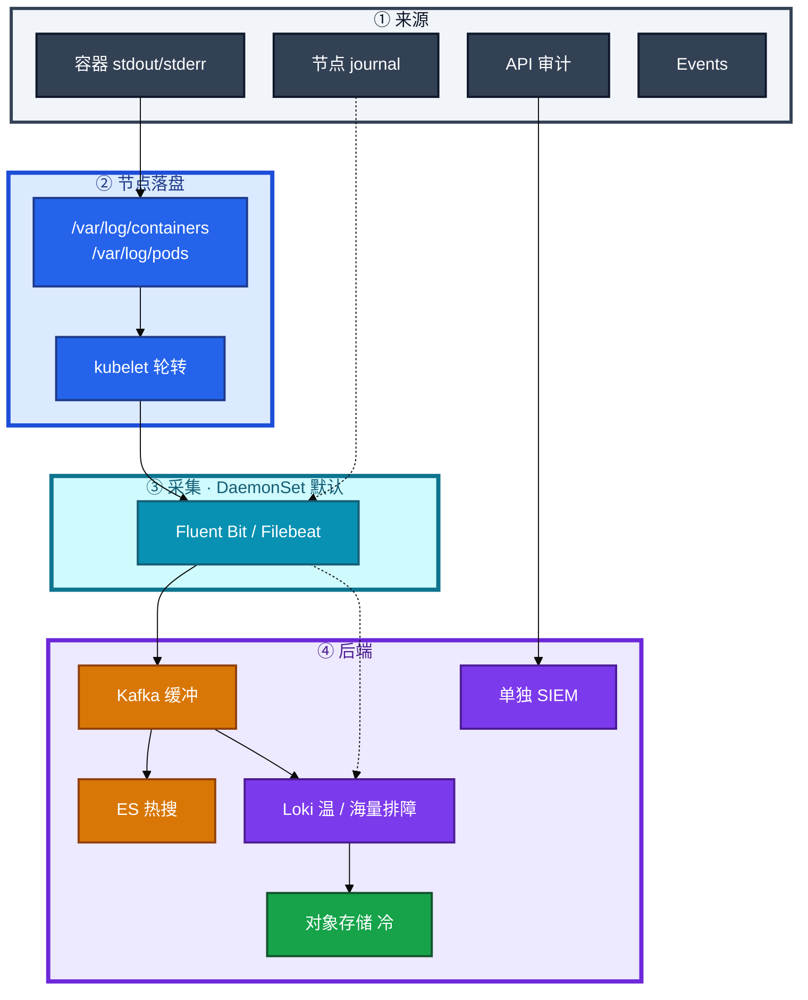
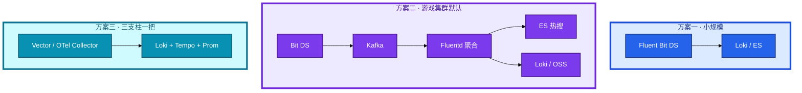
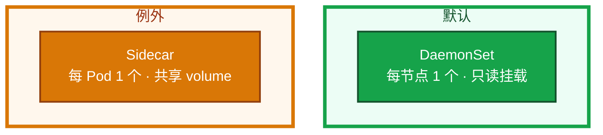
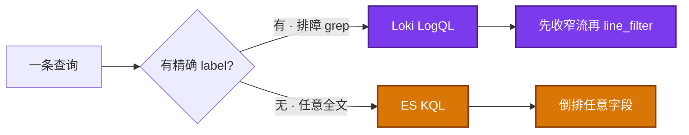
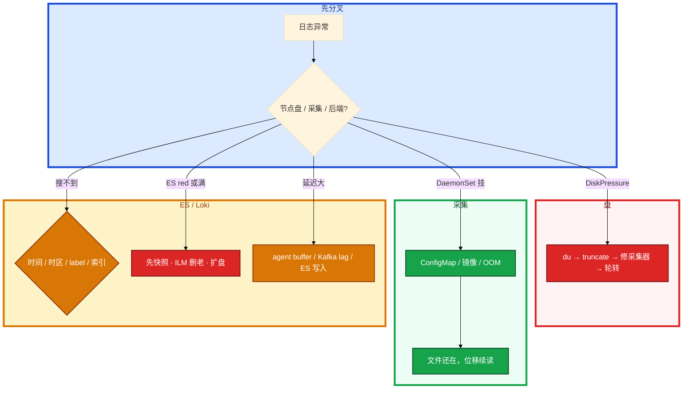

# 日志管理


活动夜大厅刚才崩了。群里有人问「日志呢」，另有人 `kubectl logs` 是空的。节点已经 DiskPressure，匹配服开始 Evict。有人去改 `/etc/logrotate.d`。

先别动手。这一章后半全是你会动手的：**文件在哪、谁轮转、采集挂了盘会不会满、EFK 和 Loki 怎么选、ES 红了第一刀。** 前面的概念和架构，是为了让你动手时不选错路。

**读完你能：** 白板上画出 stdout 到能搜到的整条链；采集挂了能判断文件还在不在；会轮转、truncate、双写、热温冷；盘满和 ES red 分别怎么止血。

## 本章目录

缩进 = 上下级。3 下面才是 3.1。

想钉在**正文左边**跟着滚：菜单 **查看 → 打开视图 → 大纲**。Markdown 预览做不到独立左栏，目录只能写在文章开头。

- [1. 基本概念](#1-基本概念)
- [2. 架构图](#2-架构图)
- [3. 原理](#3-原理)
  - [3.1 从 stdout 到文件](#31-从-stdout-到文件)
  - [3.2 DaemonSet vs Sidecar](#32-daemonset-vs-sidecar)
  - [3.3 EFK vs Loki](#33-efk-vs-loki索引什么查什么)
  - [3.4 结构化与三支柱](#34-结构化与三支柱)
- [4. 安装部署](#4-安装部署)
- [5. 核心配置](#5-核心配置)
- [6. 常用命令](#6-常用命令)
- [7. 常用操作](#7-常用操作)
  - [7.1 轮转与独立盘](#71-轮转与独立盘)
  - [7.2 DiskPressure 止血](#72-diskpressure-止血)
  - [7.3 热温冷与双写](#73-热温冷与双写)
  - [7.4 审计与 Events](#74-审计与-events)
- [8. 生产排障](#8-生产排障)
- [9. 必会 · 常考](#9-必会--常考)
- [合上书](#合上书问自己)

**本章不讲：** 本机 journald / rsyslog / **logrotate** → [02-22 日志运维](../../02-基础底座/22-日志运维/)；Prometheus、SLO、exemplar → [18 监控](../18-监控与可观测性/)；Events 排障、先落盘 → [17](../17-排障实战/)；API 审计策略字段 → [03](../03-API-Server/)；节点 DiskPressure 驱逐机制 → [16](../16-节点运行时与升级/)。

---

## 1. 基本概念

K8s 里能搜到之前，日志先是 **节点上的文件**。容器进程写 stdout/stderr，containerd 落到节点，kubelet 按大小轮转，采集器读文件再送走。`kubectl logs` 读的就是这些文件，不是一条魔法通道。

四类日志不要混成「都进同一个 index」：

| 类型 | 来源 | 用途 | 别混 |
|------|------|------|------|
| **容器日志** | stdout/stderr | 业务排障 | 默认走 kubelet 轮转 |
| **节点日志** | journalctl | kubelet、containerd、kernel | 主机 logrotate 管这段（02-22） |
| **审计日志** | API Server | 谁动过什么 | 单独存、单独权限、单独保留 |
| **Events** | K8s | 调度失败、拉镜像 | 易过期，P0 先落盘（17） |

`kubectl logs` 空，去节点上看：文件在不在、轮转是不是把上一份清了、采集器有没有把文件锁坏。Events 默认只留一小时量级。

> **记住**：kubelet 管 **容器日志文件** 的轮转；`/etc/logrotate.d` 管的是主机文件。改错对象救不了 DiskPressure。

---

## 2. 架构图

先把整张图钉住。后面部署、命令、排障都对着这张图说话。



图上三条线：

1. **采集器只读挂载节点文件**，不代替 kubelet 轮转。
2. **活动高峰中间加 Kafka**：堆积发生在队列上，ES / Loki 按能力拉；Fluent Bit 直接打 ES 会把写入打满。
3. **审计不进业务 index**。Events 另路，P0 先落盘。

三种生产形态（装的时候选，挂的时候故障域不一样）：



游戏大厅活动夜每秒几万行，方案二是默认。云日志（SLS/CLS）省人，账单盯扫描量，查询 `*` 能把月预算打穿。混合也常见：热 7 天云上，冷归档 OSS。

---

## 3. 原理

原理只保留动手和面试会用到的：文件谁写、谁采、后端怎么索引、三支柱怎么串。

**本节 4 块：** 3.1 文件 · 3.2 采集形态 · 3.3 EFK/Loki · 3.4 结构化

### 3.1 从 stdout 到文件


路径两套并存：`/var/log/containers/*.log` 是软链风格入口；实体多在 `/var/log/pods/<ns>_<pod>/<container>/*.log`。`kubectl logs --previous` 读上一轮崩溃那份，轮转清掉就没了。

采集器挂了 **文件还在盘上继续涨**。位移文件还在，拉起来从上次读；位移丢了会重放（重复）或从当前截断处续（缺一段）。不要假设「磁盘上的一定都进了 ES」。

### 3.2 DaemonSet vs Sidecar

生产默认 **每节点一个采集 agent（DaemonSet）**，读 `/var/log/containers/`。Sidecar 每 Pod 一份，贵，只给写不了 stdout 的老应用。



才用 Sidecar 的三种情况：应用只写文件改不动 stdout、要在采集端拼 Java 多行 stack、要按文件打不同 tag。Fluent Bit 也有 multiline parser，能配在 DaemonSet 上就不要上 Sidecar。

Java 战斗服写 `game.log` 不写 stdout。有人给每个 Pod 都塞 Fluent Bit sidecar，集群多了几千个容器。正确：能改就改成 stdout；改不动再给 **这一个工作负载** 上 Sidecar。

| | DaemonSet | Sidecar |
|--|-----------|---------|
| 资源 | 节点级一份 | 1000 Pod = 1000 × 50–100Mi |
| 故障面 | 一节点暂时不采，文件还在 | 只影响该 Pod |
| 坑 | 挂了盘继续涨 | 同 cgroup OOM 拖垮业务；启动顺序；资源账漏 |

Fluent Bit（C，&lt;5Mi）适合边缘 DaemonSet；Fluentd（Ruby，插件多）适合 Kafka 后聚合；Filebeat 吃 ES 生态。不要在每个节点跑满配 Fluentd。

### 3.3 EFK vs Loki：索引什么、查什么

新项目有人说「全文搜一定要 ES」。先问：主要是排障 grep，还是复杂检索。

| | **EFK**（ES + Fluent + Kibana） | **Loki** |
|--|------|------|
| 索引 | 全文倒排 | **只索引 label** |
| 查询 | KQL 任意搜 | 先 `{app,ns}` 收窄再 grep |
| 成本 | JVM、分片、rebalance | 轻，压缩高 |
| 运维税 | master / 分片 / flood / red | label 基数炸了一样疼 |
| 适合 | 复杂全文、已有 ES 团队 | 海量排障、和 Grafana 一把 |



Loki **能** grep 正文，但没有倒排，范围一大就慢或超时——这是设计，不是坏了。查不到：ES 先看时间范围、时区、索引模式；Loki 先看 label 有没有把范围收窄。

**label 基数是 Loki 的 quota。** `userId`、`traceId`、`pod_ip` 当 label = 爆炸。这些放正文或 structured metadata；label 只留 service / namespace / pod / level / 环境。ES 对应坑是动态 mapping 无限膨胀、`trace_id` 没用 keyword。

选型：

| 场景 | 选 |
|------|----|
| 小规模 / 新项目 / 和监控同一套 UI | Loki + Grafana |
| 已有搜索团队、支付/安全要复杂全文 | EFK |
| 游戏集群海量 + 偶发全文 | **Kafka 双写**：热搜进 ES，长期进 Loki / OSS |
| 云上省人 | SLS/CLS，盯扫描和 `*` |

游戏落地：大厅/战斗服排障 99% 是 `{app="hall"}` 再 grep `userId=` 或 `traceId=`，Loki 够。充值对账、风控翻支付报文，才值得进 ES。Nginx access **先做 Prometheus 指标再对 5xx 抽日志**——全量进 ES 是成本第一坑。

> **记住**：要任意全文用 ES，海量按服务排障用 Loki；两者可以双写。Loki 不是「不能搜正文」，是「必须先 label 收窄」。

### 3.4 结构化与三支柱

Grafana 上 P99 高了，要点到那一次慢请求。非结构化靠正则，结构化 JSON 才能按字段查、才能带 **traceId**。

```json
{"timestamp":"2024-01-15T10:30:00Z","level":"INFO","msg":"user_login","userId":12345,"traceId":"abc123"}
```

必须有 timestamp、level、msg；建议 service、pod、namespace、traceId。禁止密码、token、手机号。traceId 在 Ingress / 网关生成，HTTP header / gRPC metadata 往下传（14、18）。


Metrics 侧用 exemplar 挂 traceId，Grafana 能点过去。这是三支柱「一套体系」的答法，不是三个独立产品。应用用 zap / structlog / Logback JSON，不要指望采集器把纯文本解析完美。日志里没有 traceId，只能按时间和 Pod 名碰运气。

---

## 4. 安装部署

生产怎么选：

| 项 | 选 | 不选 |
|----|----|------|
| 采集形态 | 节点 DaemonSet，只读挂载 | 每个游戏 Pod 默认 Sidecar |
| 边缘 agent | Fluent Bit | 节点上满配 Fluentd |
| 高峰缓冲 | Kafka（或云队列） | Bit 直打 ES |
| 后端 | Loki 排障 + 按需 ES 热搜 | 所有行进同一个 ES index |
| 日志盘 | 独立分区 / 独立盘 | 和 etcd、容器可写层同盘 |
| 云日志 | 热 7 天 + 冷 OSS | 无上限 `*` 查询 |

落地你实际看到什么：

| 路径 / 对象 | 内容 |
|-------------|------|
| `/var/log/containers/`、`/var/log/pods/` | **这就是数据** |
| kubelet `containerLogMaxSize` / `MaxFiles` | 容器文件轮转 |
| logging NS 里 Fluent Bit DaemonSet | 每节点一个 agent |
| agent 位移文件（tail cursor） | 恢复从哪续读 |
| Kafka topic / ES index / Loki tenant | 后端 |

验收：DaemonSet desired = ready，agent `records_out` 在涨，抽一条已知日志能在 Grafana/Kibana 搜到。不要只看 Pod Running。

游戏集群：战斗节点日志量远大于控制面；大厅和匹配在活动窗口单独配额，保 ERROR 丢 DEBUG。采集器挂是 **P1**，不是「过几天再说」——长时间不采 → 盘满 → Evict 游戏服。

---

## 5. 核心配置

只动有证据的项。kubelet 轮转改完等 kubelet 生效；agent 改 ConfigMap 会滚动 DaemonSet，先 `fluent-bit -c` 干跑或金丝雀一个节点。

| 参数 | 常见默认 | 生产怎么用 | 改错会怎样 |
|------|----------|------------|------------|
| `containerLogMaxSize` | ~10Mi | **50Mi** | 太小崩溃现场被转没；太大盘更快满 |
| `containerLogMaxFiles` | 3 | **5** | 同上 |
| 日志分区 | 跟根盘 | **独立盘** | 打满拖垮 kubelet / etcd |
| Loki label | 随便贴 | 低基数：app/ns/level | 高基数打爆 index |
| ES 单 shard | 随手 50 | 目标 **10–50GB** | 每天 ×50 分片 ×30 天打死 master |
| ES 堆 | 机器一半 | **≤32Gi** 且 ≤ 一半内存 | 超 32Gi 压缩指针失效 |
| flood watermark | 85% / 90% / 95% | 盯磁盘 | 超 85% 写入 429 |
| refresh | 1s | 日志场景可 **30s** | 换吞吐，搜稍延迟 |
| 热保留 | 无限 | **7–14 天** | 账单和分片爆炸 |

保留分层：

| 级别 | 保留 | 放哪 |
|------|------|------|
| 热 | 7–14 天 | ES 或 Loki 热 |
| 温 | 30–90 天 | 冷节点 / Loki |
| 冷 | 6–12 月 | 对象存储 |
| 交易/充值 | 90 天热 + 1 年归档 | 合规另算 |
| DEBUG | 不进生产或 1 天 | — |
| 审计 | 6–12 月单独库 | 不能和业务混 |

ES：ILM hot → warm → cold → delete。生产 master **专用 3 台**，不要和 data 兼——日志高峰会把选举和 GC 叠在一起变红。`trace_id` 用 keyword。禁止动态字段无限膨胀。日志副本通常 **1** 够排障；审计和交易另说。

> **记住**：轮转再大也扛不住生产 DEBUG 和 CrashLoop 刷屏。根治在应用级别和采集器存活，不在把 MaxFiles 调到 50。

---

## 6. 常用命令

值班先这几条：

```bash
kubectl logs <pod> -n <ns> -c <c> --previous
kubectl -n logging get ds,po -o wide
kubectl -n logging logs ds/fluent-bit --tail=50
df -h /var/log && du -sh /var/log/containers/* | sort -rh | head
kubectl describe node <n> | grep -A5 Conditions
kubectl get events -n <ns> --sort-by='.lastTimestamp'
```

| 目的 | 命令 | 看什么 |
|------|------|--------|
| 上一轮崩溃 | `kubectl logs --previous` | 文件被转没则空 |
| 节点实体 | `ls /var/log/containers/` | 文件在不在、谁最大 |
| 主机组件 | `journalctl -u kubelet -u containerd` | 节点日志，不是容器 |
| 采集器 | `kubectl -n logging logs ds/fluent-bit` | 解析失败、OOM、下游拒写 |
| ES 健康 | `GET _cat/health?v` | green 才能当搜得到 |
| ES 分片 | `GET _cat/shards?v` / `allocation` | red=主分片没了 |
| Loki | Grafana Explore `{app="hall"} \|= "user_login"` | 先 label 再 grep |

指标（Prometheus）：

| 指标 | 阈值 | 级别 |
|------|------|------|
| DaemonSet ready / desired | `!=` | **P1** |
| agent records_in 远大于 out | 持续 | P1，下游堆积 |
| Kafka consumer lag | 活动窗口飙升 | P1，瓶颈在聚合不是节点盘 |
| `/var/log` 使用率 | **> 80%** | P1；100% = DiskPressure |
| ES cluster health | yellow / red | yellow 查副本；red = **P0** |
| ES 磁盘 | **> 85%** | flood，写入 429 |

日志告警：采集器实时匹配 FATAL（秒级）；入存储后 LogQL / ES 规则看趋势（分钟级）。只告关键 ERROR，加频率阈值，节点挂了 inhibit 该节点应用错误。WARN 不要全告。

---

## 7. 常用操作

### 7.1 轮转与独立盘

```yaml
# kubelet config
containerLogMaxSize: 50Mi
containerLogMaxFiles: 5
```

日志分区独立盘。生产禁止 DEBUG 海量刷。CrashLoop 每次启动刷几万行，轮转再大也扛不住——先修应用。

### 7.2 DiskPressure 止血

节点已经在 Evict 游戏服时，**先救节点**，日志可以后补。truncate 会丢未采部分。


```bash
du -sh /var/log/containers/* | sort -rh | head
truncate -s 0 /var/log/containers/xxx.log    # 止血，不是根治
kubectl logs -n logging ds/fluent-bit --tail=50
```

盘满常见四条：应用狂打、CrashLoop 刷屏、采集器挂了只写不采、Events 爆炸。后果：containerd 写不进、kubelet DiskPressure 驱逐（16、17）、ES 写入失败丢日志。

预防：独立盘、50Mi×5、采集器挂立刻告 P1、生产限级别。主机 logrotate 救不了这条路径。

### 7.3 热温冷与双写

ES 必须 ILM rollover，禁止单索引写三个月。每天一索引 × 50 分片 × 30 天会把 master 打死。

Kafka 双写：Bit 只负责读文件和投递；Fluentd 聚合后热搜进 ES（7–14 天），长期进 Loki 或 OSS。活动日单独配额，保 ERROR 丢 DEBUG。成本杠杆：INFO 采样、access 先指标后抽日志、副本 1、热数据短。

卡住：Kafka 消费延迟涨、ES 还没红——瓶颈在聚合层，不是节点盘。先看 consumer lag，不要先 truncate 节点文件。

### 7.4 审计与 Events

审计：`--audit-log-path` + policy。Secret 可用 RequestResponse，其余 Metadata。进单独 SIEM，权限和保留单独定（03）。混进业务 Kibana：权限过大、ILM 误删、检索噪音。

Events 默认很快过期。P0 排障先落盘（17），不要指望一周后还能在 API 里翻到。

---

## 8. 生产排障

和 01 同一套三问：进程还在不在？还能不能变更？已有流量还通不通？日志场景再加一问：**文件还在不在、后端还搜不搜得到。**



现场顺序：

```bash
df -h /var/log && du -sh /var/log/containers/* | sort -rh | head
kubectl describe node <n> | grep DiskPressure
kubectl -n logging get ds,po
kubectl -n logging logs ds/fluent-bit --tail=200
# ES
GET _cat/health?v
GET _cat/shards?v
GET _cat/allocation?v
```

| 现象 | 先做什么 | 不要做什么 |
|------|----------|------------|
| DiskPressure / Evict | truncate 救节点，再修采集 | 先改主机 logrotate |
| 采集器全挂 | 配置/镜像/OOM；文件还在 | 说「日志全没了」 |
| ES red | 先快照，再看主分片 | 手删可能还有主分片的数据 |
| ES yellow | 副本没分配 / 水位 | 当搜不到去重建集群 |
| 写入 429 | flood 85% 或线程池 | 当 Kibana 坏了 |
| Loki 超时 | 先收窄 label | 全库 grep 当故障 |
| Kafka lag 涨 ES 还绿 | 聚合层 | 先 truncate 节点 |
| 查不到支付失败 | 时区、索引、label、采样 | 先删索引 |

活动日 ES 变 yellow，有人准备删主分片「腾空间」。yellow 多半是副本。green 才能当「搜得到」。red = 主分片没了，P0。

Fluent Bit 位移持久化：恢复后从上次读。监控 agent 的 records_in/out 和 DaemonSet ready。

游戏：活动高峰日志和 etcd 同盘会把控制面 fsync 打爆（02）。正确处理：确认进程还在 → 停止发版 → 救盘 / 采集 / ES → 恢复后再补自愈。不要为了「找日志」重启还活着的战斗服。

---

## 9. 必会 · 常考

白板和追问高频，能一口回：

| 说法 | 对错 | 口径 |
|------|:----:|------|
| `kubectl logs` 是独立通道，不读节点文件 | 错 | 读的就是 `/var/log/pods` 那份 |
| 容器日志满了改 `/etc/logrotate.d` | 错 | kubelet 管容器文件 |
| 默认给每个游戏 Pod 上日志 Sidecar | 错 | 默认 DaemonSet |
| Loki 不能搜正文 | 错 | 能 grep，须先 label 收窄 |
| 全文一定要 ES | 错 | 排障 grep 用 Loki 更便宜 |
| 采集器挂了日志立刻没了 | 错 | 文件还在；盘满才真丢 |
| 盘满先修采集再 truncate | 错 | Evict 已发生时先救节点 |
| Nginx access 全量进 ES | 错 | 先指标，5xx 再抽日志 |
| 审计和业务一个 index | 错 | 权限、保留、ILM 都冲突 |
| ES red 先删索引腾空间 | 错 | 先快照；red = 主分片没了 |
| 三套后端装了就是可观测 | 错 | 没有统一 traceId 只是三份账单 |
| truncate 不丢数据 | 错 | 丢未采部分 |
| 日志要 3 副本 | 错 | 排障通常 1 副本；审计另说 |
| `userId` 当 Loki label | 错 | 高基数；放正文 |

数字：轮转生产常见 **50Mi × 5**；热 **7–14 天**、温 **30–90 天**、冷 **6–12 月**；交易 90 天 + 1 年；审计 6–12 月；ES shard **10–50GB**；堆 **≤32Gi**；flood **85%**；Fluent Bit 边缘 **&lt;5Mi**；Sidecar **50–100Mi**/Pod；采集器挂 **P1**；ES red **P0**。

易混：kubelet 轮转 vs 主机 logrotate；DaemonSet vs Sidecar；ES 全文 vs Loki label；yellow vs red；Kafka lag vs 节点盘满；文件还在 vs 已经进存储；Events vs 审计 vs 业务日志。

---

## 合上书，问自己

1. stdout 落到哪两个目录？谁轮转、谁采集、`kubectl logs` 读的是什么？
2. 默认为什么用 DaemonSet？三种才上 Sidecar 的情况？Bit 和 Fluentd 怎么分工？
3. EFK 和 Loki 索引差在哪？游戏集群为什么常见 Kafka 双写？label 基数雷是什么？
4. 盘满第一刀？truncate 丢不丢？采集器恢复后会不会重放？
5. JSON 必带哪些字段？traceId 从哪来？access 全量进 ES 为什么是第一坑？
6. ES red / yellow / 429 分别做什么？审计为什么不能和业务一个 index？

六题都能口述，这一章就过了。下一章把「人不能一直 kubectl」写成控制器：CRD 只注册类型，没有 Operator 那坨 YAML 谁也不会去执行。
