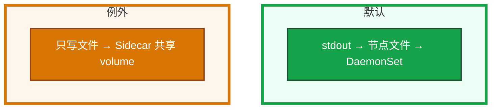
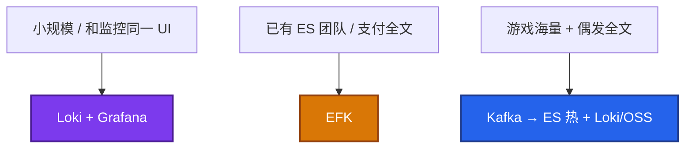

# 19｜日志管理 · 练习题

先自己画图或口述，再对照解答。每题标了覆盖范围：

| 标记 | 含义 |
|------|------|
| **核心** | 不懂整章就没建立起来 |
| **必会** | 值班和面试都要能讲 |
| **常用** | 线上会反复碰到 |
| **常考** | 白板和追问的高频口径 |

## 本题目录

- [Q1 从进程到能搜到](#q1)
- [Q2 DaemonSet vs Sidecar](#q2)
- [Q3 EFK vs Loki](#q3)
- [Q4 盘满第一刀](#q4)
- [Q5 JSON 与 traceId](#q5)
- [Q6 保留 / ES 运维税](#q6)
- [Q7 采集器全挂](#q7)
- [Q8 审计不能混 index](#q8)
- [Q9 ES red / Loki 超时](#q9)
- [Q10 三支柱怎么串](#q10)
- [合上书](#合上书)

---

## Q1

**★★★★★｜容器日志从进程到能搜到，经过哪几步？**

**覆盖**：核心 · 必会 · 常考

### 场景

白板：「你们日志怎么采的」。有人说「装了 ELK」。说不清文件在哪、谁轮转、谁读。

### 完整解答

能搜到之前，日志先是节点文件。`kubectl logs` 读的就是这份，不是魔法通道。

应用出 JSON，带 traceId。本机 `/etc/logrotate.d` 管主机文件；容器这段是 kubelet（02-22）。

### 再追问

- `--previous` 空？——上一轮文件被轮转清了，或从未写过 stdout。
- Events 算这类吗？——不算。易过期，P0 先落盘（17）。

---

## Q2

**★★★★★｜什么时候才上 Sidecar？Fluent Bit / Fluentd 怎么分工？**

**覆盖**：核心 · 必会 · 常考

### 场景

Java 战斗服写 `game.log` 不写 stdout。有人给每个 Pod 都塞 Fluent Bit sidecar，集群多了几千个容器。

### 完整解答

默认 DaemonSet。Sidecar 只在：只写文件改不动、采集端拼多行、按文件打不同 tag。多行 Java stack 优先试 DaemonSet 的 multiline parser。能改 stdout 就改。

坑：1000 Pod = 1000 agent；sidecar OOM 拖垮业务（同 cgroup）；启动顺序。故障面：DS 挂影响整节点采集（文件还在）；Sidecar 挂只影响该 Pod。

Bit 用 C、&lt;5Mi，当边缘。Fluentd 插件重，当 Kafka 后面的聚合。不要在每个节点跑满配 Fluentd。

### 再追问

Sidecar 当默认，资源账漏在哪？——只算了业务容器，没算每 Pod 50–100Mi 采集器。

---

## Q3

**★★★★★｜EFK 和 Loki 怎么选？Loki 是不是不能搜正文？**

**覆盖**：核心 · 必会 · 常考

### 场景

新集群要上日志。搜索同事要 ES，SRE 嫌 JVM 贵。安全要全文翻支付日志。大厅排障只是 grep userId。

### 完整解答

ES 全文倒排，搜索强、运维重。Loki 只索引 label，轻、先收窄再 grep。Loki **能** grep 正文，范围一大就慢——设计如此。

`userId` / `traceId` 当 Loki label = 基数爆炸，放正文。大厅排障用 Loki；充值对账进 ES。

### 再追问

- 云 SLS/CLS？——省人、按量。盯扫描和 `*`，热 7 天云上、冷 OSS。
- 已经有 IPVS 还要不要……等等那是 23。这里：已经有 ES 还要不要 Loki？——要。ES 热搜短留，Loki/OSS 扛量。

---

## Q4

**★★★★★｜节点被容器日志打满，第一刀是什么？**

**覆盖**：核心 · 必会 · 常用

### 场景

战斗节点 DiskPressure，Pod 开始 Evict。Fluent Bit 昨天就 NotReady，没人理。有人去改 `/etc/logrotate.d`。

### 完整解答

先救节点，再修根因。truncate 会丢未采数据，但 Evict 已在踢游戏服时优先恢复磁盘。主机 logrotate 救不了——那是 02-22。

根治：独立日志盘、50Mi×5、采集器挂 P1、生产限级别。

### 再追问

采集器恢复后会不会重放全部历史？——有位移则从上次读。位移丢了可能重复或从末尾续（缺一块）。不要假设磁盘上的都进了 ES。

---

## Q5

**★★★★☆｜应用日志为什么必须 JSON？敏感信息和 traceId？**

**覆盖**：必会 · 常用 · 常考

### 场景

登录日志是一行纯文本。要查某个 userId 只能正则。有人把手机号也打进去了。Grafana 上 P99 高了点不到那次请求。

### 完整解答

JSON 让采集器直接 parse，ES/Loki 按字段查。必须 timestamp、level、msg；建议 traceId、service、pod。敏感字段应用侧就不打，采集器再滤一层。审计单独存。用语言自带 JSON logger，不要靠 Fluent 正则「大概能拆」。

traceId 在 Ingress/网关生成，header / gRPC metadata 透传。下游漏传，三支柱就串不上（18、14）。

### 再追问

exemplar？——Metrics 挂 traceId，Grafana 能点到 Trace。只堆三套后端没有统一 ID，只是三份账单。

---

## Q6

**★★★★☆｜保留策略怎么定？ES 会红的那些数字？**

**覆盖**：必会 · 常用

### 场景

ES 三个月单索引一直写，master 经常 yellow。财务问为什么日志比业务机器还贵。Nginx access 全量进 ES。

### 完整解答

热 7–14 天可搜，温 30–90 天，冷 6–12 月对象存储。交易 90 天 + 1 年归档。DEBUG 不进生产。ES 必须 ILM rollover。单 shard 10–50GB。堆 ≤32Gi 且不超过机器一半。flood 85% 拒写。master 专用 3 台，不要兼 data。日志副本通常 1。access **先做指标，只对 5xx 抽日志**。

### 再追问

yellow 是不是搜不到？——多半是副本没分配。green 才能当搜得到。先 `_cat/allocation`，别删主分片。

---

## Q7

**★★★★☆｜采集器 DaemonSet 全挂了，日志丢不丢？**

**覆盖**：必会 · 常用

### 场景

改了 Fluent Bit ConfigMap，全节点 CrashLoop。过了两小时才发现。有人说「日志全没了」。

### 完整解答

文件还在节点上，只要盘没满、轮转没把文件转没。全挂多半是配置解析失败或镜像。单节点挂看 OOM / NotReady。恢复后靠位移续读。长时间不采 → 盘满 → 才真正 Evict 和丢。所以采集器挂是 **P1**。

监控 agent uptime、records_in/out、DaemonSet desired≠ready。

### 再追问

怎么做日志告警才不炸？——FATAL 可在 agent 侧秒级匹配；趋势用存储后查询。WARN 不要全告。频率阈值 + 节点级 inhibit。

---

## Q8

**★★★★☆｜审计日志和业务日志为什么不能一个 index？**

**覆盖**：必会 · 常考

### 场景

安全要查谁 get 过 Secret。业务 Kibana 全员只读，里面混了 audit。

### 完整解答

审计回答「谁在何时对何资源做了什么」，API Server audit policy 产出，合规保留 6–12 月，权限单独收。业务日志是运行时。混在一起：权限过大、ILM 误删、检索噪音。配置在 03：`--audit-log-path` + policy，Secret 可用 RequestResponse，其余 Metadata。

### 再追问

Events 算哪类？——集群事件，默认很快过期。P0 先落盘（17），不要指望一周后还能在 API 里翻到。

---

## Q9

**★★★★☆｜ES 变 red 了怎么办？Loki 全库 grep 超时呢？**

**覆盖**：必会 · 常用

### 场景

活动日写入打满，集群 red，Kibana 搜支付日志超时。有人准备删所有索引。另一边 Grafana Loki 直接 `{namespace="game"} |= "error"` 扫全集群。

### 完整解答

red = 有主分片没了，那部分不可搜。P0：先快照，再 `_cat/health` `_cat/shards`。不要手删可能还有主分片的数据。yellow 多半是副本。429 = write 线程池满或磁盘水位。这就是 ES 的运维税。

Loki 超时：先把 label 收到 `app` / `pod`，再 grep。不是坏了。分片爆炸、堆 >32Gi、动态 mapping 膨胀、master 兼 data，都是会红的坑。

### 再追问

Kafka lag 涨但 ES 还绿，先 truncate 节点？——不要。瓶颈在聚合层，先看 consumer lag。

---

## Q10

**★★★★☆｜三支柱怎么关联？只堆 Loki + Prometheus + Jaeger 算不算可观测？**

**覆盖**：必会 · 常考

### 场景

三套都装了。排障仍是「先看 CPU，再 grep 时间附近的日志」，点不开同一条请求。

### 完整解答

排查：延迟指标 → 服务 → 日志 traceId → 调用链。没有统一 ID，三套后端只是三份账单。OTel 的价值是换后端不换埋点，不是「有 Collector 就有 SLO」（18）。

### 再追问

游戏大厅活动夜日志和 etcd 同盘会怎样？——fsync 打爆控制面（02）。独立日志盘；先停发版救盘，不要重启战斗服。

---

## 合上书

- [ ] 能画出 stdout → 节点文件 → kubelet 轮转 → DaemonSet → ES/Loki
- [ ] 能说出默认不上 Sidecar，以及 Bit 边缘 / Fluentd 聚合
- [ ] 能把 EFK vs Loki 讲到索引差、label 基数、Kafka 双写
- [ ] 能处理 DiskPressure：先 truncate，再采集器和轮转；位移决定重放
- [ ] 能定热温冷、ILM、access 不进 ES；审计单独存
- [ ] 能处理 ES red/yellow/429，而不是删主分片
- [ ] 能用 JSON + traceId 把三支柱串起来
