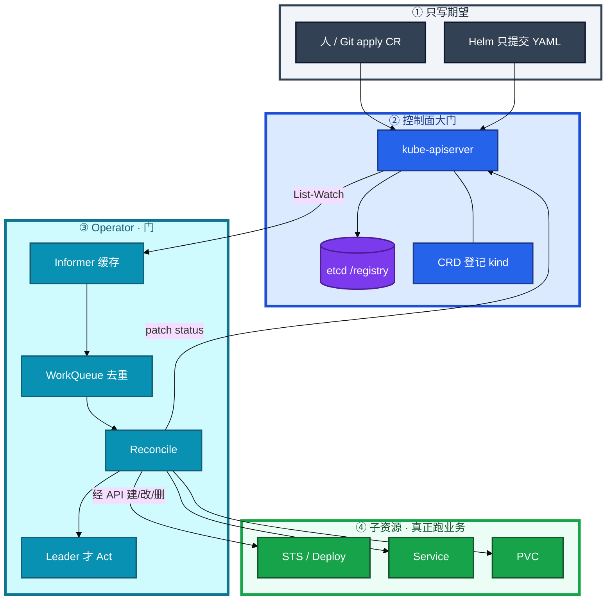
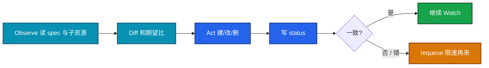
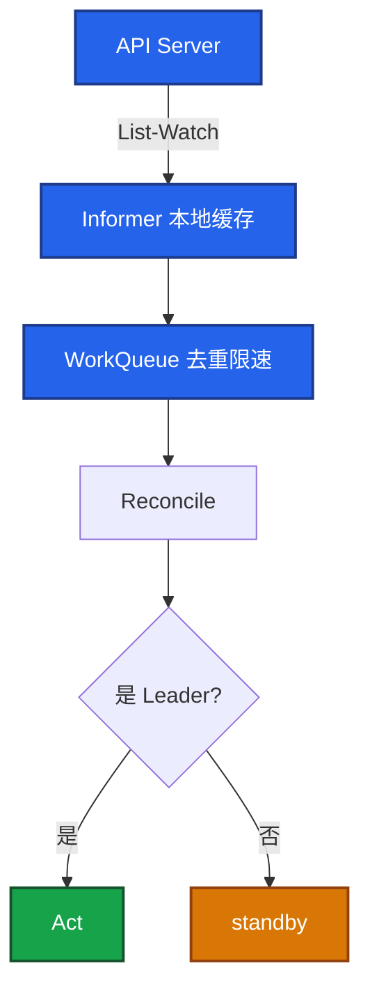
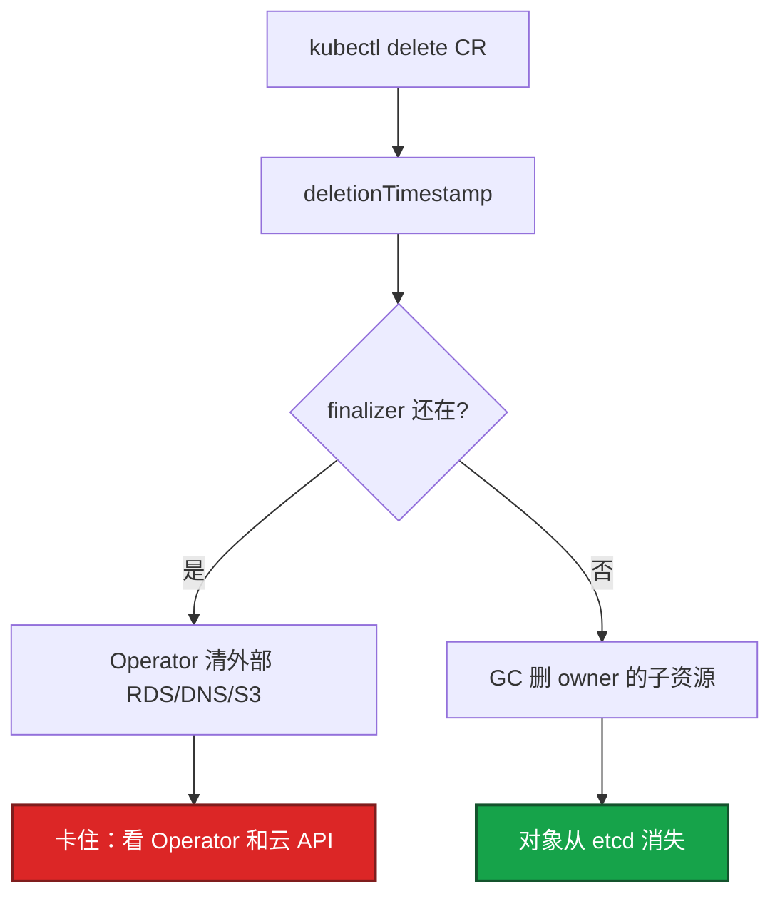
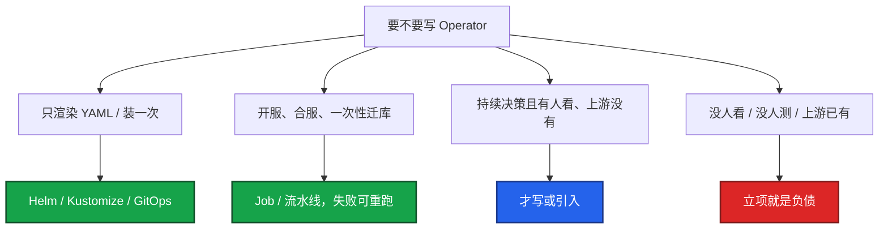
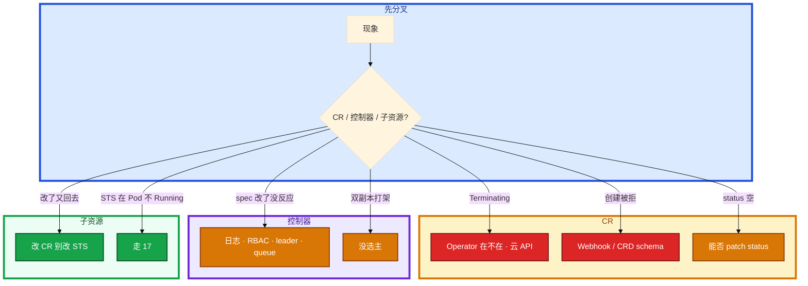

# Operator 与 CRD


集群里能 `kubectl get gameserver`，改 spec 毫无反应。有人要把开服脚本「云原生化」成 15s 调和一次的 Operator。另有人删了管云上 RDS 的 CR，十分钟还在 Terminating，准备手抠 finalizer。

先别动手。这一章后半全是你会动手的：**CR 卡在哪步、Terminating 第一刀、升 CRD 会不会把已有对象打成非法、Operator 挂了要不要重启战斗服。** 前面的概念和原理，是为了让你动手时不把 Job 写成银弹。

**读完你能：** 白板上画出 Observe → Diff → Act；判断该写 Operator 还是 Helm/Job；会看 status、选主、finalizer；升 CRD 知道 conversion；Operator 挂了能说出影响面。

## 本章目录

缩进 = 上下级。3 下面才是 3.1。

想钉在**正文左边**跟着滚：菜单 **查看 → 打开视图 → 大纲**。Markdown 预览做不到独立左栏，目录只能写在文章开头。

- [1. 基本概念](#1-基本概念)
- [2. 架构图](#2-架构图)
- [3. 原理](#3-原理)
  - [3.1 和解循环](#31-和解循环observe--diff--act)
  - [3.2 Informer、队列、选主](#32-informer队列选主)
  - [3.3 CRD 版本与 conversion](#33-crd-版本与-conversion)
  - [3.4 Finalizer、owner、RBAC](#34-finalizerowner-rbac)
- [4. 安装部署](#4-安装部署)
- [5. 核心配置](#5-核心配置)
- [6. 常用命令](#6-常用命令)
- [7. 常用操作](#7-常用操作)
  - [7.1 何时写、何时不要写](#71-何时写何时不要写)
  - [7.2 升 CRD](#72-升-crd)
  - [7.3 Terminating](#73-terminating)
- [8. 生产排障](#8-生产排障)
- [9. 必会 · 常考](#9-必会--常考)
- [合上书](#合上书问自己)

**本章不讲：** 声明式控制循环的通用纪律 → [01 集群架构](../01-集群架构/)；准入 Webhook 焊死写路径 → [03](../03-API-Server/)；Chart / release → [21](../21-Helm与Kustomize/)；Git 当期望、Argo 调和 → [22](../22-GitOps-ArgoCD与Tekton/)；工作负载选 Deploy/STS → [05](../05-工作负载控制器/)。不背 kubebuilder 脚手架，不讲 OpenAPI schema 全集。

---

## 1. 基本概念

人不能一直 `kubectl`。扩分片、修主从、续证书，如果靠值班手点，漏一次就是事故。Operator 把这份 runbook 变成和 Deployment 同一类东西：**持续 Reconcile**。

两件套不要混：

| | 干什么 | 没有它会怎样 |
|--|--------|--------------|
| **CRD** | 让 API Server 认识一种新 kind，对象进 etcd | `kubectl get` 都不认识这个类型 |
| **Operator / 控制器** | Watch spec，对比集群实际，Act，写 status | etcd 里那坨 JSON **谁也不会去执行** |

CRD 只注册类型。没有控制器，它就是一坨 YAML。有控制器，才是那扇门。

```yaml
apiVersion: game.example.com/v1
kind: GameShard
metadata:
  name: battle-1001
spec:
  replicas: 2
  version: "1.2.1"
status:
  conditions:
    - type: Ready
      status: "True"
      message: "STS battle-1001 ready"
```

期望在 spec，给人看的结果在 status。`kubectl get gameshard` 能扫 Ready/Failed，比翻 Operator 日志快。status 条件学内置 Deploy 的 Available/Progressing，不要发明一套只有作者懂的字段。状态不要只放 Operator 内存——重启就丢，别人也看不见。

业务、kubelet、Controller **禁止直连 etcd**。直连绕过 RBAC、准入、审计；写坏的对象会被控制器当成期望去执行（01、03）。Informer 缓存仍从 API List-Watch，写入仍走 API，不算绕过。

> **记住**：CRD 只注册类型；没有控制器，etcd 里那坨 JSON 谁也不会去执行。

---

## 2. 架构图

先把整张图钉住。后面安装、命令、排障都对着这张图说话。



图上三条线：

1. **没有箭头从 Operator 指向 etcd。** 只连 API。
2. **apply CR 只是记账**；真正建出 STS 的是下一轮 Reconcile。
3. **Operator 不起容器。** Scheduler 写 nodeName，kubelet 调 CRI。和内置 Deployment 控制器同一条分界（01）。

一次 apply 到 Ready，你眼睛看到的：


| 卡在 | 你看到的 | 先看 |
|------|----------|------|
| ① 只有 CR | get kind 有，sts 无 | Operator 在不在、CRD 是否装过 |
| ②③ Act 失败 | Operator 日志 forbidden / panic | RBAC、queue、leader |
| ④ 子资源没 Ready | STS 在、Pod 不 Running | 走 17，不是改 Operator |
| ⑤ status 空 | 子资源好了，READY 列空白 | 能不能 patch status |

手改 STS 副本从 2 改到 5，过一会儿又变回 2——这是 Reconcile，不是 bug。期望在 CR 的 spec。要扩容改 CR。

---

## 3. 原理

原理只保留动手和面试会用到的：循环怎么转、多副本为什么必须选主、升版本为什么会把已有 CR 打成非法、删不掉先看谁。

**本节 4 块：** 3.1 和解 · 3.2 Informer · 3.3 CRD 版本 · 3.4 删除

### 3.1 和解循环：Observe → Diff → Act

和 01 同一张图，只是对齐逻辑换成主从、备份、扩分片。



关键口径：

1. **Level-triggered，不是边沿。** 丢一次 Watch 事件不可怕，下一轮还会把世界拉回 spec。所以 Act 必须 **幂等**：已经有 STS 就更新，不要每次 Create。
2. **requeue。** 外部 API 暂时失败、STS 还没 Ready，返回 error 或 `RequeueAfter`。WorkQueue 限速，避免 15s 一次把云 API 打满。
3. **status 是 API 字段。** Ready / Failed / message 给人和给其他控制器看。只打日志，值班 `get` 列是空的。
4. **bug 以调和频率放大。** 某次把副本写成 0，15s 一次把所有区服缩没——银弹反过来打人。

游戏开服 CR 把「起一套 STS + 注册路由」写成 Operator 之后，半成功状态上反复 Act，合服要人工确认的步骤会被自己循环。这类任务失败应停在那一步，用 Job / 流水线，不要常驻和解。

> **记住**：和解是持续对账，不是「apply 一次就结束」。手改子资源会被下一轮改回去——这是特性。

### 3.2 Informer、队列、选主

你把 Operator 副本改成 2，没开 leader election。线上 STS 副本数来回跳：两个 Reconcile 同时 Act。



Informer 不是直连 etcd：仍从 API List-Watch，缓存的是副本。WorkQueue 把同一把 key 的多次变更收成一次，避免打爆 API。

多副本必须 **leader election**，否则双写 status、子资源抖。不要靠「双活同时写」当 HA。单副本挂了：调和停，已有 STS 还在——和 Controller Manager 挂了同类（01）。给 Operator 配 PDB 和反亲和，避免控制器自己被挤掉。

### 3.3 CRD 版本与 conversion

CRD 可以同时声明多个版本，但 **只有一个 storage 版本** 真正写入 etcd。其余版本靠 conversion 在读写时变换。

| 字段 | 含义 |
|------|------|
| `served: true` | 这个版本的 API 路径能用 |
| `storage: true` | **只能一个**；etcd 里存的形态 |
| `deprecated: true` | 客户端该迁走 |
| conversion.strategy `None` | 多版本只许改注解/label 这类兼容字段 |
| conversion.strategy `Webhook` | v1alpha1 ↔ v1 字段对不上时必须 |

```mermaid
%%{init: {"flowchart": {"padding": 16, "nodeSpacing": 36, "rankSpacing": 48}, "theme": "base"}}%%
flowchart TB
    subgraph none ["None · 字段必须能直接存"]
        n1[v1alpha1 与 v1 结构兼容] --> n2[只改 served / deprecated]
    end
    subgraph wh ["Webhook · 真要改结构"]
        w1[客户端讲 v1alpha1] --> w2[conversion webhook]
        w2 --> w3[etcd 存 v1 storage]
        w3 --> w4[读 v1alpha1 再转回去]
    end

    classDef a fill:#D97706,stroke:#92400E,stroke-width:2px,color:#fff
    classDef b fill:#2563EB,stroke:#1E3A8A,stroke-width:2px,color:#fff
    class n1,n2 a
    class w1,w2,w3,w4 b
    style none fill:#FFF7ED,stroke:#D97706,stroke-width:4px,color:#9A3412
    style wh fill:#DBEAFE,stroke:#2563EB,stroke-width:4px,color:#1E3A8A
```



升级路径：v1alpha1 → v1beta1 → v1。错误做法：先 apply 新 CRD 并 **删正在用的字段** → 已有 CR 校验失败 → 调和停、创建也被拒。正确：conversion webhook 或双写；**CRD 与 Operator 镜像同一窗口**。新 CR 用了新字段、旧 Operator 看不见，等于期望写了没人执行。

Webhook 校验能挡坏 spec，但也是写路径依赖（03）；Fail 策略下 Webhook 挂了和普通准入一样能焊死创建。conversion webhook 自己挂了：旧版本读写会失败，升级窗口必须先保 webhook 存活。没有 webhook 就只能双写或一次性迁完，迁完再把旧 served 关掉。

`storedVersions` 里还有旧版本时，不要立刻从 CRD 里删那个版本。先保证所有对象已按新 storage 写回。

卡住：创建 CR 直接被拒，先看校验 Webhook 和 CRD schema，再看 Webhook 自身是不是挂了。

> **记住**：升 CRD 别删正在用的字段；storage 版本只有一个；CRD 和 Operator 镜像必须同窗口。

### 3.4 Finalizer、owner、RBAC

你删了一个管云上 RDS 的 CR，十分钟还在 Terminating。手抠 finalizer = 告诉 API「外部已清完」——云盘还在就会留孤儿（01 同一条纪律）。



| 机制 | 管什么 | 缺了会怎样 |
|------|--------|------------|
| **finalizer** | 集群外（云 DNS、S3、RDS） | 手抠 → 云上孤儿 |
| **ownerReferences** | 集群内 STS / PVC / Service | 缺 → CR 没了 STS 还在；配错 → GC 删错 |

Namespace 一直 Terminating：往往 NS 里还有带 finalizer 的 CR。先列这个 NS 里卡死的资源，不要先删 NS。

RBAC：禁止 `*`。最小是本 CR 的 get/list/watch/update/patch/status，外加它创建的那几类子资源。能删全集群 PVC 的 Operator 比业务还可怕。为了「先跑起来」绑 cluster-admin，一次 bug 的爆炸半径是全集群。

---

## 4. 安装部署

生产怎么选：

| 项 | 选 | 不选 |
|----|----|------|
| 要不要写 | 持续决策 + 有人 oncall + 上游没有 | 装一次 YAML、开合服批任务 |
| 形态 | 上游成熟 Operator，或自研有人测 CRD 升级 | 没人看的「云原生化脚本」 |
| 副本 | ≥2 + **leader election** + PDB | 双活同时写；单副本无 PDB |
| 权限 | 本 CR + 几类子资源 | cluster-admin / `*` |
| 安装 | Helm/GitOps 装 Operator；运行中决策才是它的活 | 和 Argo 同时手改子资源（22） |

落地你实际看到什么：

| 对象 | 内容 |
|------|------|
| `kubectl get crd` | 类型登记了没有 |
| Operator Deployment + leader lease | 门在不在、谁在 Act |
| CR status.conditions | 给人看的结果 |
| ownerReferences 在 STS 上 | 删 CR 时 GC 认不认 |
| Validating / conversion Webhook | 写路径和升版本依赖 |

验收：能 get kind；改 spec 后 STS 跟着变；status 有 Ready；删 CR 子资源走 GC（集群外有 finalizer 会先清）。不要只看 Operator Pod Running。

引入上游 Operator 前先问三句：它会创建哪些 STS/PVC/Job？失败日志在哪？CRD 升级谁测？答不出就不要把生产数据库交给它。

游戏集群：日批开服 / 合服用 Job + 工作流（08 游戏专题），不要 15s 调和。区服扩分片、证书续期、有状态中间件 failover，才配 Operator。硬把 Ansible 翻译成 Go，收益为负。

---

## 5. 核心配置

只动有证据的项。

| 项 | 生产怎么用 | 改错会怎样 |
|----|------------|------------|
| leader election | 多副本必须开 | status / 子资源双写抖动 |
| 调和周期 / requeue | 外部 API 用 `RequeueAfter`，不要死循环 15s | 打满云 API；bug 放大 |
| Webhook failurePolicy | 校验可 Fail；升级窗口 conversion 必须活 | Fail + 挂 = 焊死创建 |
| CRD conversion | 改结构就上 Webhook；否则 None | 已有 CR 变非法 |
| storage 版本 | 一次只迁一个；迁完再关旧 served | storedVersions 残留删不掉 |
| RBAC | 拆 status 的 patch | 能建 STS 不能写 Ready 列 |
| PDB / 反亲和 | Operator 自己也要 | drain 一台调和全停 |
| FieldManager | GitOps 下不要和 Argo 抢（22） | 来回漂移 |

status 条件：Ready / Progressing / Degraded，带 `lastTransitionTime` 和 message。不要只放内存。

> **记住**：安装形态用 Helm/GitOps；**运行中持续决策**才配 Operator。三者所有权只能有一个。

---

## 6. 常用命令

值班先这几条：

```bash
kubectl get crd | grep game
kubectl get gameshard -A -o wide          # 先看 status 列
kubectl -n op-system logs deploy/game-operator --tail=100
kubectl -n op-system get lease            # 谁是 leader
kubectl get sts,svc,pvc -l app=battle-1001
kubectl get gameshard battle-1001 -o yaml | grep -A20 finalizers
```

| 目的 | 命令 | 看什么 |
|------|------|--------|
| 类型在不在 | `kubectl get crd` | 只有 CRD 没有控制器 = 改 spec 无反应 |
| CR 总览 | `get <kind> -o wide` | Ready/Failed、message |
| 控制器 | `logs deploy/<operator>` | forbidden、panic、queue |
| 选主 | `get lease` | 双副本谁在 Act |
| 子资源 | `get sts,svc,pvc -l ...` | owner 在不在 |
| Webhook | `get validatingwebhookconfiguration` | 创建被拒先看这个 |
| CRD 版本 | `kubectl get crd gameshards.game.example.com -o yaml` | served / storage / conversion |

创建被拒：先 schema 和 Webhook，不要先改业务镜像。spec 改了 STS 不动：先 Operator 日志，不要先 `kubectl scale sts`。

---

## 7. 常用操作

### 7.1 何时写、何时不要写

Operator 把 runbook 变成每 15s 跑一次的代码。**不是银弹。**



自研成本：CRD 版本与 conversion、校验、status 条件、最小 RBAC、升级 CRD 不丢字段。买 mysql-operator 要会看它建了哪些对象；失败先看 Operator 日志，不是只看业务 Pod。

没人 oncall 这个 Operator：Reconcile 报错没人看，CR Terminating 没人摘，比偶尔跑 Ansible 更危险。

和 Helm 的分界：Helm 装的 Redis 起不来，看 release 和渲染 YAML（21）；Operator 管的 Redis 起不来，先看 CR status 和 Operator 日志。

### 7.2 升 CRD

1. 列现网用了哪些字段、哪些版本 served。
2. 改结构 → 先上 conversion webhook，再加新版本为 served；storage 仍先留旧。
3. **CRD 与 Operator 镜像同窗口**；新字段旧控制器看不见等于没人执行。
4. 对象都按新 storage 写回后，再切 storage，最后 `served: false` 旧版本。
5. 不要删正在用的字段当「清理」。

回滚：conversion 还在时可以再 served 旧版本。已经删字段、已有对象非法，回滚 CRD YAML 也不一定救得回来——升级前要有 CR 清单备份。

### 7.3 Terminating

1. CR 一直 Terminating，Operator Pod 不在 → 先拉起 Operator，看它清外部清到哪。不要第一刀就抠。
2. Operator 在，日志里云 API 403 → 修权限或控制台删实例，确认外部已无、业务允许，再补救，留变更记录。
3. CR 没了，STS 还在 → 缺 ownerReferences。
4. Namespace 一直 Terminating → 先列 NS 里带 finalizer 的 CR。

---

## 8. 生产排障

Operator 挂了：**已有子资源还在，只是不再调和**——和 01 里 Controller Manager 挂了同类。不要人肉改它管的 STS，下一轮 Reconcile 会改回去。不要重启还活着的战斗服。



现场顺序：

```bash
kubectl get crd | grep game
kubectl get gameshard -A -o wide
kubectl -n op-system logs deploy/game-operator --tail=100
kubectl -n op-system get lease
kubectl get sts,svc,pvc -l app=battle-1001
```

| 现象 | 先做什么 | 不要做什么 |
|------|----------|------------|
| 只有 CR 没有 STS | Operator 在不在 | 当 kubelet 坏了 |
| spec 改了没反应 | 日志、RBAC、leader | 先 scale STS |
| Terminating | 控制器和外部资源 | 第一刀抠 finalizer |
| 创建被拒 | Webhook / schema | 换业务镜像 |
| 子资源乱、改了又回去 | 改 CR | 关 Operator 硬推 |
| status 一直空 | patch status RBAC | 只翻业务日志 |
| 双副本打架 | 开选主 | 再加副本「更 HA」 |
| Operator 挂了 | 拉起控制器 | 重启游戏进程 |
| CRD 升级后全停 | conversion / 非法字段 | 再删一轮字段 |

给 Operator 配 PDB 和反亲和。Webhook 是写路径依赖（03）。GitOps 下谁是 FieldManager 要分清（22），别和 Argo 同时手改。

---

## 9. 必会 · 常考

白板和追问高频，能一口回：

| 说法 | 对错 | 口径 |
|------|:----:|------|
| 有 CRD 就能自愈 | 错 | 没有控制器只是 etcd 里的 JSON |
| Operator 挂了游戏服立刻没了 | 错 | 子资源还在；停止调和 |
| Operator 直接起容器 | 错 | 只改 API 对象；kubelet 起容器 |
| 多副本双活同时 Reconcile 更稳 | 错 | 必须选主 |
| 开服脚本都该写成 Operator | 错 | 批任务用 Job；bug 按 15s 放大 |
| 装一次 Redis 也该写 Operator | 错 | Helm/GitOps |
| 手改 STS 是调参 | 错 | 下一轮改回去；改 CR |
| Terminating 先抠 finalizer | 错 | 先看控制器和外部 |
| Informer 缓存等于直连 etcd | 错 | 仍走 API List-Watch |
| 升 CRD 可以顺手删旧字段 | 错 | 已有对象变非法 |
| 多个 storage 版本同时写 etcd | 错 | storage 只能一个 |
| conversion 可有可无 | 错 | 改结构必须 Webhook 或一次性迁完 |
| RBAC 先 `*` 跑起来再说 | 错 | 爆炸半径全集群 |
| status 放内存就行 | 错 | 重启丢失，kubectl 看不见 |
| Helm 装的和 Operator 管的排障一样 | 错 | 前者看 release，后者看 CR status |

数字：选主必须；调和常见秒～十几秒级；CRD 版本 v1alpha1 → v1；storage **1 个**；审计/Webhook 失败策略见 03；PDB 给 Operator 自己也要。

易混：CRD vs Operator；finalizer vs ownerReferences；level-triggered vs 一次性 Job；Helm 安装 vs 运行中决策；conversion None vs Webhook；Webhook 校验失败 vs schema 失败；改 STS vs 改 CR。

---

## 合上书，问自己

1. CRD 和 Operator 谁登记类型、谁执行？只有 CRD 你会看到什么？
2. 一次 apply 到 Ready 五步卡在哪？手改 STS 为什么会被改回去？
3. 和解循环为什么必须幂等？多副本为什么必须选主？
4. served / storage / conversion 各管什么？升 CRD 删字段会怎样？
5. Terminating 第一刀？finalizer 和 owner 差在哪？RBAC 为什么禁止 `*`？
6. 何时不该写 Operator？挂了该不该重启逻辑服？

六题都能口述，这一章就过了。下一章把「装一次 YAML」从持续决策里拆开：Helm 渲染的仍是标准资源，Kustomize 在合法 YAML 上叠差量。
