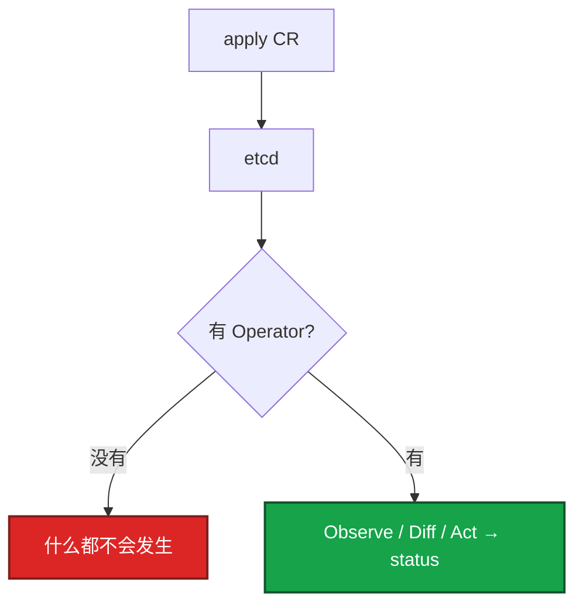
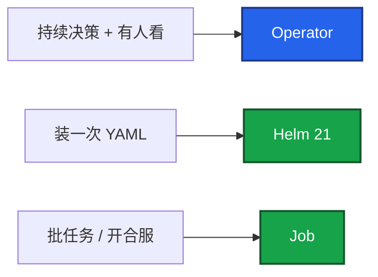
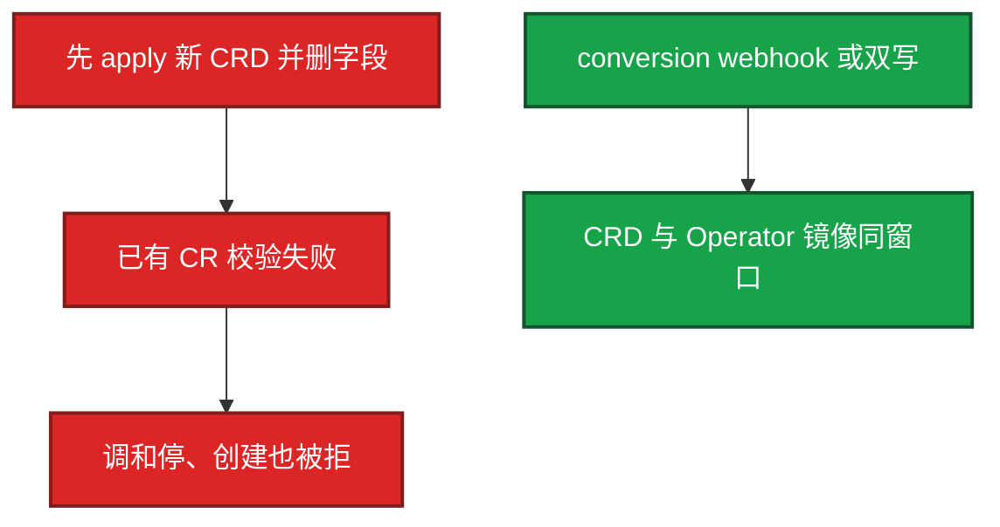
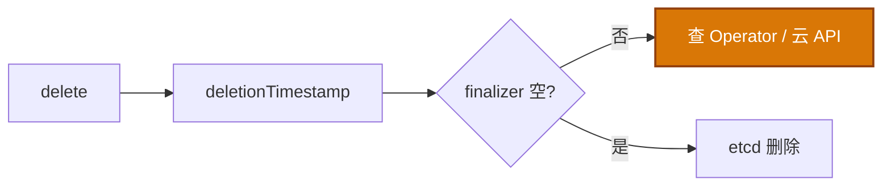

# 20｜Operator 与 CRD · 练习题

先自己画图或口述，再对照解答。每题标了覆盖范围：

| 标记 | 含义 |
|------|------|
| **核心** | 不懂整章就没建立起来 |
| **必会** | 值班和面试都要能讲 |
| **常用** | 线上会反复碰到 |
| **常考** | 白板和追问的高频口径 |

## 本题目录

- [Q1 CRD 和 Operator](#q1)
- [Q2 何时写、不是银弹](#q2)
- [Q3 和解循环](#q3)
- [Q4 CRD 版本与 conversion](#q4)
- [Q5 Terminating / finalizer](#q5)
- [Q6 spec 没反应 / status 空](#q6)
- [Q7 选主、直连 etcd、RBAC](#q7)
- [Q8 Helm 装的 vs Operator 管的](#q8)
- [Q9 影响面：Operator 挂了](#q9)
- [合上书](#合上书)

---

## Q1

**★★★★★｜CRD 和 Operator 是什么关系？只有 CRD 会怎样？**

**覆盖**：核心 · 必会 · 常考

### 场景

集群里能 `kubectl get gameserver`，但改 spec 毫无反应。CRD 是装过的，没有对应 Deployment。

### 完整解答

CRD 让 API 认识新 kind，对象进 etcd。Operator 是 watch 这种资源并调和的控制器。只有 CRD，对象就是数据，没有人去建 STS。

和 Deployment 一样：你改 spec，控制器对齐。差别是对齐逻辑是领域写的。不直连 etcd，走 API（01、03）。

### 再追问

Scheduler 和 Operator 谁起容器？——都不直接起。Operator 只改 API 对象；kubelet 起容器。和内置控制器同一条分界。

---

## Q2

**★★★★★｜什么场景该写 Operator？为什么不是银弹？**

**覆盖**：核心 · 必会 · 常考

### 场景

要把开服脚本「云原生化」，有人提议写 GameServer Operator，15s reconcile 一次。另一边 Redis 只是部署一份，也有人想写 Operator。

### 完整解答

该写：持续运维知识——成员变更、备份、failover、证书续期、扩分片；并且有人 oncall、CRD 升级有人测、上游没有能用的。

不该：只部署无状态三件套 → Helm/GitOps；开服合服一次性任务 → Job/流水线，失败可重跑，不必 15s 调和。

不是银弹：runbook 变成代码后，bug 以 reconcile 频率放大。某次把副本写成 0，15s 一次把所有区服缩没。三个「没有」（没人看、没人测、上游已有）就不要立项。

### 再追问

没人 oncall 这个 Operator 会怎样？——Reconcile 报错没人看，CR Terminating 没人摘，比偶尔跑 Ansible 更危险。

---

## Q3

**★★★★★｜和解循环怎么转？手改 STS 为什么会被改回去？**

**覆盖**：核心 · 必会 · 常用

### 场景

STS 起来了，你手改副本从 2 改到 5，过一会儿又变回 2。有人当 bug 去关 Operator。

### 完整解答

Level-triggered：Observe spec 与子资源 → Diff → Act → 写 status。丢一次事件不可怕，下一轮还会拉回 spec。所以 Act 必须幂等。外部失败 `requeue`，WorkQueue 限速。

手改 STS 是改「实际」；期望在 CR spec。下一轮 Act 改回去——这是特性。要扩容改 CR。

status 是 API 字段，不要只放内存。Ready 列空白先看能不能 patch status。

### 再追问

合服步骤也放进 Reconcile？——不要。半成功状态上反复 Act。失败应停在那一步，用 Job。

---

## Q4

**★★★★★｜升 CRD 删字段为什么危险？conversion 什么时候必须有？**

**覆盖**：核心 · 必会 · 常考

### 场景

要把 CRD 从 v1alpha1 升到 v1，顺手删了两个旧字段。已有 CR 变成非法对象，调和全停。有人说「再 apply 一次新 CRD」。

### 完整解答

storage 版本 **只能一个**，真正写入 etcd。served 可以多个。改结构必须 conversion webhook，或双写后一次性迁完。strategy `None` 只允许兼容字段。

新字段旧 Operator 看不见 = 期望写了没人执行。`storedVersions` 还有旧版时不要从 CRD 里删那个版本。Webhook 挂了且 Fail，写路径一起死（03）。

### 再追问

没有 webhook 能不能两个 served 版本？——字段必须能直接存进同一个 storage。对不上就必须 Webhook 或迁完再关旧版本。

---

## Q5

**★★★★☆｜CR 一直 Terminating，能不能手抠 finalizer？**

**覆盖**：必会 · 常用 · 常考

### 场景

删了一个 RDS 的 CR 十分钟还在。有人准备 patch 掉 finalizers。云上实例还在。

### 完整解答

先看 Operator 是否在清外部、云 API 是否失败、控制器是否挂了。手抠 = 告诉 API 外部已清完，RDS 会留孤儿。确认外部已无、业务允许，再补救，留变更记录。不要当第一刀（01）。

集群内孤儿 STS 是缺 ownerReferences，不是 finalizer 能解决的。owner 管集群内，finalizer 管集群外。

### 再追问

Namespace 一直 Terminating？——往往 NS 里还有带 finalizer 的 CR。先列这个 NS 里卡死的资源，不要先删 NS。

---

## Q6

**★★★★☆｜spec 改了没反应，status 一直空，按什么顺序查？**

**覆盖**：必会 · 常用

### 场景

把副本期望从 3 改到 5，STS 还是 3。`kubectl get xxx` 的 STATUS 列空白。

### 完整解答

1. get crd / get kind 看 status 和 message
2. Operator Deployment 是否 Running、lease 是否选到 leader
3. Operator 日志：RBAC forbidden、queue、panic
4. 能不能 patch status（单独的 RBAC）
5. 有没有人肉改过 STS（下一轮可能改回，或冲突）

创建 CR 直接被拒：校验 Webhook 或 CRD schema。Webhook 挂了且 Fail，写路径一起死（03）。

### 再追问

apply 之后立刻 get gameshard 有了、get sts 还是空——正常吗？——正常。账本里先有 CR。一直没有 STS 才去看 Operator。

---

## Q7

**★★★★☆｜为什么不能直连 etcd？双副本不选主会怎样？RBAC 写成 `*`？**

**覆盖**：必会 · 常考

### 场景

有人觉得 List-Watch 慢，想让 Operator 读 etcd。另一次为了 HA 把副本改成 2，没开 leader election。为了「先跑起来」绑了 cluster-admin。

### 完整解答

走 API：认证、鉴权、准入、审计、限流。直连会绕过这些，脏数据会被当成期望去执行（01）。Informer 缓存不算绕过——仍从 API List-Watch，写入仍走 API。

两个 Reconcile 同时 Act，子资源和 status 打架。必须选主。单副本没有 PDB：调和停、已有 STS 还在。给 Operator 配 PDB 和反亲和，但不要靠双活同时写当 HA。

最小权限：本 CR 的 get/list/watch/update/patch/status，以及它创建的那几类。能删全集群 PVC 的控制器，一次 bug 比业务故障更大。ownerReferences 配错：GC 可能删错，或删 CR 后 STS 成孤儿。

### 再追问

status 只放内存行不行？——不行。重启丢失，kubectl 也看不见。

---

## Q8

**★★★★☆｜Helm 装的中间件和 Operator 管的中间件，排障有何不同？**

**覆盖**：必会 · 常用

### 场景

一套 Redis 是 Helm chart，一套是 redis-operator。都是「起不来」。

### 完整解答

Helm：看 release 状态、渲染出的 YAML、事件（21）。Operator：先看 CR status 和 Operator 日志，再看它建的 STS。不要只盯业务容器。GitOps 环境下谁是 FieldManager 也要分清（22），别和 Argo 同时手改。

引入上游 Operator 前三问：创建哪些对象？失败日志在哪？CRD 升级谁测？

### 再追问

Chart 可以带 CRD 文件，kind 是 Helm 发明的吗？——不是。kind 仍由 API / Operator 定义。Helm 只负责提交那份 YAML（21）。

---

## Q9

**★★★★☆｜Operator 挂了，游戏服还在吗？给出现象走哪条路？**

**覆盖**：必会 · 常用 · 常考

### 场景

活动中 Operator CrashLoop。有人要重启逻辑服。四个工单：① 只有 CR ② Terminating ③ 创建被拒 ④ 改了 STS 又回去。

### 完整解答

三问：进程？变更？流量？已有 STS/Pod 通常还在；停的是自愈和变更。不要重启还活着的战斗服。

| # | 走哪条 | 不要做 |
|---|--------|--------|
| ① | Operator 在不在、CRD 是否装过 | 当 kubelet 坏了 |
| ② | 控制器和外部资源 | 第一刀抠 finalizer |
| ③ | Webhook / schema | 换业务镜像 |
| ④ | 改 CR | 关 Operator 硬推 |

现场：`get crd` → `get kind -o wide` → Operator logs / lease → 子资源。

### 再追问

托管了这章能跳过吗？——不能。你引入的 CRD、finalizer、Webhook 仍是你的写路径和删除路径。

---

## 合上书

- [ ] 能画出「CRD 登记、Operator 和解、只连 API」
- [ ] 能说出何时写 Operator、何时 Helm/Job，以及 15s 放大 bug
- [ ] 能把和解讲到幂等、requeue、手改 STS 会被改回
- [ ] 能讲 served / storage / conversion，升 CRD 不删在用字段
- [ ] 能区分 finalizer vs owner，Terminating 不手抠当第一刀
- [ ] 能按 status → 控制器日志 → 子资源排障；挂了不等于杀游戏
