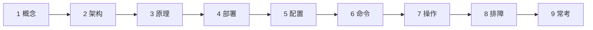
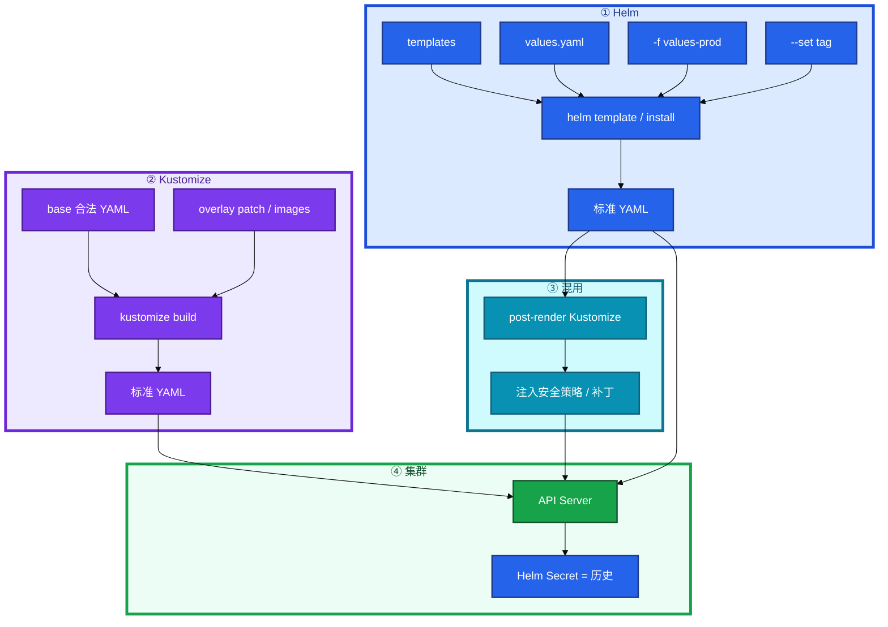
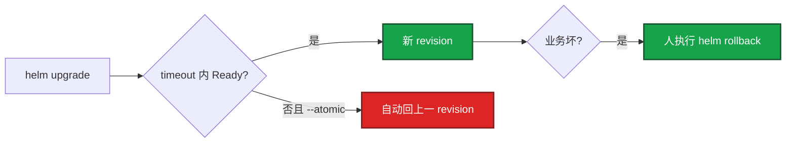
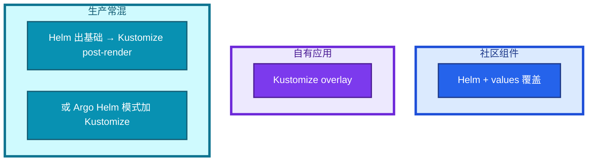
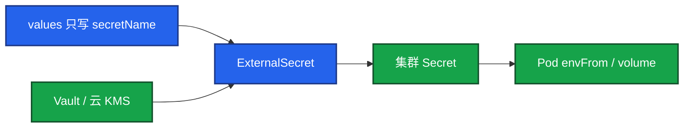
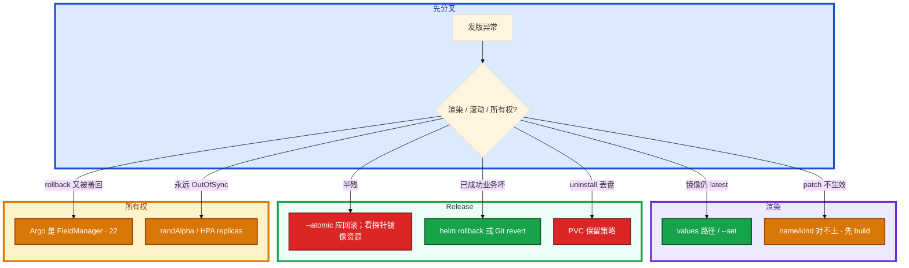

# Helm 与 Kustomize



同一套游戏网关，测试 3 副本、生产 10 副本，镜像 tag 还不一样。有人说 Helm 是一种新的工作负载类型。另有人把数据库密码写进 `values-prod.yaml` 提交了。CI 升级超时，一半新 Pod 没 Ready；另一天「成功了」但支付 5xx。

先别动手。这一章后半全是你会动手的：**怎么渲染、怎么 rollback、Secret 放哪、Helm 和 Kustomize 怎么选、uninstall 会不会把盘带走。** 前面的概念，是为了让你动手时不把模板当集群真相。

**读完你能：** 白板上画出 Chart → 标准 YAML；会 `upgrade --install --atomic` 和 overlay patch；能讲清 Helm vs Kustomize；发坏了知道回 Helm 快照还是 Git；密钥不进仓库。

## 本章目录

缩进 = 上下级。3 下面才是 3.1。

想钉在**正文左边**跟着滚：菜单 **查看 → 打开视图 → 大纲**。Markdown 预览做不到独立左栏，目录只能写在文章开头。

- [1. 基本概念](#1-基本概念)
- [2. 架构图](#2-架构图)
- [3. 原理](#3-原理)
  - [3.1 Chart 与渲染](#31-chart-与渲染)
  - [3.2 Release：升级、回滚、原子性](#32-release升级回滚原子性)
  - [3.3 Kustomize：base + overlay](#33-kustomizebase--overlay)
  - [3.4 Helm vs Kustomize](#34-helm-vs-kustomize怎么选怎么混)
- [4. 安装部署](#4-安装部署)
- [5. 核心配置](#5-核心配置)
- [6. 常用命令](#6-常用命令)
- [7. 常用操作](#7-常用操作)
  - [7.1 多环境 values / overlay](#71-多环境-values--overlay)
  - [7.2 Secret 不进 Git](#72-secret-不进-git)
  - [7.3 hook 与 migration](#73-hook-与-migration)
- [8. 生产排障](#8-生产排障)
- [9. 必会 · 常考](#9-必会--常考)
- [合上书](#合上书问自己)

**本章不讲：** 持续调和、自研控制器 → [20](../20-Operator与CRD/)；Argo 同步、self-heal、Git 回滚 → [22](../22-GitOps-ArgoCD与Tekton/)；滚动/金丝雀本身 → [15](../15-灰度与回滚/)；Secret 不是保险箱 → [12](../12-配置与密钥/)。不考 Go template 语法全集。

---

## 1. 基本概念

Helm 和 Kustomize **都不发明新 kind**。最终落地的仍是标准 Deployment / Service / STS。集群认的是 API 对象，不是 Chart。

| | Helm | Kustomize |
|--|------|-----------|
| 是什么 | 包管理器 + 模板引擎 | YAML 叠加器 |
| 输入 | Chart（模板 + values） | 合法 YAML + patch |
| 输出 | 标准 K8s YAML | 标准 K8s YAML |
| 历史 | Release 存在集群（Secret/CM） | **没有**；回滚靠 Git |

Release = 某 Chart 的一次安装实例，同一 Chart 可装多份，靠 release 名区分。`helm rollback` 靠这份历史。Kustomize 没有这份历史。

Chart 可以带 CRD 文件，kind 仍由 API Server / Operator 定义（20）。Helm 只负责提交那份 YAML。

> **记住**：Helm 和 Kustomize 最后都变成普通 YAML；集群认的还是 Deployment / Service。

---

## 2. 架构图

先把整张图钉住。后面命令、回滚、排障都对着这张图说话。



图上三条线：

1. **CI 先 lint / template / build，再交给 CD。** 不要到生产才发现括号没闭合。
2. **所有权只能有一个。** Argo 管 Helm 时，集群里往往没有 Helm Secret，`helm rollback` 对不上（22）。
3. **混用可以：Helm 打出基础，Kustomize post-render 注入策略。** 不能三家同时 apply。

---

## 3. 原理

原理只保留动手和面试会用到的：两个版本号、atomic 和手动 rollback 差在哪、四种 patch、什么时候不该硬套同一种工具。

**本节 4 块：** 3.1 Chart · 3.2 Release · 3.3 Kustomize · 3.4 选型

### 3.1 Chart 与渲染

```
my-chart/
├── Chart.yaml           # name / version（包版本）/ appVersion（应用版本）
├── values.yaml          # 默认值
├── templates/
│   ├── deployment.yaml  # Go template：.Values / .Release / .Chart
│   ├── service.yaml
│   ├── _helpers.tpl
│   └── NOTES.txt
├── charts/              # 子 Chart
└── .helmignore
```

`version` 是包版本，`appVersion` 是应用版本，生产两个都钉死，不用 latest。CI 打包进私有 Harbor。

```yaml
apiVersion: v2
name: game-gateway
version: 1.2.0
appVersion: "1.2.0"
dependencies:
  - name: redis
    version: "18.2.0"
    repository: https://charts.bitnami.com/bitnami
```

模板里 `{{ .Values.replicaCount }}`、`{{ .Values.image.tag }}` 在 install/upgrade 时被替换。CI 里先 `helm lint` 再 `helm template -f values-prod.yaml` 看渲染结果。

一套 Chart、多套 values：`values.yaml` 默认，`values-prod.yaml` / `values-staging.yaml` 覆盖。生产 `--set image.tag=` 钉死。渲染出来还是 `latest`，是 values 没覆盖到或 `--set` 写错路径。模板套太深就抽 `_helpers`。

`randAlpha` 每次渲染不同 → **禁止**，GitOps 会永远 OutOfSync（22）。image.tag 没变、内容变了：钉不可变 tag / digest，禁 latest——digest 没变，kubelet IfNotPresent 不拉（16）。

### 3.2 Release：升级、回滚、原子性

```bash
helm upgrade --install gw ./my-chart -n game -f values-prod.yaml \
  --set image.tag=1.2.1 --atomic --timeout 5m
```

`--install`：没有就装，有就升，CI 用一条命令，幂等。不要生产 reinstall（先卸再装会丢 PVC 默认行为）。



| | `--atomic` | 手动 `rollback` |
|--|----------|-----------------|
| 何时 | **这次部署过程中** 失败/超时 | **已经标成功** 之后业务不对 |
| 谁触发 | Helm 自己 | 人 |
| 回到哪 | 上一成功 revision | 指定序号（`helm history`） |

两者都只回到 **Helm 记下的快照**，不是魔法撤销云上磁盘。`uninstall` 不 `--keep-history` 就没得回。`--keep-history` 只留历史记录，不留盘。

Argo 管这个 Chart 时，常常没有 Helm Secret。回滚走 Git revert（22）。Helm 历史 ≠ Argo 历史。

### 3.3 Kustomize：base + overlay

无模板，YAML 始终合法。`kubectl apply -k` 内置。适合自有应用多环境、强调 Git 里能直接读。

```
game-gateway/
├── base/
│   ├── deployment.yaml
│   ├── service.yaml
│   └── kustomization.yaml
└── overlays/
    ├── prod/
    │   ├── kustomization.yaml
    │   ├── replica-patch.yaml
    │   └── resource-patch.yaml
    └── staging/
        └── kustomization.yaml
```

四种改法：

| 手法 | 干什么 | 注意 |
|------|--------|------|
| **strategic merge** | 整份 Deployment 只写要改的 replicas | 最直观 |
| **JSON Patch 6902** | 精确 `replace` 某个 path | `containers/0` 加 sidecar 后会指错 |
| **images** | CD 最常用，只换 tag | 别用 6902 改 image 除非必要 |
| **configMapGenerator / secretGenerator** | 内容变则改名，触发滚动 | 故意的；Helm 用 checksum 注解类似 |

```yaml
# overlays/prod/kustomization.yaml
resources:
  - ../../base
namespace: game-prod
images:
  - name: registry/game-gateway
    newTag: "1.2.0-prod"
patches:
  - path: replica-patch.yaml
```

`kustomize build overlays/prod/` 只渲染；`kubectl apply -k` 提交。patch 的 name/kind 对不上会 **静默不生效**。没有 Helm 那种 release 历史。回滚 = Git revert 再 apply（或交给 Argo）。

generator 给 ConfigMap 名字加 hash。引用名变了，Deployment 的 volume 变了，于是滚动——避免「CM 改了 Pod 还用旧文件」。Secret generator 的 files 仍可能进 Git，敏感内容还是 vault（12）。

### 3.4 Helm vs Kustomize：怎么选、怎么混

社区要装 Redis，自有网关要分环境。不要用同一种工具硬套。

| | Helm | Kustomize |
|--|------|-----------|
| 机制 | 模板 + values | YAML 叠加 |
| 参数化 | 强 | 靠 patch |
| 生态 | 海量社区 Chart | kubectl 内置 |
| 审阅 | 渲染后才是真相 | Git 里打开就是合法 YAML |
| 历史回滚 | `helm history` | Git |
| 学习 | 模板陡 | 平 |
| GitOps | `randAlpha` 会永远 drift | overlay 更稳 |
| 适合 | 社区 Redis/Kafka/Ingress | 自有游戏网关多环境 |



不要全盘 Helm 把三份简单 YAML 写成三百行模板；也不要全盘 Kustomize 去复刻 Bitnami Kafka。差异收敛到 values 或 overlay，不要每个环境一份完全分叉的 Chart。三个环境 values 各改各的漂移了：共享一份基础，环境文件只放差异；差异过大说明该拆 Chart 或改成 overlay。

游戏落地：大厅/网关自有镜像走 Kustomize overlay（Git 可审）；Redis/Kafka/Ingress 走官方 Chart + values。战斗服有状态 PVC 不要放进 Chart 默认删除路径。合服脚本不要塞进每次 gateway upgrade 的 pre-hook（20、22）。

> **记住**：社区 Chart 用 Helm，自有多环境用 Kustomize；生产常混用，所有权只能有一个。

---

## 4. 安装部署

生产怎么选：

| 项 | 选 | 不选 |
|----|----|------|
| 社区组件 | Helm + 钉死 Chart version | 手抄 Kafka YAML |
| 自有游戏服 | Kustomize base/overlay | 为 3 个文件养一套模板 |
| CI | `lint` + `template` / `build` 过了再 CD | 生产现场才渲染 |
| 镜像 | 不可变 tag / digest | latest |
| 密钥 | values 只写名字；Vault / external-secrets | 明文进 values-prod |
| 所有权 | 只让 Argo 或只让 Helm 一方 apply | CI、Helm、Argo 三家写 |

Chart 与 appVersion 钉死，推进私有 Harbor。`--atomic`。生产 `--set image.tag=`。

验收：`helm template` / `kustomize build` 的 YAML 过策略扫描；装完 `helm history` 或 Git 能指回这一版；Secret 不在 Git diff 里。

---

## 5. 核心配置

| 项 | 生产怎么用 | 改错会怎样 |
|----|------------|------------|
| `--atomic --timeout` | CI 默认开 | 半残留线上 |
| `--install` | CI 一条命令 | 脚本先判断在不在，经常写错 |
| `revisionHistoryLimit` | Deploy ≥5 | undo 无历史（15） |
| PVC 保留 | persist / keep | `uninstall` 把测服盘带走，生产同样危险 |
| Helm hook | pre-upgrade 迁库须向后兼容 | 滚动期两份代码打库（15） |
| `randAlpha` | 禁止 | Argo 永远 OutOfSync |
| post-renderer | 注入策略可以 | 所有权变模糊时不要再叠第三家 apply |
| images.newTag | CD 只换 tag | 6902 改 image 易碎 |

values 里只放 Secret **名字**。内容用 external-secrets（从 Vault/云 KMS 拉，Operator 写 K8s Secret）、sealed-secrets，或 CI 从 Vault 注入。post-renderer 也可以在渲染后再补。Secret 不是保险箱（12），进 Git 更不是。

> **记住**：CI 用 `upgrade --install --atomic`；回滚只回到 Helm 快照，不是撤销云盘。

---

## 6. 常用命令

```bash
helm lint ./my-chart
helm template gw ./my-chart -f values-prod.yaml --set image.tag=1.2.1
helm upgrade --install gw ./my-chart -n game -f values-prod.yaml \
  --set image.tag=1.2.1 --atomic --timeout 5m
helm history gw -n game
helm rollback gw 5 -n game
helm get values gw -n game
helm get manifest gw -n game
helm uninstall gw -n game --keep-history
kustomize build overlays/prod/
kubectl apply -k overlays/prod/
```

| 目的 | 命令 | 看什么 |
|------|------|--------|
| 渲染 | `helm template` / `kustomize build` | 镜像、副本、有没有 latest |
| 装/升 | `upgrade --install --atomic` | 失败自动回 |
| 历史 | `helm history` | 回滚看序号 |
| 现值 | `helm get values` | 生产实际覆盖 |
| 将删什么 | `helm get manifest` | uninstall 前看 PVC |
| overlay | `apply -k` | 先 build 确认 patch 生效 |

值班：先看渲染结果，再看 release 状态或 Git。不要滚动中途再 upgrade 一次。

---

## 7. 常用操作

### 7.1 多环境 values / overlay

一套 Chart，values.yaml 默认，values-prod / staging 覆盖。`helm upgrade -f values-prod.yaml --set image.tag=1.2.0`。Kustomize：base 一份合法 YAML，overlay 只叠差量。

CD 最常用：Kustomize `images` + merge 改副本/资源；Helm `--set image.tag`。

### 7.2 Secret 不进 Git



卡住：Pod 起不来，Events 写 secret 不存在——同步 Operator 还没把内容拉下来。先看 ExternalSecret 的 status，不要把密码填回 values。权限走 RBAC + 云 IAM。

### 7.3 hook 与 migration

`pre-upgrade` 跑 DB migration Job，失败则不要升主负载；`post-upgrade` 冒烟。`--atomic` + hook 失败 = 不把半成品留线上。滚动期间新旧代码并存，migration 走 expand/contract（15）。

合服是长任务、要人工确认，放 Job/流水线（20、22），不要塞进每次 gateway upgrade 的 pre-hook。

emptyDir 在 values 里不能当数据盘。drain 和卸载都会丢（16）。游戏存档走 PVC（11）。

---

## 8. 生产排障

和 01 同一套三问。这里再加：渲染对不对、历史还在不在、谁在 apply。



| 现象 | 先做什么 | 不要做什么 |
|------|----------|------------|
| 渲染里还是 latest | 对 values 路径 | 直接装到生产 |
| timeout，release 自己回上一版 | `--atomic` 在干活；查探针 | 关 atomic 硬推 |
| Ready 但玩家进不去 | 业务回滚；Argo 则改 Git | 只点 helm rollback（若 Argo 管） |
| patch 静默无效 | `kustomize build` | 再叠一份整 Deployment |
| 6902 改错容器 | sidecar 把 0 顶走了 | 用 images / merge |
| uninstall PVC 没了 | 保留策略 / 别放进删除路径 | 当 Helm bug |
| CM 改了却滚动 | generator hash，故意的 | 当被攻击 |
| 滚动中再 upgrade | 等这次结束 | 叠 revision |

游戏：活动窗口不要升级网关 Chart；战斗服 PVC 卸载策略先看 manifest。CI 只渲染校验，真正 apply 交给唯一的 CD。

---

## 9. 必会 · 常考

白板和追问高频，能一口回：

| 说法 | 对错 | 口径 |
|------|:----:|------|
| Helm 是一种新工作负载 | 错 | 包管理器；输出仍是标准 YAML |
| CRD 是 Helm 发明的 | 错 | Helm 只提交 YAML；kind 在 20 |
| 密码可以进 values-prod | 错 | 只引名字；Vault / external-secrets |
| `--atomic` 等于业务回滚 | 错 | 只覆盖「这次部署失败」 |
| Argo 管 Chart 时 helm rollback 一定灵 | 错 | 往往没有 Helm Secret |
| Kustomize 有 helm history | 错 | 回滚靠 Git |
| 全公司必须只用 Helm | 错 | 社区 Helm，自有 overlay |
| 全公司必须只用 Kustomize | 错 | 享受不到 Kafka 官方 Chart |
| latest 也能升级 | 错 | digest 不变不拉 |
| uninstall 不删盘 | 错 | 默认级联；PVC 要 keep |
| `--keep-history` 留盘 | 错 | 只留记录 |
| `randAlpha` 方便生成密码 | 错 | GitOps 永远 drift |
| configMapGenerator 滚动是 bug | 错 | hash 改名，故意触发 |
| 三家同时 apply 更稳 | 错 | 所有权只能一个 |
| emptyDir 当游戏存档 | 错 | drain/卸载都丢 |
| 合服脚本当 Helm hook | 错 | 长任务走 Job |

数字：`--timeout` 常见 **5m**；Deploy `revisionHistoryLimit ≥ 5`；生产钉 Chart version + appVersion；Sidecar 与日志章无关，这里是模板复杂度。

易混：atomic vs 手动 rollback；Helm 历史 vs Argo 历史；merge vs 6902 vs images；values 覆盖 vs overlay；install vs upgrade --install；keep-history vs 留 PVC。

---

## 合上书，问自己

1. Helm / Kustomize 最终落地的是什么？Release 历史在哪？
2. 两个版本号差在哪？CI 为什么必须先 template？
3. `--atomic` 和手动 rollback 谁在什么时候用？Argo 管了还能 helm rollback 吗？
4. 四种 Kustomize patch 各干什么？generator 为什么会滚动？
5. 社区组件和自有网关怎么分工？混用时所有权怎么定？
6. Secret 为什么不进 values？uninstall 怎样才不会把盘带走？

六题都能口述，这一章就过了。下一章把期望的存放处规定为 Git：CI 不再持有生产 kubeconfig，Argo 在集群内拉并对齐。
