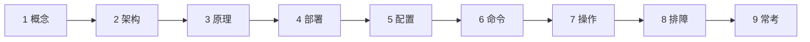
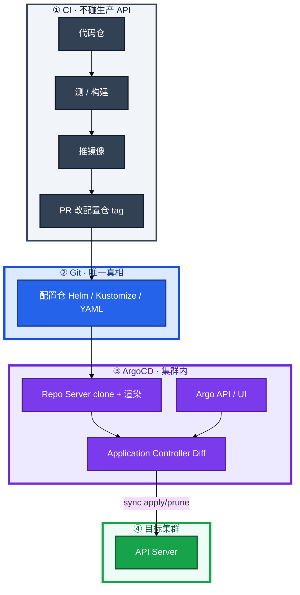
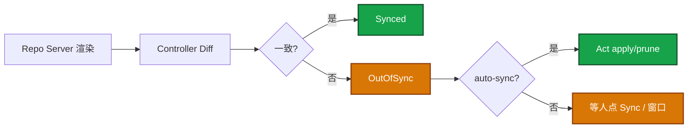
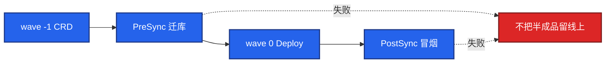
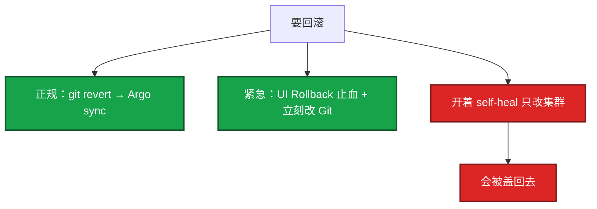
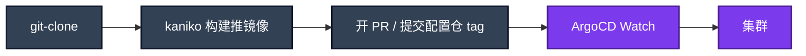
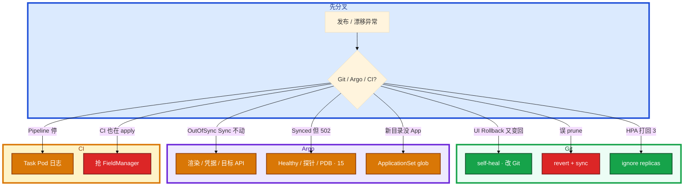

# GitOps：ArgoCD 与 Tekton



流水线末尾仍是 `kubectl apply -f`。生产 kubeconfig 在 CI 变量里。有人说「我们也声明式了，YAML 在 Git」。预发已全自动，有人要把生产也开 self-heal。活动中 kubectl edit 改过探针，第二天被盖回去。支付镜像有 bug，值班在 UI 点了 Rollback，过几分钟又变回坏版本。

先别动手。这一章后半全是你会动手的：**怎么 sync、hook 怎么挡半成品、回滚改哪、CI 还要不要拿集群写权限、prune 误删第一刀。** 前面的概念，是为了让你动手时不把 Push apply 叫做 GitOps。

**读完你能：** 白板上画出 Pull 对齐；会配 auto-sync / self-heal / prune / hook；回滚改 Git；Tekton 最后一步不 kubectl；所有权只有一个。

## 本章目录

缩进 = 上下级。3 下面才是 3.1。

想钉在**正文左边**跟着滚：菜单 **查看 → 打开视图 → 大纲**。Markdown 预览做不到独立左栏，目录只能写在文章开头。

- [1. 基本概念](#1-基本概念)
- [2. 架构图](#2-架构图)
- [3. 原理](#3-原理)
  - [3.1 ArgoCD 同步](#31-argocd-同步outofsync--act)
  - [3.2 Sync Hook 与波次](#32-sync-hook-与波次)
  - [3.3 回滚、漂移、所有权](#33-回滚漂移所有权)
  - [3.4 Tekton vs Actions](#34-tekton-vs-actions)
- [4. 安装部署](#4-安装部署)
- [5. 核心配置](#5-核心配置)
- [6. 常用命令](#6-常用命令)
- [7. 常用操作](#7-常用操作)
  - [7.1 ApplicationSet](#71-applicationset)
  - [7.2 一条发布链](#72-一条发布链游戏网关)
- [8. 生产排障](#8-生产排障)
- [9. 必会 · 常考](#9-必会--常考)
- [合上书](#合上书问自己)

**本章不讲：** 声明式为什么能自愈、HPA 抢 replicas → [01](../01-集群架构/)；Chart、values、helm rollback → [21](../21-Helm与Kustomize/)；滚动/金丝雀/PDB → [15](../15-灰度与回滚/)；节点升级窗口 → [16](../16-节点运行时与升级/)；Jenkins/GitHub Actions 语法细节 → [05 工程化](../../05-工程化与自动化/)。

---

## 1. 基本概念

YAML 在 Git 只是存放。GitOps 还要求 **集群由控制器从 Git 拉并对齐**，CI 不持有生产写权限。01 写过：声明式是 Observe → Diff → Act。GitOps 把「期望」的存放处规定为 **Git**，集群里的控制器（ArgoCD）负责对齐。CI 只产出镜像和改 Git 里的 tag，**不 kubectl apply 进生产**。

四条原则：Git 是唯一真相；变更走 PR；集群趋近 Git（自愈或告警）；Git 历史即发布历史。

| | 传统 Push | GitOps Pull |
|--|-----------|-------------|
| 谁 apply | CI 持有 kubeconfig | 集群内 Argo 用自己的 SA |
| 凭证 | 在 CI 变量里 | 不出集群 |
| 回滚 | 找回旧 YAML 再推 | `git revert` |
| 应急 kubectl | 经常忘补 | **当天补回 Git**，否则下次 sync 盖掉热修 |

应急 `kubectl` 可以，和 01 里 HPA 与 YAML 抢 replicas 是同一类事故：不补 Git，控制器会按仓库把世界拉回去。

> **记住**：Git 存期望，控制器去对齐；CI 不拿生产 kubeconfig。

---

## 2. 架构图

先把整张图钉住。后面 sync、hook、排障都对着这张图说话。



| 组件 | 干什么 |
|------|--------|
| Argo API Server | UI / API，管 Application |
| Repo Server | clone Git，渲染 Helm/Kustomize |
| Application Controller | 对比期望 vs 实际，执行 sync |

两种灯要分开看：**Synced** = 和 Git 一致；**Healthy** = 探针过了。GitOps 不会替你空服。战斗服仍要按 16 的节点窗口和 15 的有状态约束。

---

## 3. 原理

原理只保留动手和面试会用到的：什么时候 Act、hook 挡什么、回滚改哪、CI 工具差在哪条边界。

**本节 4 块：** 3.1 同步 · 3.2 Hook · 3.3 回滚 · 3.4 Tekton/Actions

### 3.1 ArgoCD 同步：OutOfSync → Act



```yaml
syncPolicy:
  automated:
    prune: true      # Git 删了，集群也删
    selfHeal: true   # 手改集群会被盖回 Git
```

| 开关 | 含义 | 生产 |
|------|------|------|
| **auto-sync** | Git 一合就上 | 预发可开；生产常手动或 **sync window** 避开活动高峰 |
| **self-heal** | kubectl 热修活不长 | 可开，但先 ignore 合理漂移；活动中热修必须补 Git |
| **prune** | Git 没了的对象从集群删 | **谨慎**；误删目录 = 删生产 |

预发已全自动。生产抄预发的 prune + selfHeal，某次 Git 误删 ingress YAML 就会把入口拿走。关键资源 `argocd.argoproj.io/sync-options: Delete=false`。

合理漂移：HPA 改 replicas（01 同一题）→ `ignoreDifferences` `/spec/replicas`，或 YAML 不把 replicas 当真相。Admission / Istio 注入字段 → ignore 或把期望写进 Git。Helm `randAlpha` 每次渲染不同 → 禁止（21）。不要为了绿标去关注入。

Image Updater 自动改 tag：预发可以。生产自动改 tag 等于绕过审批，至少要受保护分支和窗口约束。

卡住：UI 里 OutOfSync 但点 Sync 没变化——Repo Server 渲染失败（Helm 模板、randAlpha）、凭据拉不了 Git、目标集群 API 不通。先看 Application 的 Conditions，不要先在集群里 kubectl apply 顶上。

### 3.2 Sync Hook 与波次

一次发版里 CRD 还没 Ready 就 apply Deployment，会创建失败。波次把「先登记类型、再提交工作负载」写成顺序，而不是靠人点两次 Sync。

| 机制 | 干什么 |
|------|--------|
| **sync wave** | 注解数字越小越先；典型先 CRD / NS，再 Deploy |
| **PreSync** | 迁库 Job；失败则不要升主负载 |
| **Sync** | 主资源 |
| **PostSync** | 冒烟；失败应挡住「成功」 |
| **SyncFail** | 通知 / 收尾 |
| **Hook 删除策略** | `HookSucceeded` 清 Job，避免遗留 |



Hook 是资源注解（Job），和 Helm hook 类似但由 Argo 调度。合服长任务、要人工确认，不要塞进每次网关 Sync 的 PreSync（20、21）。Argo Rollouts 做金丝雀指标晋级（15）。

滚动期间新旧代码并存，migration 走 expand/contract。Synced 只表示和 Git 一致，Healthy 才表示探针过了。

### 3.3 回滚、漂移、所有权

正规回滚：**改 Git**（revert tag / overlay），Argo 再 sync。开了 self-heal 时，只在 UI 里 Rollback，过一会儿又被 Git 拉回去——self-heal 的目标是 Git，不是 UI 历史。



紧急：UI 选历史版本止血，**同时** Git revert；必要时先关 self-heal。事后 Git 与集群必须一致。`kubectl rollout undo` 在 GitOps 里只是临时，必须补 Git。Helm history 在 Argo 管 Chart 时往往不存在（21）。

CI 不要和 Argo **同时** apply。抢 FieldManager，来回漂移、神秘回滚。所有权只能有一个。

变更窗口：工作日白天发；周五傍晚、节前、开服日冻结。紧急止血事后补单，不能因为没工单就不止血。

### 3.4 Tekton vs Actions

镜像还是要构建的。边界不变：最后一步是改 Git，不是 kubectl。

| | **Tekton** | **GitHub Actions / GitLab CI** |
|--|-----------|--------------------------------|
| 跑在哪 | 集群内 CRD：Task / Pipeline / PipelineRun | 仓库托管的 runner |
| 形态 | Step 每步一个容器，Workspace 传文件 | YAML workflow + 插件市场 |
| 凭证 | 集群 SA / Secret；CD 仍是 Argo | 仓库 secrets；**不要**放生产 kubeconfig |
| 优点 | 声明式进 Git、Step 隔离、Catalog 复用 Task | 团队熟、市场大、轻量任务冷启动小 |
| 代价 | 调度冷启动、资源比单 agent 大 | 生产写权限一旦配进 CI 就滑回 Push |
| GitOps | 最后一步 bump 配置仓 tag | 同样：开 PR，不要 kubectl |



和 Jenkins：Tekton 声明式、每 Step 隔离、不用养一台 Jenkins。已有海量 Jenkins 插件、团队熟 Groovy，可以继续用 Jenkins 当 CI，**CD 仍建议 Argo**。换 CI 工具不影响 Argo，反之亦然。不必换 CI 才能 GitOps。

Argo Workflows：更通用的 DAG/批处理。全家桶 = Workflows（CI）+ CD + Rollouts。Tekton Catalog 更偏标准化 CI Task。

完全没有 Argo、Tekton 仍 push apply：那是声明式清单 + 流水线，不是 Pull GitOps。可以逐步：先 YAML 进 Git，再把 apply 从 CI 挪到集群内控制器。

卡住：PipelineRun 停在某 Step → 看该 Task 的 Pod 日志，不要去集群里补一次 kubectl。构建绿了但配置仓没有 PR → 是 bump-tag Task 失败，不是 CD 坏了。

> **记住**：Tekton 是 K8s 原生 CI，最后一步改 Git，不要 kubectl 进生产。Actions 也可以当 CI，禁区同样是生产 kubeconfig。

---

## 4. 安装部署

生产怎么选：

| 项 | 选 | 不选 |
|----|----|------|
| CD | 集群内 Argo，SA 收敛到目标 NS | CI cluster-admin |
| CI | Tekton 或继续 Actions/Jenkins | 为了 GitOps 强迁 CI |
| 预发 Application | auto-sync + prune + self-heal | — |
| 生产 Application | 手动 Sync 或窗口内 auto；prune 谨慎 | 照抄预发全开 |
| 多服务 | ApplicationSet 生成器 | 手写 300 个 Application |
| 密钥 | CI 只需镜像仓库和 Git | 生产 kubeconfig 进 Actions secrets |

落地：Application 指向 repo + path + revision；destination 是集群和 NS。新目录加了但 App 没出来，看 ApplicationSet 的 generator 日志，path glob 写错是第一名。删目录则相反：开了 prune，生产可能被删。生产删目录两人 review。

游戏集群：大厅/网关可窗口内 auto；战斗服手动 Sync + 空服窗口（15、16）。活动高峰冻结非紧急。

验收：CI 角色不能 `kubectl get ns` 生产；预发合 Git 后 Application 变 Synced；生产未点 Sync 仍是旧 tag——这是设计。

---

## 5. 核心配置

| 项 | 生产怎么用 | 改错会怎样 |
|----|------------|------------|
| auto-sync | 预发开；生产窗口或手动 | 误提交直上生产 |
| self-heal | 可开 + ignore HPA/注入 | 热修被盖回；或关了之后漂移没人管 |
| prune | 生产谨慎；Ingress/PVC `Delete=false` | 误删目录删生产 |
| sync window | 活动高峰禁止自动 | 高峰上线 |
| sync wave | 先 CRD 再负载 | 创建失败 |
| ignoreDifferences | `/spec/replicas` 等 | HPA 和 Git 打架 |
| ApplicationSet prune | 目录保护 + 两人 review | 删目录连带删 App 再 prune |
| CI SA | 镜像 + Git | 生产写权限 |

staging：尽快暴露配置错误。prod：Sync 常手动或窗口内；self-heal 可开但 ignore 合理漂移。

> **记住**：回滚改 Git；紧急 UI 止血必须补 Git，否则 self-heal 会盖回来。

---

## 6. 常用命令

```bash
argocd app list
argocd app get game-gateway-prod
argocd app diff game-gateway-prod
argocd app sync game-gateway-prod
argocd app history game-gateway-prod
kubectl -n argocd logs deploy/argocd-application-controller --tail=100
kubectl get applicationset -A
# Tekton
kubectl get pipelinerun -n ci
kubectl logs -n ci -l tekton.dev/pipelineRun=<run> --tail=100
```

| 目的 | 看什么 |
|------|--------|
| OutOfSync | diff：是 HPA 还是真的配置漂 |
| Sync 没动 | Application Conditions：渲染/凭据/目标 API |
| 健康 | Synced ≠ Healthy |
| CI 停住 | Task Pod 日志，不是 kubectl apply |
| 误 prune | 立刻 git revert 再 sync |

值班四问：Git 指哪一 commit？Application 灯？谁是 FieldManager？CI 有没有生产 kubeconfig？

---

## 7. 常用操作

### 7.1 ApplicationSet

100 服务 × 3 环境不要手写 300 个 Application。用 git 目录 / cluster / list / matrix 生成器，加目录即出 App。

```yaml
apiVersion: argoproj.io/v1alpha1
kind: ApplicationSet
spec:
  generators:
    - git:
        repoURL: https://git.company.com/k8s-config
        directories:
          - path: services/*/prod
  template:
    spec:
      source:
        path: '{{path}}'
      destination:
        namespace: game-prod
```

生成器和 prune 一起用：目录被误删，可能删对应 App 再 prune 资源。生产删目录要两人 review，关键资源 Delete=false。

### 7.2 一条发布链（游戏网关）


价值：凭证不出集群、变更可审计、新环境从 Git 拉起来、任何人能提 revert 而不需要集群权限。战斗服：GitOps 不会替你空服。

---

## 8. 生产排障

误 prune 删了生产 Service：长连接还在的玩家暂时没掉（kube-proxy 规则还在），新登录进不去。立刻 git revert 并 sync，把 Service 对象加回。不要先重启游戏进程（01 同类：存量 conntrack 可能还在）。



| 现象 | 先做什么 | 不要做什么 |
|------|----------|------------|
| self-heal 盖热修 | 补 Git 或先关 self-heal | 再 edit 一次 |
| UI Rollback 弹回 | Git 还是坏 tag | 只点 UI |
| HPA 扩了又被打回 | ignoreDifferences | 关 HPA |
| 误 prune | revert + sync | 重启游戏进程 |
| CI 与 Argo 对打 | 停 CI apply | 两边都加大频率 |
| Synced + 502 | 走 15，不是再 sync | 当 GitOps 会空服 |
| Actions 里 kubeconfig | 立刻收权限 | 继续当 GitOps |

---

## 9. 必会 · 常考

白板和追问高频，能一口回：

| 说法 | 对错 | 口径 |
|------|:----:|------|
| YAML 在 Git 就是 GitOps | 错 | 还要控制器 Pull 对齐；CI 不写生产 |
| 生产必须开 self-heal + prune | 错 | 预发可全开；生产 prune 谨慎 |
| UI Rollback 在 self-heal 下永久有效 | 错 | 目标是 Git，会盖回来 |
| Synced 就是发布成功 | 错 | Healthy 才是探针；业务指标在 15 |
| Tekton 最后一步 kubectl 也算 GitOps | 错 | 最后一步改 Git |
| 必须把 Jenkins 换成 Tekton 才能 GitOps | 错 | CD 接 Argo 即可 |
| Actions 不能当 CI | 错 | 能；禁区是生产 kubeconfig |
| Image Updater 生产自动改 tag 没问题 | 错 | 绕过审批 |
| 与 Argo 同时 helm apply 更稳 | 错 | 抢 FieldManager |
| GitOps 会替战斗服空服 | 错 | 窗口和 PDB 仍要人做 |
| 误 prune 先重启进程 | 错 | 先把对象加回 |
| ApplicationSet 删目录无影响 | 错 | 可能删 App 再 prune |
| Hook 失败仍该标成功 | 错 | PreSync/PostSync 失败应挡住 |
| helm rollback 在 Argo 下一定灵 | 错 | 往往没有 Helm Secret |

数字：预发全自动；生产窗口避开活动；删目录两人 review；CI SA 无 cluster-admin。

易混：Synced vs Healthy；auto-sync vs self-heal vs prune；UI Rollback vs git revert；Tekton vs Actions vs Jenkins（CI 层）对 Argo（CD 层）；wave vs hook；ignoreDifferences vs 把期望写进 Git。

---

## 合上书，问自己

1. YAML 在 Git 和 GitOps 差哪一条？CI 凭据该在哪？
2. OutOfSync 之后谁 Act？生产 prune / self-heal / window 怎么配？
3. wave 和 PreSync/PostSync 各挡什么？合服能当 PreSync 吗？
4. 开了 self-heal 怎么回滚才有效？误 prune 第一刀？
5. Tekton 和 Actions 怎么选？最后一步应该做什么？
6. HPA 和 Git 抢 replicas 怎么办？所有权为什么只能一个？

六题都能口述，这一章就过了。下一章把数据面从 iptables 链换成内核 hook：Cilium 挂了不等于长连接立刻死，Hubble 能看见是哪条策略 drop。
