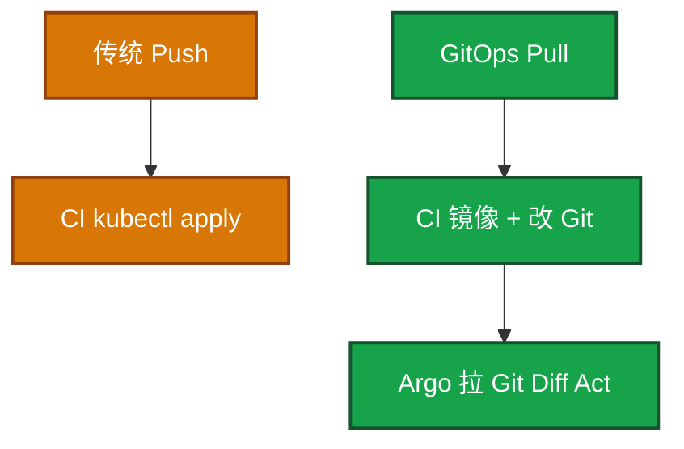
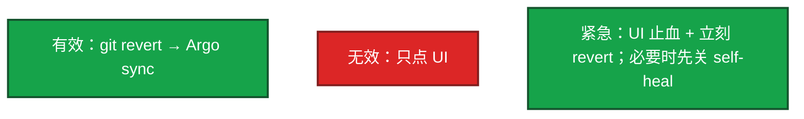

# 22｜GitOps：ArgoCD 与 Tekton · 练习题

先自己画图或口述，再对照解答。每题标了覆盖范围：

| 标记 | 含义 |
|------|------|
| **核心** | 不懂整章就没建立起来 |
| **必会** | 值班和面试都要能讲 |
| **常用** | 线上会反复碰到 |
| **常考** | 白板和追问的高频口径 |

## 本题目录

- [Q1 GitOps vs Push](#q1)
- [Q2 auto-sync / self-heal](#q2)
- [Q3 回滚改哪](#q3)
- [Q4 发布链与 CI/CD 边界](#q4)
- [Q5 Sync Hook 与波次](#q5)
- [Q6 Tekton vs Actions](#q6)
- [Q7 生产 prune / ApplicationSet](#q7)
- [Q8 HPA 与误 prune](#q8)
- [Q9 Tekton 最后一步](#q9)
- [合上书](#合上书)

---

## Q1

**★★★★★｜GitOps 和传统 CI/CD 差在哪？YAML 在 Git 算不算？**

**覆盖**：核心 · 必会 · 常考

### 场景

流水线末尾仍是 `kubectl apply -f`。生产 kubeconfig 在 CI 变量里。有人说「我们也声明式了，YAML 在 Git」。

### 完整解答

YAML 在 Git 只是存放。GitOps 还要求 **集群由控制器从 Git 拉并对齐**，CI 不持有生产写权限。这就是 01 的 Observe → Diff → Act，期望的权威源换成 Git。

回滚传统要找回旧清单；GitOps 是 git revert。应急 kubectl 当天补回，否则下次 sync 覆盖热修。四条原则：Git 唯一真相；变更走 PR；集群趋近 Git；历史可审计可回滚。

### 再追问

完全没有 Argo、只有 Tekton 能不能算 GitOps？——若仍 push apply，那是声明式清单 + 流水线，不是 Pull GitOps。

---

## Q2

**★★★★★｜ArgoCD 如何发现 OutOfSync？生产能开 auto-sync + self-heal 吗？**

**覆盖**：核心 · 必会 · 常考

### 场景

预发已全自动。有人要把生产也开 self-heal。活动中有人 kubectl edit 改过探针，第二天被盖回去，故障复现。

### 完整解答

Application 指向 Git 路径。Repo Server 渲染，Controller Diff 集群。不同则 OutOfSync。auto-sync 立即 Act；self-heal 把集群手改拉回 Git。

预发可全自动。生产：手动 Sync 或 sync window；误提交会直接上生产。prune 误删目录更危险。合理漂移（HPA replicas）要 ignore。

sync window 禁止活动高峰自动上线。紧急止血可以临时关窗口，事后补单。

### 再追问

Synced 和 Healthy 差在哪？——Synced = 和 Git 一致；Healthy = 探针过了。GitOps 不会自动空服。502 走 15，不是再 sync。

---

## Q3

**★★★★★｜开了 self-heal，怎么回滚才有效？**

**覆盖**：核心 · 必会 · 常用

### 场景

支付镜像有 bug。值班在 Argo UI 点了 Rollback，过几分钟又变回坏版本。Git 里 tag 没动。

### 完整解答

self-heal 的目标是 Git，不是 UI 历史。UI Rollback 改了集群，Controller 发现和 Git 不一致又 sync 回去。

`kubectl rollout undo` 同样必须补 Git。Helm history 在 Argo 管 Chart 时往往不存在（21）。来不及走 PR：先 UI 或临时关 self-heal 止血，同步起一条 revert PR。不能让 Git 和集群长期分叉。

### 再追问

Image Updater 生产自动改 tag 还要不要 PR？——生产自动改 tag 等于绕过审批，至少要受保护分支和窗口约束。预发可以自动。

---

## Q4

**★★★★★｜讲一条完整 GitOps 发布链，CI 和 CD 边界在哪？**

**覆盖**：核心 · 必会 · 常考

### 场景

要讲大厅发版。有人把 Tekton 最后一步写成 kubectl。战斗服也想「GitOps 一键滚」。

### 完整解答

代码仓 → CI（测、构建、推镜像、开 PR 改配置仓 tag）→ 配置仓 PR 审批合并 → Argo Watch → 预发 auto / 生产确认 → 滚动 → 坏了 git revert。

CI 产物是镜像 + Git 变更。CD 消费 Git。CI 换工具不影响 Argo。CI 不碰集群。

战斗服：GitOps 不会替你空服。节点窗口仍按 16，滚动约束按 15。

### 再追问

预发 Application 变成 Synced + Healthy，生产还是旧 tag——卡住了吗？——没有。生产没开 auto，或还在窗口外。这是设计。

---

## Q5

**★★★★☆｜Sync Hook 和 wave 解决什么？合服能当 PreSync 吗？**

**覆盖**：必会 · 常用 · 常考

### 场景

一次发版 CRD 还没 Ready 就 apply Deployment，创建失败。另一次有人把合服脚本塞进网关 Application 的 PreSync。

### 完整解答

wave：数字越小越先，先 CRD / NS 再 Deploy，不用人点两次 Sync。PreSync 迁库，失败则不要升主负载。PostSync 冒烟。SyncFail 收尾。Hook 失败不应标成功。滚动期 migration 走 expand/contract（15）。

合服是长任务、要人工确认，放 Job/流水线，不要塞进每次网关 Sync 的 PreSync（20、21）。金丝雀指标晋级走 Rollouts（15）。

### 再追问

Helm hook 和 Argo hook？——类似生命周期，但 Argo 用资源注解调度。Argo 管 Chart 时以 Argo 为准。

---

## Q6

**★★★★☆｜Tekton 和 GitHub Actions 怎么选？每 Step 一个 Pod 的代价？**

**覆盖**：必会 · 常用 · 常考

### 场景

要从 Jenkins 迁 CI。CD 已经是 Argo。有人担心每步起 Pod 太慢。另有人说 Actions 不能做 GitOps。

### 完整解答

选 Tekton：全 K8s、声明式进 Git、不想养 Jenkins、Catalog 复用 Task。选 Actions/Jenkins：插件和团队熟、轻量任务冷启动小。**CD 都可以接 Argo**，这是边界，不是必须换 CI 才能 GitOps。

| | Tekton | Actions |
|--|--------|---------|
| 跑哪 | 集群内 PipelineRun | 托管 runner |
| 最后一步 | 改 Git | 同样改 Git |
| 禁区 | kubectl 生产 | 生产 kubeconfig 进 secrets |

每 Step 独立容器：隔离、重试、凭证分离。代价：调度冷启动、workspace 传产物、资源比单 agent 大。

Argo Workflows：更通用 DAG/批处理。全家桶 Workflows + CD + Rollouts。

### 再追问

PipelineRun 停在某 Step 去集群里补 kubectl？——不要。那会和 Argo 抢所有权。看该 Task 的 Pod 日志。构建绿了没 PR → bump-tag 失败，不是 CD 坏了。

---

## Q7

**★★★★☆｜生产 prune、self-heal、ApplicationSet 各怎么配？**

**覆盖**：必会 · 常用

### 场景

有人在 prod Application 上抄了预发的 prune: true、selfHeal: true。某次 Git 误删 ingress YAML。80 个微服务手写 Application 漏了一个 prod。

### 完整解答

staging：auto + prune + self-heal，尽快暴露配置错误。prod：Sync 常手动或窗口内；prune 谨慎；self-heal 可开但 ignore HPA replicas、注入字段；Ingress/PVC 加 Delete=false。分支保护：删目录两人 review。

ApplicationSet：一份模板 + 生成器（git 目录 / cluster / list / matrix）。新增服务加目录即可。生成器和 prune 一起用：目录被误删可能删 App 再 prune 资源。

CI 还在 apply、Argo 也在 sync：抢 FieldManager，来回漂移。所有权只能一个。

### 再追问

新目录加了但 App 没出来？——看 ApplicationSet generator 日志，path glob 写错是第一名。不要先 kubectl apply 顶上。

---

## Q8

**★★★★☆｜HPA 把副本扩到 20，Argo 为什么又打回 3？误 prune 第一刀？**

**覆盖**：必会 · 常用 · 常考

### 场景

活动中 HPA 已扩。配置仓 YAML 仍写 replicas: 3。self-heal 一开，登录排队。另一次配置仓误合并删掉 battle Service，prune 已执行。长连接还在，新登录进不去。有人要重启游戏进程。

### 完整解答

和 01 同一题：Git 与 HPA 抢同一字段。处理：ignoreDifferences `/spec/replicas`，或 YAML 不把 replicas 当真相。热修扩容也要决定：改 Git 还是 ignore。Admission 注入 sidecar 同样 ignore 或写进 Git，不要为了绿标去关注入。

误 prune：立刻 git revert 并 sync，把 Service 对象加回，kube-proxy 才能更新新连接。不要先重启游戏进程。Service 对象没了，节点内核规则和已有连接不会瞬间蒸发。事后加 Delete=false 和目录保护。

### 再追问

为什么玩家没立刻掉光？——变的是再也更新不了、新连接失败。先恢复对象，别杀进程（01 Q10 同类）。

---

## Q9

**★★★★☆｜Tekton / Actions 最后一步「部署」应该做什么？**

**覆盖**：必会 · 常用

### 场景

Pipeline 里有个 deploy Task，里面 kubectl apply。安全说 CI 角色权限过大。GitHub Actions 里也拷了一份生产 kubeconfig。

### 完整解答

GitOps 下这一步应是：更新配置仓的 tag/overlay，开 PR 或推受保护流程。真正 apply 由集群内 Argo 用自己的 SA 做，权限收敛到目标 NS。CI SA 只需镜像仓库和 Git，不需要生产 cluster-admin。Actions 同样：禁区是生产 kubeconfig。

### 再追问

OutOfSync 点 Sync 没变化先干什么？——Application Conditions：Repo Server 渲染失败、凭据、目标 API。不要先 kubectl apply 顶上。

---

## 合上书

- [ ] 能画出 Pull GitOps，并说明 YAML 在 Git 还不够
- [ ] 能配预发全自动、生产 window / prune 谨慎 / ignore 漂移
- [ ] 能讲 wave + PreSync/PostSync，合服不塞 hook
- [ ] 能在 self-heal 下用 git revert 回滚；误 prune 先加回对象
- [ ] 能选 Tekton 或 Actions 当 CI，最后一步改 Git 不 kubectl
- [ ] 能处理 HPA 抢 replicas、三家 apply、Synced≠Healthy
