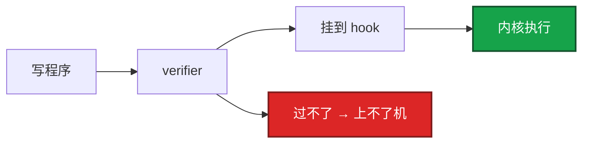
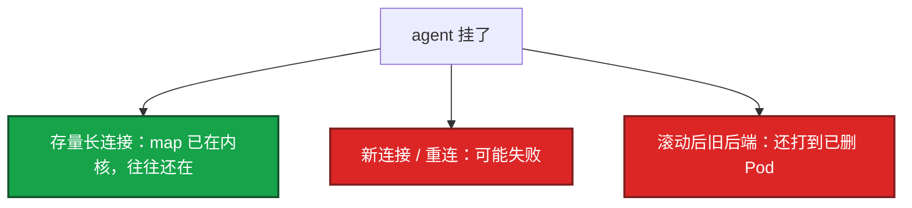

# 23｜eBPF 与 Cilium · 练习题

先自己画图或口述，再对照解答。每题标了覆盖范围：

| 标记 | 含义 |
|------|------|
| **核心** | 不懂整章就没建立起来 |
| **必会** | 值班和面试都要能讲 |
| **常用** | 线上会反复碰到 |
| **常考** | 白板和追问的高频口径 |

## 本题目录

- [Q1 eBPF 与 verifier](#q1)
- [Q2 数据面差在哪](#q2)
- [Q3 agent 挂了长连接](#q3)
- [Q4 Hubble](#q4)
- [Q5 可观测 vs 安全](#q5)
- [Q6 L7 策略](#q6)
- [Q7 何时不要上 / 关 kube-proxy](#q7)
- [Q8 跨节点与 sandbox](#q8)
- [Q9 sidecarless vs Istio](#q9)
- [Q10 三句影响面](#q10)
- [合上书](#合上书)

---

## Q1

**★★★★★｜eBPF 是什么？为什么说它比乱加载内核模块安全？**

**覆盖**：核心 · 必会 · 常考

### 场景

有人把 Cilium 讲成「在用户态拦包」。另一人担心 eBPF 会像 ko 一样把机器打挂。

### 完整解答

eBPF 是内核里的可编程虚拟机，程序挂在 XDP/TC/sock/kprobe 等 hook 上执行。不改内核源码，也不等于任意加载模块。加载前 **verifier** 静态检查：越界、死循环、乱调辅助函数的过不了。过了才能跑。能力覆盖网络、观测、部分安全。



转发不经过 agent 用户态。agent 只编译/下发程序和 map。

### 再追问

还要内核版本干什么？——hook 和辅助函数是内核逐步加的。老内核程序装不上或功能残缺。这是选 Cilium 的硬前提（16）。

---

## Q2

**★★★★★｜Cilium 和 Calico/Flannel 差在数据面哪一段？已经用 IPVS 呢？**

**覆盖**：核心 · 必会 · 常考

### 场景

「都是 CNI，换一个不就是换插件吗？」集群已有 8000 Service。另一边已经上了 IPVS。

### 完整解答

都负责 Pod 网络。差别在包怎么转、策略怎么执行。传统：路由 + iptables。Cilium：eBPF 在更早 hook 查 map，绕过长链。大规模规则爆炸时延迟和 CPU 更好。附带 Hubble 和 L7，传统 CNI 要另装。

```mermaid
flowchart TB
    a[iptables 链 O(n)] --> mid[中小集群]
    b[IPVS 哈希] --> still[仍多次跳转]
    c[eBPF map] --> cil[Cilium replacement]
    classDef a fill:#D97706,stroke:#92400E,stroke-width:2px,color:#fff
    classDef b fill:#2563EB,stroke:#1E3A8A,stroke-width:2px,color:#fff
    classDef c fill:#7C3AED,stroke:#4C1D95,stroke-width:2px,color:#fff
    class a,mid a
    class b,still b
    class c,cil c
```

小集群、内核老、策略简单，Calico 够用。为了简历换 CNI 不值得。IPVS 已解决很多线性查找（08）。Cilium 的理由变成 Hubble、L7、更短路径，不是「IPVS 不能用」。

### 再追问

排障工具差在哪？——小集群 `iptables -L`；Cilium 改看 Hubble 和 agent 日志。

---

## Q3

**★★★★★｜Cilium 怎么替代 kube-proxy？agent 挂了游戏长连接会怎样？**

**覆盖**：核心 · 必会 · 常用

### 场景

某节点 cilium-agent CrashLoop。战斗服还在，新登录进这节点上的 Service 失败。有人要重启战斗进程。

### 完整解答

eBPF 模式在 sock/TC 做 LB 和 DNAT，可关 kube-proxy。数据包不走 agent 用户态。影响面与 01 同一张图：



止血：拉起 agent，核对 EndpointSlice 和实际转发。**不要先重启游戏**。kube-proxy 挂了也是这三句，只是写规则的人换成 Cilium。OOM 先给 agent 加 memory，不是给战斗服加。

### 再追问

iptables 规则多了为什么慢？——线性匹配，规则数随 Service×Pod 涨，每次转发遍历。滚动一次 Endpoints 还常整表刷新。

---

## Q4

**★★★★★｜Hubble 能看到什么？和 Istio sidecar 比呢？**

**覆盖**：核心 · 必会 · 常考

### 场景

NetworkPolicy 上线后部分匹配失败。tcpdump 看不清是不是策略 drop。agent 不健康时有人说「网络全死」。

### 完整解答

Hubble 看实时流、依赖、吞吐/延迟/重传、**verdict forwarded/dropped** 以及哪条策略。可选 L7 path/method。排 NP 比猜 iptables 直接。无 sidecar、不改代码。

drop + policy 名 → 改策略，不要先关 CNI。forwarded 仍超时 → 走 17。agent 不健康 Hubble 没数据 → 观测先瞎，先救 agent。

比 sidecar：省 CPU、少一跳。比 Istio：熔断/重试/复杂拆分弱。游戏战斗服更怕每 Pod 一个 Envoy。L7 可见性按需开。没有 Hubble 时走 17：localhost → EP → ClusterIP → 跨节点 → DNS。

### 再追问

Hubble 是唯一路径吗？——不是。加速器。跨节点不通先怀疑 CNI（10），不要一上来重装 Cilium。

---

## Q5

**★★★★☆｜eBPF 可观测和安全是一回事吗？有 eBPF 就安全了吗？**

**覆盖**：必会 · 常考

### 场景

安全同事说「上了 Cilium/Hubble 就等于运行时安全」。有人要把战斗服全量 syscall 跟踪打开。

### 完整解答

同一套 hook，三条线：网络数据面（Cilium 转发/NP）、可观测（Hubble 看见 drop/延迟）、运行时安全（Tetragon/Falco/LSM **拦截** exec/读密钥）。verifier 保证程序不把内核打挂，不保证策略写对。Hubble 默认看，不代替 RBAC/准入（13、03）。

游戏：先 Hubble 把 NP 和延迟讲清；运行时安全优先支付/GM/CI runner，不要战斗服全量 syscall。

### 再追问

Hubble drop 和 Tetragon 拦住差在哪？——前者多半是 NetworkPolicy；后者是「这个容器不该做这件事」。

---

## Q6

**★★★★☆｜Cilium L7 策略比原生 NP 强在哪？全开好不好？**

**覆盖**：必会 · 常用

### 场景

安全要「只有支付 API 能打计费」，端口 8080 上还有健康检查和一堆内部 path。有人给战斗心跳也开了 L7 HTTP 规则。

### 完整解答

原生 NP 到端口。Cilium 可在端口上再按 HTTP path/method、Kafka topic、DNS 收。只给敏感路径开 L7，战斗心跳全量解析不划算。写规则按真实协议，不要把 SQL 写进 http method。内核态解析通常仍小于 sidecar，用 Hubble 看 CPU 和延迟再决定覆盖面。

### 再追问

网关误打 GET /v1/charge，Hubble 打出 drop——先关整张 NP？——不要。改客户端或放宽这一条。

---

## Q7

**★★★★☆｜什么时候不要上 Cilium？关掉 kube-proxy 之前要确认什么？**

**覆盖**：必会 · 常用 · 常考

### 场景

20 节点测试集群，内核偏老，有人立项「全面 eBPF」。另一套生产勾了 kube-proxy-replacement，部分 NodePort 失效。

### 完整解答

内核不够、节点少、没有规则爆炸、没有 L7/Hubble 需求，上了只交调试税。先把 08/10/17 的排障练熟。升级路径还要绑 kubelet/CNI 矩阵（16）。和 Istio 可以评估并存，不要两个都当唯一数据面却互不知情。完整治理留 Istio，CNI/观测留 Cilium。

关 kube-proxy：确认 ClusterIP/NodePort/外部流量都覆盖，Host 防火墙不和 eBPF 抢。分批看 Hubble 和延迟。回滚是重新拉起 kube-proxy 并关 replacement，不是重启业务。很多登录走 Ingress/LB（14），NodePort 要单独测。

### 再追问

游戏池怎么分批？——先非战斗节点池，再大厅/网关，战斗服单独空服窗口。三种流量都覆盖再关 kube-proxy。

---

## Q8

**★★★★☆｜跨节点不通，怎么判断是 Cilium 还是业务？sandbox 失败呢？**

**覆盖**：必会 · 常用

### 场景

同节点 ClusterIP 通，跨节点不通。agent 显示 Running。新节点 FailedCreatePodSandBox，有人要重装 Cilium。

### 完整解答

这是 CNI 经典分层（17 树、10）：同节点通说明 Service/selector 往往没问题，跨节点是隧道/路由/策略。Hubble 看跨节点 flow 是 drop 还是 timeout。drop+policy 走 NP；timeout 走底层连通、MTU、节点防火墙。不要先删业务 Deployment。

maxPods 改了没改每节点 CIDR，会表现为 FailedCreatePodSandBox、IP 耗尽（16）。先看 Events，不是先重装 Cilium。升级 kubelet 后 hook 装不上：先按矩阵回滚 kubelet/Cilium，不要先卸 CNI。

### 再追问

agent 起来了新连接还失败？——map 可能还是旧的。等 agent 同步，对 EndpointSlice 和 Hubble，不要先删 Pod「刷新」。

---

## Q9

**★★★★☆｜sidecarless Mesh 能替代 Istio 吗？Gateway API 呢？**

**覆盖**：必会 · 常考

### 场景

想用 Cilium 去掉所有 Envoy，还要金丝雀按 header 切 5% 流量。

### 完整解答

基础 L7 可见、策略、部分路由，Cilium 能扛。按 header 精细切流、熔断、全套遥测，仍是 Istio/Rollouts/Gateway API 的菜（14、15）。选型：轻量观测+墙 → Cilium；完整治理 → Istio。不要用 Mesh 当 CNI 的唯一理由。

Cilium 可以当 Gateway API 实现。那是南北向入口，和东西向 eBPF 策略是两层，别混成一句话。Ambient 方向也是减 sidecar。

### 再追问

已有 Istio 还要不要换 CNI？——不必为了 Mesh 再换。可并存评估，职责写清。

---

## Q10

**★★★★☆｜口述 kube-proxy 与 Cilium agent 故障，要和 01 对上哪三句？**

**覆盖**：必会 · 常用 · 常考

### 场景

追问「数据面挂了集群是不是挂了」。要求不说「全死」。活动扩容后 agent OOM，已在对局的还在，新匹配失败。

### 完整解答

三句：已运行进程还在；转发规则在内核，存量连接往往还在；**变的是规则不再更新**——新连接、滚动后的新 Pod 会出问题。拉起下发器（kube-proxy 或 cilium-agent），不要为了「做点什么」重启游戏服。这和 etcd 挂了不能发版、但长连接还在，是同一套拆法（01）。

游戏落地：战斗池最后切 replacement；L7 不打心跳；Hubble 代替每 Pod Envoy 看东西向；OOM 加 agent 内存。

### 再追问

回滚 replacement 怎么走？——重新拉起 kube-proxy，agent 先留着。不要为了对齐去重启游戏进程。

---

## 合上书

- [ ] 能画出 hook + map，并说明 verifier 与「不经用户态」
- [ ] 能对比 iptables / IPVS / Cilium，并说出小集群不必换
- [ ] 能用三句讲 agent 挂了：存量在、新连接危、先拉起别杀游戏
- [ ] 能用 Hubble 区分 drop+policy 与 forwarded 仍超时
- [ ] 能把可观测 / 网络 / 运行时安全分开，L7 只开敏感路径
- [ ] 能分批切 replacement，关 kube-proxy 前覆盖三种流量
