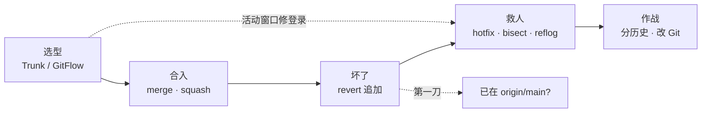
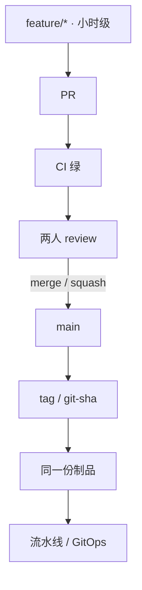
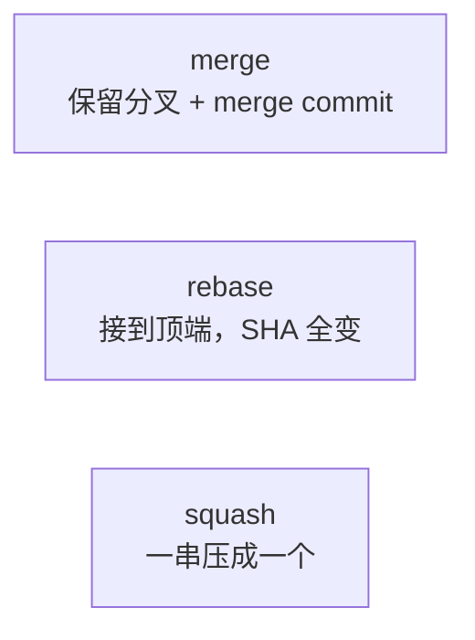
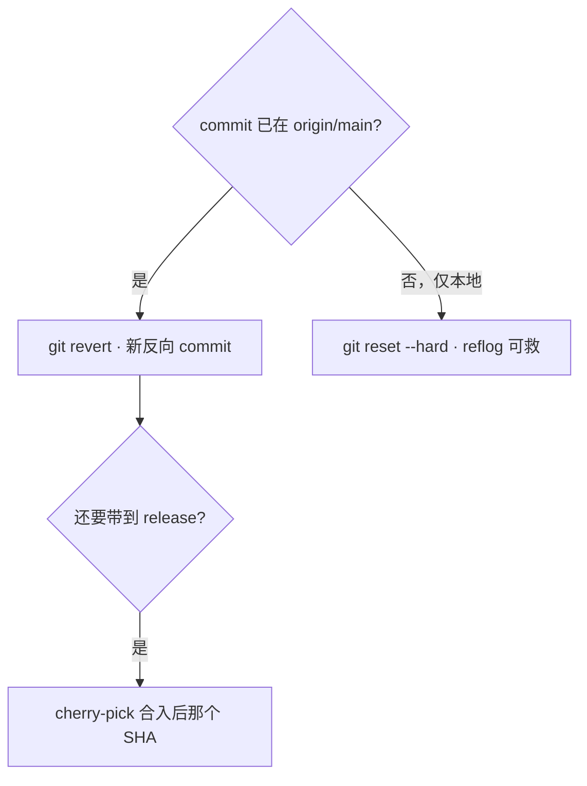
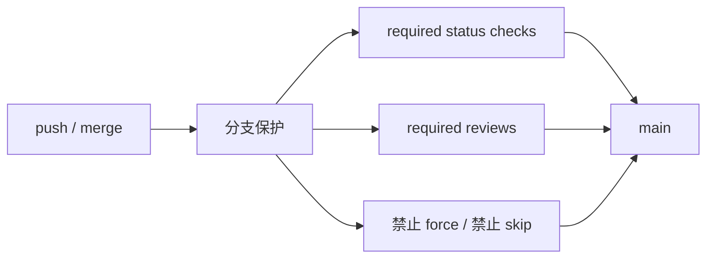
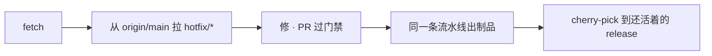
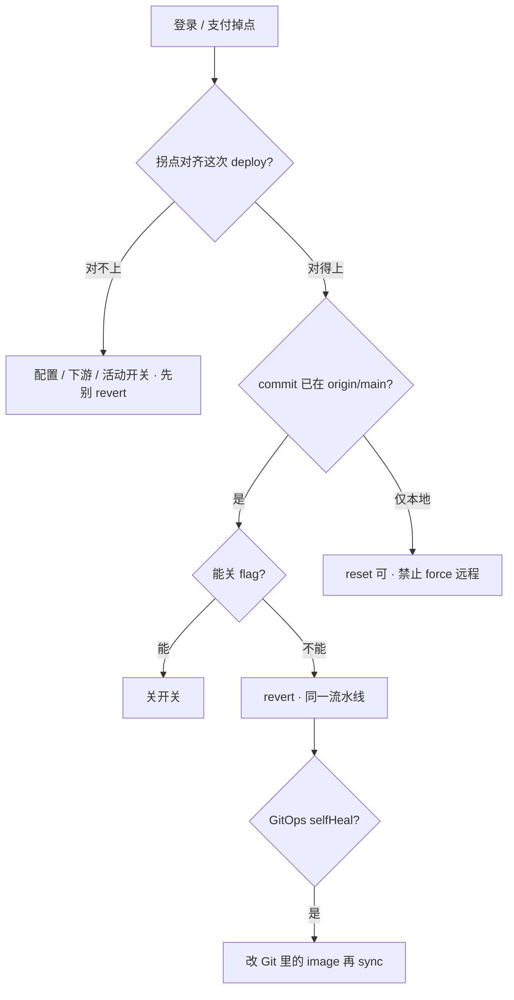

# Git 工作流

> 活动窗口 20:05，登录失败率从 0.3% 飙到 8%。`git log origin/main -1` 是 19:58 那次热更；有人喊 `git reset --hard HEAD~1 && git push -f`，有人 ssh 到逻辑服准备 vim 改超时再「补一个 commit」。Argo 开着 selfHeal，Jenkins 刚按这个 SHA 出过镜像。
> **本章回答**：线上坏了怎么判断 revert 还是 reset、hotfix 从哪拉、cherry-pick 对准哪颗 SHA、误 reset 怎么 reflog 救、GitOps 回滚改哪；分支模型和合入规则是为了动手时不选错路。
> **不讲**：流水线阶段、门禁细节 → [04 CI/CD](../04-CI-CD/)；镜像 digest、禁 latest → [03 制品](../03-制品与镜像/)；GHA / GitLab YAML → [05](../05-GitHub-Actions与GitLab-CI/)；GitOps sync、selfHeal → [03-23](../../03-Kubernetes/23-GitOps-ArgoCD与Tekton/)；客户端热更包、CDN → [07-05](../../07-游戏运维专题/05-热更新与版本发布/)。

**标记**：🎯重点 · 🔥难点 · ⭐常考 · 🔧实操

---

## 一、一张图：变更的一生

> 🎯 **一句话**：Git 在生产里是变更审计——哪次 MR、哪颗 commit、哪份制品、线上是不是同一份；坏了先问「这条变更卡在哪一段」。



- 📖 **读图**
  - 🛤️ 主线「选型 → 合入 → 坏了 → 救人 → 作战」；卡在哪一段决定动哪把刀
  - 🔑 第一刀永远问：**commit 是否已在 `origin/main`**（公共历史只能追加）

- 🎭 **值班群里在喊什么**
  - 「回滚 / force 一下」→ 先问是否公共历史
  - 「prod 改好了，补个 commit」→ 审计断了，禁止
  - 「rebase 让历史更干净」→ 确认是不是公共分支
  - 「Argo 又推回来了」→ 只改了集群、没改 Git 期望

- 🔑 **公共历史** = 已出现在别人 clone / CI / GitOps 里的 commit——只能再追加（revert / 新修复），不能擦掉
- 🔑 **个人未共享分支** = 还没被人当父 commit 用——可以 rebase；`--force-with-lease` 仅此

> 💡 **打个比方**：Git 像医院病历——已归档给别的科室看过的记录，只能追加更正说明（revert），不能撕页（force）；草稿本上改（本地未 push）另说。

> 📝 **面试**：⭐「线上坏了我先问 commit 是否已在 origin/main；在就只能 revert 走同一流水线，GitOps 必须改 Git 不能只 rollout undo。」

本节对应练习题 Q7、Q8、Q11。

---

## 二、选型：Trunk vs GitFlow ⭐🔥

> 🎯 **一句话**：服务端热更选 Trunk-based；GitFlow 把风险堆到 merge 日，活动窗口扛不住。

> 💡 **打个比方**：GitFlow 像攒了三个礼拜的快递一次拆——release 当天冲突和回归一起爆；Trunk 像每天小包裹签收，坏了只退今天那一单。

#### ❓ 为什么服务端活动窗口不该走 GitFlow？

- ❌ **develop 养三周**：登录修复还在 develop，要上线得先合 develop → 切 release → 再合 main；CI 在 release 重跑可能 **40 分钟**
- ✅ **Trunk**：从已发布的 `origin/main` 拉短分支，只带这一笔修复，同一条流水线出制品
- 🎮 **客户端整包**可以单独留 release 线（强版本号）；**服务端主干不要被它拖死**

```bash
git fetch origin
git log origin/develop --oneline -10   # 一长串 feat，登录修复埋在中间
git log origin/main --oneline -3
git checkout -b hotfix/login-timeout origin/main   # ← 从已发布 main 拉，不从 develop 清场
```

| | Trunk-based | GitHub Flow | GitFlow |
|--|-------------|-------------|---------|
| 模型 | 主干 + 极短 feature | feature → PR → main | main + develop + release + hotfix |
| 发布 | main 即发布，flag 控功能 | main 随时可部署 | release 预发，打版本号 |
| 适合 | 持续交付、服务端热更 | 中小 SaaS | 强版本号、客户端整包 |
| 活动窗口 | 小步合入，单次变更小 | 同左 | merge 日爆炸 |

- 🧱 **Trunk 三件套**（缺一就「看起来在主干，实际不能开」）
  - CI 快：目标 **小于 10 分钟**
  - 回滚快：目标 **小于 5 分钟**
  - 未完成功能用 **feature flag** 关掉（没有 flag 也能 Trunk：靠分支保护 / 滞后部署 / code owner——代价更大）

> ⚠️ **别混**：Trunk-based ≠ 谁都能直推 main。短分支 + 门禁 + flag；禁止 skip status check、禁止直推 main。

> 📝 **面试**：⭐「服务端推 Trunk：短分支、CI&lt;10min、回滚&lt;5min、未完成靠 flag。GitFlow 适合客户端整包；活动窗口 login 修复从已发布 main 拉 hotfix，不从 develop 清场。」

本节对应练习题 Q1、Q9。

---

## 三、合入：merge / rebase / squash 🔥

> 🎯 **一句话**：公共分支只 merge / squash；rebase 只整理还没跟人共享的那条。



- 📖 **读图**
  - 🚪 没有箭头从跳板机 / 生产机指回 main——生产不是 Git 仓库
  - 🛤️ 合 main 必须过门禁；坏了只追加（revert），CD / GitOps 才能跟上

三种合入形态——合的时候选，出事时历史长得不一样：



- 📖 **读图**：merge / squash 给公共分支；rebase 只给个人未共享——已推送公共分支禁止。

#### ❓ 为什么公共分支禁止 rebase？

- 🔥 rebase 会**复制 commit、换新 SHA**——别人基于旧父 commit 的 PR / clone 全错位
- 三人已基于 `release/1.2` 开发，你 rebase + force → 群里报「我的 commit 不见了」
- ✅ **口诀**：个人能 rebase，公共只追加

> 💡 **打个比方**：merge 像两本相册并排贴进家族册；rebase 像按时间重排照片、编号全变——别人还指着旧编号找，就乱了。

```bash
git fetch origin
git pull --rebase origin main          # ← 仅个人未共享分支
# CONFLICT in deploy/values-prod.yaml  → 按语义把两行都留上，不要 Accept Incoming
git add deploy/values-prod.yaml && git rebase --continue
# 搞不清：git rebase --abort
```

- 🔍 **现场**：`values-prod.yaml` 是高频冲突点——解完必须再跑 CI；禁止跳板机 Accept 一边直推 main
- 🔧 `git push -f` 日常禁用；私有分支不得已用 `--force-with-lease`（远端有新提交会拒绝）
- ⚠️ 从过期本地 main 拉 hotfix 会带脏提交：先 `fetch`，再从 `origin/main` 拉

> 📝 **面试**：「个人 feature 我 `pull --rebase` 整理；合 main 用 merge 或 squash。公共分支禁止 rebase+force。values 冲突按语义留两行，合完 CI 再跑。」

本节对应练习题 Q3、Q10。

---

## 四、回退：revert / reset / cherry-pick ⭐🔥

> 🎯 **一句话**：commit 已在 `origin/main` 只能 revert；`reset --hard` 仅限本地未 push。

回到开头那个现场：有人喊 force。先问——**这个 commit 是不是已经在 `origin/main` 上？**

> 💡 **打个比方**：revert 像发票红冲——原单还在，多一张冲销；reset 像撕账本页——别人已经对过账的就对不上了。

#### ❓ 为什么已上 main 只能 revert，不能 reset？

- 🔑 **公共历史**：同事 clone 过、Jenkins 按这个 SHA 出过镜像、Argo 盯着这份 Git——改写历史 = 别人的树对不上
- ✅ revert = **新反向 commit**，历史完整，流水线 / GitOps 能跟上
- ❌ `reset --hard` + force = 事故；已经 push 想「改注释」也不要 amend + force，再补一个 commit

```bash
git fetch origin
git log origin/main -5 --oneline
# a1b2c3d fix: login queue timeout    ← 19:58 那次，已在 origin/main
git revert a1b2c3d --no-edit         # merge commit 要加 -m 指定父
git push origin main
# GitOps：revert 改 image tag 的那次 commit，再 sync（见下 ❓）
```



- 📖 **读图**：第一分叉看公共历史；第二分叉看要不要带到还活着的 release——pick 的是**合入后**那颗。

#### ❓ 为什么 cherry-pick 要对准合入后的 SHA，不是原 feature SHA？

- squash 合入后，原 feature 上那串 `fix typo` 的 SHA **已经不在 main 上**
- pick 原 SHA → 可能空提交、冲突、或根本 pick 不到线上那份改动
- ✅ 对 `git log origin/main` 里**合入后**那一颗（或 revert 产生的那颗反向 commit）

#### ❓ 为什么 GitOps 不能只 `rollout undo`？

- 集群期望在 **Git 仓库**里（image tag / digest 写在 values）
- 只 undo 集群、Git 还是坏镜像 → selfHeal 会把你打回去
- ✅ revert 改 image 的那次 commit → sync；细节见 [03-23](../../03-Kubernetes/23-GitOps-ArgoCD与Tekton/)

> 📝 **面试**：⭐「公共历史只能 revert 追加，reset+force 是事故。GitOps 回滚改 Git 再 sync。cherry-pick 对准 squash 合入后的 SHA。」

本节对应练习题 Q2、Q4。

---

## 五、拆路：服务端 / 客户端 / 配置

> 🎯 **一句话**：服务端镜像、客户端整包、数值/活动配置、机器配置——四条路，别揉进同一条 CI。

> 💡 **打个比方**：像三条发货线——Docker 镜像走冷链、渠道 APK 走整车、活动数值走 CDN 闪送；全塞一条流水线，开服窗口会被客户端包拖死。

- 🗺️ **四条路**
  - 服务端 bug → `hotfix/*` ← `origin/main` → 同一 digest 晋升（[03](../03-制品与镜像/) / [04](../04-CI-CD/)）
  - 客户端整包 → 独立 release 线，别拖死服务端主干
  - 活动 / 数值 → feature flag 或 CDN 热更（[07-05](../../07-游戏运维专题/05-热更新与版本发布/)），不打进业务镜像
  - nginx 超时等机器配置 → Ansible template + reload（[06](../06-Ansible/)），不要为改超时 rebuild 镜像

```bash
# flag 秒关（最快，变更单记一笔）
curl -s http://config-svc/flags/login-queue-enabled   # false ← 不必出新制品
# 服务端代码才走 Git → CI → digest
git checkout -b hotfix/login-timeout origin/main
git log -1 --format='%H %s'   # ← digest ↔ commit ↔ MR 三联的起点
```

- 🔍 **现场**：活动中途先降级 / 关开关，再 revert；热更包已出去还要考虑客户端缓存
- ⭐ 能关 flag 就关——比 revert 快；长期 flag 是债务，要清理

> 📝 **面试**：「四条路分开：服务端 digest 晋升；客户端单独 release；数值 flag/CDN；机器配置 Ansible。证明线上是哪次 MR 靠 digest ↔ commit ↔ MR。」

本节对应练习题 Q9、Q10。

---

## 六、落地：门禁与保护 🔧

> 🎯 **一句话**：服务端 Trunk + 门禁；回退只 revert；hotfix 从 `origin/main` 拉；保护是权限不是提醒。



- 📖 **读图**：三道闸必须都开——CI 绿、两人 review、禁 force/skip；缺一道 = 人情发布。

- 🧱 **生产怎么选**
  - 服务端：Trunk + 短分支 + PR 门禁 + flag · 不选 develop 养三周
  - 客户端：单独 release 线 · 不拖死服务端主干
  - 合入公共：merge / squash · 禁止 rebase + 裸 force
  - 回退：revert 走同一流水线 · 禁止 reset+force main
  - hotfix：从 `origin/main` 拉 · 禁止 prod vim 补历史

- 🔧 **分支保护验收**（必须试一次）
  - `main`（及还活着的 `release/*`）：required checks、**2** 人 review、CODEOWNERS 覆盖 `values-prod.yaml` / Helm
  - force push 关、直推 main 关（含管理员）、禁止 skip、PR 模板写影响面 / 回滚 / schema
  - 直推被拒、skip 没按钮、force 没权限——没拦住就后面全是人情

> ⚠️ **别混**：禁止 force main 不只是礼貌——CI 缓存旧 SHA、Argo 追着 main，force 后可能「成功发布一份没人 review 过的树」。⭐

- 📊 **关键配置**（三端一致：本地 hook 有、托管没开 = 假保护）
  - reviews **2**；status checks 必绿；force / skip **关**
  - 个人分支 `pull.rebase=true`；`gc.reflogExpire` 默认 **90 天**——别当远程备份
  - conventional commits：`fix:` → patch，`feat:` → minor，给 changelog / semantic-release

本节对应练习题 Q6、Q7、Q11。

---

## 七、救人：hotfix · bisect · reflog 🔧

> 🎯 **一句话**：先 `fetch` 再对 `origin/main` 说话；hotfix、bisect、reflog 是值班三板斧。

### 🚑 hotfix 从哪拉 ⭐



- 📖 **读图**：起点永远是远端已发布 tip；终点是同一制品晋升，必要时再带到 release。

1. 对齐指标拐点 vs deploy 时间 vs 镜像 digest——对不上不要 revert 代码（可能是配置 / 下游 / 开关）
2. 能关 flag 就关；不能关：`hotfix/*` 从 `origin/main`，或 `git revert` 坏 commit
3. PR 过门禁，同一流水线出制品；禁止生产机直接改
4. 还活着的 release（客户端包）用 cherry-pick 带上合入后 SHA
5. 事后：根因不清就 bisect；补回归测试进门禁

```bash
git fetch origin
git log origin/main -5 --oneline
git status
git log -1 --format='%H %s'
# On branch main · up to date with 'origin/main'  ← 正常
# diverged                                        ← 当事故，可能有人 force
```

### 🔎 bisect 🔧

已知某 tag 好、HEAD 坏、中间几十上百个 commit。复杂度 log₂(n)；**80 个 commit ≈ 7 次**。

```bash
git bisect start
git bisect bad HEAD
git bisect good v1.2.0
git bisect run ./scripts/login_check.sh   # 退出码 0=好，非 0=坏
git bisect reset
```

- ⚠️ **别混**：「第一次观测到坏」≠「引入点」——观测可滞后，真正引入 commit 更早；测试必须可重复，别依赖「当时那份玩家数据」

### 🩹 reflog 救本地 🔥

#### ❓ 为什么 reflog 救不了新 clone？

- `reflog` 记的是 **本仓库 HEAD 怎么移动的**，不是远程备份
- 默认约 **90 天**（`gc.reflogExpire`）；过期 / 新 clone → 没有你的记录
- ✅ 本地误 `reset` 未 push → `git reflog` 找 `HEAD@{n}` → `reset --hard` 回去
- ❌ 已经 `push -f` 主分支 → 当事故，查分支保护、协调恢复；删了远程分支可找别人本地或托管「恢复分支」

```bash
git reflog                    # 找 reset 前的 HEAD@{n}
git checkout HEAD@{2}         # 先看对不对
git reset --hard HEAD@{2}     # 确认后再回去；未 push 才允许
```

### 🔐 敏感文件进了 Git

当泄漏 **rotate**。历史要用 filter / BFG 清，光删文件不够。仓库开 secrets scanning / gitleaks（[03](../03-制品与镜像/)）。

本节对应练习题 Q4、Q5、Q6、Q14。

---

## 八、作战：分历史 · 定责

> 🎯 **一句话**：Git 坏了先分历史、能关 flag 先关；不要 vim 逻辑服。

**Git 上坏了 = 变更审计断了或集群期望错了，不是立刻踢玩家。**



- 📖 **读图**：先对齐拐点；再分公共历史；能关开关先关；GitOps 路径必须改仓库期望。

| 现象 | 先做什么 | 不要做什么 |
|------|----------|------------|
| 坏 commit 已在 main | revert + 同一流水线；能关 flag 先关 | reset --hard + force |
| revert 了 Git 集群仍坏 | 改 Git 里 image；selfHeal 会打回 undo | 只 rollout undo |
| fetch 后 diverged | 当事故；查谁 force、分支保护 | 再 force 一次 |
| values 冲突 | 按语义留两行；CI 再跑 | 跳板机 Accept 直推 main |
| rebase 公共分支后 commit 不见了 | 别人基于旧 SHA；停 force | 继续 rebase |
| bisect 指到无辜 commit | 对照配置/下游/观测滞后 | 当根因直接 revert |
| 敏感文件进 Git | 先 rotate | 只删文件当没事 |

### 60 秒剧本 🔧

> 🔍 **现场**：接到「登录掉点 / 要不要 force」，60 秒走完这条线再下结论。

```text
① 0–10s   git fetch；git log origin/main -5；拐点是否对齐这次 deploy / digest
② 10–30s  已在 origin/main？能关 flag 先关；不能 → git revert <sha> 走同一流水线
③ 30–45s  GitOps？改 Git 里 image 再 sync，别只 rollout undo
④ 45–60s  根因不清 → bisect；本地误 reset → reflog；禁止 vim 逻辑服 / push -f
```

活动高峰：先降级 / 关开关 → 确认是这次发布 → revert 走流水线。现在再看群里那句 `git push -f`，先问 commit 是否已在 `origin/main`。

本节对应练习题 Q2、Q14。

---

## 九、收口

### 命令速查 🔧

```bash
# 对齐远端（一切操作前）
git fetch origin
git log origin/main -5 --oneline
git status
git log -1 --format='%H %s'

# 回退
git revert <sha>                 # 公共历史；merge 加 -m
git reset --hard HEAD@{n}        # 仅本地未 push；先 reflog

# 合入与同步
git pull --rebase origin main    # 仅个人未共享
git cherry-pick <合入后sha>      # 不是原 feature SHA

# 定位 / 救人
git bisect start / good / bad / run
git reflog
git blame <file>
```

### 面试锚点

| 问 | 30 秒答 |
|----|---------|
| Trunk vs GitFlow？ | 服务端 Trunk：短分支天天合；GitFlow 风险堆 merge 日，活动窗口不适合；客户端可单独 release。 |
| Trunk = 直推 main？ | 否。短分支 + 门禁 + flag；CI&lt;10min、回滚&lt;5min。 |
| rebase / merge / squash？ | 个人未共享可 rebase；公共只 merge/squash；已推送禁止 rebase+force。 |
| 线上坏了 reset 还是 revert？ | 已在 origin/main 只能 revert；reset+force 是事故。 |
| cherry-pick 哪颗？ | squash 后 pick 合入后那颗，不是原 feature SHA。 |
| GitOps 只 undo？ | selfHeal 会推回来，必须改 Git 再 sync。 |
| hotfix 从哪拉？ | `fetch` 后从 `origin/main`，同一流水线出制品；禁止 prod vim 补 commit。 |
| 为什么禁止 force main？ | 改写公共历史；CI/GitOps 可能发布没人 review 过的树。 |
| reflog 新 clone 能救？ | 不能。只在本仓库本地，约 90 天。 |
| bisect「第一次看到坏」？ | 观测可滞后，引入点可能更早；测试要可重复。 |

### 易错一句话对照

- GitFlow 更规范所以服务端热更也该用 → 长分支把风险堆到 merge 日
- Trunk-based = 谁都能直推 main → 短分支 + 门禁 + flag
- 没有 flag 就不能 Trunk → 能，但靠保护/滞后部署，未完成代码仍进生产
- 客户端整包必须拖死服务端主干 → 客户端可单独 release 线
- rebase 已推送的 release 让历史更干净 → 改写别人的父 commit
- 线上坏了 reset+force 最快 → 公共历史只能 revert
- squash 之后 cherry-pick 原 feature SHA → pick 合入后那颗
- GitOps 只 rollout undo → selfHeal 会推回来，必须改 Git
- git pull 默认 rebase → 默认常是 merge；个人分支才改 `pull.rebase`
- reflog 在新 clone 里也能救 → 只在本仓库本地，约 90 天
- 跳板机 merge values 再直推 main → 本地解完走 feature + CI
- 生产机 vim 改完补 commit → 审计对不上镜像 digest
- 「第一次看到坏」就是 bisect 引入点 → 观测可滞后
- 关 flag 不必走变更单 → 谁说了算要讲清；长期 flag 是债务

### 数字墙

> CI 目标 **小于 10 分钟** · 回滚目标 **小于 5 分钟** · bisect 80 commit ≈ **7** 次 · reflog 默认 **90 天** · required reviews **2** 人 · 活动窗口修登录：**从 `origin/main` 拉 hotfix**，不从 develop 清场

---

## 合上书

对着第一节主图口述一遍，卡住就回对应小节。开头那个喊 force 的现场——现在该能拦住他了。

- [ ] **默画主图**：选型 → 合入 → 坏了 → 救人 → 作战；第一刀问是否已在 `origin/main`。（→ Q7 · Q8）
- [ ] **口述选型**：Trunk 和 GitFlow 差在哪天爆？服务端和客户端怎么拆？Trunk 三件套是什么？（→ Q1 · Q9）
- [ ] **口述合入**：rebase / merge / squash 各何时用？为什么公共分支禁止 rebase？（→ Q3 · Q10）
- [ ] **口述回退**：已在 main 用 revert 还是 reset？为什么？cherry-pick 对准哪颗？GitOps 只 undo 行不行？（→ Q2 · Q4）
- [ ] **口述拆路**：服务端镜像 / 客户端整包 / 数值 CDN / nginx 超时各走哪条？（→ Q9 · Q10）
- [ ] **口述保护**：为什么禁止 force main？required checks / reviews / skip 各拦什么？（→ Q7 · Q11）
- [ ] **口述救人**：hotfix 从哪拉？bisect 怎么跑、观测滞后会怎样？reflog 新 clone 有没有？（→ Q4 · Q5 · Q6）
- [ ] **定责 60 秒**：拐点对齐 → 分历史 → 关 flag / revert → 改 Git sync；禁止 vim / push -f。（→ Q2 · Q14）
