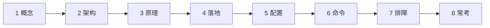
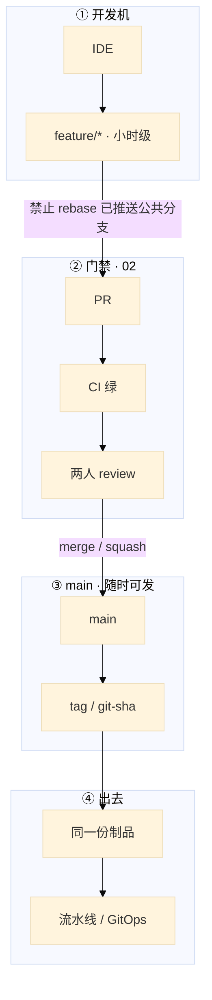
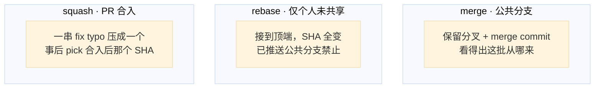
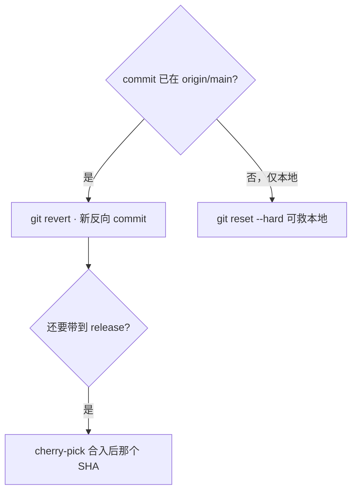
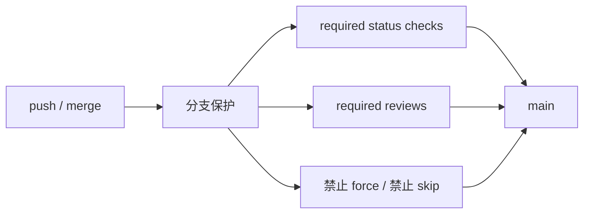
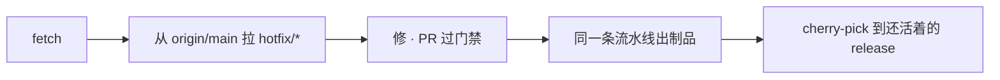
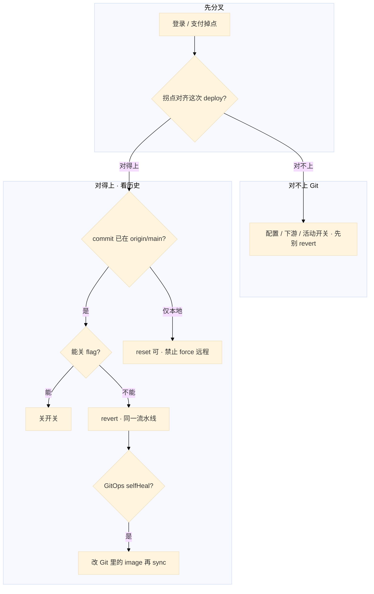

# Git 工作流

> 大家好，欢迎来到这次分享。开讲之前，先带大家回到一个很多值班同学都经历过的现场：
> 活动窗口 20:05，登录失败率从 0.3% 飙到 8%。`git log origin/main -1` 是 19:58 那次热更；群里有人已经在喊 `git reset --hard HEAD~1 && git push -f`，另有人 ssh 到逻辑服准备 vim 改超时，改完再「补一个 commit」。Argo 开着 selfHeal，Jenkins 刚按这个 SHA 出过镜像。
> 这一章讲完，你会知道当时群里那个人错在哪——为什么不能 force、hotfix 该从哪拉、GitOps 回滚改哪——以及正确的做法是什么。
> **本章回答的问题**：线上坏了怎么判断 revert 还是 reset、hotfix 从哪拉、cherry-pick 对准哪颗 SHA、误 reset 怎么 reflog 救、GitOps 回滚改哪；分支模型和合入规则，是为了让你动手时不选错路。
> **本章不讲**：流水线阶段、门禁、制品晋升 → [04 CI/CD](../04-CI-CD/)；镜像 digest、禁 latest → [03 制品](../03-制品与镜像/)；GHA / GitLab YAML、runner → [05](../05-GitHub-Actions与GitLab-CI/)；GitOps sync、selfHeal → [03-23](../../03-Kubernetes/23-GitOps-ArgoCD与Tekton/)；客户端热更包、CDN 缓存 → [07-05](../../07-游戏运维专题/05-热更新与版本发布/)。



**标记**：🎯重点 · 🔥难点 · ⭐常考 · 🔧实操

**怎么听这场分享**：咱们先钉三条主线——分历史、选对路、留审计；第二到第七节顺着「怎么合入 → 坏了怎么退 → 现场怎么救」往下走；第八节收口对错表。每一节讲完会提示对应练习题，学完就去练。

**本章主线（排障就按这三步想）：**

1. **分历史**：commit 已在 `origin/main` = 公共历史，只能 revert，禁止 force
2. **选对路**：hotfix 从 `origin/main` 拉，走同一条流水线出制品
3. **留审计**：镜像 digest ↔ commit ↔ MR；GitOps 回滚必须改 Git

**读完你能：** 白板上画出 Trunk-based 和 GitFlow 差在哪天爆；线上坏了能判断 revert 还是 reset；会从 `origin/main` 拉 hotfix、bisect、reflog 救人、改 Git 而不是只 `rollout undo`。

## 本章目录

- [1. 基本概念](#1-基本概念)
- [2. 架构图](#2-架构图)
- [3. 原理](#3-原理)
- [4. 落地](#4-落地)
- [5. 核心配置](#5-核心配置)
- [6. 命令与操作](#6-命令与操作)
- [7. 生产排障](#7-生产排障)
- [8. 必会 · 常考](#8-必会--常考)
- [合上书](#合上书问自己)

---

## 1. 基本概念

> 🎯 **一句话**：Git 在生产里是变更审计——哪次 MR、哪颗 commit、哪份制品、线上是不是同一份。

咱们先把心态摆正：Git 在生产里不是入门命令表。它是 **变更审计**：哪次 MR、哪颗 commit、哪份制品、线上现在跑的是不是同一份。大家想想，如果审计链断了，出事时你怎么证明「线上就是那次 MR」？

**值班里什么时候碰到 Git**（先听群里在喊什么，再对表）：

| 群里说的 | 技术含义 | 你的第一刀 |
|----------|----------|------------|
| 「回滚上一版」「force 一下」 | 可能改写公共历史 | 先问 commit 是否已在 `origin/main` |
| 「我在 prod 改好了，补个 commit」 | 审计断了 | 禁止；走 hotfix 分支 + 同一流水线 |
| 「rebase 一下历史更干净」 | 可能改别人的父 commit | 确认是不是公共分支 |
| 「Argo 又推回来了」 | Git 期望和集群不一致 | revert Git 里的 image，不是只 undo |

生产不是「谁先 push 谁赢」。一条变更要经过短分支、门禁、主干，再变成可追溯的制品。主干随时可发布；未完成功能靠 **feature flag** 藏着，而不是靠一条活了三周的 release 分支。

两个角色不要混：

| 角色 | 干什么 |
|------|--------|
| **公共历史** | 已经出现在别人 clone / CI / GitOps 里的 commit。只能再追加（revert / 新修复），不能擦掉 |
| **个人未共享分支** | 还没被人当父 commit 用。可以 rebase 整理；`--force-with-lease` 仅此 |

三条不要混：

| 在 Git 里管 | 不在 Git 工作流这章里管 |
|-------------|-------------------------|
| 分支怎么切、合入怎么留历史、线上怎么回退 | 流水线门禁怎么卡（02） |
| hotfix 从哪拉、cherry-pick 到哪条 release | 镜像 digest 怎么锁（03） |
| 回滚必须改 Git（GitOps 期望在仓库里） | 客户端包、CDN 缓存（08-03） |

**打个比方**：Git 像医院的病历——已经归档给别的科室看过的记录，只能追加更正说明（revert），不能撕页（force）。你在草稿本上改（本地未 push）另说。

> ⭐ **记住**：公共历史上已经出现的 commit，只能再追加。hotfix 也走同一条路出制品，禁止生产机 vim 改完再「补一个 commit」。commit message 是变更审计的一部分：`feat:` → minor，`fix:` → patch，给 semantic-release / changelog 用；没有规范至少强制 PR 模板写影响面 / 回滚。

> 📝 **面试怎么说**：⭐「线上坏了我先问 commit 是否已在 origin/main；在就只能 revert 走同一流水线，GitOps 必须改 Git 不能只 rollout undo。」

本节对应练习题 Q7、Q8、Q11——分支保护和审计链的地基在这儿。

---

## 2. 架构图

> 🎯 **一句话**：feature 过门禁进 main，坏了只追加；生产机没有箭头指回仓库。

好，概念钉住了。接下来咱们看一张图——后面合入、hotfix、排障都对着它。大家先找一件事：有没有箭头从跳板机 / 生产机指回 main？



**读图三句话：**

1. **没有箭头从跳板机 / 生产机指回 main**——生产不是 Git 仓库；vim 改完补 commit 会断审计链。
2. **合 main 必须过门禁**——从 feature 进 pr → ci → rv，禁止 skip status check、禁止直推 main。
3. **坏了只追加**——revert 新 commit，不改写历史，CD / GitOps 才能跟上。

三种合入形态（合的时候选，出事时历史长得不一样）——⭐ 面试常考，先记住「公共分支禁止 rebase」：



口诀先记一句：**个人能 rebase，公共只追加**。下一节咱们把模型选法和 revert / reset 拆开讲透。

本节对应练习题 Q3——三种合入形态就是那道题的白板答案。

---

## 3. 原理

### 3.1 Trunk-based vs GitFlow vs GitHub Flow ⭐🔥

> 🎯 **一句话**：服务端热更选 Trunk-based；GitFlow 把风险堆到 merge 日，活动窗口扛不住。

🔥 很多人一听「工作流」就背 GitFlow 五条线——大家想想，活动窗口要修登录，`develop` 已经养了三周，你真的会先把三周变更清干净再发吗？

> 💡 **打个比方**：GitFlow 像攒了三个礼拜的快递一次拆——release 当天冲突和回归一起爆；Trunk 像每天小包裹签收，坏了只退今天那一单。

**现场走一遍**（活动窗口 20:00 登录要修，仓库是 GitFlow）：

1. 先看 `develop` 上养了几周：

```bash
git fetch origin
git log origin/develop --oneline -10
git log origin/main --oneline -3
```

2. 屏幕出现：

```text
f7a8b9c feat: hall payment refactor
e6d5c4b feat: battle skill v2
d3c2b1a feat: login queue timeout   ← 你要的修复在这里
...
a1b2c3d fix: last prod release
```

3. **说明什么**：登录修复在 `develop` 上，还没进 `main`；要上线得先合 develop → 切 release → 再合 main。`git log develop` 一长串，PR 上 `values-prod.yaml` 红成一片，CI 在 release 分支重跑 **40 分钟**。

4. 卡住先问：**这条修复能不能从已发布的 main 拉短分支直接走**——Trunk 的做法：

```bash
git checkout -b hotfix/login-timeout origin/main
# 只 cherry 登录那一笔改动，PR 回 main，同一条流水线
```

5. 对照表选模型：

| | Trunk-based | GitHub Flow | GitFlow |
|--|-------------|-------------|---------|
| 模型 | 主干 + 极短 feature | feature → PR → main | main + develop + release + hotfix |
| 发布 | main 即发布，flag 控功能 | main 随时可部署 | release 分支预发，打版本号 |
| 适合 | 持续交付、服务端热更 | 中小 SaaS | 强版本号、客户端整包 |
| 活动窗口 | 小步合入，单次变更小 | 同左 | merge 日爆炸 |

Trunk-based 不是「谁都能直推 main」。它要求三件事同时成立：CI 必须快（目标 **小于 10 分钟**）；回滚必须快（目标 **小于 5 分钟**）；未完成功能用 **feature flag** 关掉。没有 flag 也能 Trunk：靠分支保护、滞后部署或严格 code owner——代价是「看起来在主干，实际不能开」。客户端整包可以单独留 release 线，**服务端主干不要被它拖死**。

**输出解读**：

| 你看到 | 说明 | 下一步 |
|--------|------|--------|
| 修复只在 develop | GitFlow 路径长 | 评估能否从 main 拉 hotfix |
| main 落后 develop 三周 | merge 日风险 | 活动窗口别走 release 大合并 |
| `origin/main` 就是线上 digest | hotfix 从这里拉 | `fetch` 后再切分支 |

> 📝 **面试怎么说**：⭐「服务端我推 Trunk-based：短分支、CI 小于 10 分钟、回滚小于 5 分钟、未完成功能靠 flag。GitFlow 适合客户端整包，别拖死服务端主干；活动窗口 login 修复我从已发布 main 拉 hotfix，不从 develop 清场。」

口诀：**服务端短分支天天合，客户端长分支可以养；活动窗口修登录，从 main 拉，不从 develop 清场。**

本节对应练习题 Q1、Q9。

### 3.2 merge / rebase / squash 🔥

> 🎯 **一句话**：公共分支只 merge / squash；rebase 只整理还没跟人共享的那条。

大家想想：已经有三人基于 `release/1.2` 开发，你 rebase 完 force push——别人的父 commit 全变了，群里会报什么？「我的 commit 不见了」。

> 💡 **打个比方**：merge 像把两本相册并排贴进家族册，看得出从哪条支脉来；rebase 像把照片按时间重排，编号全变——别人还指着旧编号找，就乱了。

**现场走一遍**（`feature/login-queue` 还没推成公共分支，`origin/main` 已前进 8 个 commit）：

1. 个人分支同步主干：

```bash
git fetch origin
git pull --rebase origin main
```

2. 屏幕卡在冲突：

```text
Auto-merging deploy/values-prod.yaml
CONFLICT (content): Merge conflict in deploy/values-prod.yaml
error: could not apply a1b2c3d... fix: login queue timeout
```

3. 打开文件，两边都加了一行——你加登录超时，别人加了 Ingress host。**不要 Accept Incoming / Current**——按语义把两行都留上：

```bash
git add deploy/values-prod.yaml
git rebase --continue
# 搞不清自己改过什么：git rebase --abort
```

4. 解完必须再跑一遍 CI。合入公共分支时选 merge 或 squash，**禁止 rebase 已推送的 release/main**。

5. 对照三种方式：

| 方式 | 效果 | 何时用 |
|------|------|--------|
| merge | 保留分支分叉 + merge commit | 合入公共分支 |
| rebase | 复制 commit 接到顶端，SHA 全变 | **仅个人未共享分支** |
| squash | 多 commit 压成一个 | PR 合入清噪音 |

**输出解读**：

| 输出 / 现象 | 说明 | 别做什么 |
|-------------|------|----------|
| `CONFLICT in values-prod.yaml` | 配置高频冲突点 | 跳板机 Accept 一边直推 main |
| rebase 后 SHA 全变 | 别人基于旧 SHA 的 PR 全错 | 对已推送公共分支 rebase + force |
| 反复冲突 | 分支活太久 | 缩短分支或改 Trunk |

`git push -f` 日常禁用；私有分支不得已用 `--force-with-lease`（远端有新提交会拒绝）。从过期本地 main 拉 hotfix 会带上脏提交：先 `fetch`，再从 `origin/main` 拉。

> 📝 **面试怎么说**：「个人 feature 我 pull --rebase 整理；合 main 用 merge 或 squash。公共分支禁止 rebase+force——会改别人的父 commit。values 冲突按语义留两行，合完 helm template 或 CI 再跑一遍。」

> ⭐ **记住**：公共分支只追加（merge / squash）；rebase 只整理还没跟人共享的那条。口诀——**个人 rebase，公共 merge/squash；已推送禁止 rebase+force**。

本节对应练习题 Q3、Q10。

### 3.3 revert / reset / cherry-pick ⭐🔥

> 🎯 **一句话**：commit 已在 `origin/main` 只能 revert；reset --hard 仅限本地未 push。

回到开头那个现场：有人喊 force。大家先问一句——**这个 commit 是不是已经在 `origin/main` 上？** 很多人会答「reset 最快」——错了。已在公共历史，只能 revert。

🔥「公共历史」第一次听可能有点抽象：意思是 **别人 clone / CI / GitOps 已经当父 commit 用过的那些提交**——你一改写，别人的树就对不上。

> 💡 **打个比方**：revert 像发票红冲——原单还在，多一张冲销；reset 像撕账本页——别人已经对过账的就对不上了。

**现场走一遍**（登录失败率掉点，deploy 时间 19:58 对齐）：

1. 对齐公共历史：

```bash
git fetch origin
git log origin/main -5 --oneline
git status
```

2. 屏幕出现：

```text
a1b2c3d fix: login queue timeout    ← 19:58 那次
d4e5f6g feat: hall ingress
e7f8g9h chore: bump base image
...
On branch main
Your branch is up to date with 'origin/main'.
```

3. **说明什么**：坏 commit `a1b2c3d` 已在 `origin/main`，同事 clone 过、Jenkins 按这个 SHA 出过镜像、Argo 盯着这份 Git——**只能 revert，禁止 reset --hard + force**。

4. 执行 revert 并走同一流水线：

```bash
git revert a1b2c3d --no-edit    # merge commit 要加 -m 指定父
git push origin main
# GitOps：revert 改 image tag 的那次 commit，再 sync
```

5. 若 revert 了 Git 但集群还是坏镜像——Argo selfHeal 会打回 `rollout undo`。**必须改 Git 里的 image**（细节 04-22）。

**输出解读**：

| 场景 | 命令 | 结果 |
|------|------|------|
| 坏 commit 在 origin/main | `git revert <sha>` | 新反向 commit，历史完整 |
| 仅本地误 commit | `git reset --hard HEAD@{n}` | reflog 可救，**未 push** |
| hotfix 还要带到 release | `git cherry-pick <合入后sha>` | squash 后 pick 合入那颗，不是原 feature SHA |
| revert merge commit | `git revert -m 1 <sha>` | 指定保留哪条父线 |



已经 push 的 commit 想「改注释」：不要 amend + force，再补一个 commit。

> 📝 **面试怎么说**：⭐「公共历史只能 revert 追加，reset+force 是事故。GitOps 回滚 revert 改 image 的 commit 再 sync，只 rollout undo selfHeal 会推回来。cherry-pick 要对准 squash 合入后的 SHA。」

口诀：**已上 main 只 revert；本地未 push 才 reset；cherry-pick 对准合入后那颗 SHA，不是原 feature SHA。**

本节对应练习题 Q2、Q4——开头那个 force 现场，正确答案就在这儿。

### 3.4 游戏热更和 CI 怎么拆

> 🎯 **一句话**：服务端镜像、客户端整包、数值/活动配置——四条路，别揉进同一条 CI。

有人改 nginx 超时也要 rebuild 镜像——大家想想，这值得走完整条 CI 吗？

> 💡 **打个比方**：像一家游戏公司三条发货线——Docker 镜像走冷链车、渠道 APK 走整车物流、活动数值走 CDN 闪送；全塞进一条流水线，开服窗口会被客户端包拖死。

**现场走一遍**（运营要改 nginx 超时，有人提议「重新 build 镜像走 Jenkins」）：

1. 先问能不能不动镜像：

```bash
# flag 秒关（最快）
curl -s http://config-svc/flags/login-queue-enabled   # false

# 或 Ansible reload（04），不要为改超时走镜像 CI
ansible-playbook deploy/nginx-timeout.yml --limit login-gw
```

2. 服务端代码变更才走 Git → CI → digest：

```bash
git fetch origin
git checkout -b hotfix/login-timeout origin/main
# 修代码 → PR → 同一流水线出 digest（02 / 03）
git log -1 --format='%H %s'
```

3. 屏幕对照三条链：

```text
# 服务端：digest ↔ commit ↔ MR
a1b2c3d4... fix: login queue timeout

# 客户端整包：独立 release 线（01 / 08）
release/3.2.1 · 渠道包流水线

# 数值热更：CDN / flag（08-03），不打进业务镜像
```

4. **说明什么**：改 nginx 超时走 Ansible reload；活动数值走 flag 或 CDN；只有服务端二进制变更才 rebuild 镜像。Git 只保证服务端制品可追溯。

5. 活动中途：先降级 / 关活动开关，再 revert。热更包已出去的还要考虑客户端缓存（08-03）。

**输出解读**：

| 变更类型 | 走哪 | 不要 |
|----------|------|------|
| 服务端 bug | hotfix ← origin/main → 同一 digest 晋升 | prod vim 补 commit |
| 客户端整包 | 独立 release 线 | 拖死服务端主干 |
| 活动 / 数值 | flag 或 CDN 热更 | 为改配置 rebuild 镜像 |
| nginx 超时 | Ansible template + reload | 走镜像 CI |

能关 flag 就关——比 revert 快，不必出新制品。flag 要清理，长期开着是债务。

> 📝 **面试怎么说**：「四条路分开：服务端镜像 CI 一次构建 digest 晋升；客户端单独 release；数值 flag 或 CDN；机器配置 Ansible。活动中途先关开关再 revert；证明线上是哪次 MR 靠 digest ↔ commit ↔ MR 三联。」

本节对应练习题 Q9、Q10。

---

## 4. 落地

> 🎯 **一句话**：服务端 Trunk + 门禁；回退只 revert；hotfix 从 `origin/main` 拉。

原理讲完了，落到生产你怎么选、分支保护你实际看到什么。

### 4.1 生产怎么选

| 项 | 选 | 不选 |
|----|----|------|
| 服务端模型 | Trunk-based：短分支 + PR 门禁 + flag | GitFlow develop 养三周再热更登录 |
| 客户端 | 单独 release 线 / 强版本号 | 客户端发版日历拖死服务端主干 |
| 合入公共分支 | merge 或 squash | rebase + 裸 force |
| 回退 | revert 走同一条流水线 | reset --hard + force main |
| hotfix | 从 `origin/main` 拉，同一制品晋升 | 生产机 vim 改完补历史 |
| 未完成功能 | feature flag | 活三周的 feature 分支当隔离 |

托管 GitHub / GitLab / 自建：上线前问清分支保护谁改、能否 skip check、force 是否真关、CODEOWNERS 是否覆盖 Helm values。

### 4.2 分支保护落地你实际看到什么

保护是权限，不是提醒。没拦住 force / skip，后面全是人情发布。



| 项 | 内容 |
|----|------|
| 保护分支 | `main`（以及还活着的 `release/*`） |
| required status checks | CI 绿才能合；**禁止 skip** |
| required reviews | **2** 人；CODEOWNERS 覆盖 `values-prod.yaml` / Helm |
| force push | 关 |
| 直推 main | 关；包括管理员 |
| PR 模板 | 影响面 / 回滚 / 是否改 schema |

验收：必须试一次——直推 main 被拒、skip check 没按钮、force 没权限。禁止 force main 的运维理由：CI 缓存旧 SHA、Argo 追着 main，force 后可能「成功发布一份没人 review 过的树」。⭐ 这是面试必考的「为什么禁止 force」运维口径，不只是礼貌。

本节对应练习题 Q7、Q11。

---

## 5. 核心配置

> 🎯 **一句话**：保护规则三端一致；reflog 是本机记录，不是远程备份。

只动有证据的项。保护规则三端必须一致，不要「本地 hook 有、托管没开」。

| 参数 | 默认/常见 | 生产怎么用 | 改错会怎样 |
|------|-----------|------------|------------|
| required reviews | 0 | **2**；values / Helm 加 CODEOWNERS | 一人合入绕过 |
| required status checks | 无 | CI 绿；禁止 skip | 人情发布，故障不可审计 |
| allow force push | 视托管 | **关** main / release | 历史改写，CI/GitOps 乱 |
| allow skip status checks | 视托管 | **关** | 扫描和测试被拆掉 |
| `git pull` 默认 | merge | 个人分支改 `pull.rebase=true` | 无意义 merge commit 一团 |
| `gc.reflogExpire` | **90 天** | 保持默认；别当备份 | 过期 / 新 clone 救不了 |
| conventional commits | 无 | `fix:` / `feat:` 驱动 changelog | 「update」无法反查 MR |

> ⭐ **记住**：分支保护用来拦住 skip 和 force。reflog 是本机 HEAD 移动记录，不是远程备份；新 clone 没有你的 reflog。口诀——**reflog 救本地，救不了新 clone；默认约 90 天**。

本节对应练习题 Q6、Q11。

---

## 6. 命令与操作

> 🎯 **一句话**：先 `fetch` 再对 `origin/main` 说话；hotfix、bisect、reflog 是值班三板斧。

好，配置钉住了。接下来是动手——值班先跑哪几条、hotfix 怎么走、bisect / reflog 怎么救。

### 6.1 命令速查 🔧

先 `fetch`，再对 `origin/main` 说话。

| 目的 | 命令 | 看什么 |
|------|------|--------|
| 对齐远端 | `git fetch origin` | 再从 `origin/main` 拉 hotfix |
| 谁在尖上 | `git log origin/main -1 --oneline` | 坏 commit 是否已是公共历史 |
| 反向 | `git revert <sha>` | 新 commit；merge 要 `-m` |
| 本地回退 | `git reset --hard HEAD@{n}` | **未 push** 才允许 |
| 个人同步 | `git pull --rebase origin main` | 确认不是公共分支 |
| 带修复 | `git cherry-pick <sha>` | squash 后 pick 合入后那颗 |
| 二分 | `git bisect start` / `good` / `bad` / `run` | 退出码 0=好 |
| 救 HEAD | `git reflog` | 本仓库本地；新 clone 没有 |
| 配置何时引入 | `git blame <file>` | 比在群里问快 |

值班先跑这四条：

```bash
git fetch origin
git log origin/main -5 --oneline
git status
git log -1 --format='%H %s'
```

```text
a1b2c3d fix: login queue timeout
d4e5f6g feat: hall ingress
...
On branch main
Your branch is up to date with 'origin/main'.
a1b2c3d4e5f6... fix: login queue timeout
```

| 输出 | 正常 | 异常 |
|------|------|------|
| `up to date with origin/main` | 本地与远端一致 | diverged → 可能有人 force |
| 最新 commit 时间对齐 deploy | 可指向这次发布 | 对不上 → 先查配置/开关 |

### 6.2 hotfix ⭐🔧

从 **已发布的 main** 拉，不要从过期本地 main 拉。大家想想：从过期本地 main 拉会怎样？会把脏提交带进 hotfix——所以必须先 `fetch`，再从 `origin/main` 切。



1. 对齐指标拐点 vs deploy 时间 vs 镜像 digest。对不上不要 revert 代码——可能是配置、下游、活动开关。
2. 能关 flag 就关（变更单记一笔），不必出新包。
3. 不能关：`hotfix/*` 从 `origin/main` 拉，或 `git revert` 坏 commit。
4. PR 过门禁，同一条流水线出制品并晋升。禁止生产机直接改。
5. 还活着的 release（客户端包）用 cherry-pick 带上。
6. 事后：根因不清就 bisect；补回归测试进门禁。

### 6.3 bisect 🔧

已知某个 tag 好、HEAD 坏、中间几十上百个 commit。复杂度 log₂(n)；**80 个 commit 大约 7 次**。比翻 MR 快——前提是测试可重复。

```bash
git bisect start
git bisect bad HEAD
git bisect good v1.2.0
git bisect run ./scripts/login_check.sh   # 退出码 0=好，非 0=坏
git bisect reset
```

测试必须可重复，不要依赖「当时那份玩家数据」。常见误判：把「第一次观测到坏」当成「引入点」——观测滞后时真正引入 commit 更早。

### 6.4 reflog 救本地 🔥

`reflog` 记 **本仓库 HEAD 怎么移动的**，不是远程备份。默认约 **90 天**（`gc.reflogExpire`）。高频错答：以为新 clone 也能 reflog——救不了。

```bash
git reflog                    # 找 reset 前的 HEAD@{n}
git checkout HEAD@{2}         # 先看对不对
git reset --hard HEAD@{2}     # 确认后再回去；未 push 才允许
```

| 操作 | 还能不能救 | 怎么救 |
|------|------------|--------|
| 本地 reset 未 push | 能 | reflog → reset --hard HEAD@{n} |
| push -f 主分支 | 当事故 | 查分支保护、协调恢复 |
| 删了远程分支 | 能 | 别人本地还有 / 托管「恢复分支」 |

### 6.5 敏感文件进了 Git

当泄漏 **rotate**。历史要用 filter / BFG 清，光删文件不够。仓库开 secrets scanning / gitleaks（03）。

本节对应练习题 Q4、Q5、Q6、Q14。

---

## 7. 生产排障

> 🎯 **一句话**：Git 坏了先分历史、能关 flag 先关；不要 vim 逻辑服。

回到开头那个现场。三问：进程还在不在？还能不能变更？已有流量还通不通？

**Git 上坏了 = 变更审计断了或集群期望错了，不是立刻踢玩家。** 能关 flag 就关；不要重启还活着的战斗服。



| 现象 | 先做什么 | 不要做什么 |
|------|----------|------------|
| 坏 commit 已在 main | revert + 同一流水线；能关 flag 先关 | reset --hard + force |
| revert 了 Git 集群仍坏 | 改 Git 里 image；selfHeal 会打回 undo | 只 rollout undo |
| fetch 后 diverged | 当事故；查谁 force、分支保护 | 再 force 一次 |
| values 冲突 | 按语义留两行；CI 再跑 | 跳板机 Accept 直推 main |
| rebase 公共分支后 commit 不见了 | 别人基于旧 SHA；停 force | 继续 rebase |
| bisect 指到无辜 commit | 对照配置/下游/观测滞后 | 当根因直接 revert |
| 敏感文件进 Git | 先 rotate | 只删文件当没事 |

活动高峰：先降级 / 关开关 → 确认是这次发布 → revert 走流水线。不要 vim 逻辑服。现在再看群里那句 `git push -f`，你知道该怎么拦住他了——先问 commit 是否已在 `origin/main`。

本节对应练习题 Q2、Q14。

---

## 8. 必会 · 常考

遮住「口径」列自问自答，卡壳的行回去重读对应小节——这张表把前面的坑串起来了：

| 说法 | 对错 | 口径 |
|------|:----:|------|
| GitFlow 更规范所以服务端热更也该用 | 错 | 长分支把风险堆到 merge 日，活动窗口不适合 |
| Trunk-based = 谁都能直推 main | 错 | 短分支 + 门禁 + flag；CI 小于 10 分钟、回滚 小于 5 分钟 |
| 没有 flag 就不能 Trunk | 错 | 能，但未完成代码进生产，靠保护或滞后部署 |
| 客户端整包必须拖死服务端主干 | 错 | 客户端可单独 release 线 |
| rebase 已推送的 release/* 让历史更干净 | 错 | 改写别人的父 commit |
| 线上坏了 reset --hard + force 最快 | 错 | 公共历史只能 revert |
| squash 之后 cherry-pick 原 feature SHA | 错 | pick 合入后那颗 |
| GitOps 只 rollout undo 就行 | 错 | selfHeal 会推回来，必须改 Git |
| git pull 默认 rebase | 错 | 默认常是 merge |
| reflog 在新 clone 里也能救 | 错 | 只在本仓库本地，约 90 天 |
| 跳板机 merge values 再直推 main | 错 | 本地解完走 feature + CI |
| 生产机 vim 改完补 commit | 错 | 审计对不上镜像 digest |
| 「第一次看到坏」就是 bisect 引入点 | 错 | 观测可滞后 |
| 关 flag 不必走变更单 | 错 | 谁说了算要讲清；长期 flag 是债务 |

数字：CI 目标 **小于 10 分钟**；回滚目标 **小于 5 分钟**；bisect 80 commit ≈ **7** 次；reflog 默认 **90 天**；review **2** 人。

易混：Trunk vs GitFlow（频率 vs 日历）；rebase vs merge（个人 vs 公共）；revert vs reset（追加 vs 擦历史）；cherry-pick 原 SHA vs 合入后 SHA；flag 关功能 vs revert 拿走代码；服务端热更 CI vs 客户端整包 vs CDN 数值。

---

## 合上书，问自己

学到这里，先别急着翻下一章。合上书，试试下面几件事能不能做到——卡住的那一条，回到对应小节再听一遍：

- [ ] **口述模型**：Trunk-based 和 GitFlow 差在哪天爆？服务端和客户端怎么拆？（对应练习题 Q1）
- [ ] **口述合入**：rebase / merge / squash 各何时用？已推送公共分支能不能 rebase？（Q3）
- [ ] **口述回退**：坏 commit 已在 main，revert 还是 reset？GitOps 只 undo 行不行？（Q2）
- [ ] **口述 hotfix**：从哪拉？cherry-pick 对准哪颗 SHA？（Q4）
- [ ] **口述定位 / 救人**：bisect 怎么跑？观测滞后会怎样？reflog 新 clone 有没有？（Q5、Q6）
- [ ] **口述拆分与保护**：游戏热更、客户端整包、改 nginx 超时各走哪条？为什么禁止 force main？（Q7、Q10、Q14）

六题都能口述，这一章就过了——开头那个喊 force 的现场，你现在能拦住他了。下一章把镜像分层、PID 1、overlay2 剖开。
