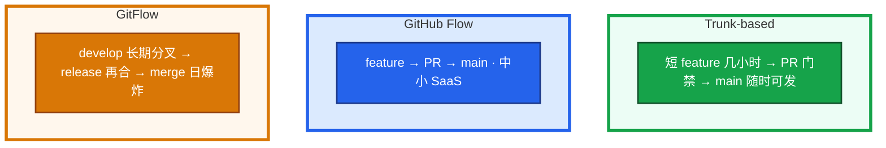
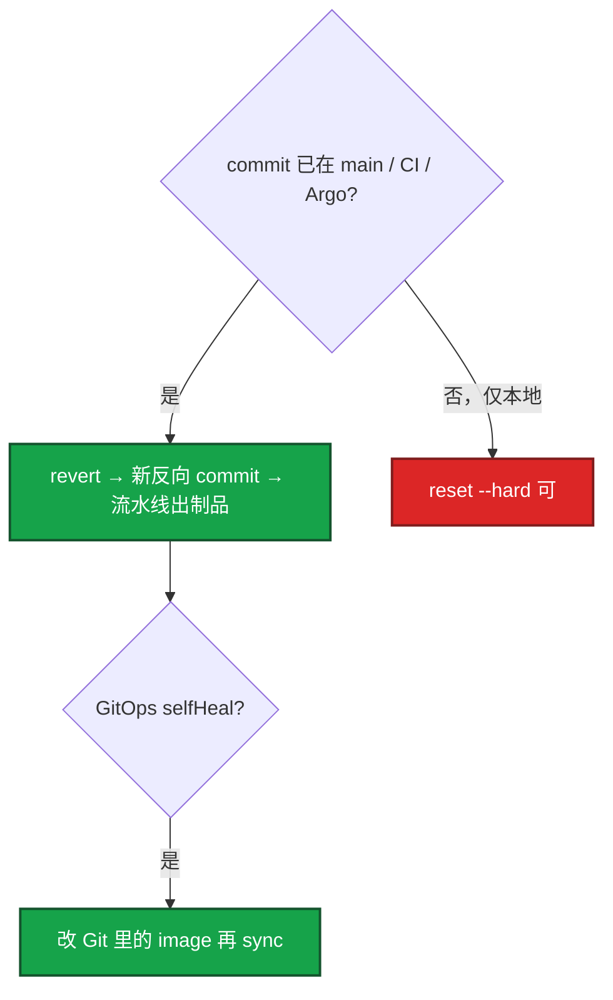
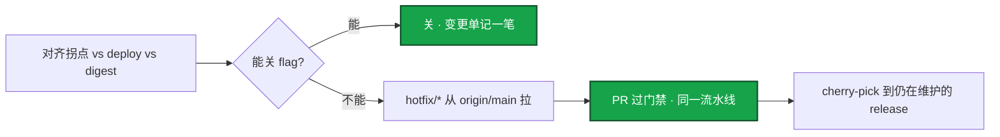
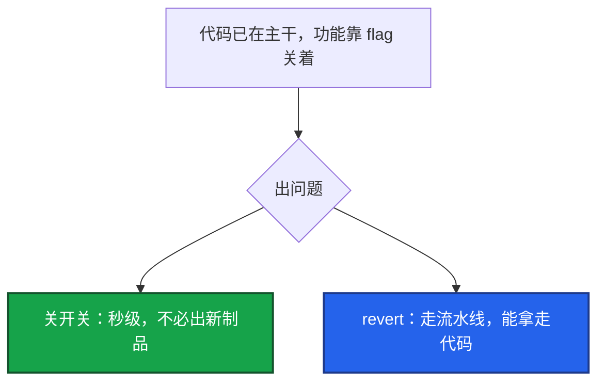

# 01｜Git 工作流 · 练习题

先对照 [知识点](知识点.md) **本章主线** 自己口述，再对答案。关键字（Trunk、revert、hotfix、cherry-pick、bisect、reflog、force push）要能点名。每题标了覆盖范围：

| 标记 | 含义 |
|------|------|
| **核心** | 不懂整章就没建立起来 |
| **必会** | 值班和面试都要能讲 |
| **常用** | 线上会反复碰到 |
| **常考** | 白板和追问的高频口径 |

## 本题目录

- [Q1 Trunk / GitHub Flow / GitFlow](#q1)
- [Q2 revert vs reset / GitOps](#q2)
- [Q3 merge / rebase / squash](#q3)
- [Q4 生产 hotfix](#q4)
- [Q5 bisect](#q5)
- [Q6 reflog](#q6)
- [Q7 禁止 force main](#q7)
- [Q8 conventional commits](#q8)
- [Q9 feature flag vs revert](#q9)
- [Q10 冲突 / 热更和 CI 拆](#q10)
- [合上书](#合上书)

---

## Q1

**★★★★★｜Trunk-based、GitHub Flow、GitFlow 怎么选？大厂为什么不爱 GitFlow？**

**覆盖**：核心 · 必会 · 常考

**对应**：知识点 §3.1

### 场景

白板：「你们怎么发版？」有人开始背 GitFlow 的 develop / release / hotfix 五条线。下周有活动要热更登录。`develop` 已经养了三周。

### 完整解答

**一句话**：服务端热更选 Trunk-based 短分支 + CI 门禁；GitFlow 长分支把风险堆到 merge 日。

先画频率，再报名。SRE 怕的是长分支把风险堆到 merge 当天。



1. **持续交付、服务端热更** → Trunk-based：短分支 + CI 门禁 + feature flag。要求 CI <10min、回滚 <5min。
2. **中小 SaaS、main 即部署** → GitHub Flow。
3. **强版本号、客户端整包** → 可以 GitFlow 或单独 release 线；**服务端主干不要被客户端发版日历拖死**。

没有 flag 也能 Trunk，但未完成代码会进生产二进制，必须靠分支保护或滞后部署。主干合得越勤，单次变更越小，MTTR 越好做。大厂 Aone 一类流程本质是主干 + PR 门禁。

### 再追问

- 和发布频率什么关系？——集成越勤冲突越少。活动窗口要的是小步发布，不是等一条大 release。
- 登录修复必须先合 develop？——不必。从已发布的 main 拉短分支直接走，别先把 develop 清干净。

---

## Q2

**★★★★★｜线上坏了，revert 还是 reset？GitOps 只 rollout undo 行不行？**

**覆盖**：核心 · 必会 · 常考

**对应**：知识点 §3.3

### 场景

活动中登录成功率掉了，坏 commit 已经在 main 上，Jenkins 和 Argo 都按这个 SHA 在跑。有人准备 `reset --hard` 再 force push。

### 完整解答

**一句话**：已在 main / CI / Argo 上的 commit 只能 revert 走流水线；GitOps 回滚必须改 Git。

已推送公共分支只用 `git revert`，再走同一条流水线。`reset --hard` + force 改写历史，生产禁止。



GitOps 必须改 Git。只 `kubectl rollout undo`、仓库里仍是新 tag，控制器会再推回来。hotfix：短分支修复 → 同一制品晋升；需要带到 release 就 cherry-pick。

`--force-with-lease` 仅私有分支：远端有新提交会拒绝。已经 push 的 commit 改注释：不要 amend + force，再补一个 commit。

### 再追问

- revert 了 merge commit 怎么办？——要 `-m` 指定父。搞不清就不要硬 revert merge，改成 revert 有效改动或直接修。
- revert 了 Git 流水线绿、集群还是坏镜像？——image 没改回去。selfHeal 盯的是 Git。

---

## Q3

**★★★★★｜merge / rebase / squash 各何时用？为什么不能 rebase 已推送的公共分支？**

**覆盖**：核心 · 必会 · 常考

**对应**：知识点 §3.2

### 场景

有人在已经有三人基于它开发的 `release/1.2` 上 rebase 了 main，然后 force push。群里开始报「我的 commit 不见了」。

### 完整解答

**一句话**：个人未共享分支 rebase；合入主干 merge/squash；已推送公共分支禁止 rebase 和裸 force。

rebase 会复制 commit、改 SHA。别人基于旧 SHA 会分叉地狱。

| 场景 | 用 |
|------|----|
| 个人未共享分支 | rebase 到最新 main，历史线性 |
| 合入主干 | merge 或 squash（看团队要不要保留分叉） |
| 已推送公共分支 | **禁止 rebase / 禁止裸 force** |

squash 清掉「fix typo」，但中间 SHA 消失。事后 cherry-pick 要对准 **合入后** 那个 commit，不要 pick 已经没了的原 SHA。

冲突按语义解：Helm values、Ingress、flag 配置不能盲目 ours / theirs。解完再跑 CI。rebase 到一半搞不清就 `--abort`。

### 再追问

- 冲突解决完 CI 还红？——漏合进来的文件、rebase 丢了 commit、submodule SHA 没更。
- 个人分支怎么同步主干？——`git pull --rebase`，先确认没当公共历史。`git pull` 默认可能多一个 merge commit。

---

## Q4

**★★★★★｜生产 hotfix 完整步骤？活动中途呢？从哪拉分支？**

**覆盖**：核心 · 必会 · 常用

**对应**：知识点 §6.2

### 场景

支付回调挂了。指标拐点和 10 分钟前那次发布对齐。有人已经 ssh 到逻辑服准备 vim。

### 完整解答

**一句话**：生产 hotfix 从 origin/main 拉短分支，走同一条 CI 出 digest；能关 flag 就先关。

禁止生产机直接改。先问能不能关 flag，再走 Git。



1. 对齐：指标拐点 vs deploy 时间 vs 镜像 digest。对不上不要 revert 代码。
2. 能关 flag → 关，不必出新包。
3. 不能关 → revert 或 `hotfix/*` 从 **`origin/main`** 拉（先 `fetch`，不要从过期本地 main 拉——会带上脏提交）。
4. PR 过门禁，同一条流水线出制品并晋升。
5. cherry-pick 到仍在维护的 release（客户端包）。
6. 事后补回归进门禁。

活动中途：先降级活动 / 关开关，再动代码。热更包已经到客户端的，Git 只管服务端可追溯，客户端缓存是游戏发布问题（08-03）。

### 再追问

- hotfix 和 main 已分叉？——cherry-pick 后可能再解一次冲突。不要在 prod 提交再反向 merge。
- 为什么必须同一条流水线？——审计对得上镜像 digest；跳板机 vim 对不上。

---

## Q5

**★★★★☆｜git bisect 怎么用？什么时候会误导？**

**覆盖**：必会 · 常用

**对应**：知识点 §6.5

### 场景

v1.2.0 登录正常，HEAD 失败率升高，中间 80 个 commit。有人在翻 MR 列表。群里猜「是不是那次改 Redis 超时」。

### 完整解答

**一句话**：bisect 用可重复脚本 log₂(n) 次定位；根因在配置/下游时 bisect 会误导。

```bash
git bisect start
git bisect bad HEAD
git bisect good v1.2.0
git bisect run ./scripts/login_check.sh   # 0=好，非 0=坏
git bisect reset
```

log₂(80) ≈ 7 次。比翻 MR 快的前提：**测试可重复**，不要依赖当时的外部数据。脚本打测试服登录接口。

中间 commit 编译不过：`git bisect skip`，或修到能跑再标。根因在数据 / 配置 / 下游时，bisect 会指到一个无辜代码改动——对照发布窗口。

### 再追问

- 观测滞后怎么办？——「第一次看到坏」不是引入点。引入 commit 更早，要用稳定的 repro，不要用偶发的玩家投诉时间。
- 编不过怎么办？——`skip`，不要把编不过标成 bad 污染二分。

---

## Q6

**★★★★☆｜误 reset 三笔 commit，怎么救？reflog 在新 clone 里有吗？**

**覆盖**：必会 · 常用

**对应**：知识点 §6.6

### 场景

本地还没 push，手滑 `git reset --hard HEAD~3`。同事说「你 reflog 一下」。

### 完整解答

**一句话**：未 push 的误 reset 用本地 reflog 救；已 push 的靠远程/托管，不要 force 擦历史。

```mermaid
flowchart TB
    A[HEAD 移动都进 reflog · 本仓库本地] --> B[git reflog 找 HEAD@{n}]
    B --> C[checkout 确认]
    C --> D[reset --hard 回去]
    D --> E[默认约 90 天 · gc 后不可救]
    classDef ok fill:#16A34A,stroke:#14532D,stroke-width:2px,color:#fff
    class B,C,D ok
```

reflog 是本地的。新 clone、别人的机器都没有你这条 reflog。已 push 的救法是别人仓库 / 托管平台，不要再 force 擦远程。

删了远程分支：别人本地还在，或平台「恢复分支」。commit 进错仓：cherry-pick 到对的，原处 revert。

### 再追问

- 已经 force push 了 main 呢？——当事故：看有没有人 fetch 过旧 SHA，协调恢复，复盘为什么主分支保护没挡住。
- 已 push 的 revert 要 reflog 救吗？——不需要。历史还在。

---

## Q7

**★★★★☆｜为什么禁止 force push main？和 CI / GitOps 有什么关系？**

**覆盖**：必会 · 常用 · 常考

**对应**：知识点 §4.2

### 场景

「就我一个人用这个仓，force 一下 main 清历史不行吗？」流水线刚按旧 SHA 构建完。

### 完整解答

**一句话**：force push main 会断 CI/Argo 审计链并制造分叉；主分支保护是运维要求。

force 改写已发布历史：

1. 协作者基于旧父 commit → 分叉地狱。
2. Jenkins 缓存旧 SHA / Argo 追 main → 「成功」可能是发布一份没人 review 过的树。
3. 审计断了：说不清线上对应哪次 MR。

主分支保护：必过 CI、禁止 skip、禁止 force。这是运维理由，不只是礼貌。验收：直推 main 被拒、skip 没按钮。

### 再追问

- 删敏感文件能 force 吗？——要用历史重写工具且全员配合，当事故做：先 rotate 密钥，再清历史。光删文件不够。
- `--force-with-lease` 能打 main 吗？——不能。只限私有未共享分支。

---

## Q8

**★★★☆☆｜conventional commits 运维要它干什么？**

**覆盖**：常用 · 常考

**对应**：知识点 §8

### 场景

changelog 全是「update」「临时提交」。出事要对这次线上是哪次 MR。

### 完整解答

**一句话**：conventional commits 的价值是让 commit 能当变更审计，驱动 changelog 和 semver。

不考背 `feat` / `fix` / `chore` 列表。SRE 要的是 **commit 能当变更审计**：

1. `fix:` / `feat:` 可驱动 changelog 和 semver（`feat:` → minor，`fix:` → patch）。
2. 从 message + 镜像 tag / digest 反查 MR。
3. 没有规范至少强制 PR 模板写影响面 / 回滚。

怎么证明这次线上就是某次 MR：digest ↔ commit ↔ MR 链接，流水线留着。对不上就不要猜。

### 再追问

- squash 之后 message 怎么办？——合入时改成能审计的一句，不要把「fix typo」留成生产历史的标题。

---

## Q9

**★★★☆☆｜feature flag 和 revert 谁更快？开关谁说了算？**

**覆盖**：必会 · 常考

**对应**：知识点 §3.1

### 场景

新玩法代码已在主干，活动开始后数值炸了。有人要 revert 整次发布。

### 完整解答

**一句话**：有 flag 时关开关秒级止血；revert 走流水线能拿走代码，但比关开关慢。



出问题关开关比 revert 快。代价：flag 要清理，否则配置组合爆炸。SRE 要说清：**开关和发布流水线谁说了算**，关开关走不走变更单。长期开着的 flag 不是「灵活」，是债务。

### 再追问

- 没有 flag 的 Trunk 怎么办？——未完成功能会污染生产，必须靠分支保护或滞后部署；高风险功能不要合进即将发布的主干。

---

## Q10

**★★★☆☆｜Helm values 冲突怎么解？游戏热更和 CI 怎么拆？跳板机上 merge 行不行？**

**覆盖**：必会 · 常用

**对应**：知识点 §3.4

### 场景

两边都在 `values-prod.yaml` 加了一行。有人在跳板机 `git pull` 完选了 theirs，准备直推 main。另有人要把登录超时改动和客户端整包、数值表打进同一条 CI。

### 完整解答

**一句话**：服务端走 Git/CI 镜像，客户端整包走 release 线，数值/超时走 CDN/Ansible，禁止跳板机 vim。

配置冲突不能盲目 ours / theirs，选一边会丢另一边的 host、副本或 flag。本地三方对比 → 按语义合并两行 → `helm template` / CI 再跑一遍 → 推进 feature 过门禁。**禁止跳板机直推 main。**

反复冲突 = 分支活太久。生产冲突解完必须再过 CI：漏文件、submodule、rebase 丢 commit 都会让「看起来合完了」其实是红的。

热更和 CI 拆开：

| 改什么 | 走哪条 |
|--------|--------|
| 服务端代码 | 短分支 ← `origin/main` → 同一条 CI 出镜像 digest → 晋升（02） |
| 客户端整包 | 独立 release 线，不要拖死服务端主干 |
| 数值 / 活动 | flag 或 CDN 热更包（08-03），不要打进业务镜像（03） |
| nginx 超时 | Ansible template + reload（04），不要为改超时重新走镜像 CI |

### 再追问

- `git pull` 默认 merge 出一团怎么办？——个人分支用 `pull --rebase`，先确认没当公共历史。公共分支不要用 rebase 同步。
- 生产机 vim 改完补 commit？——禁止。审计对不上 digest。

---

## 合上书

- [ ] 能画出 Trunk-based / GitHub Flow / GitFlow，并说出服务端热更为什么不爱 GitFlow
- [ ] 能说出 rebase / merge / squash 各何时用，已推送公共分支禁止 rebase
- [ ] 能区分 revert vs reset，GitOps 回滚必须改 Git
- [ ] 能从 `origin/main` 拉 hotfix，cherry-pick 对准合入后 SHA
- [ ] 能跑 bisect（含 skip / 观测滞后），能用 reflog 救未 push 的 reset
- [ ] 能说清禁止 force main 的运维理由（CI 缓存 / Argo / 审计）
- [ ] 能把服务端热更、客户端整包、数值/超时拆到 Git/CI、release 线、CDN/Ansible，而不是跳板机 vim
