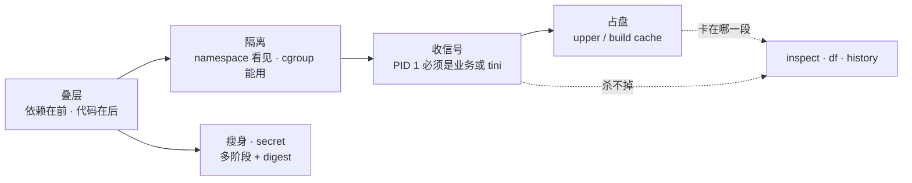
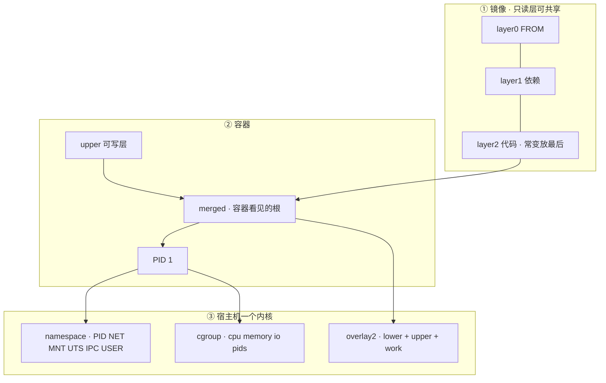
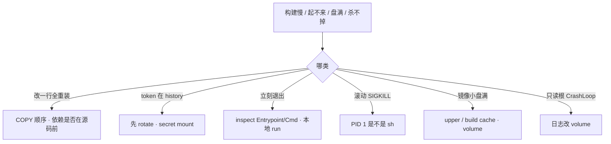

# Docker 深度

> 改一行大厅代码，CI 每次重跑 `go mod download`，构建从 40 秒变成 8 分钟。滚动发布 SIGTERM 杀不掉，gracePeriod 30s 到了 SIGKILL，长连接硬拆。开服当天节点盘 100%，Harbor 里镜像只有 200MB——群里已有人在 `docker rm -f` 当「清盘」。
> **本章回答**：镜像怎么叠、容器怎么隔离、盘满从哪来、信号为什么到不了进程；以及多阶段瘦身、BuildKit secret、镜像安全最低配。
> **不讲**：digest 晋升、Harbor、禁 latest、扫描门禁 → [03](../03-制品与镜像/)；流水线何时 build → [04](../04-CI-CD/)；containerd / CRI / pause → [03-17](../../03-Kubernetes/17-节点运行时与升级/)；cgroup 明细、逃逸 → [01-10](../../01-基础底座/10-cgroup与容器/)；K8s 探针、preStop、terminationGracePeriod → [03-04](../../03-Kubernetes/04-Pod生命周期/)。

**标记**：🎯重点 · 🔥难点 · ⭐常考 · 🔧实操

---

## 一、一张图：镜像到容器的一生

> 🎯 **一句话**：镜像是只读层叠；容器是「只读层 + 可写层 + namespace/cgroup + 一个 PID 1」。值班三问——缓存为何失效、PID 1 是谁、盘满在 upper 还是 cache。



- 📖 **读图**
  - 🛤️ 主线「叠层 → 隔离 → 收信号 → 占盘」；瘦身/密钥挂在构建侧
  - 🔪 三个开篇现场都落到同一把刀：`inspect` PID 1 → `system df` → `history`（Q1、Q2、Q4）

### 🧱 合上书要默画的那张



- 📖 **读图**
  - 代码层变了，它后面的 RUN 全重做 → `COPY go.mod` 必须在 `COPY . .` 前
  - 没有箭头从「镜像 200MB」指向「节点盘 100%」→ 盘往往在 upper / build cache
  - PID 1 必须是业务（或 tini），否则 SIGTERM 进不了优雅退出

- 🔑 **四个词一次钉死**
  - **镜像** = 多层只读 tar；生产用 digest 锁（细节 → [03](../03-制品与镜像/)）
  - **容器** = 镜像 + **upper 可写层** + 一组 namespace/cgroup + **一个 PID 1**
  - **CoW（Copy-on-Write）** = 改下层文件时先拷到 upper 再改，不改只读层
  - **volume** = 绕过 union FS 的数据盘；日志 / 资源包应走这里，不写 upper

- 🗺️ **值班现象 → 第一刀**
  - 「改一行代码构建 8 分钟」→ COPY 顺序、`docker history`
  - 「滚动发布杀不掉」→ `inspect` Path/Args
  - 「镜像 200MB 节点盘 100%」→ `system df`、`du overlay2`
  - 「容器起来就 Exit」→ 本地 `docker run --rm`
  - 「token 进了镜像层」→ 先 rotate，再 secret mount

> 💡 **打个比方**：镜像像一摞透明胶片（只读层），容器是最上面那张可擦写纸（upper）。你改一个字，不是改胶片——是在纸上盖一层。胶片还在，盘不一定回来。

> ⚠️ **别混**：容器**不是**小虚拟机——共享宿主机内核；**namespace 管看见，cgroup 管能用**。K8s 换 containerd 不改变「分层」这件事。

> 📝 **面试**：「Docker 是共享内核的进程隔离，不是 VM；排障我先 COPY 顺序、PID 1、overlay upper，不会只看镜像大小。」⭐（Q1、Q5）

---

## 二、叠层：改一行代码，为什么 8 分钟 ⭐🔥

> 🎯 **一句话**：一层变，它和后面所有层缓存失效；依赖文件必须排在源码前面。

回到第一个现场：改一行代码，构建从 40 秒变 8 分钟。先别答「网络慢」——看 build 日志哪步没 `CACHED`。

> 💡 **打个比方**：做蛋糕——先筛面粉糖（依赖层），最后才裱花（代码层）。只改裱花，前面筛粉不用重做；要是先把整盆糊倒进去再筛粉，改一行裱花就得从头和面。

### 📦 Dockerfile 怎么变成层

```text
  Dockerfile 指令          镜像只读层（可共享、可缓存）
  FROM alpine:3.20    →    [ layer 0 基础 ]
  RUN apk add ca-certs→    [ layer 1 ]
  COPY go.mod ...     →    [ layer 2 ]
  RUN go mod download →    [ layer 3 ]
  COPY . .            →    [ layer 4 ]     ← 代码常变，放最后
  容器启动            →    [ layer 4 … 0 ] + [ 可写层 upper ]
```

- 📖 **读图**：每一条会改文件系统的指令 ≈ 一层；**某一层内容变了，它和后面所有层都得重做**。所以常变的 `COPY . .` 必须压到最后。

#### ❓ 为什么依赖必须在源码前面？

- ❌ **坏顺序**：`COPY . .` 先于 `go mod download` → 改任意一行业务代码，依赖层 checksum 变 → **412s 下载跟着重做**
- ✅ **好顺序**：先 `COPY go.mod go.sum` → `RUN go mod download` → 再 `COPY . .` → 只改代码时依赖层仍 `CACHED`
- 🧮 **不是「层越少越快」**：乱合并 RUN 会让「改一行也重装依赖」——层少和缓存命中是两件事
- 📎 **顺带**：`COPY` 优于 `ADD`（ADD 会解压远程 URL，行为难预期）；基础镜像钉版本，不用 `latest`

### 🔧 现场：看哪步没 CACHED 🔧

坏写法：

```dockerfile
FROM golang:1.22
WORKDIR /src
COPY . .
RUN go mod download
RUN CGO_ENABLED=0 go build -o server .
```

```bash
DOCKER_BUILDKIT=1 docker build -t game-server:test .
```

```text
 => [3/5] COPY . .                                    0.8s
 => [4/5] RUN go mod download                       412.3s   # ← 依赖跟着重做
 => [5/5] RUN CGO_ENABLED=0 go build -o server .     68.1s
```

改成正确顺序后再改同一行代码：

```dockerfile
COPY go.mod go.sum ./
RUN go mod download
COPY . .
RUN CGO_ENABLED=0 go build -o server .
```

```text
 => CACHED [3/6] COPY go.mod go.sum ./                0.0s
 => CACHED [4/6] RUN go mod download                  0.0s   # ← 412s 跳过
 => [5/6] COPY . .                                      0.6s
 => [6/6] RUN CGO_ENABLED=0 go build -o server .       38.2s
```

- 🔍 **现场**
  - `CACHED ... go mod download 0.0s` → 父层 go.mod 未变，412s 跳过
  - `COPY . . 0.6s` → 只有代码层重建，触发后面 build
  - 总时间 40s vs ~480s → 差在一个 COPY 顺序
- 🪤 **context 陷阱**：`.dockerignore` 不写时 context 两 GB（`.git` / `node_modules`），Dockerfile 写得再好也拖死构建机，还可能把密钥打进层
- 🎮 游戏逻辑服：别把策划表、符号表打进层——开服拉镜像会把窗口吃掉（制品侧 → [03](../03-制品与镜像/)）

> 📝 **面试**：⭐「层缓存失效我看 build 日志哪步没 CACHED；依赖文件先 COPY 再 RUN install，源码放最后；COPY 优于 ADD，钉版本不用 latest。」（Q1、Q8）

口诀：**依赖在前、代码在后；一层变，后面全重做。**

---

## 三、隔离：为什么不是小虚拟机 🔥

> 🎯 **一句话**：namespace 管「看见什么」，cgroup 管「能用多少」；共享内核，逃逸面在内核。

进容器 `free` 显示 62Gi，你设了 `--memory=512m`——信谁？信 `free` 就错了。

> 💡 **打个比方**：namespace 像给每个租户配独立门牌和窗户（进程号、网卡、挂载）；cgroup 像电表水表限额。租户共用同一栋大楼的地基（内核）——地基塌了，所有租户一起完蛋。

### 👁️ 六个常见 namespace · 一张电表

- **PID** 进程号空间 · **NET** 网卡/端口 · **MNT** 挂载 · **UTS** hostname · **IPC** · **USER**（**很多生产默认没开**）
- **cgroup** 管 CPU throttle、内存 OOM、pids fork 失败
- Go `GOMAXPROCS`、Java GC 若按容器内 `nproc` 配，可能被 throttle 死——文件路径 → [01-10](../../01-基础底座/10-cgroup与容器/)；K8s request/limit → [03-04](../../03-Kubernetes/04-Pod生命周期/)

#### ❓ 为什么容器里 free 显示 62Gi 却会 OOM？

- 🤥 容器内 `free` 读的是宿主机 `/proc`——**撒谎**
- ✅ 真上限在 cgroup：`HostConfig.Memory` / `memory.max` = 你设的 512MB
- 💥 超了 → OOM kill **容器内**进程，不一定有整机 OOM 行
- 🧮 同理：容器内 `nproc` / `/proc/cpuinfo` 也常是宿主机视角；CPU 限额看 cgroup `cpu.max`，不是 `nproc`

### 🔧 现场：free 撒谎，信 cgroup 🔧

```bash
docker run -d --name lobby --memory=512m --cpus=1 game-server:v1
docker exec lobby free -h
```

```text
              total        used        free
Mem:           62Gi        18Gi        44Gi          # ← 宿主机视角，不可信
```

```bash
docker inspect lobby --format '{{.HostConfig.Memory}}'
# 536870912                                          # ← = 512MB，这才是硬上限
# 也可对照：/sys/fs/cgroup/.../memory.max（路径随 cgroup v1/v2 变，见 01-10）
```

> ⚠️ **别混**：隔离 ≠ VM 级隔离。USER ns 很多生产没开，镜像仍要 `nonroot`；高安全场景才上 VM/Kata。

> 📝 **面试**：「容器共享宿主机内核，隔离不如 VM；容器里 free 不可信，真配额在 cgroup；USER ns 很多生产没开，镜像仍要 nonroot。」（Q5）

口诀：**free 撒谎，信 cgroup；namespace 管看见，cgroup 管能用。**

---

## 四、占盘：镜像 200MB，为什么节点盘满 ⭐🔥

> 🎯 **一句话**：merged 是容器看见的根；盘满先看 upper 和 build cache，不是镜像 tag 大小。

第三个现场：镜像 200MB，节点盘 100%。有人 `docker rm -f` 当清盘——删容器就能把盘清回来吗？

> 💡 **打个比方**：镜像层像图书馆书架上的书（只读、可多人借）；upper 像每人领的便签本——你在便签上涂改，书架上的书还在；便签堆厚了，抽屉（节点盘）就满了。

### 🗂️ overlay2 你实际看见什么

```text
lower（镜像只读层） + upper（可写） + work（内部） → merged（容器根）
```

- 📖 **读图**：容器里看到的永远是 **merged**；改文件落在 **upper**；镜像 tag 大小只反映 lower，**解释不了** upper / build cache

#### ❓ 为什么镜像小却盘满？删容器文件磁盘为什么不回来？

- 📦 镜像 200MB = 只读层；盘往往在 **upper 写大文件** 或 **Build Cache**
- 👻 容器里 `rm` 镜像带来的文件：只在 upper 记 **whiteout**，下层还在——**镜像不会变小，盘也不一定立刻回来**
- 🗑️ 删容器 ≠ 立刻收回镜像层；悬空镜像、build cache 要 `prune`
- 📝 CoW 代价：改下层大文件会先**整份拷到 upper** 再改——日志 / 热更写 upper 会瞬间胀盘
- 🎮 资源包走 volume / CDN，别当下资源盘写 upper；K8s imagefs / eviction → [03-17](../../03-Kubernetes/17-节点运行时与升级/)

### 🔧 现场：system df → du overlay2 🔧

```bash
docker system df
```

```text
TYPE            TOTAL     ACTIVE    SIZE      RECLAIMABLE
Images          47        12        8.2GB     3.1GB (37%)
Containers      18        8         2.1GB     890MB (42%)
Local Volumes   6         2         1.4GB     800MB (57%)
Build Cache     0         0         24GB      24GB          # ← CI 残留，prune 可回收
```

```bash
du -xhd1 /var/lib/docker/overlay2 | sort -h | tail -5
docker inspect gamesvr-3 --format '{{.GraphDriver.Data.UpperDir}}'
```

```text
18G     /var/lib/docker/overlay2/abc123.../diff             # ← 单个 upper：资源包/日志写爆
```

- 🔍 **现场**
  - Build Cache **24GB** → CI 构建残留，`builder prune` 可回收
  - 单个 upper **18G** → 容器可写层写了大文件（资源包/日志）
  - 镜像 200MB → 只读层大小，**解释不了** 18G upper
- 🧹 prune 前确认：无运行中容器仍引用要删的层；`docker rm -f` 一排业务容器当「清盘」会误杀流量

> 📝 **面试**：⭐「盘满我先 system df 分 Images/Containers/Build Cache，再 du overlay2 找 upper；游戏资源不要写可写层，用 volume。」（Q4、Q9）

口诀：**镜像小解释不了盘满；先看 upper 和 build cache。**

---

## 五、收信号：滚动发布为什么 SIGKILL ⭐🔥

> 🎯 **一句话**：exec 形式让业务当 PID 1；shell 形式 PID 1 是 sh，SIGTERM 到不了 app。

第二个现场：滚动杀不掉。有人要加长 gracePeriod——PID 1 是 sh 时，加长宽限期能根治吗？

> 💡 **打个比方**：K8s 滚动像通知店长关门（SIGTERM）。若店长其实是前台实习生（`/bin/sh -c`），通知到了前台，后厨还在炒菜——30s 宽限期一到保安直接拉闸（SIGKILL）。

### 🚪 ENTRYPOINT · CMD · 谁被换掉

- **ENTRYPOINT** = 可执行文件；**CMD** = 默认参数
- `docker run 镜像 args` **替换 CMD**，不替换 ENTRYPOINT
- K8s：`command` 换二进制，`args` 换 CMD（探针 / preStop / gracePeriod 细节 → [03-04](../../03-Kubernetes/04-Pod生命周期/)）
- 需要壳：用 `tini` / `dumb-init` 当 PID 1，再 exec 业务

#### ❓ 为什么加长 gracePeriod 治不好？

- 🛑 PID 1 是 `sh` 时，SIGTERM 给 shell，**server 收不到** → 宽限期耗尽 → SIGKILL，连接硬拆
- ✅ 根治：JSON **exec 形式**让业务当 PID 1；加长 30s→60s 只是拖死时间
- ⏱️ 容器立刻退出：先 `docker logs` + 本地 `docker run --rm`，**先别怪 kubelet**
- 🧩 需要壳做信号转发时：`tini` / `dumb-init` 当 PID 1，再 `exec` 业务——别用裸 `/bin/sh -c`

### 🔧 现场：inspect Path/Args → 容器内 ps 🔧

```bash
docker inspect lobby-old --format 'Entrypoint={{json .Config.Entrypoint}} Cmd={{json .Config.Cmd}}'
```

```text
Entrypoint=null Cmd=["/bin/sh","-c","/server --config /etc/server.yaml"]   # ← shell 形式
```

```bash
docker exec lobby-old ps -o pid,comm,args
```

```text
  PID COMMAND         ARGS
    1 sh              /bin/sh -c /server --config /etc/server.yaml   # ← SIGTERM 到这里
   12 server          /server --config /etc/server.yaml              # ← 业务收不到
```

```bash
time docker stop -t 30 lobby-old
# real    0m30.012s                                                  # ← 宽限期耗尽 → SIGKILL
```

改成 exec 形式：

```dockerfile
ENTRYPOINT ["/server"]
CMD ["--config", "/etc/server.yaml"]
```

```text
# time docker stop -t 30 lobby-new
# real    0m2.341s                                                   # ← 优雅 drain 后退出
```

> ⚠️ **别混**：gracePeriod 超时 SIGKILL 是 K8s/运行时行为（→ [03-04](../../03-Kubernetes/04-Pod生命周期/)）；**根因常在镜像启动形式**，不是「宽限期太短」。

> 📝 **面试**：⭐「滚动杀不掉我先 inspect Entrypoint/Cmd 看 PID 1 是不是 sh；生产用 JSON exec 形式；宽限期 30s 超时 SIGKILL 是 03-04，根因常在镜像。」（Q2）

口诀：**ENTRYPOINT 是可执行文件，CMD 是默认参数；exec 收信号，shell 收不到。**

---

## 六、瘦身与密钥：生产怎么落地 🎯⭐

> 🎯 **一句话**：多阶段 + distroless/alpine + 非 root + 钉 digest；密钥走 secret mount，永不进层。

四个难点钉住了，落到选镜像、验收、密钥。

### 🏗️ 生产怎么选

- **基础镜像**：distroless / alpine / slim，**钉 digest** —— 不选 `python:latest`、full JDK 当 runtime
- **构建**：多阶段 + BuildKit —— 编译器不进运行镜像
- **用户**：`USER 1000` / nonroot —— 不容器 root + `--privileged`
- **密钥**：BuildKit secret mount；运行时 K8s Secret —— 不 `ENV TOKEN=`、`COPY .npmrc`
- **数据**：volume / emptyDir —— 不把可写层当下资源盘
- **运行时**：生产 K8s 用 containerd（→ [03-17](../../03-Kubernetes/17-节点运行时与升级/)）—— 业务 Worker 上 DinD 给不可信 PR 危险

### ✅ 验收：进程在不算数

必须能说出：PID 1 是谁、`docker history` 没有 token、runtime 阶段没有 compiler。

```dockerfile
FROM golang:1.22 AS builder
WORKDIR /src
COPY go.mod go.sum ./
RUN go mod download
COPY . .
RUN CGO_ENABLED=0 go build -o server -ldflags="-s -w" .

FROM gcr.io/distroless/static:nonroot
COPY --from=builder /src/server /server
USER nonroot
ENTRYPOINT ["/server"]
```

- **distroless**：只有运行时，无 shell / 包管理器；调试用 debug 变体，别装回 bash 进生产
- **alpine**：小，musl 可能和 C 扩展不兼容 → 换 slim
- **体积墙**：800MB → slim ~**150MB** → distroless + 多阶段常到 **10–20MB**；200 节点同时 pull 时体积就是窗口

#### ❓ 为什么多阶段还是 1GB？删 tag 救得了进层的 token 吗？

- 🕵️ 多阶段后仍胖：数据 / 符号表 / 缓存被 `COPY` 进了 runtime——用 `dive` / `history` 找哪层
- 🔑 token 写进 `ENV` / `COPY` → **进层**；删 tag **救不了** digest 里的历史层 → **先 rotate**，再改 secret mount 重建重部
- ⚡ BuildKit：`cache mount` 加速（缓存不进层）；`secret mount` 保密钥
- 📉 瘦身清单：distroless/alpine 替代 full → 多阶段只拷二进制 → 合并 RUN 清缓存 → Go `-ldflags="-s -w"` → `.dockerignore` → dive 找数据/符号表

### ⚙️ 改错最贵的几项

- **`COPY` 顺序**：依赖文件先、源码最后 —— 改错 → 改一行全重装
- **ENTRYPOINT/CMD**：JSON 数组 exec —— 改错 → PID 1 是 sh，滚动 SIGKILL
- **`USER`**：非 0 —— 改错 → 逃逸面大；USER ns 默认还可能没开
- **BuildKit secret**：`--mount=type=secret` —— 改错 → token 进层，删 tag digest 还在
- **cache mount**：go/npm 缓存不进层 —— 不用 → 每次 CI 冷启动
- **`.dockerignore`**：丢掉 `.git` / `node_modules` —— 不写 → context 2GB、密钥进层
- **`readOnlyRootFilesystem`**：日志走 volume —— 漏配写路径 → CrashLoop 或 upper 打满盘
- **`--privileged` / docker.sock**：不可信流水线禁止 —— 放开 = 宿主机 root

```dockerfile
# syntax=docker/dockerfile:1
FROM golang:1.22
RUN --mount=type=cache,target=/root/.cache/go-build \
    --mount=type=cache,target=/go/pkg/mod \
    go build -o server .

RUN --mount=type=secret,id=npmrc,target=/root/.npmrc \
    npm install
```

- 🔍 **现场**：`DOCKER_BUILDKIT=1`（现代 Docker 默认开）；cache mount 加速、secret mount 保密钥

> ⚠️ **别混**：BuildKit **cache mount** ≠ 层缓存（一个加速依赖下载、一个按指令 checksum）；secret mount ≠ 运行时 K8s Secret（构建期 vs 运行期）。

> ⭐ **记住**：token 进层先 **rotate**，删 tag 救不了 digest。口诀——**token 进层先 rotate**。

本节对应练习题 Q3、Q6、Q7、Q9。

---

## 七、作战：定责 🔧

> 🎯 **一句话**：构建慢看 COPY；杀不掉看 PID 1；盘满看 upper——别先怪 kubelet。

三问：进程还在不在？还能不能变更？已有流量还通不通？**CrashLoop 先本地 `docker run` 同一镜像，再把锅甩给 kubelet。**



- 📖 **读图**：先分叉现象类，再落到二～六节的刀；节点运行时细节停在 [03-17](../../03-Kubernetes/17-节点运行时与升级/)，本章管镜像和单机行为

| 现象 | 先做什么 | 不要做什么 |
|------|----------|------------|
| 改一行代码全重装依赖 | COPY 顺序，依赖是否在源码前 | 乱合并所有 RUN |
| 滚动杀不掉进程 | PID 1 是不是 sh，改 exec 形式 | 先加长 gracePeriod 当根治 |
| 容器立刻退出 | inspect + 本地 `docker run` | 先怪 kubelet |
| 节点盘满镜像却很小 | upper 和 build cache | 只看镜像 200MB |
| token 进了层 | 先 rotate，重建重部 | 只删 tag |
| 容器里 rm 文件盘不降 | whiteout，下层还在 | 当镜像变小了 |
| `--privileged` / DinD 给 PR | 关掉 | 当构建方便 |

### ⏱️ 60 秒剧本 🔧

- **0–10s**：`docker inspect <cid> --format 'Pid1={{.Path}} Args={{json .Args}}'` —— PID 1 是 `/server` 还是 `/bin/sh`
- **10–30s**：`docker logs <cid> --tail=100`；立刻退出则本地 `docker run --rm` 同一镜像
- **30–45s**：`docker system df`；盘满再 `du -xhd1 /var/lib/docker/overlay2 | sort -h | tail`
- **45–60s**：`docker history <image> | head` —— 找 compiler / token / 过早 `COPY .`

现在再看群里那句 `docker rm -f` 清盘、加长 gracePeriod、先怪 kubelet——你知道该怎么拦住了。（Q10、Q14）

---

## 八、收口

### 命令速查 🔧

```bash
docker history <image>                                    # 哪层胖 / 哪层总重建
docker inspect <cid> --format '{{.Path}} {{json .Args}} {{.State.Pid}}'
docker logs <cid> --tail=100
docker run --rm --name t <image>                          # CrashLoop：先本地复现
docker system df                                          # Images / Containers / Build Cache
du -xhd1 /var/lib/docker/overlay2 | sort -h | tail
docker buildx build --platform linux/amd64,linux/arm64 -t game-server .
# 清理：image prune / container prune / builder prune —— 删容器 ≠ 盘立刻回来
```

### Dockerfile 差 → 好

```dockerfile
# 差：每条 RUN 一层，apt 缓存留在层里；COPY . 过早
FROM ubuntu
RUN apt-get update
RUN apt-get install -y python3 python3-pip
COPY . /app
RUN pip install -r /app/requirements.txt
CMD ["python3", "/app/main.py"]

# 好：钉版本、合并 RUN、先依赖后代码
FROM python:3.12-slim
WORKDIR /app
COPY requirements.txt .
RUN pip install --no-cache-dir -r requirements.txt
COPY . .
CMD ["python3", "main.py"]
```

### 镜像安全最低配 ⭐

- 可信源 + 钉 digest + 扫描阻断 —— 不来路不明、latest
- 非 root —— 不默认 root 当生产
- 只读根 + volume 写数据 —— 不把可写层当下资源盘；`readOnlyRootFilesystem` CrashLoop 先找谁在写 `/`
- BuildKit secret；运行时 Secret —— 不层里 token / kubeconfig
- 最小 capabilities —— 不 `--privileged`、不挂 `docker.sock` 给不可信 PR（→ [08](../08-运维平台与Oncall/)）
- 不可信流水线 DinD / `docker.sock` = 宿主机 root；fork PR 构建尤其危险

### 易混速记

- COPY vs ADD · ENTRYPOINT vs CMD vs K8s `command`/`args`
- upper vs 镜像大小 · namespace 视图 vs cgroup 配额
- cache mount vs 层缓存 · secret mount vs K8s Secret

### 面试锚点

| 问 | 30 秒答 |
|----|---------|
| 镜像是什么？ | 多层只读 tar；容器 = 镜像 + upper + ns/cgroup + PID 1 |
| 改一行构建变慢？ | 看哪步没 CACHED；依赖先 COPY，源码最后 |
| 容器 vs VM？ | 共享内核；ns 管看见，cgroup 管能用；free 不可信 |
| 镜像小盘满？ | system df → upper / build cache；rm 只记 whiteout |
| 滚动杀不掉？ | inspect PID 1 是否 sh；改 exec 形式，别只加长 gracePeriod |
| token 进层？ | 先 rotate；secret mount；删 tag 救不了 digest |
| 怎么瘦到 20MB？ | 多阶段 + distroless + `-ldflags="-s -w"` + `.dockerignore` + dive |

### 易错一句话对照

- 「镜像是一个大文件」→ 多层只读 tar + 容器可写层
- 「层越少一定更快」→ 乱合并会让改一行也重装依赖
- 「ENTRYPOINT 和 CMD 没区别」→ 可执行文件 vs 默认参数；args 换 CMD
- 「shell 形式也能优雅退出」→ PID 1 是 sh，SIGTERM 常到不了 app
- 「容器和 VM 隔离一样强」→ 共享内核；逃逸面在内核
- 「USER ns 默认一定开着」→ 很多生产没开；非 root 仍要做
- 「删容器磁盘就会回来」→ 只改 upper；镜像层和 cache 还在
- 「容器里 rm 了，镜像变小」→ 只记 whiteout
- 「节点盘满先怪镜像太大」→ 先看 upper / build cache
- 「`ENV NPM_TOKEN` 构建完就没事」→ 进层；删 tag digest 还在；先 rotate
- 「CrashLoop 先查 kubelet」→ 先本地 `docker run` 同一镜像
- 「distroless 没 shell 就装回 bash」→ debug 变体 / stdout；别装回生产
- 「可写层可以当游戏资源盘」→ volume / CDN
- 「`--privileged` 给 CI 提速可以」→ 不可信流水线 = 宿主机 root

### 数字墙

> 800MB → slim ~**150MB** → distroless 多阶段 **10–20MB** · gracePeriod 常见 **30s**（超时 SIGKILL → [03-04](../../03-Kubernetes/04-Pod生命周期/)）· 开服 **200** 节点同时 pull 时体积就是窗口 · Build Cache 常见 **数十 GB** 可 prune · memory 限额示例 **512MB = 536870912**

---

## 合上书

- [ ] **默画**主图：只读层叠 → upper → merged → PID 1；标出 namespace / cgroup / overlay2 各管什么（Q1、Q4）
- [ ] **口述叠层**：某一层变了后面怎样？为什么 `COPY go.mod` 要在 `COPY .` 前面？（Q1、Q8）
- [ ] **口述隔离**：六个常见 namespace 各隔离什么？`free` 为什么撒谎？真配额在哪？（Q5）
- [ ] **口述占盘**：overlay2 四元组？盘满先看哪？容器里 rm 镜像文件会怎样？（Q4、Q9）
- [ ] **口述信号**：ENTRYPOINT / CMD 谁被 `docker run` 换掉？PID 1 是 sh 会怎样？加长 gracePeriod 够不够？（Q2）
- [ ] **口述瘦身 / 密钥**：800MB 怎么瘦到 20MB？token 进层先做什么？cache mount vs 层缓存？（Q3、Q6、Q7）
- [ ] **口述作战**：五个工单（构建慢 / 杀不掉 / 盘满 / 立刻退出 / token）各先走哪条？（Q10、Q14）

七题都能口述，这一章就过了——开头三个现场，你现在能对症下药。下一章把 digest、禁 latest、Harbor 就近拉剖开。
