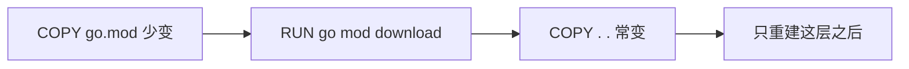
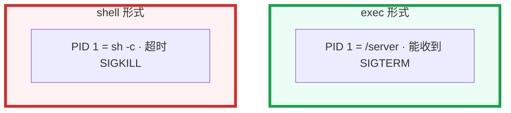

# 02｜Docker 深度 · 练习题

开始做题前：合上知识点，对着**本章主线**（懂分层 → 看 PID 1 → 清磁盘）口述一遍。关键字（层缓存、PID 1、overlay2、BuildKit secret）要能点名。能顺下来，下面大半都会了。

每道题**先看场景自己口述，再往下看解答**。直接看解答容易产生「我会了」的错觉。每题标了覆盖范围：

| 标记 | 含义 |
|------|------|
| **核心** | 不懂整章就没建立起来 |
| **必会** | 值班和面试都要能讲 |
| **常用** | 线上会反复碰到 |
| **常考** | 白板和追问的高频口径 |

Harbor / 禁 latest 见 03，K8s 运行时见 03-17，cgroup 文件链见 01-10。

题目顺序：Q1～Q5 钉分层 / 信号 / 瘦身 / 盘满 / 隔离；Q6～Q9 安全与构建细节；Q10～Q14 排障综合。

## 本题目录

- [Q1 分层与缓存](#q1)
- [Q2 ENTRYPOINT / PID 1](#q2)
- [Q3 多阶段 / distroless](#q3)
- [Q4 overlay2 / 盘满](#q4)
- [Q5 namespace / cgroup](#q5)
- [Q6 镜像安全 / 密钥进层](#q6)
- [Q7 BuildKit cache](#q7)
- [Q8 COPY vs ADD / ignore](#q8)
- [Q9 只读根 / 瘦身](#q9)
- [Q10 排障分流](#q10)
- [Q11 buildx 与多架构](#q11)
- [Q12 rootless 边界](#q12)
- [Q13 registry mirror](#q13)
- [Q14 60 秒镜像排障](#q14)
- [合上书](#合上书)

---

## Q1

**★★★★★｜镜像为什么是分层的？为什么 COPY requirements 要在 COPY . 前面？**

**覆盖**：核心 · 必会 · 常考

**对应**：知识点 [三、原理](知识点.md)

### 场景

每次改一行 Go 业务代码，CI 都重新 `go mod download`，流水线 15 分钟。Dockerfile 先 `COPY . .` 再下载依赖。就是知识点开头那个构建变慢的现场。

先自己试试：哪一层变了？为什么依赖层跟着失效？

### 完整解答

> 🎯 **一句话**：镜像分层 CoW：某层变了它和后面全失效，所以依赖 COPY 要在源码 COPY 前面。

每条指令一个只读层，容器再加可写层（CoW）。某层变了，它和后面全部失效。



先 COPY 全目录再装依赖：代码一变依赖层也失效。`docker history` / `dive` 看哪层总在重建。游戏别把策划表打进业务镜像（03）。

### 再追问

- 合并所有 RUN 是不是一定更好？——层更少，但「只改代码」也可能重做安装。依赖和代码要分开层。
- 钉 `python:latest`？——不要。生产钉版本 / digest。

---

## Q2

**★★★★★｜ENTRYPOINT 和 CMD 差在哪？为什么滚动发布杀不掉进程？**

**覆盖**：核心 · 必会 · 常考

**对应**：知识点 [三、原理](知识点.md)

### 场景

K8s 改 `args` 发现启动命令全没了。另一边 `docker stop` 一直等到 SIGKILL，战斗服长连接被硬拆。Dockerfile 写的是 `ENTRYPOINT /server --config /etc/app.yaml`（无 JSON 数组）。

先自己试试：PID 1 是谁？加长 gracePeriod 能根治吗？

### 完整解答

> 🎯 **一句话**：ENTRYPOINT 是可执行文件，CMD 是默认参数；生产用 exec 形式让 PID 1 收 SIGTERM。

和 Q1 同属「镜像怎么写」——一个管构建速度，一个管滚动能不能优雅退出。

ENTRYPOINT 是可执行文件；CMD 是默认参数。两者都有时，CMD 当 ENTRYPOINT 的默认参数。`docker run` 额外参数 / K8s `args` **替换 CMD**，要换二进制改 `command`（ENTRYPOINT）。



生产用 JSON 数组 exec 形式。需要壳用 tini 当 PID 1。没有 init：子进程变僵尸。inspect 看 Entrypoint / Cmd；容器里 `ps` 看 PID 1。

### 再追问

- exec 形式里 `$FOO` 不展开？——对，不走壳。程序内读环境变量，或显式走壳并接受信号问题。
- 加长 gracePeriod 能根治吗？——不能。PID 1 是 sh 时信号仍到不了 app。

---

## Q3

**★★★★★｜多阶段构建解决什么？distroless 和 alpine 怎么选？**

**覆盖**：核心 · 必会 · 常用

**对应**：知识点 [三、原理](知识点.md) · [六、命令与操作](知识点.md)

### 场景

运行镜像里有 `go` 编译器和源码，800MB。安全说攻击面太大。开发要 `kubectl exec sh`。开服加节点拉了 15 分钟。

先自己试试：800MB 怎么砍到 20MB？distroless 没 shell 怎么排障？

### 完整解答

> 🎯 **一句话**：多阶段只拷产物到 distroless/alpine runtime，编译器和源码不进运行镜像。

build 阶段用完整镜像编译，runtime 只 COPY 产物到极小镜像。最终无编译器 / 源码 / 多余工具。

```
  golang:1.22 AS builder  →  编出 server
  distroless/static       →  只拷 /server，USER nonroot
```

distroless：无 shell，最安全最小，调试用 debug 变体。alpine：小但 musl 可能不兼容 C 扩展。slim 折中。full 不要当 runtime。生产安全优先 distroless；开发可 alpine。标配：多阶段 + 非 root + 钉版本。

镜像小：拉得快、扩容快、节点盘省。200 节点同时 pull 时体积就是窗口。800MB → slim ~150MB → distroless + 多阶段 10–20MB。Go `-ldflags="-s -w"`。

### 再追问

- distroless 没有 shell，排障怎么办？——debug 变体、sidecar、stdout / 指标。不要为了 exec 把 shell 装回生产镜像。
- 多阶段后还 1GB？——数据 / 符号表 / 缓存拷进了 runtime，用 dive 看层。

---

## Q4

**★★★★★｜overlay2 是什么？节点磁盘满了先看哪？**

**覆盖**：核心 · 必会 · 常用 · 常考

**对应**：知识点 [三、原理](知识点.md)

### 场景

镜像只有 180MB，节点 root 盘 100%。游戏服把资源包下在容器可写层。有人删了几个停掉的容器，盘没回来多少。另有人在容器里 rm 了一个镜像带来的文件，以为镜像会变小。就是开头那个「清盘」现场。

先自己试试：盘满先看哪？rm 镜像文件会怎样？

### 完整解答

> 🎯 **一句话**：overlay2 = 只读层+upper CoW；盘满先看 upper/build cache，不是只看镜像 180MB。

overlay2 把只读镜像层 + 可写层合成根文件系统。

| 目录 | 作用 |
|------|------|
| lowerdir | 镜像只读（多容器共享） |
| upperdir | 本容器 CoW |
| workdir | overlay 工作目录 |
| merged | 容器内看到的 `/` |

```bash
docker system df
du -xhd1 /var/lib/docker/overlay2
```

容器内写大文件进 upper，不进「镜像 180MB」那个数字。删容器不删共享镜像层；还要 prune 悬空镜像和 build cache。CoW 改下层大文件会先拷到 upper。容器里 rm 只在 upper 记 whiteout，下层还在。资源包走 volume / CDN。K8s imagefs 驱逐见 03-17。

### 再追问

- `system df` 里 Containers / Build Cache 远大于 Images？——先看 upper 和 cache，不要怪镜像 200MB 不该满。
- 可写层能当数据盘吗？——不能。和只读根是同一类：日志 / 热更走 volume。

---

## Q5

**★★★★★｜容器和虚拟机差在哪？namespace / cgroup 各管什么？**

**覆盖**：核心 · 必会 · 常考

**对应**：知识点 [三、原理](知识点.md)

### 场景

有人把 Docker 深度答成「kubelet 调 CRI」。另一人说容器和 VM 一样隔离。进容器 `free` 说内存够、`nproc` 说 32 核，十分钟后 137。有人假设容器 root 一定不是宿主机 root。

先自己试试：free 可信吗？USER ns 默认开了吗？

### 完整解答

> 🎯 **一句话**：容器共享宿主内核：namespace 管看见什么，cgroup 管能用多少；free/nproc 常撒谎。

VM：独立内核，重，隔离强。容器：共享宿主内核，namespace 隔离 + cgroup 限额，轻、密度高。逃逸面在内核；高安全用 VM / Kata。内核 panic 全机一起死。

| | namespace | cgroup |
|--|-----------|--------|
| 管 | 看见什么 | 能用多少 |
| 例 | PID / NET / MNT / UTS / IPC / USER | cpu / memory / io / pids |

`free` / `nproc` 经常撒谎，真配额在 cgroup（01-10）。USER namespace 很多生产默认没开，所以镜像非 root 仍要做。kubelet / containerd / pause 是 03-17，不是本章。本章停在镜像层、启动命令、overlay、单机 Docker / 构建。

### 再追问

- PID namespace 里 PID 1 和宿主机 PID？——对不上。信号打容器 PID 1；宿主机要用 host PID 找 cgroup。
- `--privileged` / docker.sock 给 PR？——不可信流水线等于宿主机 root。不要无故开。

---

## Q6

**★★★★☆｜镜像安全最低配？构建时密钥已经打进镜像怎么办？**

**覆盖**：必会 · 常用 · 常考

**对应**：知识点 [六、命令与操作](知识点.md)

### 场景

Dockerfile `ENV NPM_TOKEN=...`。镜像推到 Harbor，token 在 history 里。另一次 `--privileged` DinD 把 docker.sock 给了 fork PR。

先自己试试：已泄漏先做什么？删 tag 够不够？

### 完整解答

> 🎯 **一句话**：密钥不进层，BuildKit secret mount；已泄漏先 rotate 再重建，不要 ENV/COPY token。

不要 ENV / COPY 密钥进层。BuildKit `--mount=type=secret`：构建时挂上，不写进层。CI 环境变量也不要 echo 进层。运行时用 K8s Secret。

已经进去：假设泄漏——先 rotate，history 确认层，重建，强制重部。删 tag digest 还在。后续 gitleaks / 扫描（03）。

最低配：可信基础镜像、Trivy 阻断（03）、非 root、只读根 FS、密钥不进层、最小化无 shell、钉 digest。不要无故 `--privileged` / 挂 Docker socket。

### 再追问

- 扫描红了仍能上线？——门禁在 03；本章保证层里没有 token、runtime 没有编译器。
- 容器 root 映射？——很多生产 USER ns 没开；不要假设「不是宿主机 root」。

---

## Q7

**★★★★☆｜BuildKit 比传统 build 多什么？cache mount 干什么？**

**覆盖**：必会 · 常用

**对应**：知识点 [六、命令与操作](知识点.md)

### 场景

每次 CI 都重新下 go mod，尽管 go.sum 没变。旧版 Docker 没开 BuildKit。下一台 Agent 又冷启动。

先自己试试：cache mount 能代替 COPY 顺序吗？

### 完整解答

> 🎯 **一句话**：BuildKit cache mount 加速构建不进最终层，和 COPY 顺序是两件套。

这是 Q1 的加速件——顺序对了，再用 cache mount 跨构建复用。

并行无依赖层、更聪明的缓存、`--mount=type=cache` 持久化编译 / mod 缓存、`--mount=type=secret` 密钥不进层、`buildx` 多平台。

```dockerfile
RUN --mount=type=cache,target=/go/pkg/mod \
    go build -o server .
```

缓存挂载不进最终镜像层，只加速构建。和「COPY go.mod 提前」是两件套。远程缓存：CI 把 cache 推到仓库 / registry。答到「不要每台机器冷启动下依赖」即可。

### 再追问

- cache mount 能代替层顺序吗？——不能。两件套。
- `DOCKER_BUILDKIT=1`？——现代 Docker 默认开；密钥 mount 依赖它。

---

## Q8

**★★★★☆｜COPY 和 ADD 怎么选？.dockerignore 不写会怎样？**

**覆盖**：必会 · 常用

**对应**：知识点 [六、命令与操作](知识点.md)

### 场景

`ADD` 了一个远程 URL 和一个 tar。context 把 `.git` 和本地 `node_modules` 全打进去，构建上下文 2GB，还可能把 `.env` 打进层。

先自己试试：为什么生产优先 COPY？ignore 漏了 `.npmrc` 怎么办？

### 完整解答

> 🎯 **一句话**：生产用 COPY 不用 ADD；.dockerignore 防把 .git/.env 打进 context 和层。

和 Q6 同属「别把不该进的东西打进层」。

生产优先 `COPY`，意图明确。`ADD` 会自动解 tar、拉远程 URL，层内容和缓存更难讲清。远程当时的字节会变，文件进仓再用 COPY。`.dockerignore` 减小 context、避免把密钥和 `.git` 打进层。context 巨大时，即使 Dockerfile 写得对，上传构建机也把流水线拖死。

### 再追问

- 游戏策划表？——别打进业务镜像层（03）；开服拉镜像会吃窗口。
- ignore 漏了 `.npmrc`？——和密钥进层同一类，先当泄漏处理。

---

## Q9

**★★★★☆｜只读根文件系统时程序要写日志怎么办？800MB 怎么瘦？**

**覆盖**：必会 · 常用

**对应**：知识点 [六、命令与操作](知识点.md)

### 场景

安全要求 `readOnlyRootFilesystem`。游戏服要写本地日志和热更临时文件，容器 CrashLoop。另一边 full 基础镜像 + 没多阶段 + apt 缓存留在层里。

先自己试试：日志写哪？和 Q4 盘满是同一类问题吗？

### 完整解答

> 🎯 **一句话**：只读根 FS 时日志/临时文件走 volume；瘦身靠多阶段+distroless+dive 找胖层。

接 Q3 瘦身 + Q4「别写 upper」——同一条线。

只读根是为了不让进程改系统层。日志、临时文件、热更落 **volume / emptyDir**，不要写 upper。这和 overlay 磁盘问题是同一类。

瘦身：distroless / alpine 替代 full；多阶段只拷二进制；合并 RUN 并清缓存；Go `-s -w`；`.dockerignore`；dive 找胖层。制品晋升仍用 digest（03）。alpine 上 C 扩展挂了换 slim / 静态链。

### 再追问

- 生产标配？——多阶段 + distroless 或 alpine + 非 root + 钉版本。
- 热更临时文件写 upper 开服会怎样？——节点盘被打满。

---

## Q10

**★★★★☆｜给出现象，你先走哪条排障路？这章要不要讲 kubelet？**

**覆盖**：必会 · 常用

**对应**：知识点 [七、生产排障](知识点.md)

### 场景

五个工单：① 改一行全重装 ② 滚动 SIGKILL ③ CrashLoop ④ 镜像小盘满 ⑤ history 里有 token。有人开口就是 kubelet。这是前面九道题的分流表。

先自己试试：五条各走哪？哪条不要先怪 kubelet？

### 完整解答

> 🎯 **一句话**：本章排障：COPY 顺序→PID 1→inspect/logs→system df→history；kubelet 是 03-17。

就是 Q1/Q2/Q4/Q6 的决策树版。

| # | 走哪条 | 不要做 |
|---|--------|--------|
| ① | COPY 顺序，依赖在源码前 | 乱合并所有 RUN |
| ② | PID 1 是不是 sh，改 exec | 只加长 gracePeriod |
| ③ | inspect + 本地 `docker run --rm` | 先怪 kubelet |
| ④ | upper / build cache / volume | 只看镜像 180MB |
| ⑤ | 先 rotate，secret mount 重建 | 只删 tag |

本章：Dockerfile → 层 → overlay2 → 进程 PID 1。03-17：kubelet → CRI → containerd → 节点升级。值班四条：`inspect` PID 1 → `logs` → `system df` → `history`。

### 再追问

- 容器起来立刻退出常见因？——交互式 shell 无前台进程；exec 路径写错。先 logs / inspect。
- USER ns 默认开了就能跑 root？——很多生产没开；镜像仍要非 root。

---

## Q11

**★★★★☆｜开服要 arm64+amd64 双架构，buildx 怎么出一份 manifest？**

**覆盖**：必会 ｜ **对应**：知识点 [4. 安装部署](知识点.md)

### 场景

战斗镜像只在 amd64 构建，ARM 节点 ImagePull 或 exec format error。

先自己试试：manifest list 和 digest 什么关系？

### 完整解答

> 🎯 **一句话**：`docker buildx build --platform linux/amd64,linux/arm64 --push` 出 manifest list。

```bash
docker buildx create --use
docker buildx build --platform linux/amd64,linux/arm64 -t reg/game:battle --push .
```

### 再追问

多架构和 manifest 搞混了吗？——tag 指向 manifest list，digest 仍唯一（03）。

---

## Q12

**★★★☆☆｜rootless Docker 在 K8s 节点上为什么不常用？**

**覆盖**：常用 ｜ **对应**：知识点 [3. 原理](知识点.md)

### 场景

安全组要求非 root 构建。

先自己试试：rootless Docker 和运行时 non-root 是一回事吗？

### 完整解答

> 🎯 **一句话**：rootless 端口/cgroup/性能限制；K8s 节点用 containerd+非 root 容器而非 rootless dockerd。

和 Q6「镜像非 root」是两层——别混成一件事。

链 [17](../../03-Kubernetes/17-节点运行时与升级/)。

### 再追问

构建机 rootless 和运行时 non-root 是一回事吗？——不是，两层都要做（Q6）。

---

## Q13

**★★★★☆｜仓库 mirror 配错导致 digest 不一致，怎么发现？**

**覆盖**：必会 ｜ **对应**：知识点 [7. 生产排障](知识点.md)

### 场景

staging pull 的 digest 和 CI push 不一致。

先自己试试：mirror 改写层会怎样？airgap 怎么同步？

### 完整解答

> 🎯 **一句话**：比对 `docker buildx imagetools inspect`；mirror 必须透传 manifest；禁改写层。

和下一章 digest 贯通同一条审计线——先在这儿发现不一致。

```bash
crane digest reg/game:battle@sha256:...
```

### 再追问

airgap 环境怎么同步？——`crane copy` 一次性，**不要**靠 latest（03）。

---

## Q14

**★★★★★｜构建慢、镜像胖、节点盘满、拉取失败，60 秒分流**

**覆盖**：核心 · 必会 ｜ **对应**：知识点 [7. 生产排障](知识点.md)

### 场景

CI 15 分钟；镜像 800MB；节点 ImagePullBackOff。60 秒分流，把前面的题串起来。

先自己试试：四类问题各先查什么？

### 完整解答

> 🎯 **一句话**：慢→缓存顺序；胖→多阶段；盘满→overlay2+prune；拉取→auth/mirror/digest。

见 Q4/Q9/Q10 综合——开头三个现场的急救卡。

见 Q4/Q9/Q10 综合。

### 再追问

容器里 rm 了大文件盘还不释放？——进程仍占用 fd，要重启容器（Q4）。

---

## 合上书

和知识点「合上书」逐条对齐：

- [ ] **口述分层**：能画出只读层 + 可写层，并说明层缓存失效规则（Q1｜知识点 §3.1）
- [ ] **口述信号**：能说出 ENTRYPOINT vs CMD、exec vs shell、PID 1 收信号（Q2｜§3.4）
- [ ] **口述瘦身**：能讲多阶段 + distroless/alpine；800MB → 20MB 的步骤（Q3｜§4）
- [ ] **口述盘满**：能画出 overlay2 四元组；盘满先看 upper / cache；rm 只是 whiteout（Q4｜§3.3）
- [ ] **口述隔离**：能区分 namespace 视图 vs cgroup 配额；容器不是 VM；USER ns 默认可能没开（Q5｜§3.2）
- [ ] **口述密钥**：能处理密钥进层（先 rotate）和 BuildKit secret / cache mount（Q6、Q7｜§5、§6）
- [ ] **口述分流**：能用分流处理 CrashLoop / 盘满 / 杀不掉，而不是先怪 kubelet（Q10、Q14｜§7）
