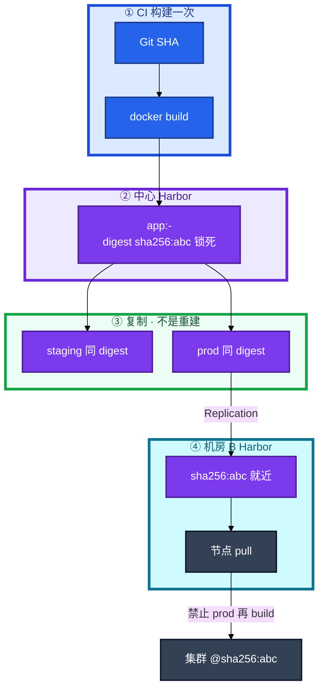
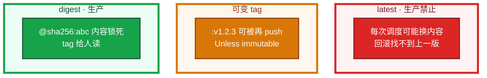
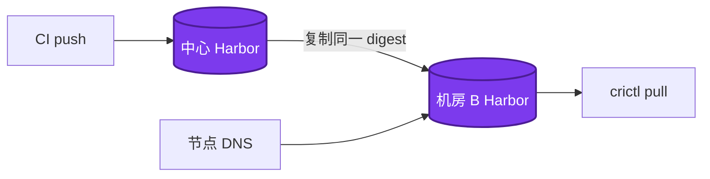
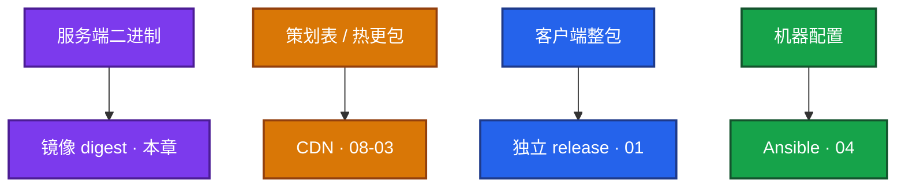
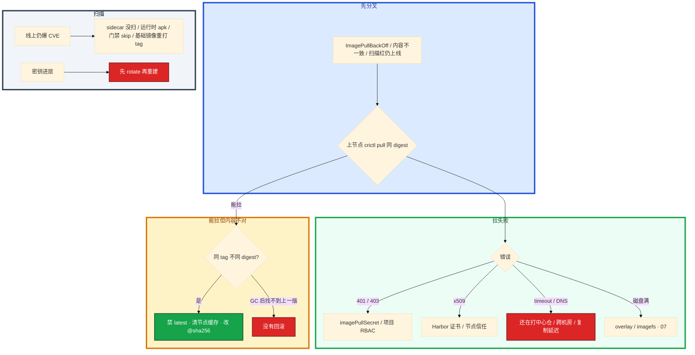

# 制品与镜像


开服 200 个节点同时拉镜像超时。线上回滚找不到当时那份包。扫描红了仍能上线。群里有人把热修打成 `logic:latest`，节点 A 昨天的 latest 和节点 B 今天的不是同一坨字节——战斗服「有的区正常有的区崩」，排障对不上 digest。

**本章主线（排障就按这三步想）：**

1. **锁内容**：生产引用 `@sha256`，禁 `latest` 和可变 tag
2. **复制晋升**：`docker tag` 同 digest 才是复制，禁止每环境 rebuild
3. **就近拉**：开服前本机房 Harbor 已有 digest，节点 DNS 指本地

**读完你能：** 白板上画出 digest 从 CI 贯通到集群；latest 能讲清为什么扩容和回滚会踩空；会多阶段瘦身、Harbor 复制预拉、Critical 阻断、`crictl pull` 分流。

## 本章目录

- [1. 基本概念](#1-基本概念)
- [2. 架构图](#2-架构图)
- [3. 原理](#3-原理)
- [4. 安装部署](#4-安装部署)
- [5. 核心配置](#5-核心配置)
- [6. 命令与操作](#6-命令与操作)
- [7. 生产排障](#7-生产排障)
- [8. 必会 · 常考](#8-必会--常考)
- [合上书](#合上书问自己)

**本章不讲：** 流水线阶段、晋升审批、金丝雀 SLI → [02](../02-CI-CD/)；分层缓存细节、ENTRYPOINT vs CMD、overlay2 磁盘、BuildKit secret → [07](../07-Docker深度/)；K8s Secret / External Secrets → [03-12](../../03-Kubernetes/12-配置与密钥/)；云上 RAM / IAM → [06-07](../../06-云平台/07-IAM与多账号/)；GitOps 用哪个 tag 去 sync → [03-22](../../03-Kubernetes/22-GitOps-ArgoCD与Tekton/)；客户端资源包、CDN → [07-03](../../07-游戏运维专题/03-热更新与版本发布/) / [07-06](../../07-游戏运维专题/06-CDN与资源更新/)。不单开 Vault 章，密钥扫描和禁 latest 都在这里。

---

## 1. 基本概念

制品 = CI 产出的 **不可变快照**（镜像 / Chart / jar）。值班里第一次碰到，多半是 ImagePullBackOff、回滚找不到包、或「预发测过线上却不一样」——根因往往不在带宽，在 **digest 没锁** 或 **每环境又 build 了一次**。

**值班里怎么认现象**（先听监控/发布群怎么说，再对表）：

| 群里/监控说的 | 技术含义 | 你的第一刀 |
|---------------|----------|------------|
| 「ImagePullBackOff 一片」 | 拉不到或太慢 | 上节点 `crictl pull` 同 digest |
| 「发了没更新 / 部分节点旧版」 | 同 tag 不同 digest 或缓存 | `crane digest` 对集群 `@sha256` |
| 「回滚按钮灰了 / 找不到上一版」 | latest 被覆盖或 GC 了 | 查 Harbor 保留策略 |
| 「扫描红了还能上」 | 门禁被 skip | 查哪道 CI/Harbor 策略被绕过 |
| 「开服窗口拉镜像超时」 | 跨机房打中心仓 / 镜像太胖 | 本机房 Harbor + 预拉 + 瘦身 |

| 在制品里管 | 不在这章里管 |
|------------|--------------|
| digest 贯通、禁 latest、Harbor、扫描、GC | 流水线怎么分段、金丝雀看什么（02） |
| 多阶段为什么必须瘦、哪层胖 | overlay2、ENTRYPOINT 细节（07） |
| 密钥不进镜像 / 不进 Git | K8s Secret 形态（04-12） |

构建不确定：基础镜像 tag 浮动、apk/apt 当时的包、`go build` 时间戳。staging 测过的和 prod 新 build 的 **不是同一个二进制**。故障时无法回答「预发验的就是线上这份吗」。

生产引用优先 `@sha256:...`。tag 用 `v1.2.3-<sha7>` 给人读。Harbor 复制规则或 CI `crane copy`。口误：`docker tag` 换仓库再 push **同一 digest** 才叫复制；`docker build` 再 push 叫重建。

一次发布记录三件：**app digest + chart version + values 哈希**。怎么证明这次线上就是某次 MR：digest ↔ commit ↔ MR 链接，流水线留着。对不上就不要猜。

> **记住**：测过的是 digest，不是「同一份 Dockerfile」。开服窗口第一次 pull 的必须已经在本机房 Harbor 里。

---

## 2. 架构图

后面复制、开服、排障都对着这张图。



**读图三句话：**

1. **没有箭头从 prod 指回 build**——配置不同用注入，不重新打包。
2. **复制是同一 digest 出现在两个 registry**——不是再编一次。
3. **节点就近拉本机房**——DNS 仍指中心仓 = 开服打满跨机房带宽。

三种引用（排障时内容锁不锁得住不一样）：



开发环境可以用 latest。**任何会自动重启、会扩容的集群不要用。**

---

## 3. 原理

### 3.1 制品不可变：同 SHA 不等于同镜像

**一句话：** 构建不是纯函数——同一 Git SHA 可能打出不同 digest，晋升只能 **复制 digest**，不能「同 Dockerfile 再 build 一次」。

**打个比方**：像唱片厂只压一张母盘（CI build 出 digest），各门店（staging / prod Harbor）只能 **复印同一张母盘**，不能每家店自己再录一遍——录出来音色（字节）已经变了。

**现场走一遍**（预发测过，有人提议「prod 再 build 一次省复制」）：

1. CI 机查 staging 上跑的 digest：

```bash
crane digest harbor.example.com/staging/logic:v1.2.3-abc1234
kubectl get deploy logic -n staging \
  -o jsonpath='{.spec.template.spec.containers[0].image}'
```

2. 屏幕出现：

```text
harbor.example.com/staging/logic@sha256:abc123def4567890...
harbor.example.com/staging/logic@sha256:abc123def4567890...
```

3. 同事在 prod 仓「同分支」又 `docker build` 并 push `v1.2.3-abc1234`：

```bash
crane digest harbor.example.com/prod/logic:v1.2.3-abc1234
```

4. 屏幕出现：

```text
harbor.example.com/prod/logic@sha256:fedcba9876543210...
```

5. **两串 sha256 不一样**——预发冒烟结论不能为 prod 新 build 辩护。正确做法：`crane copy` 或 Harbor Replication 把 staging 的 `sha256:abc123...` 复制到 prod，集群写 `@sha256:abc123...`。

**输出解读**：

| 输出 | 含义 | 下一步 |
|------|------|--------|
| 两行 digest 相同 | staging 集群和仓库 tag 一致 | 可以复制到 prod |
| prod digest ≠ staging | **重建了**，不是复制 | 停止切流量；改复制流程 |
| `@sha256:abc...` 在 yaml 里 | K8s 内容锁死 | tag 仅人读 |

K8s 引用：

```
image: repo/app:v1.2.3          tag 可被覆盖（可变）
image: repo/app@sha256:abc      内容锁死
```

不可变 tag 开了还要不要 digest？要。引用层仍以 digest 为准；不可变 tag 打开后，「覆盖 latest 救火」必须停——push 失败是好事。

**面试怎么说**：「代码 SHA 相同不代表镜像相同，构建有不确定性。我们 CI build 一次，staging 和 prod 用 crane copy 复制同一 digest，集群 Deployment 写 @sha256。」

> **记住**：测过的是 digest。`docker tag` 再 push 才是复制；`docker build` 再 push 叫重建。

### 3.2 为什么生产禁用 latest：尖上的版本会漂移

**一句话：** `latest` 不是版本号，是「仓库尖上那份」——扩容、回滚、Always 策略都会让不同节点跑不同字节。

**打个比方**：像食堂窗口挂「今日特供」牌——你昨天吃的和今天叫「今日特供」的可能完全不是同一道菜；回滚时牌子还在，菜已经换了。

**现场走一遍**（战斗服热修打了 `logic:latest`，扩容 30 Pod 后部分区崩）：

1. 查 Pod 分布和镜像字段：

```bash
kubectl get po -l app=logic -o wide
kubectl get po -l app=logic -o jsonpath='{range .items[*]}{.spec.nodeName}{"\t"}{.spec.containers[0].image}{"\t"}{.status.containerStatuses[0].imageID}{"\n"}{end}'
```

2. 屏幕出现：

```text
logic-7x9k2   10.0.1.11   harbor.example.com/prod/logic:latest   sha256:abc123...
logic-8m3p1   10.0.1.22   harbor.example.com/prod/logic:latest   sha256:fedcba...
logic-9n4q5   10.0.2.33   harbor.example.com/prod/logic:latest   sha256:fedcba...
```

3. **同一个 tag `latest`，节点 imageID 两种 digest**——节点 A 昨天 IfNotPresent 缓存了旧层，新调度节点 B 拉到新内容；Always 的节点每次可能再变。

4. 查仓库尖上现在是什么：

```bash
crane digest harbor.example.com/prod/logic:latest
```

```text
harbor.example.com/prod/logic@sha256:fedcba9876543210...
```

5. 想回滚「上一版」——latest 已被覆盖，**找不到当时那份包**。修复：改 Deployment 写 `@sha256:abc123...`（上一成功 digest），禁 latest；必要时 `crictl rmi` 清节点缓存再拉。

**输出解读**：

| 字段 | 正常 | 上面例子的问题 |
|------|------|----------------|
| `image` 字段 | `@sha256:...` 或不可变 tag | 全员 `latest` |
| `imageID` 跨 Pod | 全部相同 digest | **abc 和 fed 混跑** |
| `imagePullPolicy: Always` + latest | — | 每次调度可能换内容 |
| `IfNotPresent` + 可变 tag | — | 老节点永不变，「发了没更新」 |

**面试怎么说**：「生产禁 latest 因为 tag 可被重推、节点缓存策略不同会导致同 tag 不同 digest 混跑；回滚需要对上一版 digest，不是对 latest。」

> **记住**：latest 不是版本，是「现在仓库尖上那份」；扩容和回滚都会踩空。

### 3.3 镜像分层与多阶段：开服窗口被谁吃掉

**一句话：** runtime 只放二进制——编译工具链、策划表、符号表进运行镜像，200 节点同时拉会把开服窗口打满。

**打个比方**：像搬家只带成品家具（二进制），不要把整个工厂车间（JDK / Go 编译器）和仓库货架（策划表）一起塞进新房——车太大，200 户同时搬就堵死路（带宽）。

**现场走一遍**（逻辑服镜像 1.8GB，开服 200 节点 ImagePullBackOff）：

1. 在构建机看哪一层胖：

```bash
docker history harbor.example.com/prod/logic:v1.2.3-abc1234 --no-trunc --format '{{.Size}}\t{{.CreatedBy}}' | head -15
```

2. 屏幕出现：

```text
1.2GB    COPY data/ /app/data/
45MB     RUN go mod download
780MB    COPY . .
12MB     RUN CGO_ENABLED=0 go build -o server .
5MB      RUN apk --no-cache add ca-certificates
```

3. **1.2GB 的 `COPY data/`**——策划表打进业务镜像；热更走 CDN 的表和镜像里这份会漂。多阶段后 runtime 应只有二进制 + ca-certificates。

4. 改 Dockerfile 后重建，对比大小：

```bash
docker build -t logic:slim .
docker images logic:slim --format '{{.Repository}}:{{.Tag}}\t{{.Size}}'
```

```text
logic:slim    48MB
```

5. 开服前在本机房 Harbor 预拉（别等窗口才第一次 pull）：

```bash
crictl pull harbor-b.example.com/prod/logic@sha256:abc123...
```

```text
Image is up to date for sha256:abc123def456...
```

**输出解读**：

| 层 / 指标 | 问题信号 | 处理 |
|-----------|----------|------|
| `COPY data/` >100MB | 资源进镜像 | 改 CDN（08-03） |
| builder 阶段进 runtime | 缺多阶段 | `COPY --from=builder` 只拷二进制 |
| 镜像仍 >500MB | 符号表 / apt 缓存 | `dive` 逐层查 |
| `crictl pull` timeout | DNS 指中心仓 / 未复制 | 本机房 Harbor + Replication |
| 200 节点同时拉 | 典型事故窗口 | DaemonSet 预拉 + 瘦身 |

推荐多阶段骨架：

```dockerfile
FROM golang:1.22 AS builder
WORKDIR /app
COPY go.mod go.sum ./
RUN go mod download                 # 依赖先缓存
COPY . .
RUN CGO_ENABLED=0 go build -o server .

FROM alpine:3.20
RUN apk --no-cache add ca-certificates
COPY --from=builder /app/server /server
USER 1000                           # 生产非 root
ENTRYPOINT ["/server"]
```

层缓存：不常变的放前面，源码 COPY 放后面。`.dockerignore` 丢掉 `.git` / `node_modules`。基础镜像钉版本不用 latest。构建机不要无故 `--privileged` DinD 暴露 Docker socket。

**面试怎么说**：「开服拉镜像慢我先 docker history 找胖层，多阶段只拷二进制；策划表走 CDN 不打进业务镜像；开服前本机房 Harbor 预拉同一 digest。」

> **记住**：runtime 只放二进制；策划表和热更包走 CDN，别打进业务镜像。

### 3.4 漏洞扫描与密钥扫描：Critical 是硬门禁

**一句话：** push 后 Harbor 扫、CI 再扫一遍——**Critical=0 才能晋 prod**；密钥进层先 rotate，删 tag 救不了已推送的 digest。

**打个比方**：像机场安检两道门——Harbor 是第一道，CI 是第二道，防止有人 skip 策略；密钥进镜像像把钥匙焊进行李箱，箱子还在仓库里（digest 还在），换标签（删 tag）钥匙照样能被人捡到。

**现场走一遍**（扫描红了仍能上线，事后 CVE 爆雷）：

1. 查 Harbor 项目扫描策略和最近一次 push 结果（UI 或 API）；CI 侧查 pipeline 是否 skip 了 trivy stage。

2. 手动对 prod 在跑 digest 复扫：

```bash
trivy image --severity CRITICAL,HIGH harbor.example.com/prod/logic@sha256:abc123...
```

3. 屏幕出现：

```text
Total: 3 (CRITICAL: 1, HIGH: 2)

CVE-2024-1234 (CRITICAL)    openssl    1.1.1k-r0    fixed in 1.1.1w-r0
CVE-2024-5678 (HIGH)        libcurl    8.0.1-r0
```

4. **Critical: 1**——按门禁应阻断晋 prod。若线上已在跑，说明 CI `allow_failure` 或 Harbor 策略未绑 prod project。处理：升级基础镜像 → 重建 digest → 复制晋升；暂不能改则登记例外 + 到期日 + 网络隔离评估。

5. 若扫描发现密钥（gitleaks / Harbor secrets scanning）：

```text
Finding: AWS_ACCESS_KEY_ID in layer sha256:deadbeef...
```

**先 rotate 密钥**，再重建镜像清层；已 push 的 digest 删 tag 还在，须强制换 digest 部署。

**输出解读**：

| 扫描结果 | 门禁动作 | 别做 |
|----------|----------|------|
| Critical > 0 | **阻断**晋 prod | 「活动先开后补」 |
| High 有阈值 | 团队 SLA + **到期日** | 永久豁免 |
| 只扫了业务镜像 | sidecar / 基础镜像也要扫 | 以为扫一份就够 |
| 运行时 `apk add` | 扫描看不见 | 禁止运行时装包 |
| 密钥进层 | **rotate** → 重建 | 只删 tag |

签名（cosign / Notary）防供应链替换，加分项。CI 对 digest 做 `cosign sign`；集群 admission 校验有则加分。密钥不进镜像、不进 Git：BuildKit secret（07）、K8s Secret / External Secrets（04-12）。

**面试怎么说**：「Critical 硬阻断晋 prod，High 有主有期；CI 和 Harbor 双扫防 skip；密钥进层先 rotate 再重建，删 tag 不能撤销已推送 digest。」

> **记住**：Critical 是硬阻断；密钥进层先 rotate，删 tag 救不了已推送的 digest。

---

## 4. 安装部署

### 4.1 生产怎么选

| 项 | 选 | 不选 |
|----|----|------|
| 引用 | `@sha256` + 人读 tag `v1.2.3-<sha7>` | 生产 `latest` |
| 晋升 | 复制同一 digest | 每环境 `docker build` |
| 仓库 | Harbor：RBAC / 复制 / Proxy Cache / 扫描 / GC / OCI | 「私有 Docker Hub」四个字 |
| 开服 | 本机房已有 digest + 预拉 | 窗口里第一次 pull 中心仓 |
| 基础镜像 | 内网 Proxy Cache，钉版本 | 节点直连 Docker Hub |
| 运行镜像 | 多阶段 + 非 root + alpine/distroless | 工具链 + 策划表打进 runtime |

供应链：只从内网 Harbor 拉，基础镜像也走 Proxy Cache。imagePullSecrets 按 ns 发放，不要集群默认全能 pull。

### 4.2 Harbor 落地你实际看到什么

Harbor 不是「私有 Docker Hub」。要能说到项目隔离、就近拉、扫描、回收。



| 能力 | 要能说到的点 |
|------|------------------|
| 项目 RBAC | CI 只能 push 指定 project；集群只能 pull prod |
| Replication | 多机房同步，节点就近拉，避免跨海 pull 超时 |
| Proxy Cache | 缓存 Docker Hub，防限流；基础镜像也走内网 |
| 扫描 | 集成 Trivy，Critical 阻断晋升 |
| GC | 清无 tag blob；现代版本可在线 GC，不必停服 |
| OCI | Helm Chart 和镜像同一仓库 |

验收：本机房 Harbor 有该 digest；复制延迟低于阈值；DNS 指本机房；CI 不能 push prod 项目（或按你们的隔离模型不能越权）。开服清单含「**本机房 Harbor 已有该 digest**」。复制延迟大就不要切流量。

跨云复制失败：带宽、鉴权、immutable tag 冲突（同一 tag 不同 digest）。观测：Harbor 磁盘、复制延迟、扫描队列、pull QPS。

---

## 5. 核心配置

只动有证据的项。引用层以 digest 为准。

| 参数 | 默认/常见 | 生产怎么用 | 改错会怎样 |
|------|-----------|------------|------------|
| tag 可变 | 可覆盖 | prod 开 **immutable**；引用仍用 digest | 同 tag 不同内容 |
| `imagePullPolicy` | IfNotPresent / Always | 配 digest 时 IfNotPresent 即可 | Always+latest = 每次可能换内容 |
| 扫描 Critical | 警告 | **阻断晋 prod** | 带洞上线 |
| High CVE | 无 | 团队阈值 + **到期日** | 永久豁免 |
| 保留 | 无限或过狠 | dev TTL **7 天**；prod **20+** 成功 digest | 回滚没有上一版 / 盘满乱 GC |
| Proxy Cache 过期 | 视策略 | 别清生产正在用的基础层 | 节点突然拉不到 |
| 基础镜像 | latest | **钉版本** | 构建不可复现 |
| USER | root | **非 root（如 1000）** | 容器逃逸面 |
| DinD | privileged | 不要无故暴露 socket | 不可信流水线控宿主机 |

> **记住**：immutable tag 不是 digest 的替代。GC 前对照集群仍在用的 `spec.containers[].image`。

---

## 6. 命令与操作

### 6.0 速查

到节点（或同等网络）测，别只看 Deployment 事件。

| 目的 | 命令 | 看什么 |
|------|------|--------|
| 是不是同一份 | `crane digest harbor/.../app:v1.2.3-abc1234` | 必须等于集群 `@sha256` |
| 集群引用 | `kubectl get deploy -o jsonpath='{.spec.template.spec.containers[*].image}'` | digest 或不可变 tag |
| 哪层胖 | `docker history` / `dive` | 1.2GB 的 `COPY data/` |
| 节点拉 | `crictl pull harbor.../app@sha256:abc...` | 401 / x509 / timeout 在这一步分开 |
| 运行时日志 | `journalctl -u containerd -u kubelet --since -10m` | 证书、磁盘、DNS |
| 复制 | `crane copy` 或 Harbor Replication | 同一 digest，不是重建 |

值班先跑这四条：

```bash
crane digest harbor.example.com/prod/app:v1.2.3-abc1234
kubectl get deploy -o jsonpath='{.spec.template.spec.containers[*].image}'
crictl pull harbor.example.com/prod/app@sha256:abc...
# Harbor：本机房有没有该 digest、复制延迟、扫描队列
```

```text
harbor.example.com/prod/app@sha256:abc123def456...
harbor.example.com/prod/app@sha256:abc123def456...
Image is up to date for sha256:abc123def456...
```

前三行 digest 一致且 pull 成功 = 引用和内容对齐；401 / x509 / timeout 在 `crictl pull` 这一步分开查。

| 指标 | 阈值 | 级别 |
|------|------|------|
| 复制延迟 | 高于开服阈值 | **不要切流量** |
| 扫描 Critical | **> 0** 晋 prod | P0 门禁 |
| Harbor 磁盘 | 满 / dangling blob | P1 GC |
| pull QPS / 超时 | 开服窗口打满 | 预拉 + 瘦身 + 就近 |

### 6.1 典型操作

- **晋升**：CI 构建一次 → 复制 staging → 审批 → 复制 prod → 集群 `@sha256`；配置外置，晋升前后 `crane digest` 必须相同。
- **开服**：瘦身 + 本机房 Harbor 复制 + `crictl pull` 预拉；200 节点窗口禁止第一次 pull 中心仓。
- **扫描**：CI 与 Harbor 双扫；Critical 阻断；High 有主有期；sidecar 分开扫。
- **GC / 保留**：dev TTL 7 天、prod **20+** digest；GC 前对集群 `spec.containers[].image`；回档窗口内别清旧包。
- **Chart**：Helm OCI 同 RBAC；values 分层不 fork；一次发布记 digest + chart version + values 哈希。
- **回滚**：指回仓库里仍有的 digest；latest 覆盖或 GC = 没有回滚；GitOps 改 Git sync（04-22）。
- **热更拆分**：资源走 CDN（08-03），配置走 Ansible（04），客户端整包独立 release（01/08），镜像只放服务端二进制。



---

## 7. 生产排障

三问：进程还在不在？还能不能变更？已有流量还通不通？

**拉不到镜像 = 新 Pod 起不来，已运行容器通常还在。** 不要先重启逻辑服。



现场顺序：

```bash
crictl pull harbor.example.com/prod/app@sha256:abc...
journalctl -u containerd -u kubelet --since -10m
crane digest harbor.example.com/prod/app:v1.2.3-abc1234
```

| 现象 | 先做什么 | 不要做什么 |
|------|----------|------------|
| 401 / 403 | Secret、项目权限；Secret 是否错 ns / 过期 | 只看 Deployment Events |
| x509 | Harbor 证书、节点 trust 链 | 先扩容再拉 |
| timeout | DNS、跨机房、复制延迟、镜像是否太大 | 当偶发网络 |
| 磁盘满 | imagefs / overlay2 prune（07） | 格式化数据盘当第一手 |
| 部分节点内容不一样 | 禁 latest、清节点缓存、对仓库 sha256 | 再发一次 latest |
| 开服 200 节点同时超时 | 本机房 Harbor / 预拉 / 瘦身 | 窗口里第一次 pull |
| 扫描红仍上线 | 哪道门禁被 skip | 「活动先开」 |
| 密钥进镜像 | 先 rotate | 只删 tag |
| 复制 immutable 冲突 | 换 sha tag 或只按 digest 复制 | 强推不同内容到同一 tag |
| Proxy Cache 清了生产层 | 过期策略；对照正在跑的层 | 继续 GC |

401 但 Secret 挂了：Secret 在错 ns、过期、CI 用的账号不能 pull 该 project。digest 不对：节点层缓存旧内容，删节点缓存再拉，先确认仓库里 sha256。

---

## 8. 必会 · 常考

| 说法 | 对错 | 口径 |
|------|:----:|------|
| 代码 SHA 相同就是同一份镜像 | 错 | 构建不确定，要对 digest |
| `docker build` 再 push 到 prod 仓叫复制 | 错 | `docker tag` 同 digest 才是复制 |
| 生产可以用 latest，开发才不能 | 错 | 开发可以；会扩容/自动重启的集群不行 |
| immutable tag 开了就不用 digest | 错 | 引用层仍以 digest 为准 |
| `IfNotPresent` + 可变 tag 会自动更新 | 错 | 节点继续用旧层，看起来发了没更新 |
| 多阶段后还 1GB 只能换更大盘 | 错 | 先 `history`/`dive`：数据/符号表/apt 缓存 |
| 策划表打进业务镜像方便热更 | 错 | 和 CDN 两边版本漂 |
| Harbor 就是私有 Docker Hub | 错 | RBAC / 复制 / Proxy Cache / 扫描 / GC / OCI |
| GC 前不用看集群 | 错 | tag 删了 Pod 仍按 digest 跑 |
| Critical 可以先发后补 | 错 | 硬阻断；High 才是有期例外 |
| 删 tag 密钥就没了 | 错 | digest 还在；先 rotate |
| 只扫业务镜像够了 | 错 | sidecar、运行时 apk、基础镜像重打 tag |
| 密码写进 values-prod 方便 | 错 | 不进 Git；Chart 不要 fork |
| 合服第二天立刻 GC 旧包 | 错 | 回档窗口没过先留着 |
| 节点直连 Docker Hub 拉基础镜像 | 错 | Proxy Cache；供应链只走内网 Harbor |

数字：Critical **=0**；dev TTL **7 天**；prod 留 **20+** 成功 digest；开服 **200** 节点同时拉是典型事故窗口；非 root 如 **UID 1000**。

易混：复制 vs 重建；tag vs digest；Always+latest vs IfNotPresent+可变 tag；Harbor GC vs 节点 prune；镜像 CI vs CDN 热更。

---

## 合上书，问自己

1. 一次构建、digest 贯通怎么画？`docker tag` 和 `docker build` 谁叫复制？
2. 生产为什么禁 latest？immutable 了还要不要 digest？
3. 多阶段后还胖查哪？策划表为什么不能打进业务镜像？
4. Harbor 比私有 Hub 多哪几项？开服清单写哪句？
5. 拉失败上节点怎么分流？GC 前对什么？
6. Critical / 密钥进层 / Chart 三件怎么处理？热更和镜像怎么拆？

六题都能口述，这一章就过了。下一章把 Ansible 剖开：幂等、handler、库存名单、和 Terraform 怎么分工。
