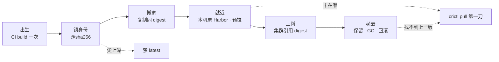
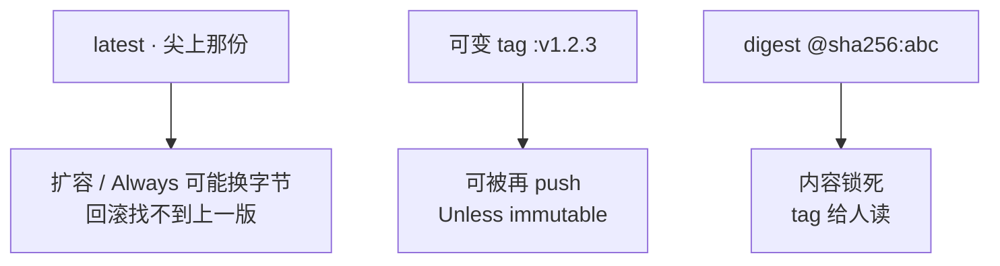
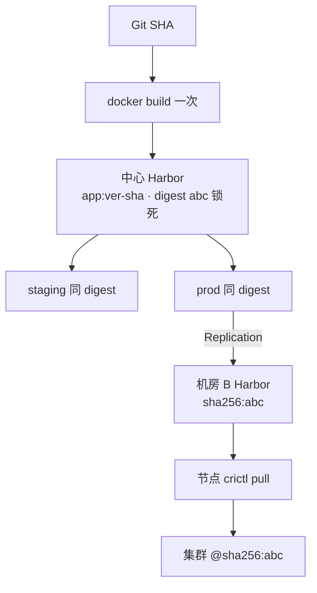
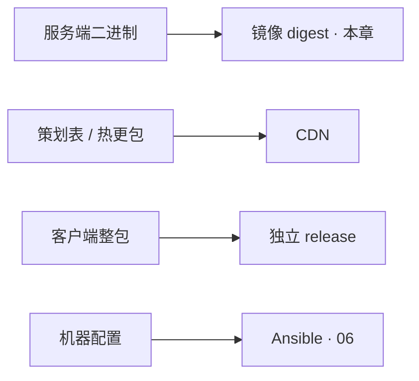
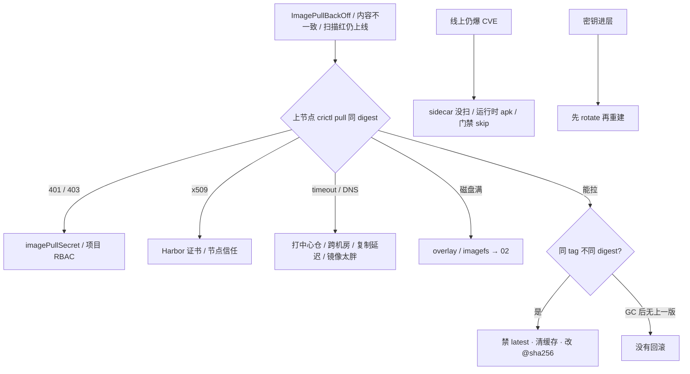

# 制品与镜像

> 开服 200 节点同时拉镜像超时；线上回滚找不到当时那份包；扫描红了仍能上线；有人把热修打成 `logic:latest`——节点 A 昨天的 latest 和节点 B 今天的不是同一坨字节，排障对不上 digest。
> **本章回答**：一份制品从 CI 出生到节点就近拉完，digest 怎么贯通；latest / 每环境 rebuild / 跨机房首拉各自错在哪。
> **不讲**：流水线阶段、晋升审批、金丝雀 SLI → [04](../04-CI-CD/)；分层缓存、ENTRYPOINT vs CMD、overlay2、BuildKit secret → [02](../02-Docker深度/)；K8s Secret → [03-12](../../03-Kubernetes/12-配置与密钥/)；云上 RAM/IAM → [06-04](../../06-云平台/04-IAM与多账号/)；GitOps sync 哪个 tag → [03-23](../../03-Kubernetes/23-GitOps-ArgoCD与Tekton/)；客户端资源包 / CDN → [07-05](../../07-游戏运维专题/05-热更新与版本发布/) / [07-08](../../07-游戏运维专题/08-CDN与资源更新/)。

**标记**：🎯重点 · 🔥难点 · ⭐常考 · 🔧实操

---

## 一、一张图：制品的一生

> 🎯 **一句话**：制品和人一样——出生（CI 构建一次）、锁身份（digest）、搬家（复制不重建）、就近住下（本机房 Harbor）、老去（保留 / GC）、出事（`crictl pull` 分流）。



- 📖 **读图**
  - 🛤️ 主线：构建一次 → `@sha256` 锁死 → 同 digest 复制到 staging/prod/机房 → 节点就近拉 → 保留够回滚
  - 🔪 虚线是事故口：`latest`、跨机房首拉、GC 清了上一版；第一刀都是上节点 `crictl pull` 同 digest（Q6、Q14）

- 🔑 **三条钉子**（后面每节展开）
  - **锁内容**：生产写 `@sha256`；tag `v1.2.3-<sha7>` 只给人读
  - **复制晋升**：`crane copy` / Harbor Replication 同 digest；禁止每环境 `docker build`
  - **就近拉**：开服前本机房 Harbor 已有该 digest，节点 DNS 指本地

- 🕵️ **值班里怎么认**（群话 → 第一刀）
  - 「ImagePullBackOff 一片」→ 上节点 `crictl pull` 同 digest
  - 「发了没更新 / 部分节点旧版」→ `crane digest` 对集群 `imageID`
  - 「回滚按钮灰了 / 找不到上一版」→ Harbor 保留策略 / latest 是否被覆盖
  - 「扫描红了还能上」→ 哪道 CI/Harbor 策略被 skip
  - 「开服窗口拉镜像超时」→ 本机房 Harbor + 预拉 + 瘦身

口诀：⭐ **tag 给人读，digest 锁内容；复制不重建。**

本节对应练习题 Q1、Q7。

---

## 二、锁内容：三种引用差在哪

> 🎯 **一句话**：测过的是 digest，不是「同一份 Dockerfile」；引用层能不能回滚，看你锁没锁字节。

| 引用 | 内容会不会变 | 生产 |
|------|--------------|------|
| `app:latest` | 尖上每次 push 都换 | **禁止** |
| `app:v1.2.3` | 可被再 push（除非 immutable） | 仅人读辅助 |
| `app@sha256:abc` | 内容锁死 | **必须** |



- 📖 **读图**：左两列是「名字还在、字节可能已换」；右边才是生产引用。排障对仓库 `crane digest` 与集群 `imageID`。

- 🪪 **一次发布记三件**
  - app **digest**（内容是谁）
  - **chart version**（清单骨架）
  - **values 哈希**（这次注入了什么）
  - 证明链路：digest ↔ commit ↔ MR；对不上就不要猜「是不是同一份」

```text
image: repo/app:v1.2.3          # tag 可被覆盖（可变）
image: repo/app@sha256:abc      # 内容锁死 ← 生产写法
```

#### ❓ 为什么开了 immutable tag 还要写 digest？

- 🏷️ immutable 挡住的是「同名 tag 再 push」——人读友好、防手滑覆盖 tip
- 🔒 **引用层**仍可能被人写成别的 tag，或历史 tag 在开 immutable 之前已漂过
- ✅ 生产 yaml / GitOps 期望：**`@sha256:...`**；tag 只出现在人读字段、变更说明、Harbor UI

> ⚠️ **别混**：开发环境可以用 latest；**任何会自动重启、会扩容的集群不要用**。immutable ≠ digest 的替代品。

> 📝 **面试**：生产写 `@sha256`，tag 给人读；测过的是 digest，不是同 Dockerfile。⭐（Q1、Q7）

本节对应练习题 Q1、Q2。

---

## 三、出生：同 SHA ≠ 同镜像 🔥⭐

> 🎯 **一句话**：构建不是纯函数——同一 Git SHA 再 build 一次，digest 也可能变；晋升只能 **复制 digest**。

> 💡 **打个比方**：唱片厂只压一张母盘（CI 打出 digest），各门店（staging / prod Harbor）只能 **复印母盘**，不能每家店自己再录一遍——音色（字节）已经变了。

#### ❓ 为什么同 Git SHA 再 build，digest 会不一样？

- 🎲 **构建不确定**（同一次代码，字节仍可能变）
  - 基础镜像 tag 浮动（`golang:1.22` 今天和昨天 tip 不同）
  - apk/apt 当时仓库里的包版本
  - `go build` / 链接器写入的时间戳、路径
  - 依赖解析时刻（未锁死的 transitive）
- ✅ **结论**：staging 测过的和 prod「同分支再 build」的 **不是同一个二进制**——故障时答不出「预发验的就是线上这份吗」
- 🔧 **正解**：CI build **一次** → `crane copy` / Harbor Replication 把同一 `sha256:...` 拷到各仓 → 集群写 `@sha256:...`

**现场走一遍**（有人提议「prod 再 build 省复制」）：

```bash
crane digest harbor.example.com/staging/logic:v1.2.3-abc1234
kubectl get deploy logic -n staging \
  -o jsonpath='{.spec.template.spec.containers[0].image}{"\n"}'
```

```text
harbor.example.com/staging/logic@sha256:abc123def456...   # ← 仓库 tip
harbor.example.com/staging/logic@sha256:abc123def456...   # ← 集群引用一致，可以复制
```

```bash
# 同事在 prod「同分支」又 docker build && push 同 tag 后：
crane digest harbor.example.com/prod/logic:v1.2.3-abc1234
```

```text
harbor.example.com/prod/logic@sha256:fedcba987654...     # ← 不是复制，是重建
```

- 🔍 **读输出**
  - 两行 digest 相同 → staging 仓与集群对齐，可以复制到 prod
  - prod ≠ staging → **停切流量**，改复制流程
  - yaml 已是 `@sha256:abc...` → 内容锁死；tag 仅人读

#### ❓ 为什么 `docker tag` 换仓再 push 叫复制，`docker build` 再 push 叫重建？

- 📦 **复制**：同一层 blob、同一 digest 出现在两个 registry
  - `crane copy` / Harbor Replication / `docker tag`+push **不重编**
- 🏭 **重建**：再走一遍 Dockerfile → 新 digest，预发冒烟结论不能为它辩护
- 🧾 口误现场：「我 tag 过去了」——先对两边 `crane digest`，一样才算

> 📝 **面试**：代码 SHA 相同不代表镜像相同；CI build 一次，staging/prod 用 `crane copy` 同 digest，Deployment 写 `@sha256`。⭐（Q1）

口诀：**同 SHA ≠ 同镜像；复制 digest，禁止每环境 rebuild。**

本节对应练习题 Q1。

---

## 四、禁 latest：尖上会漂 🔥⭐

> 🎯 **一句话**：`latest` 不是版本号，是「仓库尖上那份」——扩容、回滚、Always 都会让不同节点跑不同字节。

> 💡 **打个比方**：食堂挂「今日特供」——昨天吃的和今天叫同一牌的可能不是一道菜；回滚时牌子还在，菜已经换了。

**现场**（热修打了 `logic:latest`，扩容后部分区崩）：

```bash
kubectl get po -l app=logic -o wide
kubectl get po -l app=logic -o jsonpath='{range .items[*]}{.spec.nodeName}{"\t"}{.spec.containers[0].image}{"\t"}{.status.containerStatuses[0].imageID}{"\n"}{end}'
```

```text
10.0.1.11   harbor.../logic:latest   sha256:abc123...   # ← 老节点 IfNotPresent 缓存
10.0.1.22   harbor.../logic:latest   sha256:fedcba...   # ← 新调度节点拉到尖上新内容
10.0.2.33   harbor.../logic:latest   sha256:fedcba...
```

- 🔍 **同 tag、两种 imageID** = 混跑；尖上再查：

```bash
crane digest harbor.example.com/prod/logic:latest
```

```text
harbor.example.com/prod/logic@sha256:fedcba987654...   # ← 上一版 abc 已被覆盖，回滚踩空
```

- ✅ **修**
  - Deployment 改回上一成功 `@sha256:abc...`
  - 禁 latest；prod 开 immutable tag（仍写 digest）
  - 必要时节点 `crictl rmi` 清缓存再拉

#### ❓ 为什么 `IfNotPresent` + 可变 tag 会「发了没更新」？

- 🧊 老节点已有同名 tag 的层 → **不拉新的**，看起来发了、进程还是旧字节
- 🔄 `Always` + `latest` → 每次调度可能再变，扩容混跑更狠
- ✅ 配 digest 时 `IfNotPresent` 即可——内容已锁，不必 Always

| 组合 | 典型坑 |
|------|--------|
| `Always` + `latest` | 每次调度可能换内容 |
| `IfNotPresent` + 可变 tag | 老节点永不变，「发了没更新」 |
| `IfNotPresent` + `@sha256` | 正常：内容已锁 |

> ⚠️ **别混**：Always 不是「保证最新正确版本」，只是「每次可能再问仓库」；仓库 tip 漂，Always 跟着漂。

> 📝 **面试**：禁 latest 因为 tag 可重推、缓存策略不同导致同 tag 不同 digest 混跑；回滚对上一版 digest，不是对 latest。⭐（Q2、Q7）

口诀：**latest 不是版本号，是尖上那份；扩容混跑，回滚踩空。**

本节对应练习题 Q2、Q7。

---

## 五、晋升与就近：复制到本机房 🎯⭐

> 🎯 **一句话**：CI 构建一次 → 同 digest 复制 → 节点就近拉；**没有**从 prod 指回 build 的箭头。



- 📖 **读图**
  - 🚫 **没有** prod → build 的回流：配置不同用注入，不重新打包
  - 📎 复制 = 同一 digest 出现在两个 registry；节点 DNS 仍指中心仓 = 开服打满跨机房带宽

- 🏗️ **Harbor 要能说到的能力**（不是「私有 Docker Hub」四个字）
  - 项目 **RBAC**：CI 只能 push 指定 project；集群只能 pull prod
  - **Replication**：多机房同步，节点就近拉，避免跨海 pull 超时
  - **Proxy Cache**：缓存 Docker Hub，防限流；基础镜像也走内网
  - **扫描**：集成 Trivy，Critical 阻断晋升
  - **GC**：清无 tag blob；现代版本可在线 GC，不必停服
  - **OCI**：Helm Chart 和镜像同一仓库、同一套 RBAC

#### ❓ 为什么 Harbor 不是「私有 Docker Hub」？

- Hub 只管存取；生产还要：**隔离谁能 push/pull、跨机房复制、扫 Critical、清无用 blob、Chart 同 RBAC**
- 开服清单必须有一句：**本机房 Harbor 已有该 digest**；复制延迟高于阈值 → **不要切流量**

- ✅ **验收**
  - 本机房 Harbor 有该 digest；复制延迟低于阈值
  - 节点 DNS 指本机房；CI 不能越权 push prod
  - 供应链：只从内网 Harbor 拉，基础镜像也走 Proxy Cache
  - imagePullSecrets 按 ns 发放，不要集群默认全能 pull

- 🔭 **观测**：Harbor 磁盘、复制延迟、扫描队列、pull QPS；跨云复制失败先查带宽、鉴权、immutable tag 冲突（同 tag 不同 digest）

> 📝 **面试**：一次构建多处部署——build 一次，Replication/`crane copy` 同 digest，节点就近；prod 不再 build。⭐（Q1、Q4）

本节对应练习题 Q4、Q9、Q12。

---

## 六、瘦身：开服窗口被谁吃掉 🔥

> 🎯 **一句话**：runtime 只放二进制——编译工具链、策划表、符号表进运行镜像，200 节点同时拉会打满窗口。

> 💡 **打个比方**：搬家只带成品家具（二进制），别把工厂车间（JDK/编译器）和货架（策划表）一起塞车——200 户同时搬就堵死路。

**现场**（逻辑服 1.8GB，开服 200 节点 ImagePullBackOff）：

```bash
docker history harbor.example.com/prod/logic:v1.2.3-abc1234 --no-trunc \
  --format '{{.Size}}\t{{.CreatedBy}}' | head -15
```

```text
1.2GB    COPY data/ /app/data/     # ← 策划表进业务镜像，开服杀手
45MB     RUN go mod download
780MB    COPY . .
12MB     RUN CGO_ENABLED=0 go build -o server .
5MB      RUN apk --no-cache add ca-certificates
```

- ✂️ **多阶段骨架**（runtime 只留二进制 + ca-certificates）：

```dockerfile
FROM golang:1.22 AS builder
WORKDIR /app
COPY go.mod go.sum ./
RUN go mod download                 # 依赖先缓存
COPY . .
RUN CGO_ENABLED=0 go build -o server .

FROM alpine:3.20
RUN apk --no-cache add ca-certificates
COPY --from=builder /app/server /server
USER 1000                           # 生产非 root
ENTRYPOINT ["/server"]
```

```bash
docker build -t logic:slim .
docker images logic:slim --format '{{.Repository}}:{{.Tag}}\t{{.Size}}'
# logic:slim    48MB
```

#### ❓ 为什么策划表不能打进业务镜像「方便热更」？

- 📦 镜像里一份、CDN 上一份 → **两边版本漂**；改表还要重建镜像
- 🌐 热更走 CDN（[07-08](../../07-游戏运维专题/08-CDN与资源更新/)）；镜像只放服务端二进制
- 📉 仍 >500MB → `dive` 查符号表 / apt 缓存；开服前本机房 `crictl pull` 预拉

```bash
crictl pull harbor-b.example.com/prod/logic@sha256:abc123...
# Image is up to date for sha256:abc123...   ← 窗口前已在本机房
```

- 🔧 **构建卫生**
  - 层缓存：不常变的放前，源码 COPY 放后
  - `.dockerignore` 丢 `.git` / `node_modules`
  - 基础镜像钉版本，不用 latest
  - 构建机不要无故 `--privileged` DinD 暴露 Docker socket（细节 → [02](../02-Docker深度/)）

> 📝 **面试**：开服慢先 `docker history` 找胖层，多阶段只拷二进制；策划表走 CDN；开服前本机房预拉同 digest。（Q3、Q4）

本节对应练习题 Q3、Q4。

---

## 七、门禁：Critical 与密钥 ⭐🔥

> 🎯 **一句话**：push 后 Harbor 扫、CI 再扫——**Critical=0 才能晋 prod**；密钥进层先 rotate，删 tag 救不了已推送 digest。

> 💡 **打个比方**：机场两道安检（Harbor + CI）防 skip；密钥进镜像像钥匙焊进行李箱——箱子（digest）还在仓库，换行李牌（删 tag）钥匙照样能捡到。

**现场**（扫描红了仍能上线）：

```bash
trivy image --severity CRITICAL,HIGH harbor.example.com/prod/logic@sha256:abc123...
```

```text
Total: 3 (CRITICAL: 1, HIGH: 2)

CVE-2024-1234 (CRITICAL)    openssl    1.1.1k-r0    fixed in 1.1.1w-r0
CVE-2024-5678 (HIGH)        libcurl    8.0.1-r0
```

- 🛑 **Critical > 0** → 阻断晋 prod
  - 线上已在跑 = 哪道 `allow_failure` / Harbor 策略没绑 prod
  - 处理：升级基础镜像 → 重建 digest → 复制晋升；暂不能改则登记例外 + 到期日 + 网络隔离评估
- 📅 **High** → 团队 SLA + **到期日**，禁止永久豁免
- 🧩 sidecar / 基础镜像也要扫；禁止运行时 `apk add`（扫描看不见）

#### ❓ 为什么删 tag 救不了进层的密钥？

- 🏷️ tag 只是指针；**digest / blob 还在**，知道 digest 仍能 pull
- ✅ **先 rotate 密钥** → 重建清层 → 强制换 digest 部署；只删 tag = 自欺
- 🔏 密钥不进镜像、不进 Git
  - BuildKit secret → [02](../02-Docker深度/)
  - K8s Secret / External Secrets → [03-12](../../03-Kubernetes/12-配置与密钥/)
- ✍️ 签名（cosign / Notary）防供应链替换；CI 对 digest `cosign sign`，admission 校验有则加分

> ⚠️ **别混**：「活动先开后补」一旦有 skip，后面全是人情发布；High 有期例外 ≠ Critical 可跳。

> 📝 **面试**：Critical 硬阻断，High 有主有期；CI+Harbor 双扫防 skip；密钥进层先 rotate 再重建。⭐（Q5）

口诀：**Critical=0 才能晋；密钥进层先 rotate，删 tag 救不了。**

本节对应练习题 Q5。

---

## 八、配置钉子与热更拆分 🔧

> 🎯 **一句话**：只动有证据的项；引用以 digest 为准；服务端镜像 ≠ 策划包 ≠ 客户端整包。

| 项 | 生产 | 改错会怎样 |
|----|------|------------|
| tag | prod **immutable**；引用仍 `@sha256` | 同 tag 不同内容 |
| `imagePullPolicy` | 配 digest → IfNotPresent | Always+latest 每次可能换 |
| Critical | **阻断晋 prod** | 带洞上线 |
| High CVE | 团队阈值 + **到期日** | 永久豁免 |
| 保留 | dev TTL **7 天**；prod **20+** 成功 digest | 回滚无包 / 盘满乱 GC |
| Proxy Cache 过期 | 别清生产正在用的基础层 | 节点突然拉不到 |
| USER | 非 root（如 **1000**） | 逃逸面 |
| DinD | 不要无故暴露 socket | 不可信流水线控宿主机 |



- 📖 **读图**：四条通道各管各的；别把策划表塞进业务镜像「图省事」

- 📋 **典型操作**
  - **晋升**：build 一次 → 复制 staging → 审批 → 复制 prod → 集群 `@sha256`；晋升前后 `crane digest` 必须相同；配置外置
  - **开服**：瘦身 + 本机房复制 + DaemonSet/`crictl pull` 预拉；200 节点窗口禁止第一次 pull 中心仓
  - **扫描**：CI 与 Harbor 双扫；Critical 阻断；High 有主有期；sidecar 分开扫
  - **GC / 保留**：dev TTL 7 天、prod **20+** digest；GC 前对集群 `spec.containers[].image`；回档窗口内别清旧包
  - **Chart**：Helm OCI 同 RBAC；values 分层不 fork；一次发布记 digest + chart version + values 哈希
  - **回滚**：指回仓库仍有的 digest；latest 覆盖或 GC = 没有回滚；GitOps 改 Git sync → [03-23](../../03-Kubernetes/23-GitOps-ArgoCD与Tekton/)

> ⭐ **记住**：immutable tag 不是 digest 的替代。GC 前对照集群仍在用的 `spec.containers[].image`。

本节对应练习题 Q6、Q8、Q10、Q11、Q12。

---

## 九、作战：定责 🔧

> 🎯 **一句话**：拉不到镜像 = 新 Pod 起不来，**已运行容器通常还在**——先 `crictl pull` 分流，别先重启逻辑服。

#### ❓ 为什么拉不到时别先重启逻辑服？

- 🟢 已跑着的容器不依赖「再 pull 一次」；重启可能把好的也杀光，新 Pod 全部 ImagePullBackOff
- ✅ 先上节点对 **同一 digest** `crictl pull`，把 401 / x509 / timeout / 磁盘分开
- 🧭 三问：进程还在不在？还能不能变更？已有流量还通不通？——多数时候前两个答案是「在 / 先别动」



- 📖 **读图**：先问「能不能拉」再问「拉到的是不是同一份」；扫描/密钥另开分支，别和网络超时搅在一起

### 现象 · 先做 · 别做

| 现象 | 先做 | 别做 |
|------|------|------|
| 401 / 403 | Secret 是否错 ns / 过期；项目 RBAC | 只看 Deployment Events |
| x509 | Harbor 证书、节点 trust | 先扩容再拉 |
| timeout | DNS、跨机房、复制延迟、镜像体积 | 当偶发网络 |
| 磁盘满 | imagefs / overlay2 prune（→ [02](../02-Docker深度/)） | 格式化数据盘当第一手 |
| 部分节点内容不一 | 禁 latest、清缓存、对仓库 sha256 | 再发一次 latest |
| 开服 200 节点超时 | 本机房 Harbor / 预拉 / 瘦身 | 窗口第一次 pull 中心仓 |
| 扫描红仍上线 | 哪道门禁被 skip | 「活动先开」 |
| 密钥进镜像 | **先 rotate** | 只删 tag |
| 复制 immutable 冲突 | 换 sha tag 或只按 digest 复制 | 强推不同内容到同 tag |
| Proxy Cache 清了生产层 | 过期策略；对照正在跑的层 | 继续乱 GC |

### 60 秒剧本 🔧

> 🔍 **现场**：接到 ImagePullBackOff / 「发了没更新」，60 秒走完再下结论。

```text
① 0–10s   进程还在？别先重启。上节点：crictl pull <同 digest>
② 10–30s  401→Secret/RBAC；x509→证书；timeout→DNS/机房/体积；成功→对 imageID
③ 30–45s  同 tag 不同 digest → 禁 latest、改 @sha256；仓库无上一版 → GC/保留事故
④ 45–60s  定责：复制延迟未好不要切流量；扫描红查 skip；密钥先 rotate
```

```bash
crane digest harbor.example.com/prod/app:v1.2.3-abc1234
kubectl get deploy -o jsonpath='{.spec.template.spec.containers[*].image}'
crictl pull harbor.example.com/prod/app@sha256:abc...
journalctl -u containerd -u kubelet --since -10m
# Harbor UI/API：本机房有没有该 digest、复制延迟、扫描队列
```

```text
harbor.example.com/prod/app@sha256:abc123def456...
harbor.example.com/prod/app@sha256:abc123def456...
Image is up to date for sha256:abc123def456...
# 前三行 digest 一致且 pull 成功 = 引用和内容对齐；401/x509/timeout 在 crictl 这一步分开
```

401 但 Secret 挂了：查错 ns、过期、CI 账号能不能 pull 该 project。digest 不对：清节点层缓存再拉，先确认仓库里 sha256。

本节对应练习题 Q6、Q14。

---

## 十、收口

### 命令速查 🔧

```bash
# 是不是同一份
crane digest harbor.example.com/prod/app:v1.2.3-abc1234
# 集群引用
kubectl get deploy -o jsonpath='{.spec.template.spec.containers[*].image}'
# Pod 实际 imageID（混跑一眼看穿）
kubectl get po -l app=app -o jsonpath='{range .items[*]}{.spec.nodeName}{"\t"}{.status.containerStatuses[0].imageID}{"\n"}{end}'
# 哪层胖
docker history  --no-trunc --format '{{.Size}}\t{{.CreatedBy}}' | head
# 节点拉（401/x509/timeout 在这一步分开）
crictl pull harbor.example.com/prod/app@sha256:abc...
# 运行时
journalctl -u containerd -u kubelet --since -10m
# 复制（同 digest，不是重建）
crane copy harbor.../staging/app@sha256:abc... harbor.../prod/app:v1.2.3-abc1234
# 扫描
trivy image --severity CRITICAL,HIGH harbor.../app@sha256:abc...
```

### 面试锚点

| 问 | 30 秒答 |
|----|---------|
| 同 SHA 就是同镜像？ | 否。构建不确定；CI build 一次，复制 digest，集群写 `@sha256`。 |
| 复制 vs 重建？ | `crane copy`/Replication/`docker tag` 同 digest = 复制；再 `docker build` = 重建。 |
| 为何禁 latest？ | tip 可重推；缓存策略不同 → 同 tag 不同 digest 混跑；回滚要对上一版 digest。 |
| immutable 还要 digest？ | 要。引用层仍以 digest 为准；immutable 只防覆盖 tip。 |
| Harbor 比私有 Hub 多啥？ | RBAC、Replication、Proxy Cache、扫描、GC、OCI。 |
| 开服拉超时？ | history 找胖层 → 多阶段；策划表走 CDN；本机房已有 digest + 预拉。 |
| Critical / 密钥？ | Critical=0 才能晋；密钥进层先 rotate 再重建，删 tag 救不了 digest。 |
| ImagePullBackOff 第一刀？ | 上节点 `crictl pull` 同 digest 分流；已运行容器通常还在，别先重启业务。 |

### 易错一句话对照

- 代码 SHA 相同就是同一份镜像 → 构建不确定，要对 digest
- `docker build` 再 push 到 prod 叫复制 → 同 digest 才是复制
- 生产可以用 latest → 会扩容/自动重启的集群不行
- immutable 开了就不用 digest → 引用层仍以 digest 为准
- `IfNotPresent` + 可变 tag 会自动更新 → 老节点继续用旧层
- 多阶段后还 1GB 只能换更大盘 → 先 history/dive：数据/符号表/apt
- 策划表打进业务镜像方便热更 → 和 CDN 两边版本漂
- Harbor = 私有 Docker Hub → 缺 RBAC/复制/扫描/GC/OCI
- GC 前不用看集群 → tag 删了 Pod 仍按 digest 跑
- Critical 可以先发后补 → 硬阻断；High 才是有期例外
- 删 tag 密钥就没了 → digest 还在；先 rotate
- 只扫业务镜像够了 → sidecar、运行时 apk、基础镜像也要扫
- 拉不到先重启逻辑服 → 已运行容器通常还在；先 `crictl pull` 分流
- 合服第二天立刻 GC 旧包 → 回档窗口没过先留着
- 节点直连 Docker Hub 拉基础镜像 → Proxy Cache；供应链只走内网 Harbor
- 密码写进 values-prod 方便 → 不进 Git；Chart 不要 fork

### 数字墙

> Critical **=0** 才能晋 prod · High 有主有期 · dev TTL **7 天** · prod 留 **20+** 成功 digest · 开服 **200** 节点同时拉是典型事故窗口 · 非 root 如 **UID 1000** · runtime 目标量级常 **几十 MB**（工具链/策划表打进去可到 GB）· 复制延迟高于开服阈值 → **不要切流量**

---

## 合上书

对着第一节主图口述一遍，卡住就回对应小节。开头那个 latest 混跑、开服超时、扫描红仍上线——各自卡在哪一段，现在该能说清了。

- [ ] **默画主图**：出生 → 锁 digest → 复制 → 就近预拉 → 上岗 → 保留/GC；标出 latest 与 `crictl pull` 两刀。（→ Q1 · Q14）
- [ ] **口述锁内容**：三种引用、为何禁 latest、immutable 为何还要 digest、IfNotPresent+可变 tag 为何「发了没更新」。（→ Q2 · Q7）
- [ ] **口述出生与复制**：同 SHA ≠ 同镜像、复制 vs 重建、晋升前后如何对 `crane digest`。（→ Q1）
- [ ] **口述瘦身**：history 找哪层、多阶段只拷什么、策划表为何不进镜像、开服清单写哪句。（→ Q3 · Q4）
- [ ] **口述 Harbor**：比私有 Hub 多哪几项、DNS 指哪、复制延迟高怎么办。（→ Q4 · Q9 · Q12）
- [ ] **口述门禁**：Critical/High、双扫防 skip、密钥为何删 tag 不够。（→ Q5）
- [ ] **定责**：60 秒剧本四步；为何拉不到别先重启业务。（→ Q6 · Q14）
- [ ] **口述拆分**：镜像 / CDN / 客户端 / Ansible 各管什么；一次发布记哪三件。（→ Q8 · Q10）

下一章：[CI/CD](../04-CI-CD/)。分层与盘满：[02](../02-Docker深度/)。
