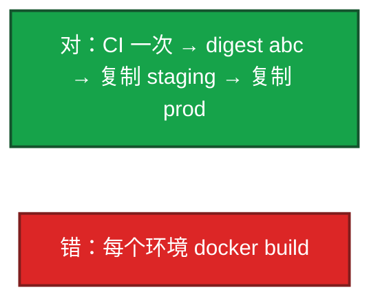
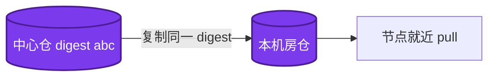
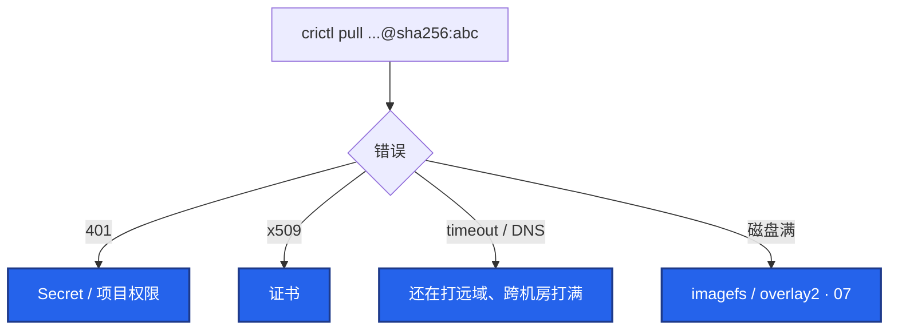

# 03｜制品与镜像 · 练习题

先对照 [知识点](知识点.md) **本章主线** 自己口述，再对答案。关键字（digest、latest、Harbor 复制、Trivy、GC）要能点名。每题标了覆盖范围：

| 标记 | 含义 |
|------|------|
| **核心** | 不懂整章就没建立起来 |
| **必会** | 值班和面试都要能讲 |
| **常用** | 线上会反复碰到 |
| **常考** | 白板和追问的高频口径 |

## 本题目录

- [Q1 一次构建多处部署](#q1)
- [Q2 禁用 latest](#q2)
- [Q3 镜像分层 / 策划表](#q3)
- [Q4 Harbor / 开服](#q4)
- [Q5 扫描 / 密钥](#q5)
- [Q6 节点拉失败](#q6)
- [Q7 tag vs digest](#q7)
- [Q8 Chart](#q8)
- [Q9 跨机房复制](#q9)
- [Q10 追溯 / GC / 热更拆](#q10)
- [合上书](#合上书)

---

## Q1

**★★★★★｜「一次构建、多处部署」为什么是铁律？**

**覆盖**：核心 · 必会 · 常考

**对应**：知识点 §3.1

### 场景

预发测了三天。生产流水线又 build 了一次，Git SHA 相同，晚上登录挂了。有人说「代码一样不可能有差」。

### 完整解答

**一句话**：一次 build 出 digest，staging 和 prod 只复制同一 sha256，禁止每环境重建。

每个环境重 build，预发测的不是生产跑的。构建不确定：基础镜像、包索引、时间戳。

tag 用版本 + sha，生产引用 digest。配置差：环境配置外置，镜像不变。口误：`docker tag` 换仓库再 push 同一 digest 才叫复制。

### 再追问

- 怎么证明两边是同一份？——`crane digest` 比 sha256；集群 image 字段必须是这个 digest。

---

## Q2

**★★★★★｜为什么生产禁用 latest？开发环境呢？**

**覆盖**：核心 · 必会 · 常考

**对应**：知识点 §3.2

### 场景

Deployment 写 `app:latest`，`imagePullPolicy: Always`。回滚时「再发一次 latest」，节点新旧混跑。战斗服扩了 30 个新 Pod。

### 完整解答

**一句话**：生产禁 latest：不可追溯、不可回滚、Always 可能拉到不同字节。

不可追溯、不可回滚、Always 可能拉到另一坨字节。tag 可被覆盖（除非 immutable）。

用 `v1.2.3-<sha>` + `@sha256`。开发可以用 latest；**任何自动重启、会扩容的集群不行。** `IfNotPresent` + 可变 tag = 节点继续用旧层，看起来发了没更新。

### 再追问

- immutable tag 开了还要 digest？——要。引用层仍以 digest 为准。不可变打开后「覆盖 tag 救火」会 push 失败，这是好事。

---

## Q3

**★★★★★｜镜像太大怎么砍？游戏策划表能不能打进去？分层看什么？**

**覆盖**：核心 · 必会 · 常用

**对应**：知识点 §3.3

### 场景

逻辑服镜像 1.8GB，开服拉镜像把窗口吃掉。Dockerfile 用的 `ubuntu` + 整份数值表 + 符号表。`docker history` 有一层 1.2GB 的 `COPY data/`。

### 完整解答

**一句话**：多阶段 + 层顺序 + .dockerignore 砍胖层；策划表不进业务镜像，热更走 CDN。

1. 多阶段：编译和 runtime 分离，工具链不进运行镜像
2. 层顺序：依赖在前，源码 COPY 在后；`.dockerignore` 丢掉 `.git` / `node_modules`
3. alpine / distroless，钉版本，不用 latest
4. 非 root（如 USER 1000）
5. `dive` / `docker history` 看胖层

游戏别把整包策划表打进业务镜像，热更走 CDN。分开后还 1GB：拷了符号表 / 数据 / apt 缓存。瘦身细节和 BuildKit 在 07，本题答到「制品必须能在开服窗口拉完」。构建机不要无故 `--privileged` DinD。

### 再追问

- 热更只更了 CDN、镜像里还是旧表？——两边版本漂。资源包不要和业务镜像绑死。

---

## Q4

**★★★★★｜Harbor 比「私有 Docker Hub」多什么？开服怎么拉镜像？**

**覆盖**：核心 · 必会 · 常考

**对应**：知识点 §4.2

### 场景

「我们有个私有仓库。」开服 200 节点同时打中心仓，pull 超时。安全问 CI 能不能 push 到 prod 项目。

### 完整解答

**一句话**：Harbor 靠 RBAC + 本机房复制 + 预拉扛开服；节点就近 pull 同一 digest。

还要能说：项目 RBAC（CI 只能 push 指定 project，集群只能 pull prod）、Proxy Cache 挡 Docker Hub 限流、Trivy 扫描、GC、OCI Chart。开服靠本机房复制 + 预拉（DaemonSet / `crictl pull`），避免第一次 pull 叠在开服窗口。复制延迟大不要切流量。开服清单写「本机房已有该 digest」。imagePullSecrets 按 ns 发放。供应链：节点只拉内网 Harbor。

### 再追问

- GC 会不会删正在跑的层？——tag 删了但 Pod 仍按 digest 跑。GC 前对照集群引用。合服回档窗口内先别 GC 旧 digest。

---

## Q5

**★★★★☆｜扫描出 Critical 怎么处理？密钥打进镜像呢？**

**覆盖**：必会 · 常用 · 常考

**对应**：知识点 §3.4

### 场景

Harbor 报 Critical。活动要今晚发。另一边有人把 npm token `ENV` 进了 Dockerfile。扫描 job 在 CI 里是黄的仍往下走。

### 完整解答

**一句话**：Critical 阻断晋 prod；密钥进层假设已泄漏，先 rotate 再 secret mount 重建。

Critical 阻断晋 prod。升级基础镜像 / 依赖。已在线：评估可达性 + 例外到期日，有主有期。CI 和 Harbor 都扫，防策略被绕。High 用团队阈值，不是全放行。CVE 例外每周过期，过期自动变红。扫描红了仍能上线 = 门禁被 skip，当事故。

密钥进镜像：假设已泄漏——先 rotate，再重建（BuildKit secret 挂载，见 07），强制重部署。删 tag digest 还在。仓库加 secrets scanning / gitleaks。不要 `ENV` / `COPY` 密钥。

签名（cosign）加分；没有 admission 至少扫描门禁要在。

### 再追问

- 扫描过了线上仍爆 CVE？——运行时才装的包、sidecar 没扫、基础镜像被重打 tag、门禁被 skip。

---

## Q6

**★★★★☆｜节点拉镜像失败怎么查？**

**覆盖**：必会 · 常用

**对应**：知识点 §6.2

### 场景

部分节点 ImagePullBackOff。有人只看 Deployment Events 里的「Failed to pull」。

### 完整解答

**一句话**：ImagePullBackOff 到节点 crictl pull 同一 digest，按 401/x509/timeout/磁盘分流。

到节点拉 **同一 digest**，别只看事件。

开服窗口叠加大镜像是典型事故。预拉 + 瘦身 + 就近 Harbor。部分节点失败：看是否还指到远域 registry。digest 不对：清节点缓存再拉。

### 再追问

- 401 但 Secret 挂了？——Secret 在错 ns、过期、CI 用的账号不能 pull 该 project。

---

## Q7

**★★★★☆｜tag 和 digest 在 K8s 里差在哪？**

**覆盖**：必会 · 常用 · 常考

**对应**：知识点 §3.1

### 场景

仓库没开 immutable，同一 tag 被覆盖。一半 Pod 一个 digest，一半另一个。

### 完整解答

**一句话**：tag 可变，digest 锁内容；生产引用 @sha256，immutable 仍要以 digest 为准。

tag 可变；digest 锁内容。生产用 digest，tag 给人读。

| 写法 | 含义 |
|------|------|
| `:v1.2.3` | 可被再 push 成另一坨字节 |
| `@sha256:abc` | 内容锁死 |
| Always + latest | 每次调度可能换内容 |

保留策略删 tag 前对集群引用。核对 jsonpath 打出的 image 必须是 digest 或不可变 tag。

### 再追问

- immutable 之后修 latest 这种习惯？——必须停。不可变打开后「覆盖 tag 救火」会直接 push 失败，这是好事。

---

## Q8

**★★★☆☆｜Chart 怎么当制品管？密码写进 values-prod 行不行？**

**覆盖**：必会 · 常用

**对应**：知识点 §6.5

### 场景

每个环境 fork 一份 Chart。prod values 里写了数据库密码。发布时对不上镜像版本。

### 完整解答

**一句话**：Chart 当 OCI 制品和镜像同一套 RBAC；values 分层，密码不进 Git。

Helm OCI push 进 Harbor，和镜像同一套 RBAC。values 分层，不要 fork 两份 Chart。密码不进 Git。

一次发布记录：app digest + chart version + values 哈希。Chart version 改模板才 bump；appVersion 对应用。

### 再追问

- 多环境差异很大？——values-staging / values-prod 覆盖，模板仍一份。差到要 fork 说明 Chart 不是一份制品了。

---

## Q9

**★★★☆☆｜跨机房复制失败、节点拉到旧层，怎么拆？**

**覆盖**：必会 · 常用

**对应**：知识点 §6.1

### 场景

中心仓已经是新 digest，机房 B 节点还在跑旧的。DNS 仍指向中心仓，复制 Job 报 immutable 冲突。

### 完整解答

**一句话**：跨机房复制是同一 digest 出现在两个 registry，不是重建；延迟未达标不切流量。

复制是「同一 digest 出现在两个 registry」，不是重建。

1. 看复制延迟和错误：鉴权 / 带宽 / 同一 tag 不同 digest
2. 集群 DNS 是否指到本机房 Harbor
3. 节点缓存是否还是旧层（digest 对一下）
4. 延迟高于阈值不要切开服流量

immutable 冲突：不要强推不同内容到同一 tag，换 sha tag 或只按 digest 复制。

### 再追问

- 生产正在用的基础层被 Proxy Cache 清了？——过期策略过狠。GC / 缓存清理前对照正在跑的层。

---

## Q10

**★★★☆☆｜怎么证明这次线上就是某次 MR？合服后旧包能不能立刻 GC？热更和镜像怎么拆？**

**覆盖**：必会 · 常考

**对应**：知识点 §6.4 · §3.4

### 场景

出事要对这次发布。镜像只有 latest。合服第二天有人要清 Harbor 磁盘。另有人把策划表打进业务镜像，热更只更了 CDN。

### 完整解答

**一句话**：审计链 MR→commit→digest→集群 image；合服回档窗口内不 GC；热更包和镜像拆开。

链路：MR → commit → tag / digest → 集群 image 字段 → 流水线审计。latest 接不上这条链。审计日志里必须有 sha256。

合服后旧 digest 先留着，回档窗口没过不要 GC。prod 留足够回滚用的成功 digest（例如 20+），删前对集群引用。

热更拆开：服务端二进制走镜像 digest；策划表 / 热更包走 CDN（08-03）；客户端整包走独立 release（01）；机器配置走 Ansible（04）。两边绑死会漂。

### 再追问

- 只记了 tag 没记 digest？——tag 被覆盖就断链。审计日志里必须有 sha256。

---

## 合上书

- [ ] 能画出一次构建、digest 贯通，并能区分复制 vs 再 build
- [ ] 能说出生产禁 latest 的理由，以及 immutable 仍要 digest
- [ ] 能用多阶段 + history/dive 砍胖层，策划表不进业务镜像
- [ ] 能说出 Harbor 的 RBAC / 复制 / Proxy Cache / 扫描 / GC / OCI
- [ ] 能在节点 `crictl pull` 同 digest 分流 401 / x509 / timeout / 磁盘
- [ ] 能处理 Critical、密钥进层（先 rotate）、Chart 三件套记录
- [ ] 能把热更包、客户端整包和镜像 CI 拆开，合服回档窗口内不 GC
