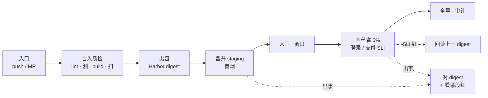
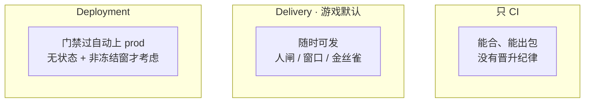
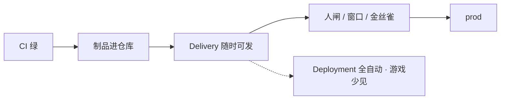
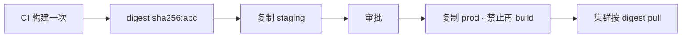
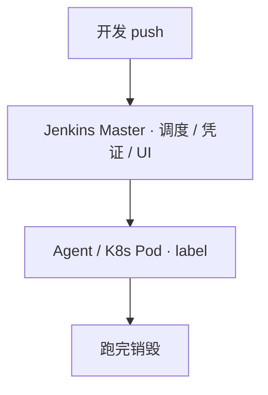
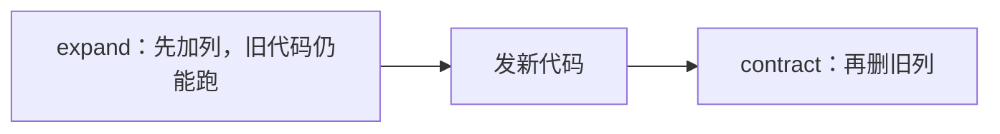
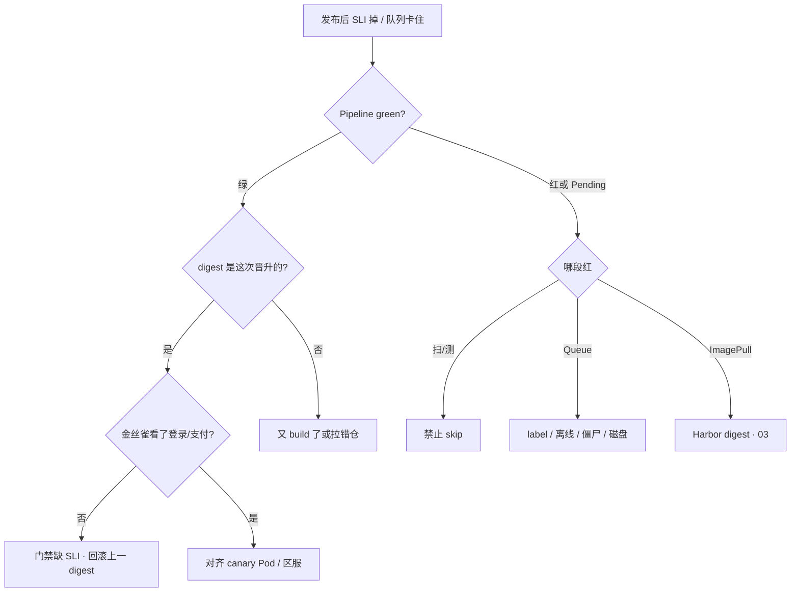

# CI/CD

> 流水线全绿，玩家登录不了。staging 冒烟 100% 过，prod job 里有人又跑了一次 `docker build`——Harbor 里 staging 是 `sha256:abc`，prod 刚编出来 `sha256:def`，Git SHA 一样。群里有人要 skip 扫描「活动先开」，金丝雀只探了 `/health`，充值成功率已经掉到 92%。
> **本章回答**：一次发布从 Git 到玩家能打会卡在哪几段——门禁怎么卡、制品怎么晋升、金丝雀看什么、失败怎么回滚、队列 Pending 先查哪。
> **不讲**：workflow YAML、自托管 runner、fork PR 密钥 → [05](../05-GitHub-Actions与GitLab-CI/)；镜像分层、ENTRYPOINT → [02](../02-Docker深度/)；Harbor、禁 latest、digest 复制细节 → [03](../03-制品与镜像/)；GitOps、Argo selfHeal → [03-23](../../03-Kubernetes/23-GitOps-ArgoCD与Tekton/)；发布策略 YAML、Ingress 权重 → [03-16](../../03-Kubernetes/16-灰度与回滚/)；变更窗口、oncall 冻结 → [08](../08-运维平台与Oncall/)；分支、revert → [01](../01-Git工作流/)。

**标记**：🎯重点 · 🔥难点 · ⭐常考 · 🔧实操

---

## 一、一张图：一次发布的一生

> 🎯 **一句话**：发布和人一样有分段——合入质检（CI）、出包进仓、环境晋升、人闸、金丝雀、全量；坏了先问「卡在哪一段」，别一上来改插件。



- 📖 **读图**
  - 🛤️ 主线「合入 → 出包 → staging → 人闸 → 金丝雀 → 全量」；**没有箭头从 prod 指回 `docker build`**
  - ⚔️ 出事第一刀：对齐两边 digest + 看红在扫/测/Queue/业务 SLI——别先重启逻辑服
  - ⭐ 口诀：**绿 ≠ 能登录；测过的是 digest，不是同 Dockerfile**（Q1、Q3、Q9）

### 🏗️ 三种 CD 形态一眼



- 📖 **读图**：游戏生产几乎停在中间那种；大厅接入层可以评估最右，逻辑服和 schema 不要套全自动。

- 🔑 **灵魂四件**（缺一件后面全是人情发布）
  - 制品不可变（digest）
  - 环境晋升不重建
  - 质量门禁不可 skip
  - 分钟级可回滚

本节对应练习题 Q2——主图就是「从 Git 到玩家能打」的白板答案。

---

## 二、分段：CI / Delivery / Deployment ⭐🔥

> 🎯 **一句话**：CI 管能不能合、能不能出包；CD 管同一份包怎么往上走——游戏生产默认 Delivery，停在人闸和窗口上。

有人说「合并 main 就上生产更 SRE」——下周开活动、逻辑服还要改表，全自动合适吗？

> 💡 **打个比方**：CI 像厨房出菜——菜做好了（build 成功）；Delivery 像菜进保温柜随时可上桌，但上 prod 要店长签字和看客流；Deployment 像机器人自动上菜——大厅可以，包间婚宴（活动窗口）不行。

### 🧭 三个词钉死 🎯⭐

- **CI（持续集成）** = 合并后自动 lint / test / build，失败 **阻断** 合入
  - 值班听到：「Pipeline 全绿」→ 只说明阶段脚本成功，不等于玩家能登录
- **持续交付 Delivery** = 随时有一份可发的制品；生产要审批、要窗口、要观测门禁
  - 值班听到：「等 input / Approve prod」→ 正常，人闸没坏
- **持续部署 Deployment** = 门禁过就自动上 prod
  - 只给：无状态 + 强门禁 + 自动回滚 + 非冻结窗口

#### ❓ 为什么游戏默认不是 Deployment？

- ❌ **合 main 就全自动上全服**：活动冻结窗、schema、有状态逻辑服会一起炸
- ✅ **默认 Delivery**：CI 出 digest → staging 冒烟 → 审批 + 窗口 → 金丝雀看登录/支付 → 全量
- 🟢 Deployment 只留给无状态接入层，且自动回滚演练过、不在开服/活动冻结窗
- 🧩 Multibranch：feature 只跑 CI，main 才允许 deploy 相关 job；密钥不进 Git（Credentials / Vault / External Secrets → [04-12](../../03-Kubernetes/12-配置与密钥/)）



- 📖 **读图**：实线是游戏主路径；虚线 Deployment 是例外，不是升级目标。

🔍 **现场**：大厅修复合进 main，Jenkins 全绿，prod 停在 input：

```bash
# Jenkins UI：prod deploy · waiting for input "Approve prod?"
# 或 GHA：environment: production 等 manual approval
kubectl get deploy hall -n prod -o wide
```

```text
Build #482 · SUCCESS · waiting for input
Staging digest: sha256:abc123...
Prod job: PAUSED at "Deploy to prod?"   # ← Delivery 人闸，正常
```

- 卡住先问三样：**有没有 schema、有没有活动冻结窗、金丝雀看的是不是登录/支付**——任一不满足就不要点 Approve

> ⚠️ **别混**：Pipeline green ≠ 玩家能登录；`input` 暂停 ≠ 流水线坏了。

> 📝 **面试**：⭐「游戏生产我默认 Delivery：CI 出 digest、staging 冒烟、审批加窗口、金丝雀看登录支付 SLI。只有无状态接入层、非冻结窗、演练过自动回滚才考虑 Deployment。」

口诀：**游戏默认 Delivery；Deployment 只给无状态 + 非冻结窗。**

本节对应练习题 Q1、Q13。DORA 四个数字（部署频率、lead time、变更失败率、MTTR）用来讲改造——没有前后数字就不要说「提升了效率」；失败率 = 需人工介入的发布 / 总发布。

---

## 三、出包：制品不可变与晋升 ⭐🔥

> 🎯 **一句话**：测过的是 digest，不是「同一份 Dockerfile 再编一次」。

回到开头：staging `sha256:abc`，prod 又 build 出 `sha256:def`。有人说「prod 基础镜像新一点更安全」——这是典型事故。

> 💡 **打个比方**：staging 试吃的是 3 号箱那批货——prod 必须搬同一箱，不能「同配方现做一批新的」；基础镜像、包索引、时间戳都会变。

### 📦 digest 才是测过的那份 🎯

- **digest（内容哈希）** = 镜像字节的指纹；生产引用优先 `image@sha256:...`
- **Git SHA** = 标识代码；**不等于**标识二进制——构建不是纯函数
- **tag** = 给人读（`v1.2.3-<sha7>`）；可漂移，生产不能只靠可变 tag（禁 `latest` → [03](../03-制品与镜像/)）

#### ❓ 为什么同 Git SHA 再 build 不是同一份包？

- ❌ 「SHA 一样 = 同一二进制」：基础镜像浮动、apk/apt 当时索引、`go build` 时间戳都会变
- ✅ staging 测过 → `crane copy` / Harbor 复制 **同一 digest** 到 prod，禁止 prod job 再 `docker build`
- 🗣️ 口误：`docker tag` 换仓库再 push **同一 digest** 才叫复制；`docker build` 再 push 叫重建
- 🧩 配置不同用 ConfigMap / 注入，不重新打包



- 📖 **读图**：唯一一次 build 在左边；右边全是复制箭头——现场对表就看 staging/prod digest 是否相同。

🔍 **现场**：staging 冒烟全过，prod 登录掉点：

```bash
crane digest harbor.example.com/staging/hall:v1.2.3-a1b2c3d
crane digest harbor.example.com/prod/hall:v1.2.3-a1b2c3d
kubectl get deploy hall -n prod -o jsonpath='{.spec.template.spec.containers[*].image}'
```

```text
harbor.example.com/staging/hall@sha256:abc123def456...
harbor.example.com/prod/hall@sha256:def789ghi012...    # ← 不一样！又 build 了
```

> ⚠️ **别混**：同 SHA ≠ 同包；tag 相同 ≠ digest 相同。细节见 [03](../03-制品与镜像/)。

> 📝 **面试**：⭐「构建不是纯函数。staging 测过必须 crane 复制同一 digest 到 prod，禁止 prod job 再 docker build。配置不同用注入，不重新打包。」

口诀：**同 SHA ≠ 同包；晋升只复制 digest。**

本节对应练习题 Q3。

---

## 四、闸门：质量门禁不许 skip ⭐🔥

> 🎯 **一句话**：门禁是权限不是提醒；扫描 Critical 和金丝雀业务 SLI 最容易被人情拆掉。

开头有人要 skip 扫描「活动先开」，金丝雀只看 `/health`——health 200 时充值挂了，流水线会红吗？

> 💡 **打个比方**：闸门像地铁安检——不是贴「请勿携带」就完事，而是**物理上过不去**；`continue-on-error` 等于安检员说「这次先过吧」。

### 🚧 硬阻断写进流水线 🎯⭐

- **合入**：单测过、覆盖率不降、lint / SAST 无 Critical
- **制品**：CVE **Critical=0**；签名（cosign）可选但加分
- **staging**：冒烟 **100%**
- **金丝雀**：**5min** 内 error_rate ≤ baseline+阈值，P99 ≤ baseline×**1.2**，**登录成功率 / 支付**；对齐 **canary Pod**，不要只看集群均值
- **生产**：变更窗口 + 两人审批；DB 变更单独评估可逆性

#### ❓ 为什么不能 skip 扫描「活动先开」？

- ❌ skip / `continue-on-error` = 门禁变提醒 → 带洞上线且不可审计
- ✅ 权限上就不该有 skip 按钮；Critical 硬阻断晋 prod
- 🗓️ High CVE 只能阈值 + 截止日期，禁止永久豁免
- 🧪 flaky test 隔离、配额重跑——禁止当跳过门禁的理由

#### ❓ 为什么金丝雀不能只看 `/health`？

- ❌ `/health` 200 = Pod Ready，充值全挂也会「绿」
- ✅ 金丝雀必须看 **登录成功率 / 支付** 等业务 SLI，且按 canary 标签过滤
- 📉 失败策略写进流水线：测失败停、扫失败停、staging 红不许晋、金丝雀红自动回滚上一 digest

```bash
# 伪代码：Prometheus 按 canary 标签过滤
login_success_rate{deployment="hall-canary"} < baseline - 0.5%
```

```text
Stage: trivy-scan · FAILED · 2 Critical CVEs
Stage: deploy-prod · SKIPPED (manual override by admin)   # ← 破口
Canary: /health 200 OK · login_success_rate 91.2% (baseline 99.5%)
```

> ⚠️ **别混**：health ≠ 登录/支付；门禁是权限，不是 wiki 上的「请勿」。

> 📝 **面试**：⭐「门禁写进流水线且不可 skip——Critical 必须零，金丝雀 5 分钟看 error_rate、P99×1.2、登录和支付 SLI，对齐 canary Pod。health 200 不够。」

口诀：**门禁是权限不是提醒；health ≠ 登录/支付。**

本节对应练习题 Q5、Q9。

---

## 五、拆路：四条变更别揉一条 CI 🔥

> 🎯 **一句话**：服务端镜像、客户端整包、数值/活动、机器配置——四条路，别揉进一条 CI。

有人把改 nginx 超时也塞进镜像 CI——值得吗？

> 💡 **打个比方**：改 nginx 超时像调空调温度——走 Ansible 遥控就行；改战斗逻辑像换发动机——必须走镜像 CI 整条链。

### 🛤️ 四条路 🎯

| 变更 | 路径 | 禁止 |
|------|------|------|
| 服务端 bug | 镜像 CI → digest 晋升 | prod 再 build |
| 客户端整包 | 独立 release 线（→ [01](../01-Git工作流/)） | 拖死服务端主干 CI |
| 活动数值 | flag / CDN 热更 | 打进业务镜像 |
| nginx 超时等 | Ansible reload（→ [06](../06-Ansible/)） | rebuild 镜像 |

#### ❓ 为什么改超时不能走镜像 CI？

- ❌ 机器配置变更走整条 build/scan/晋升 → 又慢又容易误伤业务 digest
- ✅ 配置走 Ansible / 配置中心；**只有服务端代码**走镜像 CI 一次 build
- 🎮 逻辑服滚动期间两版本并存，协议必须兼容——不能靠「停服发版」假装没有混合版本，除非变更单写明维护窗口

```bash
# flag 秒关（不必 rebuild）
curl -X POST config-svc/flags -d '{"login-queue-enabled": false}'

# 服务端代码才走镜像 CI
crane digest harbor.example.com/staging/login-svc:v1.2.3-a1b2c3d

# 机器配置
ansible-playbook deploy/nginx-timeout.yml --limit login-gw
```

> 📝 **面试**：「四条路：服务端一次 build digest 晋升；客户端独立 release；数值 flag 或 CDN；机器配置 Ansible。逻辑服滚动必须协议兼容，高风险走金丝雀加业务 SLI。」

本节对应练习题 Q10、Q11。

---

## 六、落地：Jenkins 红线与一条 CD 🔧

> 🎯 **一句话**：游戏 CD 用 Delivery；Jenkins Master 不干活；队列先查 label 再加机器；CI 可两套，CD 只留一条。

### 🏗️ 生产怎么选

- 游戏生产 CD → Delivery + 审批 + 金丝雀业务 SLI（不选合 main 就 Deployment）
- 制品 → CI 一次构建，digest 复制晋升（不选每环境 `docker build`）
- 门禁 → 写进流水线，禁止 skip（不选 `continue-on-error`）
- CI 工具 → 按仓划分；**CD 只留一条**（不选 Jenkins `kubectl` + Argo 双轨）
- Agent → K8s 弹性，用完即毁（不选 Master 上跑 build）
- 加速 → 先砍最慢 stage（不选先堆静态 Agent）

常见组合：轻量 CI 用 GitLab / GHA，重型编排用 Jenkins，CD 用 Argo CD。YAML 怎么写 → [05](../05-GitHub-Actions与GitLab-CI/)。

### 🔧 Jenkins 四块红线 ⭐



- 📖 **读图**：Master 只调度；真正干活的是右边弹性 Agent——跑完销毁少留 `~/.docker/config.json`。

- **Master**：生产 **`numExecutors=0`**。Master 跑 build 会把 UI 拖死
- **Agent**：弹性 Pod 跑完销毁；构建镜像预装工具、PVC 挂依赖缓存、`podRetention: never`
- **Pipeline as Code**：Declarative 覆盖 90%；Shared Library `@Library('lib@v1.2')` **版本 pin**
- **生产 deploy**：`input` + `submitter` 限制谁能点；SA 只能 push 指定 Harbor project、deploy 指定 ns

#### ❓ 为什么队列 Pending 不能先加机器？

- ❌ 先加 20 台静态 Agent → 往往 label 不匹配 / 僵尸占满 / 磁盘满，加了也白加
- ✅ 先查四因：**Agent 离线、label 不匹配、executor 被僵尸 Job 占满、`$JENKINS_HOME` 磁盘 >0.9**
- 🔐 凭证禁止 echo 到 Console；Mask Passwords + 定期 rotate
- 📚 Library 升级全红：pin 回去，业务 Jenkinsfile 不跟 latest

### ⚙️ 改错最贵的两项

- skip 门禁 / prod 再 build → 直接事故
- 其余：`numExecutors` 必须 0；金丝雀窗口 **5min** + 业务 SLI；Critical 阻断；制品用 digest；Library pin；`podRetention: never`；开 Discard 旧构建减 IO

### 一条 CD，不要双轨

```text
对：GHA/GitLab 构建 + 改 Git；Argo 唯一落地
错：Jenkins kubectl + GitLab deploy + Argo selfHeal 抢同一集群
```

本节对应练习题 Q4、Q7、Q12。

---

## 七、发布：策略选型与回滚前三问 ⭐

> 🎯 **一句话**：先对 digest，再谈回滚；回滚前问 schema / 缓存 / 旧包还在不在。

细节 YAML → [03-16](../../03-Kubernetes/16-灰度与回滚/)。本章只钉选型理由和回滚动作。

### 🎚️ 滚动 / 蓝绿 / 金丝雀

| 策略 | 特点 | 何时用 |
|------|------|--------|
| 滚动 | 省资源；窗口内两版本并存 | 无状态、资源紧 |
| 蓝绿 | 双倍资源；秒切 Service | 买得起双倍 |
| 金丝雀 | 先 5% + 业务 SLI | 支付、登录协议 |

- 登录协议要改：滚动窗口里新旧逻辑服并存，一半玩家握手失败——先看协议是否双向兼容、金丝雀是否只切了网关而逻辑服还是旧 digest

### ⏪ 回滚前问三件事

1. schema 能否倒？
2. 缓存格式变了没有？
3. 旧镜像 digest 还在不在（→ [03](../03-制品与镜像/)）？

#### ❓ 为什么不能一个 MR 改库又改不兼容代码？

- ❌ 代码回滚容易，**schema 不行**——回滚后库报 `unknown column`
- ✅ **expand / contract**：先加列（旧代码仍能跑）→ 发新代码 → 再删旧列
- 🧊 缓存换了 key 结构，回滚后旧代码读新缓存解析失败 → 发布清单写清缓存版本
- 🔁 GitOps 只 `rollout undo` 会被 selfHeal 推回来（→ [03-23](../../03-Kubernetes/23-GitOps-ArgoCD与Tekton/)）——要先改 Git 再 sync
- 🗑️ 制品库 GC 了上一版 = 没有回滚。MTTR 目标 **分钟级**



- 📖 **读图**：中间那步才发不兼容代码；跳过 expand 等于把回滚路拆了。

### 🧯 发布失败 SOP

1. 对齐时间：指标何时烂 vs 何时 deploy
2. 看制品：当前 digest 是不是这次晋升的
3. 看滚动：新 Pod 是否 ImagePullBackOff / CrashLoop
4. 看业务 SLI，不只 HTTP 200
5. 止血：回滚同一 digest 的上一版；GitOps 则 revert Git 再 sync
6. 治理：哪道门禁被 skip、金丝雀有没有看业务指标

### ⚡ 流水线加速

先看哪个 stage 慢，**不要先堆 Agent**：依赖缓存 → lint/test 并行 → BuildKit → monorepo path filter → 重型 E2E 后置 staging。动态 Agent 慢 → 预热镜像 + cache PVC。

本节对应练习题 Q6、Q8、Q10。

---

## 八、作战：定责 🔥🔧

> 🎯 **一句话**：流水线绿但业务红——先对齐时间 / digest / 金丝雀 SLI，别先重启逻辑服。

**流水线绿 ≠ 玩家能登录。** 已运行容器通常还在。



- 📖 **读图**：先问绿不绿 → 绿则钉 digest / 金丝雀 SLI；红则按扫测 / Queue / 拉镜像分流——别先开 5-Why。

| 现象 | 先做什么 | 不要做什么 |
|------|----------|------------|
| 流水线绿、业务红 | 对齐时间 / digest / 区服；金丝雀 SLI | 先开 5-Why；重启逻辑服 |
| staging 测过 prod 挂 | 比 digest；是否又 build | 拿 SHA 相同当同一二进制 |
| 扫描红仍绿 | 哪道门禁被 skip | 「活动先开下周补」 |
| Queue Pending | label / 离线 / 僵尸 / 磁盘 | 先加 20 台静态 Agent |
| 回滚代码库仍挂 | schema 可逆性 | 当纯 K8s 问题 |
| undo 又回去 | 改 Git 再 sync | 只 rollout undo |
| Shared Library 全红 | pin 回上一版 | 业务 Jenkinsfile 跟 latest |
| Master UI 打不开 | numExecutors、磁盘 | 在 Master 上跑 build |

### 60 秒剧本 🔧

| 时间 | 动作 |
|------|------|
| 0–10s | 对齐：指标何时烂 vs 何时 deploy；Pipeline 绿还是红 |
| 10–30s | `crane digest` 对 staging/prod；集群 image 是否 `@sha256` |
| 30–45s | 金丝雀有没有登录/支付；Queue 看 label/磁盘；扫红查是否被 skip |
| 45–60s | 止血：回滚上一 digest（GitOps 先改 Git）；活动高峰先停发版 |

活动高峰：确认是这次发布 → 停发版 → 回滚上一 digest → 恢复后先看登录/支付，再补自愈。开头那句 skip 扫描、prod 再 build、只看 `/health`——现在该能拦住了。

本节对应练习题 Q9、Q14。

---

## 九、收口

### 命令速查 🔧

证书/凭证走 Credentials，不要写进命令行历史。

```bash
# 两边是不是同一份
crane digest harbor.example.com/staging/hall:v1.2.3-a1b2c3d
crane digest harbor.example.com/prod/hall:v1.2.3-a1b2c3d
# 集群在跑哪份
kubectl get deploy hall -o jsonpath='{.spec.template.spec.containers[*].image}'
# 回滚（GitOps 则先改 Git 再 sync）
kubectl rollout undo deploy/hall
# 队列：Jenkins Build Queue / Nodes · df $JENKINS_HOME
# 冒烟：业务登录 / 支付探针，不只 /health；金丝雀对齐 canary Pod
```

```text
harbor.example.com/staging/hall@sha256:abc123...
harbor.example.com/prod/hall@sha256:abc123...     # ← 必须相同
harbor.example.com/prod/hall@sha256:abc123...     # ← 集群引用 digest
```

### 面试锚点

| 问 | 30 秒答 |
|----|---------|
| CI / Delivery / Deployment？ | CI 管合入与出包；游戏生产默认 Delivery（审批+窗口+金丝雀业务 SLI）；Deployment 只给无状态+非冻结窗+演练过自动回滚。 |
| 为什么同 SHA 不能当同一包？ | 构建不是纯函数；staging 测过必须同一 digest 晋升，禁止每环境 rebuild。 |
| 门禁怎么设？ | 写进流水线不可 skip：Critical=0、staging 冒烟 100%、金丝雀 5min 看 error_rate/P99×1.2/登录支付，对齐 canary Pod。 |
| 金丝雀为何不能只看 health？ | health 只说明 Pod Ready；充值挂也会绿——要业务 SLI。 |
| Jenkins 红线？ | Master `numExecutors=0`；Agent 用完即毁；凭证不进日志；Library pin；队列先查 label/僵尸/磁盘。 |
| 回滚前问什么？ | schema 能否倒、缓存格式变没变、旧 digest 还在不在；GitOps 要改 Git 再 sync。 |
| 多套 CI？ | CI 可两套，CD 只留一条，禁止 Jenkins kubectl 与 Argo 双轨抢。 |
| DORA 怎么讲改造？ | 部署频率、lead time、失败率、MTTR 都要有前后数字；动作落到缓存、同一 digest、弹性 Agent、门禁不可 skip、回滚钩子。 |

### 易错一句话对照

- Pipeline green = 玩家能登录 → 只说明阶段脚本成功，还要对 digest 和业务 SLI
- 合 main 就该上全服 → 游戏默认 Delivery + 人闸 + 窗口
- staging 测过，prod 再 build 更安全 → 不是同一二进制
- Git SHA 相同就是同一份包 → 基础镜像 / 包索引 / 时间戳会变
- 金丝雀看 `/health` 够了 → 要登录 / 支付；对齐 canary Pod
- 扫描 High 可以永久豁免 → 阈值 + 截止日期
- flaky test 可以 skip 门禁 → 隔离、配额重跑
- Master 跑 build 省 Agent → `numExecutors=0`
- 队列慢先加机器 → 先 label / 僵尸 / 磁盘
- CI 两套就必须 CD 两套 → CI 可两套，CD 只一条
- 滚动发登录协议省资源 → 混合版本必须协议兼容
- 一个 MR 改库又改不兼容代码 → expand/contract；回滚救不了
- GitOps 只 undo → selfHeal 打回来
- 加速先堆 Agent → 先砍最慢 stage
- 没有 DORA 数字也能说提升了效率 → 四个数字都要前后

### 数字墙

> 金丝雀窗口 **5min** · P99 ≤ baseline×**1.2** · Critical **=0** · staging 冒烟 **100%** · Master **`numExecutors=0`** · `$JENKINS_HOME` 磁盘警戒 **>0.9** · MTTR **分钟级** · lead time 改造举例 **2 天→2 小时** · 金丝雀流量常见先切 **5%** · DORA 四指标都要有前后对比

---

## 合上书

对着第一节主图口述一遍，卡住就回对应小节。开头那个「全绿但登录不了」——skip 扫描、prod 再 build、只看 `/health`——三刀各自错在哪，现在该能说清了。

- [ ] **默画主图**：Git → CI → digest → staging → 人闸 → 金丝雀 → 全量；标出「没有箭头回 build」、SLI 红回滚哪。（→ Q2）
- [ ] **口述分段**：CI / Delivery / Deployment 差在哪？游戏为什么默认停在人闸？（→ Q1 · Q13）
- [ ] **口述晋升**：为什么同 SHA 再 build 不是同一包？怎么用 `crane digest` 证明？（→ Q3）
- [ ] **口述门禁**：哪几道硬阻断？为什么不能 skip？金丝雀为何不能只看 `/health`？（→ Q5 · Q9）
- [ ] **口述拆路**：服务端镜像 / 客户端整包 / 数值热更 / 改超时各走哪条？（→ Q10 · Q11）
- [ ] **口述 Jenkins**：四块红线？Queue Pending 先看什么？为什么 CD 只留一条？（→ Q4 · Q7）
- [ ] **口述回滚**：回滚前三问、expand/contract、GitOps 怎么回？（→ Q6 · Q8）
- [ ] **定责**：绿但业务红 vs 流水线红，第一刀各敲什么？（→ Q9 · Q14）

下一章把 GHA / GitLab YAML 和 runner 剖开 → [05](../05-GitHub-Actions与GitLab-CI/)。制品细节 → [03](../03-制品与镜像/)。
