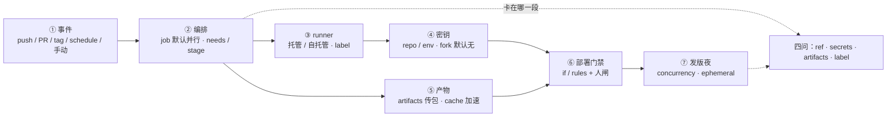
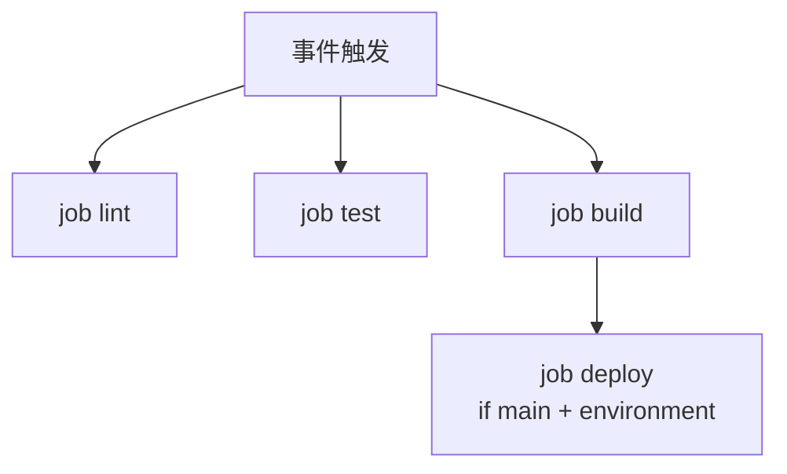
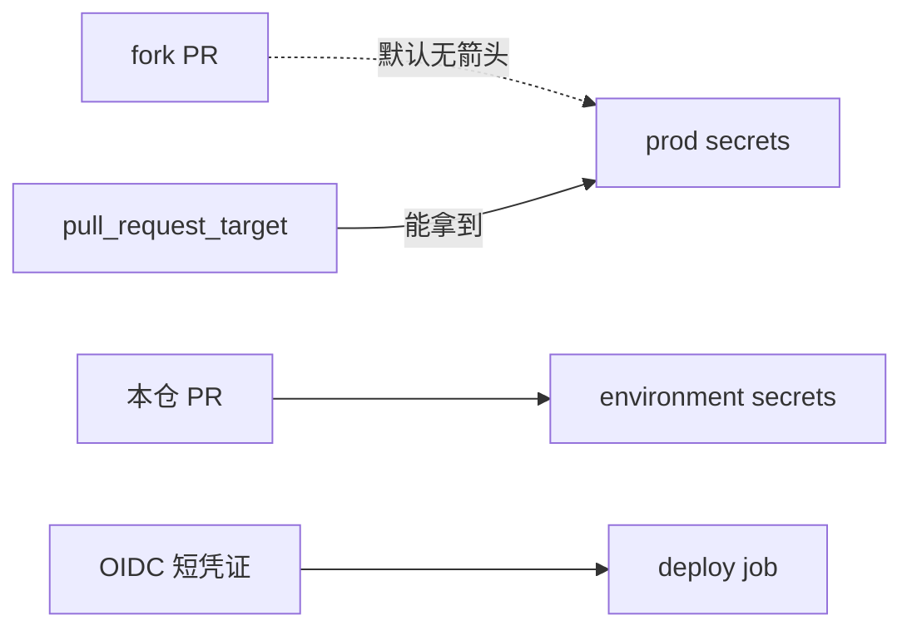
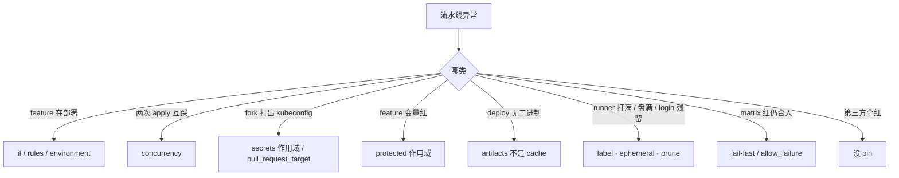

# GitHub Actions 与 GitLab CI

> fork 出来的 PR 把生产 kubeconfig 打进日志；feature 分支的 deploy 也在跑；开服夜 30 个 workflow 打满同一台 `self-hosted`，上一 job 的 `docker login` 还挂着——群里有人要「先 skip 再查」，手已经放在再点一次 manual 上。
> **本章回答**：一次流水线从事件进 YAML，到 job 上 runner、拿密钥、传产物、拦发版，会在哪几段漏钥、误部署、打满机器，现场怎么一眼定责。
> **不讲**：阶段设计、金丝雀 SLI、digest 晋升、DORA → [04](../04-CI-CD/)；Harbor、扫描、禁 latest → [03](../03-制品与镜像/)；Git 分支保护、revert → [01](../01-Git工作流/)；GitOps sync → [03-23](../../03-Kubernetes/23-GitOps-ArgoCD与Tekton/)；Jenkins Master 队列、K8s 弹性 Agent → [04](../04-CI-CD/)；开服冻结流程 → [08](../08-运维平台与Oncall/)。

**标记**：🎯重点 · 🔥难点 · ⭐常考 · 🔧实操

---

## 一、一张图：一次流水线的一生

> 🎯 **一句话**：事件进 YAML → job 上 runner → 密钥按作用域发 → 产物用 artifacts 传；排障先问「卡在哪一段」。



- 📖 **读图**
  - 🚪 没有箭头从 fork PR 指向 prod secrets——默认如此是特性，不是配错
  - 🛤️ 主线「事件 → 编排 → runner → 密钥/产物 → 门禁 → 发版夜」；值班四问照的是虚线那把刀（练习题 Q1、Q10、Q14）

三条焊死口诀（整章都对着它们）：

1. **分密钥**：fork 默认无生产 kubeconfig；`secrets` 不进 YAML
2. **分 runner**：prod/test label 分开，用完 ephemeral，清 `docker login`
3. **冻发版**：只有 main/tag 才 deploy；feature 只跑 CI

值班里怎么认现象（先看 pipeline UI，再对号入座）：

- 「feature 分支也在 deploy」→ `if:` / `rules` 漏了 → 三节
- 「fork PR 打出 kubeconfig」→ secrets 作用域或 `pull_request_target` → 四节
- 「deploy 找不到 ./server」→ artifacts 没传或过期 → 五节
- 「构建很快 deploy 没包」→ 把 cache 当产物 → 五节
- 「runner 盘满 / 30 个 job 排队」→ 自托管并发 + 残留 → 六节

---

## 二、入口：仓内 YAML 管什么

> 🎯 **一句话**：GHA / GitLab CI 是和 Git 仓长在一起的声明式 YAML；密钥不进 YAML，fork 默认无生产 kubeconfig。

- 🏭 **GHA / GitLab CI** = 仓内 YAML 声明「什么事件跑什么 job」；**Jenkins** = 独立服务器 + Groovy，适合混合 VM / 遗留插件（Master 队列见 [04](../04-CI-CD/)）
- 新建仓优先前者；已有 Jenkinsfile 不必一刀切迁走，但 **CD 仍只留一条**（digest 晋升见 04）

四个名词先钉死（GHA）——记一句：**workflow 编排，job 默认并行，step 串行，runner 落地**：

- **workflow** = 一份流程，YAML 在 `.github/workflows/`
- **job** = 一组步骤，默认互相并行，写 `needs` 才串行
- **step** = `run` 命令或 `uses` 一个 action
- **runner** = 执行环境；`runs-on` 选托管或自托管

GitLab 对应：**pipeline** ← **stages** ← **job**；脚本在 `script:`；复用是 `include` / template，不是 marketplace action。

| | GitHub Actions | GitLab CI |
|--|----------------|-----------|
| 串行 | `needs` | `stage` 顺序；同 stage 并行 |
| 产物 | `upload-artifact` | `artifacts`（过期要设） |
| 依赖缓存 | `actions/cache` | `cache`（≠ artifacts） |
| 人闸 | `environment` 审批 / `workflow_dispatch` | `when: manual` |
| 变量 | Secrets + Variables | masked + **protected** |

触发：`push` / PR / `schedule` / 手动 / `tag`。用 `paths` / `rules: changes` 挡「改 README 跑 40 分钟 E2E」——阶段怎么排是 [04](../04-CI-CD/) 的事，本章只焊触发条件。

> 💡 **打个比方**：workflow 像工厂总调度单；job 是各工位（默认同时开工）；runner 是工人站哪条产线；secrets 是保险柜钥匙——钥匙不能钉在调度单上。

> ⚠️ **别混**：GitLab 的 `cache` 和 `artifacts` 是两个字段；GHA 的 `actions/cache` 也不是 `upload-artifact`。口误会直接导致「构建绿、deploy 无包」。

> 📝 **面试**：⭐「CI 排障我先 ref → if/rules → secrets 作用域 → artifacts → runner label；fork 默认无 secrets 是特性不是 bug。」（Q1）

> ⭐ **记住**：口诀——**并行要 needs，密钥不进 YAML，fork 无 prod 钥。**

本节对应练习题 Q1。事件怎么进门、job 怎么排队——下一节。

---

## 三、编排：job 并行与 matrix 🔥⭐

> 🎯 **一句话**：job 默认并行；main 才 deploy 必须写 `if:` + environment，漏一行 feature 就上生产。

很多人会答「平台 bug，feature 不该有 deploy」——错了。根因往往是：**YAML 漏了 `if:` / `rules`**。

> 💡 **打个比方**：lint / test / build 是并行安检口；deploy 是登机口——必须查登机牌（`ref == main`），没查就让所有人上飞机。

#### ❓ 为什么不是「平台自动拦 feature」？

- ❌ **指望默认行为**：GHA 不会因为分支名含 `feature` 就跳过 deploy；GitLab 也不会
- ✅ **必须显式写**：GHA `if: github.ref == 'refs/heads/main'` + `environment`；GitLab `rules: [{ if: $CI_COMMIT_BRANCH == "main", when: manual }]`
- 🧾 **漏一行 = 全分支 deploy**：`needs: build` 只保证顺序，**不保证 ref**



- 📖 **读图**：lint / test / build 同级并行；deploy 挂在 build 后还要过 `if`——只写 `needs` 不够。

### 🎬 feature 上了 prod：现场走一遍

```yaml
# 漏了 if —— feature 也会跑
deploy:
  needs: build
  runs-on: ubuntu-latest
  environment: production
  steps:
    - env:
        KUBECONFIG: ${{ secrets.KUBECONFIG }}
      run: ./deploy.sh ${{ github.sha }}
```

```text
Workflow: CI
Ref: feature/room-match
Jobs:
  lint    ✓ 45s
  test    ✓ 1m12s
  build   ✓ 2m08s
  deploy  ✓ 38s          # ← 不应出现：YAML 漏 if，不是平台 bug
```

补上条件：

```yaml
deploy:
  needs: build
  if: github.ref == 'refs/heads/main'
  runs-on: ubuntu-latest
  environment: production
```

```text
Jobs:
  lint / test / build  ✓
  deploy  skipped (condition not met)   # ← feature 只 CI
```

### 🧩 matrix 与 fail-fast ⭐

```yaml
strategy:
  matrix:
    go: ["1.21", "1.22"]
  fail-fast: false
```

```text
test (go 1.21)  ✗  compile error
test (go 1.22)  ✓
Overall workflow: ✗ FAILED   # ← fail-fast false 只让其它维度跑完；job 仍应红，不能合 MR
```

- 🔑 **口径**
  - `fail-fast: false` ≠ 可以合红
  - `allow_failure` 不给扫描（扫描门禁见 03 / 04）
  - `max-parallel` 防打满自托管；path filter 公共库要列进 `changes`

> ⚠️ **别混**：`needs` / `stage` 管**顺序**；`if` / `rules` 管**谁能跑 deploy**。两者缺一不可。

> 📝 **面试**：⭐「job 默认并行，串行写 needs；deploy 必须 if main + environment；matrix fail-fast false 只让其它维度跑完，不能合红。」口诀——**fail-fast false ≠ 可以合红。**（Q1、Q5、Q6）

本节对应练习题 Q1、Q5、Q6。编排对了，密钥谁能拿到？

---

## 四、密钥：fork 为什么不该有 kubeconfig 🔥⭐

> 🎯 **一句话**：fork PR 默认读不到 secrets 是防投毒；`pull_request_target` 能拿到，默认不要用。

#### ❓ 为什么默认读不到——不是配错了？

- 👻 **若 fork 默认可读**：外部贡献者改一行 `echo` 就能把生产 kubeconfig 打出去
- ✅ **默认读不到 = 特性**：本仓 PR 按 environment 审批领；fork 进不了金库
- 🔥 **`pull_request_target`**：workflow 在**本仓上下文**跑 → 能拿 secrets → 等于「把路人请进金库帮忙整理文件」

> 💡 **打个比方**：secrets 像银行金库钥匙——自家员工（本仓 PR）按审批领；路人（fork）默认进不了。`pull_request_target` 像把路人请进金库。



- 📖 **读图**：虚线 = fork 默认碰不到 prod；实线 `pull_request_target` 才是投毒面。OIDC 给 deploy 短凭证，比长期 kubeconfig 好收。

### 🎬 fork 试图 echo：现场走一遍

```yaml
on: pull_request
jobs:
  evil:
    runs-on: ubuntu-latest
    steps:
      - run: echo "${{ secrets.KUBECONFIG }}" | base64
```

```text
Run echo "***" | base64
***                         # ← 脱敏或未注入；fork + pull_request 无内容 = 正常
```

若改成：

```yaml
on: pull_request_target
```

```text
Run echo "apiVersion: v1..." | base64
apiVersion: v1
kind: Config
...                         # ← 能拿到 secrets：投毒面
```

GitLab 侧，feature 读 **protected** 变量：

```text
$ deploy.sh
ERROR: variable KUBECONFIG_PROD is not available
Protected variables only available on protected branches
# ← 作用域，不是 YAML 写错
```

- 🔑 **焊死清单**
  - 密钥放 Settings → Secrets；按 environment 拆 staging / prod
  - 泄漏：Settings 改值 + IAM disable；日志 `***` 脱敏 ≠ 安全——**echo 到文件 / 镜像层仍漏**
  - 禁止 `permissions: write-all`
  - 自托管跑 fork = **内网任意代码执行**

> ⚠️ **别混**：GHA `***` 脱敏只挡日志展示；GitLab **protected** 变量只在保护分支——feature 读不到是作用域，别先改 YAML。

> 📝 **面试**：⭐「fork 默认无 secrets 是防投毒；泄漏先 rotate 源头凭证；pull_request_target 和自托管跑 fork 都是高危，默认不用。」口诀——**fork 无钥是特性；target 能拿钥别用。**（Q2、Q11）

本节对应练习题 Q2、Q8、Q11。密钥对了，包怎么传到 deploy？

---

## 五、产物：cache vs artifacts 🔥⭐

> 🎯 **一句话**：cache 加速依赖、丢了再下；artifacts 是 job 间传递的构建产物，没声明 deploy 就没有包。

build 和 deploy 是两个 job，默认**不共享 workspace**。把二进制塞进 cache，deploy **读不到**——高频错答。

#### ❓ 为什么 cache 不能当传包？

- 🗄️ **cache** = 加速可重建依赖（`go mod`、`node_modules`）；key 未命中就重下；**不保证**下游 job 能读到文件
- 📦 **artifacts** = 必须声明的产物托盘：`upload-artifact` / GitLab `artifacts: paths`；下游 `download` 才能拿到
- ⏱️ **过期也会挂**：`retention-days: 1` ↔ GitLab `expire_in: 1 day`

> 💡 **打个比方**：cache 像工位抽屉里的备用螺丝（丢了再买）；artifacts 像装配线托盘上的成品——deploy 工位必须收到这个托盘。

### 🎬 deploy 找不到 ./server

```yaml
build:
  runs-on: ubuntu-latest
  steps:
    - uses: actions/cache@v4
      with:
        path: ~/go/pkg/mod
        key: ${{ runner.os }}-go-${{ hashFiles('**/go.sum') }}
    - run: go build -o server .
    # ← 只写了 cache，没 upload-artifact
```

```yaml
deploy:
  needs: build
  if: github.ref == 'refs/heads/main'
  steps:
    - run: ./deploy.sh ./server
```

```text
Run ./deploy.sh ./server
./deploy.sh: line 3: ./server: No such file or directory
Error: Process completed with exit code 127.
# ← job 间不共享 workspace；cache ≠ artifact
```

修好：build `upload-artifact`（`retention-days: 1`），deploy `download-artifact`：

```text
Uploading server (18.2 MB)
Downloaded server-bin
Deploying sha abc123f to production ...
```

- 🔑 **注意**
  - cache `key` 用 os + `hashFiles`；太粗会 **cache poisoning**
  - GitLab `cache.key: ${CI_COMMIT_REF_SLUG}` 按分支
  - 镜像 tar 进 Harbor（[03](../03-制品与镜像/)），别当无限 artifacts

> ⚠️ **别混**：cache 加速、artifacts 传包——口诀一字不差。构建很快但 deploy 没包，先查 upload / expire，别先查 runner。

> 📝 **面试**：⭐「cache 加速依赖，artifacts 传产物；deploy 找不到文件先看 upload/download 和 expire_in。」（Q4）

本节对应练习题 Q4。包有了，跑在谁家机器上？

---

## 六、执行器：自托管与发版夜 🔥⭐

> 🎯 **一句话**：自托管为进内网；prod/test label 分开，fork 不上 prod runner，ephemeral 用完销毁；发版夜靠 concurrency 互斥。

开头那个现场——30 个 workflow 打一台、上一 job 的 `docker login` 还在——根因就在这儿。

#### ❓ 为什么要用 ephemeral，不只靠 job 末尾 rm？

- 🧹 **job 末尾 `rm -rf`**：人忘了就漏；`docker login`、overlay、workspace 残留
- ✅ **ephemeral** = 用完销毁整个 runner（常是 Pod）——凭证、容器、workspace 一起带走
- 🏷️ **label 拆开**：`[self-hosted, prod, ephemeral]` vs test；**fork 不上 prod**

> 💡 **打个比方**：自托管像公司内网专用工位——能访问 Harbor / K8s；不清理就像下班忘退 docker login，下一班直接用你的 Harbor 账号。

### 🎬 开服夜打满

```bash
cd /actions-runner && ./run.sh --check
df -h /actions-runner/_work
docker ps -a | head
```

```text
Listening for Jobs
Runner: prod-build-01 · Status: Busy (3 jobs queued)
/dev/sda1  100G  97G  0G  100% /actions-runner/_work   # ← cache + overlay + 未 prune
CONTAINER ID  IMAGE  COMMAND  CREATED
a1b2c3d4      ...    ...      2 hours ago               # ← 上一 job 未清理，login 可能残留
```

```text
Queued: 27 workflows waiting for runner prod-build-01
```

焊：`concurrency`（`cancel-in-progress: true`）+ `runs-on: [self-hosted, prod, ephemeral]`：

```yaml
concurrency:
  group: prod-deploy
  cancel-in-progress: true
jobs:
  deploy:
    runs-on: [self-hosted, prod, ephemeral]
    environment: production
```

```text
Job completed · Runner pod terminated (ephemeral)
# ← 新 run 进同组会取消旧 deploy；runner Pod 销毁清 login
```

- 🔑 **发版夜清单**
  - `concurrency` 互斥 deploy，别再点一次 manual
  - 关窗口内 schedule GC；cache 可预热
  - 托管 runner 进不了内网；GitLab `privileged` / DinD 默认关
  - `_work` 盘满 → `docker system prune` / ephemeral；冻结窗口流程见 [08](../08-运维平台与Oncall/)，本章焊的是 **YAML concurrency**

> ⚠️ **别混**：08 管「冻结窗口允不允许人点」；本章管「点了会不会两路 apply 互踩」——`workflow_dispatch` 仍能在冻结窗口点出去 = 本章没焊死 concurrency / 人闸。

> 📝 **面试**：⭐「自托管为内网；prod/test label 分开，fork 不上 prod；发版夜 concurrency 互斥，ephemeral 防残留和 docker login。」口诀——**prod label 不跑 fork；用完销毁清 login。**（Q3、Q9）

本节对应练习题 Q3、Q9。机制齐了——落地 YAML 怎么焊。

---

## 七、落地：把第三节的坑焊进 YAML

> 🎯 **一句话**：新仓 YAML；密钥按 environment 拆；deploy 必须 if/rules + 人闸；action pin SHA/tag。

### 🧭 生产怎么选

- 新仓 → GHA / GitLab CI；**不**一刀切迁已验证的 Jenkinsfile
- 密钥 → environment 拆 + OIDC；**不** YAML 明文、长期 AK、fork 可读 prod
- runner → prod/test label + ephemeral；**不**一台 self-hosted 跑全部含 fork
- 部署 → `if:` / `rules` + 人闸；**不**所有分支 `kubectl apply`
- action → pin tag 或 SHA；**不** `uses: ...@main`
- 发版夜 → concurrency + 冻 schedule；**不**窗口里 GC 镜像

### 📄 你实际看到的 YAML

```yaml
# .github/workflows/ci.yml
name: CI
on:
  push: { branches: [main] }
  pull_request:
  schedule:
    - cron: "0 2 * * *"
  workflow_dispatch:

jobs:
  build:
    runs-on: ubuntu-latest
    steps:
      - uses: actions/checkout@v4
      - uses: actions/setup-go@v5
        with: { go-version: "1.22" }
      - uses: actions/cache@v4
        with:
          path: ~/go/pkg/mod
          key: ${{ runner.os }}-go-${{ hashFiles('**/go.sum') }}
      - run: go test ./...
      - run: docker build -t harbor.example.com/app:${{ github.sha }} .
      - uses: actions/upload-artifact@v4
        with:
          name: server-bin
          path: server
          retention-days: 1

  deploy:
    needs: build
    if: github.ref == 'refs/heads/main'
    runs-on: ubuntu-latest
    environment: production
    steps:
      - uses: actions/download-artifact@v4
        with: { name: server-bin }
      - env:
          KUBECONFIG: ${{ secrets.KUBECONFIG }}
        run: ./deploy.sh ${{ github.sha }}
```

```yaml
# .gitlab-ci.yml（节选）
build:
  stage: build
  script: [go build -o server ., docker build -t game-server:$CI_COMMIT_SHA .]
  artifacts: { paths: [server], expire_in: 1 day }
  cache: { key: ${CI_COMMIT_REF_SLUG}, paths: [go-pkg/] }
deploy:
  stage: deploy
  script: ./deploy.sh $CI_COMMIT_SHA
  rules: [{ if: $CI_COMMIT_BRANCH == "main", when: manual }]
  environment: { name: production }
```

```text
# feature 分支
build   ✓ 2m14s
# deploy skipped / 不出现

# GitLab main 合并后
build ✓ · test ✓ · deploy（manual）待点击
```

- ✅ **验收**：feature 无 deploy；fork 无 prod secrets；artifacts 有 paths + 过期；tag 发布另写 job，仍同一 digest 晋升（04 / 03）
- 🧷 **include / 第三方 action** = 在你的 runner 上跑别人的代码；公共模板 pin 版本（和 Jenkins Shared Library 同一类事故）

### 📋 改 YAML 前检查单

| 项 | 生产怎么用 | 改错会怎样 |
|----|------------|------------|
| `if:` / `rules` | 仅 main（或 tag）deploy | feature 上生产 |
| `environment` | prod 审批人 | 密钥环境混用 |
| `permissions` | 最小；禁 `write-all` | GITHUB_TOKEN 过宽 |
| cache `key` | os + hashFiles | 永不命中 / poisoning |
| `artifacts.expire_in` | 必须写 | 盘满；过期 deploy 无文件 |
| `fail-fast: false` | 只让矩阵跑完 | 拿来合红 = 跳过门禁 |
| `concurrency` | 发版夜同组取消旧 run | 两次 apply 互踩 |
| action `uses` | pin SHA / tag | marketplace 一更新全仓变 |
| `pull_request_target` | 默认不用 | fork 拿到 secrets |
| GitLab `protected` | 仅保护分支 | 误判 YAML 写错 |

> ⭐ **记住**：cache 加速、artifacts 传产物；protected 只在保护分支；main 部署用 rules + manual。

本节对应练习题 Q5、Q7、Q12、Q13。

---

## 八、作战：定责

> 🎯 **一句话**：先分叉——部署面 / 密钥面 / 产物与执行器；YAML 漏 if 不是加 runner 能修的。



- 📖 **读图**：先问「哪一类」，再进对应叶子——部署面别先加机器，密钥面别当脱敏没事，产物面别把 cache 当包。

| 现象 | 先做什么 | 不要做什么 |
|------|----------|------------|
| feature 上了 prod | `if:` / `rules` / environment | 先加 runner |
| fork 打出 kubeconfig | secrets、`pull_request_target` | 当日志脱敏就没事 |
| deploy 找不到产物 | artifacts 声明 / 过期 | 把 cache 当二进制 |
| 自托管打满 / 密码残留 | label、ephemeral、OIDC | 长期 docker login |
| matrix 一个红仍合入 | job 必须红 | 拿 fail-fast false 当成功 |
| 改文档跑 40 分钟 E2E | paths / changes | 先买 runner |
| 发版夜两个 deploy | concurrency | 再点一次 manual |

### 60 秒剧本 🔧

> 🔍 **现场**：接到「流水线怪了 / 密钥漏了 / 发版互踩」，60 秒走完四问再下刀。

```text
① 0–10s   这条 run 的 ref 是不是 main？deploy 的 if / rules 是什么？
② 10–30s  secrets 来自哪个 environment？有没有 pull_request_target / fork？
③ 30–45s  artifacts 声明了吗？有没有把 cache 当产物？
④ 45–60s  runner label：prod 还是 test？ephemeral？Busy / 盘满？
```

- ✅ 群里喊「再点一次 manual」→ 查 concurrency，不是再点。

本节对应练习题 Q10、Q14。

---

## 九、收口

### 命令速查 🔧

```bash
# 值班四问（平台在 UI，机器上看 runner）
# 1) Actions / Pipelines UI：Ref、deploy 是否 skipped、environment
# 2) Settings → Secrets / Variables：environment、protected、有无 pull_request_target
# 3) build job：upload-artifact / artifacts paths + expire_in
# 4) 自托管机：
cd /actions-runner && ./run.sh --check
df -h /actions-runner/_work
docker ps -a | head
docker logout          # job 结束清 login；更好用 ephemeral
```

### 面试锚点

| 问 | 30 秒答 |
|----|---------|
| GHA 四个名词？job 怎么并行？ | workflow / job / step / runner；job 默认并行，`needs` 才串行；deploy 另写 if + environment。 |
| fork 为什么没有 secrets？ | 防投毒；默认如此是特性。`pull_request_target` 能拿钥，默认不用。 |
| cache vs artifacts？ | cache 加速可重建依赖；artifacts 传构建产物。deploy 找不到包先查 upload/expire。 |
| 自托管为什么要、怎么焊？ | 进内网；prod/test label 分开，fork 不上 prod，ephemeral 清残留。 |
| matrix 一个红怎么办？ | job 必须红；fail-fast false 只让其它维度跑完，不能合红。 |
| 发版夜怎么焊？ | concurrency 互斥 deploy + manual/environment + prod label；和 08 冻结分工：08 管窗口，本章管 YAML。 |
| 第三方 action？ | pin tag/SHA；`@main` 一更新全仓变；等于在 runner 上跑别人的代码。 |
| GitLab protected 读不到？ | 作用域，仅保护分支；不是 YAML 写错。 |

### 易错一句话对照

- job 默认按 YAML 从上到下串行 → 默认并行，`needs` / stage 才串行
- fork 没有 secrets 是配错了 → 防投毒；默认如此
- `pull_request_target` 方便 fork CI → 能拿到 secrets，默认不要用
- cache 可以给 deploy 传二进制 → artifacts 才是产物
- protected 变量 feature 读不到就是 YAML 错 → 作用域
- `fail-fast: false` 就可以合红 → 只让其它维度跑完，job 仍应失败
- `allow_failure` 给扫描 job → 等于扫描不是门禁
- 自托管一台跑 prod、test、fork → label 分开；fork 不上 prod
- 第三方 action 跟 `@main` → pin tag/SHA
- 新仓必须把 Jenkins 全迁走 → 遗留/混合可留；CD 仍一条
- 发版夜可以并行两个 prod apply → concurrency 互斥
- 日志脱敏了 echo 到文件就没事 → 文件 / 镜像层仍会漏
- `permissions: write-all` 省事 → GITHUB_TOKEN 过宽
- path filter 漏了公共库没关系 → 依赖方不测
- 再点一次 manual 能救急 → 先查 concurrency，别两路 apply

### 数字墙

> GitLab artifacts `expire_in` 常见 **1 day**（GHA `retention-days: 1`）；cron 例子 `0 2 * * *`；checkout `@v4` 高敏感仓仍建议 pin SHA；开服夜单 runner 无 concurrency 时队列可到 **几十** 个 workflow。

---

## 合上书

- [ ] **默画主图**：事件 → YAML → runner → secrets / artifacts → 门禁 → 发版夜；标出 fork 默认无箭头指向 prod secrets（Q1、Q14）
- [ ] **口述名词**：workflow / job / step / runner？job 怎么并行、怎么才 deploy？（Q1、Q5）
- [ ] **口述密钥**：fork 为什么默认没有 secrets？`pull_request_target` 为什么危险？（Q2、Q11）
- [ ] **口述产物**：artifacts 和 cache 差在哪？protected 变量呢？（Q4、Q8）
- [ ] **口述 runner**：自托管为什么要、有什么坑？ephemeral 解决什么？（Q3、Q9）
- [ ] **口述门禁**：matrix 失败一个该不该红？action 不 pin 会怎样？（Q6、Q7）
- [ ] **口述发版夜**：concurrency / manual / runner label 怎么焊？和 08 冻结怎么分工？（Q9、Q10、Q13、Q14）

七条都能口述，这一章就过了——开头那个 fork 打出 kubeconfig、feature 在 deploy 的现场，你现在能拦住他了。门禁卡什么、digest 怎么晋升 → [04](../04-CI-CD/)；镜像扫描和禁 latest → [03](../03-制品与镜像/)。
