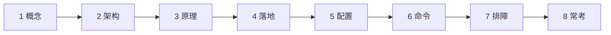
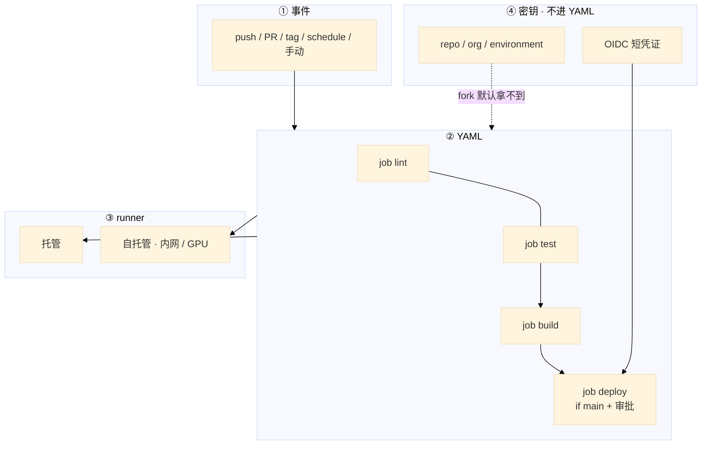
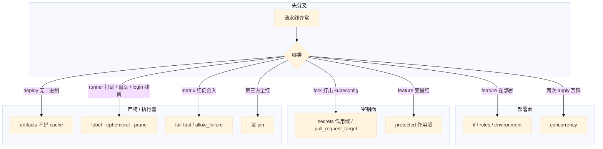

# GitHub Actions 与 GitLab CI



fork 出来的 PR 把生产 kubeconfig 跑进日志了。feature 分支的 deploy job 也在跑。开服夜 30 个 workflow 同时打到同一台 `self-hosted`，上一 job 的 `docker login` 还在，Harbor 凭证挂在 runner 磁盘上。

**本章主线（排障就按这三步想）：**

1. **分密钥**：fork PR 默认无生产 kubeconfig；`secrets` 不进 YAML。
2. **分 runner**：自托管隔离、发版夜 concurrency，用完清 `docker login`。
3. **冻发版**：只有 main/tag 才 deploy；feature 只跑 CI。

**读完你能：** 白板上画出事件 → job → runner → secrets；fork PR 能判断该不该有密钥；会 cache vs artifacts、matrix 失败口径、发版值班 concurrency。

## 本章目录

- [1. 基本概念](#1-基本概念)
- [2. 架构图](#2-架构图)
- [3. 原理](#3-原理)
- [4. 落地](#4-落地)
- [5. 核心配置](#5-核心配置)
- [6. 命令与操作](#6-命令与操作)
- [7. 生产排障](#7-生产排障)
- [8. 必会 · 常考](#8-必会--常考)
- [合上书](#合上书问自己)

**本章不讲：** 阶段设计、金丝雀 SLI、digest 晋升、DORA → [04](../04-CI-CD/)；Harbor、扫描、禁 latest → [03](../03-制品与镜像/)；Git 分支保护、revert → [01](../01-Git工作流/)；GitOps sync → [03-23](../../03-Kubernetes/23-GitOps-ArgoCD与Tekton/)；Jenkins Master 队列、K8s 弹性 Agent 细节 → [04](../04-CI-CD/)；开服冻结流程、升级路径 → [08](../08-运维平台与Oncall/)。

---

## 1. 基本概念

GitHub Actions 和 GitLab CI 都是 **和 Git 仓长在一起的声明式 YAML**。Jenkins 是独立服务器 + Groovy。新建仓优先前者；混合 VM / 遗留插件才留 Jenkins（对照见 02，这里不展开 Master 队列）。

**值班里怎么认现象**（先看 pipeline UI，再对表）：

| UI / 群里说的 | 技术含义 | 你的第一刀 |
|---------------|----------|------------|
| 「feature 分支也在 deploy」 | `if:` / `rules` 漏了 | deploy job 的 ref 条件 |
| 「fork PR 打出 kubeconfig」 | secrets 作用域或 `pull_request_target` | 事件类型 + secrets 来源 |
| 「deploy 找不到 ./server」 | artifacts 没传或过期 | build job 的 upload/artifacts |
| 「构建很快 deploy 没包」 | 把 cache 当产物 | cache vs artifacts |
| 「runner 盘满 / 30 个 job 排队」 | 自托管并发 + 残留 | label、ephemeral、prune（07） |

四个名词（GHA）：

| 概念 | 是什么 |
|------|--------|
| **workflow** | 一个流程，YAML 在 `.github/workflows/` |
| **job** | 一组步骤，默认互相并行，`needs` 才串行 |
| **step** | `run` 命令或 `uses` 一个 action |
| **runner** | 执行环境；`runs-on` |

GitLab 对应：pipeline ← stages ← job；脚本在 `script:`；复用是 `include` / template，不是 marketplace action。

触发：push / PR / schedule / 手动 / tag。不要把 02 的「E2E 后置到 staging」整段搬来——那是设计；这里用 `paths` / `rules: changes` 落地。

**打个比方**：workflow 像工厂总调度单；job 是各工位（默认同时开工）；runner 是工人站哪条产线；secrets 是保险柜钥匙——钥匙不能钉在调度单上（YAML）。

> **记住**：job 默认并行，要串行必须写 `needs` 或 stage。密钥不进 YAML；fork PR 默认不该拿到生产 kubeconfig。

**面试怎么说**：「CI 排障我先 ref → if/rules → secrets 作用域 → artifacts → runner label；fork 默认无 secrets 是特性不是 bug。」

---

## 2. 架构图

后面密钥、runner、发版值班都对着这张图。



**读图三句话：**

1. **没有箭头从 fork PR 指向 prod secrets**——默认如此是特性。
2. **deploy 必须有 if/rules + environment / manual**——YAML 漏一行，feature 就上生产。
3. **产物走 artifacts，依赖加速走 cache**——口误会让 deploy 找不到二进制。

GHA vs GitLab 对照：

| | GitHub Actions | GitLab CI |
|--|----------------|-----------|
| 串行 | `needs` | `stage` 顺序；同 stage 并行 |
| 产物 | `upload-artifact` | `artifacts`（过期要设） |
| 依赖缓存 | `actions/cache` | `cache`（和 artifacts 不是一回事） |
| 人闸 | `environment` 审批 / `workflow_dispatch` | `when: manual` |
| 变量 | Secrets + Variables | masked + **protected** |

常见组合：仓内 YAML 跑 lint / 单测 / build；重型 Ansible / 多系统编排仍走 Jenkins；落地 GitOps。本章负责 YAML 和 runner 不把密钥漏出去；02 负责门禁和 digest 晋升。CD 仍只留一条。

---

## 3. 原理

### 3.1 job 依赖与 matrix：feature 为什么上了 prod

**一句话：** job 默认并行；main 才 deploy 必须写 `if:` + environment，漏一行 feature 就上生产。

**打个比方**：流水线像并行安检口——lint、test、build 默认同时开；deploy 是登机口，必须查登机牌（ref == main），没查就让所有人上飞机。

**现场走一遍**（游戏服仓，feature 分支意外触发了 prod deploy）：

1. 打开 `.github/workflows/ci.yml`，deploy 段原来漏了 `if:`：

```yaml
deploy:
  needs: build
  runs-on: ubuntu-latest
  environment: production
  steps:
    - env:
        KUBECONFIG: ${{ secrets.KUBECONFIG }}
      run: ./deploy.sh ${{ github.sha }}
```

2. 开发者 push 到 `feature/room-match` 后，Actions UI 显示：

```text
Workflow: CI
Ref: feature/room-match
Jobs:
  lint    ✓ 45s
  test    ✓ 1m12s
  build   ✓ 2m08s
  deploy  ✓ 38s          ← 不应出现
```

3. 补上条件后重新 push：

```yaml
deploy:
  needs: build
  if: github.ref == 'refs/heads/main'
  runs-on: ubuntu-latest
  environment: production
```

4. feature 分支再次运行：

```text
Jobs:
  lint    ✓
  test    ✓
  build   ✓
  deploy  skipped (condition not met)
```

5. matrix 场景——Go 1.21 / 1.22 并行，1.21 失败：

```yaml
strategy:
  matrix:
    go: ["1.21", "1.22"]
  fail-fast: false
```

```text
test (go 1.21)  ✗  compile error
test (go 1.22)  ✓
Overall workflow: ✗ FAILED
```

**输出解读：**

| 行 | 含义 |
|----|------|
| deploy ✓ on feature | **YAML 漏 if**，不是平台 bug |
| deploy skipped | `if` 生效，feature 只 CI |
| fail-fast: false + 整体 FAILED | 其它维度跑完，**job 仍应红**，不能合 MR |

step 串行、job 默认并行；GitLab 用 `stage`。`allow_failure` 不给扫描（03/02）。`max-parallel` 防打满自托管；path filter 公共库要列进 `changes`。

**面试怎么说**：「job 默认并行，串行写 needs；deploy 必须 if main + environment 审批；matrix fail-fast false 只让其它维度跑完，不能合红。」

> **记住**：main 才 deploy 写在 `if:` + environment；YAML 漏了这一行，feature 就会上生产。

### 3.2 密钥作用域：fork PR 为什么不该有 kubeconfig

**一句话：** fork PR 默认读不到 secrets 是防投毒；`pull_request_target` 能拿到，默认不要用。

**打个比方**：secrets 像银行金库钥匙——自家员工（本仓 PR）按审批领；路人（fork PR）默认进不了金库。`pull_request_target` 像「把路人请进金库帮忙整理文件」——方便但极危险。

**现场走一遍**（外部贡献者 fork 了游戏服仓）：

1. fork 者改 workflow，试图 echo 密钥：

```yaml
on: pull_request
jobs:
  evil:
    runs-on: ubuntu-latest
    steps:
      - run: echo "${{ secrets.KUBECONFIG }}" | base64
```

2. GitHub 托管 runner 上运行，日志显示：

```text
Run echo "***" | base64
***
```

3. 确认 secrets 未注入（空或不可用）——**正常**。若改用：

```yaml
on: pull_request_target
```

4. 同一 echo，日志可能显示：

```text
Run echo "apiVersion: v1..." | base64
apiVersion: v1
kind: Config
...
```

5. GitLab 侧，feature 分支读 protected 变量：

```text
$ deploy.sh
ERROR: variable KUBECONFIG_PROD is not available
Protected variables only available on protected branches
```

**输出解读：**

| 现象 | 含义 |
|------|------|
| GHA `***` 脱敏 | secrets 存在但日志屏蔽；**echo 到文件仍漏** |
| fork + `pull_request` 无内容 | 默认读不到 secrets，**特性** |
| `pull_request_target` 有内容 | 能拿到 secrets，**投毒面** |
| GitLab protected 报错 | feature 读不到是**作用域**，不是 YAML 写错 |

密钥在 Settings → Secrets；按环境拆 staging/prod。泄漏：Settings 改值 + IAM disable。禁止 `permissions: write-all`。自托管跑 fork = 内网任意代码执行。

**面试怎么说**：「fork 默认无 secrets 是防投毒；泄漏先 rotate 源头凭证；pull_request_target 和自托管跑 fork 都是高危，默认不用。」

> **记住**：fork PR 默认无 secrets 是特性不是 bug；`pull_request_target` 和自托管上跑 fork 代码都是投毒面。

### 3.3 cache vs artifacts：deploy 找不到二进制

**一句话：** cache 加速依赖、丢了再下；artifacts 是 job 间传递的构建产物，没声明 deploy 就没有包。

**打个比方**：cache 像工位抽屉里的备用螺丝（丢了再买）；artifacts 像装配线托盘上的成品（deploy 工位必须收到这个托盘，否则没东西装车）。

**现场走一遍**（build 用了 cache，deploy 找 `./server` 失败）：

1. build job 只写了 cache，没 upload-artifact：

```yaml
build:
  runs-on: ubuntu-latest
  steps:
    - uses: actions/cache@v4
      with:
        path: ~/go/pkg/mod
        key: ${{ runner.os }}-go-${{ hashFiles('**/go.sum') }}
    - run: go build -o server .
```

2. deploy job：

```yaml
deploy:
  needs: build
  if: github.ref == 'refs/heads/main'
  steps:
    - run: ./deploy.sh ./server
```

3. deploy 日志：

```text
Run ./deploy.sh ./server
./deploy.sh: line 3: ./server: No such file or directory
Error: Process completed with exit code 127.
```

4. build 加 `upload-artifact`（`retention-days: 1`），deploy 加 `download-artifact`，成功输出：

```text
Uploading server (18.2 MB)
...
Downloaded server-bin
Deploying sha abc123f to production ...
```

**输出解读：**

| 字段 | 含义 |
|------|------|
| exit 127 | 文件不存在——**job 间不共享 workspace** |
| cache 不能替代 artifact | cache 是加速，不保证下游能读到文件 |
| `retention-days: 1` | 对应 GitLab `expire_in: 1 day`，过期 deploy 也会失败 |

cache `key` 用 os + hashFiles；太粗会 **cache poisoning**。GitLab `cache.key: ${CI_COMMIT_REF_SLUG}` 按分支。镜像 tar 进 Harbor（03），别当无限 artifacts。

**面试怎么说**：「cache 加速依赖，artifacts 传产物；deploy 找不到文件先看 upload/download 和 expire_in，别把 cache 当二进制。」

### 3.4 自托管 runner：开服夜 30 个 workflow 打满

**一句话：** 自托管为进内网；prod/test label 分开，fork 不上 prod runner，ephemeral 用完销毁。

**打个比方**：自托管 runner 像公司内网机房的专用工位——能访问 Harbor 和 K8s，但谁都能在上面跑脚本；不清理就像下班忘退 docker login，下一班工人直接用你的 Harbor 账号。

**现场走一遍**（开服夜唯一 self-hosted 被打满）：

1. 查看 runner 状态（自托管机）：

```bash
cd /actions-runner && ./run.sh --check
df -h /actions-runner/_work
docker ps -a | head
```

2. 屏幕出现：

```text
Listening for Jobs
Runner: prod-build-01 · Status: Busy (3 jobs queued)
/dev/sda1  100G  97G  0G  100% /actions-runner/_work
CONTAINER ID  IMAGE  COMMAND  CREATED
a1b2c3d4      ...    ...      2 hours ago
```

3. 30 个 workflow 并发，队列 UI：

```text
Queued: 27 workflows waiting for runner prod-build-01
Running: build-room-3, build-lobby, build-match ...
```

4. 加 `concurrency`（`cancel-in-progress: true`）、`runs-on: [self-hosted, prod, ephemeral]`，job 结束 ephemeral runner 日志：

```text
Job completed · Runner pod terminated (ephemeral)
```

**输出解读：**

| 字段 | 含义 |
|------|------|
| Busy + 27 queued | 单 runner 无 `max-parallel` / concurrency 限流 |
| 盘 100% | build cache + overlay（07）+ 未 prune |
| docker 容器 2h 前 | 上一 job 未清理，**login 可能残留** |
| ephemeral terminated | 比 job 末尾 `rm -rf` 更干净 |

托管 runner 进不了内网；fork PR 不上 prod runner。GitLab runner 同理，`privileged`/DinD 默认关。磁盘满见 07。

**面试怎么说**：「自托管为内网；prod/test label 分开，fork 不上 prod runner；发版夜 concurrency 互斥 deploy，ephemeral 防残留和 docker login。」

> **记住**：自托管是为了进内网；prod 和测试分开，fork 代码不要上 prod runner，用完销毁。

---

## 4. 落地

### 4.1 生产怎么选

| 项 | 选 | 不选 |
|----|----|------|
| 新仓 | GHA / GitLab CI | 一刀切迁走已验证的 Jenkinsfile |
| 密钥 | environment 拆 + OIDC | YAML 明文、长期 AK、fork 可读 prod |
| runner | prod/test label 分开，ephemeral | 一台 self-hosted 跑全部含 fork |
| 部署 | `if:` / `rules` + 人闸 | 所有分支 kubectl apply |
| action | pin tag 或 SHA | `uses: ...@main` |
| 发版夜 | concurrency + 冻结 workflow | schedule 在窗口里 GC 镜像 |

新建、在 GitHub / GitLab 上、想免养 CI 服务器 → Actions / GitLab CI。已有 Jenkinsfile、遗留插件、混合 VM → 继续 Jenkins。可以 YAML 做 CI、Jenkins 做重型 job，但不要双 apply。

### 4.2 YAML 落地你实际看到什么

```yaml
# .github/workflows/ci.yml
name: CI
on:
  push: { branches: [main] }
  pull_request:
  schedule:
    - cron: "0 2 * * *"
  workflow_dispatch:

jobs:
  build:
    runs-on: ubuntu-latest
    steps:
      - uses: actions/checkout@v4
      - uses: actions/setup-go@v5
        with: { go-version: "1.22" }
      - uses: actions/cache@v4
        with:
          path: ~/go/pkg/mod
          key: ${{ runner.os }}-go-${{ hashFiles('**/go.sum') }}
      - run: go test ./...
      - run: docker build -t harbor.example.com/app:${{ github.sha }} .

  deploy:
    needs: build
    if: github.ref == 'refs/heads/main'
    runs-on: ubuntu-latest
    environment: production
    steps:
      - env:
          KUBECONFIG: ${{ secrets.KUBECONFIG }}
        run: ./deploy.sh ${{ github.sha }}
```

```yaml
# .gitlab-ci.yml（节选）
build:
  stage: build
  script: [go build -o server ., docker build -t game-server:$CI_COMMIT_SHA .]
  artifacts: { paths: [server], expire_in: 1 day }
  cache: { key: ${CI_COMMIT_REF_SLUG}, paths: [go-pkg/] }
deploy:
  stage: deploy
  script: ./deploy.sh $CI_COMMIT_SHA
  rules: [{ if: $CI_COMMIT_BRANCH == "main", when: manual }]
  environment: { name: production }
```

验收输出：

```text
# GitHub Actions（feature 分支）
build   ✓ 2m14s
# deploy job 被 if 跳过

# GitLab main 合并后
build ✓ · test ✓ · deploy（manual）待点击
```

验收：feature 分支没有 deploy；fork PR 没有 prod secrets；`artifacts` 声明了 paths 和过期。tag 发布：`on.push.tags` / `CI_COMMIT_TAG` 另写 job，仍要同一 digest 晋升（02 / 03）。

---

## 5. 核心配置

只动有证据的项。

| 项 | 生产怎么用 | 改错会怎样 |
|----|------------|------------|
| `if:` / `rules` | 仅 main（或 tag）deploy | feature 上生产 |
| `environment` | prod 审批人 | 密钥环境混用 |
| `permissions` | 最小；禁止 `write-all` | GITHUB_TOKEN 过宽 |
| cache `key` | os + hashFiles | 永不命中或串环境 / poisoning |
| `artifacts.expire_in` | 必须写 | 磁盘满；过期后 deploy 无文件 |
| `fail-fast: false` | 只让矩阵跑完 | 拿来合红 = 跳过门禁 |
| `concurrency` | 发版夜同组取消旧 run | 两次 apply 互踩 |
| action `uses` | pin SHA / tag | marketplace 一更新全仓变 |
| `pull_request_target` | 默认不用 | fork 拿到 secrets |
| GitLab `protected` | 仅保护分支 | 误判 YAML 写错 |

include / 扩展：公共模板 pin 版本，和 Jenkins Shared Library 同一类事故（不 pin 全红）。第三方 action = 在你的 runner 上跑别人的代码。生产只引内部或审计过的。

> **记住**：cache 加速、artifacts 传产物；protected 变量只在保护分支；main 部署用 rules + manual。

---

## 6. 命令与操作

### 6.1 值班四问

平台在 UI 里跑，值班对的是 YAML 和 runner 状态：

```
1. 这条 run 的 ref 是不是 main？deploy 的 if / rules 是什么？
2. secrets 来自哪个 environment？fork / pull_request_target 没有？
3. artifacts 声明了吗？cache 有没有被当成产物？
4. runner label：prod 还是 test？是否 ephemeral？是否 Busy / 盘满？
```

| 目的 | 看什么 |
|------|--------|
| feature 在部署 | `on.push.branches`、deploy `if:`、GitLab `rules` |
| fork 打出 kubeconfig | secrets 作用域、`pull_request_target` |
| deploy 找不到 `./server` | artifacts paths / expire_in |
| feature CI 红 | protected 变量作用域 |
| runner 打满 | label、并发、ephemeral、overlay（07） |
| matrix 一个红仍合入 | fail-fast / allow_failure |
| 第三方全红 | 没 pin，pin 回 SHA |

### 6.2 发版值班与选型

发版夜：`concurrency` 互斥 deploy → prod 必须 manual/environment 审批 → prod runner 单独 label、不跑 fork → 关窗口内 schedule GC → cache 预热。改 README 别触发 40 分钟 E2E（paths/changes）。06 管冻结流程；`workflow_dispatch` 仍能在冻结窗口点出去 = 本章没焊死。

| 做 | 不做 |
|----|------|
| concurrency 取消旧 deploy | 并行两路 prod apply |
| Harbor digest 就绪（03）再 manual | 复制没完就切流 |
| pin action/include 到 SHA | `uses: ...@main` |

新建仓优先 GHA/GitLab CI；遗留 Jenkinsfile/插件可留，CD 仍一条（02）。Jenkins 适合混合 VM、老插件；YAML 适合云原生仓。

---

## 7. 生产排障

**YAML 漏 if 和密钥投毒，都不是「再加一台 runner」能修的。**



| 现象 | 先做什么 | 不要做什么 |
|------|----------|------------|
| feature 上了 prod | `if:` / `rules` / environment | 先加 runner |
| fork 打出 kubeconfig | secrets、`pull_request_target` | 当日志脱敏就没事 |
| deploy 找不到产物 | artifacts 声明 / 过期 | 把 cache 当二进制 |
| 自托管打满 / 上一 job 密码还在 | label 拆开、ephemeral、OIDC | 长期 docker login |
| matrix 一个红仍合入 | job 必须红 | 拿 fail-fast: false 当成功 |
| 改文档跑 40 分钟 E2E | paths / changes | 先买 runner |
| 发版夜两个 deploy | concurrency | 再点一次 manual |

现场：ref → if/rules → secrets 作用域 → artifacts → runner label。磁盘满见 07 overlay / cache prune。

---

## 8. 必会 · 常考

| 说法 | 对错 | 口径 |
|------|:----:|------|
| job 默认按 YAML 从上到下串行 | 错 | 默认并行，`needs` / stage 才串行 |
| fork PR 没有 secrets 是配错了 | 错 | 防投毒；默认如此 |
| `pull_request_target` 方便 fork CI | 错 | 能拿到 secrets，默认不要用 |
| cache 可以给 deploy 传二进制 | 错 | artifacts 才是产物；cache 丢了再下 |
| GitLab protected 变量 feature 读不到就是 YAML 错 | 错 | 作用域；仅保护分支 |
| `fail-fast: false` 就可以合红 | 错 | 只让其它维度跑完，job 仍应失败 |
| `allow_failure` 给扫描 job | 错 | 等于扫描不是门禁 |
| 自托管一台跑 prod、test、fork | 错 | label 分开；fork 不上 prod |
| 第三方 action 跟 `@main` | 错 | pin tag/SHA |
| 新仓必须把 Jenkins 全迁走 | 错 | 遗留/混合可留；CD 仍一条 |
| 发版夜可以并行两个 prod apply | 错 | concurrency 互斥 |
| 日志脱敏了 echo 到文件就没事 | 错 | 文件 / 镜像层仍会漏 |
| `permissions: write-all` 省事 | 错 | GITHUB_TOKEN 过宽 |
| path filter 漏了公共库没关系 | 错 | 依赖方不测 |

数字：GitLab artifacts `expire_in` 常见 **1 day**；cron 例子 `0 2 * * *`；checkout `@v4` 仍建议高敏感仓 pin SHA。

易混：cache vs artifacts；`if:` vs GitLab `rules`；environment 审批 vs `when: manual`；托管 runner vs 自托管；OIDC vs 长期 kubeconfig；06 冻结流程 vs 本章 YAML concurrency。

---

## 合上书，问自己

- [ ] workflow / job / step / runner？job 怎么并行、怎么才 deploy？
- [ ] fork PR 为什么默认没有 secrets？`pull_request_target` 为什么危险？
- [ ] artifacts 和 cache 差在哪？protected 变量呢？
- [ ] 自托管为什么要、有什么坑？ephemeral 解决什么？
- [ ] matrix 失败一个该不该红？action 不 pin 会怎样？
- [ ] 发版夜 concurrency / manual / runner label 怎么焊？和 06 冻结怎么分工？

六题都能口述，这一章就过了。门禁卡什么、digest 怎么晋升，回到 02；镜像扫描和禁 latest，回到 03。
