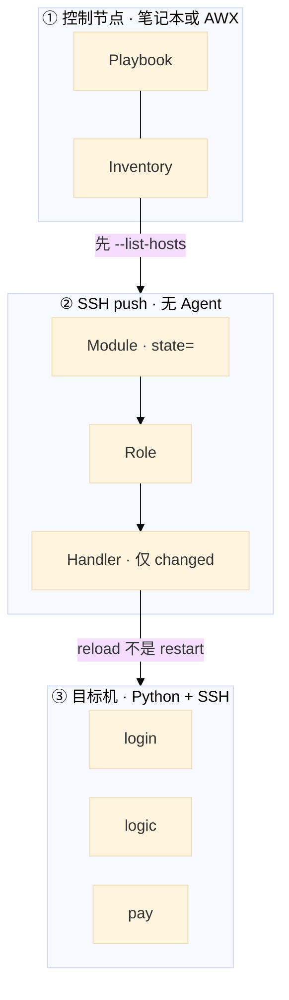
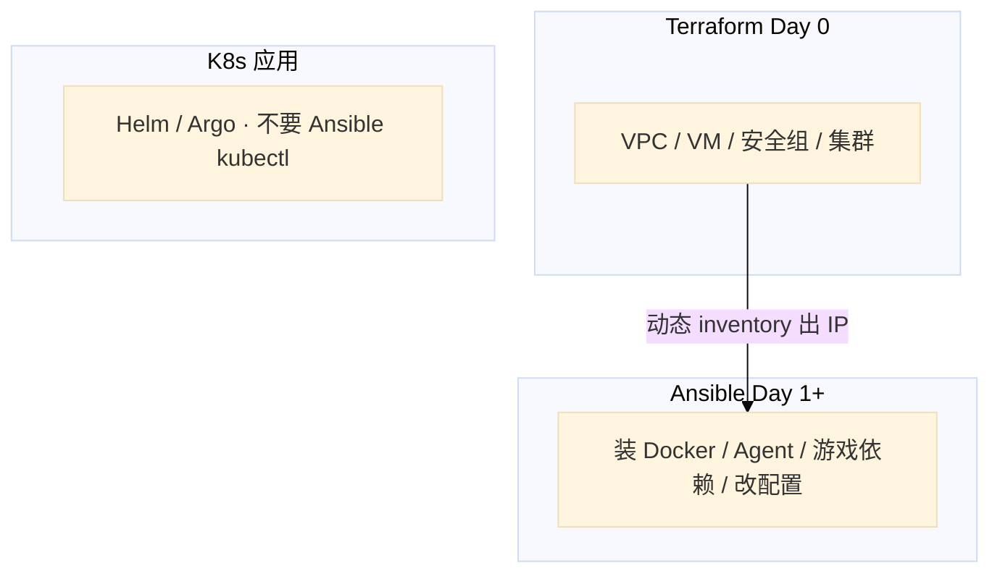
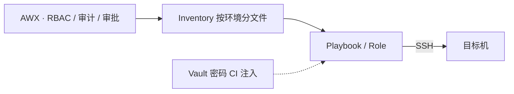
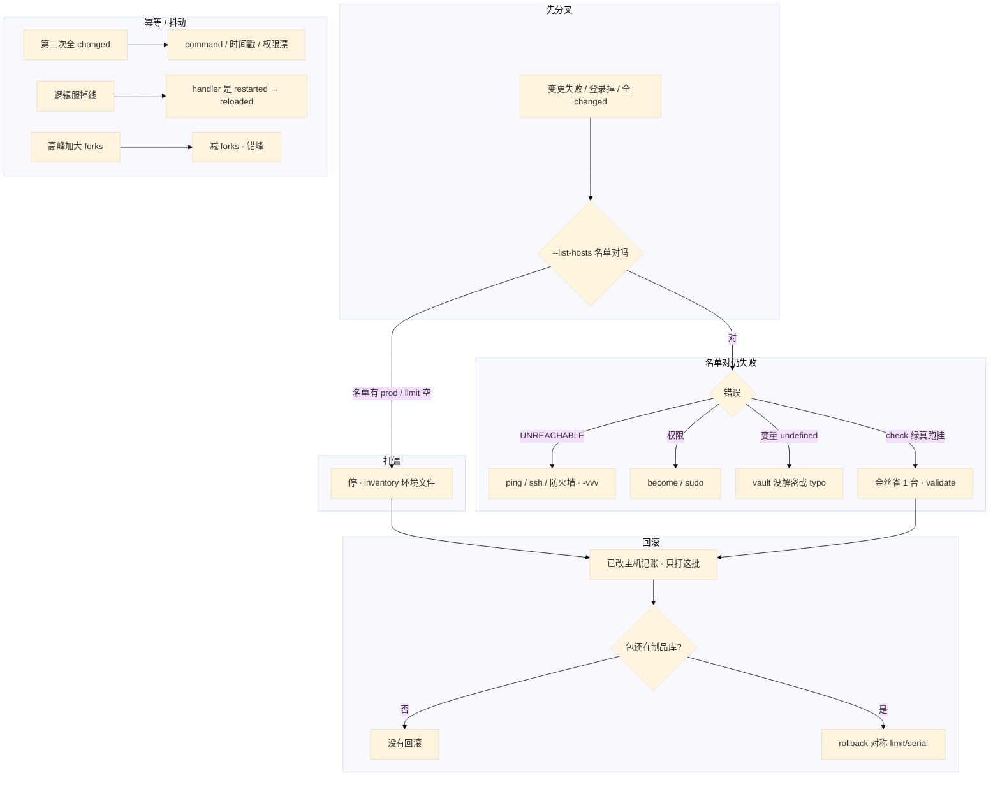

# Ansible

> 大家好，欢迎来到这次分享。开讲之前，先带大家回到一个很多值班同学都经历过的现场：
> 一条 playbook 打了一千台登录服，配错了还在继续。第二次跑仍然一堆 changed，有状态服被无脑 restart。群里有人 `hosts: all`，inventory 混着 prod；另有人把 forks 提到 100，sshd 和玩家抢 fd——活动高峰登录成功率掉成一条线。手就放在「再跑一遍全量」上。
> 这一章讲完，你会知道当时那个人错在哪，以及正确的做法是什么。
> **本章回答的问题**：Inventory / Playbook / Module / Role 各干什么；第二次为什么还 changed；滚动怎么控；handler 为什么用 reload；和 Terraform / 热更怎么拆；打偏了怎么点名回滚。
> **本章不讲**：State、锁、plan destroy → [07 Terraform](../07-Terraform/)；镜像 / 制品晋升 → [03](../03-制品与镜像/)；集群内应用发布 → [03-23](../../03-Kubernetes/23-GitOps-ArgoCD与Tekton/) / [04](../04-CI-CD/)；变更窗口、审批、oncall → [08](../08-运维平台与Oncall/)；云上安全组本源 → [06 云平台](../../06-云平台/)；密钥扫描细节 → 03。


**标记**：🎯重点 · 🔥难点 · ⭐常考 · 🔧实操

**怎么听这场分享**：咱们先钉三条主线——先预演、控批量、保幂等；第三节四个难点放慢；第七节用决策树回收开头现场。每一节讲完会提示对应练习题，学完就去练。

**本章主线（排障就按这三步想）：**

1. **先预演**：`--list-hosts`、`--check --diff`，确认会打到谁
2. **控批量**：`serial` / `forks` / 失败即停，有状态服 reload 不 restart
3. **保幂等**：第二次跑 `changed=0`，否则写的是脚本不是状态

**读完你能：** 白板上画出 Inventory / Playbook / Module / Role；第二次跑能判断为什么还 changed；会滚动变更、handler reload、Vault、和 Terraform 分工、点名回滚已改主机。

## 本章目录

- [1. 基本概念](#1-基本概念)
- [2. 架构图](#2-架构图)
- [3. 原理](#3-原理)
- [4. 安装部署](#4-安装部署)
- [5. 核心配置](#5-核心配置)
- [6. 命令与操作](#6-命令与操作)
- [7. 生产排障](#7-生产排障)
- [8. 必会 · 常考](#8-必会--常考)
- [合上书](#合上书问自己)

## 1. 基本概念


> 🎯 **一句话**：无 Agent 管状态：第二次跑应 changed=0；先看会打到谁。

Ansible **无 Agent**：控制节点 SSH push，目标机有 Python + SSH 即可。它保证的是「机器处于某状态」，不是「再执行一遍脚本」。🔥「幂等」= 同一个操作执行一次和执行十次，最终结果一样——第二次巡检还一堆 changed，说明你写的是脚本不是状态。值班里第一次碰到，多半是 playbook 打偏 prod、第二次巡检全 changed、或逻辑服被 restart 踢掉长连接。
**值班里怎么认现象**（先听发布群/监控怎么说，再对表）：

| 群里/监控说的 | 技术含义 | 你的第一刀 |
|---------------|----------|------------|
| 「登录成功率掉了」 | 可能打偏 / restart / 配错 | `--list-hosts` + 看 handler |
| 「第二次跑还是 changed」 | 幂等没做完 | recap 里哪个 task 还变 |
| 「打到 prod 了」 | inventory / limit 错 | **停**；查环境文件 |
| 「UNREACHABLE 一片」 | SSH / 防火墙 / forks 打满 | 手动 ssh + 减 forks |
| 「check 绿真跑挂」 | check 覆盖不全 | limit 1 台看业务 SLI |

四个对象不要混：

| 对象 | 干什么 |
|------|--------|
| **Inventory** | 谁：主机与分组（login / logic / pay；静态 ini 或云动态 inventory） |
| **Playbook** | 做什么：hosts + tasks 编排 |
| **Module** | 怎么做：yum / copy / template / service，原生幂等 |
| **Role** | 复用包：tasks / templates / handlers / defaults |

`yum: state=present`、`file: state=directory`、`service: state=started` 是「确保处于某状态」，不是「再执行一次安装」。同一 Playbook 第二次应 `changed=0`。CI 里连续跑两次断言这一点。

Handler：task **changed** 才 notify，一个 play 里同一 handler 只跑一次。服务用 `reloaded` 不是 `restarted`（reload 不断连接）。游戏逻辑服有状态，配置变更更要 reload / 优雅重启，禁止 playbook 每次都 restart。

> ⭐ **记住**：第二次跑应当 changed=0，否则你写的是脚本，不是状态。先看会打到谁（`--list-hosts`），再看怎么改。口诀——**先名单，再金丝雀；changed=0 才算状态。**

本节对应练习题 Q1、Q2——四个对象和幂等就是那道题的地基。

---

## 2. 架构图

> 🎯 **一句话**：控制节点 SSH push；先 --list-hosts，handler reload 不是 restart。

好，概念钉住了。接下来咱们看一张图——后面幂等、滚动、排障都对着它。大家先找一件事：有没有从「全量 hosts: all」直通 prod 的箭头？



**读图三句话：**

1. **没有箭头从 Ansible 指向 Helm/Argo 再 apply 一遍**——K8s 应用不走这条。
2. **Handler 只在 changed 时跑**——每次 `state=restarted` = 把发布做成抖动。
3. **先名单后变更**——`--limit` 写空可能变全量。

和 Terraform / GitOps 的边界：



禁忌：TF 管安全组、Ansible 再改同一套 iptables → drift，两边 plan / play 都「正确」但线上是乱的。**不要两个工具写同一资源的同一属性。**

---

本节对应练习题 Q1——主图就是「Inventory / Playbook / Module / Role」的白板答案。


## 3. 原理

> 🎯 **一句话**：幂等、handler、滚动、与 CI/热更拆分——四个难点放慢讲。

好，图看熟了。接下来四个难点咱们放慢——第二次为什么还 changed、handler 为什么只跑一次、批量怎么控风险、改配置为什么不走镜像 CI。每个都先抛问题再揭底。

### 3.1 幂等：第二次跑应该是 changed=0 🔥⭐

> 🎯 **一句话**：幂等 = 同一 Playbook 再跑，系统状态不变，recap **changed=0**——模块写 `state=`，command/shell 默认非幂等。

很多人会答「第二次还有 changed 说明 playbook 在干活」——错了，这是高频错答。⭐ 巡检应为 0；否则写的是脚本不是状态。

> 💡 **打个比方**：像 thermostat 设 26°C——再按一次不是「再加热一遍」，而是「确认还是 26°C」；若每次按都 changed，说明你在反复点火（脚本），不是在恒温（状态）。

**现场走一遍**（登录服 nginx 超时 60s→90s，第一次正常，巡检第二次全 changed）：

1. 第一次变更（AWX 或笔记本，先 list-hosts）：

```bash
ansible-playbook deploy/nginx.yml --list-hosts
ansible-playbook deploy/nginx.yml --limit login-01 --check --diff
ansible-playbook deploy/nginx.yml --limit login-01
```

2. 第一次 recap：

```text
PLAY RECAP *********************************************************************
login-01                  : ok=14   changed=2   unreachable=0   failed=0
```

3. `changed=2` 正常——template 改了配置 + handler reload nginx。登录长连接还在（reload 不是 restart）。

4. **一小时后巡检再跑同一 playbook**：

```bash
ansible-playbook deploy/nginx.yml --limit login-01
```

5. 第二次 recap（异常）：

```text
PLAY RECAP *********************************************************************
login-01                  : ok=14   changed=3   unreachable=0   failed=0

TASK [Render nginx.conf] *******************************************************
--- before
+++ after
@@ -12,7 +12,7 @@
-    proxy_read_timeout 60s;
+    proxy_read_timeout 90s;
```

6. 若配置已是 90s 仍 changed——查三因：`command` 没 `creates`；template 含 `{{ ansible_date_time }}` 时间戳；文件权限被别的进程改漂。把 command 改模块或加 `creates`：

```yaml
- command: tar xf app.tar.gz -C /opt/app
  args:
    creates: /opt/app/bin/start.sh    # 文件已在就跳过
```

7. 修完再跑，目标 recap：

```text
login-01                  : ok=14   changed=0   unreachable=0   failed=0
```

**输出解读**：

| recap 字段 | 正常巡检 | 异常信号 |
|------------|----------|----------|
| `changed` | **0** | >0 = 幂等未完成 |
| `failed` | 0 | 停；别继续 serial |
| `unreachable` | 0 | 先 ssh，别怪 YAML |
| diff 每次不同 | — | 时间戳 / 随机数在 template 里 |

Template（Jinja2）管配置；Copy 管静态文件 / 包。配置用 template 并 `validate`。变量优先级：`-e` > play vars > host / group_vars > role defaults。

> 📝 **面试怎么说**：「幂等靠模块 state=；巡检第二次 changed 应为 0。若还变，查 command 缺 creates、template 时间戳、权限漂移；逻辑服禁止每次 restarted。」

> ⭐ **记住**：模块写状态；handler 只在变了才 reload；第二次 changed≠0 先查 command 和时间戳。

### 3.2 Handler：变了才 reload，一个 play 只跑一次 🔥⭐

> 🎯 **一句话**：Handler 只在被 notify 且 task **changed** 时执行，同一 play 里同名 handler **只跑一次**——配置热更用 `reloaded`，不是 `restarted`。

大家想想：如果每次 template 都 `restarted`，逻辑服长连接会怎样？⭐ 有状态服用 reload，这是值班天天见的坑。

> 💡 **打个比方**：像电闸旁的「变更后合闸一次」——三个房间都改了线路（三个 template notify），电工（handler）**合闸一次**就够；若每改一间就拉总闸（restart），全楼停电（玩家掉线）。

**现场走一遍**（登录服改 upstream + 超时，三个 template 都 notify reload）：

1. Playbook 片段：

```yaml
- hosts: login
  serial: "10%"
  max_fail_percentage: 0
  tasks:
    - template:
        src: nginx.conf.j2
        dest: /etc/nginx/nginx.conf
        validate: 'nginx -t -c %s'
      notify: reload nginx
    - template:
        src: upstream.conf.j2
        dest: /etc/nginx/conf.d/upstream.conf
        validate: 'nginx -t -c %s'
      notify: reload nginx
  handlers:
    - name: reload nginx
      service: { name: nginx, state: reloaded }
```

2. 真跑 `--limit login-01 -v`：

```text
TASK [template nginx.conf] *****************
changed: [login-01]

TASK [template upstream.conf] **************
changed: [login-01]

RUNNING HANDLER [reload nginx] *************
changed: [login-01]
```

3. **两个 template changed，handler 只 RUNNING 一次**——若写成普通 task `service: restarted`，会重启两次甚至三次，登录长连接全断。

4. `validate: 'nginx -t -c %s'` 先校验再落地——配错不会写坏文件再 reload 全挂。

5. 对比错误写法（逻辑服用 restarted）——每次 deploy 都 changed + 重启 = 抖动；逻辑服要先摘流量再优雅重启。

**输出解读**：

| 日志 | 含义 | 动作 |
|------|------|------|
| `notify: reload nginx` + task changed |  play 末触发 handler | 正常 |
| `RUNNING HANDLER` 出现 1 次 | 合并 notify | 正确 |
| `service: restarted` 每次 changed | 非幂等抖动机 | 改 reloaded + handler |
| validate 失败 | 文件未替换 | 修 template 再跑 |
| 需中间立刻生效 | `meta: flush_handlers` | 少用，有数再用 |

> 📝 **面试怎么说**：「Handler 仅 changed 时跑，同一 play 一次；nginx 用 validate + reloaded。逻辑服不能 playbook 里无脑 restarted，要摘流量或 reload。」

> ⭐ **记住**：`service: restarted` 每次抖一下；配置变更走 handler reload。

### 3.3 批量变更怎么控风险：先名单，再 1 台，再 10% 🔥⭐

> 🎯 **一句话**：SRE 考的是 `--list-hosts` → limit 1 台看 SLI → `serial 10%` + `max_fail_percentage: 0`——配置本身错，百分比救不了；`--limit` 写空可能变全量。

开头那条打了一千台还在继续的 playbook——缺的就是这一步。很多人迷信 `serial 10%` 能防配错——错了，配置本身错会全挂。这是 ⭐ 高频错答。

> 💡 **打个比方**：像新药临床试验——先查名单有没有误服（list-hosts），再 1 人试（limit），再 10% 小样本（serial），全过敏立刻停（any_errors_fatal）；不是一千人同时 swallow。

**现场走一遍**（合服前改一千台登录服 nginx，有人 `--limit` 写空）：

1. **必须先 list-hosts**：

```bash
ansible-playbook deploy/nginx.yml --list-hosts
```

```text
  hosts (128):
    login-01
    login-02
    ...
    login-prod-99    # ← 若 staging  playbook 里出现 prod 主机，立刻停
```

2. 预演：

```bash
ansible-playbook deploy/nginx.yml --check --diff --limit login-stg-01
```

3. 金丝雀 1 台，**看登录成功率 SLI**（不是只看 playbook 绿）：

```bash
ansible-playbook deploy/nginx.yml --limit login-stg-01
# 盯 Grafana：login_success_rate、5xx、连接数
```

4. SLI 正常后，play 里滚动：

```yaml
serial: "10%"
max_fail_percentage: 0
any_errors_fatal: true
```

5. 全量跑；**任意一台 failed 即停**。已改主机记账，回滚只打这批：

```bash
ansible-playbook rollback/nginx.yml --limit login-stg-01,login-stg-02,...
```

6. 全量成功后再跑一遍，确认 `changed=0`：

```text
PLAY RECAP *********************************************************************
login-stg-01              : ok=14   changed=0   unreachable=0   failed=0
...
```

**输出解读**：

| 步骤 / 输出 | 通过标准 | 失败说明 |
|-------------|----------|----------|
| `--list-hosts` | 无 prod 误入 | inventory 环境文件混了 |
| `--limit` 空 | 可能变 **全量** | 比不写 limit 更危险 |
| `--check` 绿 | 仅参考 | custom module 可能不准 |
| limit 1 台 SLI | 登录成功率不降 | 才能 serial |
| serial 10% 仍全挂 | 配置本身错 | 先 1 台，别迷信百分比 |
| 高峰 forks=100 | sshd 和玩家抢 fd | **减 forks** 错峰 |

`--limit prod:&web` 交集要能算。高峰期登录服 SSH 打满和玩家连接抢同一台机的 fd / CPU，变更窗口避开峰值。

> 📝 **面试怎么说**：「批量顺序：check → list-hosts → limit 1 台看 SLI → serial 10% max_fail 0；失败即停，已改主机点名回滚；高峰减 forks。」

> ⭐ **记住**：先 list-hosts，再 limit 1 台看业务，再 serial；失败即停，已改的那批要能点名回滚。

### 3.4 和 CI / 热更怎么拆：改配置不走镜像 CI 🔥⭐

> 🎯 **一句话**：nginx 超时、装 Agent、改 sysctl 走 Ansible；服务端代码出镜像走 digest 晋升（02/03）；**不要为改超时 rebuild 镜像**，也不要 Ansible kubectl 和 GitOps 抢。

大家想想：改个超时就 rebuild 镜像，活动窗口还来得及吗？口诀——**改配置 Ansible；换二进制 digests；抢同一资源必乱。**

> 💡 **打个比方**：像装修分工种——刷墙（Ansible 改配置）、换发动机（镜像 CI 换二进制）、换海报（CDN 热更）、整栋楼图纸（GitOps）各找各的师傅，别让刷墙的顺便改发动机。

**现场走一遍**（活动中途要改登录超时，有人提议「顺手 rebuild 镜像」或「kubectl set image」）：

1. 需求分类：

| 变更 | 走谁 | 不走谁 |
|------|------|--------|
| nginx `proxy_read_timeout` 60→90 | **Ansible** template + reload | 镜像 CI rebuild |
| 逻辑服 bugfix 二进制 | 镜像 CI digest（03） | Ansible copy 二进制 |
| 策划表热更 | CDN（08-03） | Ansible / 镜像 |
| K8s Deployment 副本数 | GitOps（04-22） | Ansible kubectl |

2. 改超时——Ansible limit 1 台：

```bash
ansible-playbook deploy/nginx.yml -e proxy_read_timeout=90s --limit login-01
```

```text
TASK [template nginx.conf] *****************
changed: [login-01]
RUNNING HANDLER [reload nginx] *************
changed: [login-01]
```

3. 登录 SLI 正常 → serial 全量。**没有新 digest**，Harbor 不用动，开服窗口不被拉镜像占用。

4. 若同事 `kubectl set image` 改 Pod：

```text
# Argo selfHeal 几分钟后
Sync Status: OutOfSync → Synced (reverted manual change)
```

GitOps 会把热修打回去——集群应用变更走 Git，不走 Ansible kubectl。

5. 逻辑服代码发布：CI 构建 digest → 复制 prod → GitOps sync image 字段（04-22）。Ansible 只装节点依赖、改 sysctl，不碰 Deployment。

**输出解读**：

| 路径 | 优点 | 踩坑 |
|------|------|------|
| Ansible 改 nginx | 秒级 reload，无镜像拉取 | 误 restart 踢连接 |
| 镜像 CI 改超时 | 为配置 rebuild 浪费窗口 | 03 章禁止 |
| Ansible kubectl | 看似快 | selfHeal 回滚 |
| CDN 热更 | 客户端资源 | Ansible 改不了客户端缓存 |

和 Salt / Puppet：无 Agent 上手快；大规模 pull、实时性 Salt 更强。游戏厂批量配置 Ansible 通常够用。

> 📝 **面试怎么说**：「改 nginx 超时走 Ansible reload；服务端代码走镜像 digest 晋升；K8s 应用走 GitOps，禁止 Ansible kubectl 双轨；热更包走 CDN。」

> ⭐ **记住**：配置热更 Ansible；二进制镜像 CI；集群应用 GitOps；三轨别混。

---

本节对应练习题 Q2、Q3、Q4、Q9、Q10。


## 4. 安装部署


> 🎯 **一句话**：控制节点落地；AWX/Tower 管谁能跑哪套 inventory。

四个难点讲完了。落地时控制节点怎么摆、谁能跑 prod——对着第三节的坑逐条焊死。
### 4.1 生产怎么选

| 项 | 选 | 不选 |
|----|----|------|
| 控制面 | AWX / Tower：RBAC、审计、审批 | 笔记本无审批打 prod |
| Agent | 无；目标机 Python + SSH | 为 Ansible 再装一套重 Agent（除非选型 Salt） |
| 库存 | 按环境分文件；动态 + **静态备份名单** | `hosts: all` 混 prod |
| 幂等 | 模块 `state=`；CI 跑两次 | 巡检每次 changed + restart |
| 滚动 | check → list-hosts → limit 1 → serial | 直接全量 |
| 和 TF | Day 1+ 软件与配置 | 再写同一套安全组 / iptables |
| K8s 应用 | Helm / Argo | Ansible kubectl 双轨 |

不要 AWX 和 Jenkins 两处都能无审批打 prod。Jenkins 适合构建；变更审计在 AWX 更完整。

### 4.2 控制节点落地你实际看到什么



| 路径/项 | 内容 |
|---------|------|
| Inventory | 按环境分文件；动态失败要有静态备份 |
| Role | `defaults` / `tasks` / `handlers` / `templates` / `meta` |
| Vault | 密码不进 Git；CI `--vault-password-file` |
| `host_key_checking` | 生产用已知 host key，不要 False |

验收：`--list-hosts` 名单对；直打 prod 要审批；第二次 play `changed=0`（巡检）；笔记本不能绕过 AWX 打 prod。

第三方 `ansible-galaxy` 只引内部源，pin 版本。Molecule / CI 里跑两次验幂等。

---

本节对应练习题 Q8、Q11。


## 5. 核心配置


> 🎯 **一句话**：只动有证据的项；serial / forks / max_fail 改错会打满或踢人。
只动有证据的项。`ansible.cfg` 和 play 里的 serial 三端（开发机 / AWX / CI）必须一致。

| 参数 | 默认/常见 | 生产怎么用 | 改错会怎样 |
|------|-----------|------------|------------|
| `pipelining` | False | **True**（少 SSH 往返，ROI 最高） | 打 200 台要 40 分钟 |
| ControlMaster | 无 | 复用连接 | 每次握手 |
| `forks` | 5 | **20 量级**；高峰 **减** | 100+ 打满 sshd，登录掉 |
| `gather_facts` | True | 不需要时 **false** + fact cache | 每个 task 都 setup 拖死 |
| `max_fail_percentage` | 容忍部分失败 | **0** / `any_errors_fatal` | 配错还在继续 |
| `serial` | 全量 | **10%**，先 limit 1 台 | 一千台一起挂 |
| `host_key_checking` | True | 已知 host key | False = 接受中间人 |
| Vault | 明文 group_vars | 加密；密码不进 Git / role | 泄漏；先 rotate |

变量优先级：`-e` > play vars > host / group_vars > role defaults。defaults 放默认，**不要把 prod 密码写进 role**。

> ⭐ **记住**：慢先开 pipelining；失败先 SSH；高峰减 forks；密码不进 Git。forks 用来覆盖并行度，不是用来扛高峰登录服。

---

本节对应练习题 Q4、Q12。


## 6. 命令与操作


> 🎯 **一句话**：值班先 --list-hosts、--check --diff，再 limit 金丝雀。

平台在命令行里跑，值班对的是 inventory 和 recap。回滚怎么和发布对称，也在这一节。
### 6.0 速查

先看会打到谁，再跑。

| 目的 | 命令 | 看什么 |
|------|------|--------|
| 预演 | `ansible-playbook deploy.yml --check --diff` | 覆盖不全，金丝雀不能省 |
| 名单 | `ansible-playbook deploy.yml --list-hosts` | 有没有 prod |
| 金丝雀 | `ansible-playbook deploy.yml --limit web-01,web-02` | 登录成功率 |
| 交集 | `--limit prod:&web` | 会算 |
| 详细失败 | `-vvv` | 卡在握手还是 sudo |
| 连通 | 手动 SSH / ping | UNREACHABLE 先别怪 YAML |
| 解密 | `--vault-password-file` | 变量 undefined 常是没注入 |
| 回滚 | `-e app_version=上一版` | 包还在制品库（03） |

值班先跑这四条：

```bash
ansible-playbook deploy.yml --check --diff
ansible-playbook deploy.yml --list-hosts
ansible-playbook deploy.yml --limit web-01
# 看服务、日志、登录成功率；再 serial 全量；再跑一遍确认幂等
```

```text
  hosts (128):
    web-01
    web-02
    ...
web-01                    ok=14   changed=2   unreachable=0   failed=0
```

`changed=2` 首次正常；巡检应再跑一遍看到 `changed=0`。名单里出现不该有的 prod 主机 = 立刻停。

观测：playbook 成功率、P95 时长、changed 数（巡检应为 0）、失败主机。AWX 审计「谁打了 prod」比日志更有用。

### 6.1 典型操作

- **预演 / 金丝雀**：`--check --diff` → `--list-hosts` → `--limit web-01` 看 SLI；check 绿不是放行。
- **滚动**：`serial: "10%"` + `max_fail_percentage: 0`；高峰减 forks；全量后再跑确认 `changed=0`。
- **回滚**：`-e app_version=上一版` 或对称 rollback playbook（limit → serial）；包须在制品库（03）；已改主机只打这批。
- **Role**：`defaults` / `tasks` / `handlers` / `templates` / `meta`；密码不进 defaults；Molecule / CI 跑两次验幂等。
- **Vault / AWX**：密码 `--vault-password-file` 注入；AWX 管 RBAC / 审计 / 审批；动态 inventory 要有静态备份。
- **分工**：TF Day 0 基建 → Ansible Day 1+ 软件配置；K8s 应用走 GitOps（04-22），禁止 Ansible kubectl 双轨。

---

本节对应练习题 Q5、Q6、Q14。


## 7. 生产排障


> 🎯 **一句话**：先分叉——打偏 / 幂等 / 批量 / 连通；hosts: all 不是再加 forks 能修的。

现在再看开头那个现场——配错还在继续、restart 踢人、forks 打满——决策树就是正确解法。
三问：进程还在不在？还能不能变更？已有流量还通不通？

**playbook 打偏 = 配置被改错，不是立刻踢玩家。** 失败即停；不要继续全量。逻辑服不要无脑 restart。



现场顺序：

```bash
ansible-playbook deploy.yml --list-hosts
ansible-playbook deploy.yml --limit web-01 -vvv
# 手动 SSH 看 sudo / 磁盘 / Python
```

| 现象 | 先做什么 | 不要做什么 |
|------|----------|------------|
| 打到了 prod | 停；看环境文件、`--limit` 是否空 | 先看 YAML 语法 |
| check 绿真跑挂 | 金丝雀 1 台看业务；validate | 迷信 check |
| 第二次全 changed | command / 时间戳 / 权限漂 | 当巡检继续跑 |
| 逻辑服掉线 | handler 改 reloaded，先摘流量 | `state=restarted` 写进巡检 |
| UNREACHABLE | ping / ssh / 防火墙 | 先怪 playbook |
| 变量 undefined | vault 密码文件、typo | 明文写回 group_vars |
| 高峰加大 forks 登录掉 | 减 forks、错峰 | 再加 forks |
| 动态 inventory 空 | 静态备份名单 | 等云 API |
| serial 10% 仍全挂 | 配置本身错；先 1 台 | 迷信百分比 |
| 回滚找不到包 | 制品库保留（03） | 假装能回 |

故障 30 秒分流：UNREACHABLE → 本机 ssh；权限失败 → become；每次都 changed → command 或时间戳；大面积中断 → 有没有 serial，limit 是不是空。

---

本节对应练习题 Q10、Q14。现在再看群里那句「再跑一遍全量」，你知道该怎么拦住他了——先 --list-hosts，再 serial / limit。


## 8. 必会 · 常考


> 🎯 **一句话**：遮住口径列自问自答；卡壳回去重读对应小节。

遮住「口径」列自问自答，卡壳的行回去重读对应小节——这张表把前面的坑串起来了：
| 说法 | 对错 | 口径 |
|------|:----:|------|
| 第二次跑有 changed 说明 playbook 在干活 | 错 | 巡检应为 0；否则是脚本不是状态 |
| `service: restarted` 是幂等保活 | 错 | 每次抖一下；用 started + handler reload |
| Handler 和普通 task 一样每台都跑 | 错 | 仅 changed，同一 play 只一次 |
| `--check` 绿就可以全量 | 错 | 覆盖不全；金丝雀不能省 |
| `serial 10%` 就能防配错 | 错 | 配置本身错会全挂；先 1 台看业务 |
| `--limit` 写空更安全 | 错 | 可能变全量；先 `--list-hosts` |
| 高峰加大 forks 更快 | 错 | sshd 和玩家抢 fd；减 forks |
| `host_key_checking=False` 生产省事 | 错 | 接受中间人 |
| TF 和 Ansible 都改安全组更稳 | 错 | 同一属性只许一个工具写 |
| Ansible kubectl 热修最快 | 错 | GitOps selfHeal 打回来 |
| prod 密码放 role defaults 方便 | 错 | 永远不进 role |
| 密码进 Git 删文件就行 | 错 | 先 rotate，历史重写 |
| 动态 inventory 挂了再想名单 | 错 | 静态备份必须事先有 |
| 回滚 playbook 可以更猛 | 错 | limit / serial / handler 必须对称 |
| 改超时应该走镜像 CI | 错 | Ansible reload；镜像 CI 管代码 |

数字：forks **20 量级**；serial **10%**；`max_fail_percentage` **0**；巡检 changed **0**；pipelining ROI 最高。

易混：幂等 vs 再执行；reload vs restart；check vs 金丝雀；limit 空 vs 全量；TF Day 0 vs Ansible Day 1+；镜像 CI vs 配置热更。

---

## 合上书，问自己

学到这里，先别急着翻下一章。合上书，试试下面几件事能不能做到——卡住的那一条，回到对应小节再听一遍：

- [ ] **口述对象**：四个对象各干什么？第二次 changed≠0 查哪三因？（对应练习题 Q1、Q2）
- [ ] **口述 Handler**：和普通 task 差在哪？逻辑服能不能 `restarted`？（Q3）
- [ ] **口述批量**：变更顺序？`--limit` 写空会怎样？serial 10% 仍全挂说明什么？（Q4、Q10）
- [ ] **口述性能**：pipelining / forks / facts 怎么排？高峰能不能加 forks？（Q5）
- [ ] **口述回滚**：怎么和发布对称？动态 inventory 挂了呢？Vault / AWX 解决什么？（Q6、Q8、Q11）
- [ ] **口述分工**：和 Terraform / GitOps 怎么分工？改超时、出镜像、热更包各走谁？（Q9、Q14）

六题都能口述，这一章就过了——开头那个 `hosts: all`、restart、加 forks 的现场，你现在能拦住他了。下一章把 Terraform 剖开：State、锁、plan destroy、漂移。
