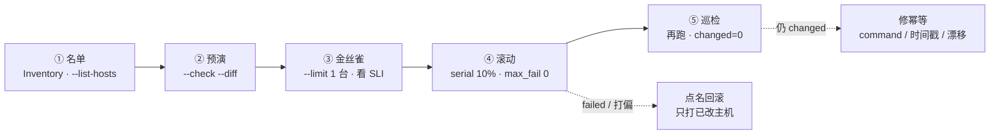
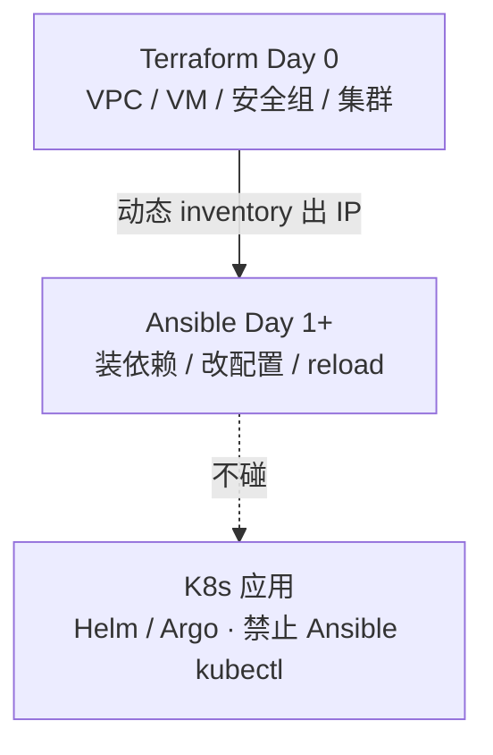
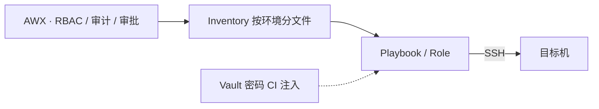
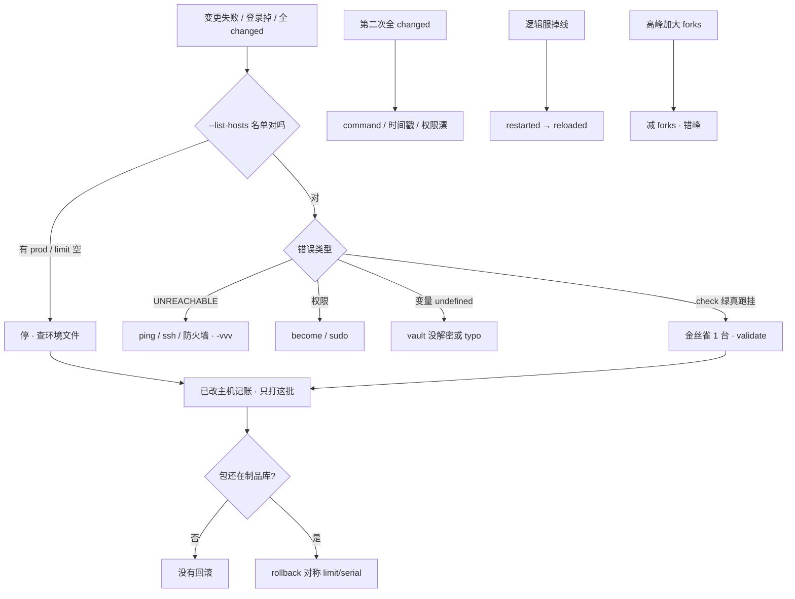

# Ansible

> 一条 playbook 打了一千台登录服，配错还在继续；第二次巡检仍一堆 `changed`；有人 `hosts: all` 混进 prod，有人把 `forks` 提到 100——sshd 和玩家抢 fd，登录成功率掉成一条线。手就放在「再跑一遍全量」上。
> **本章回答**：Inventory / Playbook / Module / Role 各干什么；第二次为什么还 `changed`；滚动怎么控；handler 为什么用 reload；和 Terraform / 热更怎么拆；打偏了怎么点名回滚。
> **不讲**：State、锁、plan destroy → [07 Terraform](../07-Terraform/)；镜像 / 制品晋升 → [03](../03-制品与镜像/)；集群内应用发布 → [03-23](../../03-Kubernetes/23-GitOps-ArgoCD与Tekton/) / [04](../04-CI-CD/)；变更窗口、审批、oncall → [08](../08-运维平台与Oncall/)；云上安全组本源 → [06 云平台](../../06-云平台/)。

**标记**：🎯重点 · 🔥难点 · ⭐常考 · 🔧实操

---

## 一、一张图：一次变更的一生

> 🎯 **一句话**：Ansible 无 Agent，SSH push 管**状态**——先名单、再金丝雀、再滚动；第二次跑应 `changed=0`。



- 📖 **读图**
  - 🛤️ 主线「名单 → 预演 → 金丝雀 → 滚动 → 巡检」；任意一步名单错就**停**，别往下加 forks
  - 🔪 值班第一刀永远是 `--list-hosts`；`changed≠0` 的巡检走修幂等，不走「再全量」

- 🔑 **无 Agent** = 控制节点 SSH push，目标机有 Python + SSH 即可；保证的是「机器处于某状态」，不是「再执行一遍脚本」

本节对应练习题 Q1。

---

## 二、四个对象：谁 · 做什么 · 怎么做 · 复用

> 🎯 **一句话**：Inventory 管谁，Playbook 管编排，Module 管原子动作，Role 管复用包——四者不叠职责。

- 📦 **四个对象**
  - **Inventory**：谁——主机与分组（`login` / `logic` / `pay`；静态 ini 或云动态 inventory）
  - **Playbook**：做什么——`hosts` + `tasks` 编排
  - **Module**：怎么做——`yum` / `copy` / `template` / `service`，原生按 `state=` 幂等
  - **Role**：复用包——`tasks` / `templates` / `handlers` / `defaults`

- 🧭 **模块写状态，不是再执行**
  - `yum: state=present`、`file: state=directory`、`service: state=started` = 确保处于某状态
  - 同一 Playbook 第二次应 `changed=0`；CI 里连续跑两次断言这一点

> ⚠️ **别混**：`service: state=started` 是「没起来就起来」；`state=restarted` 每次都抖一下——后者**不是**保活。配置热更走 handler `reloaded`（四节）。

> 📝 **面试**：四个对象各管一层——谁 / 编排 / 原子动作 / 复用；幂等靠模块 `state=`，巡检 `changed=0` 才算状态。⭐（Q1、Q2）

### 🚨 值班里怎么认现象

| 群里/监控说的 | 技术含义 | 你的第一刀 |
|---------------|----------|------------|
| 「登录成功率掉了」 | 可能打偏 / restart / 配错 | `--list-hosts` + 看 handler |
| 「第二次跑还是 changed」 | 幂等没做完 | recap 里哪个 task 还变 |
| 「打到 prod 了」 | inventory / limit 错 | **停**；查环境文件 |
| 「UNREACHABLE 一片」 | SSH / 防火墙 / forks 打满 | 手动 ssh + 减 forks |
| 「check 绿真跑挂」 | check 覆盖不全 | limit 1 台看业务 SLI |

---

## 三、预演：先名单，再 check

> 🎯 **一句话**：SRE 考的是「会打到谁」——`--list-hosts` 不过关，后面的 serial 全是演戏。

### 📋 名单是第一道闸 🎯⭐

```bash
ansible-playbook deploy/nginx.yml --list-hosts
```

```text
  hosts (128):
    login-01
    login-02
    ...
    login-prod-99    # ← staging playbook 里出现 prod？立刻停
```

- 🔍 **现场**
  - 名单混环境 → 停变更，查 inventory 分文件是否串了
  - `--limit` **写空**可能变全量——比「忘了写 limit」更危险（见五节 ❓）
  - 交集写法要会算：`--limit prod:&web`

### 🔬 check 与 diff

```bash
ansible-playbook deploy/nginx.yml --check --diff --limit login-stg-01
```

> ⚠️ **别混**：`--check` 绿 ≠ 可以全量。custom module / 部分副作用 check 覆盖不全；金丝雀看**登录成功率 SLI**，不是只看 playbook 绿。

#### ❓ 为什么 check 绿也不能全量？

- 🧪 check 是 dry-run，很多模块只模拟「会不会改文件」，**不跑业务路径**
- 🐦 金丝雀 1 台盯 Grafana：`login_success_rate`、5xx、连接数——SLI 正常才 `serial`
- 🚫 迷信 check = 开头那条「配错还在继续」的根因之一

> 📝 **面试**：变更顺序 `check → list-hosts → limit 1 台看 SLI → serial`；check 只是预演，放行看业务。⭐（Q4）

本节对应练习题 Q4、Q5。

---

## 四、干活：幂等与 Handler

> 🎯 **一句话**：模块写 `state=`；Handler 只在 **changed** 时跑且同 play 一次；配置热更用 `reloaded`。

### 🔁 幂等：第二次应 changed=0 🔥⭐

> 💡 **打个比方**：像 thermostat 设 26°C——再按一次不是「再加热一遍」，而是「确认还是 26°C」；若每次按都 `changed`，说明你在反复点火（脚本），不是在恒温（状态）。

**现场走一遍**（登录服 nginx 超时 60s→90s，第一次正常，巡检第二次全 changed）：

```bash
ansible-playbook deploy/nginx.yml --list-hosts
ansible-playbook deploy/nginx.yml --limit login-01 --check --diff
ansible-playbook deploy/nginx.yml --limit login-01
```

```text
PLAY RECAP *********************************************************************
login-01                  : ok=14   changed=2   unreachable=0   failed=0
# ← 首次：template 改配置 + handler reload，正常
```

一小时后同一 playbook 再跑，若仍 `changed>0`：

```text
TASK [Render nginx.conf] *******************************************************
--- before
+++ after
@@ -12,7 +12,7 @@
-    proxy_read_timeout 60s;
+    proxy_read_timeout 90s;
# ← 配置已是 90s 还 diff？查时间戳 / 权限漂 / command
```

- 🧯 **第二次还 changed 的三因**
  - `command` / `shell` 缺 `creates`（或没改成模块）
  - template 含 `{{ ansible_date_time }}` 等每次变的值
  - 文件权限被别的进程改漂

```yaml
- command: tar xf app.tar.gz -C /opt/app
  args:
    creates: /opt/app/bin/start.sh    # 文件已在就跳过
```

修完目标 recap：

```text
login-01                  : ok=14   changed=0   unreachable=0   failed=0
```

#### ❓ 为什么第二次 changed≠0 不是「playbook 在干活」？

- ❌ 高频错答：「还有 changed 说明还在维护」
- ✅ 巡检应为 **0**——否则写的是脚本，不是状态
- 📌 recap 里 `changed` 是幂等完成度，不是工作量勋章

> 📝 **面试**：幂等靠模块 `state=`；巡检第二次 `changed` 应为 0。若还变，查 command 缺 creates、template 时间戳、权限漂移。⭐（Q2）

### 🔔 Handler：变了才 reload，同 play 只一次 🔥⭐

> 💡 **打个比方**：三个房间都改了线路（三个 template notify），电工（handler）**合闸一次**就够；若每改一间就拉总闸（restart），全楼停电（玩家掉线）。

```yaml
- hosts: login
  serial: "10%"
  max_fail_percentage: 0
  tasks:
    - template:
        src: nginx.conf.j2
        dest: /etc/nginx/nginx.conf
        validate: 'nginx -t -c %s'
      notify: reload nginx
    - template:
        src: upstream.conf.j2
        dest: /etc/nginx/conf.d/upstream.conf
        validate: 'nginx -t -c %s'
      notify: reload nginx
  handlers:
    - name: reload nginx
      service: { name: nginx, state: reloaded }
```

```text
TASK [template nginx.conf] *****************
changed: [login-01]
TASK [template upstream.conf] **************
changed: [login-01]
RUNNING HANDLER [reload nginx] *************
changed: [login-01]
# ← 两个 template changed，handler 只 RUNNING 一次
```

- 📖 **读图（日志）**：多个 `notify` 同名 → play 末合并成一次；写成普通 task `restarted` 会重启多次，登录长连接全断
- 🛡️ `validate: 'nginx -t -c %s'` 先校验再落地——配错不会写坏文件再 reload 全挂
- ⚡ 中间立刻生效才用 `meta: flush_handlers`——少用，有数再用

#### ❓ 为什么用 reload 不用 restart？

- 🔌 **reload** 热加载配置，不断现有连接——登录 / 逻辑服长连接还在
- 💥 **restart** 掐进程再起 = 踢玩家；有状态服配置变更禁止 playbook 每次 `restarted`
- 🎮 逻辑服要先摘流量再优雅重启；巡检里写 `restarted` = 把发布做成抖动

> ⚠️ **别混**：Handler ≠ 普通 task——仅 task **changed** 才 notify；同名 handler 同 play **只跑一次**。

> 📝 **面试**：Handler 仅 changed 时跑，同一 play 一次；nginx 用 validate + reloaded。逻辑服不能 playbook 里无脑 restarted。⭐（Q3）

- 🧩 **Template vs Copy**：配置用 Jinja2 template + validate；静态文件 / 包用 copy
- 📊 **变量优先级**：`-e` > play vars > host / group_vars > role defaults（defaults 放默认，**prod 密码不进 role**）

本节对应练习题 Q2、Q3。

---

## 五、滚动：金丝雀 → serial → 失败即停

> 🎯 **一句话**：`--list-hosts` → limit 1 台看 SLI → `serial: "10%"` + `max_fail_percentage: 0`；配置本身错，百分比救不了。

> 💡 **打个比方**：像新药临床试验——先查名单有没有误服（list-hosts），再 1 人试（limit），再 10% 小样本（serial），全过敏立刻停（any_errors_fatal）；不是一千人同时 swallow。

```yaml
serial: "10%"
max_fail_percentage: 0
any_errors_fatal: true
```

- 🪜 **批量四步**
  1. `--list-hosts` 过闸
  2. `--check --diff` 预演（参考，不放行）
  3. `--limit` 金丝雀 1 台，盯登录 SLI
  4. `serial 10%` 滚动；任意 `failed` 即停；已改主机记账

```bash
ansible-playbook rollback/nginx.yml --limit login-stg-01,login-stg-02,...
# ← 回滚只打已改这批；limit / serial / handler 必须与发布对称
```

全量成功后再跑一遍，确认 `changed=0`。

#### ❓ 为什么 serial 10% 防不了配错？

- 📉 百分比只控**爆炸半径**——每批都挂同一错误配置，仍会**全挂**
- 🐦 正解是先 1 台看业务；serial 是放大镜后面的油门，不是保险丝
- ⭐ 高频错答：「开了 serial 就能防配错」

#### ❓ 为什么 `--limit` 写空比不写更危险？

- 🕳️ 空 limit 在部分用法下会匹配**全量**（或等价于没限制）——脚本里 `LIMIT=""` 最常见
- ✅ 习惯：先 `--list-hosts` 肉眼确认；自动化里 limit 空直接 fail-fast
- 🔥 开头那条「打了一千台还在继续」——往往缺的就是这一步

- ⚙️ **高峰与 forks**
  - `forks` 默认 5，生产常见 **20 量级**；高峰**减** forks，错峰变更
  - forks=100 → sshd 和玩家抢同一台机的 fd / CPU → 登录掉线
  - forks 覆盖并行度，**不是**用来扛高峰登录服

> 📝 **面试**：批量顺序 check → list-hosts → limit 1 台看 SLI → serial 10% max_fail 0；失败即停，已改主机点名回滚；高峰减 forks。⭐（Q4、Q10）

本节对应练习题 Q4、Q10。

---

## 六、分工：Ansible / TF / 镜像 / GitOps

> 🎯 **一句话**：改配置 Ansible；换二进制 digests；基建 Terraform；集群应用 GitOps——三轨别抢同一属性。



- 📖 **读图**
  - TF 出机器与网络；Ansible 在机器上装软件、改配置
  - 没有箭头从 Ansible 指向 Helm/Argo 再 apply——K8s 应用不走这条
  - 禁忌：TF 管安全组、Ansible 再改同一套 iptables → drift，两边都「正确」线上却乱

> 💡 **打个比方**：刷墙（Ansible 改配置）、换发动机（镜像 CI 换二进制）、换海报（CDN 热更）、整栋楼图纸（GitOps）各找各的师傅，别让刷墙的顺便改发动机。

| 变更 | 走谁 | 不走谁 |
|------|------|--------|
| nginx `proxy_read_timeout` 60→90 | **Ansible** template + reload | 镜像 CI rebuild |
| 逻辑服 bugfix 二进制 | 镜像 CI digest（[03](../03-制品与镜像/)） | Ansible copy 二进制 |
| 策划表热更 | CDN（[08](../08-运维平台与Oncall/)） | Ansible / 镜像 |
| K8s Deployment 副本数 | GitOps（[04](../04-CI-CD/) / [03-23](../../03-Kubernetes/23-GitOps-ArgoCD与Tekton/)） | Ansible kubectl |

#### ❓ 为什么改超时不走镜像 CI？

- ⏱️ 活动窗口改超时要**秒级 reload**；rebuild + 拉镜像把开服窗口吃光
- 📦 镜像 CI 管**代码 / 二进制** digest 晋升，不为配置 rebuild（[03](../03-制品与镜像/) 口径）
- 🚫 同事 `kubectl set image` 热修 → Argo selfHeal 几分钟打回；集群应用走 Git，不走 Ansible kubectl

```bash
ansible-playbook deploy/nginx.yml -e proxy_read_timeout=90s --limit login-01
# ← 无新 digest，Harbor 不动；SLI 正常再 serial
```

- 🆚 **和 Salt / Puppet**：无 Agent 上手快；大规模 pull、实时性 Salt 更强。游戏厂批量配置 Ansible 通常够用。

> 📝 **面试**：改 nginx 超时走 Ansible reload；服务端代码走镜像 digest；K8s 应用走 GitOps，禁止 Ansible kubectl 双轨；热更包走 CDN。⭐（Q9、Q14）

本节对应练习题 Q9、Q14。

---

## 七、落地：AWX · Vault · 关键旋钮

> 🎯 **一句话**：控制节点落地；AWX 管谁能跑哪套 inventory；只动有证据的旋钮。

### 🏗️ 生产怎么选

- 🎛️ **控制面**：AWX / Tower——RBAC、审计、审批；禁止笔记本无审批打 prod
- 🤖 **Agent**：无；目标机 Python + SSH（除非选型 Salt 再装重 Agent）
- 📁 **库存**：按环境分文件；动态 inventory + **静态备份名单**
- 🔐 **Vault**：密码不进 Git；CI `--vault-password-file` 注入；永远不进 role defaults
- 🔗 **host_key_checking**：生产用已知 host key，不要 `False`（接受中间人）
- 📦 **galaxy**：只引内部源，pin 版本；Molecule / CI 跑两次验幂等



- 📖 **读图**：变更入口在 AWX；Vault 只注入密钥，不进 Git；不要 AWX 和 Jenkins 两处都能无审批打 prod（Jenkins 适合构建，审计在 AWX）

### ⚙️ 关键旋钮（三端一致）

`ansible.cfg` 与 play 里的 serial——开发机 / AWX / CI **必须一致**。

| 参数 | 生产怎么用 | 改错会怎样 |
|------|------------|------------|
| `pipelining` | **True**（少 SSH 往返，ROI 最高） | 打 200 台拖到 40 分钟 |
| ControlMaster | 复用连接 | 每次握手 |
| `forks` | **~20**；高峰**减** | 100+ 打满 sshd，登录掉 |
| `gather_facts` | 不需要时 **false** + fact cache | 每个 task 都 setup 拖死 |
| `max_fail_percentage` | **0** / `any_errors_fatal` | 配错还在继续 |
| `serial` | **10%**，先 limit 1 台 | 一千台一起挂 |
| Vault | 加密；密码不进 Git | 泄漏则先 rotate |

> ⭐ **记住**：慢先开 pipelining；失败先 SSH；高峰减 forks；密码不进 Git。

本节对应练习题 Q5、Q8、Q11、Q12。

---

## 八、作战：定责

> 🎯 **一句话**：先分叉——打偏 / 幂等 / 批量 / 连通；`hosts: all` 不是再加 forks 能修的。



- 📖 **读图**：第一刀永远名单；连通性问题别先怪 YAML；回滚与发布同形；没制品就没有回滚（→ [03](../03-制品与镜像/)）

### 🔧 60 秒剧本

| 时间 | 动作 |
|------|------|
| 0–10s | `--list-hosts`；有 prod / 异常主机 → **停** |
| 10–30s | 失败机 `-vvv`；UNREACHABLE → 手动 ssh；权限 → become |
| 30–45s | 第二次全 changed → 查 command / 时间戳；掉线 → handler 是否 restarted |
| 45–60s | 已改主机记账；制品在则对称 rollback；高峰减 forks |

```bash
ansible-playbook deploy.yml --list-hosts
ansible-playbook deploy.yml --limit web-01 -vvv
# 手动 SSH 看 sudo / 磁盘 / Python
```

| 现象 | 先做 | 别做 |
|------|------|------|
| 打到了 prod | 停；看环境文件、`--limit` 是否空 | 先看 YAML 语法 |
| check 绿真跑挂 | 金丝雀 1 台看业务；validate | 迷信 check |
| 第二次全 changed | command / 时间戳 / 权限漂 | 当巡检继续跑 |
| 逻辑服掉线 | handler 改 reloaded，先摘流量 | `restarted` 写进巡检 |
| UNREACHABLE | ping / ssh / 防火墙 | 先怪 playbook |
| 变量 undefined | vault 密码文件、typo | 明文写回 group_vars |
| 高峰加大 forks 登录掉 | 减 forks、错峰 | 再加 forks |
| 动态 inventory 空 | 静态备份名单 | 等云 API |
| serial 10% 仍全挂 | 配置本身错；先 1 台 | 迷信百分比 |
| 回滚找不到包 | 制品库保留（03） | 假装能回 |

**playbook 打偏 = 配置被改错，不是立刻踢玩家。** 失败即停；不要继续全量。

本节对应练习题 Q10、Q14。

---

## 九、收口

### 命令速查 🔧

```bash
# 预演与名单（第一刀）
ansible-playbook deploy.yml --list-hosts
ansible-playbook deploy.yml --check --diff
# 金丝雀 → 看 SLI 后再全量
ansible-playbook deploy.yml --limit web-01
ansible-playbook deploy.yml --limit prod:&web
# 失败定位
ansible-playbook deploy.yml --limit web-01 -vvv
# Vault
ansible-playbook deploy.yml --vault-password-file /run/secrets/vault
# 回滚（与发布对称；包须在制品库）
ansible-playbook rollback.yml --limit web-01,web-02 -e app_version=上一版
# 连通性（UNREACHABLE 时）
ansible all -m ping -l web-01
```

### 面试锚点

| 问 | 30 秒答 |
|----|---------|
| 四个对象？ | Inventory 谁、Playbook 编排、Module 原子 `state=`、Role 复用包。 |
| 什么叫幂等？ | 同一 playbook 再跑状态不变，巡检 `changed=0`；否则是脚本不是状态。 |
| 第二次还 changed？ | command 缺 creates、template 时间戳、权限漂移——三因。 |
| Handler？ | 仅 task changed 时 notify，同 play 同名只一次；配置用 `reloaded` 不是 `restarted`。 |
| 批量顺序？ | check → list-hosts → limit 1 台看 SLI → serial 10% + max_fail 0；失败即停点名回滚。 |
| serial 能防配错吗？ | 不能；配置错会批批挂；先金丝雀。 |
| `--limit` 空？ | 可能变全量；先 list-hosts，空 limit fail-fast。 |
| 高峰加 forks？ | 错；sshd 和玩家抢 fd，应减 forks 错峰。 |
| 和 TF / GitOps？ | TF Day 0 基建；Ansible Day 1+ 配置；K8s 应用 GitOps，禁止 Ansible kubectl。 |
| 改超时走谁？ | Ansible template + reload；不为配置 rebuild 镜像。 |
| Vault / AWX？ | 密码不进 Git，CI 注入；AWX 管 RBAC/审计/审批，笔记本不直打 prod。 |
| 回滚原则？ | limit/serial/handler 与发布对称；制品库没有上一版就没有回滚。 |

### 易错一句话对照

- 第二次有 changed 说明在干活 → 巡检应为 0；否则是脚本不是状态
- `service: restarted` 是幂等保活 → 每次抖一下；用 `started` + handler reload
- Handler 和普通 task 一样每台都跑 → 仅 changed，同一 play 只一次
- `--check` 绿就可以全量 → 覆盖不全；金丝雀不能省
- `serial 10%` 就能防配错 → 配置本身错会全挂；先 1 台看业务
- `--limit` 写空更安全 → 可能变全量；先 `--list-hosts`
- 高峰加大 forks 更快 → sshd 和玩家抢 fd；减 forks
- `host_key_checking=False` 生产省事 → 接受中间人
- TF 和 Ansible 都改安全组更稳 → 同一属性只许一个工具写
- Ansible kubectl 热修最快 → GitOps selfHeal 打回来
- prod 密码放 role defaults 方便 → 永远不进 role
- 密码进 Git 删文件就行 → 先 rotate，历史重写
- 动态 inventory 挂了再想名单 → 静态备份必须事先有
- 回滚 playbook 可以更猛 → limit / serial / handler 必须对称
- 改超时应该走镜像 CI → Ansible reload；镜像 CI 管代码

### 数字墙

> forks **~20**（高峰减）· serial **10%** · `max_fail_percentage` **0** · 巡检 changed **0** · pipelining **True** ROI 最高 · `gather_facts` 不需要时 **false** · 金丝雀 **1** 台看 SLI · 回滚与发布 **同形**

---

## 合上书

对着第一节主图口述一遍，卡住就回对应小节。开头那个 `hosts: all`、restart、加 forks 的现场——三人各自错在哪，现在该能说清了。

- [ ] **默画主图**：名单 → 预演 → 金丝雀 → 滚动 → 巡检；打偏/失败走点名回滚。（→ Q1）
- [ ] **口述四个对象与幂等**：谁/编排/模块/Role；第二次 `changed≠0` 查哪三因。（→ Q1 · Q2）
- [ ] **口述 Handler**：和普通 task 差在哪？为什么 reload 不是 restart？逻辑服能不能 `restarted`？（→ Q3）
- [ ] **口述批量**：变更顺序？`--limit` 写空会怎样？serial 10% 仍全挂说明什么？（→ Q4 · Q10）
- [ ] **口述性能**：pipelining / forks / facts 怎么排？高峰能不能加 forks？（→ Q5）
- [ ] **口述回滚与落地**：怎么和发布对称？动态 inventory 挂了呢？Vault / AWX 解决什么？（→ Q6 · Q8 · Q11）
- [ ] **口述分工**：和 Terraform / GitOps 怎么分工？改超时、出镜像、热更包各走谁？（→ Q9 · Q14）
- [ ] **定责**：接到「登录掉了 / 全 changed / UNREACHABLE」，60 秒先敲哪几条？（→ Q10 · Q14）

下一章：[Terraform](../07-Terraform/)。制品：[03](../03-制品与镜像/) · 变更窗口：[08](../08-运维平台与Oncall/)。
