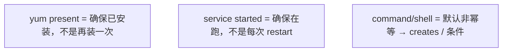
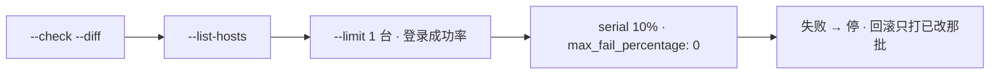
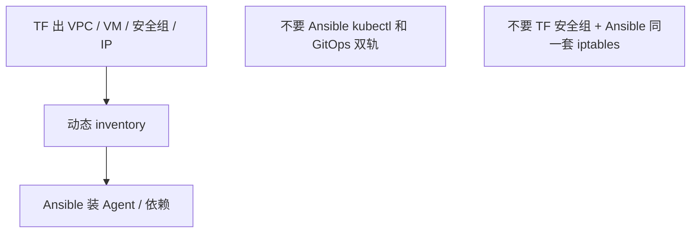
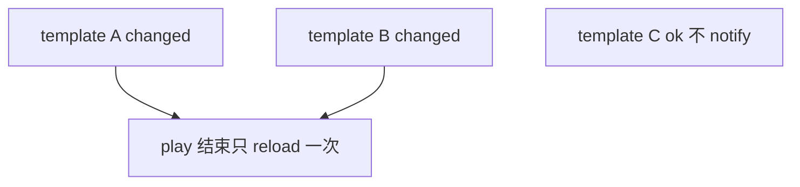
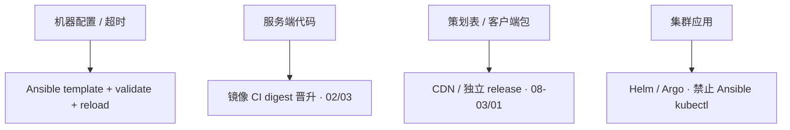

# 06｜Ansible · 练习题

开始做题前，先给大家一个小建议：合上知识点，对着**本章主线**（先预演 → 控批量 → 保幂等）口述一遍。关键字（幂等、Handler、serial、Vault、AWX）要能点名。能顺下来，下面这些题你会发现大半都会了；卡壳的地方，就是你该回去重读的那一节。

做题的方式也建议改一下：每道题**先看标题和场景，自己口述一遍答案，再往下看「完整解答」对答案**。直接看解答，容易产生「我会了」的错觉——能讲出来才是真的会。每题标了覆盖范围：

| 标记 | 含义 |
|------|------|
| **核心** | 不懂整章就没建立起来 |
| **必会** | 值班和面试都要能讲 |
| **常用** | 线上会反复碰到 |
| **常考** | 白板和追问的高频口径 |

题目的顺序也是有意排的：Q1～Q4 先钉对象、幂等、handler、批量；Q5～Q9 展开性能与分工；Q10～Q14 是分流与综合。

## 本题目录

- [Q1 幂等](#q1)
- [Q2 批量风险](#q2)
- [Q3 Terraform 分工](#q3)
- [Q4 Handler](#q4)
- [Q5 Template vs Copy](#q5)
- [Q6 慢 / 失败 / forks](#q6)
- [Q7 Vault / AWX](#q7)
- [Q8 回滚 / 动态 inventory](#q8)
- [Q9 Role](#q9)
- [Q10 热更和 CI 怎么拆](#q10)
- [Q11 idempotency 验收](#q11)
- [Q12 dynamic inventory 挂了](#q12)
- [Q13 serial 与 canary](#q13)
- [Q14 60 秒 Ansible 定责](#q14)
- [合上书](#合上书)

---

## Q1

**★★★★★｜幂等是什么？怎么保证？第二次还一堆 changed 查什么？**

**覆盖**：核心 · 必会 · 常考

**对应**：知识点 [三、原理](知识点.md)

### 场景

同一 playbook 当巡检每小时跑。每次都有几十个 changed，逻辑服被 restart，长连接抖动。

先自己试试：四个对象各干什么？白板能画出来吗？

### 完整解答

> 🎯 **一句话**：幂等 = 第二次跑 changed=0；command 无 creates、模板时间戳是常见脏 changed 源。

同一 Playbook 第二次应 `changed=0`。用模块 `state=`，少用 command；非用不可加 `creates`。CI 连跑两次断言幂等。



`--check --diff` 预演。每次 deploy 都 restart 会抖有状态服。第二次仍 changed：command 无 creates、template 里时间戳 / 随机数 / 行尾空白、权限被改漂。第二次跑不是 0 changed 就不要定时当巡检。

### 再追问

- check 绿、真跑挂？——check 覆盖不全，custom module 可能空跑。金丝雀不能省。

---

## Q2

**★★★★★｜批量变更如何控风险？serial 10% 仍全挂说明什么？**

**覆盖**：核心 · 必会 · 常考

**对应**：知识点 [三、原理](知识点.md)

### 场景

活动前改登录服 nginx 配置。有人 `hosts: all` 直接跑。inventory 里混着 prod。timeout 写成了 0，一千台还在继续。

先自己试试：第二次 changed≠0 查哪三因？巡检应为几？

### 完整解答

> 🎯 **一句话**：批量变更 check→list-hosts→limit 1→serial；serial 10% 仍全挂说明配置本身错。

这是 Q1 四个对象之后的硬考点——第二次跑还 changed，说明写的是脚本不是状态。



一台失败即停。回滚 playbook 对称。避开游戏高峰。`serial 10%` 仍全挂：配置本身错，先 1 台看业务，不要迷信百分比。高峰减 forks，SSH 和玩家抢 fd / CPU。`--limit prod:&web` 交集要能算。`hosts: all` 配错环境文件会打到 prod。

### 再追问

- `--limit staging` 写成空？——可能变成全量。任何生产 play 先 `--list-hosts`。

---

## Q3

**★★★★★｜Ansible 和 Terraform 怎么分工？能不能两边都改安全组？**

**覆盖**：核心 · 必会 · 常考

**对应**：知识点 [六、命令与操作](知识点.md)

### 场景

TF 管安全组。有人用 Ansible 再改同一批 iptables，「两边都是对的」，线上规则却乱。K8s 里还有人 Ansible kubectl。

先自己试试：Handler 和普通 task 差在哪？逻辑服能不能 restarted？

### 完整解答

> 🎯 **一句话**：TF Day 0 云资源，Ansible Day 1+ 装软件；禁止两工具写同一属性，K8s 应用走 GitOps。

TF Day 0 云资源；Ansible Day 1+ 装软件改配置。禁止两个工具写同一属性。



K8s 应用交给 Helm / Argo。drift 一旦形成，plan 和 play 都绿、线上是乱的。selfHeal 会把 Ansible 热修打回去。

### 再追问

- 和 Salt / Puppet？——无 Agent 上手快；大规模 pull、实时性 Salt 更强。游戏厂批量配置 Ansible 通常够用。

---

## Q4

**★★★★☆｜Handler 和普通 task 差在哪？逻辑服能不能 state=restarted？**

**覆盖**：核心 · 必会 · 常用

**对应**：知识点 [三、原理](知识点.md)

### 场景

三个 template 各 notify 一次 restart。一次发布逻辑服重启三次，战斗长连接掉光。

先自己试试：批量顺序是什么？limit 写空会怎样？serial 10% 仍全挂说明什么？

### 完整解答

> 🎯 **一句话**：Handler 只在 changed 时 notify，同一 play 只 reload 一次；逻辑服禁止无脑 restarted。

仅 changed 时 notify，一个 play 里同一 handler 只跑一次。用 reload 不是 restart。



游戏逻辑服重启要摘流量，写进 role，别让人改成 restarted。需要中间立刻生效才 `flush_handlers`。`validate: 'nginx -t -c %s'` 通过才替换。

### 再追问

- `service: restarted` 每次都 changed？——对，它不是幂等「保持运行」，是每次抖一下。巡检里这是事故。

---

## Q5

**★★★★☆｜Template vs Copy？每次 template 都 changed？**

**覆盖**：必会 · 常用

**对应**：知识点 [三、原理](知识点.md)

### 场景

nginx.conf.j2 里写了构建时间。每次 play 都 changed，handler 跟着 reload。

先自己试试：pipelining / forks / facts 怎么排？高峰能不能加 forks？

### 完整解答

> 🎯 **一句话**：Template 渲染变量要 validate；Copy 原样拷；模板里时间戳会让每次 changed。

Template 渲染变量；Copy 原样拷文件。配置用 template 并 `validate`（`nginx -t -c %s` 先校验再替换）。证书 / 二进制用 copy。

每次都 changed：模板里有时间戳、随机数，或行尾空白不稳定。改掉再跑两次验幂等。变量优先级：`-e` > play vars > host / group_vars > role defaults。

### 再追问

- validate 失败会不会把坏配置写上去？——`validate` 通过才替换。这是防止「全量 reload 坏配置」的最后一道。

---

## Q6

**★★★★☆｜执行慢 / 失败怎么查？高峰期能不能加大 forks？**

**覆盖**：必会 · 常用

**对应**：知识点 [六、命令与操作](知识点.md)

### 场景

打 800 台要 40 分钟。有人把 forks 调到 200。登录服 sshd 打满，玩家进不去。另一台 UNREACHABLE。

先自己试试：回滚怎么和发布对称？已改主机怎么点名？

### 完整解答

> 🎯 **一句话**：慢用 pipelining + 合理 forks；高峰减 forks；UNREACHABLE 先查连通性和 vault 解密。

慢：pipelining（ROI 最高）、ControlMaster、forks 到 20 量级、关 facts、fact cache。不要一次 1000 台。

失败：`-vvv`、limit 单台、手动 SSH。UNREACHABLE 先连通性。变量坑常是 vault 未解密。高峰减 forks、错峰，不要加 forks。

### 再追问

- fact 采集拖死？——关 gather 或 cache；不要每个 task 都 setup。

---

## Q7

**★★★★☆｜敏感变量怎么存？AWX 解决什么？**

**覆盖**：必会 · 常用 · 常考

**对应**：知识点 [六、命令与操作](知识点.md)

### 场景

group_vars 里明文数据库密码已经进 Git。有人用自己笔记本直接打 prod。

先自己试试：动态 inventory 挂了怎么办？

### 完整解答

> 🎯 **一句话**：敏感变量 Vault 加密不进 Git；AWX 给 RBAC/审计/审批，prod 不要笔记本直打。

Vault 加密，密码不进 Git，CI 注入 vault 密码文件。泄漏当事故 rotate，历史用重写工具清。prod 密码永远不进 role defaults。

AWX：RBAC、审计、审批，从笔记本变成变更平台。不要和 Jenkins 两处都能无审批打 prod。Jenkins 适合构建；变更审计在 AWX 更完整。

### 再追问

- `host_key_checking = False`？——生产用已知 host key。关掉等于接受中间人。

---

## Q8

**★★★☆☆｜回滚怎么设计？动态 inventory 挂了呢？**

**覆盖**：必会 · 常用

**对应**：知识点 [六、命令与操作](知识点.md)

### 场景

新包有问题。rollback playbook 要拉旧包，制品库里已经被 GC。云 API 超时，动态 inventory 空的。`any_errors_fatal` 中途停了。

先自己试试：Vault 解决什么？密码能进 role defaults 吗？

### 完整解答

> 🎯 **一句话**：回滚 playbook 和发布对称（limit/serial）；动态 inventory 挂了就靠静态备份名单。

`-e app_version=旧版` 或独立 rollback playbook，同样 limit → serial。包必须还在制品库（03）。schema 不可逆时只回代码不够。有状态先摘流量。

动态 inventory 挂了：准备静态备份名单，否则故障时连主机列表都没有。`any_errors_fatal` 中途停，已改主机记账，回滚只打这批。

### 再追问

- 回滚 playbook 和发布不对称？——limit / serial / handler 必须同一套，否则回滚比发布还猛。

---

## Q9

**★★★☆☆｜Role 怎么拆？第三方 galaxy 怎么引？**

**覆盖**：必会 · 常用

**对应**：知识点 [六、命令与操作](知识点.md)

### 场景

一个 role 里写死了 prod 密码和 region。galaxy 上随便下一个 nginx role，没 pin 版本。

先自己试试：和 Terraform / GitOps 怎么分工？改超时走谁？

### 完整解答

> 🎯 **一句话**：Role 拆 defaults/tasks/handlers/meta；第三方 galaxy pin 版本，密码不进 defaults。

```
defaults     可覆盖，不放密码
tasks        install → configure → service
handlers     reload
meta         依赖 pin 住
```

Molecule / CI 跑两次验幂等。只引内部源；第三方 pin 版本。环境差用 group_vars / `-e`，不要写死在 role 里。Role 对外只暴露 defaults。

### 再追问

- 巡检 changed 数不是 0？——先别定时跑。幂等没做完的巡检就是周期性故障。

---

## Q10

**★★★☆☆｜改登录超时该走 Ansible 还是镜像 CI？游戏热更怎么拆？**

**覆盖**：必会 · 常考

**对应**：知识点 [三、原理](知识点.md)

### 场景

运营要改登录超时。有人准备改代码走完整镜像流水线。另有人 Ansible kubectl apply 热修，Argo 开着 selfHeal。策划表在业务镜像里，CDN 热更包已经出去。

先自己试试：六个现象各先走哪条？哪条不该先加 forks？

### 完整解答

> 🎯 **一句话**：改超时走 Ansible template+validate+reload；集群应用禁止 Ansible kubectl 双轨。

这张表把前面 Q2～Q9 串起来了——不要先加 forks。



活动中途改登录超时：limit 一台 → 看登录成功率 → serial。逻辑服禁止无脑 restart。热更包已经在 CDN 上的，Ansible 改不了客户端缓存。不要为改超时重新 build 镜像。

### 再追问

- Ansible kubectl 热修最快？——GitOps selfHeal 会打回来。集群应用不走 Ansible。

---

## Q11

**★★★★☆｜第二次 playbook 仍 changed≠0，你怎么验收幂等？**

**覆盖**：必会 ｜ **对应**：知识点 [1. 幂等](知识点.md)

### 场景

nginx 配置 playbook 每次跑都 changed。

先自己试试：AWX 解决什么？谁能跑 prod inventory？

### 完整解答

> 🎯 **一句话**：连跑两次第二次应 0 changed；否则 command/shell 没 creates/removes；用 template+notify。

```bash
ansible-playbook site.yml && ansible-playbook site.yml # 第二次应全 ok
```

### 再追问

逻辑服能 handler restart 吗？——**不要**批量 restarted，用 reload+摘流（Q4）。

---

## Q12

**★★★★☆｜动态 inventory 源挂了，批量变更还能 `--limit` 吗？**

**覆盖**：必会 ｜ **对应**：知识点 [8. 回滚 / 动态 inventory](知识点.md)

### 场景

CMDB API 超时，playbook 拿到空列表。

先自己试试：any_errors_fatal 和 max_fail 怎么配？

### 完整解答

> 🎯 **一句话**：静态 emergency inventory；`--limit` 空=全员是事故；先 `--list-hosts` 肉眼确认。

```bash
ansible-playbook site.yml --list-hosts
```

### 再追问

Terraform 刚扩了机，Ansible 怎么接？——动态 inventory 或 TF 输出静态清单（Q3）。

---

## Q13

**★★★★☆｜serial 10% 仍全挂，说明什么？**

**覆盖**：必会 ｜ **对应**：知识点 [2. 批量风险](知识点.md)

### 场景

10 台一批，第一批 10 台全挂。

先自己试试：check 绿就能全量吗？

### 完整解答

> 🎯 **一句话**：根因在 playbook 本身，不是批量参数；先 `--limit` 1 台验证再扩。

```yaml
serial: "10%"
```

### 再追问

高峰加 forks 行吗？——**不要**，逻辑服会被打满（Q6）。

---

## Q14

**★★★★★｜changed 爆炸、handler 没跑、Vault 解密失败，60 秒**

**覆盖**：核心 · 必会 ｜ **对应**：知识点 [6. 慢 / 失败 / forks](知识点.md)

### 场景

全量 changed；nginx 没 reload；Vault password 错。

先自己试试：60 秒：打偏、幂等、UNREACHABLE 各先查什么？

### 完整解答

> 🎯 **一句话**：changed→查模块；handler→only once 被 skip；Vault→--ask-vault-pass/AWX credential。

见 Q4/Q7。

### 再追问

改 nginx 超时为什么要 Ansible 不是镜像 CI？——配置热更通道（Q10、01）。

---

## 合上书

和知识点「合上书」逐条对齐——卡住的那一条，回到对应小节 / 题号再练一遍：

- [ ] **口述幂等**：第二次 changed=0，并能查 command / 时间戳 / 权限漂（对应知识点 §3.1 · Q2）
- [ ] **口述批量**：check → list-hosts → limit 1 → serial，limit 空当全量（§3.3 · Q4、Q10）
- [ ] **口述 Handler**：只 reload 一次，逻辑服禁止 restarted（§3.2 · Q3）
- [ ] **口述分工**：TF Day 0、Ansible Day 1+、K8s 不走 kubectl 双轨（§3.4 · Q9）
- [ ] **口述救人**：慢（pipelining，高峰减 forks）、Vault/AWX、回滚对称、静态备份名单（§5～§6 · Q5、Q6、Q8）
- [ ] **口述拆分**：改超时、出镜像、热更包、集群应用拆到 Ansible / CI / CDN / GitOps（§3.4 · Q9、Q14）

六条都能口述，开头那个 `hosts: all`、restart、加 forks 的现场，你就能拦住了。
