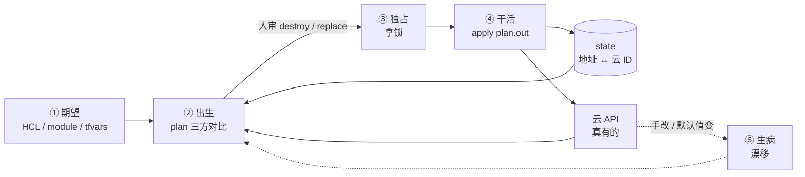
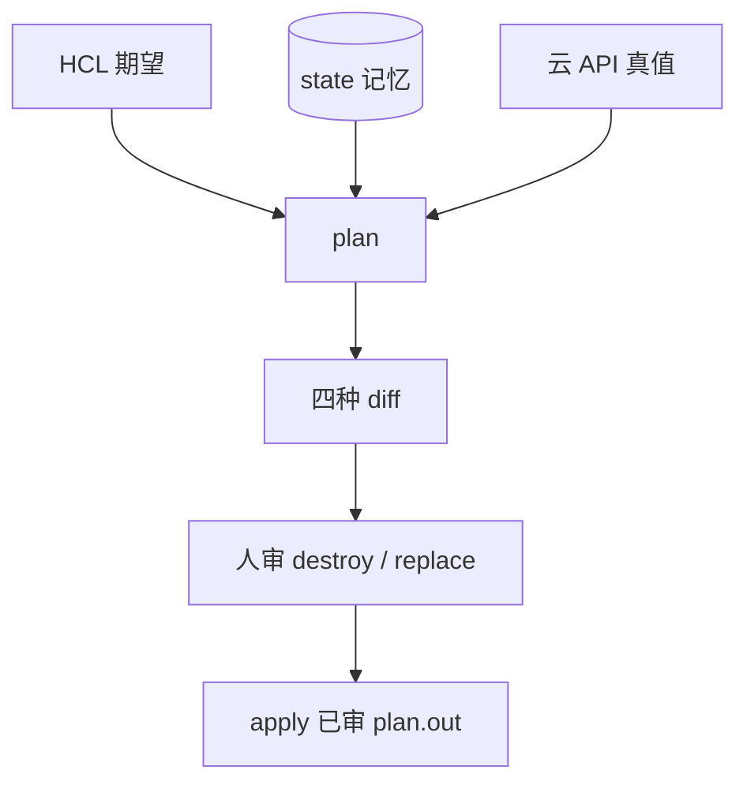
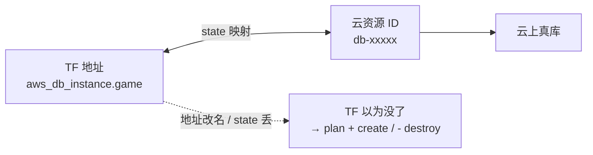
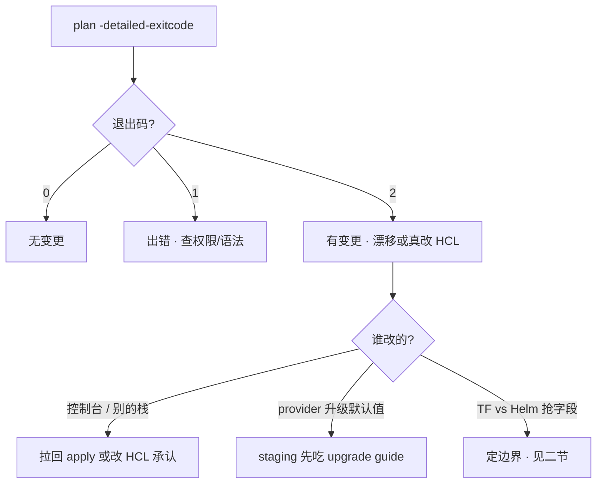
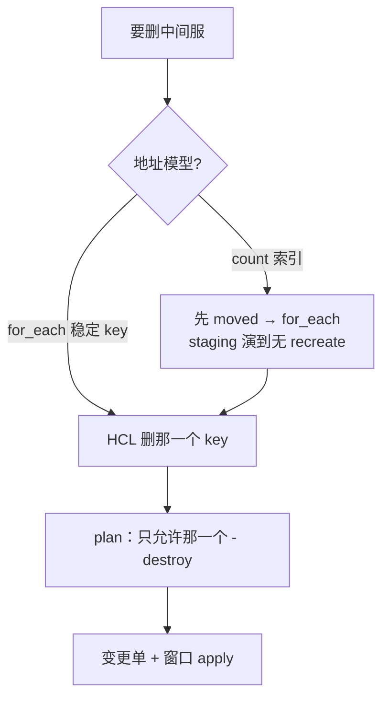
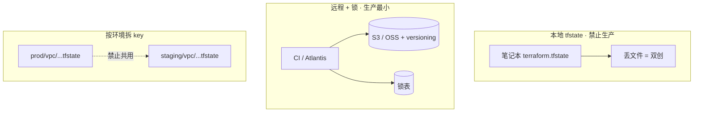
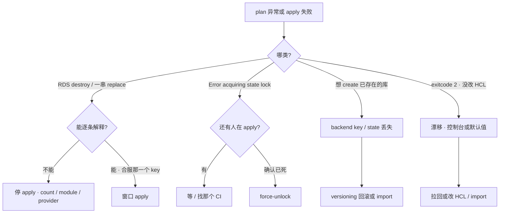

# Terraform

> 合服窗口，`terraform show plan.out` 里 RDS `will be destroyed`。有人准备 `apply -auto-approve`。另一次 CI 被 kill，下一个人要把 `force-unlock` 写进自动重试——两刀都能把库删没或把 state 改烂。
> **本章回答**：一次云资源变更从 plan 到 apply 会经历什么——三方怎么对、state 丢了怎样、锁谁拿谁放、漂移怎么治、合服用 for_each 还是 count。
> **不讲**：装包、渲染配置、滚动 reload → [06 Ansible](../06-Ansible/)；集群内发布、GitOps → [03-23](../../03-Kubernetes/23-GitOps-ArgoCD与Tekton/)；IAM / 多账号 → [06-04](../../06-云平台/04-IAM与多账号/)；制品、镜像 → [03](../03-制品与镜像/)；变更窗口 → [08](../08-运维平台与Oncall/)。

**标记**：🎯重点 · 🔥难点 · ⭐常考 · 🔧实操
---

## 一、一张图：一次变更的一生

> 🎯 **一句话**：HCL 期望、state 记忆、云 API 真值——plan 是三方对比的产出物；apply 只执行已审那一份。



- 📖 **读图**
  - 🛤️ 主线：期望 → plan → 人审 → 拿锁 → apply → 回写 state / 改云；**没有**「跳过已审 plan 直奔 apply」的箭头
  - 🧠 state 是记忆不是备份；云上真墙被控制台改过 → 下次 plan 看见漂移（六节）
  - 📌 值班第一刀永远是 `show plan.out | grep destroy|replace`，不是 `-auto-approve`

- 🔑 **三个词**（后文反复用）
  - **HCL** = 你想要的：资源类型、属性、module、var
  - **state** = TF 记得的：地址 ↔ 云资源 ID、上次属性
  - **云 API** = 真有的：控制台、别的栈、人工改过的

- 🗺️ **排障就按这三步想**
  1. **审 plan**：`- destroy` / `-/+ replace` 逐条能解释，生产禁止 `-auto-approve`
  2. **拿锁放锁**：state 锁谁拿谁放，`force-unlock` 当事故
  3. **对三方**：漂移先找谁改了控制台

> ⭐ **记住**：plan 是产出物；CI 禁止 `apply` 不带已审 plan；从未审过的 plan 禁止 apply；`destroy` 生产几乎不用；`apply -auto-approve` 生产禁用。

本节对应练习题 Q1。

---

## 二、边界：TF / Ansible / Helm 谁管什么

> 🎯 **一句话**：TF 管集群外云资源生命周期；Ansible 管机器状态；Helm / Argo 管集群内工作负载——同一对象只许一边管。

| 角色 | 管什么 | 不管什么 |
|------|--------|----------|
| **Terraform** | VPC、子网、EKS/ACK、RDS、对象存储、节点组 | 机器里装包、集群内 Deployment 日常发布 |
| **Ansible** | 装包、渲染配置、滚动 reload（[06](../06-Ansible/)） | 云资源创建/销毁的主真相 |
| **Helm / Argo** | Deployment、游戏 ConfigMap、HPA（[03-23](../../03-Kubernetes/23-GitOps-ArgoCD与Tekton/)） | 用 kubernetes provider 再管一遍同一 Deployment |

#### ❓ 为什么 TF 和 Helm 不能管同一 Deployment？

- ❌ **两边都管**：TF plan 每次都脏；若团队还把 YAML 放 Git、用同步工具自动 apply（GitOps，如 Argo CD，见 [03-23](../../03-Kubernetes/23-GitOps-ArgoCD与Tekton/)），selfHeal 再打一遍 → 字段轮流被改回
- ✅ **定边界**：集群外（VPC / 节点组 / RDS）归 TF；集群内 YAML 归 Helm / GitOps
- 🚨 紧急可以控制台改，事后必须 import / 改 HCL，否则下次 apply 把热修打回去

> 💡 **打个比方**：HCL 是装修图纸，state 是施工队手里的「哪面墙对应哪个房间号」，云 API 是现场真墙。图纸改了房间号，施工队以为旧墙要拆、新墙要砌——墙上人还在，只是对不上号了。

- 🧩 Crossplane / Pulumi 知道即可——考点仍是 **state / 锁 / 漂移**，换语法不换问题

> 📝 **面试**：「TF 管集群外，Helm 管集群内，不抢同一 Deployment；plan 读 HCL/state/云 API 三方，apply 只执行已审 plan.out。」⭐

本节对应练习题 Q7。道选清了，变更要「出生」——plan 到底在比什么？

---

## 三、出生：plan 三方对比 🎯⭐

> 🎯 **一句话**：plan 读三方、产出四种 diff；值班只盯 `- destroy` 和 `-/+ replace`，逐条能解释才过。



- 📖 **读图**
  - 三方缺一就会算错：只看 HCL 不知道线上还在；只看 state 不知道手改；只看云不知道地址映射
  - apply **不读「你脑子里的意图」**，只执行已审那份 plan

### 🧾 四种 diff 不要混

| diff | 含义 | 值班怎么看 |
|------|------|------------|
| `+ create` | 期望有、state 无 | 线上已有同名库？可能 state 丢了或 key 打错 |
| `~ update` | 可变属性不一致 | in-place，一般可逆；仍要看会不会断连接 |
| `- destroy` | state 有、HCL 没了 | **可能删库**，逐条能解释才过 |
| `-/+ replace` | 不可变属性变了，先删后建 | 和 destroy 同等对待 |

- 🗺️ **群里一句话 → 你的第一刀**
  - 「plan 里 RDS 要 destroy」→ **停 apply**，`grep` destroy / replace
  - 「想 create 已存在的库」→ 核对 backend key、versioning 回滚或 import（四节）
  - 「Error acquiring state lock」→ 看 CI / 同事是否还在跑（五节）
  - 「plan 每次都脏」→ 漂移或 TF 与 Helm 抢同一资源（二节、六节）

#### ❓ 为什么 apply 必须带已审 `plan.out`，不能当场再 plan 偷跑？

- 📦 **plan 是快照**：人审的是那一版三方对比结果
- 🧨 **中间又改 HCL**：当场再 plan 可能多出没人看过的 destroy
- ✅ **正确姿势**：`plan -out=plan.out` → 人审 → `apply plan.out`；plan 与 apply 之间禁止改 HCL 再偷跑

```bash
terraform plan -var-file=prod.tfvars -out=plan.out
terraform show -no-color plan.out | grep -E 'will be destroyed|must be replaced'
# 无输出 = 没有 destroy/replace（仍要人审 change）
# 有 RDS destroy → 停，开会：count 移位 / module 改名 / 真要删？
terraform apply plan.out
```

```text
Plan: 1 to add, 2 to change, 0 to destroy.
# grep 无输出 = 本份 plan 没有 destroy/replace
aws_db_instance.game
aws_security_group.rds
```

- 🔍 **现场**：合服窗口再短，也不要用 `-auto-approve` 跳过 grep。出现 unexpected destroy：**不要 apply**——开会问是 count 移位、module 地址变了、还是真要删那个 for_each key。
- 🎯 `-target` 只修局部会让其余漂移累积，变更单要写清；观测每次 plan 的 add / change / destroy 数、lock 冲突次数、drift job 是否全 0

> ⚠️ **别混**：`+ create` 不等于「新建就安全」——同名库已在云上时，再 apply 会双创或撞名。`fmt`/`validate` 过了 ≠ plan 安全。

> 📝 **面试**：「我先把 plan 当产出物审 destroy 和 replace，apply 只执行已审 plan.out。」⭐（练习题 Q1）

本节对应练习题 Q1、Q13。plan 审过了，记忆从哪来？

---

## 四、记忆：state 地址 ↔ 云 ID 🔥⭐

> 🎯 **一句话**：state 不是云备份，是地址到云 ID 的映射；地址变了 TF 就当旧资源没了。

> 💡 **打个比方**：像快递单号绑手机尾号——单号从 `[2]` 改成 `["s3"]`，系统以为旧包裹要销毁、新包裹要新建，其实仓库里那台 RDS 还在。



- 📖 **读图**
  - state 只记「这个地址对应哪个 ID」；**不是**把 RDS 数据备份了一份
  - 地址变了或 state 空了 → TF 当旧资源消失 → 危险的 create / destroy 全从这儿来

### 🧨 state 丢了会怎样

#### ❓ 为什么 state 丢了再 apply 不能「对齐」？

- ❌ **错答**：「丢了再 apply 就能对齐」
- ✅ **真相**：state 空 → plan 全是 `+ create` → 云上同名资源还在 → **双创**或撞名冲突、两套账单
- 🩹 **修法二选一**：backend versioning 回滚上一版 state；或写齐 HCL 后 `import`，再 plan 到接近 `No changes`

```bash
grep -A5 'backend "s3"' versions.tf
terraform state list | head -5
# key = "prod/rds/terraform.tfstate"
# state list 为空，或没有 aws_db_instance.game  ← 记忆丢了

aws rds describe-db-instances --db-instance-identifier game-db \
  --query 'DBInstances[0].DBInstanceIdentifier' --output text
# game-db  ← 云上还在，禁止 apply create

# A：bucket versioning 回滚 state
# B：写齐 HCL 后
terraform import aws_db_instance.game game-db
terraform plan -var-file=prod.tfvars -out=plan.out
# 应接近 No changes；若一堆 ~ update → 补 HCL 属性对齐云真值
```

- 🔍 **现场**：`state list` 空 + plan `+ create` 同名库 → 先查 key / versioning，**不要 apply**。
- 🏭 **prod / staging 分 key**：一份 state 两套 tfvars = 切错等于打生产；本地 `terraform.tfstate` 禁止上生产

### 🔀 三个口误：refresh / state rm / destroy

#### ❓ 为什么 refresh、state rm、destroy 不能当成「同一种下线」？

| 动作 | 改云？ | 改记忆？ | 一句话 |
|------|--------|----------|--------|
| `refresh` / `plan -refresh-only` | ❌ | ✅ | 只更新记忆，**不改云** |
| `state rm <addr>` | ❌ | ✅（删映射） | 不管这资源了，**云上还在** |
| `destroy` / plan 里的 `- destroy` | ✅ | ✅ | **真删云资源** |

- ⚠️ 想「下线一台」却跑了 `state rm`——云上还在，下次别人 import 才发现双管
- ⚠️ HCL revert **拉不回**已经 destroy 掉的库——云资源一旦删，Git 回滚没用
- 📦 **地址变了**（count → for_each、module 改名）：用 `moved`，不要靠 destroy + create

### 📥 import 存量 🔧

#### ❓ 为什么不能「再 create 一次」把已有库纳管？

- ❌ 云上已有同名库再 `+ create` → 撞名失败或双创
- ✅ **先写齐 HCL** → `import <addr> <id>` → plan 修到无 diff（或只剩可解释的 `~`）
- 📦 存量分批：网络 → 计算 → 数据库，每批 plan 到 0 再下一批；半失败 apply：按资源一块块修，不要盲目 destroy 清场

```bash
terraform import aws_db_instance.game game-db
terraform plan -var-file=prod.tfvars -out=plan.out
# No changes. Infrastructure is up-to-date.  ← 纳管成功
```

> ⭐ **记住**：state 丢了会双创。prod / staging **分 key**。地址重构用 `moved`。import 是绑映射，不是再创一套。

> 📝 **面试**：「state 是地址到云 ID 的映射不是备份；丢了再 apply 会双创。refresh 只改记忆，state rm 不删云，destroy 才真删。」⭐（练习题 Q2、Q8、Q12）

本节对应练习题 Q2、Q8、Q12。记忆在远程，并发谁碰？

---

## 五、独占：锁谁拿谁放 🔥⭐

> 🎯 **一句话**：apply 期间独占同一份 state；锁残留要确认没人跑再 unlock，不能当 CI 第一刀。

> 💡 **打个比方**：像银行保险库——一个人在里头办业务时外面排队；人猝死了钥匙还在锁里，得确认里面真没人才能撬，不能两个柜员同时进去改同一本账。

#### ❓ 为什么不能把 `force-unlock` 写进自动重试？

- 🧟 **还有人在 apply**：你 unlock → 两个栈同时改 → state 冲突、云资源改烂
- ✅ **先查**：Lock Info 里的 `Who` / `Operation` / `Created`；Jenkins 蓝球、Atlantis 页面、那台 runner
- ✅ **确认进程已死**，再 `force-unlock <LOCK_ID>`；生产禁止 `-lock=false`
- 🚫 unlock **之后**仍要重新审 destroy/replace，再 `apply plan.out`

```bash
cd env/prod/vpc && terraform plan -var-file=prod.tfvars
```

```text
Error acquiring the state lock
Lock Info:
  ID:        a1b2c3d4-e5f6-7890-abcd-ef1234567890
  Path:      tf-state/prod/vpc/terraform.tfstate
  Operation: OperationTypeApply
  Who:       atlantis@ci-runner-03
  Created:   2026-08-28 13:58:22 +0800 CST
# ← Who / Operation 对上你的 CI 还在跑？Created 是否刚被 kill？
```

```bash
# 确认 runner / Atlantis 已死后再：
terraform force-unlock a1b2c3d4-e5f6-7890-abcd-ef1234567890
terraform plan -var-file=prod.tfvars -out=plan.out
# 重新审 destroy/replace → apply plan.out
```

- 🔍 **现场读 Lock Info**
  - `Who` / `Operation` → 是不是你的 CI 还在 apply
  - `Created` → 是否刚被 kill（几分钟内）
  - unlock 后若又双 apply → state 冲突、云资源改烂

#### ❓ 为什么锁挡不住控制台手改？

- 🔒 **锁防的是**：同一份 state 的并发 apply
- 🖐️ **挡不住的是**：控制台手改、别的栈、人工点按钮 → 那是**漂移**（六节），不是 lock 问题
- 🚨 两个 CI 同时 apply 同一 state **应被锁拦住**；没拦住 = `-lock=false` 或锁表没配上

> 📝 **面试**：「lock 报错我先对 Who 和 CI 流水线，确认没人 apply 再 force-unlock；生产禁止 -lock=false 和自动 unlock。锁防并发 apply，不防控制台手改。」⭐（练习题 Q3）

本节对应练习题 Q3。锁挡住了并发，真墙被手改过呢？

---

## 六、生病：漂移 🔥⭐

> 🎯 **一句话**：云 API 实际 ≠ state 记忆时，plan 要改回去或改 HCL 承认变更——口诀：漂移先找谁改了控制台。

> 💡 **打个比方**：装修队按旧图纸记忆刷白墙，业主在控制台偷偷贴了壁纸——下次来对账，要么撕壁纸刷白，要么改图纸承认壁纸。



- 📖 **读图**
  - drift job 盯的是 **2**；别把 shell 失败码 1 当成「有漂移」
  - 分叉在「谁改的」：手改 / 默认值 / 两边抢——治法不同

### 🔭 怎么发现

```bash
terraform plan -detailed-exitcode -var-file=prod.tfvars -no-color
echo $?
# 0 = 无变更 · 1 = 出错 · 2 = 有变更  ← drift job 盯的是 2
```

```text
# aws_instance.logic[0] will be updated in-place
  ~ instance_type = "t3.medium" -> "t3.large"
Plan: 0 to add, 1 to change, 0 to destroy.
2
# ← 没人改 HCL 却 exit 2：控制台手改或 provider 默认值变了
```

#### ❓ 为什么控制台改完，下次 plan 不会「自动认」？

- ❌ **错想**：「手改过了，下次 plan 会跟着认」
- ✅ **真相**：plan 拿 **HCL 期望** 去对齐云真值——要么 apply 把云拉回 HCL，要么改 HCL 承认变更；不会默默改图纸
- 🩹 紧急控制台改了 → 事后必须 import / 改 HCL，否则下次 apply 把热修打回去

- 🗺️ **发现之后**
  - apply 拉回 HCL 声明
  - 改 HCL + 变更单承认 large
  - 对云控制台 / 审计：谁把机型从 medium 改成 large；安全组是否有人放行 `0.0.0.0/0`

- 🧯 `lifecycle { ignore_changes = [...] }` 只对那些属性不再管——**滥用 = 声明和线上永久分叉**
- 🛡️ 预防：IAM 不让人在控制台改 TF 管的资源；变更走 PR。长期靠流程，不靠人自觉
- 📊 退出码 2 且大量 in-place、没改 HCL → 先怀疑 provider 大升级默认值变了，staging 先吃

> ⚠️ **别混**：锁残留 ≠ 漂移。前者是并发 apply；后者是三方对不上。exitcode **2** 才是「有变更」，别和 shell 失败码 1 混。

> 📝 **面试**：「漂移用 plan -detailed-exitcode，2 表示有变更。要么 apply 拉回声明要么改 HCL；控制台紧急改了必须 import。ignore_changes 少滥用。」⭐（练习题 Q4）

本节对应练习题 Q4。合服要删中间服——地址怎么写才不会全炸？

---

## 七、合服：for_each vs count 🔥⭐

> 🎯 **一句话**：区服按稳定 `server_id` 用 for_each；count 删中间会导致后面索引全 replace。

> 💡 **打个比方**：四个服像四把椅子贴了 `[0][1][2][3]` 号——抽走 2 号椅，后面椅子全往前挪，系统以为 3、4 号椅要销毁重建；改成按名字 `s1 s2 s3 s4` 贴标签，只收走 `s2` 那一把。

```text
count 删中间：
  删前  [0]=s1  [1]=s2  [2]=s3  [3]=s4
  删 s2 后列表变短 → [0]=s1  [1]=s3  [2]=s4
  TF 看见：[1] 内容变了、[2] 内容变了 → replace；原 [1] 还要 destroy
for_each 删 key：
  删前  "s1" "s2" "s3" "s4"
  删 "s2" → 只动那一个地址，其它 key 不动
```

- 📖 **读图**：count 移位是**地址语义**事故，不是「云上真要重建四个库」；for_each 用稳定业务 ID 当地址。

#### ❓ 为什么合服用 count 会「后面全 replace」？

- 📐 **count 按索引**：删中间 → 后面元素整体前移 → 地址 `[2]` 里的内容变成原来的 `[3]` → TF 认为属性全变 → `-/+ replace`
- ✅ **for_each 按稳定 key**：删 `s2` 只动那一个地址，其它 key 不动
- 🛠️ **已经 count 了**：先 `moved` 迁到 for_each，staging 确认 plan 只有地址搬家、无 recreate，再生产删 key

```hcl
# 错误：count 按索引
resource "aws_db_instance" "servers" {
  count = length(var.server_list)  # 删中间 → 后面全移位
}
```

```bash
terraform plan -var-file=staging.tfvars -no-color | grep -E 'destroy|replace'
```

```text
# aws_db_instance.servers[1] will be destroyed
# aws_db_instance.servers[2] must be replaced
# aws_db_instance.servers[3] must be replaced
Plan: 0 to add, 0 to change, 4 to destroy.
# ← 停 apply。这是 count 移位，不是「合服只删一个」
```

```hcl
resource "aws_db_instance" "servers" {
  for_each = toset(var.server_ids)  # ["s1","s2","s3","s4"]
}

moved {
  from = aws_db_instance.servers[2]
  to   = aws_db_instance.servers["s3"]
}
```

- ✅ 合服删 `s2` 后 plan 应**只允许那一个** for_each key destroy；贴进变更单，窗口 apply
- 🛡️ 数据库加 `prevent_destroy`；ASG **不要加**（挡合法缩容）——见下节
- 📌 Module 单一职责，`source = "...?ref=v1.2.0"` **pin 版本**；不 pin = 和 npm latest 同类事故
  - plan 形态：一串 `-/+ replace` 同类型 RDS → count 移位或 module 地址变了
  - 仅一个 `- destroy` 对应删掉的 key → for_each 合服正确
  - unexpected destroy + module bump → `ref` 没 pin

### 收束：一次合服变更凭什么安全



- 📖 **读图**
  - 安全合服 = **地址稳定** + plan 只许一个 destroy
  - `prevent_destroy` 是闸，不是主流程——闸挡得住误操作，挡不住错误地址模型

> ⚠️ **别混**：一串同类型 RDS `-/+ replace` ≠「真要合服四个」——先怀疑 count 移位或 module 地址变了。窗口只有 10 分钟也**不要为了窗口去 apply 一串 RDS replace**。

> 📝 **面试**：「四个区服用 count 删第 2 个，后面索引全 replace。合服用 for_each 按 server_id，plan 只允许那一个 destroy；地址重构用 moved，module 必须 pin ref。」⭐（练习题 Q5、Q6）

本节对应练习题 Q5、Q6。机制钉住了，生产怎么摆 backend？

---

## 八、落地：backend、目录与 CI 🔧

> 🎯 **一句话**：远程 backend + 分环境 key + CI 只 apply 已审 plan.out。



- 📖 **读图**
  - 生产最小集 = 远程 state + versioning + 锁表；本地文件是事故温床
  - prod / staging **分 key**，不是「同一份 state 换 tfvars」

### 🏭 生产怎么选

- **state**：远程 S3/OSS + versioning + 加密；禁止本地 tfstate、禁止进 Git
- **锁**：DynamoDB / Tablestore，强制开；禁止 `-lock=false`
- **环境**：目录分离，key 含 `prod/` `staging/`；禁止一份 state 两套 tfvars
- **执行**：CI + 人工审 plan；Atlantis 评 PR；禁止笔记本 `apply -auto-approve`
- **边界**：TF 管云；Helm 管集群内（二节）
- **模块**：pin `ref=v1.2.0`，单一职责

```
env/prod/vpc/     + backend key=prod/vpc/terraform.tfstate
env/prod/rds/
env/staging/vpc/  + 另一份 key，禁止共用
```

```hcl
terraform {
  required_version = ">= 1.5"
  backend "s3" {
    bucket         = "tf-state"
    key            = "prod/vpc/terraform.tfstate"
    dynamodb_table = "tf-lock"
    encrypt        = true
  }
  required_providers {
    aws = { source = "hashicorp/aws", version = "~> 5.0" }
  }
}
```

- ☁️ 阿里云：OSS + Tablestore 锁。AWS：S3 + DynamoDB
- 🔐 CI 角色最小权限：不能 `rds:Delete*` 打到所有库；能读 state ≈ 能看资源 ID 和部分明文属性，backend 权限当机密

#### ❓ 为什么生产推荐目录分离，而不是 workspace 切环境？

- 🧭 Workspace 小项目可用；生产推荐**目录分离**——切错 workspace 等于拿 staging tfvars 打 prod backend
- ✅ 目录 + key 里写死 `prod/` / `staging/`，眼睛能看见、CI 路径也能锁死
- ⚠️ 「一份 state 两套 tfvars」省事 = 事故面

### 🚦 CI 流水线

```text
fmt -check → validate → plan -out=plan.out → 人审 / Atlantis 评 PR
     → apply 该 plan 文件（不要当场再 plan 一次不看）
```

- ✅ 验收：空变更是 `No changes`；有意变更能在 PR 里看到 destroy/replace
- 🧩 state 拆分：VPC 一个、数据库一个、计算一个，炸一个不拖全身

### ⚙️ 只动有证据的项

| 参数 / 块 | 生产怎么用 | 改错会怎样 |
|-----------|------------|------------|
| `backend.key` | 含环境名、stack 名 | 打到错环境 = 事故 |
| 锁表 | 必须有 | 没锁 = 双 apply |
| `required_providers` | 显式约束 | 默认值一变，大量 in-place |
| `module.source` `ref=` | pin tag / SHA | 不 pin 突然一堆 change |
| `lifecycle.prevent_destroy` | **只给数据库** | 加在 ASG 上，合法缩容被挡 |
| `lifecycle.ignore_changes` | 极少用、写进变更单 | 声明和线上永久分叉 |
| `for_each` | 区服、安全组按稳定 key | 改用 count 合服会移位 |
| `-lock=false` | 生产禁用 | 双 apply |

#### ❓ 为什么 `prevent_destroy` 不能加在所有资源上？

- 🗄️ **数据库**：误 destroy 不可逆 → 值得加闸
- 📈 **ASG / 节点组**：合法缩容也是 destroy 实例 → 加了会挡正常变更
- ✅ 正确主路径仍是**地址稳定**；合服 plan 只许那一个 for_each key

- 🎮 战斗服节点组变更必须进窗口；新区：`for_each` 一套 `server_id` 建库和安全组，Ansible 拿 output 里的 IP 装节点（[06](../06-Ansible/)）
- 🔐 敏感变量：tfvars 不进 Git；密码走 Vault / 环境注入

### 🔙 回滚

- HCL 回滚 = Git revert 后再 plan（仍要审 destroy）
- **云资源一旦 destroy，HCL revert 拉不回来**
- state 写坏：用 backend versioning 回到 apply 前那一版，再 plan
- **季度做一次「回滚上一版 state + plan」演练**

> ⭐ **记住**：`prevent_destroy` 是最后一道闸，不是流程。正确做法是地址稳定，合服 plan 只许那一个 for_each key。

本节对应练习题 Q6、Q9、Q11、Q13。现场炸了怎么 60 秒定责？

---

## 九、作战：排障定责 🔧

> 🎯 **一句话**：先分叉——destroy / 锁 / state 丢 / 漂移；`-auto-approve` 不是加快窗口能用的。

和变更三问同一套：改什么？影响什么？怎么回滚？**plan 里有 RDS destroy = 先停 apply，不是先抢窗口。**



- 📖 **读图**
  - 🚪 入口先问「哪一类」，不要一上来 unlock 或 `-auto-approve`
  - 🛤️ destroy 分支：不能解释 → 停；能解释且合服那一个 key → 窗口
  - 🔒 锁分支：有人在跑 → 等；确认已死 → unlock 后再审 plan

| 现象 | 先做什么 | 不要做什么 |
|------|----------|------------|
| RDS will be destroyed | 停 apply；查 count / module / provider | 为窗口 `apply -auto-approve` |
| lock 报错 | 有没有第二个 apply，再 unlock | 自动重试第一下就 unlock |
| 想 create 已存在的库 | backend key、state 是否丢；回滚或 import | apply 再创一套 |
| 大量 in-place | provider 升级默认值；staging 先吃 | 当无害全点过 |
| apply 中途失败 | 按资源修 state / import | destroy 清场 |
| plan 每次都脏 | TF vs Helm 边界 | 两边继续抢字段 |
| drift job 退出码 2 | 控制台手改或 ignore 漏了 | 关 drift job 当解决 |

### 60 秒剧本 🔧

> 🔍 **现场**：接到「plan 里有 destroy / lock 报错 / 想 create 已有库」，60 秒走完这条线再下结论。

```text
① 0–10s   停 apply / -auto-approve；看报错是 lock、create 已存在、还是 destroy
② 10–30s  destroy → show plan.out | grep destroy|replace，能否逐条解释
          lock → 对 Who / CI / Atlantis，是否还有 apply
          create 已存在 → grep backend key + state list
③ 30–45s  定型：A count/module 移位 · B 真合服那一个 key · C 锁残留 · D state 丢/key 错 · E 漂移
④ 45–60s  定责：A/D 停开会或回滚 state/import · B 贴变更单窗口 · C 确认已死再 unlock · E 拉回或改 HCL
```

- ✅ 合服 plan 除了目标服还出现另外三个 RDS destroy：停手开会。prevent_destroy 能挡一刀，但正确做法是地址稳定。

本节对应练习题 Q10、Q14。

---

## 十、收口

### 命令速查 🔧

```bash
terraform init
terraform fmt -check
terraform validate
terraform plan  -var-file=prod.tfvars -out=plan.out
terraform show -no-color plan.out | grep -E 'will be destroyed|must be replaced'
terraform apply plan.out
# 漂移
terraform plan -detailed-exitcode -var-file=prod.tfvars   # 0 无变更 · 2 有变更 · 1 出错
# 记忆
terraform state list
terraform state show <addr>
terraform state rm <addr>          # 不删云
terraform import <addr> <id>       # 绑已有 ID，再 plan 到 0
terraform plan -refresh-only       # 只刷新记忆，不改云
# 锁
terraform force-unlock <LOCK_ID>   # 确认没人 apply 再做；禁止 -lock=false
```

### 面试锚点

| 问 | 30 秒答 |
|----|---------|
| plan 读哪三方？盯什么？ | HCL / state / 云 API；盯 destroy 与 replace；apply 只执行已审 plan.out；禁 -auto-approve。 |
| state 丢了怎么办？ | 不是再 apply 对齐——会双创；versioning 回滚 state 或 import；prod/staging 分 key。 |
| refresh / state rm / destroy？ | refresh 只改记忆；state rm 不管资源、不删云；destroy 真删云。 |
| 锁残留怎么处理？ | 先对 Who 和 CI，确认没人 apply 再 force-unlock；禁自动 unlock 与 -lock=false。 |
| 漂移怎么发现、怎么治？ | plan -detailed-exitcode，2=有变更；拉回或改 HCL；紧急控制台改必须 import。 |
| count vs for_each？ | 合服会删中间 → for_each 按 server_id；count 删中间后面全 replace；用 moved 迁地址。 |
| TF 和 Helm 边界？ | TF 管集群外，Helm/Argo 管集群内，不抢同一 Deployment。 |
| prevent_destroy？ | 只给数据库；加在 ASG 会挡合法缩容；主路径仍是地址稳定。 |
| workspace vs 目录？ | 生产推荐目录分离 + key 含环境名；切错 workspace = 拿错 tfvars 打生产。 |
| 回滚？ | HCL revert 后再 plan；云已 destroy 拉不回；state 坏用 backend versioning。 |

### 易错一句话对照

- 生产可以 `apply -auto-approve` → 必须审 destroy / replace，apply 已审 plan
- state 丢了再 apply 就能对齐 → 会双创；回滚 state 或 import
- `state rm` 会删掉云上 RDS → 只是不管了，云上还在
- `refresh` 能回滚误改 → 只改记忆，不改云
- 4 个区服用 count，删第 2 个只删一个 → 后面索引全 replace
- 合服窗口不够可以先 apply 再说 → 误删库不可逆
- module 不 pin，跟 latest 即可 → 和 npm latest 同一类事故
- prod / staging 共用一份 state 省事 → 分 key；切错等于打生产
- 锁残留应立刻写进 CI 自动 unlock → 确认没人 apply 再 force-unlock
- TF 和 Helm 可以一起管同一 Deployment → plan 永远脏
- 控制台改完不用管，下次 plan 会认 → 要么拉回要么改 HCL / import
- `-lock=false` 能加快 CI → 生产禁用
- Crossplane 换了就不考 state → 考点仍是状态 / 锁 / 漂移
- `prevent_destroy` 应加在所有资源上 → 只给数据库；ASG 会挡合法缩容
- workspace 切环境就够了 → 生产用目录分离；切错 = 打生产

### 数字墙

> drift `detailed-exitcode` **2 = 有变更**（0 无变更，1 出错）· 合服 plan **只允许那一个** for_each key destroy · CI：`fmt → validate → plan → 审 → apply 该文件` · state 权限当机密 · backend key 必须含环境名 · module **pin ref** · `prevent_destroy` **只给数据库**

---

## 合上书

对着第一节主图口述一遍，卡住就回对应小节。开头那个 `apply -auto-approve` 和自动 unlock 的现场，现在该能拦住他了。

- [ ] **默画主图**：HCL / state / 云 API → plan → 人审 → 锁 → apply；漂移怎么绕回 plan。（→ Q1）
- [ ] **口述边界**：TF / Ansible / Helm 各管什么，为什么不能抢同一 Deployment。（→ Q7）
- [ ] **口述 plan**：四种 diff、为什么必须 `apply plan.out`、盯哪两种。（→ Q1 · Q13）
- [ ] **口述 state**：丢了为什么会双创；refresh / state rm / destroy 三口误；分 key 与 import。（→ Q2 · Q8 · Q12）
- [ ] **口述锁**：残留先问什么；为什么不能自动 unlock；锁防什么、不防什么。（→ Q3）
- [ ] **口述漂移**：exitcode 2、为什么 plan 不会自动认控制台、ignore_changes 为何少用。（→ Q4）
- [ ] **口述合服**：count 删中间为什么全 replace；for_each + moved 怎么走；plan 只许一个 destroy。（→ Q5 · Q6）
- [ ] **口述落地与回滚**：远程 backend、目录 vs workspace、prevent_destroy 边界、云已删为何 HCL revert 没用。（→ Q9 · Q11）
- [ ] **定责**：60 秒剧本五型（移位 / 真合服 / 锁 / state 丢 / 漂移）各先做什么。（→ Q10 · Q14）
