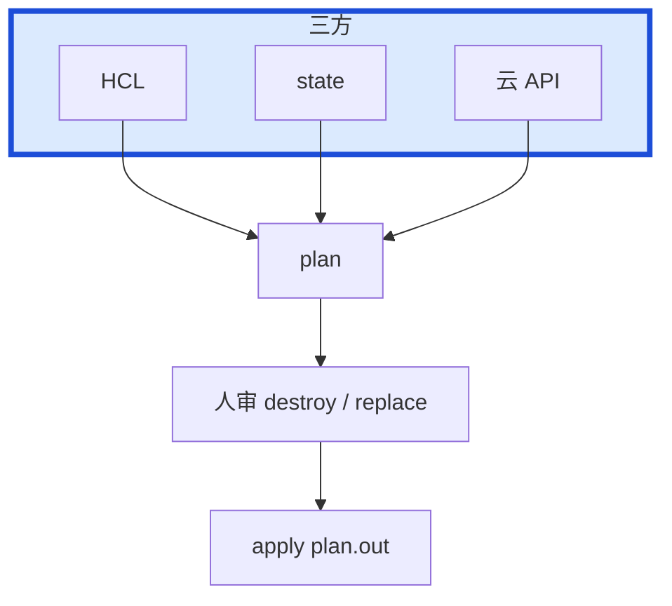
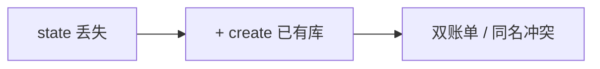
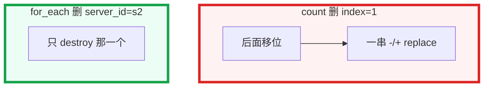

# 07｜Terraform · 练习题

开始做题前，先给大家一个小建议：合上知识点，对着**本章主线**（审 plan → 拿锁放锁 → 对三方）口述一遍。关键字（state、lock、漂移、for_each、import）要能点名。能顺下来，下面这些题你会发现大半都会了；卡壳的地方，就是你该回去重读的那一节。

做题的方式也建议改一下：每道题**先看标题和场景，自己口述一遍答案，再往下看「完整解答」对答案**。直接看解答，容易产生「我会了」的错觉——能讲出来才是真的会。每题标了覆盖范围：

| 标记 | 含义 |
|------|------|
| **核心** | 不懂整章就没建立起来 |
| **必会** | 值班和面试都要能讲 |
| **常用** | 线上会反复碰到 |
| **常考** | 白板和追问的高频口径 |

题目的顺序也是有意排的：Q1～Q5 先钉三方、diff、state、锁、合服；Q6～Q9 展开 backend 与漂移；Q10～Q14 是分流与综合。

## 本题目录

- [Q1 三方对比、审 plan](#q1)
- [Q2 State 丢了 / 分 key](#q2)
- [Q3 锁残留](#q3)
- [Q4 漂移](#q4)
- [Q5 count vs for_each](#q5)
- [Q6 Module pin / 环境](#q6)
- [Q7 和 Helm 边界](#q7)
- [Q8 import / state rm](#q8)
- [Q9 升级、回滚、合服窗口](#q9)
- [Q10 排障分流](#q10)
- [Q11 workspace 隔离](#q11)
- [Q12 import 与 adoption](#q12)
- [Q13 CI 里 plan 门禁](#q13)
- [Q14 60 秒 TF 定责](#q14)
- [合上书](#合上书)

---

## Q1

**★★★★★｜plan 读哪三方？apply 盯什么？**

**覆盖**：核心 · 必会 · 常考

**对应**：知识点 [六、命令与操作](知识点.md)

### 场景

白板：「画 Terraform 一次变更。」CI 里 `terraform apply -auto-approve`。某次 plan 多了 `- destroy` 在 RDS 上，没人看就过去了。

先自己试试：plan 读哪三方？白板能画出来吗？

### 完整解答

> 🎯 **一句话**：plan 读 HCL/state/云 API 三方；未审过的 plan 禁止 apply，盯 destroy 和 replace。

plan 读 **HCL 期望 vs state 记忆 vs 云 API 实际**。apply 真改云。盯 `- destroy` 和 `-/+ replace`。从未审过的 plan 禁止 apply。



生产禁用 `-auto-approve`。CI 禁止 apply 不带已审 plan。

### 再追问

- plan 和 apply 之间有人又 push 了 HCL？——apply 必须用已审的 plan 文件，不要当场再 plan 一次不看。
- `+ create` / `~ update` / `- destroy` / `-/+ replace`？——create 要防双创；update 看是否断连；destroy / replace 同等对待。

---

## Q2

**★★★★★｜State 丢了会怎样？怎么防？**

**覆盖**：核心 · 必会 · 常考

**对应**：知识点 [三、原理](知识点.md)

### 场景

有人把本地 tfstate 当生产。文件丢了。第二天 TF 要 create 一套已存在的 RDS。另一边 prod / staging 共用一份 state。

先自己试试：apply 盯哪两种 diff？-auto-approve 能用吗？

### 完整解答

> 🎯 **一句话**：State 是地址↔云 ID；丢了会再 create 已有资源；远程 backend+锁+versioning，prod/staging 分 key。

这是 Q1 三方对比的下一刀——盯 destroy / replace，生产禁止 -auto-approve。

State 是地址 ↔ 云 ID。丢了：TF 以为资源不存在，再 create → 冲突或双份账单。远程 backend + 锁 + versioning。禁止本地 state 上生产。prod / staging **分 key**。丢了：versioning 回滚或 import。能读 state ≈ 能看资源 ID，权限当机密。



### 再追问

- state 误 apply 到 staging key？——backend key 写错是事故。目录隔离 + CI 变量写死环境。
- `refresh` 能把云改回去吗？——不能。只更新记忆，不改云。

---

## Q3

**★★★★★｜锁卡住怎么办？CI timeout 呢？**

**覆盖**：核心 · 必会 · 常用

**对应**：知识点 [三、原理](知识点.md)

### 场景

`Error acquiring state lock`。值班第一反应是脚本里 force-unlock 重试。CI 把 apply 进程 kill 了。另一次两个 Job 同时 apply 同一 state，锁没拦住。

先自己试试：state 丢了会怎样？state rm 会删云资源吗？

### 完整解答

> 🎯 **一句话**：锁残留确认无人 apply 再 force-unlock；生产禁止 -lock=false，乱 unlock 会双 apply。

apply 期间独占。进程被 kill 会残留。先问人、看 CI，确认没人跑再 `force-unlock <LOCK_ID>`。不要把 unlock 当自动重试第一反应。乱 unlock → 双 apply 改烂。

两个 CI 同时 apply 应被锁拦住；没拦住就是关了锁（`-lock=false`）或锁表没配。生产禁止 `-lock=false`。`-lock-timeout` 只是等锁。

### 再追问

- apply 中途失败、state 半更新？——按资源一块块修，不要盲目 destroy。对照云上已有对象 import 或 state 调整。
- 锁能挡住控制台改安全组吗？——不能。那是漂移。

---

## Q4

**★★★★★｜漂移是什么？紧急在控制台改了呢？**

**覆盖**：核心 · 必会 · 常用

**对应**：知识点 [三、原理](知识点.md)

### 场景

有人在控制台把安全组放行了 0.0.0.0/0。下次 plan 要改回去。开发说「先别 apply，线上要这个」。drift job 退出码 2。

先自己试试：锁残留先问什么？为什么不能自动 unlock？

### 完整解答

> 🎯 **一句话**：漂移是控制台改了 TF 管的资源；detailed-exitcode 2 告警，紧急手改事后 import/HCL。

控制台改了 TF 管的资源，三方对不上。定时 `plan -detailed-exitcode`（**2 = 有变更**）告警。IAM 禁手改。要么 apply 拉回，要么改 HCL 承认变更。长期靠流程，不靠人自觉。

紧急控制台改了：事后 import / 改 HCL，复盘为什么没走 TF。纯控制台不可重复、不可审、离职即失忆。`ignore_changes` 少用，写进变更单。

### 再追问

- drift job 一直有变更？——有人持续手改，或 provider 默认值在变。先停手改，再看 upgrade guide。
- `plan -refresh-only` 会改云吗？——不会。只刷新 state 记忆。

---

## Q5

**★★★★★｜count vs for_each？合服删中间服会发生什么？**

**覆盖**：核心 · 必会 · 常考

**对应**：知识点 [三、原理](知识点.md)

### 场景

区服用 `count = 4` 建 RDS。合服删「第 2 个」，plan 上后面三个全是 replace。群里催 apply，「窗口只有 10 分钟」。

先自己试试：合服用 count 删中间服会发生什么？

### 完整解答

> 🎯 **一句话**：for_each 按稳定 key 删一个只动一个；count 删中间会移位重建后面（RDS 事故级）。

for_each 按 key，删一个只动一个。count 删中间会重建后面（RDS 事故级）。



游戏区服用 `server_id` 做 key。地址变了用 `moved`，不要 destroy+create。已经用了 count：moved 迁到 for_each，staging 先演。合服删 key 前 plan 只允许那一个 destroy。不要为了窗口去 apply。

### 再追问

- moved 写错会怎样？——仍可能 destroy+create。staging 先看 plan 是否只是地址搬家、无 recreate。
- `prevent_destroy` 能当流程吗？——能挡一刀；正确做法是地址稳定。ASG 不要加，合法缩容会被挡住。

---

## Q6

**★★★★☆｜Module 为什么要 pin？region 写进 module？**

**覆盖**：必会 · 常用 · 常考

**对应**：知识点 [三、原理](知识点.md)

### 场景

`source = git::...` 不带 ref。某天 plan 突然 80 个 change，其中有 unexpected destroy。module 里写死了账号和 region。有人 bump vpc module 准备在 Atlantis 里 approve。

先自己试试：prod/staging 为什么分 key？

### 完整解答

> 🎯 **一句话**：Module 必须 pin ref；环境差用 tfvars，禁止 module 写死账号 region。

不 pin 则下次 plan 突然一堆 change，和 npm latest 同一类事故。单一职责 vpc / eks / rds；环境差用 tfvars；禁止 module 写死账号 region。升级：changelog → staging → prod。地址变了 pin 回版本或写 `moved`。

Workspace 切错：staging tfvars 打到 prod backend。生产用目录分离，不要靠人记切换。

### 再追问

- state 里 module 地址长什么样？——`module.vpc.aws_vpc.this`。改 module 名等于改地址。
- 给 module 加 count 管区服？——和 resource count 同一类坑。用 `for_each` 按 `server_id`。

---

## Q7

**★★★★☆｜和 Helm 谁管 K8s？kubernetes provider 去 apply Deployment？**

**覆盖**：必会 · 常用

**对应**：知识点 [八、必会 · 常考](知识点.md)

### 场景

TF 和 Helm 都在管同一个 Deployment。每次 plan 都有噪音。Argo selfHeal 再打一遍。新环境还没出集群。

先自己试试：TF 和 Helm 谁管什么？

### 完整解答

> 🎯 **一句话**：TF 管集群外（VPC/EKS/RDS），Helm/Argo 管集群内应用；同一 Deployment 不要两边管。

TF 管集群和云资源；Helm / Argo 管集群内应用。同一 Deployment 不要两边管。

```
  TF：VPC / EKS / RDS / 节点组
  GitOps：Deployment / ConfigMap / HPA
```

TF bootstrap 集群后交给 GitOps。集群级 CRD 可 TF，业务 CR 走 GitOps。新环境：`terraform apply` 出网络和集群，再 Ansible / GitOps 铺软件和业务。Crossplane / Pulumi 考点仍是 state / 锁 / 漂移。

### 再追问

- 战斗服节点组变更？——进窗口。数据库加 `prevent_destroy`，ASG 不要加。
- 为什么不用纯控制台？——不可重复、不可审、离职即失忆。紧急可以，事后必须 import。

---

## Q8

**★★★★☆｜import 存量怎么做？`state rm` 会不会删云？**

**覆盖**：必会 · 常用

**对应**：知识点 [六、命令与操作](知识点.md)

### 场景

要把控制台建的 VPC 收进 TF。有人 `state rm` 想「先不管」，以为云上会删掉。另一人准备 `destroy` 清场。import 后 plan 仍有一堆 change。

先自己试试：漂移怎么发现、怎么治？

### 完整解答

> 🎯 **一句话**：import 写 HCL→import ID→plan 到 0；state rm 只删记忆不删云，destroy 才真删。

写 HCL → import ID → plan 修到 0。分批：网络 → 计算 → 数据库。terraformer 要人审，不能当生产源。

| 命令 | 实际 |
|------|------|
| `state rm` | 不管了，云上还在 |
| `destroy` | 真删 |
| `refresh` | 只改 state 记忆 |

口误会死人。半失败的 apply 按资源修 state。import 后仍有 diff：先补字段到无 diff，再往下一批，不要一边 import 一边 apply 无关变更。

### 再追问

- 能读 state 的权限当什么？——机密。能看资源 ID 和部分明文属性。
- CI 角色能不能 `rds:Delete*` 打到所有库？——不能。plan 在 PR，apply 在受保护环境。

---

## Q9

**★★★★☆｜升级失败怎么回滚？合服窗口过了没合完？**

**覆盖**：必会 · 常用

**对应**：知识点 [六、命令与操作](知识点.md)

### 场景

刚升完 provider，大量 in-place。有人要把 HCL 一键 revert 当回滚。另一边合服窗口过了，三个 RDS 还在 replace 列表里。

先自己试试：module 不 pin 会怎样？

### 完整解答

> 🎯 **一句话**：HCL revert 拉不回已 destroy 的云资源；state 靠 backend versioning 回到 apply 前。

HCL revert 只能收回声明。**云资源一旦 destroy，revert 拉不回来。** state 写坏用 backend versioning 回到 apply 前那一版。apply 中途失败不要 destroy 清场。

升级：changelog → staging 先吃默认值变化 → prod。合服：错过窗口也比误删库强。变更单写失败原因，不要硬闯。合服前确认 bucket 能回滚上一版 state。

### 再追问

- 没有 versioning 算有备份吗？——不算。本机拷 tfstate 也不算。要演练过「回滚上一版 state + plan」。
- Atlantis merge 后又改了一笔 HCL？——approve 后必须 apply **该 PR 的 plan 文件**，不要重新 plan 偷跑。

---

## Q10

**★★★★☆｜给出现象，你先走哪条排障路？怎么讲一次 IaC 改造？**

**覆盖**：必会 · 常用 · 常考

**对应**：知识点 [七、生产排障](知识点.md) · [八、必会 · 常考](知识点.md)

### 场景

四个工单：① plan 里 RDS destroy ② lock 报错 ③ 想 create 已存在的库 ④ plan 永远脏。简历写「我们上了 Terraform」。

先自己试试：六个现象各先走哪条？哪条不该 auto-approve？

### 完整解答

> 🎯 **一句话**：destroy/lock/误 create/永远脏 plan 各有固定排障路；改造讲 Before/After 和误 destroy=0。

这张表把前面 Q1～Q9 串起来了——开头那个 auto-approve 现场，正确答案就在这儿。

| # | 走哪条 | 不要做 |
|---|--------|--------|
| ① | 停 apply；count / module / provider | `-auto-approve` 抢窗口 |
| ② | 确认没人 apply 再 unlock | 自动重试第一下 unlock |
| ③ | backend key / versioning 回滚或 import | 再创一套 |
| ④ | TF vs Helm 边界 | 两边继续抢字段 |

30 秒内先 grep destroy / replace；解释不了就不 apply。

讲改造：Before 控制台不一致、离职失忆。After 目录分环境、远程锁、PR plan、漂移告警。数字：新环境小时级、drift 次数、误 destroy 次数（目标 0）。扛追问：误 destroy 怎么拦、state 泄漏、和 Helm 边界、CI 角色能不能 `*` 删库。资源量级说模块数和环境数。能 apply prod 的人少，能读 state 的人也要少。

### 再追问

- 大量 in-place 没改 HCL？——provider 升级默认值，读 upgrade guide，staging 先吃。
- 托管 Terraform Cloud 这章能跳过吗？——不能。谁读 state、锁、审批、误 destroy 仍是你的。

---

## Q11

**★★★★☆｜Terraform workspace 和分 state key 怎么选？**

**覆盖**：必会 ｜ **对应**：知识点 [2. State 丢了 / 分 key](知识点.md)

### 场景

staging/prod 共用一个 state 文件。

先自己试试：import 和再 create 差在哪？

### 完整解答

> 🎯 **一句话**：生产必须分 backend key；workspace 适合同配置多实例，**不要** prod/staging 混 workspace 无隔离。

```hcl
key = "prod/game-cluster.tfstate"
```

### 再追问

state 丢了能靠 console 重建吗？——不能完整重建，靠 backup/import（Q2）。

---

## Q12

**★★★★☆｜线上手动建了 LB，TF import 要注意什么？**

**覆盖**：必会 ｜ **对应**：知识点 [8. import / state rm](知识点.md)

### 场景

紧急控制台改了监听，事后要纳入 TF。

先自己试试：prevent_destroy 该加在哪？

### 完整解答

> 🎯 **一句话**：import 只进 state 不改资源；先 plan 看 drift；写全 attribute 避免下次 destroy。

```bash
terraform import aws_lb.game xxx
terraform plan
```

### 再追问

紧急改完控制台就完事了吗？——必须回写代码+plan，否则下 apply 改回去（Q4）。

---

## Q13

**★★★★☆｜CI 里 plan 通过才能 merge，apply 还要人工吗？**

**覆盖**：必会 ｜ **对应**：知识点 [1. 三方对比、审 plan](知识点.md)

### 场景

游戏生产 TF apply 仍要人点。

先自己试试：workspace 和目录分离怎么选？

### 完整解答

> 🎯 **一句话**：PR 跑 plan 评论；merge 后 apply 可自动到 staging，prod 人工+窗口。

链 [04](04-CI-CD/) Delivery 模型。

### 再追问

plan 有 destroy 能过门禁吗？——**禁止** silent destroy，要显式审批。

---

## Q14

**★★★★★｜锁残留、漂移、count 删中间服，60 秒 TF 定责**

**覆盖**：核心 · 必会 ｜ **对应**：知识点 [10. 排障分流](知识点.md)

### 场景

state lock；plan 显示意外 replace；合服 count 删中间索引。

先自己试试：60 秒：destroy、锁、state 丢各先查什么？

### 完整解答

> 🎯 **一句话**：锁→谁持有+是否真在跑；漂移→import/refresh；count→for_each+moved（Q5）。

```bash
terraform force-unlock {id}  # 仅确认无运行中 apply
```

### 再追问

force-unlock 前确认什么？——没有正在跑的 apply，否则双写 state（Q3）。

---

## 合上书

和知识点「合上书」逐条对齐——卡住的那一条，回到对应小节 / 题号再练一遍：

- [ ] **口述三方**：能画出 HCL / state / 云 API 三方和四种 diff（对应知识点 §1～§2 · Q1、Q2）
- [ ] **口述 state**：远程 + 锁 + versioning；丢了会双创；prod / staging 分 key（§3.1 · Q3、Q6）
- [ ] **口述锁与命令**：refresh / state rm / destroy；锁残留确认没人再 unlock（§3.2 · Q4）
- [ ] **口述漂移**：detailed-exitcode 2、拉回或改 HCL、紧急控制台事后 import（§3.3 · Q8）
- [ ] **口述合服**：count vs for_each，合服只许一个 key；module pin 版本（§3.4 · Q5、Q9）
- [ ] **口述边界**：TF 管集群外、Helm 管集群内；import 分批 plan 到 0（§4 · Q7、Q11）
- [ ] **口述分流**：destroy / lock / 误 create，而不是 auto-approve（§7 · Q10、Q14）

七条都能口述，开头那个 `apply -auto-approve` 和自动 unlock 的现场，你就能拦住了。
