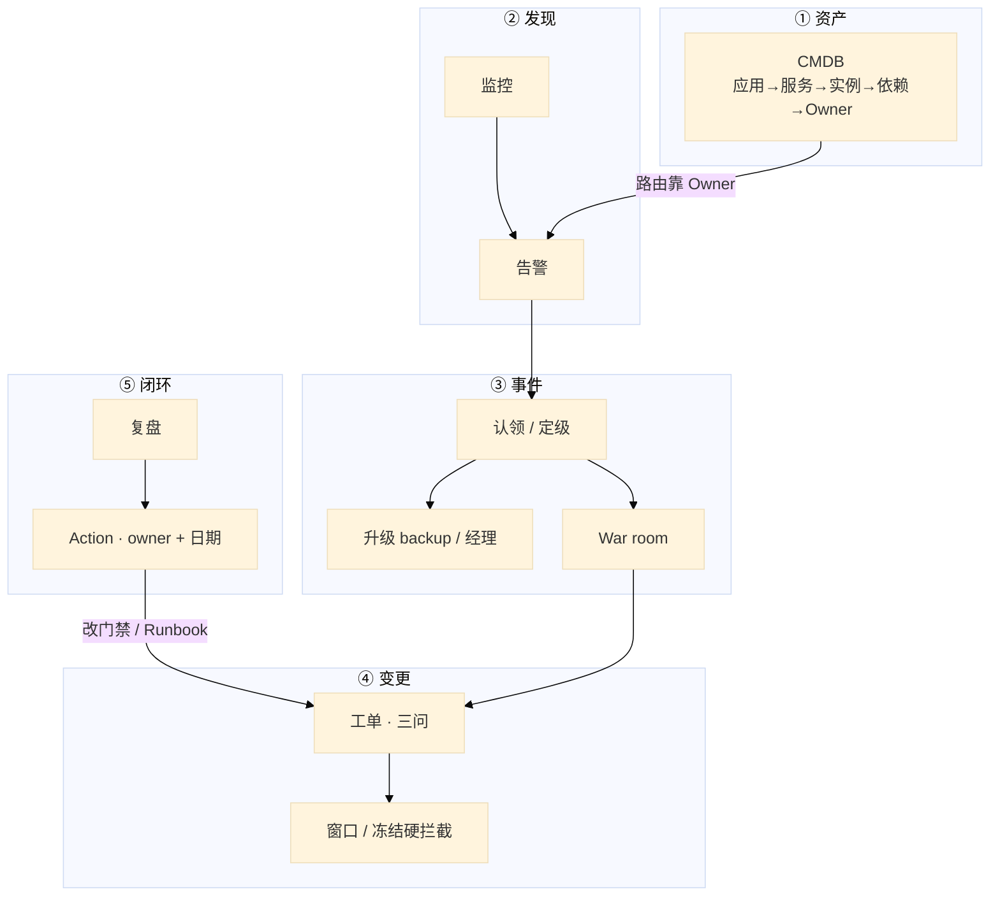
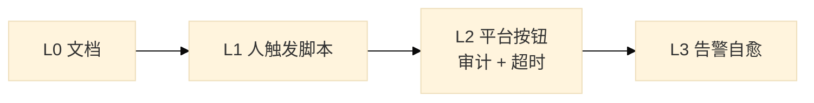
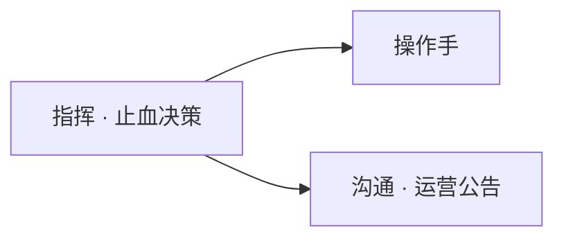
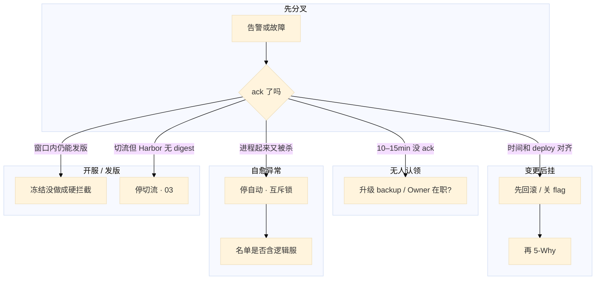

# 运维平台与 Oncall


开服日登录成功率掉了。告警进群没人认。有人在频道里开 5-Why，另有人要把有状态逻辑服当无状态重启。十分钟后 CCU 腰斩——先止血的人被当成「不专业」，先挖根因的人把故障拉长。

**本章主线（排障就按这三步想）：**

1. **先止血**：MTTR 优先，恢复服务再挖根因
2. **认认领**：P0 **15min** 有人扛，升级路径写清楚
3. **改系统**：复盘 action 可验收，不是找人背锅

**读完你能：** 白板上画出 CMDB → 告警 → 事件 → 变更怎么咬合；P0 无人认领知道升级谁；会定级、开 war room、冻开发版、无责复盘。

## 本章目录

- [1. 基本概念](#1-基本概念)
- [2. 架构图](#2-架构图)
- [3. 原理](#3-原理)
- [4. 安装部署](#4-安装部署)
- [5. 核心配置](#5-核心配置)
- [6. 命令与操作](#6-命令与操作)
- [7. 生产排障](#7-生产排障)
- [8. 必会 · 常考](#8-必会--常考)
- [合上书](#合上书问自己)

**本章不讲：** 流水线门禁、digest 晋升 → [04](../04-CI-CD/)；GitOps 发布 → [03-23](../../03-Kubernetes/23-GitOps-ArgoCD与Tekton/)；开合服步骤、回档 → [07-06](../../07-游戏运维专题/06-开服合服/) / [07-09](../../07-游戏运维专题/09-玩家数据备份与回档/)；SLO / 监控指标怎么设 → [03-19](../../03-Kubernetes/19-监控与可观测性/) / [01-22](../../01-基础底座/22-监控与告警/)；IAM、账号 → [06-04](../../06-云平台/04-IAM与多账号/)。Toil / ICS / 无责复盘方法论不单开模块，结合 oncall 与游戏稳定性章口述。

---

## 1. 基本概念

运维平台不是门户页面数。考察看的是你是否把 **变更、故障、资产** 当成系统，而不是个人英雄敲命令。要能画全景，不背产品名。

**值班里怎么认现象**（先听告警和群里说什么，再对表）：

| 群里/监控说的 | 技术含义 | 你的第一刀 |
|---------------|----------|------------|
| 「登录成功率掉 3 个点」 | 可能发布、依赖、容量 | **先 ack**，对齐最近 deploy |
| 「告警 10 分钟没人点」 | 路由失败或 oncall 空转 | 升级 backup，查 Owner 在职 |
| 「进程起来又被杀」 | 自愈和人工打架 | **停自动**，互斥锁 |
| 「开服日还能发版」 | 冻结没做成硬拦截 | 变更系统拒单，不是群吼 |

oncall 当周目标是 **MTTR**，不是顺便写需求。最容易做错的一步是先挖根因再恢复。

| 模块 | 没有它会怎样 |
|------|----------------|
| **CMDB** | 告警找不到人、扩容打错集群 |
| **监控告警** | 玩家先发现故障 |
| **变更 / 发布** | 无法审计、无法回滚 |
| **工单** | 紧急变更走群聊，事后无记录 |
| **事件 / oncall** | 告警空转 |
| **成本** | 弹性变成账单事故 |

四个级别（按业务改数字）：

| 级别 | 含义 | 响应 | 复盘 |
|------|------|------|------|
| **P0** | 核心不可用（登录 / 战斗 / 支付挂，或 CCU 短时间腰斩） | **15min** 认领 | 必须，**48h** 内 |
| **P1** | 核心降级 | 30min | 必须 |
| **P2** | 非核心 | 数小时 | 周汇总 |
| **P3** | 趋势 / 预警 | 工作日 | 不强制 |

**打个比方**：平台像医院分诊——CMDB 是病历本（谁负责哪张床），告警是监护仪，oncall 是急诊值班，变更单是手术预约。没有病历本，监护仪响了也找不到医生。

口误对照：oncall ≠ 接电话；复盘 ≠ 找人背锅；CMDB ≠ 越大越好；审批 ≠ 越多越安全。正确的是止血、改系统、数据质量、标准变更自动化。

> **记住**：告警找不到在职 Owner，oncall 就是空转。先打通 Owner + 路由 + 变更审计，再做花哨自愈。P0 口径用 SLO / 用户数，不靠感觉。

**面试怎么说**：「故障先止血再根因；P0 15min 无人认领必须升级 backup。平台看 MTTA/MTTR 和告警确认率，不是页面数。复盘问系统为什么允许，action 有 owner 有日期。」

---

## 2. 架构图

先把整张图钉住。后面升级、复盘、排障都对着这张图说话。



**读图三句话：**

1. **告警路由靠 CMDB Owner**——离职账号 = 空转；从 CMDB 查依赖扩影响面。
2. **变更必须能回答三问，窗口必须系统硬拦**——群吼不算冻结。
3. **复盘产出的是带日期的 action**，不是「加强责任心」；action 回流改门禁和 Runbook。

自愈叠在平台上，不是另起一套：



优先自愈：重启无状态、扩容、清磁盘、切只读。必须人闸：删数据、合服、改支付、生产 schema。有状态服禁止自动乱重启。

---

## 3. 原理

### 3.1 事件闭环：先止血再根因

**一句话：** 先恢复服务再挖根因；有人开 5-Why 是在拉长 MTTR。

**打个比方**：船漏水先堵洞再查谁没关阀门——不是先开复盘会再拿桶舀水。

**现场走一遍**（开服日 14:02，登录成功率从 99.9% 掉到 96%）：

1. 告警平台进来，主值班 **立即 ack**（开服窗口目标是分钟内，不是等到 15min）：

```text
[P0] login_success_rate < 99%  区服: 全服  当前: 96.2%
Owner: oncall-primary@game  状态: firing  ack: 未认领
```

2. 定级 P0，广播应急群（现象 + 范围 + 支付是否受影响 + 谁在扛）：

```text
现象: 登录成功率 96%，14:00 起
范围: 全服，战斗/支付暂未见告警
扛: @张三 primary  ack 14:03
```

3. 对齐最近变更——CMDB / 发布系统查 14:00 前后 deploy：

```text
14:01  deploy login-api v2.3.1  prod  操作: jenkins#8842
```

4. **止血**（时间和 deploy 对齐 → 先回滚 / 关 flag / 摘流量，不要先翻 Redis 慢查询）：

```bash
# 示例：GitOps 回滚或关 feature flag
kubectl rollout undo deployment/login-api -n prod
# 或平台「回滚上一版本」按钮（L2，带审计）
```

5. 屏幕观察指标回到 baseline（Runbook 要写「成功长什么样」）：

```text
14:12  login_success_rate: 99.91%  持续 5min 稳定
```

6. 观察窗口后再 5-Why；P0 **48h** 内无责复盘，action 有 owner 有日期。有状态逻辑服禁止当无状态乱重启——长连接玩家会被踢，故障面放大。

**输出解读：**

| 信号 | 含义 | 下一步 |
|------|------|--------|
| 指标烂的时间 ≈ deploy 时间 | 变更引入 | 回滚 / 关 flag 优先 |
| ack 仍「未认领」10min+ | 路由或 oncall 失效 | 升级 backup（3.2） |
| 回滚后仍低 | 可能不是这次发布 | 查依赖 DB/Redis，仍先恢复再深挖 |

**面试怎么说**：「P0 我先 ack、定级、广播，时间和 deploy 对齐就先回滚止血，根因放观察窗口后。有状态服不自动乱重启。复盘 48h 内，action 可验收。」

### 3.2 升级与值班

**一句话：** 无人认领必须升级；噪音用抑制，不加通道硬叫。

**打个比方**：火警响了 15 分钟没人接，不能一直等同一个睡死的人——按值班表打 backup，再打到消防队长。

**现场走一遍**（P0 告警 14:00 进群发，14:12 仍无人 ack）：

1. 查告警详情 Owner 和路由：

```text
Owner: zhangsan@game  路由: CMDB login-service
Last ack: 无  firing 12min
On-call: primary=李四  backup=王五  (PagerDuty schedule)
```

2. 核对 Owner 是否在职——CMDB 里 `zhangsan` 已离职，路由仍指向旧账号：

```text
CMDB owner: zhangsan@game  status: inactive 2026-07-15
```

3. **10–15min 未认领** → 触发 backup 升级（电话 / 短信通道）：

```text
14:13  Escalation L1 → 王五 backup  SMS sent
14:14  王五 ack  incident#INC-8842
```

4. 影响面扩大（支付 / 多区服）→ 团队负责人 + 业务（公告口径统一）。指挥不在：backup 按路径顶上，**不要现场选举**。

5. 交接必须书面：进行中故障、今日变更窗口、已知烂告警、容量红线——不在个人笔记。

**输出解读：**

| 信号 | 根因 | 修法 |
|------|------|------|
| Owner inactive | CMDB 未轮转 | 离职当天切路由 |
| MTTA > 15min，升级没触发 | 升级规则未配 | 配 10–15min → backup |
| 告警多但都不是故障 | 告警质量差 | 抑制 / 调阈值，不加电话 |

度量：MTTA / MTTR、告警确认率——和业务 SLO 分开看，避免「工单很快但玩家仍进不去」。oncall 被叫醒但不是故障 = 告警质量问题。

**面试怎么说**：「P0 15min 无人 ack 必须升级 backup；开服窗口分钟内认领。Owner 离职要当天轮转 CMDB。噪音先抑制，不是加电话通道。」

### 3.3 变更三问

**一句话：** 改什么、影响什么、怎么回滚——缺一不能上；开服冻结靠系统硬拦。

**打个比方**：手术前要答三道题——动哪里、可能出血多少、怎么缝回去；开服日像重大手术日，变更系统应直接拒非紧急单。

**现场走一遍**（开服日 15:30，开发想在 prod 发大厅 hotfix）：

1. 变更系统提交工单，看三问是否齐全：

```text
改什么: login-api ConfigMap  timeout 3s→5s
影响什么: 全服登录链路
怎么回滚: Git revert + 上一 ConfigMap 版本号 v8841
类型: 普通变更
```

2. 开服冻结窗口内提交，系统应 **硬拦截**：

```text
ERROR: 当前处于「开服冻结」2026-08-28 00:00–24:00
非紧急变更被拒绝。紧急变更需双人 + 事后补单。
```

3. 若系统允许勾选「跳过窗口」= 平台没做成——靠群吼冻结不可靠。日常大厅发布三层审批，有人改去跳板机 vim = 审批过多逼人走 SSH。

4. 变更类型对照：

| 类型 | 例 | 审批 |
|------|-----|------|
| **标准** | 已门禁的日常发布、弹性扩容 | 自动 |
| **普通** | 配置、中间件小升 | 负责人 |
| **紧急** | 止血、安全补丁 | 双人执行，事后补单 |

5. 窗口：工作日 **10:00–16:00** 留观察；周五晚、节前封网；游戏活动日、开服日另设冻结。回滚演练（GameDay）算变更流程一部分。

**输出解读：**

| 现象 | 含义 |
|------|------|
| 开服日仍能发版 | 冻结未硬拦截 |
| SSH 审计窗口外改配置 | 旁路没被抓 |
| 三问「回滚」空 | 不能上，第一次故障才点 undo 会失败 |

**面试怎么说**：「变更三问缺一不上；标准变更自动、紧急双人补单。开服冻结靠系统拒单不是群吼。窗口 10:00–16:00 留观察，GameDay 练回滚。」

### 3.4 自愈边界

**一句话：** 自愈只做可逆高频；合服 / 删库 / 逻辑服必须人确认。

**打个比方**：自动药柜只能发 aspirin 和 band-aid——不能自动做开颅（合服）或给错病人（CMDB 过期 IP）。

**现场走一遍**（逻辑服进程「起来又被杀」，同时人工也在重启）：

1. 告警：

```text
[P1] process_restart  host: logic-s2-03  count: 5/min  source: auto-heal
```

2. 查自愈审计和 CMDB：

```text
auto-heal job#7721  target: 10.0.8.33  action: systemctl restart logic
CMDB 10.0.8.33  owner: (empty)  last_seen: 2026-06-01  # IP 已漂移
```

3. **先停自动**，上互斥锁，禁止和人工同时动：

```bash
# 平台关闭 L3 自愈开关，或
curl -X POST https://ops/internal/auto-heal/pause -d '{"scope":"logic"}'
```

4. 核对名单：自愈默认**不含**有状态逻辑服；合服不可逆，不能当 L3 定时 Job。

5. 修复 CMDB：以集群 / 云 API 为准对账，Owner 补齐；blast radius 一次只动一台 / 一个 ns。自愈失败要告警，不能静默。

**输出解读：**

| 信号 | 根因 | 修法 |
|------|------|------|
| 重启风暴 + auto-heal 日志 | 自愈和人工打架 | 停自动 + 互斥锁 |
| target IP 无 Owner / 过期 | CMDB 质量差 | 对账 + 禁止无 Owner 上 L3 |
| 战斗服被 L3 重启 | 名单配置错误 | 逻辑服移出自愈名单 |

CMDB 模型：应用 → 服务 → 实例 → 依赖 → Owner / oncall。质量大于数量——错 IP 自动化会放大事故。告警质量：能对应 Runbook 才叫 P1+；没有动作的监控去 dashboard。

**面试怎么说**：「自愈 L0 文档到 L3 告警触发；可逆高频才自动，合服/删库/逻辑服必须人闸。CMDB 宁缺毋错，无 Owner 禁止 L3。和人工冲突先停自动。」

---

## 4. 安装部署

### 4.1 生产怎么选

| 项 | 选 | 不选 |
|----|----|------|
| 建设顺序 | Owner + 路由 + 变更审计 | 先做智能自愈大屏 |
| 告警 | 分级 + Runbook + 抑制 | 全部 P0、再加电话通道 |
| 窗口 | 系统硬拦截 | 群里吼冻结 |
| 值班 | 主 + backup，路径写死 | 现场选举指挥 |
| 自愈 | L0→L3，有状态人闸 | 合服做成定时 Job |
| 巡检 | 平台只读检查，结果工单化 | SSH 循环当平台 |

开源工具够跑命令，流程和审计仍要自己接。工具是执行器，平台是权限 + 流程。

### 4.2 平台落地你实际看到什么

验收不看页面数。必须：

1. 告警能路由到**在职** Owner。
2. P0 无人认领会打到 backup，再打到经理。
3. 变更单能回答三问；开服冻结系统直接拒。
4. 自愈名单不含有状态逻辑服；失败有告警。
5. CMDB 与集群对账有差异工单。

观测平台本身：MTTA / MTTR、告警确认率、变更失败率、工单时长、CMDB 对账差异数——比「平台有多少页面」更能说明是否工程化。

---

## 5. 核心配置

只动有证据的项。数字按业务改，但「有没有」不能缺。

| 项 | 生产怎么用 | 改错会怎样 |
|----|------------|------------|
| P0 认领 SLA | 日常 **15min**；开服窗口 **分钟内** | 没有升级路径 = 晾着 |
| 升级 | **10–15min** → backup → 经理 / 业务 | backup 手机不在值班表里 |
| P0 复盘 | **48h** 内，action 有主有期 | 「加强责任心」= 没写 |
| 变更窗口 | 工作日 **10:00–16:00**；周五晚 / 节前 / 开服冻结 | 能勾「跳过」= 没窗口 |
| 告警 | P1+ 必须对应 Runbook | 风暴淹没支付 |
| 自愈 blast radius | 一次一台 / 一个 ns | 错 IP 重启支付机 |
| Owner 轮转 | 离职当天切路由 | 告警进停用账号 |

Runbook 每步写成功长什么样（如登录成功率回到 **99.9%**）。值班文档 Top N 一页纸：登录失败、支付超时、拉镜像、磁盘。

> **记住**：开服日冻结靠系统拒，不靠群吼；路由必须打到当天在职的人。

---

## 6. 命令与操作

### 6.1 速查

平台各家 UI 不同，值班先对齐这四件（工单 / 告警 / 变更 / CMDB），不要先 SSH。

| 目的 | 做什么 | 看什么 |
|------|--------|--------|
| 认领 | 告警平台点 ack | 谁在扛、几点 ack |
| 定级 | 按 SLO / CCU / 支付 | P0 还是噪音 |
| 升级 | 10–15min 未 ack 触发 backup | 电话是否打出 |
| 影响面 | CMDB 依赖图 | 哪些区服、哪套 Redis / DB |
| 变更 | 冻结是否拦截、三问是否填 | 开服日能否误发 |
| 自愈 | 开关、互斥锁、审计日志 | 是否和人工打架 |
| 复盘 | 时间线模板 | 发现 / 止血 / 恢复分钟级 |

现场口述顺序：

```
1. 这条告警 ack 了没有？Owner 在不在职？
2. 定级：登录 / 战斗 / 支付 / CCU？
3. 最近一次 deploy / 变更窗口对齐了没有？
4. 自愈在不在跑？先停自动再动手。
```

### 6.2 认领与升级

1. P0 进来：主值班 ack。开服窗口目标是分钟内。
2. **10–15min** 未认领 / 认领后卡住 → backup。
3. 仍无进展或支付 / 多区服扩大 → 团队负责人 + 业务 / 运营。
4. 指挥不在：backup 按路径顶上。

### 6.3 开 war room

P0 固定频道。一人指挥（止血决策），一人沟通运营公告，操作手按指令改。禁止十人同时改配置。跨区服用 CMDB 依赖图扩影响面。



### 6.4 开服 / 发版值班

游戏加分项：开服、合服、活动、**发版夜**单独值班表。预拉镜像、Harbor digest 打勾后再切流量（03）。出问题：先降级活动 / 关开关 / 回滚，再复盘。合服不可逆，不能当自愈。

### 6.5 无责复盘

模板五段：

1. 时间线（发现 / 止血 / 恢复，分钟级）
2. 根因（到「门禁为什么没拦住」「为什么没有自动回滚」）
3. 影响面（用户、区服、时长、收入）
4. 做对的决策
5. Action：可验收、有 owner、有日期

「nginx 挂了」不是根因。没有截止日期的改进项 = 没写。

### 6.6 变更单与 CMDB 对账

缺三问不能上。以集群 / 云 API 为准；发布回写版本。自动化禁止在「无 Owner / 过期 IP」上跑 L3。

---

## 7. 生产排障

**先止血，不是先开 5-Why。**



| 现象 | 先做什么 | 不要做什么 |
|------|----------|------------|
| 告警无人认 | 升级路径和 Owner 是否在职 | 在群里等、加电话硬叫 |
| 变更后挂 | 先回滚再分析 | 先开 5-Why |
| 自愈乱重启逻辑服 | 停自动，互斥锁 | 两边一起重启 |
| 开服仍能发版 | 冻结硬拦截 | 靠群吼 |
| 工单很快玩家进不去 | 平台指标和业务 SLO 分开 | 用 MTTA 报喜 |
| P0 进了 12 个人 kubectl | 一人指挥，禁止十人改配置 | 现场选举三个口径 |
| 磁盘预警打成 P0 | 治告警质量 | 再加通道 |

生产踩坑：告警进群不认领；CMDB Owner 是离职账号；自愈和人工打架；变更能跳过窗口。

---

## 8. 必会 · 常考

| 说法 | 对错 | 口径 |
|------|:----:|------|
| 先 5-Why 再恢复更专业 | 错 | 先止血；根因留复盘 |
| 没有升级路径也能 oncall | 错 | 无人认领必须打 backup |
| 复盘就是找出是谁的锅 | 错 | 问系统为何允许；action 有主有期 |
| 「nginx 挂了」是根因 | 错 | 写到门禁 / 告警 / 自愈为什么没拦 |
| CMDB 条数越多越好 | 错 | 质量 > 数量；错 IP 会放大事故 |
| 审批越多越安全 | 错 | 逼人走 SSH；标准变更要自动 |
| 开服冻结靠群里吼就行 | 错 | 必须系统硬拦截 |
| 自愈可以重启战斗服 | 错 | 有状态禁止自动乱重启 |
| 合服可以做成 L3 定时 Job | 错 | 不可逆，必须人确认 |
| 加电话通道就能叫得醒 | 错 | 先抑制噪音 |
| 平台页数说明工程化 | 错 | 看 MTTA / MTTR / 确认率 / 对账差异 |
| 开服日 P0 仍等 15min 再升级 | 错 | 窗口内分钟内认领 |
| 巡检用 SSH 循环就是平台 | 错 | 只读检查工单化 |

数字：P0 认领 **15min**、复盘 **48h**；升级 **10–15min** → backup；窗口工作日 **10:00–16:00**；Runbook 成功标准要写指标（如登录 **99.9%**）。

> **别混**：MTTA vs MTTR vs 业务 SLO；L2 按钮 vs L3 自愈；标准变更自动 vs 紧急双人补单；Owner 离职 vs 告警空转；指挥 vs 十人同时改。

> 🔍 **现场**：P0 响应中，先确认「认领没、谁在动、指挥是谁」三件事，再看指标。

```bash
# ① 告警有没有人认领（MTTA 计时从这里开始）
curl -s 'http://alertmanager:9093/api/v2/alerts?active=true&silenced=false' | jq '[.[] | {labels:.labels, status:.status.state, startsAt:.startsAt}]'
# state=pending/unprocessed 且没人 ack = 认领超时，触发 backup 升级

# ② 平台查谁正在动这台机器（避免十人同时改）
curl -s 'http://oncall-platform/api/actions?status=running&host=battle-prod-01' | jq '.[].operator'
# 多人同时在 battle-prod-01 上跑变更 = 停下，指定唯一指挥官排序

# ③ 自愈脚本有没有误碰有状态服务（L3 越界）
grep -rn 'systemctl restart.*battle\|kubectl delete po.*battle' /opt/self-heal/
# 有状态服务被自动重启 = L0–L3 边界没守住，必须人确认
```

平台 oncall 最常翻车的是「告警响了没人认领、三个人同时 SSH 上去各改各的」——MTTA 没计时、指挥没指定、最后不知道哪件事让服务恢复的。先在平台盯认领状态和正在执行的变更，比直接跳进机器更能止血。

---

## 合上书，问自己

- [ ] 从告警到复盘哪一步最容易错？P0 15min 没人认领升级谁？
- [ ] 变更三问是哪三问？开服冻结靠什么拦？
- [ ] 复盘五段写什么？「nginx 挂了」为什么不是根因？
- [ ] CMDB 模型和告警路由什么关系？以谁为准对账？
- [ ] 自愈 L0–L3 边界？逻辑服 / 合服能不能自动？
- [ ] 开服 / 发版值班和日常差在哪？War room 三人怎么分？

六题都能口述，这一章就过了。下一章把镜像分层和 overlay2 剖开：改一行代码为什么全重装、节点盘满为什么不是镜像太大。
