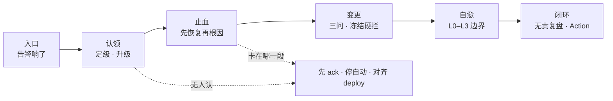
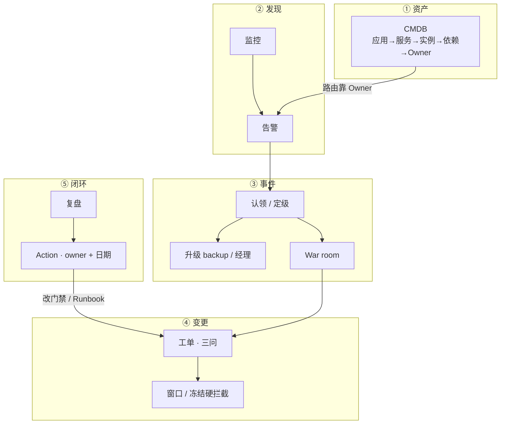
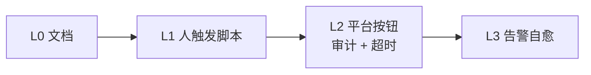
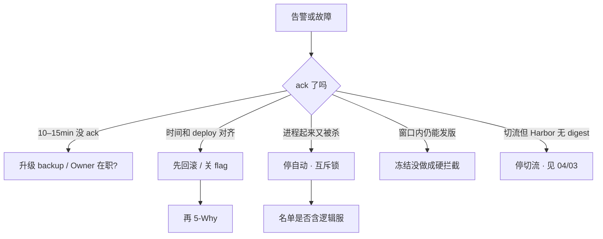
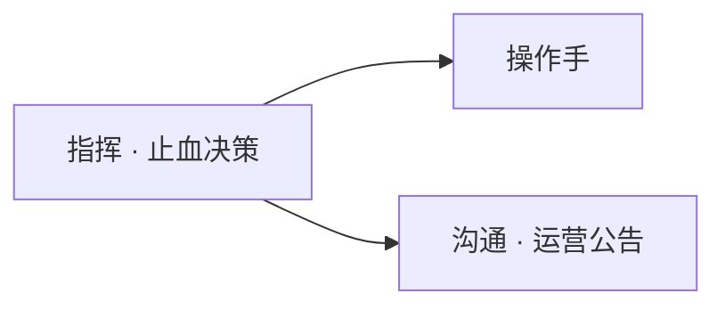

# 运维平台与 Oncall

> 开服日登录成功率掉了。告警进群没人认；有人在频道里开 5-Why，另有人要把有状态逻辑服当无状态重启。十分钟后 CCU 腰斩——先止血的人被当成「不专业」，先挖根因的人把故障拉长。
> **本章回答**：一次故障从告警到复盘会卡在哪几站——认领、止血、变更、自愈、闭环——每站怎么一眼定责。
> **不讲**：流水线门禁、digest 晋升 → [04](../04-CI-CD/)；GitOps 发布 → [03-23](../../03-Kubernetes/23-GitOps-ArgoCD与Tekton/)；开合服步骤、回档 → [07-06](../../07-游戏运维专题/06-开服合服/) / [07-09](../../07-游戏运维专题/09-玩家数据备份与回档/)；SLO / 监控指标怎么设 → [03-19](../../03-Kubernetes/19-监控与可观测性/) / [01-22](../../01-基础底座/22-监控与告警/)；IAM → [06-04](../../06-云平台/04-IAM与多账号/)。

**标记**：🎯重点 · 🔥难点 · ⭐常考 · 🔧实操
---

## 一、一张图：一次故障的一生

> 🎯 **一句话**：告警 → 认领 → 止血 → 变更/自愈边界 → 复盘改系统；卡在哪一站，就修哪一站。



- 📖 **读图**
  - 🚪 入口永远是「有人 ack 了吗」——没人认，后面全空转
  - 🛤️ 主线五站；值班第一刀是 ack + 停打架的自愈 + 对齐最近 deploy，不是先开 5-Why（Q1、Q2）

三条口诀挂全章：**先止血 · 认认领 · 改系统**。

---

## 二、底座：平台咬合与定级

> 🎯 **一句话**：运维平台看的是变更、故障、资产怎么咬合，不是门户页面数。

### 🏥 分诊台：六块缺一不可 🎯⭐

> 💡 **打个比方**：平台像医院分诊——CMDB 是病历本（谁负责哪张床），告警是监护仪，oncall 是急诊值班，变更单是手术预约。没有病历本，监护仪响了也找不到医生。

- 🗂️ **CMDB** = 应用 → 服务 → 实例 → 依赖 → **Owner / oncall**；告警找不到在职 Owner = 空转
- 📡 **监控告警**：玩家先发现故障 = 这层挂了（规则/分级见 [01-22](../../01-基础底座/22-监控与告警/)）
- 📝 **变更 / 发布**：无法审计、无法回滚 = 出事只能靠记忆
- 🎫 **工单**：紧急变更走群聊 = 事后无记录
- 🚨 **事件 / oncall**：告警空转、无人扛
- 💰 **成本**：弹性变成账单事故

- 🗺️ **值班里怎么认现象**
  - 「登录成功率掉 3 个点」→ 可能发布 / 依赖 / 容量 → **先 ack**，对齐最近 deploy
  - 「告警 10 分钟没人点」→ 路由失败或 oncall 空转 → 升级 backup，查 Owner 在职
  - 「进程起来又被杀」→ 自愈和人工打架 → **停自动**，互斥锁
  - 「开服日还能发版」→ 冻结没做成硬拦截 → 变更系统拒单，不是群吼

### 🎚️ P0–P3：按业务改数字，口径不能缺 ⭐

| 级别 | 含义 | 响应 | 复盘 |
|------|------|------|------|
| **P0** | 核心不可用（登录 / 战斗 / 支付挂，或 CCU 短时间腰斩） | **15min** 认领；开服窗口**分钟内** | 必须，**48h** 内 |
| **P1** | 核心降级 | 30min | 必须 |
| **P2** | 非核心 | 数小时 | 周汇总 |
| **P3** | 趋势 / 预警 | 工作日 | 不强制 |

- 🔑 **术语首次钉死**
  - **MTTA（Mean Time To Acknowledge）** = 告警出现到有人 ack 的时长
  - **MTTR（Mean Time To Recover）** = 故障开始到服务恢复的时长——oncall 当周主 KPI
  - **Owner** = CMDB 里对该服务负责、能被路由叫醒的在职账号（不是「写过代码的人」）

> ⚠️ **别混**：oncall ≠ 接电话；复盘 ≠ 找人背锅；CMDB ≠ 越大越好；审批 ≠ 越多越安全。正确的是止血、改系统、数据质量、标准变更自动化。

> 📝 **面试**：「故障先止血再根因；P0 15min 无人认领必须升级 backup。平台看 MTTA/MTTR 和告警确认率，不是页面数。复盘问系统为什么允许，action 有 owner 有日期。」⭐（Q1、Q2）

本节对应练习题 Q1、Q2。底座钉住了——告警怎么咬到人？

---

## 三、咬合：CMDB → 告警 → 事件 → 变更

> 🎯 **一句话**：路由靠在职 Owner；变更能答三问；复盘产出带日期的 action。



- 📖 **读图**
  - 🚪 告警箭头必须落到「在职 Owner」——离职账号 = 空转；从 CMDB 查依赖扩影响面
  - 🛤️ 变更必须能回答三问，窗口必须系统硬拦；复盘 action 回流改门禁和 Runbook，不是「加强责任心」

自愈叠在平台上，不是另起一套（六节展开）：



- 📖 **读图**：越往右越自动；优先自愈重启无状态 / 扩容 / 清磁盘 / 切只读；合服、删数据、改支付、生产 schema、有状态逻辑服必须人闸。

> ⭐ **记住**：先打通 Owner + 路由 + 变更审计，再做花哨自愈。P0 口径用 SLO / 用户数，不靠感觉。

本节对应练习题 Q1、Q4。咬合图画熟了——无人认领怎么办？

---

## 四、认领：升级路径与值班 🔥⭐

> 🎯 **一句话**：无人认领必须升级；噪音用抑制，不加通道硬叫。

> 💡 **打个比方**：火警响了 15 分钟没人接，不能一直等同一个睡死的人——按值班表打 backup，再打到消防队长。

### 📞 15 分钟没人 ack：升级怎么走

#### ❓ 为什么不是一直等 primary？

- ❌ **只等一个人**：primary 睡死 / 手机静音 / Owner 已离职 → MTTA 无限拉长
- ✅ **写死路径**：P0 **10–15min** 未认领 → backup（电话/短信）→ 仍无进展或支付/多区服扩大 → 团队负责人 + 业务
- 🎮 **开服窗口例外**：目标是**分钟内**认领，不是等到 15min 才升级

- 🎬 **现场走一遍**（P0 14:00 进群，14:12 仍无人 ack）

```text
Owner: zhangsan@game  路由: CMDB login-service
Last ack: 无  firing 12min
On-call: primary=李四  backup=王五
CMDB owner: zhangsan@game  status: inactive 2026-07-15   # ← 离职账号 = 空转根因
14:13  Escalation L1 → 王五 backup  SMS sent
14:14  王五 ack  incident#INC-8842
```

- 🔍 **现场怎么认**
  - Owner `inactive` → CMDB 未轮转；离职当天切路由
  - MTTA > 15min 且升级没触发 → 规则未配；配 10–15min → backup
  - 告警多但都不是故障 → 告警质量差；抑制 / 调阈值，**不加电话通道**

- 📋 **交接必须书面**：进行中故障、今日变更窗口、已知烂告警、容量红线——不在个人笔记
- 🧭 **指挥不在**：backup 按路径顶上，**不要现场选举**
- 📉 **度量**：看 MTTA / MTTR、告警确认率；和业务 SLO 分开——避免「工单很快但玩家仍进不去」
- 🔕 **被叫醒但不是故障** = 告警质量问题，治法是抑制 / 调阈值 / 降级，不是再加通道

> ⚠️ **别混**：**MTTA**（告警到认领）vs **MTTR**（故障到恢复）vs **业务 SLO**（玩家能不能进）。工单很快但玩家仍进不去 = 平台指标和 SLO 分开看。

> 📝 **面试**：「P0 15min 无人 ack 必须升级 backup；开服窗口分钟内认领。Owner 离职要当天轮转 CMDB。噪音先抑制，不是加电话通道。」⭐（Q2）

本节对应练习题 Q2。有人扛了——第一刀为什么不是 5-Why？

---

## 五、止血：先恢复再根因 🔥⭐

> 🎯 **一句话**：先恢复服务再挖根因；有人开 5-Why 是在拉长 MTTR。

> 💡 **打个比方**：船漏水先堵洞再查谁没关阀门——不是先开复盘会再拿桶舀水。

#### ❓ 为什么先止血不算「不专业」？

- 🎯 oncall 当周目标是 **MTTR**，不是顺便写需求
- ⏱️ 观察窗口后再 5-Why；P0 **48h** 内无责复盘
- 🚫 有状态逻辑服禁止当无状态乱重启——长连接玩家会被踢，故障面放大

### 🩹 现场六步：开服日登录掉点

- 🎬 **开服日 14:02，登录成功率 99.9% → 96%**

```text
[P0] login_success_rate < 99%  区服: 全服  当前: 96.2%
Owner: oncall-primary@game  状态: firing  ack: 未认领
```

1. **立即 ack**（开服窗口目标分钟内）
2. 定级 P0，广播应急群：

```text
现象: 登录成功率 96%，14:00 起
范围: 全服，战斗/支付暂未见告警
扛: @张三 primary  ack 14:03
```

3. CMDB / 发布系统对齐 14:00 前后 deploy

```text
14:01  deploy login-api v2.3.1  prod  操作: jenkins#8842
```

4. 时间对齐 → **先回滚 / 关 flag / 摘流量**，不要先翻 Redis 慢查询

```bash
kubectl rollout undo deployment/login-api -n prod
# 或平台「回滚上一版本」按钮（L2，带审计）
# ← 改的是运行中的副本；若 YAML 在 Git、同步工具会自动 apply（GitOps，如 Argo CD → 03-23），
#    仓库里仍是坏版本时下次同步会打回来——应急回滚后当天要把 Git 也改回
```

5. 指标回到 baseline（Runbook 写「成功长什么样」）：

```text
14:12  login_success_rate: 99.91%  持续 5min 稳定
```

6. 观察窗口后再 5-Why；P0 **48h** 内无责复盘，action 有 owner 有日期

- 🔍 **信号 → 下一步**
  - 指标烂的时间 ≈ deploy → 回滚 / 关 flag 优先
  - ack 仍「未认领」10min+ → 升级 backup（四节）
  - 回滚后仍低 → 可能不是这次发布；查依赖 DB/Redis，**仍先恢复再深挖**

> 📝 **面试**：「P0 我先 ack、定级、广播，时间和 deploy 对齐就先回滚止血，根因放观察窗口后。有状态服不自动乱重启。复盘 48h 内，action 可验收。」⭐（Q1、Q2）

本节对应练习题 Q1、Q2。止血之外——变更怎么不让开服日再炸一次？

---

## 六、变更：三问与冻结硬拦 🔥⭐

> 🎯 **一句话**：改什么、影响什么、怎么回滚——缺一不能上；开服冻结靠系统硬拦。

> 💡 **打个比方**：手术前要答三道题——动哪里、可能出血多少、怎么缝回去；开服日像重大手术日，变更系统应直接拒非紧急单。

#### ❓ 为什么群吼「今天别发版」不算冻结？

- ❌ **群吼**：总有人没看见 / 有人勾「跳过窗口」→ 开服日仍能发版
- ✅ **系统硬拦**：冻结窗口内提交直接 `ERROR`；紧急变更双人执行 + 事后补单
- 🧨 审批过多逼人走跳板机 vim = 旁路；标准变更应自动化

- 🧾 **三问缺一不上**

```text
改什么: login-api ConfigMap  timeout 3s→5s
影响什么: 全服登录链路
怎么回滚: Git revert + 上一 ConfigMap 版本号 v8841
```

- 🧊 **开服冻结应长这样**

```text
ERROR: 当前处于「开服冻结」2026-08-28 00:00–24:00
非紧急变更被拒绝。紧急变更需双人 + 事后补单。
```

| 类型 | 例 | 审批 |
|------|-----|------|
| **标准** | 已门禁的日常发布、弹性扩容 | 自动 |
| **普通** | 配置、中间件小升 | 负责人 |
| **紧急** | 止血、安全补丁 | 双人执行，事后补单 |

- 🪟 **窗口**：工作日 **10:00–16:00** 留观察；周五晚、节前封网；活动日 / 开服日另设冻结
- 🎮 **GameDay**：回滚演练算变更流程一部分，不是「出事再练」
- 🕵️ **旁路信号**：SSH 审计窗口外改配置、变更单「回滚」栏为空、系统允许勾「跳过窗口」——都说明平台没做成

> ⚠️ **别混**：标准变更自动 ≠ 紧急变更随便上；紧急是双人补单，不是跳过审计。

> 📝 **面试**：「变更三问缺一不上；标准变更自动、紧急双人补单。开服冻结靠系统拒单不是群吼。窗口 10:00–16:00 留观察，GameDay 练回滚。」⭐（Q3、Q6）

本节对应练习题 Q3、Q6。变更管住了——自动重启为什么也会二次事故？

---

## 七、自愈：L0–L3 边界 🔥⭐

> 🎯 **一句话**：自愈只做可逆高频；合服 / 删库 / 逻辑服必须人确认。

> 💡 **打个比方**：自动药柜只能发 aspirin 和 band-aid——不能自动做开颅（合服）或给错病人（CMDB 过期 IP）。

#### ❓ 为什么有状态逻辑服不能进 L3？

- 💥 L3 告警触发自动 `restart` → 长连接玩家全踢 → **二次事故**
- 🔒 合服 / 删数据 / 改支付 / 生产 schema = 不可逆，不能当定时 Job
- ✅ 可进 L3：重启无状态、扩容、清磁盘、切只读——且 **CMDB 有在职 Owner、IP 未过期**

- 🪜 **四级梯子**

```text
L0 文档 / Runbook          ← 人照着做
L1 人触发脚本              ← 人按按钮前的一步
L2 平台按钮（审计 + 超时） ← 推荐止血入口
L3 告警自愈                ← 可逆高频才自动
```

- 🎬 **进程「起来又被杀」**

```text
[P1] process_restart  host: logic-s2-03  count: 5/min  source: auto-heal
auto-heal job#7721  target: 10.0.8.33  action: systemctl restart logic
CMDB 10.0.8.33  owner: (empty)  last_seen: 2026-06-01   # ← IP 漂移 / 无 Owner
```

```bash
# 先停自动，上互斥锁，禁止和人工同时动
curl -X POST https://ops/internal/auto-heal/pause -d '{"scope":"logic"}'
```

- 🔍 **信号 → 修法**
  - 重启风暴 + auto-heal 日志 → 停自动 + 互斥锁
  - target IP 无 Owner / 过期 → CMDB 对账；禁止无 Owner 上 L3
  - 战斗服被 L3 重启 → 逻辑服移出自愈名单

- 🧱 **CMDB 质量 > 数量**：错 IP 自动化会放大事故；blast radius 一次一台 / 一个 ns；自愈失败要告警，不能静默
- 📢 **告警质量**：能对应 Runbook 才叫 P1+；没有动作的监控去 dashboard

> 📝 **面试**：「自愈 L0 文档到 L3 告警触发；可逆高频才自动，合服/删库/逻辑服必须人闸。CMDB 宁缺毋错，无 Owner 禁止 L3。和人工冲突先停自动。」⭐（Q7）

本节对应练习题 Q7。服务回来了——怎么保证下次系统会拦？

---

## 八、闭环：无责复盘与落地验收 🔥⭐

> 🎯 **一句话**：复盘问系统为什么允许这件事发生；action 有 owner 有日期。

#### ❓ 为什么「nginx 挂了」不是根因？

- ❌ 停在组件名 = 没挖到「门禁 / 告警 / 自愈为什么没拦住」
- ✅ 写到可改的系统缺口：缺冻结硬拦、Owner 未轮转、无自动回滚、Runbook 无成功标准
- 📅 没有截止日期的改进项 = **没写**

### 📄 复盘五段模板 ⭐

1. **时间线**（发现 / 止血 / 恢复，分钟级）
2. **根因**（到门禁 / 告警 / 自愈为什么没拦）
3. **影响面**（用户、区服、时长、收入）
4. **做对的决策**（别只写错的）
5. **Action**：可验收、有 owner、有日期

### 🏗️ 落地先焊哪几条 🔧

> 🎯 **一句话**：先打通 Owner + 路由 + 变更审计，再做花哨自愈。

- 🗺️ **建设顺序（选 / 不选）**
  - 选：Owner + 路由 + 变更审计 → 不选：先做智能自愈大屏
  - 选：分级 + Runbook + 抑制 → 不选：全部 P0、再加电话通道
  - 选：系统硬拦截窗口 → 不选：群里吼冻结
  - 选：主 + backup，路径写死 → 不选：现场选举指挥
  - 选：L0→L3，有状态人闸 → 不选：合服做成定时 Job
  - 选：平台只读巡检、结果工单化 → 不选：SSH 循环当平台

- ✅ **验收清单**
  - 告警能路由到**在职** Owner
  - P0 无人认领会打到 backup，再打到经理
  - 变更单能回答三问；开服冻结系统直接拒
  - 自愈名单不含有状态逻辑服；失败有告警
  - CMDB 与集群对账有差异工单

- 📊 **平台本身要观测**：MTTA / MTTR、告警确认率、变更失败率、工单时长、CMDB 对账差异数——比「平台有多少页面」更能说明是否工程化
- 🧾 **Runbook**：每步写成功长什么样（如登录成功率回到 **99.9%**）；值班文档 Top N 一页纸：登录失败、支付超时、拉镜像、磁盘
- 🔧 **工具定位**：开源工具够跑命令，流程和审计仍要自己接——工具是执行器，平台是权限 + 流程

> ⭐ **记住**：开服日冻结靠系统拒，不靠群吼；路由必须打到当天在职的人。

本节对应练习题 Q4、Q5、Q8、Q9。闭环会了——现场怎么 60 秒定责？

---

## 九、作战：定责与 War room

> 🎯 **一句话**：先分叉——无人认领 / 多人乱改 / 自愈越界 / 冻结没拦住。



- 📖 **读图**：先问 ack；对齐 deploy 走回滚；自愈打架先停自动；开服仍能发版 = 冻结没硬拦。

| 现象 | 先做什么 | 不要做什么 |
|------|----------|------------|
| 告警无人认 | 升级路径和 Owner 是否在职 | 在群里等、加电话硬叫 |
| 变更后挂 | 先回滚再分析 | 先开 5-Why |
| 自愈乱重启逻辑服 | 停自动，互斥锁 | 两边一起重启 |
| 开服仍能发版 | 冻结硬拦截 | 靠群吼 |
| 工单很快玩家进不去 | 平台指标和业务 SLO 分开 | 用 MTTA 报喜 |
| P0 进了 12 个人 kubectl | 一人指挥，禁止十人改配置 | 现场选举三个口径 |
| 磁盘预警打成 P0 | 治告警质量 | 再加通道 |

### 🎙️ War room 三人怎么分 🔧



- 📖 **读图**：一人指挥、一人操作、一人对外口径；禁止十人同时改配置。

- 🎮 **开服 / 发版值班**：单独值班表；预拉镜像、Harbor digest 打勾后再切流量（→ [04](../04-CI-CD/) / [03](../03-制品与镜像/)）；出问题先降级活动 / 关开关 / 回滚；合服不可逆，不能当自愈

### 60 秒剧本 🔧

> 🔍 **现场**：接到 P0，别先开 5-Why，60 秒走完这条线。

```text
① 0–10s   告警 ack 了吗？Owner 在职吗？谁在动这台机器？
② 10–30s  定级：登录 / 战斗 / 支付 / CCU？对齐最近 deploy / 变更窗口
③ 30–45s  自愈在不在跑？先停自动；时间和 deploy 对齐 → 回滚 / 关 flag
④ 45–60s  定指挥；广播现象+范围+支付是否受影响；观察窗口后再 5-Why
```

本节对应练习题 Q6、Q10、Q14。

---

## 十、收口

### 命令速查 🔧

平台各家 UI 不同，值班先对齐工单 / 告警 / 变更 / CMDB，不要先 SSH。

- 🗺️ **四件套先对齐**：认领（谁在扛）· 定级（P0 还是噪音）· 升级是否打出 · CMDB 依赖图扩影响面
- 🗣️ **现场口述顺序**：这条告警 ack 了没有？Owner 在不在职？定级看登录/战斗/支付/CCU？最近 deploy 对齐了没有？自愈在不在跑？

```bash
# ① 告警有没有人认领（MTTA 计时从这里开始）
curl -s 'http://alertmanager:9093/api/v2/alerts?active=true&silenced=false' \
  | jq '[.[] | {labels:.labels, status:.status.state, startsAt:.startsAt}]'
# state=pending/unprocessed 且没人 ack = 认领超时，触发 backup 升级

# ② 谁正在动这台机器（避免十人同时改）
curl -s 'http://oncall-platform/api/actions?status=running&host=battle-prod-01' | jq '.[].operator'
# 多人同时在 battle-prod-01 上跑变更 = 停下，指定唯一指挥官

# ③ 自愈有没有误碰有状态服务（L3 越界）
grep -rn 'systemctl restart.*battle\|kubectl delete po.*battle' /opt/self-heal/
# 有状态服务被自动重启 = 边界没守住，必须人确认

# ④ 停 L3（与人工互斥）
curl -X POST https://ops/internal/auto-heal/pause -d '{"scope":"logic"}'
```

> 🔍 **现场**：P0 响应中，先确认「认领没、谁在动、指挥是谁」三件事，再看指标。平台盯认领状态和正在执行的变更，比直接跳进机器更能止血。

### 面试锚点

| 问 | 30 秒答 |
|----|---------|
| 故障先干什么？ | 先止血再根因；ack、定级、广播，时间和 deploy 对齐就回滚/关 flag；有状态服不乱重启。 |
| P0 无人认领？ | 15min（开服分钟内）必须升级 backup；再扩到经理/业务；Owner 离职当天轮转 CMDB。 |
| 变更三问？ | 改什么、影响什么、怎么回滚；缺一不上。开服冻结靠系统拒单不是群吼。 |
| 复盘写什么？ | 五段：时间线、根因到系统缺口、影响面、做对的、Action（owner+日期）。「nginx 挂了」不是根因。 |
| 自愈边界？ | L0 文档→L3 告警触发；可逆高频才自动；合服/删库/逻辑服人闸；无 Owner 禁止 L3。 |
| 平台怎么衡量？ | MTTA/MTTR、告警确认率、变更失败率、CMDB 对账差异——不是页面数。 |
| War room？ | 一人指挥、一人操作、一人对外；禁止十人同时改配置。 |
| MTTA vs MTTR vs SLO？ | 认领速度 vs 恢复速度 vs 玩家体验；工单快不等于玩家能进。 |

### 易错一句话对照

- 先 5-Why 再恢复更专业 → 先止血；根因留观察窗口后 / 复盘
- 没有升级路径也能 oncall → 无人认领必须打 backup
- 复盘就是找出是谁的锅 → 问系统为何允许；action 有主有期
- 「nginx 挂了」是根因 → 写到门禁 / 告警 / 自愈为什么没拦
- CMDB 条数越多越好 → 质量 > 数量；错 IP 会放大事故
- 审批越多越安全 → 逼人走 SSH；标准变更要自动
- 开服冻结靠群里吼就行 → 必须系统硬拦截
- 自愈可以重启战斗服 → 有状态禁止自动乱重启
- 合服可以做成 L3 定时 Job → 不可逆，必须人确认
- 加电话通道就能叫得醒 → 先抑制噪音
- 平台页数说明工程化 → 看 MTTA / MTTR / 确认率 / 对账差异
- 开服日 P0 仍等 15min 再升级 → 窗口内分钟内认领
- 巡检用 SSH 循环就是平台 → 只读检查工单化

### 数字墙

> 按业务改数字，但「有没有」不能缺。P0 认领日常 **15min** · 开服窗口 **分钟内** · 升级 **10–15min** → backup → 经理 · P0 复盘 **48h** 内 · 变更窗口工作日 **10:00–16:00** · Runbook 成功标准示例登录 **99.9%** · 自愈 blast radius **一次一台 / 一个 ns** · Owner 轮转 **离职当天** · P1+ 必须对应 Runbook

---

## 合上书

对着第一节主图口述一遍，卡住就回对应小节。开头那个先挖根因、有状态乱重启的现场，你现在该能拦住他了。

- [ ] **默画主图**：告警 → 认领 → 止血 → 变更/自愈 → 复盘，指出最容易错的一步。（→ Q1、Q2）
- [ ] **口述底座**：CMDB 模型与路由关系；P0–P3 响应与复盘口径。（→ Q1、Q4）
- [ ] **口述认领**：15min / 开服分钟内怎么升级；Owner 离职怎么修；噪音为什么不加电话。（→ Q2）
- [ ] **口述止血**：为什么先回滚再 5-Why；有状态服为什么不能乱重启。（→ Q1、Q2）
- [ ] **口述变更**：三问是哪三问；开服冻结靠什么拦；标准 vs 紧急。（→ Q3、Q6）
- [ ] **口述自愈**：L0–L3；逻辑服 / 合服能不能自动；和人工打架先做什么。（→ Q7）
- [ ] **口述复盘**：五段写什么；「nginx 挂了」为什么不是根因；action 要有什么。（→ Q5）
- [ ] **定责**：War room 三人怎么分；60 秒剧本敲什么；平台指标和 SLO 为什么要分开。（→ Q6、Q10、Q14）
