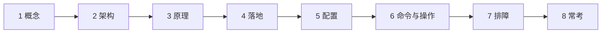
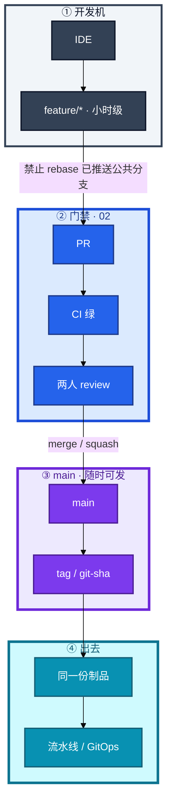
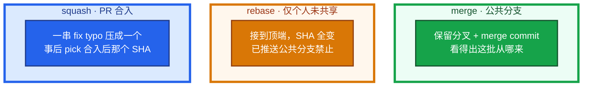
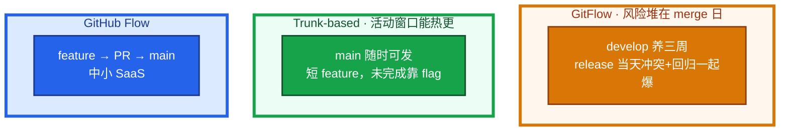
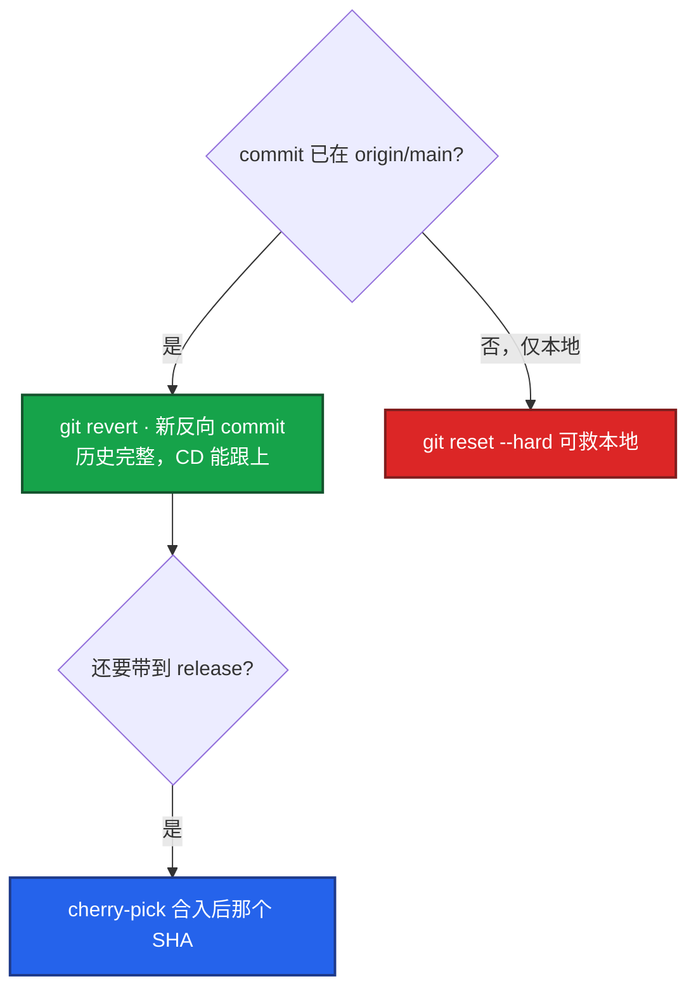
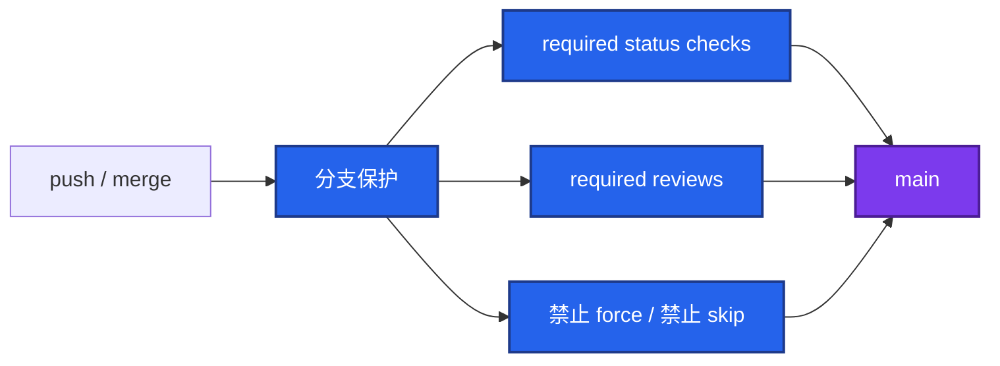
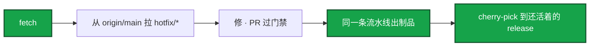
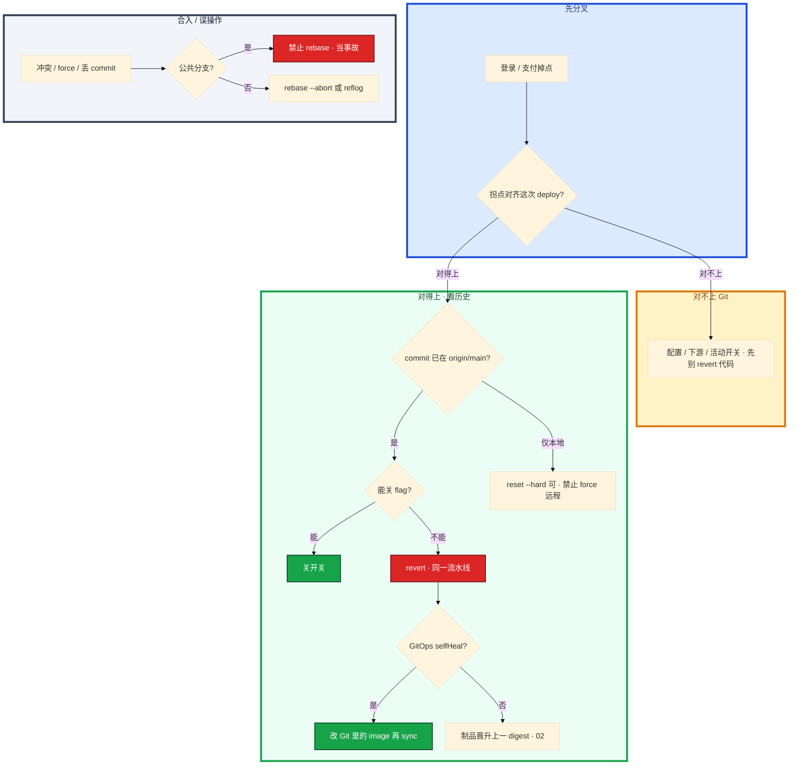

# Git 工作流



活动中途登录失败率掉了。`git log origin/main -1` 是 20 分钟前那次热更。群里有人要 `git reset --hard HEAD~1 && git push -f`，另有人已经 ssh 到逻辑服准备 vim，改完再「补一个 commit」。Argo 开着 selfHeal。

先别动手。这一章后半全是你会动手的：**怎么 hotfix、怎么 revert、怎么 cherry-pick、怎么 bisect、误 reset 怎么救、GitOps 回滚改哪。** 前面的分支模型和合入规则，是为了让你动手时不选错路。

**本章主线（排障就按这三步想）：**

1. **分历史**：commit 已在 `origin/main` = 公共历史，只能 revert，禁止 force
2. **选对路**：hotfix 从 `origin/main` 拉，走同一条流水线出制品
3. **留审计**：镜像 digest ↔ commit ↔ MR；GitOps 回滚必须改 Git

**读完你能：** 白板上画出 Trunk-based 和 GitFlow 差在哪天爆；线上坏了能判断 revert 还是 reset；会从 `origin/main` 拉 hotfix、bisect、reflog 救人、改 Git 而不是只 `rollout undo`。

## 本章目录


- [1. 基本概念](#1-基本概念)
- [2. 架构图](#2-架构图)
- [3. 原理](#3-原理)
  - [3.1 Trunk vs GitFlow](#31-trunk-based-vs-gitflow-vs-github-flow)
  - [3.2 merge / rebase / squash](#32-merge--rebase--squash)
  - [3.3 revert / reset / cherry-pick](#33-revert--reset--cherry-pick)
  - [3.4 游戏热更和 CI 怎么拆](#34-游戏热更和-ci-怎么拆)
- [4. 安装部署](#4-安装部署)
  - [4.1 生产怎么选](#41-生产怎么选)
  - [4.2 分支保护落地](#42-分支保护落地你实际看到什么)
- [5. 核心配置](#5-核心配置)
- [6. 命令与操作](#6-命令与操作)
- [7. 生产排障](#7-生产排障)
- [8. 必会 · 常考](#8-必会--常考)
- [合上书](#合上书问自己)

**本章不讲：** 流水线阶段、门禁、制品晋升 → [02 CI/CD](../02-CI-CD/)；镜像 digest、禁 latest → [03 制品](../03-制品与镜像/)；GHA / GitLab YAML、runner → [08](../08-GitHub-Actions与GitLab-CI/)；GitOps sync、selfHeal → [04-22](../../04-Kubernetes/22-GitOps-ArgoCD与Tekton/)；客户端热更包、CDN 缓存 → [08-03](../../08-游戏运维专题/03-热更新与版本发布/)。

---

## 1. 基本概念

Git 在生产里不是入门命令表。它是 **变更审计**：哪次 MR、哪颗 commit、哪份制品、线上现在跑的是不是同一份。

生产不是「谁先 push 谁赢」。一条变更要经过短分支、门禁、主干，再变成可追溯的制品。主干随时可发布；未完成功能靠 **feature flag** 藏着，而不是靠一条活了三周的 release 分支。

两个角色不要混：

| 角色 | 干什么 |
|------|--------|
| **公共历史** | 已经出现在别人 clone / CI / GitOps 里的 commit。只能再追加（revert / 新修复），不能擦掉 |
| **个人未共享分支** | 还没被人当父 commit 用。可以 rebase 整理；`--force-with-lease` 仅此 |

三条不要混：

| 在 Git 里管 | 不在 Git 工作流这章里管 |
|-------------|-------------------------|
| 分支怎么切、合入怎么留历史、线上怎么回退 | 流水线门禁怎么卡（02） |
| hotfix 从哪拉、cherry-pick 到哪条 release | 镜像 digest 怎么锁（03） |
| 回滚必须改 Git（GitOps 期望在仓库里） | 客户端包、CDN 缓存（08-03） |

> **记住**：公共历史上已经出现的 commit，只能再追加。hotfix 也走同一条路出制品，禁止生产机 vim 改完再「补一个 commit」。commit message 是变更审计的一部分：`feat:` → minor，`fix:` → patch，给 semantic-release / changelog 用；没有规范至少强制 PR 模板写影响面 / 回滚。

---

## 2. 架构图

先把整张图钉住。后面合入、hotfix、排障都对着这张图说话。



图上三条线：

1. **没有箭头从跳板机 / 生产机指回 main。** 生产不是 Git 仓库。
2. **合 main 必须过门禁。** 禁止 skip status check、禁止直推 main。
3. **坏了只追加。** revert 新 commit，不改写历史。CD / GitOps 才能跟上。

三种合入形态（合的时候选，出事时历史长得不一样）：



merge：合入公共分支，留下「这批改动从哪来」。  
rebase：只整理还没跟人共享的那条。  
squash：清噪音；中间 SHA 消失，cherry-pick 要对准合入后那颗。

---

## 3. 原理

原理只保留动手和面试会用到的：活动窗口怎么发、合入时历史长什么样、线上坏了这颗 commit 在不在别人手里、热更和 CI 为什么不能揉成一条流水线。

**本节 4 块：** 3.1 分支模型 · 3.2 合入 · 3.3 回退 · 3.4 热更拆分

### 3.1 Trunk-based vs GitFlow vs GitHub Flow

考察时常问「你们分支怎么切」。先说频率和风险，再报名。SRE 怕的不是模型名字，是 **长分支把冲突和回归堆到 merge 当天**——游戏热更、活动窗口扛不住这种批量集成。



| | Trunk-based | GitHub Flow | GitFlow |
|--|-------------|-------------|---------|
| 模型 | 主干 + 极短 feature | feature → PR → main | main + develop + release + hotfix |
| 发布 | main 即发布，flag 控功能 | main 随时可部署 | release 分支预发，打版本号 |
| 适合 | 持续交付、服务端热更 | 中小 SaaS | 强版本号、客户端整包 |
| 活动窗口 | 小步合入，单次变更小 | 同左，门禁更轻 | merge 日爆炸，登录修复被别人的 values 拖死 |

GitFlow 在活动窗口里实际发生的事：运营说今晚 8 点活动，登录队列要修。仓库是 `develop` 已经养了三周，上面叠了大厅、支付、战斗三批未合完的改动。登录修复必须先合进 `develop`，再切 `release/x.y`，再 cherry 或 merge 到 `main`。`git log develop --oneline` 一长串；PR 上 `values-prod.yaml` 红成一片；CI 在 release 分支重新跑了 40 分钟。卡住先问：**这条修复能不能从已发布的 main 拉短分支直接走**，而不是先把 develop 清干净。

Trunk-based 不是「谁都能直推 main」。它要求三件事同时成立：

1. CI 必须快（目标 **<10min**），否则短分支也会堵。
2. 回滚必须快（目标 **<5min**），否则没人敢合主干。
3. 未完成功能用 **feature flag** 关掉，而不是靠长分支隔离。

没有 flag 也能 Trunk：未完成代码会进生产二进制，必须靠分支保护、滞后部署或严格 code owner。代价是「看起来在主干，实际不能开」。大厂 Aone 一类流程，本质仍是主干 + PR 门禁。主干合得越勤，单次变更越小，MTTR 越好做。

GitFlow 的 develop / release 适合传统发版日历。客户端整包、强版本号的渠道包，可以单独留 release 线，**服务端主干不要被它拖死**。

生产 hotfix：从 **已发布的 main**（先 `fetch`）拉 `hotfix/*` → 修 → PR 回 main → 同一份制品晋升。还活着的 release 分支用 cherry-pick 带上。

一句话对照：服务端按主干热更；客户端整包可以有自己的 release 线，别让它拖死主干。

### 3.2 merge / rebase / squash

三种合入方式改的是历史长什么样，不是「哪种更高级」。

你的 `feature/login-queue` 还没推成公共分支，`origin/main` 已经往前走了 8 个 commit。本地 `git pull --rebase origin main`，卡在 `values-prod.yaml`。

| 方式 | 效果 | 何时用 |
|------|------|--------|
| merge | 保留分支分叉 + merge commit | 合入公共分支 |
| rebase | 复制 commit 接到顶端，SHA 全变 | **仅个人未共享分支** 整理 |
| squash | 多 commit 压成一个 | PR 合入时清噪音 |

**红线**：rebase 已推送的公共分支 = 改写别人的父 commit，协作者全部错乱。有人已经基于你的分支开了第二条 PR，再 rebase + force，对方的父 commit 全错——改用 merge。`git push -f` 日常禁用；私有分支不得已用 `--force-with-lease`（远端有新提交会拒绝，比裸 force 少踩一脚）。

冲突：`CONFLICT (content): Merge conflict in values-prod.yaml`。两边都加了一行：你加登录超时，别人加了 Ingress host。不要 Accept Incoming / Current——选一边就会丢配置。按语义把两行都留上，`git add` 再 `git rebase --continue`。rebase 到一半搞不清自己改过什么：`git rebase --abort` 比硬解更安全。解完必须再跑一遍 CI。常见漏网：漏合的文件、rebase 丢了 commit、submodule SHA 没更新。

反复冲突说明分支活太久 → 缩短分支或改 Trunk-based。配置文件、Helm values、K8s YAML、feature flag 配置，是冲突高频点；合并后再 `helm template` 或让 CI 跑一遍。生产冲突不要在跳板机直接 merge 完 push：本地解完推进 feature，再过 CI。

`git pull` 默认可能多一个无意义 merge commit，历史一团。个人分支同步主干用 `git pull --rebase`，前确认这条分支没人当公共历史用。从过期本地 main 拉 hotfix 会带上脏提交：先 `fetch`，再从 `origin/main` 拉。

> **记住**：公共分支只追加（merge / squash）；rebase 只整理还没跟人共享的那条。

### 3.3 revert / reset / cherry-pick

线上坏了，先问 **这颗 commit 有没有已经出现在别人 clone 里 / CI / GitOps 里**。有 = 公共历史，只能 revert。



`revert` 生成反向 commit，**不删除历史**。审计能回答「谁在什么时候把什么改回去了」。

`reset --hard` 只限本地未推送。已经 push 的公共分支 reset + force = 事故：同事 clone 乱、Jenkins 缓存旧 SHA、Argo 可能「成功发布一份没人 review 过的树」。`git fetch` 后 `git status` 会说 diverged。协调恢复，复盘为什么主分支保护没拦住 force。

`cherry-pick` 把某一颗 commit 复制到当前分支。hotfix 和 main 已分叉时，pick 完可能还要解一次冲突；不要在 prod 提交再反向 merge。squash 合入过的，pick **合入后** 那个 SHA，不要 pick 已消失的原 commit。revert 了 merge commit 要 `-m` 指定父；搞不清就不要硬 revert merge，改成 revert 那批有效改动或直接修。

已经 push 的 commit 想「改注释」：不要 amend + force。再补一个 commit。

GitOps 场景下回滚 = revert 那次 **改 image tag** 的 commit 再 sync。只 `kubectl rollout undo` 而 Git 仍是新 tag，selfHeal 会再推回来。集群的期望在 Git 里，回滚必须改 Git（细节 04-22）。

| 卡在 | 你看到的 | 先看 |
|------|----------|------|
| 坏 commit 已在 origin/main | `git log` 对得上发布时间 | revert，走同一条流水线 |
| revert 了 Git，集群还是坏镜像 | Argo 仍 sync 新 tag | 改 Git 里的 image，不要只 rollout undo |
| 有人 force 了 main | fetch 后 diverged | 当事故；查分支保护、CI 缓存的 SHA |
| cherry-pick 找不到原 commit | squash 后中间 SHA 消失 | pick 合入 main 后那一颗 |

### 3.4 游戏热更和 CI 怎么拆

服务端热更、客户端整包、数值/活动配置，**不要揉进同一条 CI**。Git 只保证服务端制品可追溯（镜像 tag / digest ↔ commit ↔ MR）。流水线怎么分段在 02，镜像怎么锁在 03，客户端包在 08-03。

```mermaid
%%{init: {"flowchart": {"padding": 16, "nodeSpacing": 28, "rankSpacing": 48}, "theme": "base"}}%%
flowchart TB
    subgraph srv ["服务端热更"]
        s1["短分支 ← origin/main"] --> s2["同一条 CI 出镜像 digest"]
        s2 --> s3["同一份制品晋升 · 02"]
    end
    subgraph cli ["客户端整包"]
        c1["独立 release 线 / 强版本号"] --> c2["渠道包流水线"]
        c2 --> c3["不要拖死服务端主干"]
    end
    subgraph cfg ["数值 / 活动 / 超时"]
        f1["flag 秒关"] --> f2["或 CDN 热更包 · 08-03"]
        f2 --> f3["或 Ansible reload · 04"]
        f3 --> f4["不要为改超时重新走镜像 CI"]
    end

    classDef a fill:#16A34A,stroke:#14532D,stroke-width:2px,color:#fff
    classDef b fill:#2563EB,stroke:#1E3A8A,stroke-width:2px,color:#fff
    classDef c fill:#D97706,stroke:#92400E,stroke-width:2px,color:#fff
    class s1,s2,s3 a
    class c1,c2,c3 b
    class f1,f2,f3,f4 c

    style srv fill:#ECFDF5,stroke:#16A34A,stroke-width:4px,color:#14532D
    style cli fill:#DBEAFE,stroke:#2563EB,stroke-width:4px,color:#1E3A8A
    style cfg fill:#FFF7ED,stroke:#D97706,stroke-width:4px,color:#9A3412
```



能关 flag 就关——比 revert 快，不必出新制品。SRE 关心两件事：**开关和发布流水线谁说了算**，以及关开关是否走变更单。flag 要清理，否则配置组合爆炸。长期开着的 flag 是债务，不是灵活。

活动中途：先降级 / 关活动开关，再 revert。热更包已经出去的，还要考虑客户端缓存（08-03）。Git 不能替 CDN 清缓存。

怎么证明这次线上就是某次 MR：镜像 tag 或 digest ↔ commit ↔ MR 链接，流水线留着。对不上就不要猜「应该是那次发布」。

---

## 4. 安装部署

### 4.1 生产怎么选

| 项 | 选 | 不选 |
|----|----|------|
| 服务端模型 | Trunk-based：短分支 + PR 门禁 + flag | 用 GitFlow 的 develop 养三周再热更登录 |
| 客户端 | 单独 release 线 / 强版本号 | 让客户端发版日历拖死服务端主干 |
| 合入公共分支 | merge 或 squash | rebase + 裸 force |
| 回退 | revert 走同一条流水线 | reset --hard + force main |
| hotfix | 从 `origin/main` 拉，同一制品晋升 | 生产机 vim 改完补历史 |
| 未完成功能 | feature flag | 活三周的 feature 分支当隔离 |

托管 GitHub / GitLab / 自建：上线前问清分支保护谁改、能否 skip check、force 是否真关、CODEOWNERS 是否覆盖 Helm values。

### 4.2 分支保护落地你实际看到什么

保护是权限，不是提醒。没拦住 force / skip，后面全是人情发布。



| 项 | 内容 |
|----|------|
| 保护分支 | `main`（以及还活着的 `release/*`） |
| required status checks | CI 绿才能合；**禁止 skip** |
| required reviews | 两人；CODEOWNERS 覆盖 `values-prod.yaml` / Helm |
| force push | 关 |
| 直推 main | 关；包括管理员 |
| PR 模板 | 影响面 / 回滚 / 是否改 schema |

验收：进程在 Git 托管上不算数。必须试一次：直推 main 被拒、skip check 没按钮、force 没权限。CODEOWNERS 没覆盖 values，等于配置可以一人合。

禁止 force main 的运维理由，不只是同事不高兴：CI 缓存了旧 SHA、Argo 追着 main，force 之后流水线可能「成功发布一份没人 review 过的树」。

---

## 5. 核心配置

只动有证据的项。保护规则三端（GitHub/GitLab/自建）必须一致，不要「本地 hook 有、托管没开」。

| 参数 | 默认/常见 | 生产怎么用 | 改错会怎样 |
|------|-----------|------------|------------|
| required reviews | 0 | **2**；values / Helm 加 CODEOWNERS | 一人合入绕过 |
| required status checks | 无 | CI 绿；禁止 skip | 人情发布，故障不可审计 |
| allow force push | 视托管 | **关** main / release | 历史改写，CI/GitOps 乱 |
| allow skip status checks | 视托管 | **关** | 扫描和测试被拆掉 |
| `git pull` 默认 | merge | 个人分支改 `pull.rebase=true` | 无意义 merge commit 一团 |
| `gc.reflogExpire` | **90 天** | 保持默认；别当备份 | 过期 / 新 clone 救不了 |
| conventional commits | 无 | `fix:` / `feat:` 驱动 changelog | 「update」无法反查 MR |
| commit 签名 | 可选 | 加分；不替代分支保护 | 有签名仍可合坏代码 |

> **记住**：分支保护用来拦住 skip 和 force，不是用来提醒。reflog 是本机 HEAD 移动记录，不是远程备份。

---

## 6. 命令与操作

### 6.0 速查

先 `fetch`，再对 `origin/main` 说话，避免过期本地 main。

| 目的 | 命令 | 看什么 |
|------|------|--------|
| 对齐远端 | `git fetch origin` | 再从 `origin/main` 拉 hotfix |
| 谁在尖上 | `git log origin/main -1 --oneline` | 坏 commit 是否已是公共历史 |
| 反向 | `git revert <sha>` | 新 commit；merge 要 `-m` |
| 本地回退 | `git reset --hard HEAD@{n}` | **未 push** 才允许 |
| 个人同步 | `git pull --rebase origin main` | 确认不是公共分支 |
| 带修复 | `git cherry-pick <sha>` | squash 后 pick 合入后那颗 |
| 二分 | `git bisect start` / `good` / `bad` / `run` | 可重复脚本，退出码 0=好 |
| 救 HEAD | `git reflog` | 本仓库本地；新 clone 没有 |
| 配置何时引入 | `git blame <file>` | 比在群里问快 |
| 预演冲突 | `git rebase --abort` | 搞不清就停 |

值班先跑这四条：

```bash
git fetch origin
git log origin/main -5 --oneline
git status
git log -1 --format='%H %s'
```

```text
a1b2c3d fix: login queue timeout
d4e5f6g feat: hall ingress
...
On branch main
Your branch is up to date with 'origin/main'.
a1b2c3d4e5f6... fix: login queue timeout
```

`git push -f` 打 main 等于事故。私有分支不得已：`--force-with-lease`。

怎么证明线上对应哪次 MR：

```bash
# 镜像 tag / digest ↔ commit ↔ MR，流水线留着（03 / 02）
git log -1 --format='%H'
```

---


### 6.1 个人分支同步

确认这条分支没人当公共历史用。

```bash
git fetch origin
git pull --rebase origin main
# 冲突：按语义解 values / flag，git add，git rebase --continue
# 搞不清：git rebase --abort
```

```text
a1b2c3d fix: login queue timeout
d4e5f6g feat: hall ingress
...
On branch main
Your branch is up to date with 'origin/main'.
a1b2c3d4e5f6... fix: login queue timeout
```

解完再跑一遍 CI。生产禁止跳板机直接合 main。

### 6.2 hotfix

从 **已发布的 main** 拉，不要从过期本地 main 拉。



1. 对齐指标拐点 vs deploy 时间 vs 镜像 digest。对不上不要 revert 代码——可能是配置、下游、活动开关。
2. 能关 flag 就关（变更单记一笔），不必出新包。
3. 不能关：`hotfix/*` 从 `origin/main` 拉，或 `git revert` 坏 commit。
4. PR 过门禁，同一条流水线出制品并晋升。禁止生产机直接改。
5. 还活着的 release（客户端包）用 cherry-pick 带上。
6. 事后：根因不清就 bisect；补回归测试进门禁。

活动中途：先降级活动 / 关开关，再动代码。

### 6.3 revert 线上

坏 commit 已在 origin/main、同事 clone 过、Jenkins 按这个 SHA 出过镜像、Argo 盯着这份 Git。只能再追加一颗反向 commit。

```bash
git revert <bad-sha>   # merge commit 加 -m 指定父
git push
# 走同一条流水线；GitOps：revert 改 image 的那次 commit 再 sync
```

revert 之后流水线又绿了、集群镜像还是坏的：Git 里 image 没改回去。只 `rollout undo` 不够。

### 6.4 cherry-pick 到 release

hotfix 已在 main，客户端 release 还要同一修复。

```bash
git checkout release/x.y
git cherry-pick <hotfix-sha-on-main>
```

squash 合入过的，pick 合入后那个 SHA。分叉后可能再解一次冲突。不要在 prod 提交再反向 merge。

### 6.5 bisect

已知某个 tag 好、HEAD 坏、中间几十上百个 commit，翻 MR 不如二分。复杂度 log₂(n)；80 个 commit 大约 7 次。

```bash
git bisect start
git bisect bad HEAD
git bisect good v1.2.0
# 测当前 checkout：好 → git bisect good；坏 → git bisect bad
git bisect run ./scripts/login_check.sh   # 退出码 0=好，非 0=坏
git bisect reset
```

测试必须可重复，不要依赖「当时那份玩家数据」。脚本打测试服登录接口。中间某次编不过：`git bisect skip`，或修到能跑测试再标 good/bad。根因在数据、配置、下游时，bisect 会指到一个无辜的代码改动——对照发布窗口和配置变更。

常见误判：把「第一次观测到坏」当成「引入点」。观测滞后时（登录失败率 10 分钟后才在大盘上翘），真正的引入 commit 更早。

> **记住**：bisect 找的是「哪颗 commit 起代码开始坏」，不是「哪次观测到坏」。

### 6.6 reflog 救本地

`reflog` 记的是 **本仓库 HEAD 怎么移动的**，不是远程备份。新 clone 没有你的 reflog。默认大约 **90 天**（`gc.reflogExpire`），gc 过后不可救。

本地修完登录还没 push，手滑 `git reset --hard origin/main`：

```bash
git reflog                    # 找 reset 前的 HEAD@{n}
git checkout HEAD@{2}         # 先看对不对
git reset --hard HEAD@{2}     # 确认后再回去；未 push 才允许
```

| 操作 | 还能不能救 | 怎么救 |
|------|------------|--------|
| 本地 `reset --hard` 未 push | 能 | `reflog` → checkout / `reset --hard HEAD@{n}` |
| 已 push 的 revert | 不需要救 | 历史还在 |
| `push -f` 主分支 | 看有没有别人 fetch | 协调恢复，当事故复盘 |
| 删了远程分支 | 能 | 别人本地还有 / reflog / 托管平台「恢复分支」 |
| commit 进错仓 | cherry-pick 到对的，原处 revert | 不要 force 擦公共历史 |

### 6.7 回滚

GitOps 回滚 = 改 Git 再 sync。数据（镜像、集群期望）升过就不是「把分支尖挪回去」。

1. 确认坏的是这次发布（时间 / digest / 区服）。
2. 能关 flag 就关。
3. `git revert` 改 image 的那次 commit（或 revert 坏代码），走同一条流水线。
4. 不要 `reset --hard` + force；不要只 `kubectl rollout undo`。
5. 没有升级前/发布前可追溯的 digest = 没有回滚（03）。

### 6.8 敏感文件进了 Git

当泄漏 **rotate**。历史要用 filter / BFG 清，光删文件不够。删敏感文件、重写全员历史，当事故做，不是日常。仓库开 secrets scanning / gitleaks（03）。

---

## 7. 生产排障

和集群同一套三问：进程还在不在？还能不能变更？已有流量还通不通？

**Git 上坏了 = 变更审计断了或集群期望错了，不是立刻踢玩家。** 能关 flag 就关；不要重启还活着的战斗服。



现场顺序：

```bash
git fetch origin
git log origin/main -5 --oneline
git status
# 集群 image 是否仍是新 tag（03 / 04-22）
```

```text
a1b2c3d fix: login queue timeout
d4e5f6g feat: hall ingress
...
On branch main
Your branch is up to date with 'origin/main'.
a1b2c3d4e5f6... fix: login queue timeout
```

| 现象 | 先做什么 | 不要做什么 |
|------|----------|------------|
| 坏 commit 已在 main | revert + 同一流水线；能关 flag 先关 | `reset --hard` + force |
| revert 了 Git 集群仍坏 | 改 Git 里 image；selfHeal 会打回 undo | 只 `rollout undo` |
| fetch 后 diverged | 当事故；查谁 force、分支保护 | 再 force 一次「清干净」 |
| values 冲突 | 按语义留两行；CI 再跑 | 跳板机 Accept Incoming 直推 main |
| rebase 公共分支后「commit 不见了」 | 别人基于旧 SHA；停 force | 继续 rebase |
| bisect 指到无辜 commit | 对照配置/下游/观测滞后 | 当根因直接 revert 那颗 |
| 敏感文件进 Git | 先 rotate | 只删文件当没事 |

活动高峰：先降级 / 关开关 → 确认是这次发布 → revert 走流水线。不要 vim 逻辑服。

---

## 8. 必会 · 常考

白板和追问高频，能一口回：

| 说法 | 对错 | 口径 |
|------|:----:|------|
| GitFlow 更规范所以服务端热更也该用 | 错 | 长分支把风险堆到 merge 日，活动窗口不适合 |
| Trunk-based = 谁都能直推 main | 错 | 短分支 + 门禁 + flag；CI <10min、回滚 <5min |
| 没有 flag 就不能 Trunk | 错 | 能，但未完成代码进生产二进制，靠保护或滞后部署 |
| 客户端整包必须拖死服务端主干 | 错 | 客户端可单独 release 线 |
| rebase 已推送的 `release/*` 让历史更干净 | 错 | 改写别人的父 commit |
| 线上坏了 `reset --hard` + force 最快 | 错 | 公共历史只能 revert |
| squash 之后 cherry-pick 原 feature SHA | 错 | pick 合入后那颗 |
| GitOps 只 `rollout undo` 就行 | 错 | selfHeal 会推回来，必须改 Git |
| `git pull` 默认 rebase | 错 | 默认常是 merge，多无意义 merge commit |
| reflog 在新 clone 里也能救 | 错 | 只在本仓库本地，约 90 天 |
| 跳板机 merge values 再直推 main | 错 | 本地解完走 feature + CI |
| 生产机 vim 改完补一个 commit | 错 | 审计对不上镜像 digest |
| 「第一次看到坏」就是 bisect 引入点 | 错 | 观测可滞后 |
| conventional commits 只是风格 | 错 | 变更审计；至少 PR 写影响面 / 回滚 |
| 关 flag 不必走变更单 | 错 | 谁说了算要讲清；长期 flag 是债务 |

数字：CI 目标 **<10min**；回滚目标 **<5min**；bisect 80 commit ≈ **7** 次；reflog 默认 **90 天**；review **2** 人。

易混：Trunk vs GitFlow（频率 vs 日历）；rebase vs merge（个人 vs 公共）；revert vs reset（追加 vs 擦历史）；cherry-pick 原 SHA vs 合入后 SHA；flag 关功能 vs revert 拿走代码；服务端热更 CI vs 客户端整包 vs CDN 数值。

生产纪律：短分支、PR 必过 CI、两人 review 才能合 main；生产 revert 保留审计；冲突按语义解，合完再跑 CI；hotfix 走同一条流水线。

---

## 合上书，问自己

1. Trunk-based 和 GitFlow 差在哪天爆？服务端和客户端怎么拆？
2. rebase / merge / squash 各何时用？已推送公共分支能不能 rebase？
3. 坏 commit 已在 main，revert 还是 reset？GitOps 只 undo 行不行？
4. hotfix 从哪拉？cherry-pick 对准哪颗 SHA？
5. bisect 怎么跑？观测滞后会怎样？reflog 新 clone 有没有？
6. 游戏热更、客户端整包、改 nginx 超时，各走 Git/CI、release 线还是 Ansible/CDN？

六题都能口述，这一章就过了。下一章把流水线剖开：门禁怎么卡、制品怎么晋升、staging 测过为什么不能在 prod 再 build 一次。
