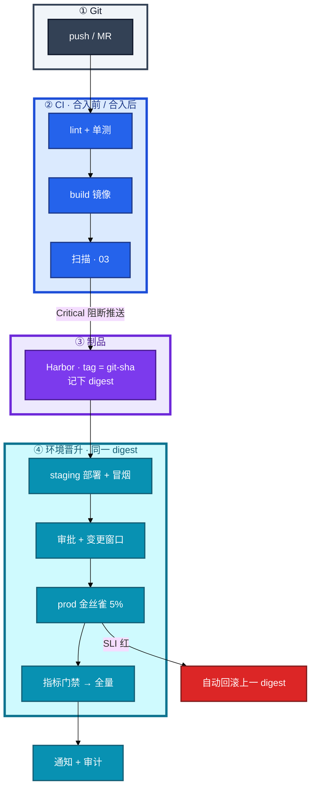
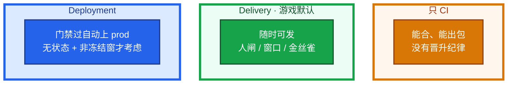
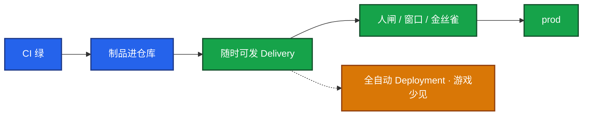
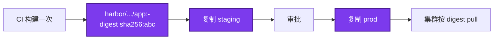
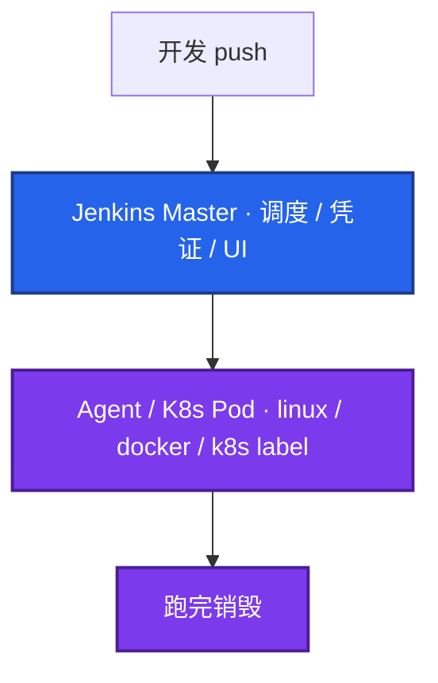
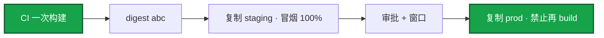
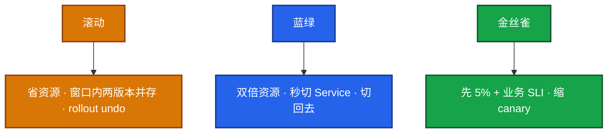
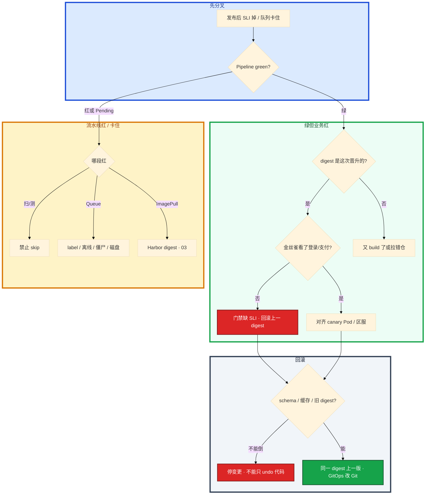

# CI/CD


流水线全绿，玩家登录不了。staging 测过的包，prod 再 `docker build` 一次，digest 对不上。群里有人要 skip 扫描「活动先开」，另有人把金丝雀只探了 `/health`。

先别改 Jenkins 插件。这一章后半全是你会动手的：**门禁怎么卡、制品怎么晋升、金丝雀看什么、失败怎么回滚、队列 Pending 先查哪。** 前面的 CI / Delivery / Deployment，是为了让你动手时不把游戏生产做成无脑 Deployment。

**读完你能：** 白板上画出从 Git 到玩家能打的分段；staging 测过能拒绝在 prod 再 build；会设不可 skip 的闸门、金丝雀看登录/支付、回滚前问 schema/缓存/旧 digest。

## 本章目录

缩进 = 上下级。3 下面才是 3.1。

想钉在**正文左边**跟着滚：菜单 **查看 → 打开视图 → 大纲**。Markdown 预览做不到独立左栏，目录只能写在文章开头。

- [1. 基本概念](#1-基本概念)
- [2. 架构图](#2-架构图)
- [3. 原理](#3-原理)
  - [3.1 CI / Delivery / Deployment](#31-ci--delivery--deployment)
  - [3.2 制品不可变](#32-制品不可变与晋升)
  - [3.3 质量闸门](#33-质量闸门不许-skip)
  - [3.4 游戏热更和 CI 怎么拆](#34-游戏热更和-ci-怎么拆)
- [4. 安装部署](#4-安装部署)
  - [4.1 生产怎么选](#41-生产怎么选)
  - [4.2 Jenkins 落地](#42-jenkins-落地你实际看到什么)
- [5. 核心配置](#5-核心配置)
- [6. 常用命令](#6-常用命令)
- [7. 常用操作](#7-常用操作)
  - [7.1 环境晋升](#71-环境晋升同一-digest)
  - [7.2 滚动 / 蓝绿 / 金丝雀](#72-滚动--蓝绿--金丝雀)
  - [7.3 发布失败](#73-发布失败-sop)
  - [7.4 回滚](#74-回滚与数据库)
  - [7.5 加速](#75-流水线加速)
  - [7.6 双轨](#76-多套-ci-一条-cd)
- [8. 生产排障](#8-生产排障)
- [9. 必会 · 常考](#9-必会--常考)
- [合上书](#合上书问自己)

**本章不讲：** workflow YAML、自托管 runner、fork PR 密钥 → [08](../08-GitHub-Actions与GitLab-CI/)；镜像分层、ENTRYPOINT、overlay2 → [07](../07-Docker深度/)；Harbor、扫描细节、禁 latest、digest 复制 → [03](../03-制品与镜像/)；GitOps、Argo selfHeal → [04-22](../../04-Kubernetes/22-GitOps-ArgoCD与Tekton/)；发布策略 YAML、Ingress 权重 → [04-15](../../04-Kubernetes/15-灰度与回滚/)；变更窗口、oncall 冻结 → [06](../06-运维平台与Oncall/)；分支、revert → [01](../01-Git工作流/)。

---

## 1. 基本概念

CI 管「能不能合、能不能出包」；CD 管「同一份包怎么一级级往上走」。排障顺着链路问，不要一上来改插件。

| 词 | 干什么 |
|----|--------|
| **CI（持续集成）** | 合并后自动 lint / test / build，失败 **阻断** 合入 |
| **持续交付 Delivery** | 随时有一份可发的制品；生产要审批、要窗口、要观测门禁 |
| **持续部署 Deployment** | 门禁过就自动上 prod。无状态 + 强门禁 + 自动回滚 + 非冻结窗口才考虑 |

灵魂四件（缺一件后面全是人情发布）：

1. 制品不可变（digest）
2. 环境晋升不重建
3. 质量门禁不可 skip
4. 分钟级可回滚

**Pipeline green 只说明阶段脚本成功，不等于玩家能登录。** staging 测过的镜像必须原样上 prod，禁止每个环境再 `docker build`。

DORA 四个数字用来讲改造，不要只说「自动化了」：部署频率、变更前置时间（lead time）、变更失败率、MTTR。讲改造时四个数字都要有前后：例如 lead time 2 天→2 小时，失败率、MTTR<5min。没有数字就不要说「提升了效率」。失败率 = 需人工介入的发布 / 总发布。主语用「我」；权衡速度 vs 审批。扛追问：冷启动、state、不可逆 DB。

> **记住**：CI 决定能不能合；Delivery 决定随时能发；游戏生产默认不停在人闸和窗口上。门禁一破口，后面全是人情发布，故障不可审计。

---

## 2. 架构图

先把整张图钉住。后面门禁、晋升、回滚都对着这张图说话。



图上三条线：

1. **没有箭头从 prod 指回 `docker build`。** 测过的是 digest，不是「同一份 Dockerfile 再编一次」。
2. **扫描 Critical → 阻断推送。** 权限上就不允许 skip。
3. **金丝雀红 → 自动回滚上一 digest。** 成功才通知 + 审计（谁 / 何时 / 哪个 digest）。

三种 CD 形态（游戏生产几乎停在中间那种）：



大厅那次修复合进 main，Jenkins / GHA 全绿，Harbor 里已经有 digest，prod 的 deploy job 停在 `input` 等人点。卡住先看：**这次有没有 schema、有没有活动冻结窗、金丝雀看的是不是登录 / 支付**。这三样任一不满足，就不要改成 Deployment。

什么可以全自动：无状态接入层、已演练过自动回滚、金丝雀看业务 SLI、且不在开服 / 活动冻结窗。逻辑服和 schema 不要套这套。标准变更可以自动（见 06）；支付、改表、开服窗口仍然要人闸。

---

## 3. 原理

原理只保留动手和面试会用到的：合 main 之后谁说了算、为什么不能每环境再 build、哪几道闸门最容易被人情拆掉、热更为什么不能和镜像 CI 揉在一起。

**本节 4 块：** 3.1 三种 CD · 3.2 不可变 · 3.3 闸门 · 3.4 热更拆分

### 3.1 CI / Delivery / Deployment



游戏有状态、活动窗口、DB 变更，生产几乎都是 **Delivery + 审批 + 观测门禁**，不是无脑 Deployment。把所有发布都做成 Deployment，活动日会把人闸和冻结一起拆掉。

Multibranch：feature 只跑 CI，main 才允许 deploy 相关 job。构建机出网白名单（仅 Harbor / Git）；Agent 上残留的 docker login 是泄漏面。密钥不进 Git：CI Credentials / Vault / External Secrets；K8s Secret 形态见 [04-12](../../04-Kubernetes/12-配置与密钥/)。

### 3.2 制品不可变与晋升

构建不是纯函数：基础镜像、包索引、时间戳都会让「同一份代码」变成不同二进制。staging 的结论不能用于一份新 build 的 prod。

具体：staging 冒烟全过。有人在 prod job 里又写了一行 `docker build`，「prod 基础镜像新一点更安全」。发完登录失败率掉了。staging 那份 digest 是 `sha256:abc`，prod 刚编出来的是 `sha256:def`。两边 Git SHA 一样也没用。



口误：`docker tag` 换仓库再 push **同一 digest** 才叫复制；`docker build` 再 push 叫重建。引用用 `image@sha256:...`，禁用 `latest`（为什么禁、Harbor 怎么复制，见 03）。配置不同用注入（ConfigMap / 环境变量），**不重新打包**。

> **记住**：测过的是 digest，不是「同一份 Dockerfile 再编一次」。

### 3.3 质量闸门不许 skip

人情最容易 skip 的是扫描和金丝雀。权限上就不允许跳过，而不是靠「下次注意」。`continue-on-error`、手动 skip、把扫描 job 标黄继续，都是破口。

| 阶段 | 硬阻断 |
|------|--------|
| 合入 | 单测过、覆盖率不降、lint / SAST 无 Critical |
| 制品 | CVE **Critical=0**；签名（cosign）可选但加分 |
| staging | 冒烟 **100%** |
| 金丝雀 | 5min 内 error_rate ≤ baseline+阈值，P99 ≤ baseline×1.2，**业务 SLI**（登录成功率 / 支付） |
| 生产 | 变更窗口 + 两人审批；DB 变更单独评估可逆性 |

失败策略写进流水线：测失败停、扫失败停、staging 红不许晋、金丝雀红自动回滚。

健康检查只探 `/health` 不够。金丝雀必须看业务指标，否则「Pod Ready、充值全挂」也会 green。指标要对齐 **canary Pod**，不要只看集群均值。

High CVE：团队阈值 + 截止日期，不是永久豁免。扫描红了仍能上线 = 门禁被 skip，当变更事故。flaky test 隔离、配额重跑，禁止当跳过门禁的理由。扫描过了线上仍爆 CVE：运行时才下载的包、sidecar 没扫、门禁被 skip、基础镜像被重打 tag（03）。

> **记住**：门禁是权限，不是提醒；扫描和金丝雀业务 SLI 最容易被人情拆掉。

### 3.4 游戏热更和 CI 怎么拆

服务端镜像、客户端整包、数值/活动、机器配置，四条路。揉进一条流水线：要么开服窗口被客户端包拖死，要么改超时也要重新 build 镜像。

```mermaid
%%{init: {"flowchart": {"padding": 16, "nodeSpacing": 28, "rankSpacing": 48}, "theme": "base"}}%%
flowchart TB
    subgraph img ["镜像 CI · 本章"]
        i1[服务端代码] --> i2[一次构建 digest]
        i2 --> i3[staging → 金丝雀 → prod]
    end
    subgraph pack ["客户端包"]
        p1[独立 release 线 · 01] --> p2[渠道流水线 · 08]
    end
    subgraph hot ["热更 / 数值"]
        h1[flag 或 CDN · 08-03] --> h2[不要打进业务镜像 · 03]
    end
    subgraph cfg ["机器配置"]
        a1[Ansible template + reload · 04] --> a2[不要为超时走镜像 CI]
    end

    classDef a fill:#16A34A,stroke:#14532D,stroke-width:2px,color:#fff
    classDef b fill:#2563EB,stroke:#1E3A8A,stroke-width:2px,color:#fff
    classDef c fill:#D97706,stroke:#92400E,stroke-width:2px,color:#fff
    classDef d fill:#7C3AED,stroke:#4C1D95,stroke-width:2px,color:#fff
    class i1,i2,i3 a
    class p1,p2 b
    class h1,h2 c
    class a1,a2 d

    style img fill:#ECFDF5,stroke:#16A34A,stroke-width:4px,color:#14532D
    style pack fill:#DBEAFE,stroke:#2563EB,stroke-width:4px,color:#1E3A8A
    style hot fill:#FFF7ED,stroke:#D97706,stroke-width:4px,color:#9A3412
    style cfg fill:#EDE9FE,stroke:#6D28D9,stroke-width:4px,color:#4C1D95
```



游戏逻辑服：滚动期间两版本并存，协议必须兼容。不能靠「停服发版」假装没有混合版本，除非变更单写明维护窗口。有状态发布另案见游戏模块。

---

## 4. 安装部署

### 4.1 生产怎么选

| 项 | 选 | 不选 |
|----|----|------|
| 游戏生产 CD | Delivery + 审批 + 金丝雀业务 SLI | 合 main 就 Deployment |
| 制品 | CI 一次构建，digest 复制晋升 | 每环境 `docker build` |
| 门禁 | 写进流水线，禁止 skip | `continue-on-error` 扫完继续 |
| CI 工具 | 按仓划分；**CD 只留一条** | Jenkins kubectl + Argo 双轨 |
| Agent | K8s 弹性，用完即毁 | Master 上跑 build |
| 加速 | 先砍最慢 stage | 先堆静态 Agent |

常见组合：轻量 CI 用 GitLab / GHA，重型编排用 Jenkins，CD 用 ArgoCD。Jenkins 强在混合环境（VM + K8s + Ansible）和遗留插件。YAML 怎么写在 08。

### 4.2 Jenkins 落地你实际看到什么

只记会挡生产的四块：**Master 不干活、凭证不进日志、Agent 用完即毁、队列先查 label 再加机器**。



| 项 | 内容 |
|----|------|
| Master | 生产 **`numExecutors=0`**。Master 跑 build 会把 UI 拖死 |
| Agent | 干活；弹性 Pod 跑完销毁，少在磁盘留 `~/.docker/config.json` |
| Pipeline as Code | Declarative（`pipeline { agent stages post }`）覆盖 90% |
| Shared Library | `@Library('lib@v1.2')` **版本 pin**；业务 Jenkinsfile 保持短 |
| 生产 deploy | `input` + `submitter` 限制谁能点 |
| SA | 只能 push 指定 Harbor project、deploy 指定 ns |

K8s 弹性 Agent：Job 触发 → Master 调 API 起 Pod（jnlp + 构建容器）→ JNLP 连回 Master → 跑完销毁。代价是冷启动 + 拉镜像。对策：构建镜像预装工具、节点镜像缓存、PVC 挂 Maven / npm / go mod。`resource limits` 防 OOM 吃节点；`podRetention: never` + 清理 Completed，防 Pod 泄漏。

动态 vs 固定：弹性、隔离、省常驻；固定适合特殊硬件 / 超重编译。冷启动把流水线拖慢了：预热镜像 + cache PVC，不要无脑加静态机。

开服前大厅要出包，队列里 20 个 Job 全 Pending。卡住先看 **Nodes 和磁盘**，再加容量。队列 Pending 常见四因：Agent 离线、label 不匹配、executor 被僵尸 Job 占满、`$JENKINS_HOME` 磁盘满。

凭证：

```groovy
withCredentials([usernamePassword(credentialsId: 'harbor',
    usernameVariable: 'USER', passwordVariable: 'PASS')]) {
    sh 'echo "$PASS" | docker login ... --password-stdin'  # 禁止 echo $PASS 到 Console
}
```

禁止 Jenkinsfile 明文、把 token 打进通知。Mask Passwords + Console 权限收紧 + 定期 rotate。凭证进了 Console = 泄漏：rotate、查 Git 历史、收紧日志、复盘。

Library 升级全红：pin 回去，业务文件不跟 latest。Shared Library 和业务 Jenkinsfile 都 pin，升级先在非生产仓吃一遍。

验收：Master `numExecutors=0`；直推凭证进日志能被 Mask；Completed Pod 会清；prod deploy 不是谁都能点。

---

## 5. 核心配置

只动有证据的项。门禁规则写进流水线，不要只写在 wiki。

| 参数 | 默认/常见 | 生产怎么用 | 改错会怎样 |
|------|-----------|------------|------------|
| `numExecutors`（Master） | >0 | **0** | UI 被 build 拖死 |
| required checks / 禁止 skip | 视托管 | **关 skip** | 扫描被人情拆掉 |
| 金丝雀窗口 | 无 | **5min**；error_rate、P99×1.2、登录/支付 | `/health` 绿、充值挂 |
| Critical CVE | 警告 | **阻断晋 prod** | 带洞上线 |
| 制品引用 | tag | **digest**；禁 latest | 每环境不同二进制 |
| Shared Library | `@latest` | **pin 版本** | 一次升级全红 |
| `podRetention` | 视插件 | **never** + 清 Completed | Pod 泄漏吃节点 |
| 出网 | 任意 | 白名单 Harbor / Git | 构建机成跳板 |
| Discard 旧构建 | 无限 | 开，减 IO | `$JENKINS_HOME` 盘满 |

> **记住**：`election-timeout` 那套不在这章。这里改错最贵的是 skip 门禁和 prod 再 build。quota 在 Harbor（03），不在 Jenkins 插件里加无限。

---

## 6. 常用命令

证书/凭证走 Credentials，不要写进命令行历史。

| 目的 | 命令 | 看什么 |
|------|------|--------|
| 两边是不是同一份 | `crane digest harbor/.../hall:v1.2.3-a1b2c3d` | staging 与 prod **必须相同** |
| 集群在跑哪份 | `kubectl get deploy hall -o jsonpath='{.spec.template.spec.containers[*].image}'` | 必须是 digest 或不可变 tag |
| 回滚 | `kubectl rollout undo deploy/hall` | GitOps 则 **先改 Git** 再 sync |
| 队列 | Jenkins Build Queue / Nodes | label、离线、磁盘 95% |
| 冒烟 | 业务登录 / 支付探针，不只 `/health` | 金丝雀对齐 canary Pod |

值班先对这四件：

```bash
crane digest harbor.example.com/staging/hall:v1.2.3-a1b2c3d
crane digest harbor.example.com/prod/hall:v1.2.3-a1b2c3d
kubectl get deploy hall -o jsonpath='{.spec.template.spec.containers[*].image}'
# Jenkins：Queue / Nodes / $JENKINS_HOME 磁盘
```

不相等就是又 build 了一次或拉错仓。不要拿 staging 的冒烟结论替 prod 辩护。

指标（门禁用，不是「看一眼」）：

| 指标 | 阈值 | 级别 |
|------|------|------|
| 金丝雀登录成功率 / 支付 | 低于 baseline+约定 | **P0 自动回滚** |
| error_rate | > baseline+阈值（5min） | P0 |
| P99 | > baseline×**1.2** | P1/P0 |
| Pipeline green 但 SLI 红 | — | 门禁缺业务指标 |
| `$JENKINS_HOME` 磁盘 | **> 0.9** | 队列 Pending |

日志：凭证出现在 Console = 泄漏；`continue-on-error` 扫红仍绿 = 门禁被拆。

---

## 7. 常用操作

### 7.1 环境晋升同一 digest



配置不同用注入，不重新打包。feature 分支只跑 CI，main 才允许 deploy job。

### 7.2 滚动 / 蓝绿 / 金丝雀

细节和 YAML 在 [04-15](../../04-Kubernetes/15-灰度与回滚/)。本章只要求选型理由和回滚动作。



1. 无状态、资源紧 → 滚动 + 强回滚。
2. 要秒切、买得起双倍 → 蓝绿。资源不够就别选蓝绿。
3. 高风险（支付、登录协议）→ 金丝雀 + 业务 SLI。
4. **回滚前问三件事**：schema 能否倒？缓存格式变了没有？旧镜像 digest 还在不在？

登录协议要改：滚动窗口里新旧逻辑服并存，一半玩家握手失败。卡住先看：这次协议是否双向兼容、金丝雀是不是只切了网关逻辑服还是旧 digest。不能停服假装滚动，除非变更单写明维护窗口。

K8s 默认滚动；金丝雀用 Ingress 权重 / Rollouts（04-15）。

### 7.3 发布失败 SOP

```
1. 对齐时间：指标何时烂 vs 何时 deploy
2. 看制品：当前 digest 是不是这次晋升的
3. 看滚动：新 Pod 是否 ImagePullBackOff / CrashLoop
4. 看业务 SLI，不只 HTTP 200
5. 止血：回滚同一 digest 的上一版；GitOps 则 revert Git 再 sync
6. 治理：哪道门禁被 skip 了、金丝雀有没有看业务指标
```

deploy 时间和登录成功率掉点对齐、digest 就是这次晋升的 → 先止血，不要先开 5-Why。金丝雀只切了网关、逻辑服还是旧 digest → Pipeline 照样绿。要对 **digest + 区服**，不要只看「集群里有新 Pod」。

### 7.4 回滚与数据库

代码回滚容易，**schema 不行**。禁止一个 MR 里改库又改不兼容代码。


回滚代码之后库报 unknown column / 缺列 → schema 不能倒，代码回滚救不了。变更单里必须单独评估可逆性。缓存换了 key 结构，回滚后旧代码读新缓存解析失败 → 发布清单写清缓存版本。

GitOps：只 `rollout undo` 会被 selfHeal 推回来，revert Git 再 sync（04-22）。制品库已经 GC 了上一版 = 没有回滚。保留至少能撑一次回滚的 N 个 digest（含当前），见 03。GameDay 演练回滚，不要事故当天第一次点 undo。MTTR 目标分钟级。

### 7.5 流水线加速

先看哪个 stage 慢，**不要先堆 Agent。**

1. 依赖缓存（PVC / actions cache / GitLab cache）
2. lint / test 并行
3. BuildKit
4. monorepo path filter
5. 重型 E2E 后置到 staging
6. 动态 Agent 慢 → 预热镜像 + cache PVC，不是加静态机

Discard 旧构建减 IO。队列一小时：先 label / 磁盘 / 僵尸，再扩；看是编译还是等锁。

### 7.6 多套 CI 一条 CD

CI 可以两套仓各用各的；**CD 只留一条**（GitOps 或只留一条 apply）。

```
对：GHA/GitLab 构建 + 改 Git；Argo 唯一落地
错：Jenkins kubectl + GitLab deploy + Argo selfHeal 抢
```

Jenkins 再 kubectl 一遍 + Argo 再 sync = 双轨。生产 `input` / `when: manual` 等价审批。凭证：CI masked + protected 或 Vault，不进 YAML。

---

## 8. 生产排障

三问：进程还在不在？还能不能变更？已有流量还通不通？

**流水线绿 ≠ 玩家能登录。** 已运行容器通常还在。不要先重启逻辑服。



现场顺序：

```bash
# 时间 / digest / 区服
crane digest .../staging/... && crane digest .../prod/...
kubectl get deploy -o jsonpath='{.spec.template.spec.containers[*].image}'
# Jenkins Queue / Nodes / df $JENKINS_HOME
```

| 现象 | 先做什么 | 不要做什么 |
|------|----------|------------|
| 流水线绿、业务红 | 对齐时间 / digest / 区服；金丝雀 SLI | 先开 5-Why；重启逻辑服 |
| staging 测过 prod 挂 | 比 digest；是否又 build | 拿 SHA 相同当同一二进制 |
| 扫描红仍绿 | 哪道门禁被 skip | 「活动先开下周补」 |
| Queue Pending | label / 离线 / 僵尸 / 磁盘 | 先加 20 台静态 Agent |
| 回滚代码库仍挂 | schema 可逆性 | 当纯 K8s 问题 |
| 回滚后解析失败 | 缓存 key 版本 | 再发一次同一坏 digest |
| ImagePullBackOff | Harbor digest 还在不在（03） | 改 Jenkins 插件 |
| undo 又回去 | 改 Git 再 sync（04-22） | 只 rollout undo |
| Shared Library 全红 | pin 回上一版 | 业务 Jenkinsfile 跟 latest |
| Master UI 打不开 | `numExecutors`、磁盘 | 在 Master 上跑 build |

活动高峰：确认是这次发布 → 停发版 → 回滚上一 digest → 恢复后先看登录/支付，再补自愈。金丝雀只打到无状态接入层、逻辑服还是旧的，按区服对 digest。

---

## 9. 必会 · 常考

白板和追问高频，能一口回：

| 说法 | 对错 | 口径 |
|------|:----:|------|
| 合 main 就该上全服 | 错 | 游戏默认 Delivery + 人闸 + 窗口 |
| Pipeline green = 玩家能登录 | 错 | 只说明阶段脚本成功 |
| staging 测过，prod 再 build 更安全 | 错 | 不是同一二进制 |
| Git SHA 相同就是同一份包 | 错 | 基础镜像 / 包索引 / 时间戳会变 |
| 金丝雀看 `/health` 够了 | 错 | 要登录 / 支付；对齐 canary Pod |
| 扫描 High 可以永久豁免 | 错 | 阈值 + 截止日期 |
| flaky test 可以 skip 门禁 | 错 | 隔离、配额重跑 |
| Master 跑 build 省 Agent | 错 | `numExecutors=0` |
| 队列慢先加机器 | 错 | 先 label / 僵尸 / 磁盘 |
| CI 两套就必须 CD 两套 | 错 | CI 可两套，CD 只一条 |
| 滚动发登录协议省资源 | 错 | 混合版本必须协议兼容，高风险走金丝雀 |
| 一个 MR 改库又改不兼容代码 | 错 | expand/contract；回滚救不了 |
| GitOps 只 undo | 错 | selfHeal 打回来 |
| 加速先堆 Agent | 错 | 先砍最慢 stage |
| 没有 DORA 数字也能说提升了效率 | 错 | 四个数字都要前后 |

数字：金丝雀 **5min**；P99 ≤ baseline×**1.2**；Critical **=0**；Master **numExecutors=0**；forks 不在这章（04）；MTTR **分钟级**；lead time 举例 2 天→2 小时。

易混：Delivery vs Deployment；digest 复制 vs 再 build；`/health` vs 业务 SLI；滚动 vs 金丝雀；代码回滚 vs schema；Jenkins vs Argo 双轨；镜像 CI vs 客户端包 vs CDN 热更 vs Ansible 配置。

改造怎么讲：Before / After + DORA；动作落到缓存、同一 digest 晋升、弹性 Agent、门禁不可 skip、回滚钩子。lead time 从 2 天到 2 小时，要讲清哪段被砍掉（等人、重 build、串行测试），哪段门禁反而更硬（扫描、金丝雀 SLI）。

---

## 合上书，问自己

1. CI、Delivery、Deployment 差在哪？游戏生产为什么默认不停在人闸上？
2. 为什么 staging 测过必须同一 digest 上 prod？怎么证明？
3. 哪几道闸门硬阻断？扫描和金丝雀怎样被人情拆掉？
4. Jenkins 四块红线？队列 Pending 先看什么？
5. 回滚前问哪三件事？expand/contract 是什么？GitOps 怎么回？
6. 服务端镜像、客户端整包、数值热更、改超时，各走哪条 CI？

六题都能口述，这一章就过了。下一章把制品剖开：一次构建、禁 latest、Harbor 就近拉、扫描和分层。
