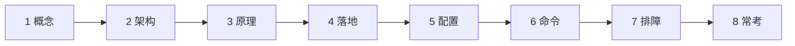
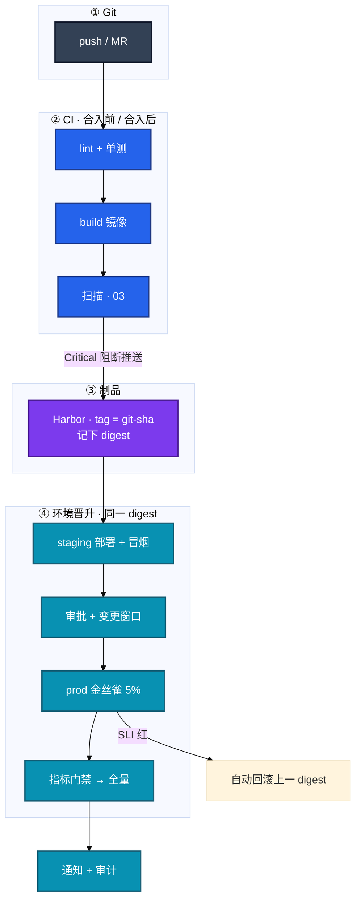
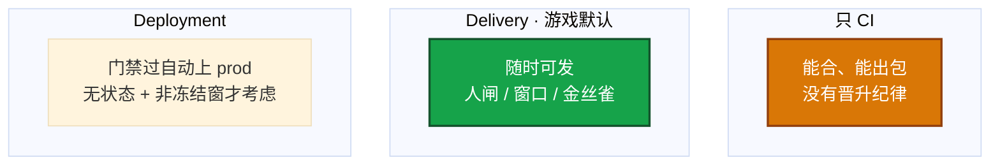
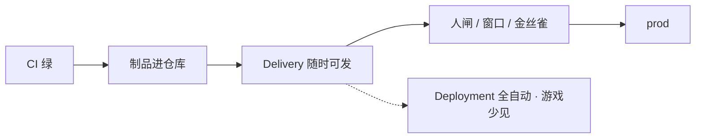
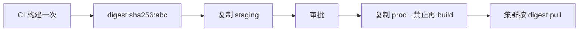
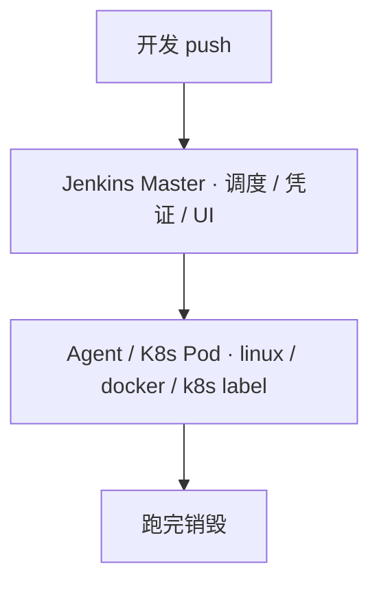
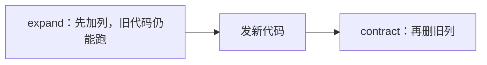
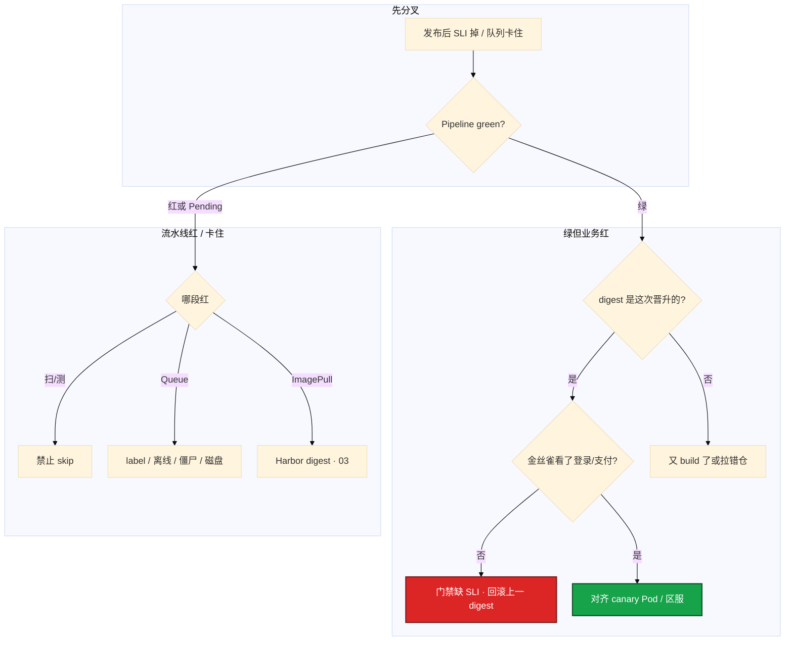

# CI/CD



流水线全绿，玩家登录不了。staging 冒烟 100% 过，prod job 里有人又跑了一次 `docker build`——Harbor 里 staging 是 `sha256:abc`，prod 刚编出来 `sha256:def`，Git SHA 一样。群里有人要 skip 扫描「活动先开」，金丝雀只探了 `/health`，充值成功率已经掉到 92%。

先别改 Jenkins 插件。这一章教你在这种现场：**门禁怎么卡、制品怎么晋升、金丝雀看什么、失败怎么回滚、队列 Pending 先查哪**——CI / Delivery / Deployment 分段，是为了让你动手时不把游戏生产做成无脑 Deployment。

**本章主线（排障就按这三步想）：**

1. **分阶段**：CI 绿 ≠ 玩家能登录；游戏生产默认 Delivery + 人闸
2. **锁 digest**：staging 测过的必须同一 digest 晋升 prod，禁止再 build
3. **卡闸门**：Critical=0、金丝雀看登录/支付 SLI，权限上不许 skip

**读完你能：** 白板上画出从 Git 到玩家能打的分段；staging 测过能拒绝在 prod 再 build；会设不可 skip 的闸门、金丝雀看登录/支付、回滚前问 schema/缓存/旧 digest。

## 本章目录

- [1. 基本概念](#1-基本概念)
- [2. 架构图](#2-架构图)
- [3. 原理](#3-原理)
- [4. 落地](#4-落地)
- [5. 核心配置](#5-核心配置)
- [6. 命令与操作](#6-命令与操作)
- [7. 生产排障](#7-生产排障)
- [8. 必会 · 常考](#8-必会--常考)
- [合上书](#合上书问自己)

**本章不讲：** workflow YAML、自托管 runner、fork PR 密钥 → [08](../08-GitHub-Actions与GitLab-CI/)；镜像分层、ENTRYPOINT、overlay2 → [07](../07-Docker深度/)；Harbor、扫描细节、禁 latest、digest 复制 → [03](../03-制品与镜像/)；GitOps、Argo selfHeal → [04-22](../../04-Kubernetes/22-GitOps-ArgoCD与Tekton/)；发布策略 YAML、Ingress 权重 → [04-15](../../04-Kubernetes/15-灰度与回滚/)；变更窗口、oncall 冻结 → [06](../06-运维平台与Oncall/)；分支、revert → [01](../01-Git工作流/)。

---

## 1. 基本概念

CI 管「能不能合、能不能出包」；CD 管「同一份包怎么一级级往上走」。排障顺着链路问，不要一上来改插件。

**值班里什么时候碰到 CI/CD**（先听监控和群里怎么说）：

| 监控/群里说的 | 技术含义 | 你的第一刀 |
|---------------|----------|------------|
| 「Pipeline 全绿」 | 阶段脚本成功 | 不等于玩家能登录——查 SLI |
| 「staging 测过了」 | 有一份 digest | prod 必须同一 digest，禁止再 build |
| 「skip 扫描先上」 | 门禁被拆 | 权限上就不该有 skip 按钮 |
| 「Queue 全 Pending」 | Agent/磁盘问题 | 先 label / 僵尸 / 磁盘，再加机器 |

| 词 | 干什么 |
|----|--------|
| **CI（持续集成）** | 合并后自动 lint / test / build，失败 **阻断** 合入 |
| **持续交付 Delivery** | 随时有一份可发的制品；生产要审批、要窗口、要观测门禁 |
| **持续部署 Deployment** | 门禁过就自动上 prod。无状态 + 强门禁 + 自动回滚 + 非冻结窗口才考虑 |

灵魂四件（缺一件后面全是人情发布）：

1. 制品不可变（digest）
2. 环境晋升不重建
3. 质量门禁不可 skip
4. 分钟级可回滚

**打个比方**：CI 像工厂质检——不合格不能出厂；Delivery 像合格品进冷库随时可发，但出库要双人签字和窗口；Deployment 像全自动出库机——游戏有状态、活动窗口，默认别全自动。

DORA 四个数字用来讲改造：部署频率、变更前置时间（lead time）、变更失败率、MTTR。讲改造时四个数字都要有前后：例如 lead time 2 天→2 小时，失败率、MTTR **<5min**。没有数字就不要说「提升了效率」。失败率 = 需人工介入的发布 / 总发布。

> **记住**：Pipeline green 只说明阶段脚本成功，不等于玩家能登录。staging 测过的镜像必须原样上 prod，禁止每个环境再 `docker build`。门禁一破口，后面全是人情发布，故障不可审计。

**面试怎么说**：「游戏生产我默认 Delivery：CI 出 digest、staging 冒烟、审批加窗口、金丝雀看登录支付 SLI。staging 测过的必须同一 digest 晋升 prod，Git SHA 相同再 build 也不是同一份二进制。」

---

## 2. 架构图

后面门禁、晋升、回滚都对着这张图。



**读图三句话：**

1. **没有箭头从 prod 指回 docker build**——测过的是 digest，不是「同一份 Dockerfile 再编一次」。
2. **扫描 Critical → 阻断推送**——权限上就不允许 skip。
3. **金丝雀 SLI 红 → 自动回滚上一 digest**——成功才通知 + 审计（谁 / 何时 / 哪个 digest）。

三种 CD 形态（游戏生产几乎停在中间那种）：



什么可以全自动：无状态接入层、已演练过自动回滚、金丝雀看业务 SLI、且不在开服 / 活动冻结窗。逻辑服和 schema 不要套这套。

---

## 3. 原理

### 3.1 CI / Delivery / Deployment

**一句话：** CI 绿只说明能出包；游戏生产默认 Delivery，停在人闸和窗口上。

**打个比方**：CI 像厨房出菜——菜做好了（build 成功）；Delivery 像菜进保温柜随时可上桌，但上 prod 要店长签字和看客流；Deployment 像机器人自动上菜——大厅可以，包间婚宴（活动窗口）不行。

**现场走一遍**（大厅修复合进 main，Jenkins 全绿，prod deploy 停在 input）：

1. 看流水线停在哪：

```bash
# Jenkins UI：prod deploy job 状态 input "Approve prod?"
# 或 GHA：environment: production 等 manual approval
kubectl get deploy hall -n prod -o wide
```

2. 屏幕出现：

```text
Build #482 · SUCCESS · waiting for input
Staging digest: sha256:abc123...
Prod job: PAUSED at "Deploy to prod?"
```

3. **说明什么**：CI 已完成，制品在 Harbor；Delivery 阶段等人闸。卡住先问三样：**这次有没有 schema、有没有活动冻结窗、金丝雀看的是不是登录/支付**——任一不满足就不要点 Approve。

4. 对照分段：



5. Multibranch：feature 只跑 CI，main 才允许 deploy 相关 job。密钥不进 Git：CI Credentials / Vault / External Secrets（04-12）。

**输出解读**：

| 阶段 | 你看到 | 说明 |
|------|--------|------|
| CI SUCCESS | lint/test/build/scan 过 | 能出 digest，不等于已上 prod |
| input / manual | 等人点 | Delivery 人闸，正常 |
| 全自动到 prod | 无 input | Deployment；游戏逻辑服慎用 |

**面试怎么说**：「我把 CI 和 CD 分开讲：CI 保证合入质量；游戏生产是 Delivery——审批、变更窗口、金丝雀业务 SLI。只有无状态接入层、非冻结窗、演练过自动回滚才考虑 Deployment。」

### 3.2 制品不可变与晋升

**一句话：** 测过的是 digest，不是「同一份 Dockerfile 再编一次」。

**打个比方**：staging 试吃的是 3 号箱那批货——prod 必须搬同一箱，不能「同配方现做一批新的」；基础镜像、包索引、时间戳都会变。

**现场走一遍**（staging 冒烟全过，prod 登录失败率掉点）：

1. 比两边 digest：

```bash
crane digest harbor.example.com/staging/hall:v1.2.3-a1b2c3d
crane digest harbor.example.com/prod/hall:v1.2.3-a1b2c3d
kubectl get deploy hall -n prod -o jsonpath='{.spec.template.spec.containers[*].image}'
```

2. 屏幕出现：

```text
harbor.example.com/staging/hall@sha256:abc123def456...
harbor.example.com/prod/hall@sha256:def789ghi012...    ← 不一样！
harbor.example.com/prod/hall@sha256:def789ghi012...
```

3. **说明什么**：Git SHA 一样，但 prod job 里又跑了一次 `docker build`——「prod 基础镜像新一点更安全」是典型事故。staging 的结论不能用于新 build 的 prod。

4. 正确晋升路径：



5. 口误：`docker tag` 换仓库再 push **同一 digest** 才叫复制；`docker build` 再 push 叫重建。引用用 `image@sha256:...`，禁用 `latest`（03）。

**输出解读**：

| 对比项 | 相同 | 不同 |
|--------|------|------|
| staging vs prod digest | 同一二进制晋升 | **又 build 了或拉错仓** |
| Git SHA vs digest | SHA 标识代码 | digest 标识实际二进制 |
| tag vs digest | tag 可漂移 | 生产引用 digest |

**面试怎么说**：「构建不是纯函数——基础镜像、包索引、时间戳都会变。staging 测过必须 crane 复制同一 digest 到 prod，禁止 prod job 再 docker build。配置不同用 ConfigMap 注入，不重新打包。」

> **记住**：测过的是 digest，不是「同一份 Dockerfile 再编一次」。

### 3.3 质量闸门不许 skip

**一句话：** 门禁是权限不是提醒；扫描和金丝雀业务 SLI 最容易被人情拆掉。

**打个比方**：闸门像地铁安检——不是贴「请勿携带」就完事，而是**物理上过不去**；`continue-on-error` 等于安检员说「这次先过吧」。

**现场走一遍**（活动前要上线，扫描 Critical=2，有人要 skip）：

1. 看 Jenkins / GHA 阶段结果：

```text
Stage: trivy-scan · FAILED · 2 Critical CVEs
Stage: deploy-prod · SKIPPED (manual override by admin)   ← 破口
Canary: /health 200 OK · login_success_rate 91.2% (baseline 99.5%)
```

2. **说明什么**：扫描红了仍继续 = 门禁被 skip；金丝雀只看 `/health`，Pod Ready 但充值全挂也会「绿」。

3. 硬阻断表：

| 阶段 | 硬阻断 |
|------|--------|
| 合入 | 单测过、覆盖率不降、lint / SAST 无 Critical |
| 制品 | CVE **Critical=0**；签名（cosign）可选但加分 |
| staging | 冒烟 **100%** |
| 金丝雀 | **5min** 内 error_rate ≤ baseline+阈值，P99 ≤ baseline×**1.2**，**登录成功率 / 支付** |
| 生产 | 变更窗口 + 两人审批；DB 变更单独评估可逆性 |

4. 金丝雀必须对齐 **canary Pod**，不要只看集群均值：

```bash
# 伪代码：Prometheus 按 canary 标签过滤
login_success_rate{deployment="hall-canary"} < baseline - 0.5%
```

5. 失败策略写进流水线：测失败停、扫失败停、staging 红不许晋、金丝雀红自动回滚。flaky test 隔离、配额重跑，禁止当跳过门禁的理由。

**输出解读**：

| 现象 | 根因 | 治理 |
|------|------|------|
| 扫描红仍绿 | skip / continue-on-error | 权限上关 skip |
| health 绿 SLI 红 | 门禁缺业务指标 | 加登录/支付探针 |
| High CVE 永久豁免 | 人情 | 阈值 + 截止日期 |

**面试怎么说**：「门禁写进流水线且不可 skip——Critical 必须零，金丝雀 5 分钟看 error_rate、P99 乘 1.2、登录和支付 SLI，对齐 canary Pod。health 200 不够，充值挂也会绿。」

> **记住**：门禁是权限，不是提醒；扫描和金丝雀业务 SLI 最容易被人情拆掉。

### 3.4 游戏热更和 CI 怎么拆

**一句话：** 服务端镜像、客户端整包、数值/活动、机器配置——四条路，别揉进一条 CI。

**打个比方**：改 nginx 超时像调空调温度——走 Ansible 遥控就行；改战斗逻辑像换发动机——必须走镜像 CI 整条链。

**现场走一遍**（运营要关活动开关 + 服务端要修 login bug）：

1. 先走最快的（不必 rebuild）：

```bash
# flag 秒关
curl -X POST config-svc/flags -d '{"login-queue-enabled": false}'

# 数值热更 CDN（08-03），不打进业务镜像
```

2. 服务端代码才走镜像 CI：

```bash
# main 合入 → CI 一次 build → digest
crane digest harbor.example.com/staging/login-svc:v1.2.3-a1b2c3d
# staging 冒烟 → 审批 → 同一 digest 复制 prod
```

3. 客户端整包走独立线（01 / 08）：

```text
release/3.2.1 → 渠道包流水线 · 不要拖死服务端主干
```

4. 机器配置（04）：

```bash
ansible-playbook deploy/nginx-timeout.yml --limit login-gw
# 不要为改超时走镜像 CI
```

5. 游戏逻辑服：滚动期间两版本并存，协议必须兼容。不能靠「停服发版」假装没有混合版本，除非变更单写明维护窗口。

**输出解读**：

| 变更 | 路径 | 禁止 |
|------|------|------|
| 服务端 bug | 镜像 CI → digest 晋升 | prod 再 build |
| 客户端整包 | 独立 release 线 | 拖死主干 CI |
| 活动数值 | flag / CDN | 打进业务镜像 |
| nginx 超时 | Ansible reload | rebuild 镜像 |

**面试怎么说**：「四条路：服务端一次 build digest 晋升；客户端独立 release；数值 flag 或 CDN；机器配置 Ansible。逻辑服滚动必须协议兼容，高风险走金丝雀加业务 SLI，不能停服假装没有混合版本。」

---

## 4. 落地

### 4.1 生产怎么选

| 项 | 选 | 不选 |
|----|----|------|
| 游戏生产 CD | Delivery + 审批 + 金丝雀业务 SLI | 合 main 就 Deployment |
| 制品 | CI 一次构建，digest 复制晋升 | 每环境 docker build |
| 门禁 | 写进流水线，禁止 skip | continue-on-error 扫完继续 |
| CI 工具 | 按仓划分；**CD 只留一条** | Jenkins kubectl + Argo 双轨 |
| Agent | K8s 弹性，用完即毁 | Master 上跑 build |
| 加速 | 先砍最慢 stage | 先堆静态 Agent |

常见组合：轻量 CI 用 GitLab / GHA，重型编排用 Jenkins，CD 用 ArgoCD。YAML 怎么写在 08。

### 4.2 Jenkins 落地你实际看到什么

只记会挡生产的四块：**Master 不干活、凭证不进日志、Agent 用完即毁、队列先查 label 再加机器**。



| 项 | 内容 |
|----|------|
| Master | 生产 **`numExecutors=0`**。Master 跑 build 会把 UI 拖死 |
| Agent | 弹性 Pod 跑完销毁，少留 `~/.docker/config.json` |
| Pipeline as Code | Declarative 覆盖 90% |
| Shared Library | `@Library('lib@v1.2')` **版本 pin** |
| 生产 deploy | `input` + `submitter` 限制谁能点 |
| SA | 只能 push 指定 Harbor project、deploy 指定 ns |

K8s 弹性 Agent：Job 触发 → Master 起 Pod → JNLP 连回 → 跑完销毁。对策：构建镜像预装工具、PVC 挂 Maven/npm/go mod、`podRetention: never`。

队列 Pending 常见四因：Agent 离线、label 不匹配、executor 被僵尸 Job 占满、`$JENKINS_HOME` 磁盘满（**>0.9** 先清）。

凭证禁止 echo 到 Console；Mask Passwords + 定期 rotate。Library 升级全红：pin 回去，业务 Jenkinsfile 不跟 latest。

---

## 5. 核心配置

只动有证据的项。门禁规则写进流水线，不要只写在 wiki。

| 参数 | 默认/常见 | 生产怎么用 | 改错会怎样 |
|------|-----------|------------|------------|
| `numExecutors`（Master） | >0 | **0** | UI 被 build 拖死 |
| required checks / 禁止 skip | 视托管 | **关 skip** | 扫描被人情拆掉 |
| 金丝雀窗口 | 无 | **5min**；error_rate、P99×1.2、登录/支付 | health 绿、充值挂 |
| Critical CVE | 警告 | **阻断晋 prod** | 带洞上线 |
| 制品引用 | tag | **digest**；禁 latest | 每环境不同二进制 |
| Shared Library | @latest | **pin 版本** | 一次升级全红 |
| `podRetention` | 视插件 | **never** + 清 Completed | Pod 泄漏吃节点 |
| Discard 旧构建 | 无限 | 开，减 IO | 盘满队列 Pending |

> **记住**：改错最贵的是 skip 门禁和 prod 再 build。quota 在 Harbor（03），不在 Jenkins 插件里加无限。

---

## 6. 命令与操作

### 6.1 命令速查

证书/凭证走 Credentials，不要写进命令行历史。

| 目的 | 命令 | 看什么 |
|------|------|--------|
| 两边是不是同一份 | `crane digest harbor/.../hall:v1.2.3-a1b2c3d` | staging 与 prod **必须相同** |
| 集群在跑哪份 | `kubectl get deploy hall -o jsonpath='{.spec.template.spec.containers[*].image}'` | 必须是 digest 或不可变 tag |
| 回滚 | `kubectl rollout undo deploy/hall` | GitOps 则 **先改 Git** 再 sync |
| 队列 | Jenkins Build Queue / Nodes | label、离线、磁盘 95% |
| 冒烟 | 业务登录 / 支付探针，不只 `/health` | 金丝雀对齐 canary Pod |

值班先对这四件：

```bash
crane digest harbor.example.com/staging/hall:v1.2.3-a1b2c3d
crane digest harbor.example.com/prod/hall:v1.2.3-a1b2c3d
kubectl get deploy hall -o jsonpath='{.spec.template.spec.containers[*].image}'
# Jenkins：Queue / Nodes / df $JENKINS_HOME
```

```text
harbor.example.com/staging/hall@sha256:abc123...
harbor.example.com/prod/hall@sha256:abc123...
harbor.example.com/prod/hall@sha256:abc123...
```

| 输出 | 正常 | 异常 |
|------|------|------|
| 三个 digest 相同 | 同一二进制晋升 | 不相等 → 又 build 或拉错仓 |
| image 含 @sha256 | 不可变引用 | 只有 :latest → 03 |

### 6.2 环境晋升同一 digest

配置不同用注入，不重新打包。feature 分支只跑 CI，main 才允许 deploy job。

### 6.3 滚动 / 蓝绿 / 金丝雀

细节 YAML 在 [04-15](../../04-Kubernetes/15-灰度与回滚/)。本章只要求选型理由和回滚动作。

| 策略 | 特点 | 何时用 |
|------|------|--------|
| 滚动 | 省资源；窗口内两版本并存 | 无状态、资源紧 |
| 蓝绿 | 双倍资源；秒切 Service | 买得起双倍 |
| 金丝雀 | 先 5% + 业务 SLI | 支付、登录协议 |

**回滚前问三件事**：schema 能否倒？缓存格式变了没有？旧镜像 digest 还在不在（03）？

登录协议要改：滚动窗口里新旧逻辑服并存，一半玩家握手失败——先看协议是否双向兼容、金丝雀是否只切了网关而逻辑服还是旧 digest。

### 6.4 发布失败 SOP

1. 对齐时间：指标何时烂 vs 何时 deploy
2. 看制品：当前 digest 是不是这次晋升的
3. 看滚动：新 Pod 是否 ImagePullBackOff / CrashLoop
4. 看业务 SLI，不只 HTTP 200
5. 止血：回滚同一 digest 的上一版；GitOps 则 revert Git 再 sync
6. 治理：哪道门禁被 skip、金丝雀有没有看业务指标

### 6.5 回滚与数据库

代码回滚容易，**schema 不行**。禁止一个 MR 里改库又改不兼容代码。



回滚代码之后库报 unknown column → schema 不能倒。缓存换了 key 结构，回滚后旧代码读新缓存解析失败 → 发布清单写清缓存版本。GitOps 只 undo 会被 selfHeal 推回来（04-22）。制品库 GC 了上一版 = 没有回滚。MTTR 目标 **分钟级**。

### 6.6 流水线加速

先看哪个 stage 慢，**不要先堆 Agent**：依赖缓存 → lint/test 并行 → BuildKit → monorepo path filter → 重型 E2E 后置 staging。动态 Agent 慢 → 预热镜像 + cache PVC。

### 6.7 多套 CI 一条 CD

```
对：GHA/GitLab 构建 + 改 Git；Argo 唯一落地
错：Jenkins kubectl + GitLab deploy + Argo selfHeal 抢
```

---

## 7. 生产排障

三问：进程还在不在？还能不能变更？已有流量还通不通？

**流水线绿 ≠ 玩家能登录。** 已运行容器通常还在。不要先重启逻辑服。



| 现象 | 先做什么 | 不要做什么 |
|------|----------|------------|
| 流水线绿、业务红 | 对齐时间 / digest / 区服；金丝雀 SLI | 先开 5-Why；重启逻辑服 |
| staging 测过 prod 挂 | 比 digest；是否又 build | 拿 SHA 相同当同一二进制 |
| 扫描红仍绿 | 哪道门禁被 skip | 「活动先开下周补」 |
| Queue Pending | label / 离线 / 僵尸 / 磁盘 | 先加 20 台静态 Agent |
| 回滚代码库仍挂 | schema 可逆性 | 当纯 K8s 问题 |
| undo 又回去 | 改 Git 再 sync（04-22） | 只 rollout undo |
| Shared Library 全红 | pin 回上一版 | 业务 Jenkinsfile 跟 latest |
| Master UI 打不开 | numExecutors、磁盘 | 在 Master 上跑 build |

活动高峰：确认是这次发布 → 停发版 → 回滚上一 digest → 恢复后先看登录/支付，再补自愈。

---

## 8. 必会 · 常考

| 说法 | 对错 | 口径 |
|------|:----:|------|
| 合 main 就该上全服 | 错 | 游戏默认 Delivery + 人闸 + 窗口 |
| Pipeline green = 玩家能登录 | 错 | 只说明阶段脚本成功 |
| staging 测过，prod 再 build 更安全 | 错 | 不是同一二进制 |
| Git SHA 相同就是同一份包 | 错 | 基础镜像 / 包索引 / 时间戳会变 |
| 金丝雀看 /health 够了 | 错 | 要登录 / 支付；对齐 canary Pod |
| 扫描 High 可以永久豁免 | 错 | 阈值 + 截止日期 |
| flaky test 可以 skip 门禁 | 错 | 隔离、配额重跑 |
| Master 跑 build 省 Agent | 错 | numExecutors=0 |
| 队列慢先加机器 | 错 | 先 label / 僵尸 / 磁盘 |
| CI 两套就必须 CD 两套 | 错 | CI 可两套，CD 只一条 |
| 滚动发登录协议省资源 | 错 | 混合版本必须协议兼容 |
| 一个 MR 改库又改不兼容代码 | 错 | expand/contract；回滚救不了 |
| GitOps 只 undo | 错 | selfHeal 打回来 |
| 加速先堆 Agent | 错 | 先砍最慢 stage |
| 没有 DORA 数字也能说提升了效率 | 错 | 四个数字都要前后 |

数字：金丝雀 **5min**；P99 ≤ baseline×**1.2**；Critical **=0**；Master **numExecutors=0**；MTTR **分钟级**；lead time 举例 2 天→2 小时。

易混：Delivery vs Deployment；digest 复制 vs 再 build；/health vs 业务 SLI；滚动 vs 金丝雀；代码回滚 vs schema；Jenkins vs Argo 双轨；镜像 CI vs 客户端包 vs CDN 热更 vs Ansible 配置。

改造怎么讲：Before / After + DORA；动作落到缓存、同一 digest 晋升、弹性 Agent、门禁不可 skip、回滚钩子。

---

## 合上书，问自己

1. CI、Delivery、Deployment 差在哪？游戏生产为什么默认不停在人闸上？
2. 为什么 staging 测过必须同一 digest 上 prod？怎么证明？
3. 哪几道闸门硬阻断？扫描和金丝雀怎样被人情拆掉？
4. Jenkins 四块红线？队列 Pending 先看什么？
5. 回滚前问哪三件事？expand/contract 是什么？GitOps 怎么回？
6. 服务端镜像、客户端整包、数值热更、改超时，各走哪条 CI？

六题都能口述，这一章就过了。下一章把制品剖开：一次构建、禁 latest、Harbor 就近拉、扫描和分层。
