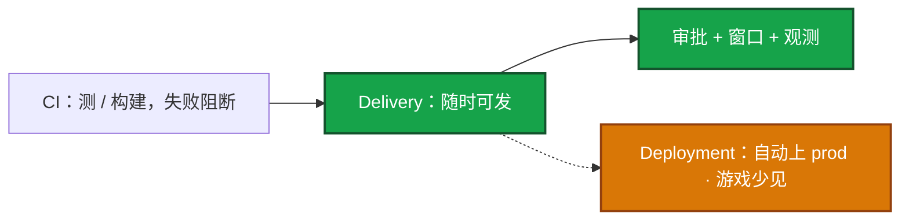
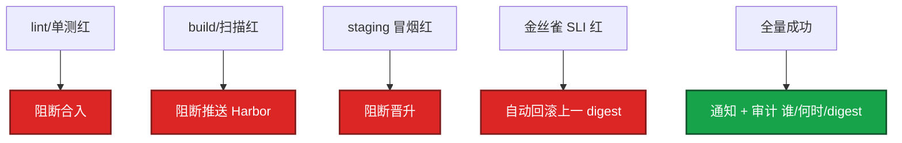
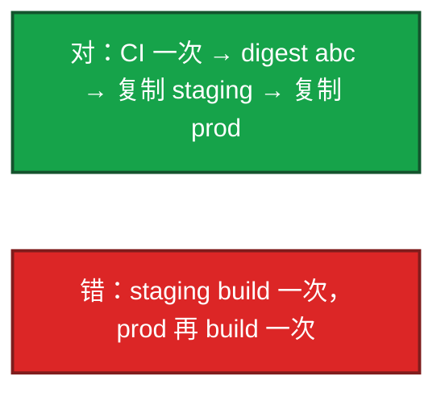
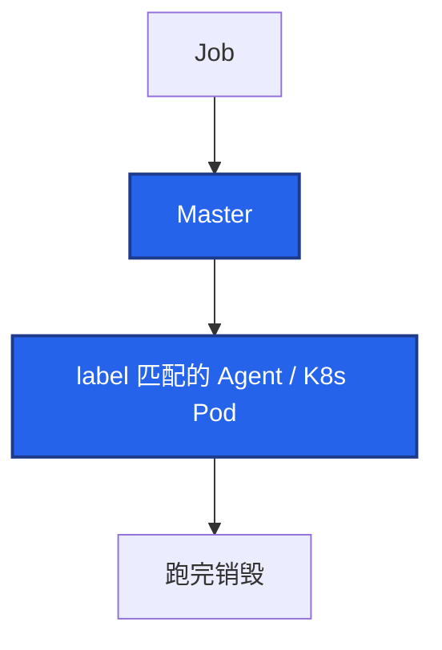

# 02｜CI/CD · 练习题

先自己画图或口述，再对照解答。每题标了覆盖范围：

| 标记 | 含义 |
|------|------|
| **核心** | 不懂整章就没建立起来 |
| **必会** | 值班和面试都要能讲 |
| **常用** | 线上会反复碰到 |
| **常考** | 白板和追问的高频口径 |

## 本题目录

- [Q1 CI / Delivery / Deployment](#q1)
- [Q2 画一条生产流水线](#q2)
- [Q3 同一 digest 晋升](#q3)
- [Q4 Jenkins Master / Agent](#q4)
- [Q5 质量闸门](#q5)
- [Q6 回滚](#q6)
- [Q7 多套 CI 一条 CD](#q7)
- [Q8 流水线加速](#q8)
- [Q9 Pipeline green 业务红](#q9)
- [Q10 滚动 / 蓝绿 / 金丝雀](#q10)
- [Q11 DORA / 热更拆分](#q11)
- [合上书](#合上书)

---

## Q1

**★★★★★｜CI 和 CD（Delivery vs Deployment）区别？游戏生产用哪个？**

**覆盖**：核心 · 必会 · 常考

### 场景

「我们要做到持续部署，合并 main 就上生产。」下周开活动，逻辑服还要改表。

### 完整解答



游戏有状态、活动窗口、DB 变更，几乎都是 **Delivery**。全自动部署只在：无状态 + 强门禁 + 自动回滚 + 非冻结窗口。关键词：制品不可变、晋升不重建、门禁不可 skip、可回滚。

### 再追问

- 没有审批是不是更 SRE？——标准变更可以自动（见 06）。支付、改表、开服窗口仍然要人闸。把所有发布都做成 Deployment，活动日会把人闸和冻结一起拆掉。

---

## Q2

**★★★★★｜画一条生产流水线，每段失败怎么办？**

**覆盖**：核心 · 必会 · 常考

### 场景

让你从零讲「代码进 Git 到玩家能打」，有人开始背插件列表。

### 完整解答



tag = git-sha，记下 digest。生产审批 + 窗口。Pipeline green ≠ 玩家能登录。最容易被人情 skip 的是扫描和金丝雀——权限上不允许 skip。

### 再追问

- 哪一步最该看业务指标？——金丝雀。`/health` 过了充值可以全挂。对齐 canary Pod，不要只看集群均值。

---

## Q3

**★★★★★｜为什么 staging 测过还要同一 digest 上 prod？**

**覆盖**：核心 · 必会 · 常考

### 场景

预发测了两天。生产流水线又 `docker build` 了一次，晚上支付挂了。两边 Git SHA 一样。

### 完整解答

重新 build 不是同一二进制。基础镜像、包索引、时间戳都会变。预发结论不能用于生产。



Harbor 复制同一 sha256。引用用 digest，禁用 latest。配置不同：注入，不重新打包。口误：`docker tag` 再 push 同一 digest 才叫复制。细节在 03，本题答到「晋升不重建」就够。

### 再追问

- 怎么证明 prod 就是预发那份？——`crane digest` 或仓库 API 比 sha256；集群里的 image 字段必须是这个 digest。

---

## Q4

**★★★★★｜Jenkins Master / Agent 和 K8s 弹性 Agent？队列 Pending 先看什么？**

**覆盖**：核心 · 必会 · 常用

### 场景

Jenkins UI 打不开，构建全堆着。有人说加 20 台静态 Agent。Master 上 `numExecutors` 还是 4。

### 完整解答

Master 调度、凭证、UI，生产 **`numExecutors=0`**。Agent 干活。Master 跑 build 会把 UI 拖死。



K8s：Job 起 Pod，用完销毁。弹性省常驻、隔离干净；代价冷启动和拉镜像 → 预热 + PVC 缓存。凭证 `withCredentials`，禁止 echo 密码。

队列 Pending 先看：label 不匹配、Agent 离线、僵尸 Job 占 executor、`$JENKINS_HOME` 磁盘满。**先别加机器。** Pod 泄漏：`podRetention: never` + 清理 Completed。SA 最小权限。

### 再追问

- 动态 Agent 比静态慢？——多半是冷启动 + 拉镜像。预热镜像和 cache PVC；超重编译可留少量静态。不要无脑加静态机。

---

## Q5

**★★★★☆｜质量门禁你设哪些硬阻断？High CVE 怎么办？**

**覆盖**：必会 · 常用 · 常考

### 场景

安全扫描出 Critical，活动负责人要 skip「今晚先发」。健康检查是 `/health` 返回 200。扫描 job 写了 `continue-on-error`。

### 完整解答

| 阶段 | 硬阻断 |
|------|--------|
| 合入 | 单测 / 覆盖率 / Critical SAST |
| 制品 | CVE Critical = 0 |
| staging | 冒烟 100% |
| 金丝雀 | 业务 SLI + 错误率 + P99（5min） |
| 生产 | 窗口 + 两人；DB 单独评估可逆 |

规则写进流水线不可 skip。登录 / 支付才是游戏门禁，`/health` 不够。High：团队阈值 + 到期例外，不是永久豁免。flaky test 隔离，不能当跳过理由。扫描红了仍能上线 = 门禁被 skip，当事故。

### 再追问

- 扫描过了线上仍爆 CVE？——运行时才下载的包、sidecar 没扫、门禁被 skip、基础镜像被重打 tag。见 03。

---

## Q6

**★★★★☆｜发布失败怎么回滚？回滚前问什么？**

**覆盖**：必会 · 常用

### 场景

金丝雀 5 分钟登录成功率腰斩。群里有人 `kubectl rollout undo`，另一人说 GitOps 会打回来。数据库这次加了非空列。

### 完整解答

对齐时间 / digest / 区服。

- K8s：rollout undo / Helm rollback
- GitOps：revert Git 再 sync（只 undo 会被推回来）
- 先问：schema 能倒吗？缓存格式？旧 digest 还在吗？

expand / contract：先加列兼容旧代码，再发新代码，再删旧列。一个 MR 里改库又改不兼容代码 = 回滚不了。混合版本窗口：有状态服协议必须兼容，或走维护窗口。GameDay 演练。MTTR 目标分钟级。

### 再追问

- 制品库已经 GC 了上一版？——等于没有回滚。保留策略要能撑一次回滚（03）。

---

## Q7

**★★★★☆｜Jenkins 和 GitLab CI 怎么并存、不双轨发布？**

**覆盖**：必会 · 常用

### 场景

一半仓 Jenkinsfile，一半 `.gitlab-ci.yml`。两边都会 `kubectl apply`。Argo 也在 sync。

### 完整解答

CI 可以两套仓各用各的；**CD 只留一条**（GitOps 或只留一条 apply）。

```
对：GHA/GitLab 构建 + 改 Git；Argo 唯一落地
错：Jenkins kubectl + GitLab deploy + Argo selfHeal 抢
```

Jenkins 擅长混合 / 遗留；GitLab 与仓一体。Shared Library pin 版本。生产 `input` / `when: manual` 等价审批。凭证：CI masked + protected 或 Vault，不进 YAML。语法细节在 08。

### 再追问

- Shared Library 升级全红？——pin 回上一版 Library；业务 Jenkinsfile 不跟 latest。

---

## Q8

**★★★★☆｜流水线很慢怎么砍？**

**覆盖**：必会 · 常用

### 场景

MR 等 40 分钟。有人申请把 Agent 从 8 台加到 30 台。最慢的 stage 是每次都 `go mod download` + 全量 E2E。

### 完整解答

先看最慢 stage，不要先堆 Agent。

1. 依赖缓存（PVC / actions cache / GitLab cache）
2. lint / test 并行
3. BuildKit
4. monorepo path filter
5. 重型 E2E 后置到 staging
6. 动态 Agent 慢 → 预热镜像，不是加静态机

Discard 旧构建减 IO。队列一小时：先 label / 磁盘 / 僵尸，再扩；看是编译还是等锁。

### 再追问

- flaky test？——隔离、配额重跑。禁止当成跳过门禁的理由。

---

## Q9

**★★★☆☆｜Pipeline green 但业务指标烂，你怎么拆？**

**覆盖**：必会 · 常用

### 场景

部署 Job 成功，Pod Ready。支付成功率从 99.9% 掉到 80%。健康检查一直绿。

### 完整解答

部署成功只说明脚本和探针过了。

对齐三件：deploy 时间 vs 指标拐点 vs 镜像 digest。

- 金丝雀是否只打到无状态接入层，逻辑服还是旧的
- `/health` 是否过宽（进程在 ≠ 能登录）
- 确认是这次发布 → 回滚上一 digest

治理：门禁加业务 SLI。怎么证明是这次发布：三个时间 / digest 对上，对不上就别回滚错版本。

### 再追问

- 只部署了网关？——有状态服、配置、功能开关都可能没动。按区服对 digest，不要只看集群里「有新 Pod」。

---

## Q10

**★★★☆☆｜滚动 / 蓝绿 / 金丝雀怎么选？**

**覆盖**：必会 · 常考

### 场景

支付要发版。资源够一套逻辑服，不够两套。有人要蓝绿「秒切」。

### 完整解答


K8s 默认滚动；金丝雀用 Ingress 权重 / Rollouts（04-15）。游戏有状态另案。资源不够蓝绿：用金丝雀或滚动 + 强回滚。回滚前仍要问 schema / 缓存 / 旧镜像。

### 再追问

- 能不能停服发版避免混合版本？——能，但必须写进变更单和维护窗口，不要假装滚动是停服。

---

## Q11

**★★★☆☆｜怎么讲一次 CI/CD 改造？游戏热更和 CI 怎么拆？DORA 四个数字是什么？**

**覆盖**：常考 · 常用

### 场景

「我们把发布自动化了。」追问要数字和你个人做了什么。另有人把客户端整包、数值表、改 nginx 超时都塞进同一条镜像流水线。

### 完整解答

Before / After + DORA：部署频率、变更前置时间、变更失败率、MTTR。动作落到：缓存、同一 digest 晋升、弹性 Agent、门禁不可 skip、回滚钩子。

主语用「我」；权衡速度 vs 审批。扛追问：冷启动、state、不可逆 DB。失败率 = 需人工介入的发布 / 总发布。没有数字就不要说「提升了效率」。

热更和 CI 拆开：服务端代码走镜像 CI（一次 digest 晋升）；客户端整包走独立 release 线（01 / 08）；数值/活动走 flag 或 CDN（08-03），不要打进业务镜像；机器超时走 Ansible reload（04），不要为改超时重新 build。

### 再追问

- lead time 从 2 天到 2 小时，门禁是不是松了？——要能讲清哪段被砍掉（等人、重 build、串行测试），哪段门禁反而更硬（扫描、金丝雀 SLI）。

---

## 合上书

- [ ] 能说出 CI / Delivery / Deployment，游戏生产默认 Delivery
- [ ] 能画出从 Git 到全量的分段，每段失败怎么停
- [ ] 能证明 staging 与 prod 同一 digest，拒绝每环境再 build
- [ ] 能设不可 skip 的闸门：测 / 扫 / 冒烟 / 金丝雀业务 SLI / 窗口
- [ ] 能讲 Jenkins 四块：Master=0、凭证、弹性 Agent、队列先查 label
- [ ] 能回滚前问 schema / 缓存 / 旧 digest；GitOps 改 Git
- [ ] 能把服务端镜像、客户端包、CDN 热更、Ansible 配置拆开，并用 DORA 讲改造
