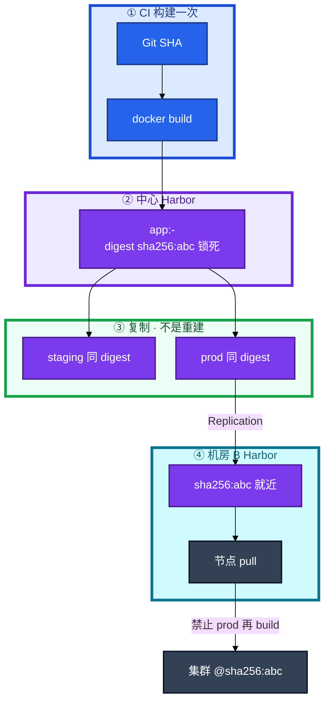
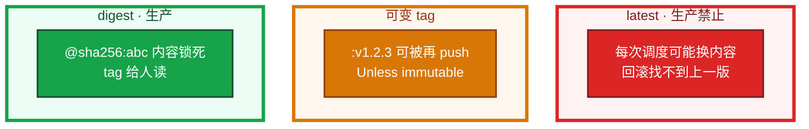
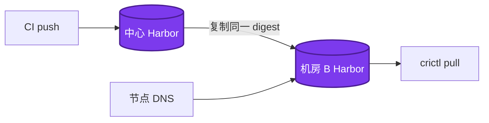
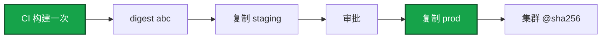
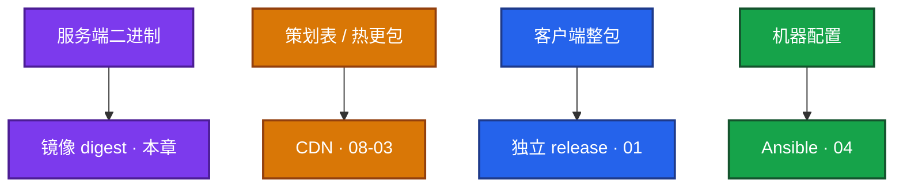
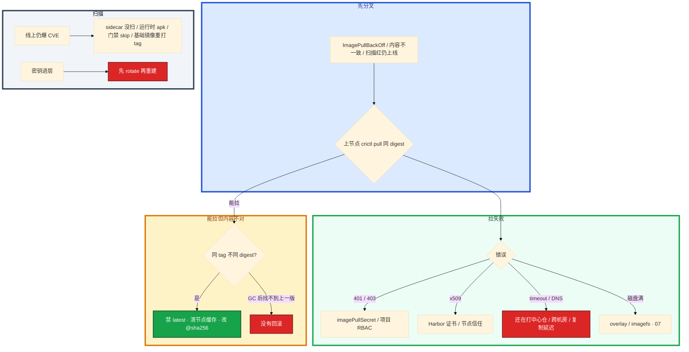

# 制品与镜像


开服 200 个节点同时拉镜像超时。线上回滚找不到当时那份包。扫描红了仍能上线。群里有人把热修打成 `logic:latest`，节点 A 昨天的 latest 和节点 B 今天的不是同一坨字节。

先别只加带宽。这一章后半全是你会动手的：**怎么一次构建、怎么复制 digest、怎么禁 latest、Harbor 怎么就近、扫描怎么卡、拉失败上节点怎么拆。** 前面的不可变和分层，是为了让你动手时不选错路。

**读完你能：** 白板上画出 digest 从 CI 贯通到集群；latest 能讲清为什么扩容和回滚会踩空；会多阶段瘦身、Harbor 复制预拉、Critical 阻断、`crictl pull` 分流。

## 本章目录

缩进 = 上下级。3 下面才是 3.1。

想钉在**正文左边**跟着滚：菜单 **查看 → 打开视图 → 大纲**。Markdown 预览做不到独立左栏，目录只能写在文章开头。

- [1. 基本概念](#1-基本概念)
- [2. 架构图](#2-架构图)
- [3. 原理](#3-原理)
  - [3.1 制品不可变](#31-制品不可变)
  - [3.2 禁用 latest](#32-为什么生产禁用-latest)
  - [3.3 镜像分层](#33-镜像分层与多阶段)
  - [3.4 扫描](#34-漏洞扫描与密钥扫描)
- [4. 安装部署](#4-安装部署)
  - [4.1 生产怎么选](#41-生产怎么选)
  - [4.2 Harbor 落地](#42-harbor-落地你实际看到什么)
- [5. 核心配置](#5-核心配置)
- [6. 常用命令](#6-常用命令)
- [7. 常用操作](#7-常用操作)
  - [7.1 一次构建复制](#71-一次构建复制晋升)
  - [7.2 开服拉镜像](#72-开服拉镜像)
  - [7.3 扫描例外](#73-扫描与例外)
  - [7.4 GC](#74-gc-与保留)
  - [7.5 Chart](#75-chart-也是制品)
  - [7.6 回滚](#76-回滚)
  - [7.7 热更拆分](#77-热更包不要打进镜像)
- [8. 生产排障](#8-生产排障)
- [9. 必会 · 常考](#9-必会--常考)
- [合上书](#合上书问自己)

**本章不讲：** 流水线阶段、晋升审批、金丝雀 SLI → [02](../02-CI-CD/)；分层缓存细节、ENTRYPOINT vs CMD、overlay2 磁盘、BuildKit secret → [07](../07-Docker深度/)；K8s Secret / External Secrets → [04-12](../../04-Kubernetes/12-配置与密钥/)；云上 RAM / IAM → [07-07](../../07-云平台/07-IAM与多账号/)；GitOps 用哪个 tag 去 sync → [04-22](../../04-Kubernetes/22-GitOps-ArgoCD与Tekton/)；客户端资源包、CDN → [08-03](../../08-游戏运维专题/03-热更新与版本发布/) / [08-06](../../08-游戏运维专题/06-CDN与资源分发/)。不单开 Vault 章，密钥扫描和禁 latest 都在这里。

---

## 1. 基本概念

制品 = CI 产出的 **不可变快照**（镜像 / Chart / jar）。正确流是 **构建一次，复制到各环境**，不是每个环境再 build。

构建不确定：基础镜像 tag 浮动、apk/apt 当时的包、`go build` 时间戳。staging 测过的和 prod 新 build 的 **不是同一个二进制**。故障时无法回答「预发验的就是线上这份吗」。

| 在制品里管 | 不在这章里管 |
|------------|--------------|
| digest 贯通、禁 latest、Harbor、扫描、GC | 流水线怎么分段、金丝雀看什么（02） |
| 多阶段为什么必须瘦、哪层胖 | overlay2、ENTRYPOINT 细节（07） |
| 密钥不进镜像 / 不进 Git | K8s Secret 形态（04-12） |

生产引用优先 `@sha256:...`。tag 用 `v1.2.3-<sha7>` 给人读。Harbor 复制规则或 CI `crane copy`。口误：`docker tag` 换仓库再 push **同一 digest** 才叫复制；`docker build` 再 push 叫重建。

一次发布记录三件：**app digest + chart version + values 哈希**。怎么证明这次线上就是某次 MR：digest ↔ commit ↔ MR 链接，流水线留着。对不上就不要猜。

> **记住**：测过的是 digest，不是「同一份 Dockerfile」。开服窗口第一次 pull 的必须已经在本机房 Harbor 里。

---

## 2. 架构图

先把整张图钉住。后面复制、开服、排障都对着这张图说话。



图上三条线：

1. **没有箭头从 prod 指回 build。** 配置不同用注入，不重新打包。
2. **复制是同一 digest 出现在两个 registry。** 不是再编一次。
3. **节点就近拉本机房。** DNS 仍指中心仓 = 开服打满跨机房带宽。

三种引用（排障时内容锁不锁得住不一样）：



开发环境可以用 latest。**任何会自动重启、会扩容的集群不要用。**

---

## 3. 原理

原理只保留动手和面试会用到的：为什么不能每环境再 build、latest 怎样让扩容踩空、哪一层把开服窗口吃掉、扫描为什么要扫两遍。

**本节 4 块：** 3.1 不可变 · 3.2 latest · 3.3 分层 · 3.4 扫描

### 3.1 制品不可变

制品一旦构建完成，内容不得改。晋升 = 把同一 digest **复制** 到下一环境，不是「同一份 Dockerfile 再编一次」。

构建不是纯函数。同一 Git SHA，基础镜像浮动、包索引更新、时间戳，都会变成另一份 sha256。staging 冒烟结论不能为 prod 新 build 辩护。

K8s 里：

```
image: repo/app:v1.2.3          tag 可被覆盖（可变）
image: repo/app@sha256:abc      内容锁死
```

不可变 tag 开了还要不要 digest？要。引用层仍以 digest 为准；tag 给人读、给流水线对账。不可变 tag 打开后，「覆盖 latest 救火」必须停——push 失败是好事。

> **记住**：测过的是 digest。`docker tag` 再 push 才是复制。

### 3.2 为什么生产禁用 latest

tag 默认可被重新 push 覆盖（除非仓库开 immutable）。`imagePullPolicy: Always` + `latest` = 每次调度可能换内容，排障无法复现。`IfNotPresent` + 可变 tag = 节点缓存旧内容，看起来「发了没更新」。

有人把热修打成 `repo/logic:latest`。战斗服扩了 30 个新 Pod。节点 A 昨天拉过 latest，节点 B 今天才调度。同一 tag 指向了新 digest。Always 的节点拉到新内容，IfNotPresent 的节点还用缓存。战斗服「有的区正常有的区崩」就是这个。回滚时 latest 已经不是上一版，找不到当时那份包。

```bash
kubectl get po -l app=logic -o wide
# 两台节点上的 Pod 都叫 latest，crane digest 却对不上
crane digest harbor.example.com/prod/logic:latest
```

卡住先看：仓库有没有开 immutable、Deployment 写的是 tag 还是 `@sha256`、节点 imagePullPolicy。

> **记住**：latest 不是版本，是「现在仓库尖上那份」；扩容和回滚都会踩空。

### 3.3 镜像分层与多阶段

编译工具链（JDK / Go / npm）不能进运行镜像。多阶段：builder 编完，runtime 只拷二进制。Dockerfile 层顺序、BuildKit 细节在 07，这里记 **制品为什么必须瘦、瘦完还胖查哪**。

开服前逻辑服镜像 1.8GB。200 个节点同时拉，窗口被吃掉。`docker history` 里有一层 1.2GB 的 `COPY data/`。

```dockerfile
FROM golang:1.22 AS builder
WORKDIR /app
COPY go.mod go.sum ./
RUN go mod download                 # 依赖先缓存
COPY . .
RUN CGO_ENABLED=0 go build -o server .

FROM alpine:3.20
RUN apk --no-cache add ca-certificates
COPY --from=builder /app/server /server
USER 1000                           # 生产非 root
ENTRYPOINT ["/server"]
```

层缓存：不常变的（依赖）放前面，源码 COPY 放后面。`.dockerignore` 丢掉 `.git` / `node_modules`，减小 context。基础镜像用 alpine / distroless，**钉版本不用 latest**。

`dive` 或 `docker history` 看哪一层胖。多阶段后还是 1GB：把数据文件 / 符号表 / apt 缓存拷进了 runtime。游戏逻辑服常见坑：把整份策划表、调试符号、shell 历史打进去。热更包走 CDN，不要塞进业务镜像；两边版本会漂。

构建机不要无故 `--privileged` DinD 把 Docker socket 暴露给不可信流水线。

> **记住**：runtime 只放二进制；策划表和热更包走 CDN，别打进业务镜像。

### 3.4 漏洞扫描与密钥扫描

push 后 Harbor 扫；CI 再扫一次，防 Harbor 策略被绕过。**Critical=0 才能晋 prod。** High 设团队阈值 + 截止日期，不是发现就永久豁免。扫描红了仍能上线 = 门禁被 skip，当变更事故，不是「先发后补」。

处理 Critical：

1. 升级基础镜像 / 依赖。
2. 已在产线、暂不能改：评估是否可达、网络隔离能否兜住、登记例外和到期日。
3. CVE 例外清单每周过期扫描，过期自动变红。

签名（cosign / Notary）防供应链替换，加分项。CI 对 digest 做 `cosign sign`；集群 admission 校验有则加分。没有 admission 至少扫描门禁要在。

密钥不进镜像、不进 Git：

- 构建期用 BuildKit secret 挂载（07），不要 `ENV` / `COPY` 密钥。
- CI 用 masked 变量；仓库开 secrets scanning / gitleaks，挡 token 进历史。
- 运行时用 K8s Secret / External Secrets（04-12），不要打进镜像层。
- 密钥已经进镜像或进 Git：假设已泄漏，**先 rotate**，再清层 / 清历史。已推送的 digest 删 tag 还在。强制重部署。

扫描只扫了业务镜像、sidecar 是另一份未扫：线上仍爆 CVE。运行时才 `apk add` 的包扫描也看不见。基础镜像被重打 tag 同理。

> **记住**：Critical 是硬阻断；密钥进层先 rotate，删 tag 救不了已推送的 digest。

---

## 4. 安装部署

### 4.1 生产怎么选

| 项 | 选 | 不选 |
|----|----|------|
| 引用 | `@sha256` + 人读 tag `v1.2.3-<sha7>` | 生产 `latest` |
| 晋升 | 复制同一 digest | 每环境 `docker build` |
| 仓库 | Harbor：RBAC / 复制 / Proxy Cache / 扫描 / GC / OCI | 「私有 Docker Hub」四个字 |
| 开服 | 本机房已有 digest + 预拉 | 窗口里第一次 pull 中心仓 |
| 基础镜像 | 内网 Proxy Cache，钉版本 | 节点直连 Docker Hub |
| 运行镜像 | 多阶段 + 非 root + alpine/distroless | 工具链 + 策划表打进 runtime |

供应链：只从内网 Harbor 拉，基础镜像也走 Proxy Cache。imagePullSecrets 按 ns 发放，不要集群默认全能 pull。

### 4.2 Harbor 落地你实际看到什么

Harbor 不是「私有 Docker Hub」。要能说到项目隔离、就近拉、扫描、回收。



| 能力 | 要能说到的点 |
|------|------------------|
| 项目 RBAC | CI 只能 push 指定 project；集群只能 pull prod |
| Replication | 多机房同步，节点就近拉，避免跨海 pull 超时 |
| Proxy Cache | 缓存 Docker Hub，防限流；基础镜像也走内网 |
| 扫描 | 集成 Trivy，Critical 阻断晋升 |
| GC | 清无 tag blob；现代版本可在线 GC，不必停服 |
| OCI | Helm Chart 和镜像同一仓库 |

验收：本机房 Harbor 有该 digest；复制延迟低于阈值；DNS 指本机房；CI 不能 push prod 项目（或按你们的隔离模型不能越权）。开服清单含「本机房 Harbor 已有该 digest」。复制延迟大就不要切流量。

跨云复制失败：带宽、鉴权、immutable tag 冲突（同一 tag 不同 digest）。观测：Harbor 磁盘、复制延迟、扫描队列、pull QPS。

---

## 5. 核心配置

只动有证据的项。引用层以 digest 为准。

| 参数 | 默认/常见 | 生产怎么用 | 改错会怎样 |
|------|-----------|------------|------------|
| tag 可变 | 可覆盖 | prod 开 **immutable**；引用仍用 digest | 同 tag 不同内容 |
| `imagePullPolicy` | IfNotPresent / Always | 配 digest 时 IfNotPresent 即可 | Always+latest = 每次可能换内容 |
| 扫描 Critical | 警告 | **阻断晋 prod** | 带洞上线 |
| High CVE | 无 | 团队阈值 + **到期日** | 永久豁免 |
| 保留 | 无限或过狠 | dev TTL **7 天**；prod **20+** 成功 digest | 回滚没有上一版 / 盘满乱 GC |
| Proxy Cache 过期 | 视策略 | 别清生产正在用的基础层 | 节点突然拉不到 |
| 基础镜像 | latest | **钉版本** | 构建不可复现 |
| USER | root | **非 root（如 1000）** | 容器逃逸面 |
| DinD | privileged | 不要无故暴露 socket | 不可信流水线控宿主机 |

> **记住**：immutable tag 不是 digest 的替代。GC 前对照集群仍在用的 `spec.containers[].image`。

---

## 6. 常用命令

到节点（或同等网络）测，别只看 Deployment 事件。

| 目的 | 命令 | 看什么 |
|------|------|--------|
| 是不是同一份 | `crane digest harbor/.../app:v1.2.3-abc1234` | 必须等于集群 `@sha256` |
| 集群引用 | `kubectl get deploy -o jsonpath='{.spec.template.spec.containers[*].image}'` | digest 或不可变 tag |
| 哪层胖 | `docker history` / `dive` | 1.2GB 的 `COPY data/` |
| 节点拉 | `crictl pull harbor.../app@sha256:abc...` | 401 / x509 / timeout 在这一步分开 |
| 运行时日志 | `journalctl -u containerd -u kubelet --since -10m` | 证书、磁盘、DNS |
| 复制 | `crane copy` 或 Harbor Replication | 同一 digest，不是重建 |

值班先跑这四条：

```bash
crane digest harbor.example.com/prod/app:v1.2.3-abc1234
kubectl get deploy -o jsonpath='{.spec.template.spec.containers[*].image}'
crictl pull harbor.example.com/prod/app@sha256:abc...
# Harbor：本机房有没有该 digest、复制延迟、扫描队列
```

指标：

| 指标 | 阈值 | 级别 |
|------|------|------|
| 复制延迟 | 高于开服阈值 | **不要切流量** |
| 扫描 Critical | **> 0** 晋 prod | P0 门禁 |
| Harbor 磁盘 | 满 / dangling blob | P1 GC |
| pull QPS / 超时 | 开服窗口打满 | 预拉 + 瘦身 + 就近 |

---

## 7. 常用操作

### 7.1 一次构建复制晋升



配置差：环境配置外置，镜像不变。核对晋升前后 `crane digest`。

### 7.2 开服拉镜像

对策：镜像瘦身、Harbor 复制到本机房、DaemonSet 或启动脚本 `crictl pull` 预拉，**避免开服窗口才第一次 pull**。

开服 200 个节点同一大镜像打中心仓，跨机房带宽打满，ImagePullBackOff 一片——本机房 Harbor 里还没有这个 digest，或 DNS 还指到中心仓。

### 7.3 扫描与例外

CI 和 Harbor 都扫。Critical 阻断。High：有主有期。例外每周过期，过期自动变红。sidecar 和业务镜像分开扫，只扫一份等于没扫。

### 7.4 GC 与保留

磁盘满：先看未 GC 的 dangling blob + 无引用旧 tag。GC 前确认没有「仅 digest 引用、tag 已删」的正在跑的 Pod。代理缓存过期策略别把生产正在用的基础层清掉。

保留：dev TTL 7 天、prod 按发布频率留 20+ 个成功 digest。删之前对集群 `spec.containers[].image`。合服后旧 digest 先留着，回档窗口没过就不要 GC。

### 7.5 Chart 也是制品

Helm 3.8+ `helm push` 到 OCI，和镜像同一套 RBAC。Chart version 改模板才 bump；appVersion 对应用版本。多环境用 values 分层，**不要 fork 两份 Chart**；密码不要写进 `values-prod.yaml`。差到要 fork 说明 Chart 不是一份制品了。

一次发布记录：app digest + chart version + values 哈希。

### 7.6 回滚

回滚 = 把集群指回 **上一份仍在仓库里的 digest**。latest 已经被覆盖 = 没有回滚。制品库 GC 了上一版 = 没有回滚。GitOps 改 Git 里的 image 再 sync（04-22）。合服回档窗口内不要清旧包。

### 7.7 热更包不要打进镜像

游戏资源包打进业务镜像、热更却只更了 CDN，两边版本漂——资源走 CDN，镜像只放服务端。改 nginx 超时走 Ansible（04），不要为配置重建镜像。客户端整包走独立流水线（01 / 08），不要和开服拉镜像抢窗口。



---

## 8. 生产排障

三问：进程还在不在？还能不能变更？已有流量还通不通？

**拉不到镜像 = 新 Pod 起不来，已运行容器通常还在。** 不要先重启逻辑服。



现场顺序：

```bash
crictl pull harbor.example.com/prod/app@sha256:abc...
journalctl -u containerd -u kubelet --since -10m
crane digest harbor.example.com/prod/app:v1.2.3-abc1234
```

| 现象 | 先做什么 | 不要做什么 |
|------|----------|------------|
| 401 / 403 | Secret、项目权限；Secret 是否错 ns / 过期 | 只看 Deployment Events |
| x509 | Harbor 证书、节点信任链 | 先扩容再拉 |
| timeout | DNS、跨机房、复制延迟、镜像是否太大 | 当偶发网络 |
| 磁盘满 | imagefs / overlay2 prune（07） | 格式化数据盘当第一手 |
| 部分节点内容不一样 | 禁 latest、清节点缓存、对仓库 sha256 | 再发一次 latest |
| 开服 200 节点同时超时 | 本机房 Harbor / 预拉 / 瘦身 | 窗口里第一次 pull |
| 扫描红仍上线 | 哪道门禁被 skip | 「活动先开」 |
| 密钥进镜像 | 先 rotate | 只删 tag |
| 复制 immutable 冲突 | 换 sha tag 或只按 digest 复制 | 强推不同内容到同一 tag |
| Proxy Cache 清了生产层 | 过期策略；对照正在跑的层 | 继续 GC |

401 但 Secret 挂了：Secret 在错 ns、过期、CI 用的账号不能 pull 该 project。digest 不对：节点层缓存旧内容，删节点缓存再拉，先确认仓库里 sha256。

---

## 9. 必会 · 常考

白板和追问高频，能一口回：

| 说法 | 对错 | 口径 |
|------|:----:|------|
| 代码 SHA 相同就是同一份镜像 | 错 | 构建不确定，要对 digest |
| `docker build` 再 push 到 prod 仓叫复制 | 错 | `docker tag` 同 digest 才是复制 |
| 生产可以用 latest，开发才不能 | 错 | 开发可以；会扩容/自动重启的集群不行 |
| immutable tag 开了就不用 digest | 错 | 引用层仍以 digest 为准 |
| `IfNotPresent` + 可变 tag 会自动更新 | 错 | 节点继续用旧层，看起来发了没更新 |
| 多阶段后还 1GB 只能换更大盘 | 错 | 先 `history`/`dive`：数据/符号表/apt 缓存 |
| 策划表打进业务镜像方便热更 | 错 | 和 CDN 两边版本漂 |
| Harbor 就是私有 Docker Hub | 错 | RBAC / 复制 / Proxy Cache / 扫描 / GC / OCI |
| GC 前不用看集群 | 错 | tag 删了 Pod 仍按 digest 跑 |
| Critical 可以先发后补 | 错 | 硬阻断；High 才是有期例外 |
| 删 tag 密钥就没了 | 错 | digest 还在；先 rotate |
| 只扫业务镜像够了 | 错 | sidecar、运行时 apk、基础镜像重打 tag |
| 密码写进 values-prod 方便 | 错 | 不进 Git；Chart 不要 fork |
| 合服第二天立刻 GC 旧包 | 错 | 回档窗口没过先留着 |
| 节点直连 Docker Hub 拉基础镜像 | 错 | Proxy Cache；供应链只走内网 Harbor |

数字：Critical **=0**；dev TTL **7 天**；prod 留 **20+** 成功 digest；开服 **200** 节点同时拉是典型事故窗口；非 root 如 **UID 1000**。

易混：复制 vs 重建；tag vs digest；Always+latest vs IfNotPresent+可变 tag；compact 不在这章（etcd）；Harbor GC vs 节点 prune；镜像 CI vs CDN 热更。

---

## 合上书，问自己

1. 一次构建、digest 贯通怎么画？`docker tag` 和 `docker build` 谁叫复制？
2. 生产为什么禁 latest？immutable 了还要不要 digest？
3. 多阶段后还胖查哪？策划表为什么不能打进业务镜像？
4. Harbor 比私有 Hub 多哪几项？开服清单写哪句？
5. 拉失败上节点怎么分流？GC 前对什么？
6. Critical / 密钥进层 / Chart 三件怎么处理？热更和镜像怎么拆？

六题都能口述，这一章就过了。下一章把 Ansible 剖开：幂等、handler、库存名单、和 Terraform 怎么分工。
