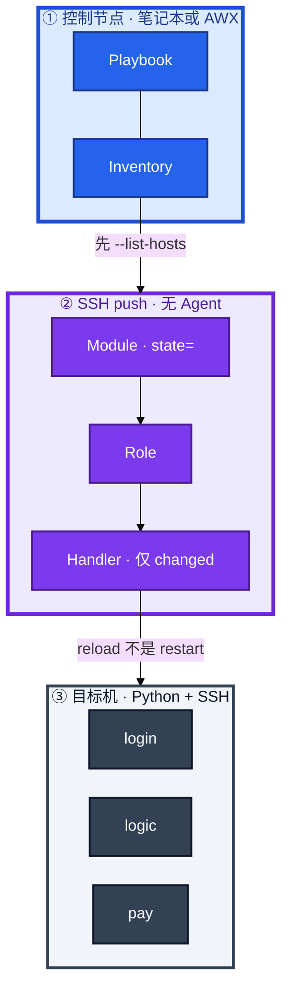
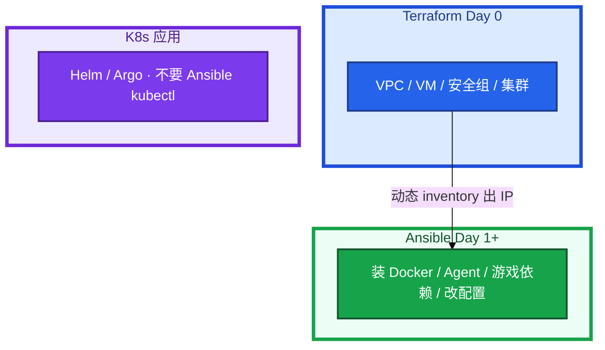
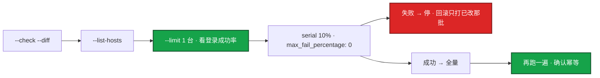
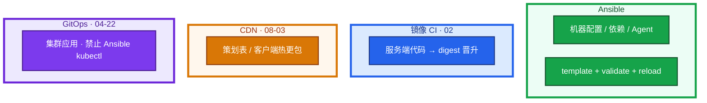
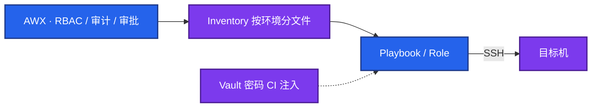
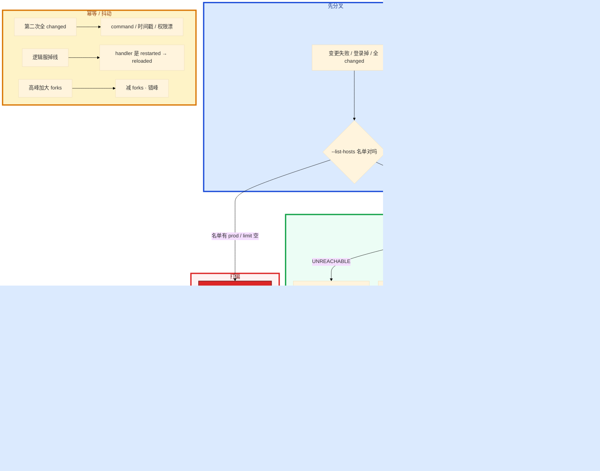

# Ansible


一条 playbook 打了一千台登录服，配错了还在继续。第二次跑仍然一堆 changed，有状态服被无脑 restart。群里有人 `hosts: all`，inventory 混着 prod；另有人把 forks 提到 100，sshd 和玩家抢 fd。

先别加机器。这一章后半全是你会动手的：**怎么 check、怎么 list-hosts、怎么 limit 一台、怎么 serial、失败怎么停、已改那批怎么回滚。** 前面的幂等和 handler，是为了让你动手时不把发布做成抖动。

**读完你能：** 白板上画出 Inventory / Playbook / Module / Role；第二次跑能判断为什么还 changed；会滚动变更、handler reload、Vault、和 Terraform 分工、点名回滚已改主机。

## 本章目录

缩进 = 上下级。3 下面才是 3.1。

想钉在**正文左边**跟着滚：菜单 **查看 → 打开视图 → 大纲**。Markdown 预览做不到独立左栏，目录只能写在文章开头。

- [1. 基本概念](#1-基本概念)
- [2. 架构图](#2-架构图)
- [3. 原理](#3-原理)
  - [3.1 幂等](#31-幂等)
  - [3.2 Handler](#32-handler)
  - [3.3 批量风险](#33-批量变更怎么控风险)
  - [3.4 和 CI / 热更怎么拆](#34-和-ci--热更怎么拆)
- [4. 安装部署](#4-安装部署)
  - [4.1 生产怎么选](#41-生产怎么选)
  - [4.2 控制节点落地](#42-控制节点落地你实际看到什么)
- [5. 核心配置](#5-核心配置)
- [6. 常用命令](#6-常用命令)
- [7. 常用操作](#7-常用操作)
  - [7.1 预演与金丝雀](#71-预演与金丝雀)
  - [7.2 滚动全量](#72-滚动全量)
  - [7.3 回滚](#73-回滚)
  - [7.4 Role](#74-role-结构)
  - [7.5 Vault](#75-vault-与-awx)
  - [7.6 和 Terraform / K8s](#76-和-terraform--k8s-分工)
- [8. 生产排障](#8-生产排障)
- [9. 必会 · 常考](#9-必会--常考)
- [合上书](#合上书问自己)

**本章不讲：** State、锁、plan destroy → [05 Terraform](../05-Terraform/)；镜像 / 制品晋升 → [03](../03-制品与镜像/)；集群内应用发布 → [04-22](../../04-Kubernetes/22-GitOps-ArgoCD与Tekton/) / [02](../02-CI-CD/)；变更窗口、审批、oncall → [06](../06-运维平台与Oncall/)；云上安全组本源 → [07 云平台](../../07-云平台/)；密钥扫描细节 → 03。

---

## 1. 基本概念

Ansible **无 Agent**：控制节点 SSH push，目标机有 Python + SSH 即可。它保证的是「机器处于某状态」，不是「再执行一遍脚本」。

四个对象不要混：

| 对象 | 干什么 |
|------|--------|
| **Inventory** | 谁：主机与分组（login / logic / pay；静态 ini 或云动态 inventory） |
| **Playbook** | 做什么：hosts + tasks 编排 |
| **Module** | 怎么做：yum / copy / template / service，原生幂等 |
| **Role** | 复用包：tasks / templates / handlers / defaults |

`yum: state=present`、`file: state=directory`、`service: state=started` 是「确保处于某状态」，不是「再执行一次安装」。同一 Playbook 第二次应 `changed=0`。CI 里连续跑两次断言这一点。

Handler：task **changed** 才 notify，一个 play 里同一 handler 只跑一次。服务用 `reloaded` 不是 `restarted`（reload 不断连接）。游戏逻辑服有状态，配置变更更要 reload / 优雅重启，禁止 playbook 每次都 restart。

> **记住**：第二次跑应当 changed=0，否则你写的是脚本，不是状态。先看会打到谁（`--list-hosts`），再看怎么改。

---

## 2. 架构图

先把整张图钉住。后面幂等、滚动、排障都对着这张图说话。



图上三条线：

1. **没有箭头从 Ansible 指向 Helm/Argo 再 apply 一遍。** K8s 应用不走这条。
2. **Handler 只在 changed 时跑。** 每次 `state=restarted` = 把发布做成抖动。
3. **先名单后变更。** `--limit` 写空可能变全量。

和 Terraform / GitOps 的边界：



禁忌：TF 管安全组、Ansible 再改同一套 iptables → drift，两边 plan / play 都「正确」但线上是乱的。**不要两个工具写同一资源的同一属性。**

---

## 3. 原理

原理只保留动手和面试会用到的：为什么第二次还会抖、handler 为什么不是普通 task、一千台怎么停、改超时为什么不走镜像 CI。

**本节 4 块：** 3.1 幂等 · 3.2 Handler · 3.3 批量 · 3.4 和 CI 拆

### 3.1 幂等

幂等 = 同一 Playbook 再跑一次，系统状态不变，recap 里 **changed=0**。模块写状态；`command` / `shell` 默认非幂等。

把登录服 nginx 超时从 60s 改成 90s。template 渲染 `nginx.conf.j2`，notify reload。第一次 `changed=1`，handler 跑了 reload，正常。`validate` 先 `nginx -t`，配错不会落地。登录长连接还在——因为是 reload 不是 restart。

第二次还是一堆 changed，常见三因：

1. command 没有 `creates`
2. template 每次渲染不等价（时间戳、随机数、行尾空白）
3. 文件权限被别的进程改漂了

卡住先看 recap 里哪些 task 还 changed，把 command 改成模块或加 `creates`。每次 deploy 都 `state=restarted`：逻辑服长连接被踢。配置没变也重启，等于把发布做成抖动。巡检里这是事故。CI 连跑两次断言幂等。第二次跑不是 0 changed 就不要定时当巡检——幂等没做完的巡检就是周期性故障。

```yaml
- command: tar xf app.tar.gz -C /opt/app
  args:
    creates: /opt/app/bin/start.sh    # 文件已在就跳过
```

Template（Jinja2）管配置；Copy 管静态文件 / 包。配置用 template 并 `validate`。证书、二进制用 copy。变量优先级从高到低：`-e` > play vars > host / group_vars > role defaults。

> **记住**：模块写状态；handler 只在变了才 reload；第二次 changed≠0 先查 command 和时间戳。

### 3.2 Handler

普通 task 每次 play 都评估；handler 只在被 notify 且 **changed** 时跑，同一 play 里同一 handler **只跑一次**。三个 template 各 notify 一次 restart，若写成普通 task 会重启三次；handler 则 play 结束只一下。

```yaml
- hosts: web
  serial: "10%"
  max_fail_percentage: 0
  tasks:
    - template:
        src: nginx.conf.j2
        dest: /etc/nginx/nginx.conf
        validate: 'nginx -t -c %s'    # 先校验再落地
      notify: reload nginx
  handlers:
    - name: reload nginx
      service: { name: nginx, state: reloaded }
```

`validate` 通过才替换。这是防止「全量 reload 坏配置」的最后一道。游戏逻辑服重启要摘流量，写进 role README，别让接手的人改成 `state=restarted`。需要中间立刻生效才 `flush_handlers`。

`service: restarted` 每次都 changed：它不是幂等「保持运行」，是每次抖一下。

### 3.3 批量变更怎么控风险

这是 SRE 真正考的，不是 YAML 字段。一台失败就停（`max_fail_percentage: 0` / `any_errors_fatal`）。合服、活动前改登录服：先 1 台，再 10%，再全量。



`--list-hosts` 打出了 prod 登录服：inventory 按环境分文件写错了。`--limit staging` 写空或写错可能变成全量。`hosts: all` 配错 inventory 会打到 prod。`--limit prod:&web` 这类交集要能算。

`--check` 绿，真跑挂：有的模块 check 模式不准，custom module 可能空跑。金丝雀不能省。

`serial 10%` 仍全挂：配置本身是错的，百分比救不了。先 limit 1 台看登录成功率，再决定要不要继续。

中途 `any_errors_fatal` 停了：已改主机要记账，回滚只打这批。包不在制品库等于没有回滚。

高峰期：登录服 SSH 打满和玩家连接抢同一台机的 fd / CPU，变更窗口避开峰值，**减 forks**，不是加 forks。

> **记住**：先 list-hosts，再 limit 1 台看业务，再 serial；失败即停，已改的那批要能点名回滚。

### 3.4 和 CI / 热更怎么拆

改 nginx 超时、装 Agent、改 sysctl，走 Ansible。服务端代码出镜像，走 CI digest 晋升（02 / 03）。不要为改超时重新 build 镜像，也不要用 Ansible kubectl 和 GitOps 抢。



活动中途改登录超时：Ansible limit 一台 → 看登录成功率 → serial。逻辑服禁止 playbook 里无脑 restart。热更包已经在 CDN 上的，Ansible 改不了客户端缓存。

和 Salt / Puppet：无 Agent 上手快；大规模 pull、实时性 Salt 更强。游戏厂批量配置 Ansible 通常够用。

---

## 4. 安装部署

### 4.1 生产怎么选

| 项 | 选 | 不选 |
|----|----|------|
| 控制面 | AWX / Tower：RBAC、审计、审批 | 笔记本无审批打 prod |
| Agent | 无；目标机 Python + SSH | 为 Ansible 再装一套重 Agent（除非选型 Salt） |
| 库存 | 按环境分文件；动态 + **静态备份名单** | `hosts: all` 混 prod |
| 幂等 | 模块 `state=`；CI 跑两次 | 巡检每次 changed + restart |
| 滚动 | check → list-hosts → limit 1 → serial | 直接全量 |
| 和 TF | Day 1+ 软件与配置 | 再写同一套安全组 / iptables |
| K8s 应用 | Helm / Argo | Ansible kubectl 双轨 |

不要 AWX 和 Jenkins 两处都能无审批打 prod。Jenkins 适合构建；变更审计在 AWX 更完整。

### 4.2 控制节点落地你实际看到什么



| 路径/项 | 内容 |
|---------|------|
| Inventory | 按环境分文件；动态失败要有静态备份 |
| Role | `defaults` / `tasks` / `handlers` / `templates` / `meta` |
| Vault | 密码不进 Git；CI `--vault-password-file` |
| `host_key_checking` | 生产用已知 host key，不要 False |

验收：`--list-hosts` 名单对；直打 prod 要审批；第二次 play `changed=0`（巡检）；笔记本不能绕过 AWX 打 prod。

第三方 `ansible-galaxy` 只引内部源，pin 版本。Molecule / CI 里跑两次验幂等。

---

## 5. 核心配置

只动有证据的项。`ansible.cfg` 和 play 里的 serial 三端（开发机 / AWX / CI）必须一致。

| 参数 | 默认/常见 | 生产怎么用 | 改错会怎样 |
|------|-----------|------------|------------|
| `pipelining` | False | **True**（少 SSH 往返，ROI 最高） | 打 200 台要 40 分钟 |
| ControlMaster | 无 | 复用连接 | 每次握手 |
| `forks` | 5 | **20 量级**；高峰 **减** | 100+ 打满 sshd，登录掉 |
| `gather_facts` | True | 不需要时 **false** + fact cache | 每个 task 都 setup 拖死 |
| `max_fail_percentage` | 容忍部分失败 | **0** / `any_errors_fatal` | 配错还在继续 |
| `serial` | 全量 | **10%**，先 limit 1 台 | 一千台一起挂 |
| `host_key_checking` | True | 已知 host key | False = 接受中间人 |
| Vault | 明文 group_vars | 加密；密码不进 Git / role | 泄漏；先 rotate |

变量优先级：`-e` > play vars > host / group_vars > role defaults。defaults 放默认，**不要把 prod 密码写进 role**。环境不同密码。

> **记住**：慢先开 pipelining；失败先 SSH；高峰减 forks；密码不进 Git。forks 用来覆盖并行度，不是用来扛高峰登录服。

---

## 6. 常用命令

先看会打到谁，再跑。

| 目的 | 命令 | 看什么 |
|------|------|--------|
| 预演 | `ansible-playbook deploy.yml --check --diff` | 覆盖不全，金丝雀不能省 |
| 名单 | `ansible-playbook deploy.yml --list-hosts` | 有没有 prod |
| 金丝雀 | `ansible-playbook deploy.yml --limit web-01,web-02` | 登录成功率 |
| 交集 | `--limit prod:&web` | 会算 |
| 详细失败 | `-vvv` | 卡在握手还是 sudo |
| 连通 | 手动 SSH / ping | UNREACHABLE 先别怪 YAML |
| 解密 | `--vault-password-file` | 变量 undefined 常是没注入 |
| 回滚 | `-e app_version=上一版` | 包还在制品库（03） |

值班先跑这四条：

```bash
ansible-playbook deploy.yml --check --diff
ansible-playbook deploy.yml --list-hosts
ansible-playbook deploy.yml --limit web-01
# 看服务、日志、登录成功率；再 serial 全量；再跑一遍确认幂等
```

观测：playbook 成功率、P95 时长、changed 数（巡检应为 0）、失败主机。AWX 审计「谁打了 prod」比日志更有用。

---

## 7. 常用操作

### 7.1 预演与金丝雀

```bash
ansible-playbook deploy.yml --check --diff
ansible-playbook deploy.yml --list-hosts
ansible-playbook deploy.yml --limit web-01,web-02
```

`--check` 绿不是放行。limit 1 台看业务 SLI。

### 7.2 滚动全量

play 里 `serial: "10%"` + `max_fail_percentage: 0`。失败即停。高峰减 forks、错峰。有状态：handler 用 reload 或先摘流量再重启。

全量后再跑一遍，确认幂等。

### 7.3 回滚

`-e app_version=上一版` 或独立 rollback playbook，逻辑与发布对称（limit → serial）。包必须还在制品库（03）。schema 不可逆时只回代码不够。有状态先摘流量。

`any_errors_fatal` 中途停，已改主机记账，回滚只打这批。回滚 playbook 和发布不对称（limit / serial / handler 不是同一套）= 回滚比发布还猛。

没有上一版包 = 没有回滚。

### 7.4 Role 结构

```
roles/game_node/
  defaults/main.yml     # 可被环境覆盖，不放 prod 密码
  tasks/main.yml        # install → configure → service
  handlers/main.yml
  templates/
  meta/main.yml         # 依赖 nginx 等；第三方 pin 住
```

Role 对外只暴露 defaults。环境差用 group_vars / `-e`，不要写死 region 和密码。Molecule / CI 跑两次验幂等。`flush_handlers` 只在需要中间立刻生效时用。`ansible-galaxy` 只引内部源。

### 7.5 Vault 与 AWX

Vault 加密敏感变量，vault 密码不进 Git，CI 从密钥系统注入 `--vault-password-file`。密码进了 Git：当泄漏 rotate；历史用 filter / BFG 清，光删文件不够。

AWX / Tower：RBAC（谁能跑 prod）、审计（谁对哪些机器跑了什么）、审批 workflow。把「笔记本跑 playbook」变成可审计变更。

动态 inventory 失败（云 API 超时）要有静态备份名单，否则故障时连机器列表都没有。

### 7.6 和 Terraform / K8s 分工

TF Day 0：VPC / VM / 安全组 / 集群。动态 inventory 出 IP。Ansible Day 1+：装 Docker / Agent / 游戏依赖 / 改配置。

K8s 应用交给 Helm / Argo（04-22）。Ansible kubectl 再 apply 一遍 = 和 GitOps 双轨，selfHeal 会把你的热修打回去。

---

## 8. 生产排障

三问：进程还在不在？还能不能变更？已有流量还通不通？

**playbook 打偏 = 配置被改错，不是立刻踢玩家。** 失败即停；不要继续全量。逻辑服不要无脑 restart。



现场顺序：

```bash
ansible-playbook deploy.yml --list-hosts
ansible-playbook deploy.yml --limit web-01 -vvv
# 手动 SSH 看 sudo / 磁盘 / Python
```

| 现象 | 先做什么 | 不要做什么 |
|------|----------|------------|
| 打到了 prod | 停；看环境文件、`--limit` 是否空 | 先看 YAML 语法 |
| check 绿真跑挂 | 金丝雀 1 台看业务；validate | 迷信 check |
| 第二次全 changed | command / 时间戳 / 权限漂 | 当巡检继续跑 |
| 逻辑服掉线 | handler 改 reloaded，先摘流量 | `state=restarted` 写进巡检 |
| UNREACHABLE | ping / ssh / 防火墙 | 先怪 playbook |
| 变量 undefined | vault 密码文件、typo | 明文写回 group_vars |
| 高峰加大 forks 登录掉 | 减 forks、错峰 | 再加 forks |
| 动态 inventory 空 | 静态备份名单 | 等云 API |
| serial 10% 仍全挂 | 配置本身错；先 1 台 | 迷信百分比 |
| 回滚找不到包 | 制品库保留（03） | 假装能回 |

故障 30 秒分流：UNREACHABLE → 本机 ssh；权限失败 → become；每次都 changed → command 或时间戳；大面积中断 → 有没有 serial，limit 是不是空。

---

## 9. 必会 · 常考

白板和追问高频，能一口回：

| 说法 | 对错 | 口径 |
|------|:----:|------|
| 第二次跑有 changed 说明 playbook 在干活 | 错 | 巡检应为 0；否则是脚本不是状态 |
| `service: restarted` 是幂等保活 | 错 | 每次抖一下；用 started + handler reload |
| Handler 和普通 task 一样每台都跑 | 错 | 仅 changed，同一 play 只一次 |
| `--check` 绿就可以全量 | 错 | 覆盖不全；金丝雀不能省 |
| `serial 10%` 就能防配错 | 错 | 配置本身错会全挂；先 1 台看业务 |
| `--limit` 写空更安全 | 错 | 可能变全量；先 `--list-hosts` |
| 高峰加大 forks 更快 | 错 | sshd 和玩家抢 fd；减 forks |
| `host_key_checking=False` 生产省事 | 错 | 接受中间人 |
| TF 和 Ansible 都改安全组更稳 | 错 | 同一属性只许一个工具写 |
| Ansible kubectl 热修最快 | 错 | GitOps selfHeal 打回来 |
| prod 密码放 role defaults 方便 | 错 | 永远不进 role |
| 密码进 Git 删文件就行 | 错 | 先 rotate，历史重写 |
| 动态 inventory 挂了再想名单 | 错 | 静态备份必须事先有 |
| 回滚 playbook 可以更猛 | 错 | limit / serial / handler 必须对称 |
| 改超时应该走镜像 CI | 错 | Ansible reload；镜像 CI 管代码 |

数字：forks **20 量级**；serial **10%**；`max_fail_percentage` **0**；巡检 changed **0**；pipelining ROI 最高。

易混：幂等 vs 再执行；reload vs restart；check vs 金丝雀；limit 空 vs 全量；TF Day 0 vs Ansible Day 1+；镜像 CI vs 配置热更。

---

## 合上书，问自己

1. 四个对象各干什么？第二次 changed≠0 查哪三因？
2. Handler 和普通 task 差在哪？逻辑服能不能 `restarted`？
3. 批量变更顺序？`--limit` 写空会怎样？serial 10% 仍全挂说明什么？
4. pipelining / forks / facts 怎么排？高峰能不能加 forks？
5. 回滚怎么和发布对称？动态 inventory 挂了呢？Vault / AWX 解决什么？
6. 和 Terraform / GitOps 怎么分工？改超时、出镜像、热更包各走谁？

六题都能口述，这一章就过了。下一章把 Terraform 剖开：State、锁、plan destroy、漂移。
