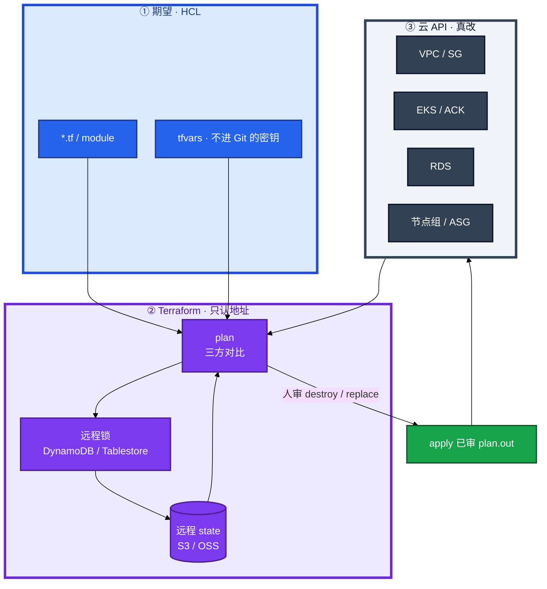
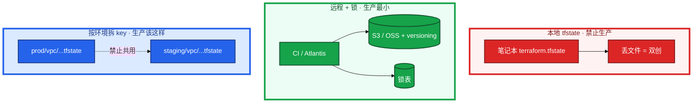
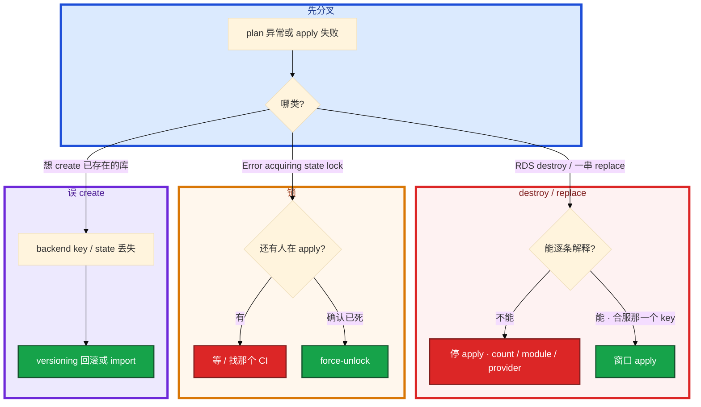

# Terraform


合服窗口，`terraform show plan.out` 里 RDS `will be destroyed`。有人准备 `apply -auto-approve`。另一次 CI 被 kill，下一个人要把 `force-unlock` 写进自动重试——这两刀都能把库删没或把 state 改烂。

**本章主线（排障就按这三步想）：**

1. **审 plan**：`- destroy` 逐条能解释，生产禁止 `-auto-approve`
2. **拿锁放锁**：state 锁谁拿谁放，`force-unlock` 当事故
3. **对三方**：HCL 期望、state 记忆、云 API 真值——漂移先找谁改了控制台

**读完你能：** 白板上画出 HCL / state / 云 API 三方对比；plan 出现 destroy 能判断是 count 移位还是真要删；会远程 backend、锁、漂移、for_each 合服、失败回滚。

## 本章目录

- [1. 基本概念](#1-基本概念)
- [2. 架构图](#2-架构图)
- [3. 原理](#3-原理)
- [4. 安装部署](#4-安装部署)
- [5. 核心配置](#5-核心配置)
- [6. 命令与操作](#6-命令与操作)
- [7. 生产排障](#7-生产排障)
- [8. 必会 · 常考](#8-必会--常考)
- [合上书](#合上书问自己)

**本章不讲：** 装软件、改配置、滚动 playbook → [04 Ansible](../04-Ansible/)；集群内发布、GitOps → [04-22](../../04-Kubernetes/22-GitOps-ArgoCD与Tekton/)；IAM / 多账号 → [07-07](../../07-云平台/07-IAM与多账号/)；制品、镜像 → [03](../03-制品与镜像/)；变更窗口 → [06](../06-运维平台与Oncall/)。

---

## 1. 基本概念

Terraform 用 **HCL** 声明期望。`plan` 预览，`apply` 调云 API。它管的是云资源的生命周期，不是机器里的软件包——装包、渲染配置、滚动 reload 是 Ansible（04）；集群内 Deployment 是 Helm / Argo（04-22）。

**值班里什么时候碰到**（先听群里说什么，再对表）：

| 群里/CI 说的 | 技术含义 | 你的第一刀 |
|--------------|----------|------------|
| 「plan 里 RDS 要 destroy」 | 可能 count 移位、module 改名、或真要删库 | **停 apply**，grep destroy |
| 「Error acquiring state lock」 | 上次 apply 没放锁 | 看 CI / 同事是否还在跑 |
| 「想 create 已存在的库」 | state 丢了或 backend key 打错 | 核对 key、versioning 回滚 |
| 「plan 每次都脏」 | 漂移或 TF 和 Helm 抢同一资源 | 定边界、查控制台手改 |

plan 读三份东西，缺一就会算错：

| 三方 | 是什么 |
|------|--------|
| **HCL** | 你想要的：资源类型、属性、module、var |
| **state** | TF 记得的：地址 ↔ 云资源 ID、上次属性 |
| **云 API** | 真有的：控制台、别的栈、人工改过的 |

四个 diff 不要混：

| diff | 含义 | 值班怎么看 |
|------|------|------------|
| `+ create` | 期望有、state 无 | 线上已有同名库？可能 state 丢了或 key 打错 |
| `~ update` | 可变属性不一致 | in-place，一般可逆；仍要看会不会断连接 |
| `- destroy` | state 有、HCL 没了 | **可能删库**，逐条能解释才过 |
| `-/+ replace` | 不可变属性变了，先删后建 | 和 destroy 同等对待 |

三个角色不要混：

| 角色 | 干什么 |
|------|--------|
| **Terraform** | 声明云资源：VPC、子网、EKS/ACK、RDS、对象存储、节点组 |
| **Ansible** | 机器状态：装包、渲染配置、滚动 reload（04） |
| **Helm / Argo** | 集群内工作负载：Deployment、游戏 ConfigMap、HPA（04-22） |

同一 Deployment 不要 TF kubernetes provider 和 Helm 两边管——plan 每次都脏，Argo selfHeal 再打一遍。

**打个比方**：HCL 是装修图纸，state 是施工队手里的「哪面墙对应哪个房间号」，云 API 是现场真墙。图纸改了房间号，施工队以为旧墙要拆、新墙要砌——墙上人还在，只是对不上号了。

> **记住**：plan 是三方对比的**产出物**，apply 只执行已审那一份。plan 和 apply 之间又改 HCL，会跑偏。CI 禁止 `apply` 不带已审 plan。从未审过的 plan 禁止 apply；`destroy` 生产几乎不用；`apply -auto-approve` 生产禁用。

**面试怎么说**：「我先把 plan 当产出物审 destroy 和 replace，apply 只执行已审 plan.out；state 是地址到云 ID 的映射不是备份，丢了会双创；TF 管集群外，Helm 管集群内，不抢同一 Deployment。」

---

## 2. 架构图

先把整张图钉住。后面命令、合服、排障都对着这张图说话。



**读图三句话：**

1. **apply 不读「你脑子里的意图」，只执行已审 plan**——中间又 push HCL 也不要当场再 plan 偷跑。
2. **state 是记忆，不是备份云资源**——丢了会再 create，同名冲突或两套账单。
3. **锁挡住的是同一份 state 的并发 apply**，不是挡住控制台手改——那是漂移。

三种落地形态（装的时候选，挂的时候事故面不一样）：



TF 管集群外，Helm 管集群内。Crossplane / Pulumi 知道即可，考点仍是 state / 锁 / 漂移，换语法不换问题。紧急可以控制台改，事后必须 import 回 TF。

---

## 3. 原理

### 3.1 State：地址 ↔ 云 ID

**一句话：** state 不是云备份，是地址到云 ID 的映射；地址变了 TF 就当旧资源没了。

**打个比方**：像快递单号绑手机尾号——单号从 `[2]` 改成 `["s3"]`，系统以为旧包裹要销毁、新包裹要新建，其实仓库里那台 RDS 还在。

**现场走一遍**（CI 报「要 create 已存在的 game-db」，先别 apply）：

1. 进 `env/prod/rds/`，核对 backend key 是否真是 prod：

```bash
grep -A5 'backend "s3"' versions.tf
terraform state list | head -5
```

2. 屏幕出现：

```text
key = "prod/rds/terraform.tfstate"
# state list 为空，或没有 aws_db_instance.game
```

3. 云上确认库还在，查实例 ID：

```bash
aws rds describe-db-instances --db-instance-identifier game-db \
  --query 'DBInstances[0].DBInstanceIdentifier' --output text
```

4. 屏幕出现：

```text
game-db
```

5. 两种修法（二选一，不要 apply create）：

```bash
# A：state 文件还在 bucket 上一版 → 控制台/OSS versioning 回滚 state
# B：写齐 HCL 后 import
terraform import aws_db_instance.game game-db
terraform plan -var-file=prod.tfvars -out=plan.out
```

6. import 后再 plan，应接近 `No changes`；若仍有一堆 `~ update`，是 HCL 属性还没对齐云真值，补字段到无 diff 再 apply。

**输出解读：**

| 信号 | 含义 | 下一步 |
|------|------|--------|
| `state list` 空 + plan `+ create` 同名库 | state 丢或 key 错 | 回滚 state 或 import |
| plan 里 `- destroy` 旧地址、`+ create` 新地址 | 地址变了（count/module 名） | 查 `moved`，不要 apply |
| `terraform refresh` 后 plan 仍 destroy | HCL 里资源块真删了 | 开会确认是否合服那一个 key |

三个口误会死人：`refresh` 只更新记忆**不改云**；`state rm` 不管资源了**不删云**；`destroy` **真删云资源**。想「下线一台」却跑了 `state rm`——云上还在，下次别人 import 才发现双管。

> **记住**：state 丢了会双创。prod / staging **分 key**。本地 tfstate 禁止上生产。地址变了用 `moved`，不要靠 destroy + create。

**面试怎么说**：「state 是地址到云 ID 的映射不是备份；丢了再 apply 会双创。refresh 只改记忆，state rm 不删云，destroy 才真删。prod/staging 必须分 backend key。」

### 3.2 锁：谁拿、谁放、乱 unlock 会怎样

**一句话：** apply 期间独占同一份 state；锁残留要确认没人跑再 unlock，不能当 CI 第一刀。

**打个比方**：像银行保险库——一个人在里头办业务时外面排队；人猝死了钥匙还在锁里，得确认里面真没人才能撬，不能两个柜员同时进去改同一本账。

**现场走一遍**（Atlantis apply 到一半被 kill，下一位同事 plan 报错）：

1. 复现 lock 报错：

```bash
cd env/prod/vpc && terraform plan -var-file=prod.tfvars
```

2. 屏幕出现：

```text
Error acquiring the state lock

Lock Info:
  ID:        a1b2c3d4-e5f6-7890-abcd-ef1234567890
  Path:      tf-state/prod/vpc/terraform.tfstate
  Operation: OperationTypeApply
  Who:       atlantis@ci-runner-03
  Created:   2026-08-28 13:58:22 +0800 CST
```

3. **先查** CI / Atlantis / 同事终端是否还有 apply 在跑（Jenkins 蓝球、Atlantis 页面、Who 字段那台 runner）。

4. 确认进程已死，再 unlock（生产禁止 `-lock=false`）：

```bash
terraform force-unlock a1b2c3d4-e5f6-7890-abcd-ef1234567890
terraform plan -var-file=prod.tfvars -out=plan.out
```

5. plan 正常后，**重新审** destroy/replace，再 `apply plan.out`——不要把 unlock 写进自动重试当第一反应。

**输出解读：**

| 字段 | 看什么 |
|------|--------|
| `Who` / `Operation` | 是不是你的 CI 还在 apply |
| `Created` | 是否刚被 kill（几分钟内） |
| unlock 后双 apply | 两个栈同时改资源 → state 冲突、云资源改烂 |

锁**挡不住**控制台手改——那是漂移（3.3），不是并发 apply。两个 CI 同时 apply 同一 state **应被锁拦住**；没拦住就是 `-lock=false` 或锁表没配上。

**面试怎么说**：「lock 报错我先对 Who 和 CI 流水线，确认没人 apply 再 force-unlock；生产禁止 -lock=false 和自动 unlock。锁防并发 apply，不防控制台手改。」

### 3.3 漂移：三方对不上

**一句话：** 云 API 实际 ≠ state 记忆时，plan 要改回去或改 HCL 承认变更。

**打个比方**：装修队按旧图纸记忆刷白墙，业主在控制台偷偷贴了壁纸——下次来对账，要么撕壁纸刷白，要么改图纸承认壁纸。

**现场走一遍**（定时 drift job 退出码 2，没人改过 HCL）：

1. drift 探测（**2 = 有变更**，0 无变更，1 出错）：

```bash
terraform plan -detailed-exitcode -var-file=prod.tfvars -no-color
echo $?
```

2. 屏幕出现：

```text
# aws_instance.logic[0] will be updated in-place
  ~ instance_type = "t3.medium" -> "t3.large"
Plan: 0 to add, 1 to change, 0 to destroy.
2
```

3. 对云控制台 / 审计：谁把机型从 medium 改成 large；安全组是否有人放行 `0.0.0.0/0`。

4. 决策二选一：apply 拉回 HCL 声明，或改 HCL + 变更单承认 large；紧急控制台改了，事后必须 import / 改 HCL，否则下次 apply 把热修打回去。

5. `lifecycle { ignore_changes = [...] }` 只对那些属性不再管——滥用 = 声明和线上永久分叉。

**输出解读：**

| 现象 | 根因 | 处理 |
|------|------|------|
| 退出码 **2**，只有 `~ update` | 控制台手改或默认值漂移 | 拉回或改 HCL |
| 退出码 2，大量 in-place，没改 HCL | provider 大升级默认值变了 | staging 先吃 upgrade guide |
| drift job 一直有变更 | 有人持续手改 | 先停手改 + IAM 限制 |

预防：IAM 不让人在控制台改 TF 管的资源；变更走 PR。长期靠流程，不靠人自觉。

**面试怎么说**：「漂移用 plan -detailed-exitcode，2 表示有变更。要么 apply 拉回声明要么改 HCL；控制台紧急改了必须 import。ignore_changes 少滥用。」

### 3.4 Module 与 for_each

**一句话：** 区服按稳定 `server_id` 用 for_each；count 删中间会导致后面索引全 replace。

**打个比方**：四个服像四把椅子贴了 `[0][1][2][3]` 号——抽走 2 号椅，后面椅子全往前挪，系统以为 3、4 号椅要销毁重建；改成按名字 `s1 s2 s3 s4` 贴标签，只收走 `s2` 那一把。

**现场走一遍**（合服要删第 2 服，plan 却出现四个 RDS destroy）：

1. 看 HCL 是否还在用 count：

```hcl
# 错误：count 按索引
resource "aws_db_instance" "servers" {
  count = length(var.server_list)  # 删中间 → 后面全移位
}
```

2. 合服前 plan（staging 演一遍）：

```bash
terraform plan -var-file=staging.tfvars -no-color | grep -E 'destroy|replace'
```

3. count 方案屏幕可能出现：

```text
# aws_db_instance.servers[1] will be destroyed
# aws_db_instance.servers[2] must be replaced
# aws_db_instance.servers[3] must be replaced
Plan: 0 to add, 0 to change, 4 to destroy.
```

4. **停 apply**。正确路径：先 `moved` 迁到 for_each，staging 确认 plan 只有地址搬家无 recreate：

```hcl
resource "aws_db_instance" "servers" {
  for_each = toset(var.server_ids)  # ["s1","s2","s3","s4"]
}

moved {
  from = aws_db_instance.servers[2]
  to   = aws_db_instance.servers["s3"]
}
```

5. 合服删 `s2` 后 plan 应**只允许那一个** for_each key destroy；贴进变更单，窗口 apply。数据库加 `prevent_destroy`；ASG 不要加（挡合法缩容）。

**输出解读：**

| plan 形态 | 含义 |
|-----------|------|
| 一串 `-/+ replace` 同类型 RDS | count 移位或 module 地址变了 |
| 仅一个 `- destroy` 对应删掉的 key | for_each 合服正确 |
| unexpected destroy + module bump | `ref` 没 pin，和 npm latest 同类事故 |

Module 单一职责，`source = "...?ref=v1.2.0"` **pin 版本**。Workspace 小项目可用；生产推荐**目录分离**——切错 workspace 等于拿 staging tfvars 打 prod backend。

**面试怎么说**：「四个区服用 count 删第 2 个，后面索引全 replace。合服用 for_each 按 server_id，plan 只允许那一个 destroy；地址重构用 moved，module 必须 pin ref。」

---

## 4. 安装部署

### 4.1 生产怎么选

| 项 | 选 | 不选 |
|----|----|------|
| state | 远程 S3/OSS + versioning + 加密 | 本地 tfstate、进 Git |
| 锁 | DynamoDB / Tablestore，强制开 | `-lock=false` |
| 环境 | 目录分离，key 含 `prod/` `staging/` | 一份 state 两套 tfvars |
| 执行 | CI + 人工审 plan；Atlantis 评 PR | 笔记本 `apply -auto-approve` |
| 边界 | TF 管云；Helm 管集群内 | kubernetes provider 抢 Deployment |
| 模块 | pin `ref=v1.2.0`，单一职责 | `source` 漂在 main |

阿里云：OSS + Tablestore 锁。AWS：S3 + DynamoDB。CI 角色最小权限：不能 `rds:Delete*` 打到所有库。能读 state ≈ 能看资源 ID 和部分明文属性，backend 权限当机密。

### 4.2 目录与 CI 落地你实际看到什么

```
  env/prod/vpc/     + backend key=prod/vpc/terraform.tfstate
  env/prod/rds/
  env/staging/vpc/  + 另一份 key，禁止共用
```

```hcl
terraform {
  required_version = ">= 1.5"
  backend "s3" {
    bucket         = "tf-state"
    key            = "prod/vpc/terraform.tfstate"
    dynamodb_table = "tf-lock"
    encrypt        = true
  }
  required_providers {
    aws = { source = "hashicorp/aws", version = "~> 5.0" }
  }
}
```

CI 流水线：

```
  fmt -check → validate → plan -out=plan.out → 人审 / Atlantis 评 PR
       → apply 该 plan 文件（不要当场再 plan 一次不看）
```

验收：`terraform plan` 对空变更是 `No changes`；有意变更能在 PR 里看到 destroy/replace。state 拆分：VPC 一个、数据库一个、计算一个，炸一个不拖全身。

---

## 5. 核心配置

只动有证据的项。`prevent_destroy` 加在数据库，不要加在可重建的 ASG 上挡合法缩容。

| 参数 / 块 | 生产怎么用 | 改错会怎样 |
|-----------|------------|------------|
| `backend.key` | 含环境名、stack 名 | 打到错环境 = 事故 |
| `dynamodb_table` / 锁表 | 必须有 | 没锁 = 双 apply |
| `required_providers` 版本 | 显式约束 | 默认值一变，大量 in-place |
| `module.source` `ref=` | pin tag / SHA | 不 pin 突然一堆 change |
| `lifecycle.prevent_destroy` | **只给数据库** | 加在 ASG 上，合法缩容被挡 |
| `lifecycle.ignore_changes` | 极少用、写进变更单 | 声明和线上永久分叉 |
| `for_each` | 区服、安全组按稳定 key | 改用 count 合服会移位 |
| `-lock=false` | 生产禁用 | 双 apply |

战斗服节点组变更必须进窗口；游戏新区：`for_each` 一套 `server_id` 建库和安全组，Ansible 拿 output 里的 IP 装节点。敏感变量：tfvars 不进 Git；密码走 Vault / 环境注入。

> **记住**：`prevent_destroy` 是最后一道闸，不是流程。正确做法是地址稳定，合服 plan 只许那一个 for_each key。

---

## 6. 命令与操作

### 6.1 命令速查

```bash
terraform init
terraform fmt -check
terraform validate
terraform plan  -var-file=prod.tfvars -out=plan.out
terraform show -no-color plan.out | grep -E 'will be destroyed|must be replaced'
terraform apply plan.out
```

| 目的 | 命令 | 看什么 |
|------|------|--------|
| 初始化 / 换 backend | `terraform init` | backend、provider、module 下完 |
| 格式 / 语法 | `fmt -check` / `validate` | CI 门禁，过了不等于 plan 安全 |
| 预览 | `plan -var-file=... -out=plan.out` | 三方对比产出物 |
| 审 destroy | `show plan.out` + grep | destroy / replace 为 0 或能解释 |
| 执行已审计划 | `apply plan.out` | 禁止不带文件的 apply |
| 漂移探测 | `plan -detailed-exitcode` | 0 无变更，**2** 有变更，1 出错 |
| 只刷新记忆 | `plan -refresh-only` / `refresh` | **不改云** |
| 成员与地址 | `state list` / `state show <addr>` | 地址、ID |
| 不管某资源 | `state rm <addr>` | **不删云** |
| 绑已有 ID | `import <addr> <id>` | 再 plan 到 0 |
| 锁残留 | `force-unlock <LOCK_ID>` | 确认没人 apply 再做 |

值班先跑这四条：

```bash
terraform plan -var-file=prod.tfvars -out=plan.out
terraform show -no-color plan.out | grep -E 'will be destroyed|must be replaced'
terraform state list | head
```

典型输出：

```text
Plan: 1 to add, 2 to change, 0 to destroy.
# grep 无输出 = 没有 destroy/replace（仍要人审 change）
aws_db_instance.game
aws_security_group.rds
aws_instance.logic[0]
```

`terraform apply -auto-approve` 生产禁用。`-target` 只修局部会让其余漂移累积，变更单要写清。观测：每次 plan 的 add / change / destroy 数、lock 冲突次数、drift job 是否全 0。

### 6.2 审 plan 再 apply


出现 unexpected destroy：**不要 apply**。开会问这是 count 移位、module 地址变了、还是真的要删这个 for_each key。窗口只有 10 分钟也**不要为了窗口去 apply 一串 RDS replace**。

### 6.3 import 存量

先写 HCL → import ID → plan 修到无 diff。存量分批：网络 → 计算 → 数据库，每批 plan 到 0 再下一批。半失败 apply：按资源一块块修，不要盲目 destroy 清场。

### 6.4 合服删 key

1. HCL 里按 `server_id` 删那一个 key，其它 key 不动。
2. `terraform plan` 贴进变更单：只允许那一个 `- destroy`。
3. 已经用了 count：先 `moved` 迁到 for_each，staging 演一遍，再生产删 key。

### 6.5 回滚

HCL 回滚 = Git revert 后再 plan（仍要审 destroy）。**云资源一旦 destroy，HCL revert 拉不回来。** state 写坏：用 backend versioning 回到 apply 前那一版，再 plan。**季度做一次「回滚上一版 state + plan」演练。**

---

## 7. 生产排障

和变更三问同一套：改什么？影响什么？怎么回滚？**plan 里有 RDS destroy = 先停 apply，不是先抢窗口。**



| 现象 | 先做什么 | 不要做什么 |
|------|----------|------------|
| RDS will be destroyed | 停 apply；查 count / module / provider | 为窗口 `apply -auto-approve` |
| lock 报错 | 有没有第二个 apply，再 unlock | 自动重试第一下就 unlock |
| 想 create 已存在的库 | backend key、state 是否丢；回滚或 import | apply 再创一套 |
| 大量 in-place | provider 升级默认值；staging 先吃 | 当无害全点过 |
| apply 中途失败 | 按资源修 state / import | destroy 清场 |
| plan 每次都脏 | TF vs Helm 边界 | 两边继续抢字段 |
| drift job 退出码 2 | 控制台手改或 ignore 漏了 | 关 drift job 当解决 |

合服 plan 除了目标服还出现另外三个 RDS destroy：停手开会。prevent_destroy 能挡一刀，但正确做法是地址稳定。

---

## 8. 必会 · 常考

| 说法 | 对错 | 口径 |
|------|:----:|------|
| 生产可以 `apply -auto-approve` | 错 | 必须审 destroy / replace，apply 已审 plan |
| state 丢了再 apply 就能对齐 | 错 | 会双创；回滚 state 或 import |
| `state rm` 会删掉云上 RDS | 错 | 只是不管了，云上还在 |
| `refresh` 能回滚误改 | 错 | 只改记忆，不改云 |
| 4 个区服用 count，删第 2 个只删一个 | 错 | 后面索引全 replace |
| 合服窗口不够可以先 apply 再说 | 错 | 误删库不可逆 |
| module 不 pin，跟 latest 即可 | 错 | 和 npm latest 同一类事故 |
| prod / staging 共用一份 state 省事 | 错 | 分 key；切错等于打生产 |
| 锁残留应立刻写进 CI 自动 unlock | 错 | 确认没人 apply 再 force-unlock |
| TF 和 Helm 可以一起管同一 Deployment | 错 | plan 永远脏 |
| 控制台改完不用管，下次 plan 会认 | 错 | 要么拉回要么改 HCL / import |
| `-lock=false` 能加快 CI | 错 | 生产禁用 |
| Crossplane 换了就不考 state | 错 | 考点仍是状态 / 锁 / 漂移 |
| `prevent_destroy` 应加在所有资源上 | 错 | 只给数据库；ASG 会挡合法缩容 |

数字：drift `detailed-exitcode` **2 = 有变更**；合服 plan **只允许那一个** for_each key destroy；CI `fmt → validate → plan → 审 → apply 该文件`；state 权限当机密。

> **别混**：refresh vs destroy vs state rm；count vs for_each；锁残留 vs 漂移；import vs 再 create；HCL revert vs 云已删；workspace vs 目录分离。

---

## 合上书，问自己

1. plan 读哪三方？apply 盯哪两种 diff？
2. state 丢了会怎样？prod / staging 为什么分 key？
3. 锁残留先问什么？为什么不能自动 unlock？
4. 漂移怎么发现、怎么治？紧急控制台改了事后做什么？
5. 合服用 count 删中间服会发生什么？for_each + moved 怎么走？
6. TF 和 Helm 谁管什么？force-unlock 前确认什么？

六题都能口述，这一章就过了。下一章把变更、告警、值班收成一套 oncall，而不是个人英雄敲 apply。
