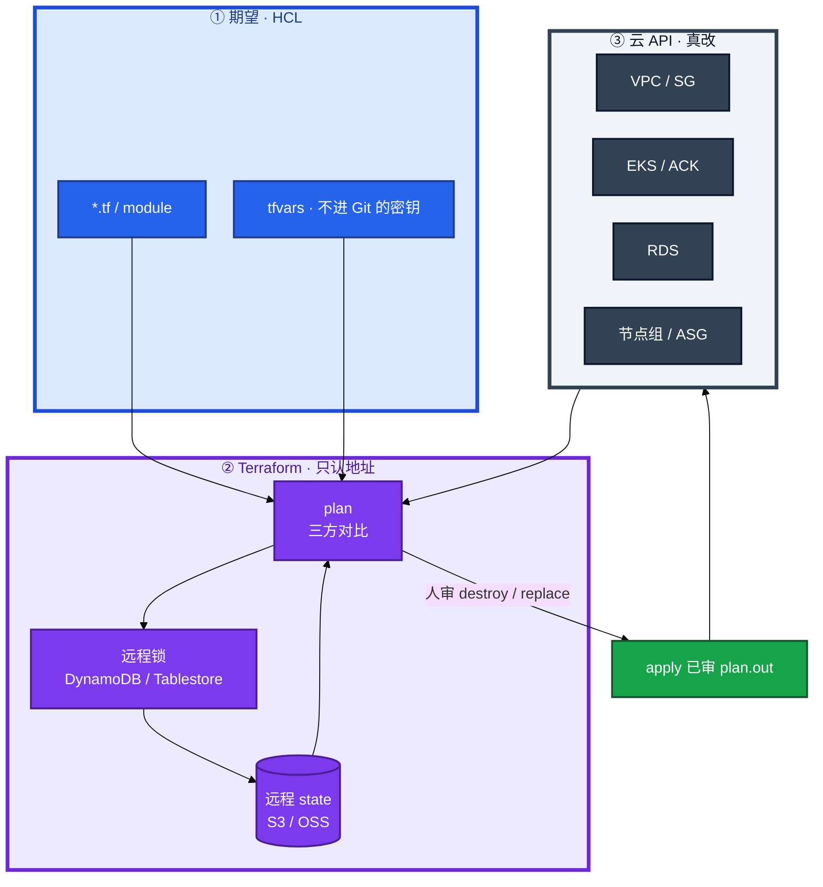
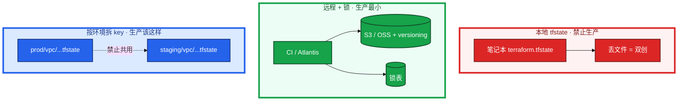
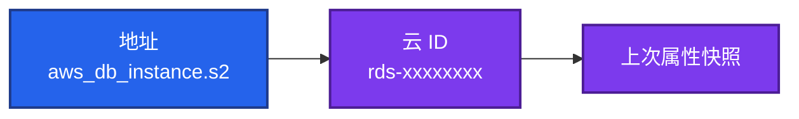
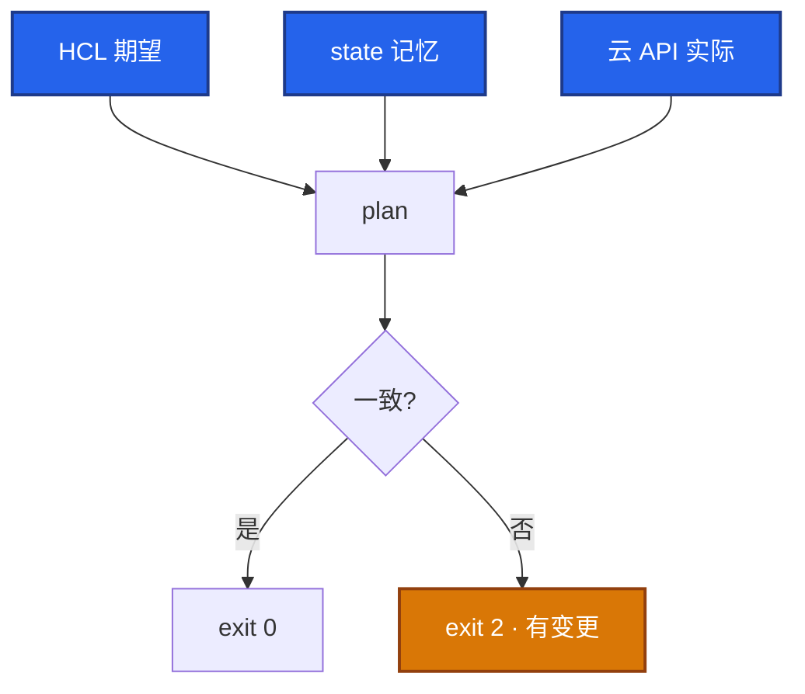
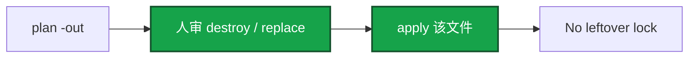
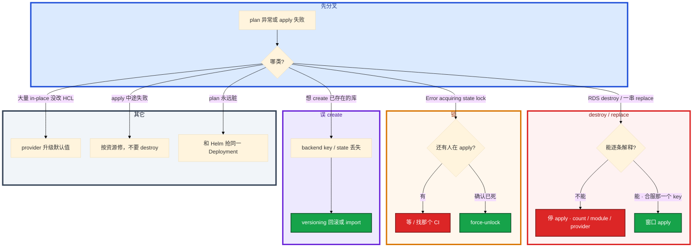

# Terraform


合服窗口，`terraform show plan.out` 里 RDS `will be destroyed`。有人准备 `apply -auto-approve`。另一次 CI 被 kill，下一个人要把 `force-unlock` 写进自动重试。

先别动手。这一章后半全是你会动手的：**怎么审 plan、怎么拿锁、怎么 import、怎么合服只删一个 key。** 前面的概念和原理，是为了让你动手时不把库重建掉。

**读完你能：** 白板上画出 HCL / state / 云 API 三方对比；plan 出现 destroy 能判断是 count 移位还是真要删；会远程 backend、锁、漂移、for_each 合服、失败回滚。

## 本章目录

缩进 = 上下级。3 下面才是 3.1。

想钉在**正文左边**跟着滚：菜单 **查看 → 打开视图 → 大纲**。Markdown 预览做不到独立左栏，目录只能写在文章开头。

- [1. 基本概念](#1-基本概念)
- [2. 架构图](#2-架构图)
- [3. 原理](#3-原理)
  - [3.1 State](#31-state地址--云-id)
  - [3.2 锁](#32-锁谁拿谁放乱-unlock-会怎样)
  - [3.3 漂移](#33-漂移三方对不上)
  - [3.4 Module 与 for_each](#34-module-与-foreach)
- [4. 安装部署](#4-安装部署)
  - [4.1 生产怎么选](#41-生产怎么选)
  - [4.2 目录与 CI 落地](#42-目录与-ci-落地你实际看到什么)
- [5. 核心配置](#5-核心配置)
- [6. 常用命令](#6-常用命令)
- [7. 常用操作](#7-常用操作)
  - [7.1 备份 state](#71-备份-state)
  - [7.2 审 plan 再 apply](#72-审-plan-再-apply)
  - [7.3 import](#73-import存量)
  - [7.4 合服删 key](#74-合服删-key)
  - [7.5 换模块 / moved](#75-换模块--moved)
  - [7.6 回滚](#76-回滚)
  - [7.7 拆 stack / 迁移](#77-拆-stack--迁移)
- [8. 生产排障](#8-生产排障)
- [9. 必会 · 常考](#9-必会--常考)
- [合上书](#合上书问自己)

**本章不讲：** 装软件、改配置、滚动 playbook → [04 Ansible](../04-Ansible/)；集群内发布、GitOps → [04-22](../../04-Kubernetes/22-GitOps-ArgoCD与Tekton/)；IAM / 多账号 → [07-07](../../07-云平台/07-IAM与多账号/)；制品、镜像 → [03](../03-制品与镜像/)；变更窗口 → [06](../06-运维平台与Oncall/)。

---

## 1. 基本概念

Terraform 用 **HCL** 声明期望。`plan` 预览，`apply` 调云 API。它管的是云资源的生命周期，不是机器里的软件包。

plan 读三份东西，缺一就会算错：

| 三方 | 是什么 |
|------|--------|
| **HCL** | 你想要的：资源类型、属性、module、var |
| **state** | TF 记得的：地址 ↔ 云资源 ID、上次属性 |
| **云 API** | 真有的：控制台、别的栈、人工改过的 |

从未审过的 plan 禁止 apply。`destroy` 生产几乎不用；误 destroy RDS 是不可逆事故。`apply -auto-approve` 生产禁用。

四个 diff 不要混：

| diff | 含义 | 值班怎么看 |
|------|------|------------|
| `+ create` | 期望有、state 无 | 线上已有同名库？可能 state 丢了或 key 打错 |
| `~ update` | 可变属性不一致 | in-place，一般可逆；仍要看会不会断连接 |
| `- destroy` | state 有、HCL 没了 | **可能删库**，逐条能解释才过 |
| `-/+ replace` | 不可变属性变了，先删后建 | 和 destroy 同等对待 |

三个角色不要混：

| 角色 | 干什么 |
|------|--------|
| **Terraform** | 声明云资源：VPC、子网、EKS/ACK、RDS、对象存储、节点组 |
| **Ansible** | 机器状态：装包、渲染配置、滚动 reload（04） |
| **Helm / Argo** | 集群内工作负载：Deployment、游戏 ConfigMap、HPA（04-22） |

同一 Deployment 不要 TF kubernetes provider 和 Helm 两边管——plan 每次都脏，Argo selfHeal 再打一遍。

> **记住**：plan 是三方对比的**产出物**，apply 只执行已审那一份。plan 和 apply 之间又改 HCL，会跑偏。CI 禁止 `apply` 不带已审 plan。

---

## 2. 架构图

先把整张图钉住。后面命令、合服、排障都对着这张图说话。



图上三条线：

1. **apply 不读「你脑子里的意图」，只执行已审 plan。**
2. **state 是记忆，不是备份云资源。** 丢了会再 create。
3. **锁挡住的是同一份 state 的并发 apply**，不是挡住控制台手改。

三种落地形态（装的时候选，挂的时候事故面不一样）：



本地：文件丢、拷错环境、Git 里进明文属性。远程：锁 + versioning。拆 key：prod / staging **禁止共用一份 state**。能读 state ≈ 能看资源 ID 和部分明文属性，backend 权限当机密。

TF 管集群外，Helm 管集群内：

```
  TF：VPC、子网、安全组、EKS/ACK、RDS、对象存储、节点组
  Helm / Argo：Deployment、游戏 ConfigMap、HPA

  TF kubernetes provider 去 apply 业务 Deployment
       +
  helm upgrade
       = 抢同一字段，plan 每次都脏
```

集群级 CRD 可 TF，业务 CR 走 GitOps。新环境：`terraform apply` 出网络和集群，Ansible 或 GitOps 再铺节点软件和业务。为什么不用纯控制台：不可重复、不可审、离职即失忆。紧急可以，事后必须 import 回 TF。Crossplane / Pulumi 知道即可，考点仍是 state / 锁 / 漂移，换语法不换问题。

---

## 3. 原理

原理只保留动手和面试会用到的：state 丢了怎样、锁残留怎样、漂移从哪来、合服用 count 为什么会重建后面所有库。

**本节 4 块：** 3.1 State · 3.2 锁 · 3.3 漂移 · 3.4 Module / for_each

### 3.1 State：地址 ↔ 云 ID

State 不是「云的备份」，是 **资源地址到云 ID 的映射**，再附带上次读到的属性。丢了：TF 以为资源不存在 → 再 create → 同名冲突或两套账单。



地址变了（改 `count` 下标、改 module 名、改 resource 名），TF 认为旧地址没了、新地址是新资源 → destroy + create。云上对象还在，只是 TF 认不出。修复用 `moved`，不要靠 destroy + create。

三个口误会死人：

| 命令 | 实际做什么 |
|------|------------|
| `terraform refresh` | 只更新 state 记忆，**不改云** |
| `terraform state rm` | 不管这个资源了，**不删云上对象** |
| `terraform destroy` | **真删云资源** |

想「下线一台」却跑了 `state rm`——云上对象还在，下次别人 import 才发现双管。把 `refresh` 当成回滚——它不改云。`terraform plan -refresh-only` 同样只刷新记忆。workspace 切错、tfvars 和 backend 不是一对——拿 staging tfvars 打 prod backend。目录分离就是为防这个。

> **记住**：state 丢了会双创。prod / staging **分 key**。本地 tfstate 禁止上生产。

### 3.2 锁：谁拿、谁放、乱 unlock 会怎样

apply 期间独占同一份 state。写路径：


进程被 kill、CI timeout、笔记本休眠，锁会残留。报错 `Error acquiring state lock`，Lock ID 还在 DynamoDB / Tablestore。

处理：

1. 看错误里的 Who / Operation / ID。
2. 确认没有别人、没有 CI 还在 apply（流水线、同事终端、Atlantis apply）。
3. 确认进程已死，再 `terraform force-unlock <LOCK_ID>`。
4. 不要把 unlock 写进自动重试当第一反应。乱 unlock → 双 apply 把资源改烂。

两个 CI 同时 apply 同一 state **应被锁拦住**。没拦住就是关了锁（`-lock=false`）或锁表没配上。生产禁止 `-lock=false`。`-lock-timeout` 只是排队等锁，不是跳过锁。

锁**挡不住**控制台手改——那是漂移，不是并发 apply。

### 3.3 漂移：三方对不上

漂移 = 云 API 实际 ≠ state 记忆（通常也不等于 HCL）。有人在控制台把机型从 t3.medium 改成 large、安全组放行 `0.0.0.0/0`，下次 plan 就要改回去。



定时 `terraform plan -detailed-exitcode`（**2 = 有变更**）告警。要么 apply 拉回声明，要么改 HCL 承认变更。预防：IAM 不让人在控制台改 TF 管的资源；变更走 PR。紧急控制台改了，事后必须 import / 改 HCL。不 import，直到某次 apply 把热修打回去。

`lifecycle { ignore_changes = [...] }` 只对那些属性不再管。滥用 = 声明和线上永久分叉，下次别人看不懂。provider 大升级默认值变化，会出现大量 in-place——读 upgrade guide，staging 先吃。长期靠流程，不靠人自觉。纯控制台不可重复、不可审、离职即失忆。

drift job 一直有变更：有人持续手改，或 provider 默认值在变。先停手改，再看 upgrade guide。

### 3.4 Module 与 for_each

Module 单一职责（vpc / eks / rds），`source = "...?ref=v1.2.0"` **pin 版本**。不 pin = 下次 plan 突然一堆 change，和 npm latest 同一类事故。环境差异用 `env/prod` + `prod.tfvars`，不要在 module 里写死账号 / region——换环境要改 module 是错的。

state 里地址形如 `module.vpc.aws_vpc.this`。改 module 名、给 module 加 `count`、改 `for_each` key，都是改地址。

Workspace 小项目可用；生产推荐**目录分离**——切错 workspace 等于拿 staging tfvars 打 prod backend。

四个区服用 `count` 建 RDS。合服要删「第 2 服」（索引 1）。从 list 里拿掉一个元素，plan 里后面所有库都是 `-/+ replace`。

```hcl
# count：删中间元素 → 后面索引全 rebuild（真实事故：RDS 被重建）
# for_each：按 key 销毁，地址稳定
resource "aws_instance" "web" {
  for_each = toset(["web-01", "web-02"])
}
```

```
  count  [0]=服1  [1]=服2  [2]=服3  [3]=服4
  删服2 → 后面全部移位 → TF 以为要 replace 一串 RDS

  for_each  key=s1  key=s2  key=s3  key=s4
  删 s2 → 只 destroy 那一个
```

游戏区服：module + `for_each` 按 `server_id` 建库 / 安全组，**不要 count 按「第几个服」**。重构地址用 `moved` block。`moved` 写错仍可能 destroy+create，staging 先看 plan 是否只是地址搬家、无 recreate。

给 module 本身加 `for_each` 同样按 key，不要对「区服列表」用 `count`。output 给 Ansible 用时，密码类标 `sensitive`，日志里不要打印。把 kubeconfig 明文写进 tfvars 进 Git 是事故。敏感变量：tfvars 不进 Git；密码走 Vault / 环境注入。Provider 版本约束要显式写。

> **记住**：区服按 `server_id` 用 for_each；count 删中间等于后面全部重建。

---

## 4. 安装部署

### 4.1 生产怎么选

| 项 | 选 | 不选 |
|----|----|------|
| state | 远程 S3/OSS + versioning + 加密 | 本地 tfstate、进 Git |
| 锁 | DynamoDB / Tablestore，强制开 | `-lock=false` |
| 环境 | 目录分离，key 含 `prod/` `staging/` | 一份 state 两套 tfvars |
| 执行 | CI + 人工审 plan；Atlantis 评 PR | 笔记本 `apply -auto-approve` |
| 边界 | TF 管云；Helm 管集群内 | kubernetes provider 抢 Deployment |
| 模块 | pin `ref=v1.2.0`，单一职责 | `source` 漂在 main |

阿里云：OSS + Tablestore 锁。AWS：S3 + DynamoDB。托管 Terraform Cloud 同样要问清：谁能读 state、锁超时、run 审批。

CI 角色最小权限：不能 `rds:Delete*` 打到所有库；plan 在 PR，apply 在受保护环境。IAM 过宽的 CI 角色 = 流水线被打穿就能毁账号。敏感 output 标 `sensitive`，Atlantis 评论里不要打出密码。能 apply prod 的人少，能读 state 的人也要少。

### 4.2 目录与 CI 落地你实际看到什么

```
  env/prod/vpc/     + backend key=prod/vpc/terraform.tfstate
  env/prod/rds/
  env/staging/vpc/  + 另一份 key，禁止共用
```

```hcl
terraform {
  required_version = ">= 1.5"
  backend "s3" {
    bucket         = "tf-state"
    key            = "prod/vpc/terraform.tfstate"
    dynamodb_table = "tf-lock"
    encrypt        = true
  }
  required_providers {
    aws = { source = "hashicorp/aws", version = "~> 5.0" }
  }
}
```

CI：

```
  fmt -check → validate → plan -out=plan.out → 人审 / Atlantis 评 PR
       → apply 该 plan 文件（不要当场再 plan 一次不看）
```

Atlantis：PR 评 plan，approve 后 apply **该 PR 的 plan 文件**，避免 merge 后又改了一笔。核对：apply 前 plan 里 destroy 数为 0 或能逐条解释；backend key 含环境名；CI 角色不能 `*` 删库。

验收：`terraform plan` 对空变更是 `No changes`；有意变更能在 PR 里看到 destroy/replace。不要只看 `apply` 退出码 0。

state 拆分：VPC 一个、数据库一个、计算一个，炸一个不拖全身。跨 stack 用 data source / 远程 state 只读，注意循环依赖。state 体积变大该拆 stack。

---

## 5. 核心配置

只动有证据的项。`prevent_destroy` 加在数据库，不要加在可重建的 ASG 上挡合法缩容。

| 参数 / 块 | 生产怎么用 | 改错会怎样 |
|-----------|------------|------------|
| `backend.key` | 含环境名、stack 名 | 打到错环境 = 事故 |
| `dynamodb_table` / 锁表 | 必须有 | 没锁 = 双 apply |
| `required_providers` 版本 | 显式约束 | 默认值一变，大量 in-place |
| `module.source` `ref=` | pin tag / SHA | 不 pin 突然一堆 change |
| `lifecycle.prevent_destroy` | **只给数据库** | 加在 ASG 上，合法缩容被挡 |
| `lifecycle.ignore_changes` | 极少用、写进变更单 | 声明和线上永久分叉 |
| `for_each` | 区服、安全组按稳定 key | 改用 count 合服会移位 |
| `-lock=false` | 生产禁用 | 双 apply |

战斗服节点组变更必须进窗口；数据库加 `prevent_destroy`，ASG 不要加。游戏新区：`for_each` 一套 `server_id` 建库和安全组，Ansible 拿 output 里的 IP 装节点。

> **记住**：`prevent_destroy` 是最后一道闸，不是流程。正确做法是地址稳定，合服 plan 只许那一个 for_each key。

---

## 6. 常用命令

```bash
terraform init
terraform fmt -check
terraform validate
terraform plan  -var-file=prod.tfvars -out=plan.out
terraform show -no-color plan.out | grep -E 'will be destroyed|must be replaced'
terraform apply plan.out
```

| 目的 | 命令 | 看什么 |
|------|------|--------|
| 初始化 / 换 backend | `terraform init` | backend、provider、module 下完 |
| 格式 / 语法 | `fmt -check` / `validate` | CI 门禁，过了不等于 plan 安全 |
| 预览 | `plan -var-file=... -out=plan.out` | 三方对比产出物 |
| 审 destroy | `show plan.out` + grep | destroy / replace 为 0 或能解释 |
| 执行已审计划 | `apply plan.out` | 禁止不带文件的 apply |
| 漂移探测 | `plan -detailed-exitcode` | 0 无变更，2 有变更，1 出错 |
| 只刷新记忆 | `plan -refresh-only` / `refresh` | **不改云** |
| 成员与地址 | `state list` / `state show <addr>` | 地址、ID |
| 不管某资源 | `state rm <addr>` | **不删云** |
| 绑已有 ID | `import <addr> <id>` | 再 plan 到 0 |
| 锁残留 | `force-unlock <LOCK_ID>` | 确认没人 apply 再做 |
| 敏感输出 | `output -json` | 密码类已标 `sensitive` 不要打印 |

值班先跑这四条：

```bash
terraform plan -var-file=prod.tfvars -out=plan.out
terraform show -no-color plan.out | grep -E 'will be destroyed|must be replaced'
# lock 报错时：看 CI / 同事是否还在 apply，再决定 unlock
terraform state list | head
```

`terraform apply -auto-approve` 生产禁用。`-target` 只修局部会让其余漂移累积，变更单要写清，不要当日常习惯。`terraform destroy` 生产几乎不用。

观测：每次 plan 的 add / change / destroy 数、apply 成功率、lock 冲突次数、定时 drift job 是否全 0。

---

## 7. 常用操作

### 7.1 备份 state

远程 backend **必须开 versioning**。本机拷一份 tfstate 不算备份。发版、合服、升 provider、改 module 地址前，确认 bucket 能回滚到上一版 state。

丢了：backend versioning 回滚 state，或 `terraform import` 把已有 ID 绑回去再 plan 到 0。不要 apply 再创一套。

**季度做一次「回滚上一版 state + plan」演练。** 没有演练 = 没有备份。state 泄漏按机密轮换：权限收紧 + 相关云密钥 rotate。

### 7.2 审 plan 再 apply



1. `fmt -check` → `validate` → `plan -out=plan.out`。
2. `show` 盯 `- destroy` 和 `-/+ replace`，逐条能解释。
3. `apply plan.out`。中间又 push 了 HCL 也不要当场再 plan 偷跑。
4. Atlantis / PR：approve 后 apply **该 PR 的 plan 文件**。

出现 unexpected destroy：**不要 apply**。开会问这是 count 移位、module 地址变了、还是真的要删这个 for_each key。

### 7.3 import 存量

先写 HCL → import ID → plan 修到无 diff。存量分批：网络 → 计算 → 数据库，每批 plan 到 0 再下一批。`terraformer` 能吐 HCL 但要人审，不能当生产源。

import 后 plan 仍有一堆 change：HCL 和云属性还没对齐。先补字段到无 diff，再往下一批，不要一边 import 一边 apply 无关变更。

半失败的 apply：部分已创建，state 半更新。按资源一块块修，对照云上已有对象 import 或 state 调整，不要盲目 destroy 清场。

### 7.4 合服删 key


1. HCL 里按 `server_id` 删那一个 key，其它 key 不动。
2. `terraform plan` 贴进变更单：只允许那一个 `- destroy`。
3. 战斗服节点组变更进窗口；数据库加 `prevent_destroy`，ASG 不要加。
4. 已经用了 count：先 `moved` 迁到 for_each，staging 演一遍，再生产删 key。

窗口只有 10 分钟也**不要为了窗口去 apply 一串 RDS replace**。错过窗口也比误删库强。

### 7.5 换模块 / moved

有人 bump 了 vpc module 的 `ref`，没 pin 到原来的 v1.2.0。plan 里突然一串 unexpected destroy。module 地址变了，TF 认为旧资源不在新地址上，要先删后建。count 移位、provider 大升级也会走同一条路。

```hcl
moved {
  from = aws_db_instance.servers[2]
  to   = aws_db_instance.servers["s3"]
}
```

升级 module：changelog → staging → prod。pin 回版本也能止血。staging 先看 plan 是否只是地址搬家。

### 7.6 回滚

HCL 回滚 = Git revert 后再 plan（仍要审 destroy）。**云资源一旦 destroy，HCL revert 拉不回来。**

state 写坏：用 backend versioning 回到 apply 前那一版，再 plan。apply 中途失败不要 `destroy` 清场。

没有升级 / 合服前的 state 版本 = 没有回滚。

### 7.7 拆 stack / 迁移

- **换环境隔离** = 目录 + 不同 backend key，不是靠人记 workspace。
- **拆大 state**：`state mv` 迁地址到新栈，或 data source 只读引用；一次迁一类。
- **只改资源不换地址**：in-place update。
- **改地址**：`moved` / `state mv`。

Stacked 业务和 VPC 塞一份 state 是隐患。活动中不要做大迁移。

---

## 8. 生产排障

和变更三问同一套：改什么？影响什么？怎么回滚？**plan 里有 RDS destroy = 先停 apply，不是先抢窗口。**



现场顺序：

```bash
terraform show -no-color plan.out | grep -E 'will be destroyed|must be replaced'
# lock：看 CI / Atlantis / 同事终端
terraform state list
# 想 create 已有资源：核对 backend key、bucket versioning
```

| 现象 | 先做什么 | 不要做什么 |
|------|----------|------------|
| RDS will be destroyed | 停 apply；查 count / module / provider | 为窗口 `apply -auto-approve` |
| lock 报错 | 有没有第二个 apply，再 unlock | 自动重试第一下就 unlock |
| 想 create 已存在的库 | backend key、state 是否丢；回滚或 import | apply 再创一套 |
| 大量 in-place | provider 升级默认值；staging 先吃 | 当无害全点过 |
| apply 中途失败 | 按资源修 state / import | destroy 清场 |
| plan 每次都脏 | TF vs Helm 边界 | 两边继续抢字段 |
| drift job 退出码 2 | 控制台手改或 ignore 漏了 | 关 drift job 当解决 |

合服 plan 除了目标服还出现另外三个 RDS destroy：停手开会。prevent_destroy 能挡一刀，但正确做法是地址稳定。

---

## 9. 必会 · 常考

白板和追问高频，能一口回：

| 说法 | 对错 | 口径 |
|------|:----:|------|
| 生产可以 `apply -auto-approve` | 错 | 必须审 destroy / replace，apply 已审 plan |
| state 丢了再 apply 就能对齐 | 错 | 会双创；回滚 state 或 import |
| `state rm` 会删掉云上 RDS | 错 | 只是不管了，云上还在 |
| `refresh` 能回滚误改 | 错 | 只改记忆，不改云 |
| 4 个区服用 count，删第 2 个只删一个 | 错 | 后面索引全 replace |
| 合服窗口不够可以先 apply 再说 | 错 | 误删库不可逆 |
| module 不 pin，跟 latest 即可 | 错 | 和 npm latest 同一类事故 |
| prod / staging 共用一份 state 省事 | 错 | 分 key；切错等于打生产 |
| 锁残留应立刻写进 CI 自动 unlock | 错 | 确认没人 apply 再 force-unlock |
| TF 和 Helm 可以一起管同一 Deployment | 错 | plan 永远脏 |
| 控制台改完不用管，下次 plan 会认 | 错 | 要么拉回要么改 HCL / import |
| `-lock=false` 能加快 CI | 错 | 生产禁用 |
| Crossplane 换了就不考 state | 错 | 考点仍是状态 / 锁 / 漂移 |
| `prevent_destroy` 应加在所有资源上 | 错 | 只给数据库；ASG 会挡合法缩容 |

数字：drift `detailed-exitcode` **2 = 有变更**；合服 plan **只允许那一个** for_each key destroy；CI `fmt → validate → plan → 审 → apply 该文件`；state 权限当机密。

易混：refresh vs destroy vs state rm；count vs for_each；锁残留 vs 漂移（一个是并发 apply，一个是控制台）；import vs 再 create；HCL revert vs 云已删；workspace vs 目录分离。

---

## 合上书，问自己

1. plan 读哪三方？apply 盯哪两种 diff？
2. state 丢了会怎样？prod / staging 为什么分 key？
3. 锁残留先问什么？为什么不能自动 unlock？
4. 漂移怎么发现、怎么治？紧急控制台改了事后做什么？
5. 合服用 count 删中间服会发生什么？for_each + moved 怎么走？
6. TF 和 Helm 谁管什么？force-unlock 前确认什么？

六题都能口述，这一章就过了。下一章把变更、告警、值班收成一套 oncall，而不是个人英雄敲 apply。
