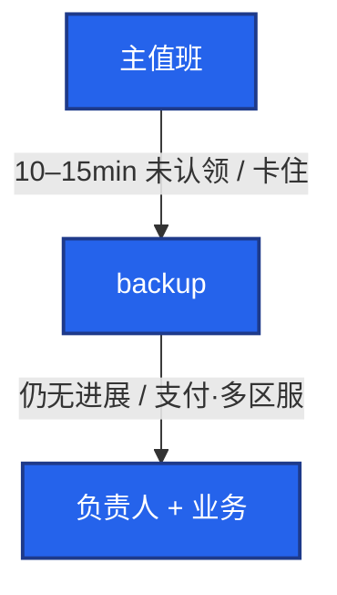

# 06｜运维平台与 Oncall · 练习题

先自己画图或口述，再对照解答。每题标了覆盖范围：

| 标记 | 含义 |
|------|------|
| **核心** | 不懂整章就没建立起来 |
| **必会** | 值班和面试都要能讲 |
| **常用** | 线上会反复碰到 |
| **常考** | 白板和追问的高频口径 |

## 本题目录

- [Q1 事件闭环](#q1)
- [Q2 变更三问 / 冻结](#q2)
- [Q3 无责复盘](#q3)
- [Q4 升级与值班交接](#q4)
- [Q5 CMDB 与告警](#q5)
- [Q6 P0 定级 / 告警质量](#q6)
- [Q7 自愈边界](#q7)
- [Q8 平台先做哪三块](#q8)
- [Q9 War room / 影响面](#q9)
- [Q10 开服发版值班 / 排障](#q10)
- [合上书](#合上书)

---

## Q1

**★★★★★｜从告警到复盘的闭环？哪一步最容易做错？**

**覆盖**：核心 · 必会 · 常考

### 场景

支付超时告警。群里有人开始翻代码找根因，十分钟了没人回滚。P0 还没人点认领。

### 完整解答

认领 → 定级 → 广播 → **先止血** → 指标回来 → 无责复盘 → action 有主有期。最容易错：先挖根因再恢复。


War room 一人指挥。游戏要报区服和支付。oncall 当周不写需求，目标是 MTTR。

### 再追问

- 先 5-Why 再恢复为什么是错的？——故意拉长故障。根因留在复盘里挖，止血窗口里只做可逆动作。
- 有人重启逻辑服？——有状态禁止当无状态乱重启；长连接玩家会被踢。

---

## Q2

**★★★★★｜变更三问和分级？开服日能发版吗？**

**覆盖**：核心 · 必会 · 常考

### 场景

周五晚上有人要发登录协议。开服日另有人走 SSH 跳过变更系统。回滚从来没演练过。变更系统能勾「跳过窗口」。

### 完整解答

改什么、影响什么、怎么回滚。缺一不能上。

| 类型 | 审批 |
|------|------|
| 标准（已门禁日常发布、弹性） | 自动 |
| 普通（配置、中间件小升） | 负责人 |
| 紧急（止血、安全补丁） | 双人 + 事后补单 |

窗口留观察；周五晚 / 节前 / 开服日冻结。冻结必须系统硬拦截。审批过多会逼人走 SSH，所以标准变更要自动。回滚没演练：第一次故障才点 undo 会失败 → GameDay。变更系统能跳过窗口 = 等于没窗口。

### 再追问

- 紧急变更还要不要窗口？——不受窗口限制，但必须复核和补单。旁路要审计抓。
- 日常大厅发布过三层审批？——会逼人 vim。标准变更必须自动。

---

## Q3

**★★★★★｜Blameless 复盘写什么？「nginx 挂了」算根因吗？**

**覆盖**：核心 · 必会 · 常考

### 场景

复盘会变成点名。改进项写了「加强责任心」，没有日期。登录挂了 20 分钟，第一句是「值班那会没盯」。

### 完整解答

问系统为何允许错误，不追人。

1. 时间线（发现 / 止血 / 恢复，分钟级）
2. 根因到门禁：为什么没拉起、没告、没自动回滚
3. 影响面：用户、区服、时长、收入
4. 做对的决策
5. Action 可验收、有 owner、有日期；下个迭代验证关掉

「nginx 挂了」不是根因。没有截止日期的改进项等于没写。同类故障：这次的信号下次能否 1 分钟内告出来。准备一个自己的故障故事，数字和你的动作，不要把团队平台全揽。纪要必须可搜索。改进项进 backlog 带版本。

### 再追问

- 改进项没人跟？——下次同类故障会再翻出来。没有截止日期 = 没复盘。
- 复盘 = 找人背锅？——口误。正确是改系统。

---

## Q4

**★★★★★｜P0 无人认领升级谁？值班怎么交接？**

**覆盖**：核心 · 必会 · 常用

### 场景

主值班手机静音。P0 打进来 12 分钟没认领。backup 也没被叫醒，因为升级规则没配。交接写在个人备忘录里。指挥不在，现场选举。

### 完整解答

没有升级路径的 oncall 等于晾着。



轮值 1 周常见。交接必须包含：进行中故障、今日变更窗口、已知烂告警、容量红线。文档不在个人笔记。值班文档 Top N 一页纸，每步写成功长什么样。指挥不在：backup 按路径顶上，不要现场选举。开服窗口认领是分钟内，不是等到 15min。

### 再追问

- 加电话通道能不能解决叫不醒？——解决不了噪音，只会多叫醒。先抑制和升级路径。
- MTTA 很好但玩家进不去？——平台指标和业务 SLO 要分开。

---

## Q5

**★★★★☆｜CMDB 怎么设计才有用？和告警什么关系？**

**覆盖**：必会 · 常用 · 常考

### 场景

CMDB 有三万条 IP，Owner 是离职账号。告警进大群。自动化按错误 IP 重启了一台支付机。

### 完整解答

应用 → 服务 → 实例 → 依赖 → Owner。质量大于数量。自动发现为主，人填 Owner 为辅。发布回写版本。宁缺毋错。

```
  告警 → CMDB Owner → oncall
  没有 Owner / 离职账号 → 进大群或空转
  错 IP → 自动化放大事故
```

对账以集群 / 云 API 为准，CMDB 跟发现走。Owner 离职当天轮转。没有 Owner 的自愈是随机伤害。

### 再追问

- FinOps 标签从哪来？——从 CMDB 来，避免测试集群按生产预算扩。
- 平台页数多说明工程化吗？——不。看对账差异数、确认率、MTTR。

---

## Q6

**★★★★☆｜P0 / P1 怎么定？告警质量差 oncall 崩溃是人不够吗？**

**覆盖**：必会 · 常用

### 场景

「感觉挺严重就 P0。」磁盘预警也打成 P0，风暴把支付告警淹没。值班同学夜班被叫醒 40 次，真正故障 1 次。第二天谁都不想认领。

### 完整解答

P0 核心不可用（登录 / 战斗 / 支付）；P1 降级。用 SLO / 用户数，不靠感觉。CCU 暴跌可直接 P0。P2 非核心周汇总。P3 工作日看趋势。

oncall 崩溃多半是噪音，不是人不够。能对应 Runbook 才叫人。看板类信号不要 P1。抑制、聚合、认领超时升级。度量确认率。交接写明已知假告警。没有动作的监控去 dashboard，别叫人。

### 再追问

- 烂告警会怎样？——把 P0 淹没，人习惯忽略。
- 游戏怎么套 P0？——登录失败、战斗中断、支付挂、CCU 腰斩。

---

## Q7

**★★★★☆｜Runbook 自动化边界？自愈能不能重启逻辑服？**

**覆盖**：必会 · 常用 · 常考

### 场景

磁盘满自愈脚本重启了战斗服。同时值班的人也在重启，打成脑裂。合服被做成了定时 Job。

### 完整解答

高频可逆：重启无状态、扩容、清盘、切只读。人闸：删数据、合服、支付、schema。有状态服禁止自动乱重启。

```
  L0 文档 → L1 人触发 → L2 平台按钮（审计+超时）→ L3 告警自愈
```

安全阀：超时、可取消、幂等、审计、blast radius（一次一台 / 一个 ns）。自愈失败要告警。自愈和人工同时重启要互斥锁。合服有状态、不可逆，不能当 L3。自愈名单默认不含逻辑服。

### 再追问

- 清磁盘算 L3 可以吗？——可以，但是只读检查 + 清指定目录、超时、可取消；不要 rm -rf 家目录。
- 没有 Owner 的自愈？——随机伤害。先打通 Owner。

---

## Q8

**★★★★☆｜平台你先做哪三块？巡检用 SSH 循环行不行？**

**覆盖**：必会 · 常用 · 常考

### 场景

领导要「智能自愈大屏」。CMDB Owner 还是空的，变更能跳过窗口。简历写「负责运维平台」。

### 完整解答

先打通 **CMDB Owner、告警路由、变更审计**。没有 Owner 的自愈是随机伤害。不要先造花哨门户重复 CI。工具是执行器，平台是权限 + 流程。开源工具够跑命令，流程和审计仍要自己接。巡检：平台定时只读检查，结果工单化。SSH 循环不是平台。

讲建设：Before 人肉 SSH；After 工单 + CMDB + oncall 升级 + 变更窗口硬拦截。数字：MTTR、变更失败率、告警确认率。权衡自动化边界。扛追问：一次自愈误伤、一次复盘落地。讲你做的模块和决策，别把团队平台全揽。页数不说明工程化。

### 再追问

- 堡垒机在哪一层？——权限 / 审计底座，不是花哨门户。
- 弹性变成账单事故？——FinOps 标签从 CMDB 来。

---

## Q9

**★★★★☆｜War room 怎么开？跨区服怎么扩影响面？**

**覆盖**：必会 · 常用

### 场景

P0 进了 12 个人，每个人都在 kubectl。运营问「要不要公告」，三个口径。

### 完整解答

固定频道。指挥、沟通运营、操作手分开。禁止十人同时改配置。先广播现象和范围。恢复后再复盘。公告口径统一。指挥频道预先建好。

跨区服：按 CMDB 依赖图从应用扩到 DB / Redis / 上游，不要问群「这台机器是谁的」。

### 再追问

- 指挥不在怎么办？——backup 顶上；升级路径里写死，不要现场选举。
- 先广播什么？——现象、哪些区服、支付是否受影响、谁在扛。

---

## Q10

**★★★★☆｜开服 / 发版值班和日常有什么不同？给出现象你先走哪条？**

**覆盖**：必会 · 常用 · 常考

### 场景

开服窗口有人发了一次「小配置」。Harbor 复制还没完就开始切流量。主值班在开会。四个工单：① 告警无人认 ② 变更后挂 ③ 自愈和人工打架 ④ 开服仍能发版。

### 完整解答

单独值班表 + backup 待命。冻结写进变更系统硬拦截（群吼不算）。镜像预拉 / 本机房 digest 确认（03）。告警切到在职开服 Owner。出问题先降级 / 回滚，禁止开服窗口上新功能、GC 旧包、扩容测试集群抢配额。开服日冻结未拦截 = 平台没做成。合服不可逆，不能当自愈。窗口内认领应该是分钟内。发版夜同样：人在线、门禁在 08、窗口和升级在本章。

| # | 走哪条 | 不要做 |
|---|--------|--------|
| ① | 升级路径和 Owner 是否在职 | 在群里等 |
| ② | 先回滚，再 5-Why | 先挖根因 |
| ③ | 停自动，互斥锁 | 两边一起重启 |
| ④ | 冻结硬拦截 | 靠群吼 |

### 再追问

- 开服日 P0 响应还是 15min 吗？——窗口内人必须在线，认领是分钟内。
- Harbor 无 digest 就切流量？——先停切流，预拉是开服清单必须打勾的项。

---

## 合上书

- [ ] 能画出 CMDB → 告警 → 认领 → 止血 → 复盘，并指出最容易错的一步
- [ ] 能说出变更三问、三级审批、窗口硬拦；开服冻结不靠群吼
- [ ] 能默写复盘五段；「nginx 挂了」不是根因；action 有主有期
- [ ] 能讲升级路径：15min → backup → 经理；交接四项不在个人笔记
- [ ] 能区分 CMDB 质量 vs 条数；自愈 L0–L3；逻辑服 / 合服必须人确认
- [ ] 能开 war room（指挥 / 沟通 / 操作手）；能用分流处理无人认领和变更后挂
- [ ] 能说出开服 / 发版值班和日常的差别，以及平台先做 Owner + 路由 + 审计
