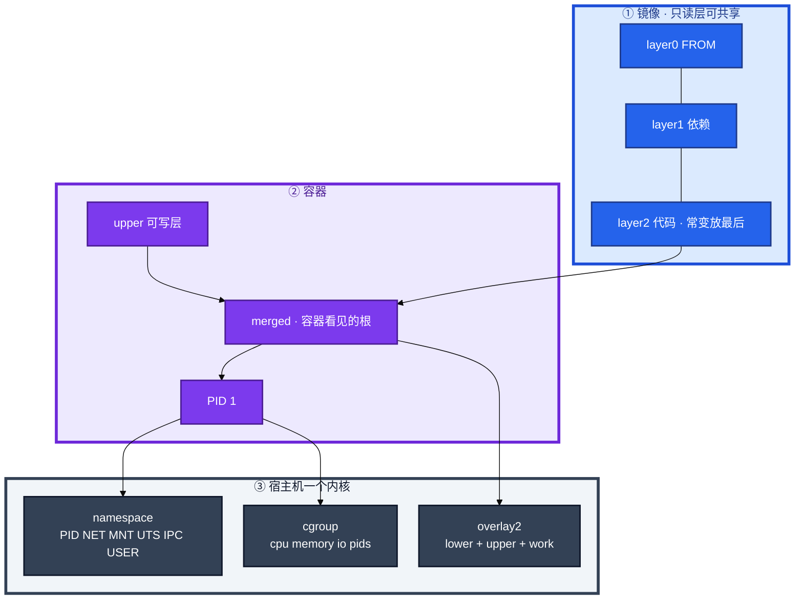
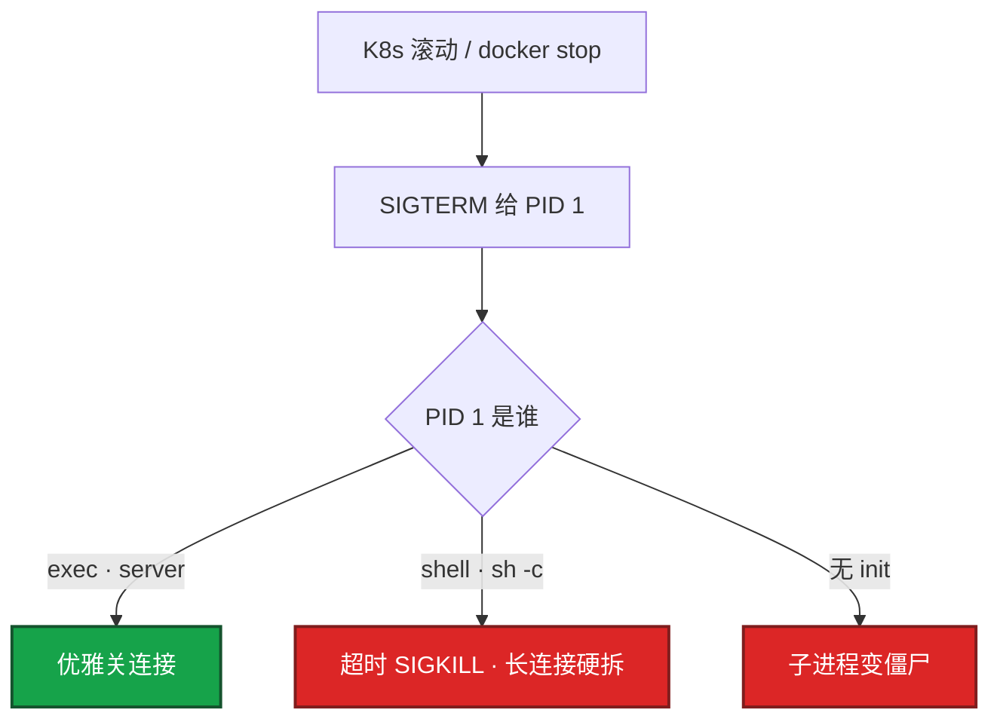
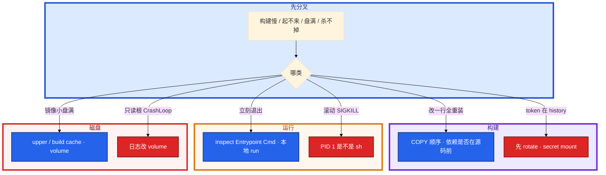

# Docker 深度


改一行大厅代码，CI 每次重跑 `go mod download`，构建从 40 秒变成 8 分钟。另一边滚动发布 SIGTERM 杀不掉进程。开服当天节点磁盘 100%，镜像只有 200MB。

先别动手。这一章后半全是你会动手的：**怎么写 Dockerfile、怎么看 PID 1、盘满 prune 什么、密钥进层怎么止血。** 前面的分层、namespace、overlay2，是为了让你动手时不把锅甩给 kubelet。

**本章主线（排障就按这三步想）：**

1. **懂分层**：依赖在前、源码在后；一层变后面缓存全失效
2. **看 PID 1**：SIGTERM / preStop / 宽限期，别当普通进程杀
3. **清磁盘**：overlay2 upper 占盘；prune 前确认无运行中容器引用

**读完你能：** 白板上画出只读层 + 可写层 + namespace/cgroup；改一行代码能判断缓存为何失效；会多阶段瘦身、BuildKit secret、overlay2 排障、镜像安全最低配。

## 本章目录


- [1. 基本概念](#1-基本概念)
- [2. 架构图](#2-架构图)
- [3. 原理](#3-原理)
  - [3.1 层缓存](#31-层缓存)
  - [3.2 namespace / cgroup](#32-namespace--cgroup)
  - [3.3 overlay2](#33-overlay2)
  - [3.4 PID 1 与信号](#34-pid-1-与信号)
- [4. 安装部署](#4-安装部署)
  - [4.1 生产怎么选](#41-生产怎么选)
  - [4.2 镜像落地你实际看到什么](#42-镜像落地你实际看到什么)
- [5. 核心配置](#5-核心配置)
- [6. 命令与操作](#6-命令与操作)
- [7. 生产排障](#7-生产排障)
- [8. 必会 · 常考](#8-必会--常考)
- [合上书](#合上书问自己)

**本章不讲：** digest 晋升、Harbor、禁 latest、扫描门禁细节 → [03](../03-制品与镜像/)；流水线何时 build → [02](../02-CI-CD/)；containerd / CRI / pause / 节点升级 → [04-16](../../04-Kubernetes/16-节点运行时与升级/)；cgroup 明细、逃逸链 → [02-07](../../02-基础底座/07-cgroup与容器/)；K8s 探针、preStop、terminationGracePeriod → [04-04](../../04-Kubernetes/04-Pod生命周期/)。

---

## 1. 基本概念

镜像不是一个大文件，是多层只读 tar 叠在一起。容器启动时在最上面加一层可写层（Copy-on-Write）。K8s 用的是同一套镜像格式，运行时换成 containerd 不改变分层这件事。

容器**不是**一台小虚拟机。共享宿主机内核。隔离靠 **namespace**（看见什么），限额靠 **cgroup**（能用多少）。看起来像独立系统，逃逸面在内核——高安全用 VM / Kata，普通业务用容器换密度。

| 在镜像 / 容器里 | 不在本章、在别处 |
|-----------------|------------------|
| 层、Dockerfile、ENTRYPOINT/CMD、overlay2 upper | digest 晋升、Harbor 复制、禁 latest（03） |
| 单机 `docker run`、PID 1、BuildKit | kubelet / CRI / pause（04-16） |
| namespace 种类、cgroup 配额入口 | cgroup 文件排障链、逃逸（02-07） |

四个容易混的词：

| 词 | 是什么 |
|----|--------|
| **镜像** | 只读层集合，用 digest 锁定（03） |
| **容器** | 镜像 + 可写层 + 一组 namespace/cgroup + 一个 PID 1 |
| **可写层 upper** | CoW；删容器文件只改这里 |
| **volume** | 绕过 union FS 的数据盘；日志 / 资源包应该走这里 |

> **记住**：某一层变了，它和后面所有层缓存失效，所以依赖在前、代码在后。容器里看到的是 merged 视图；删除容器文件只改 upper，镜像层还在，磁盘不一定回来。

---

## 2. 架构图

先把整张图钉住。后面 Dockerfile、盘满、排障都对着这张图说话。



图上三条线：

1. **代码层变了，它后面的 RUN 全重做**——所以 `COPY go.mod` 在 `COPY . .` 前面。
2. **没有箭头从「镜像 200MB」指向「节点盘 100%」**——盘往往在 upper / build cache。
3. **PID 1 必须是业务进程（或 tini）**，否则 SIGTERM 进不了优雅退出。

Dockerfile 指令如何变成层：

```
  Dockerfile 指令          镜像只读层（可共享、可缓存）
  FROM alpine:3.20    →    [ layer 0 基础 ]
  RUN apk add ca-certs→    [ layer 1 ]
  COPY go.mod ...     →    [ layer 2 ]
  RUN go mod download →    [ layer 3 ]
  COPY . .            →    [ layer 4 ]     ← 代码常变，放最后
  容器启动            →    [ layer 4 ... 0 ] + [ 可写层 upper ]
```

---

## 3. 原理

原理只保留动手和面试会用到的：缓存为何失效、容器不是 VM、盘满先看哪、信号为何到不了进程。

**本节 4 块：** 3.1 层缓存 · 3.2 namespace/cgroup · 3.3 overlay2 · 3.4 PID 1

### 3.1 层缓存

每条 Dockerfile 指令通常一层。相同指令且父层没变，才命中缓存。`COPY . .` 放在装依赖前面：代码一变，依赖层一起重做。


觉得「层越少越小」——乱合并会让「只改一行代码」也重做安装。依赖和代码要分开层。钉版本，不用 `python:latest`。`COPY` 优于 `ADD`：`ADD` 会解 tar、拉远程 URL，缓存和可复现都差。远程当时的字节会变，和「每环境重 build」同一类不确定。文件进仓再用 COPY。

`.dockerignore` 不写，context 两 GB（`.git` / `node_modules`），Dockerfile 写得再好也要把构建机拖死，还可能把密钥打进层。

游戏逻辑服：别把策划表、符号表打进层，开服拉镜像会把窗口吃掉（制品侧见 03）。

> **记住**：依赖文件先 COPY 再装；源码放最后。层变了，它后面全重做。

### 3.2 namespace / cgroup

容器共享宿主机内核。内核 panic 全机一起死，cgroup 挡不住。隔离故障域要虚机 / 节点池，不是再套一层容器。

| namespace | 隔离什么 | 值班会碰到 |
|-----------|----------|------------|
| **PID** | 进程号空间；容器内 PID 1 ≠ 宿主机 PID | `ps` 对不上；信号打 PID 1 |
| **NET** | 网卡、iptables、端口 | 容器里看不宿主机 eth0 |
| **MNT** | 挂载点 | overlay merged、volume |
| **UTS** | hostname | 容器 hostname ≠ 节点 |
| **IPC** | System V IPC | 一般少碰 |
| **USER** | uid 映射 | **很多生产默认没开**；不要假设容器 root 不是宿主机 root |

cgroup 管配额，不是视图：

| 资源 | Docker 常见入口 | 超了怎样 |
|------|-----------------|----------|
| CPU | `--cpus` / `cpu.max` | throttle，宿主机可以很闲 |
| 内存 | `--memory` / `memory.max` | 杀进程，不一定有整机 OOM 行 |
| IO | `--device-write-bps` 等 | 限速 |
| pids | `--pids-limit` | fork 失败 |

容器里 `free` / `nproc` 经常读宿主机 `/proc`，**撒谎**。真配额在 cgroup 文件（02-07）。Go `GOMAXPROCS`、Java GC 线程按谎言来配，会被 throttle 死。本章要求：知道配额在 cgroup 不在 `free`；详细文件路径去 02-07。K8s request/limit 去 04-04。

USER namespace 很多生产默认没开。所以镜像里 **非 root 仍要做**。高安全用 VM / Kata。不要无故 `--privileged` / 把 Docker socket 挂进不可信构建——等于宿主机 root。

### 3.3 overlay2

union FS 把多个只读层 + 可写层合成一个根。Docker / containerd 常见后端是 **overlay2**。

```
  宿主机 /var/lib/docker/overlay2/  （或 containerd 的 io.containerd.snapshotter.v1.overlayfs）

  lowerdir  = 镜像只读层（可被多个容器共享）
  upperdir  = 这个容器的可写层（CoW：改文件先拷到 upper）
  workdir   = overlay 工作目录
  merged    = 容器里看到的根文件系统
```

CoW：改一个下层大文件，会先拷到 upper 再改——upper 暴涨。在容器里 `rm` 镜像带来的文件：只在 upper 记 **whiteout**，下层还在，镜像不会变小，节点盘也不一定回来。

删容器 ≠ 立刻收回镜像层；悬空镜像、build cache 要 prune。游戏服在容器里下完整资源包，upper 会把节点磁盘打满，开服当天典型事故。资源包走 volume / CDN。

> **记住**：merged 是容器看见的根；磁盘满先看 upper 和 build cache，不是只看镜像大小。

### 3.4 PID 1 与信号

两者经常被写成「都能填启动命令」。生产差别在：**谁是可执行文件、参数会不会被 `docker run` 换掉、PID 1 是不是你的进程。**

```
  只写 CMD ["server"]              →  可被 docker run 镜像 args 整个换掉
  只写 ENTRYPOINT ["server"]       →  总是跑 server，args 追加
  两者都有：ENTRYPOINT + CMD 当默认参数

  docker run 镜像 -flag            替换的是 CMD，不是 ENTRYPOINT
  K8s args                         同样替换 CMD；换二进制改 command
```

```dockerfile
# exec 形式：PID 1 就是 server，能收到 SIGTERM
ENTRYPOINT ["/server"]
CMD ["--config", "/etc/server.yaml"]

# shell 形式：PID 1 是 /bin/sh -c，信号常到不了 app
# ENTRYPOINT /server --config /etc/server.yaml
```



需要壳就用 `tini` / `dumb-init` 当 PID 1。`CMD` 用 shell 形式还有一个坑：变量展开靠壳，exec 形式不走壳，`$FOO` 不会展开。K8s 探针和优雅退出细节在 04-04，本章只要求说清镜像里这两字段。

容器起来立刻退出：CMD/ENTRYPOINT 写成了交互式 shell，没有前台进程；或 exec 形式路径写错。先 `docker logs` / `inspect` Entrypoint Cmd，再谈 K8s。本地 `docker run --rm` 同一镜像看 PID 1 和退出码。常见误判：把 CrashLoop 先怪 kubelet。

> **记住**：ENTRYPOINT 是可执行文件，CMD 是默认参数；生产用 exec 形式让业务当 PID 1。

---

## 4. 安装部署

### 4.1 生产怎么选

| 项 | 选 | 不选 |
|----|----|------|
| 基础镜像 | distroless / alpine / slim，**钉 digest** | `python:latest`、full JDK 当 runtime |
| 构建 | 多阶段 + BuildKit | 编译器打进运行镜像 |
| 用户 | `USER 1000` / nonroot | 容器 root + `--privileged` |
| 密钥 | secret mount；运行时 K8s Secret | `ENV TOKEN=`、`COPY .npmrc` |
| 数据 | volume / emptyDir | 可写层当下资源盘 |
| 运行时 | 生产 K8s 用 containerd（04-16） | 业务 Worker 上 DinD 给不可信 PR |

生产标配：多阶段 + distroless 或 alpine + 非 root + 钉版本。扫描门禁在 03，本章不把密钥写进 Dockerfile。

### 4.2 镜像落地你实际看到什么

验收：进程在不算数。必须能说出 PID 1 是谁、`docker history` 没有 token、runtime 阶段没有 compiler。

```dockerfile
FROM golang:1.22 AS builder
WORKDIR /src
COPY go.mod go.sum ./
RUN go mod download
COPY . .
RUN CGO_ENABLED=0 go build -o server -ldflags="-s -w" .

FROM gcr.io/distroless/static:nonroot
COPY --from=builder /src/server /server
USER nonroot
ENTRYPOINT ["/server"]
```

| 基础镜像 | 特点 |
|----------|------|
| distroless | 只有运行时，无 shell / 包管理器，最小最硬；调试用 debug 变体 |
| alpine | 小，musl libc 可能和 C 扩展不兼容 |
| slim | 折中 |
| full | 开服拉不动，不要当 runtime |

800MB → slim 约 150MB → distroless + 多阶段常到 10–20MB。Go 用 `-ldflags="-s -w"` 去调试符号。镜像小：拉得快、扩容快、节点盘省、攻击面小——开服加节点尤其明显。200 节点同时 pull 时体积就是窗口。多阶段后还 1GB：数据 / 符号表 / 缓存拷进了 runtime，用 dive 看层。

distroless 没有 shell：排障用 debug 变体或把状态打到 stdout，不要为了 exec 把 shell 装回生产镜像。

制品晋升仍用 digest（03）。生产引用优先 `@sha256:...`。

---

## 5. 核心配置

只动有证据的项。

| 项 | 生产怎么用 | 改错会怎样 |
|----|------------|------------|
| `COPY` 顺序 | 依赖文件先、源码最后 | 改一行全重装 |
| ENTRYPOINT/CMD | JSON 数组 exec | PID 1 是 sh，滚动 SIGKILL |
| `USER` | 非 0 | 逃逸面大；USER ns 默认还可能没开 |
| BuildKit secret | `--mount=type=secret` | token 进层，删 tag digest 还在 |
| cache mount | go/npm 缓存不进层 | 每次 CI 冷启动 |
| `.dockerignore` | 丢掉 `.git` / `node_modules` | context 2GB、密钥进层 |
| `readOnlyRootFilesystem` | 日志走 volume | CrashLoop 或 upper 打满盘 |
| `--privileged` / docker.sock | 不可信流水线禁止 | 宿主机 root |

`DOCKER_BUILDKIT=1`（现代 Docker 默认开）。并行构建无依赖的层；缓存更聪明；密钥可以不进层。

> **记住**：BuildKit 的 cache mount 加速、secret mount 保密钥；token 进层先 rotate。

---

## 6. 命令与操作

### 6.0 速查

```bash
docker history <image>
docker inspect <cid> --format '{{.Path}} {{json .Args}} {{.State.Pid}}'
docker logs <cid>
docker run --rm --name t <image>   # 本地看 PID 1 和退出码
docker system df
du -xhd1 /var/lib/docker/overlay2
```

| 目的 | 命令 | 看什么 |
|------|------|--------|
| 哪层胖 / 哪层总重建 | `docker history` / `dive` | compiler、token、COPY data |
| PID 1 | `inspect` Path/Args；容器内 `ps` | 是 `/server` 还是 `/bin/sh` |
| 立刻退出 | `logs` + 本地 `docker run --rm` | 退出码，先别怪 kubelet |
| 磁盘 | `system df` | Images / Containers / Build Cache |
| overlay 膨胀 | `du -xhd1 .../overlay2` | 哪个 upper 几十 GB |
| 清理 | `image prune` / `container prune` / build cache | 删容器不等于盘回来 |
| 多平台 | `buildx build --platform linux/amd64,linux/arm64` | 开服节点架构 |

值班先跑这四条：

```bash
docker inspect <cid> --format 'Pid1={{.Path}} Args={{json .Args}}'
docker logs <cid> --tail=100
docker system df
docker history <image> | head
```

`get /registry` 式的误操作：在生产节点 `docker rm -f` 一排业务容器当「清盘」。先看 upper 和 cache。

---


### 6.1 写 Dockerfile

```dockerfile
# 差：每条 RUN 一层，apt 缓存留在层里；COPY . 过早
FROM ubuntu
RUN apt-get update
RUN apt-get install -y python3 python3-pip
COPY . /app
RUN pip install -r /app/requirements.txt
CMD ["python3", "/app/main.py"]

# 好：钉版本、合并 RUN、先依赖后代码
FROM python:3.12-slim
WORKDIR /app
COPY requirements.txt .
RUN pip install --no-cache-dir -r requirements.txt
COPY . .
CMD ["python3", "main.py"]
```

生产非 root：`USER 1000`。合并 RUN 并清理 apt / pip 缓存；不要为了「层少」把依赖和代码并成一层。

### 6.2 多阶段瘦身

编译工具链不能进运行镜像。builder 编完，runtime 只拷产物。价值：最终镜像无编译器 / 源码 / shell，体积小、攻击面小。

怎么把 800MB 砍到 20MB：

1. distroless / alpine 替代 full
2. 多阶段只拷二进制
3. 合并 RUN 并清缓存
4. Go `-ldflags="-s -w"`
5. `.dockerignore` 减小 context
6. dive 找仍被拷进去的数据 / 符号表

alpine 上 Python C 扩展挂了：musl 兼容问题，换 slim / distroless 对应 libc，或静态链。

### 6.3 BuildKit 缓存与密钥

```dockerfile
# syntax=docker/dockerfile:1
FROM golang:1.22
RUN --mount=type=cache,target=/root/.cache/go-build \
    --mount=type=cache,target=/go/pkg/mod \
    go build -o server .

RUN --mount=type=secret,id=npmrc,target=/root/.npmrc \
    npm install
```

```bash
DOCKER_BUILDKIT=1 docker build -t game-server:$(git rev-parse --short HEAD) .
docker buildx build --platform linux/amd64,linux/arm64 -t game-server .
```

cache mount 加速 `go build` / `npm`，不把缓存写进层。和「COPY go.mod 提前」是两件套。远程缓存：CI 把 cache 推到仓库 / registry，下一台 Agent 还能命中。不要每台机器冷启动下依赖。

密钥已经进层：先 **rotate**，`history` 确认哪层，重建并强制重部。不要 `ENV` / `COPY` 把 token 写进镜像。已推送的 digest 删 tag 还在。运行时密钥走 K8s Secret（04-12），扫描门禁在 03。CI 环境变量也不要 echo 进层。后续 gitleaks / 扫描（03）。

### 6.4 镜像安全

和 03 扫描衔接的最低配，本章必须能一口回：

| 项 | 做 | 不做 |
|----|----|------|
| 基础镜像 | 可信源 + 钉 digest + 扫描阻断 | 来路不明、latest |
| 用户 | 非 root | 默认 root 当生产 |
| 文件系统 | 只读根 + volume 写数据 | 可写层下资源包 |
| 密钥 | BuildKit secret；运行时 Secret | 层里 token、kubeconfig |
| 权限 | 最小 capabilities | `--privileged`、挂 docker.sock 给 PR |
| 工具链 | distroless 无 shell | 为了 exec 把 bash 装回 runtime |
| USER ns | 知道默认可能没开 | 假设容器 root ≠ 宿主机 root |

不可信流水线 DinD / `docker.sock` = 宿主机 root。fork PR 构建尤其危险（08）。

### 6.5 overlay 磁盘

```bash
docker system df                  # Images / Containers / Build Cache 谁在涨
du -xhd1 /var/lib/docker/overlay2 # 哪层目录膨胀
docker image prune / container prune
```

1. 容器内写大日志、core、临时包 → 写到 volume，不要写容器可写层。
2. 删容器 ≠ 立刻收回镜像层；悬空镜像、build cache 要 prune。
3. 游戏服在容器里下完整资源包，upper 打满节点盘。

K8s 节点 imagefs / eviction 在 04-16，本章答到 overlay 结构和该 prune 什么。

### 6.6 只读根与 volume

只读根是为了不让进程改系统层。日志、临时文件、热更落 **volume / emptyDir**，不要写 upper。这和 overlay 磁盘问题是同一类：可写层不是给你当数据盘的。安全要求 `readOnlyRootFilesystem` 时 CrashLoop，先找谁在写 `/`。

---

## 7. 生产排障

和 01 同一套三问：进程还在不在？还能不能变更？已有流量还通不通？**CrashLoop 先本地 `docker run` 同一镜像，再把锅甩给 kubelet。**



| 现象 | 先做什么 | 不要做什么 |
|------|----------|------------|
| 改一行代码全重装依赖 | COPY 顺序，依赖是否在源码前 | 乱合并所有 RUN |
| 滚动杀不掉进程 | PID 1 是不是 sh，改 exec 形式 | 先加长 gracePeriod 当根治 |
| 容器立刻退出 | inspect + 本地 docker run | 先怪 kubelet |
| 节点盘满镜像却很小 | upper 和 build cache | 只看镜像 200MB |
| token 进了层 | 先 rotate，重建重部 | 只删 tag |
| 容器里 rm 文件盘不降 | whiteout，下层还在 | 当镜像变小了 |
| `--privileged` DinD 给 PR | 关掉 | 当构建方便 |

现场：`inspect` PID 1 → `logs` → `system df` → `history`。节点运行时是 04-16，本章停在镜像和单机行为。

---

## 8. 必会 · 常考

白板和追问高频，能一口回：

| 说法 | 对错 | 口径 |
|------|:----:|------|
| 镜像是一个大文件 | 错 | 多层只读 tar + 容器可写层 |
| 层越少镜像一定越小、构建一定更快 | 错 | 乱合并会让改一行也重装依赖 |
| ENTRYPOINT 和 CMD 没区别 | 错 | 可执行文件 vs 默认参数；args 换 CMD |
| shell 形式也能优雅退出 | 错 | PID 1 是 sh，SIGTERM 常到不了 app |
| 容器和 VM 隔离一样强 | 错 | 共享内核；逃逸面在内核 |
| USER namespace 默认一定开着 | 错 | 很多生产没开；非 root 仍要做 |
| 删容器磁盘就会回来 | 错 | 只改 upper；镜像层和 cache 还在 |
| 容器里 rm 了镜像里的文件，镜像变小 | 错 | 只记 whiteout |
| 节点盘满先怪镜像太大 | 错 | 先看 upper / build cache |
| `ENV NPM_TOKEN` 构建完就没事 | 错 | 进层；删 tag digest 还在；先 rotate |
| CrashLoop 先查 kubelet | 错 | 先本地 docker run 同一镜像 |
| distroless 没 shell 就该装回 bash | 错 | debug 变体 / stdout；别装回生产 |
| 可写层可以当游戏资源盘 | 错 | volume / CDN |
| `--privileged` 给 CI 提速可以 | 错 | 不可信流水线 = 宿主机 root |

数字：800MB → slim **~150MB** → distroless 多阶段 **10–20MB**；gracePeriod 常见 **30s**（超时 SIGKILL 在 04-04）；开服 200 节点同时 pull 体积就是窗口。

易混：COPY vs ADD；ENTRYPOINT vs CMD vs K8s command/args；upper vs 镜像大小；namespace 视图 vs cgroup 配额；cache mount vs 层缓存；secret mount vs K8s Secret。

---

## 合上书，问自己

1. 某一层变了后面怎样？为什么 COPY requirements 要在 COPY . 前面？
2. 六个常见 namespace 各隔离什么？cgroup 和 namespace 差在哪？`free` 可信吗？
3. overlay2 四元组？盘满先看哪？容器里 rm 镜像文件会怎样？
4. ENTRYPOINT / CMD 谁被 docker run 换掉？PID 1 是 sh 会怎样？
5. 800MB 怎么瘦到 20MB？token 进层先做什么？
6. 镜像安全最低配哪几条？只读根日志写哪？

六题都能口述，这一章就过了。下一章把 GHA / GitLab 的 YAML、密钥作用域和自托管 runner 剖开：fork PR 为什么默认不该拿到 kubeconfig。
