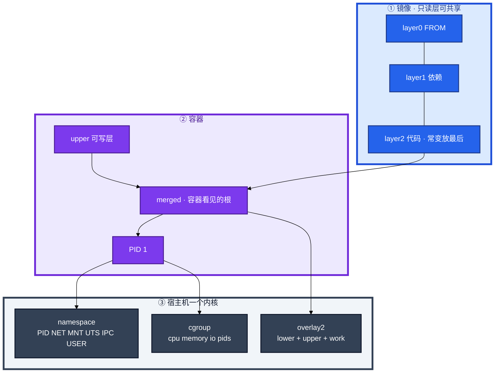
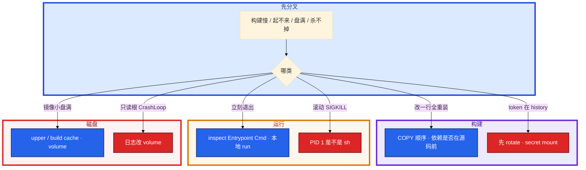

# Docker 深度


改一行大厅代码，CI 每次重跑 `go mod download`，构建从 40 秒变成 8 分钟。另一边滚动发布 SIGTERM 杀不掉进程，gracePeriod 30s 到了直接 SIGKILL，长连接硬拆。开服当天节点磁盘 100%，Harbor 里镜像只有 200MB——群里有人已经在 `docker rm -f` 一排业务容器当「清盘」。

**本章主线（排障就按这三步想）：**

1. **懂分层**：依赖在前、源码在后；一层变后面缓存全失效。
2. **看 PID 1**：SIGTERM / preStop / 宽限期，别当普通进程杀。
3. **清磁盘**：overlay2 upper 占盘；prune 前确认无运行中容器引用。

**读完你能：** 白板上画出只读层 + 可写层 + namespace/cgroup；改一行代码能判断缓存为何失效；会多阶段瘦身、BuildKit secret、overlay2 排障、镜像安全最低配。

## 本章目录

- [1. 基本概念](#1-基本概念)
- [2. 架构图](#2-架构图)
- [3. 原理](#3-原理)
- [4. 落地](#4-落地)
- [5. 核心配置](#5-核心配置)
- [6. 命令与操作](#6-命令与操作)
- [7. 生产排障](#7-生产排障)
- [8. 必会 · 常考](#8-必会--常考)
- [合上书](#合上书问自己)

**本章不讲：** digest 晋升、Harbor、禁 latest、扫描门禁细节 → [03](../03-制品与镜像/)；流水线何时 build → [02](../02-CI-CD/)；containerd / CRI / pause / 节点升级 → [04-16](../../04-Kubernetes/16-节点运行时与升级/)；cgroup 明细、逃逸链 → [02-07](../../02-基础底座/07-cgroup与容器/)；K8s 探针、preStop、terminationGracePeriod → [04-04](../../04-Kubernetes/04-Pod生命周期/)。

---

## 1. 基本概念

Docker 深度不是背指令表，是**镜像怎么叠、容器怎么隔离、盘满从哪来、信号为什么到不了进程**。K8s 用的是同一套镜像格式，运行时换成 containerd 不改变分层这件事。

**值班里怎么认现象**（先听 CI / 节点监控怎么说，再对表）：

| 群里/监控说的 | 技术含义 | 你的第一刀 |
|---------------|----------|------------|
| 「改一行代码构建 8 分钟」 | 层缓存失效，依赖层跟着重做 | COPY 顺序、`docker history` |
| 「滚动发布杀不掉进程」 | PID 1 不是业务进程 | `inspect` Path/Args |
| 「镜像 200MB 节点盘 100%」 | upper / build cache 膨胀 | `system df`、`du overlay2` |
| 「容器起来就 Exit 0/1」 | CMD/ENTRYPOINT 错或无前台进程 | 本地 `docker run --rm` |
| 「token 进了镜像层」 | secret 写进 ENV/COPY | 先 rotate，再 secret mount |

镜像不是一个大文件，是多层只读 tar 叠在一起。容器启动时在最上面加一层可写层（Copy-on-Write）。容器**不是**一台小虚拟机——共享宿主机内核；隔离靠 **namespace**（看见什么），限额靠 **cgroup**（能用多少）。

| 在镜像 / 容器里 | 不在本章、在别处 |
|-----------------|------------------|
| 层、Dockerfile、ENTRYPOINT/CMD、overlay2 upper | digest 晋升、Harbor 复制、禁 latest（03） |
| 单机 `docker run`、PID 1、BuildKit | kubelet / CRI / pause（04-16） |
| namespace 种类、cgroup 配额入口 | cgroup 文件排障链、逃逸（02-07） |

| 词 | 是什么 |
|----|--------|
| **镜像** | 只读层集合，用 digest 锁定（03） |
| **容器** | 镜像 + 可写层 + 一组 namespace/cgroup + 一个 PID 1 |
| **可写层 upper** | CoW；删容器文件只改这里 |
| **volume** | 绕过 union FS 的数据盘；日志 / 资源包应该走这里 |

**打个比方**：镜像像一摞透明胶片（只读层），容器是在最上面铺一张可擦写纸（upper）；你改一个字，不是改胶片，是在可擦写纸上盖一层。胶片还在，盘不一定回来。

> **记住**：某一层变了，它和后面所有层缓存失效，所以依赖在前、代码在后。容器里看到的是 merged 视图；删除容器文件只改 upper，镜像层还在，磁盘不一定回来。

**面试怎么说**：「Docker 是共享内核的进程隔离，不是 VM；排障我先 COPY 顺序、PID 1、overlay upper，不会只看镜像大小。」

---

## 2. 架构图

后面 Dockerfile、盘满、排障都对着这张图。



**读图三句话：**

1. **代码层变了，它后面的 RUN 全重做**——所以 `COPY go.mod` 在 `COPY . .` 前面。
2. **没有箭头从「镜像 200MB」指向「节点盘 100%」**——盘往往在 upper / build cache。
3. **PID 1 必须是业务进程（或 tini）**，否则 SIGTERM 进不了优雅退出。

Dockerfile 指令如何变成层：

```
  Dockerfile 指令          镜像只读层（可共享、可缓存）
  FROM alpine:3.20    →    [ layer 0 基础 ]
  RUN apk add ca-certs→    [ layer 1 ]
  COPY go.mod ...     →    [ layer 2 ]
  RUN go mod download →    [ layer 3 ]
  COPY . .            →    [ layer 4 ]     ← 代码常变，放最后
  容器启动            →    [ layer 4 ... 0 ] + [ 可写层 upper ]
```

---

## 3. 原理

### 3.1 层缓存：改一行代码，为什么 8 分钟

**一句话：** 一层变，它和后面所有层缓存失效；依赖必须排在源码前面。

**打个比方**：像做蛋糕——先筛面粉糖（依赖层），最后才裱花（代码层）。你只改裱花，前面的筛粉不用重做；要是先把整盆糊倒进去再筛粉，改一行裱花就得从头和面。

**现场走一遍**（CI 构建机，游戏逻辑服 Dockerfile 写反了）：

1. 先看当前 Dockerfile（坏写法：`COPY . .` 在 `go mod download` 前面）：

```dockerfile
FROM golang:1.22
WORKDIR /src
COPY . .
RUN go mod download
RUN CGO_ENABLED=0 go build -o server .
```

2. 改一行业务代码后构建：

```bash
DOCKER_BUILDKIT=1 docker build -t game-server:test .
```

3. 屏幕出现：

```text
 => [3/5] COPY . .                                    0.8s
 => [4/5] RUN go mod download                       412.3s
 => [5/5] RUN CGO_ENABLED=0 go build -o server .     68.1s
```

4. 改成正确顺序后，只改同一行代码再 build：

```dockerfile
COPY go.mod go.sum ./
RUN go mod download
COPY . .
RUN CGO_ENABLED=0 go build -o server .
```

5. 第二次构建输出：

```text
 => CACHED [3/6] COPY go.mod go.sum ./                0.0s
 => CACHED [4/6] RUN go mod download                  0.0s
 => [5/6] COPY . .                                      0.6s
 => [6/6] RUN CGO_ENABLED=0 go build -o server .       38.2s
```

**输出解读：**

| 行 | 含义 |
|----|------|
| `CACHED ... go mod download 0.0s` | 父层 go.mod 未变，412s 的下载跳过 |
| `COPY . . 0.6s` | 只有代码层重建，触发后面 build |
| 总时间 40s vs 480s | 差在一个 COPY 顺序 |

`.dockerignore` 不写，context 两 GB（`.git` / `node_modules`），Dockerfile 写得再好也要把构建机拖死，还可能把密钥打进层。游戏逻辑服：别把策划表、符号表打进层，开服拉镜像会把窗口吃掉（制品侧见 03）。

**面试怎么说**：「层缓存失效我看 build 日志哪步没 CACHED；依赖文件先 COPY 再 RUN install，源码放最后；COPY 优于 ADD，钉版本不用 latest。」

> **记住**：依赖文件先 COPY 再装；源码放最后。层变了，它后面全重做。

### 3.2 namespace / cgroup：容器不是 VM

**一句话：** namespace 管「看见什么」，cgroup 管「能用多少」；共享内核，逃逸面在内核。

**打个比方**：namespace 像给每个租户配独立门牌号和窗户（进程号、网卡、挂载）；cgroup 像电表水表限额。租户共用同一栋大楼的地基（内核）——地基塌了，所有租户一起完蛋。

**现场走一遍**（节点上怀疑「容器里 free 和 limit 对不上」）：

1. 启动带内存限制的容器：

```bash
docker run -d --name lobby --memory=512m --cpus=1 game-server:v1
```

2. 进容器看「以为的」内存：

```bash
docker exec lobby free -h
```

3. 屏幕出现：

```text
              total        used        free
Mem:           62Gi        18Gi        44Gi
```

4. 在宿主机看真实 cgroup 限额：

```bash
docker inspect lobby --format '{{.HostConfig.Memory}}'
cat /sys/fs/cgroup/system.slice/docker-$(docker inspect -f '{{.Id}}' lobby).scope/memory.max 2>/dev/null || \
  find /sys/fs/cgroup -path '*docker*lobby*' -name memory.max 2>/dev/null | head -1 | xargs cat
```

5. 输出：

```text
536870912
536870912
```

**输出解读：**

| 字段 | 含义 |
|------|------|
| 容器内 `free` 62Gi | 读的是宿主机 `/proc`，**撒谎** |
| `536870912` 字节 | = **512MB**，这才是硬上限 |
| 超了会怎样 | OOM kill 容器内进程，不一定有整机 OOM 行 |

六个常见 namespace：PID（进程号空间）、NET（网卡/端口）、MNT（挂载）、UTS（hostname）、IPC、USER（**很多生产默认没开**）。cgroup 管 CPU throttle、内存 OOM、pids fork 失败。Go `GOMAXPROCS`、Java GC 按容器内 `nproc` 配会被 throttle 死——详细文件路径去 02-07，K8s request/limit 去 04-04。

**面试怎么说**：「容器共享宿主机内核，隔离不如 VM；容器里 free 不可信，真配额在 cgroup；USER ns 很多生产没开，镜像仍要 nonroot，高安全用 VM/Kata。」

### 3.3 overlay2：镜像小、盘满

**一句话：** merged 是容器看见的根；盘满先看 upper 和 build cache，不是镜像 tag 大小。

**打个比方**：镜像层像图书馆书架上的书（只读、可多人借阅）；upper 像每人领的便签本——你在便签上涂改，书架上的书还在；便签堆厚了，抽屉（节点盘）就满了。

**现场走一遍**（开服日节点 `/var` 100%，Harbor 显示镜像 200MB）：

1. 看 Docker 占用摘要：

```bash
docker system df
```

2. 屏幕出现：

```text
TYPE            TOTAL     ACTIVE    SIZE      RECLAIMABLE
Images          47        12        8.2GB     3.1GB (37%)
Containers      18        8         2.1GB     890MB (42%)
Local Volumes   6         2         1.4GB     800MB (57%)
Build Cache     0         0         24GB      24GB
```

3. 找哪个 upper 膨胀：

```bash
du -xhd1 /var/lib/docker/overlay2 | sort -h | tail -5
```

4. 输出：

```text
4.0K    /var/lib/docker/overlay2/l
18G     /var/lib/docker/overlay2/abc123.../diff
18G     /var/lib/docker/overlay2
```

5. 对上容器（游戏服在容器里下了完整资源包）：

```bash
docker ps --format '{{.Names}} {{.ID}}' | grep gamesvr
docker inspect gamesvr-3 --format '{{.GraphDriver.Data.UpperDir}}'
```

**输出解读：**

| 字段 | 含义 |
|------|------|
| Build Cache **24GB** | CI 构建残留，prune 可回收 |
| 单个 upper **18G** | 容器可写层写了大文件（资源包/日志） |
| 镜像 200MB | 只读层大小，**解释不了** 18G upper |

CoW：改下层大文件会先拷到 upper 再改。容器里 `rm` 镜像带来的文件：只在 upper 记 **whiteout**，下层还在，镜像不会变小。删容器 ≠ 立刻收回镜像层；悬空镜像、build cache 要 prune。资源包走 volume / CDN，K8s imagefs / eviction 在 04-16。

**面试怎么说**：「盘满我先 system df 分 Images/Containers/Build Cache，再 du overlay2 找 upper；游戏资源不要写可写层，用 volume。」

> **记住**：merged 是容器看见的根；磁盘满先看 upper 和 build cache，不是只看镜像大小。

### 3.4 PID 1 与信号：滚动发布 SIGKILL

**一句话：** exec 形式让业务当 PID 1；shell 形式 PID 1 是 sh，SIGTERM 到不了 app。

**打个比方**：K8s 滚动更新像通知店长关门（SIGTERM）。若店长其实是前台实习生（`/bin/sh -c`），通知到了前台，后厨还在炒菜——30s 宽限期一到保安直接拉闸（SIGKILL）。

**现场走一遍**（大厅服滚动更新，长连接硬断）：

1. 看镜像启动命令（shell 形式，有问题）：

```bash
docker inspect lobby-old --format 'Entrypoint={{json .Config.Entrypoint}} Cmd={{json .Config.Cmd}}'
```

2. 输出：

```text
Entrypoint=null Cmd=["/bin/sh","-c","/server --config /etc/server.yaml"]
```

3. 容器内看 PID 1：

```bash
docker exec lobby-old ps -o pid,comm,args
```

4. 屏幕出现：

```text
  PID COMMAND         ARGS
    1 sh              /bin/sh -c /server --config /etc/server.yaml
   12 server          /server --config /etc/server.yaml
```

5. 模拟停止（gracePeriod 30s 后 SIGKILL，见 04-04）：

```bash
time docker stop -t 30 lobby-old
```

6. 输出：

```text
lobby-old
real    0m30.012s
```

7. 改成 exec 形式后重建：

```dockerfile
ENTRYPOINT ["/server"]
CMD ["--config", "/etc/server.yaml"]
```

8. 再 stop：

```text
lobby-new
real    0m2.341s
```

**输出解读：**

| 现象 | 含义 |
|------|------|
| PID 1 是 `sh` | SIGTERM 给 shell，**server 收不到** |
| stop 刚好 30s | 宽限期耗尽 → SIGKILL，连接硬拆 |
| exec 形式 2.3s | server 当 PID 1，优雅 drain 后退出 |

ENTRYPOINT 是可执行文件，CMD 是默认参数；`docker run 镜像 args` 替换 CMD，不替换 ENTRYPOINT。K8s `command` 换二进制，`args` 换 CMD。需要壳用 `tini` / `dumb-init`。容器立刻退出：先 `docker logs` + 本地 `docker run --rm`，先别怪 kubelet。

**面试怎么说**：「滚动杀不掉我先 inspect Entrypoint/Cmd 看 PID 1 是不是 sh；生产用 JSON exec 形式；宽限期 30s 超时 SIGKILL 是 04-04，根因常在镜像。」

> **记住**：ENTRYPOINT 是可执行文件，CMD 是默认参数；生产用 exec 形式让业务当 PID 1。

---

## 4. 落地

### 4.1 生产怎么选

| 项 | 选 | 不选 |
|----|----|------|
| 基础镜像 | distroless / alpine / slim，**钉 digest** | `python:latest`、full JDK 当 runtime |
| 构建 | 多阶段 + BuildKit | 编译器打进运行镜像 |
| 用户 | `USER 1000` / nonroot | 容器 root + `--privileged` |
| 密钥 | secret mount；运行时 K8s Secret | `ENV TOKEN=`、`COPY .npmrc` |
| 数据 | volume / emptyDir | 可写层当下资源盘 |
| 运行时 | 生产 K8s 用 containerd（04-16） | 业务 Worker 上 DinD 给不可信 PR |

### 4.2 镜像落地你实际看到什么

验收：进程在不算数。必须能说出 PID 1 是谁、`docker history` 没有 token、runtime 阶段没有 compiler。

```dockerfile
FROM golang:1.22 AS builder
WORKDIR /src
COPY go.mod go.sum ./
RUN go mod download
COPY . .
RUN CGO_ENABLED=0 go build -o server -ldflags="-s -w" .

FROM gcr.io/distroless/static:nonroot
COPY --from=builder /src/server /server
USER nonroot
ENTRYPOINT ["/server"]
```

| 基础镜像 | 特点 |
|----------|------|
| distroless | 只有运行时，无 shell / 包管理器，最小最硬；调试用 debug 变体 |
| alpine | 小，musl libc 可能和 C 扩展不兼容 |
| slim | 折中 |
| full | 开服拉不动，不要当 runtime |

800MB → slim 约 **150MB** → distroless + 多阶段常到 **10–20MB**。Go 用 `-ldflags="-s -w"` 去调试符号。200 节点同时 pull 时体积就是窗口。多阶段后还 1GB：数据 / 符号表 / 缓存拷进了 runtime，用 dive 看层。制品晋升仍用 digest（03），生产引用优先 `@sha256:...`。

---

## 5. 核心配置

只动有证据的项。

| 项 | 生产怎么用 | 改错会怎样 |
|----|------------|------------|
| `COPY` 顺序 | 依赖文件先、源码最后 | 改一行全重装 |
| ENTRYPOINT/CMD | JSON 数组 exec | PID 1 是 sh，滚动 SIGKILL |
| `USER` | 非 0 | 逃逸面大；USER ns 默认还可能没开 |
| BuildKit secret | `--mount=type=secret` | token 进层，删 tag digest 还在 |
| cache mount | go/npm 缓存不进层 | 每次 CI 冷启动 |
| `.dockerignore` | 丢掉 `.git` / `node_modules` | context 2GB、密钥进层 |
| `readOnlyRootFilesystem` | 日志走 volume | CrashLoop 或 upper 打满盘 |
| `--privileged` / docker.sock | 不可信流水线禁止 | 宿主机 root |

BuildKit 示例：

```dockerfile
# syntax=docker/dockerfile:1
FROM golang:1.22
RUN --mount=type=cache,target=/root/.cache/go-build \
    --mount=type=cache,target=/go/pkg/mod \
    go build -o server .

RUN --mount=type=secret,id=npmrc,target=/root/.npmrc \
    npm install
```

`DOCKER_BUILDKIT=1`（现代 Docker 默认开）。cache mount 加速、secret mount 保密钥；token 进层先 **rotate**。

> **记住**：BuildKit 的 cache mount 加速、secret mount 保密钥；token 进层先 rotate。

---

## 6. 命令与操作

### 6.1 命令速查

```bash
docker history <image>
docker inspect <cid> --format '{{.Path}} {{json .Args}} {{.State.Pid}}'
docker logs <cid>
docker run --rm --name t <image>
docker system df
du -xhd1 /var/lib/docker/overlay2
docker buildx build --platform linux/amd64,linux/arm64 -t game-server .
```

| 目的 | 命令 | 看什么 |
|------|------|--------|
| 哪层胖 / 哪层总重建 | `docker history` / `dive` | compiler、token、COPY data |
| PID 1 | `inspect` Path/Args；容器内 `ps` | 是 `/server` 还是 `/bin/sh` |
| 立刻退出 | `logs` + 本地 `docker run --rm` | 退出码，先别怪 kubelet |
| 磁盘 | `system df` | Images / Containers / Build Cache |
| overlay 膨胀 | `du -xhd1 .../overlay2` | 哪个 upper 几十 GB |
| 清理 | `image prune` / `container prune` / build cache | 删容器不等于盘回来 |

值班先跑这四条：

```bash
docker inspect <cid> --format 'Pid1={{.Path}} Args={{json .Args}}'
docker logs <cid> --tail=100
docker system df
docker history <image> | head
```

### 6.2 写 Dockerfile

```dockerfile
# 差：每条 RUN 一层，apt 缓存留在层里；COPY . 过早
FROM ubuntu
RUN apt-get update
RUN apt-get install -y python3 python3-pip
COPY . /app
RUN pip install -r /app/requirements.txt
CMD ["python3", "/app/main.py"]

# 好：钉版本、合并 RUN、先依赖后代码
FROM python:3.12-slim
WORKDIR /app
COPY requirements.txt .
RUN pip install --no-cache-dir -r requirements.txt
COPY . .
CMD ["python3", "main.py"]
```

### 6.3 多阶段瘦身

编译工具链不能进运行镜像。怎么把 800MB 砍到 20MB：distroless/alpine 替代 full → 多阶段只拷二进制 → 合并 RUN 清缓存 → Go `-ldflags="-s -w"` → `.dockerignore` → dive 找数据/符号表。alpine 上 Python C 扩展挂了：musl 兼容问题，换 slim。

### 6.4 镜像安全最低配

| 项 | 做 | 不做 |
|----|----|------|
| 基础镜像 | 可信源 + 钉 digest + 扫描阻断 | 来路不明、latest |
| 用户 | 非 root | 默认 root 当生产 |
| 文件系统 | 只读根 + volume 写数据 | 可写层下资源包 |
| 密钥 | BuildKit secret；运行时 Secret | 层里 token、kubeconfig |
| 权限 | 最小 capabilities | `--privileged`、挂 docker.sock 给 PR |

不可信流水线 DinD / `docker.sock` = 宿主机 root。fork PR 构建尤其危险（08）。

### 6.5 只读根与 volume

只读根是为了不让进程改系统层。日志、临时文件、热更落 **volume / emptyDir**，不要写 upper。安全要求 `readOnlyRootFilesystem` 时 CrashLoop，先找谁在写 `/`。

---

## 7. 生产排障

三问：进程还在不在？还能不能变更？已有流量还通不通？**CrashLoop 先本地 `docker run` 同一镜像，再把锅甩给 kubelet。**



| 现象 | 先做什么 | 不要做什么 |
|------|----------|------------|
| 改一行代码全重装依赖 | COPY 顺序，依赖是否在源码前 | 乱合并所有 RUN |
| 滚动杀不掉进程 | PID 1 是不是 sh，改 exec 形式 | 先加长 gracePeriod 当根治 |
| 容器立刻退出 | inspect + 本地 docker run | 先怪 kubelet |
| 节点盘满镜像却很小 | upper 和 build cache | 只看镜像 200MB |
| token 进了层 | 先 rotate，重建重部 | 只删 tag |
| 容器里 rm 文件盘不降 | whiteout，下层还在 | 当镜像变小了 |
| `--privileged` DinD 给 PR | 关掉 | 当构建方便 |

现场：`inspect` PID 1 → `logs` → `system df` → `history`。节点运行时是 04-16，本章停在镜像和单机行为。

---

## 8. 必会 · 常考

| 说法 | 对错 | 口径 |
|------|:----:|------|
| 镜像是一个大文件 | 错 | 多层只读 tar + 容器可写层 |
| 层越少镜像一定越小、构建一定更快 | 错 | 乱合并会让改一行也重装依赖 |
| ENTRYPOINT 和 CMD 没区别 | 错 | 可执行文件 vs 默认参数；args 换 CMD |
| shell 形式也能优雅退出 | 错 | PID 1 是 sh，SIGTERM 常到不了 app |
| 容器和 VM 隔离一样强 | 错 | 共享内核；逃逸面在内核 |
| USER namespace 默认一定开着 | 错 | 很多生产没开；非 root 仍要做 |
| 删容器磁盘就会回来 | 错 | 只改 upper；镜像层和 cache 还在 |
| 容器里 rm 了镜像里的文件，镜像变小 | 错 | 只记 whiteout |
| 节点盘满先怪镜像太大 | 错 | 先看 upper / build cache |
| `ENV NPM_TOKEN` 构建完就没事 | 错 | 进层；删 tag digest 还在；先 rotate |
| CrashLoop 先查 kubelet | 错 | 先本地 docker run 同一镜像 |
| distroless 没 shell 就该装回 bash | 错 | debug 变体 / stdout；别装回生产 |
| 可写层可以当游戏资源盘 | 错 | volume / CDN |
| `--privileged` 给 CI 提速可以 | 错 | 不可信流水线 = 宿主机 root |

数字：800MB → slim **~150MB** → distroless 多阶段 **10–20MB**；gracePeriod 常见 **30s**（超时 SIGKILL 在 04-04）；开服 200 节点同时 pull 体积就是窗口。

易混：COPY vs ADD；ENTRYPOINT vs CMD vs K8s command/args；upper vs 镜像大小；namespace 视图 vs cgroup 配额；cache mount vs 层缓存；secret mount vs K8s Secret。

---

## 合上书，问自己

1. 某一层变了后面怎样？为什么 COPY requirements 要在 COPY . 前面？
2. 六个常见 namespace 各隔离什么？cgroup 和 namespace 差在哪？`free` 可信吗？
3. overlay2 四元组？盘满先看哪？容器里 rm 镜像文件会怎样？
4. ENTRYPOINT / CMD 谁被 docker run 换掉？PID 1 是 sh 会怎样？
5. 800MB 怎么瘦到 20MB？token 进层先做什么？
6. 镜像安全最低配哪几条？只读根日志写哪？

六题都能口述，这一章就过了。下一章把 GHA / GitLab 的 YAML、密钥作用域和自托管 runner 剖开：fork PR 为什么默认不该拿到 kubeconfig。
