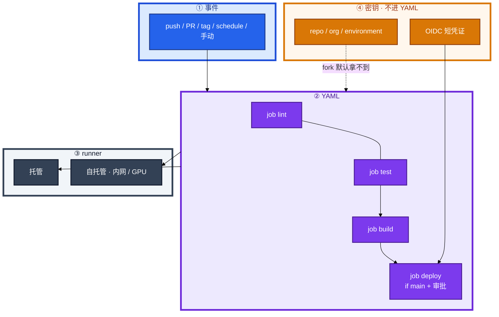
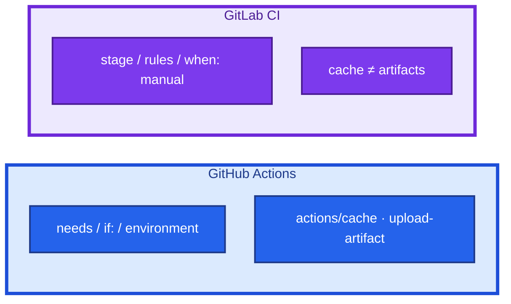
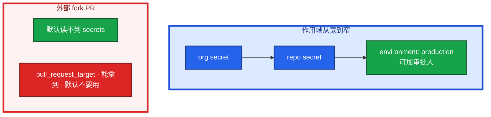
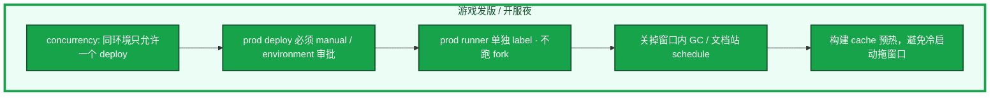
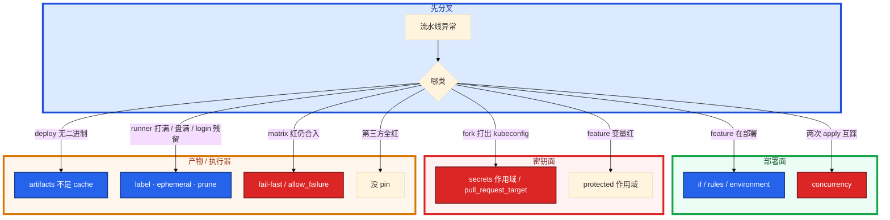

# GitHub Actions 与 GitLab CI


fork 出来的 PR 把生产 kubeconfig 跑进日志了。feature 分支的 deploy job 也在跑。开服夜 30 个 workflow 同时打到同一台 `self-hosted`，上一 job 的 `docker login` 还在。

先别动手。这一章后半全是你会动手的：**怎么写 if/rules、怎么拆密钥、怎么拆 runner、发版夜怎么冻。** 前面的概念和对照表，是为了让你动手时不把 02 的门禁设计整段抄过来。

**读完你能：** 白板上画出事件 → job → runner → secrets；fork PR 能判断该不该有密钥；会 cache vs artifacts、matrix 失败口径、发版值班 concurrency。

## 本章目录

缩进 = 上下级。3 下面才是 3.1。

想钉在**正文左边**跟着滚：菜单 **查看 → 打开视图 → 大纲**。Markdown 预览做不到独立左栏，目录只能写在文章开头。

- [1. 基本概念](#1-基本概念)
- [2. 架构图](#2-架构图)
- [3. 原理](#3-原理)
  - [3.1 job 依赖与 matrix](#31-job-依赖与-matrix)
  - [3.2 密钥作用域](#32-密钥作用域)
  - [3.3 cache vs artifacts](#33-cache-vs-artifacts)
  - [3.4 自托管 runner](#34-自托管-runner)
- [4. 安装部署](#4-安装部署)
  - [4.1 生产怎么选](#41-生产怎么选)
  - [4.2 YAML 落地你实际看到什么](#42-yaml-落地你实际看到什么)
- [5. 核心配置](#5-核心配置)
- [6. 常用命令](#6-常用命令)
- [7. 常用操作](#7-常用操作)
  - [7.1 main 才部署](#71-main-才部署)
  - [7.2 密钥与 fork PR](#72-密钥与-fork-pr)
  - [7.3 cache / matrix](#73-cache--matrix)
  - [7.4 发版值班](#74-发版值班)
  - [7.5 pin action / include](#75-pin-action--include)
  - [7.6 和 Jenkins 怎么选](#76-和-jenkins-怎么选)
- [8. 生产排障](#8-生产排障)
- [9. 必会 · 常考](#9-必会--常考)
- [合上书](#合上书问自己)

**本章不讲：** 阶段设计、金丝雀 SLI、digest 晋升、DORA → [02](../02-CI-CD/)；Harbor、扫描、禁 latest → [03](../03-制品与镜像/)；Git 分支保护、revert → [01](../01-Git工作流/)；GitOps sync → [04-22](../../04-Kubernetes/22-GitOps-ArgoCD与Tekton/)；Jenkins Master 队列、K8s 弹性 Agent 细节 → [02](../02-CI-CD/)；开服冻结流程、升级路径 → [06](../06-运维平台与Oncall/)。

---

## 1. 基本概念

GitHub Actions 和 GitLab CI 都是 **和 Git 仓长在一起的声明式 YAML**。Jenkins 是独立服务器 + Groovy。新建仓优先前者；混合 VM / 遗留插件才留 Jenkins（对照见 02，这里不展开 Master 队列）。

四个名词（GHA）：

| 概念 | 是什么 |
|------|--------|
| **workflow** | 一个流程，YAML 在 `.github/workflows/` |
| **job** | 一组步骤，默认互相并行，`needs` 才串行 |
| **step** | `run` 命令或 `uses` 一个 action |
| **runner** | 执行环境；`runs-on` |

GitLab 对应：pipeline ← stages ← job；脚本在 `script:`；复用是 `include` / template，不是 marketplace action。

触发：push / PR / schedule / 手动 / tag。不要把 02 的「E2E 后置到 staging」整段搬来——那是设计；这里用 `paths` / `rules: changes` 落地。

> **记住**：job 默认并行，要串行必须写 `needs` 或 stage。密钥不进 YAML；fork PR 默认不该拿到生产 kubeconfig。

---

## 2. 架构图

先把整张图钉住。后面密钥、runner、发版值班都对着这张图说话。



图上三条线：

1. **没有箭头从 fork PR 指向 prod secrets**——默认如此是特性。
2. **deploy 必须有 if/rules + environment / manual**——YAML 漏一行，feature 就上生产。
3. **产物走 artifacts，依赖加速走 cache**——口误会让 deploy 找不到二进制。

GHA vs GitLab 对照（装的时候选，挂的时候查不同字段）：



常见组合：仓内 YAML 跑 lint / 单测 / build；重型 Ansible / 多系统编排仍走 Jenkins；落地 GitOps。本章负责 YAML 和 runner 不把密钥漏出去；02 负责门禁和 digest 晋升。CD 仍只留一条。

---

## 3. 原理

原理只保留动手和面试会用到的：为什么 feature 会部署、fork 为什么不该有密钥、cache 丢了 deploy 为什么没有二进制、自托管为什么会被打满。

**本节 4 块：** 3.1 job/matrix · 3.2 密钥 · 3.3 cache/artifacts · 3.4 runner

### 3.1 job 依赖与 matrix

同一 job 内 step **串行**。多个 job **默认并行**；`needs` 声明依赖。GitLab 用 `stage` 顺序，同 stage 并行。一个 step 失败后面默认停。`continue-on-error` / `allow_failure` 给通知类 job，不给测试和扫描。Critical 扫描要失败 pipeline（03 / 02）。

`strategy.matrix` 做多版本 / 多 OS / 多区服并行。默认 fail-fast：一个矩阵失败会取消其它。`fail-fast: false` 只让其它维度跑完，**job 仍应失败**，不能拿来合红 MR。`max-parallel` 防止把自托管打满。GitLab 同 stage 多个 job，一个失败默认失败 pipeline（除非 `allow_failure`）。

`if:` 限制「只有 main 才 deploy」，避免 feature 分支走生产。GitLab `rules:` 替代旧 `only:`。path filter（monorepo）：`on.push.paths` / `paths-ignore`；GitLab `rules: changes`。公共模块变更要列进 `changes`，否则依赖方不测。宁可多跑公共路径，不要漏。

OIDC 短周期凭证优于 Secrets 里长期 AK；长期 kubeconfig 必须配 environment 审批。

> **记住**：main 才 deploy 写在 `if:` + environment；YAML 漏了这一行，feature 就会上生产。

### 3.2 密钥作用域

密钥配在仓库 / org Settings → Secrets，workflow 里 `${{ secrets.NAME }}`。日志会脱敏，但 `echo` 到文件、打进镜像层仍会漏。不要写进 YAML。



按环境拆密钥：staging 密钥碰不到 prod。轮换：Settings 改值，下次运行用新的；泄漏则源头 IAM 一起 disable。org 级 secret 权限要收紧，不是每个 fork 都能用。能读 prod kubeconfig 的仓越少越好。

GHA `GITHUB_TOKEN` 默认权限近年收紧，仍要检查 workflow 有没有 `permissions: write-all`。

GitLab：masked + **protected**（仅保护分支）。feature 分支 CI 红不一定是写错，可能是变量作用域。protected variables 在非保护分支读不到。

自托管 runner 上跑 fork PR = 任意代码在你内网执行。需要审批才跑带密钥的 job。

> **记住**：fork PR 默认无 secrets 是特性不是 bug；`pull_request_target` 和自托管上跑 fork 代码都是投毒面。

### 3.3 cache vs artifacts

| | GitHub Actions | GitLab CI |
|--|----------------|-----------|
| 文件 | `.github/workflows/*.yml` | `.gitlab-ci.yml` |
| 串行 | `needs` | `stage` 顺序；同 stage 并行 |
| 产物 | `upload-artifact` | `artifacts`（过期要设） |
| 依赖缓存 | `actions/cache` | `cache`（和 artifacts 不是一回事） |
| 人闸 | `environment` 审批 / `workflow_dispatch` | `when: manual` |
| 变量 | Secrets + Variables | masked + **protected** |

口误：`cache` 用来加速依赖，丢了可以再下；`artifacts` 是 job 间要传递的构建产物，过期或没声明，deploy job 就没有二进制。不要把镜像 tar 当无限 artifacts，产物进 Harbor（03）。`expire_in` 要写，否则堆满磁盘。

GHA cache `key:` 常用 `${{ runner.os }}-go-${{ hashFiles('**/go.sum') }}`。key 漂 = 永远不命中；key 太粗 = 串环境、甚至 **cache poisoning**（不可信 PR 写入的 cache 被 main 用）。fork PR 写 cache 要谨慎。restore-keys 是前缀回退，命中的可能是旧依赖，不是 bug。

GitLab `cache.key: ${CI_COMMIT_REF_SLUG}` 按分支；prod 不要去用 feature 的 cache 当二进制。

### 3.4 自托管 runner

托管 runner 进不了内网 Harbor / 内网 K8s。自托管：机器上装 `actions/runner`，注册到仓或 org，`runs-on: self-hosted` 或自定义 label。为什么要：内网、GPU、合规（代码不离开）、额度。

```
  1. 要自己升级、看是否在线、清 workspace
  2. runner 能跑 workflow 里任意命令 → 限制谁能改 YAML
  3. fork PR 不要落到能碰 prod 密钥的 runner
  4. 生产 / 测试 runner 分开，label 分开
  5. 并发打满：队列、CPU、磁盘； ephemeral runner（用完销毁）减少残留
  6. 不要在 runner 上长期 docker login 残留
```

GitLab 的 `gitlab-runner` 同类：tag 选 runner，`privileged` / DinD 默认关。共享 runner 和项目专用 runner 权限不同。ephemeral 用完销毁，比在 job 末尾 `rm -rf` workspace 更干净。不同项目不同 runner / 不同 Linux 用户。磁盘：prune 构建缓存（07），限制并发。这是 runner 卫生，和 02 的「Agent 用完即毁」是同一运维理由，落点在 GHA/GitLab 的执行器上。

> **记住**：自托管是为了进内网；prod 和测试分开，fork 代码不要上 prod runner，用完销毁。

---

## 4. 安装部署

### 4.1 生产怎么选

| 项 | 选 | 不选 |
|----|----|------|
| 新仓 | GHA / GitLab CI | 一刀切迁走已验证的 Jenkinsfile |
| 密钥 | environment 拆 + OIDC | YAML 明文、长期 AK、fork 可读 prod |
| runner | prod/test label 分开，ephemeral | 一台 self-hosted 跑全部含 fork |
| 部署 | `if:` / `rules` + 人闸 | 所有分支 kubectl apply |
| action | pin tag 或 SHA | `uses: ...@main` |
| 发版夜 | concurrency + 冻结 workflow | schedule 在窗口里 GC 镜像 |

新建、在 GitHub / GitLab 上、想免养 CI 服务器 → Actions / GitLab CI。已有 Jenkinsfile、遗留插件、混合 VM → 继续 Jenkins。趋势是新仓用 YAML，存量按仓迁移，不是一刀切。Actions 替代不了：特殊硬件上的固定 Agent、老插件、已经验证过的 Shared Library。可以 YAML 做 CI、Jenkins 做重型 job，但不要双 apply。

### 4.2 YAML 落地你实际看到什么

```yaml
# .github/workflows/ci.yml
name: CI
on:
  push: { branches: [main] }
  pull_request:
  schedule:
    - cron: "0 2 * * *"
  workflow_dispatch:

jobs:
  build:
    runs-on: ubuntu-latest
    steps:
      - uses: actions/checkout@v4
      - uses: actions/setup-go@v5
        with: { go-version: "1.22" }
      - uses: actions/cache@v4
        with:
          path: ~/go/pkg/mod
          key: ${{ runner.os }}-go-${{ hashFiles('**/go.sum') }}
      - run: go test ./...
      - run: docker build -t harbor.example.com/app:${{ github.sha }} .

  deploy:
    needs: build
    if: github.ref == 'refs/heads/main'
    runs-on: ubuntu-latest
    environment: production
    steps:
      - env:
          KUBECONFIG: ${{ secrets.KUBECONFIG }}
        run: ./deploy.sh ${{ github.sha }}
```

```yaml
# .gitlab-ci.yml
stages: [build, test, deploy]

build:
  stage: build
  image: golang:1.22
  rules:
    - if: $CI_COMMIT_BRANCH
      changes: [src/**/*, go.mod]
  script:
    - go build -o server .
    - docker build -t game-server:$CI_COMMIT_SHA .
  artifacts:
    paths: [server]
    expire_in: 1 day
  cache:
    key: ${CI_COMMIT_REF_SLUG}
    paths: [go-pkg/]

test:
  stage: test
  script: go test ./...

deploy:
  stage: deploy
  script: ./deploy.sh $CI_COMMIT_SHA
  rules:
    - if: $CI_COMMIT_BRANCH == "main"
      when: manual
  environment:
    name: production
```

验收：feature 分支没有 deploy；fork PR 没有 prod secrets；`artifacts` 声明了 paths 和过期。不要只看流水线绿。tag 发布：`on.push.tags` / `CI_COMMIT_TAG` 另写 job，仍要同一 digest 晋升（02 / 03）。这是语法落地；「生产要不要自动 Deployment」是 02 的设计题，这里不要展开 DORA。

---

## 5. 核心配置

只动有证据的项。

| 项 | 生产怎么用 | 改错会怎样 |
|----|------------|------------|
| `if:` / `rules` | 仅 main（或 tag）deploy | feature 上生产 |
| `environment` | prod 审批人 | 密钥环境混用 |
| `permissions` | 最小；禁止 `write-all` | GITHUB_TOKEN 过宽 |
| cache `key` | os + hashFiles | 永不命中或串环境 / poisoning |
| `artifacts.expire_in` | 必须写 | 磁盘满；过期后 deploy 无文件 |
| `fail-fast: false` | 只让矩阵跑完 | 拿来合红 = 跳过门禁 |
| `concurrency` | 发版夜同组取消旧 run | 两次 apply 互踩 |
| action `uses` | pin SHA / tag | marketplace 一更新全仓变 |
| `pull_request_target` | 默认不用 | fork 拿到 secrets |
| GitLab `protected` | 仅保护分支 | 误判 YAML 写错 |

include / 扩展：公共模板 pin 版本，和 Jenkins Shared Library 同一类事故（不 pin 全红）。官方 action pin 大版本常见；高敏感仓 pin SHA 并开 dependabot 更新。第三方 action = 在你的 runner 上跑别人的代码。生产只引内部或审计过的。

> **记住**：cache 加速、artifacts 传产物；protected 变量只在保护分支；main 部署用 rules + manual。

---

## 6. 常用命令

平台在 UI 里跑，值班对的是 YAML 和 runner 状态，不是本机二进制。先这四条：

```
1. 这条 run 的 ref 是不是 main？deploy 的 if / rules 是什么？
2. secrets 来自哪个 environment？fork / pull_request_target 没有？
3. artifacts 声明了吗？cache 有没有被当成产物？
4. runner label：prod 还是 test？是否 ephemeral？是否 Busy / 盘满？
```

| 目的 | 看什么 |
|------|--------|
| feature 在部署 | `on.push.branches`、deploy `if:`、GitLab `rules` |
| fork 打出 kubeconfig | secrets 作用域、`pull_request_target` |
| deploy 找不到 `./server` | artifacts paths / expire_in |
| feature CI 红 | protected 变量作用域 |
| runner 打满 | label、并发、ephemeral、overlay（07） |
| matrix 一个红仍合入 | fail-fast / allow_failure |
| 第三方全红 | 没 pin，pin 回 SHA |

`workflow_dispatch` / `when: manual` 是人闸。开服夜误触 schedule GC：先 disable 那个 workflow，再谈 03 的 GC 策略。

---

## 7. 常用操作

### 7.1 main 才部署

GHA：`if: github.ref == 'refs/heads/main'` + `environment: production`（审批）或 `workflow_dispatch`。GitLab：

```yaml
deploy:
  stage: deploy
  script: ./deploy.sh $CI_COMMIT_SHA
  rules:
    - if: $CI_COMMIT_BRANCH == "main"
      when: manual
```

YAML 漏了这一行，feature 就会上生产。`environment: production` 没配审批人等于没闸。

### 7.2 密钥与 fork PR

外部贡献者 fork 了仓库，改 workflow 把 `${{ secrets.KUBECONFIG }}` echo 到构建产物。如果这条 PR 能读 secrets，生产 kubeconfig 就出去了。

默认不能读 secrets。需要审批才跑带密钥的 job。`pull_request_target` 能拿到 secrets，也更容易被投毒——默认不要用。泄漏：改 Settings + 源头 rotate。

### 7.3 cache / matrix

构建用 cache 加速 go/npm；deploy 用 artifacts 传 `server`。matrix 测 Go 1.21 / 1.22：1.21 红了，`fail-fast: false` 只让 1.22 跑完，整次仍应红。`max-parallel` 开服夜压住自托管。游戏多区服构建用 matrix `server_id`，不要 30 个 workflow 各打一台 runner。

### 7.4 发版值班

流程冻结、升级路径在 06。本章把 **YAML 和 runner 焊死**，避免发版夜自己踩自己。



| 做 | 不做 |
|----|------|
| `concurrency` 取消旧的未完成 deploy，避免两次 apply 互踩 | 窗口里并行两路 prod apply |
| 镜像预拉 / Harbor digest 已在本机房（03）再点 manual | Harbor 复制没完就切流 |
| 告警切到当天在职 Owner（06） | 失败 workflow 只打离职账号 |
| matrix / 并发上限，别打满唯一 self-hosted | 30 个 workflow 无队列 |
| path filter：改文档不要跑完整发版流水线 | 改 README 触发 40 分钟 E2E 挡窗口 |

开服日冻结未拦截是平台问题（06）；YAML 仍能在冻结窗口被 `workflow_dispatch` 点出去 = 本章没做成。environment 保护规则要和变更系统一起拒。

### 7.5 pin action / include

`uses: some-org/deploy@main`：某天 supply chain 被换，生产 kubeconfig 在构建机上。GitLab `include: remote:` 同样没 pin。pin 到 tag 或 SHA。不 pin = 下次 marketplace 一更新，全仓构建机行为变了，和 Jenkins Shared Library 不 pin 同一类事故。

### 7.6 和 Jenkins 怎么选

| 维度 | GHA / GitLab CI | Jenkins |
|------|-----------------|---------|
| 集成 | 和 Git 一体 | 独立系统要对 webhook |
| 定义 | 声明式 YAML | Groovy Jenkinsfile |
| 维护 | 托管免维护服务器 | 要养 Master |
| 执行器 | 托管或自托管 runner | 自管 Agent |
| 适合 | 云原生、对应平台的仓 | 混合 VM、遗留插件 |

新建项目优先 Actions / GitLab CI。已有大量 Jenkinsfile、特殊插件，继续用，CD 仍只留一条（02）。不是一刀切迁移。

---

## 8. 生产排障

**YAML 漏 if 和密钥投毒，都不是「再加一台 runner」能修的。**



| 现象 | 先做什么 | 不要做什么 |
|------|----------|------------|
| feature 上了 prod | `if:` / `rules` / environment | 先加 runner |
| fork 打出 kubeconfig | secrets、`pull_request_target` | 当日志脱敏就没事 |
| deploy 找不到产物 | artifacts 声明 / 过期 | 把 cache 当二进制 |
| 自托管打满 / 上一 job 密码还在 | label 拆开、ephemeral、OIDC | 长期 docker login |
| matrix 一个红仍合入 | job 必须红 | 拿 fail-fast: false 当成功 |
| 改文档跑 40 分钟 E2E | paths / changes | 先买 runner |
| 发版夜两个 deploy | concurrency | 再点一次 manual |

现场：ref → if/rules → secrets 作用域 → artifacts → runner label。磁盘满见 07 overlay / cache prune。

---

## 9. 必会 · 常考

白板和追问高频，能一口回：

| 说法 | 对错 | 口径 |
|------|:----:|------|
| job 默认按 YAML 从上到下串行 | 错 | 默认并行，`needs` / stage 才串行 |
| fork PR 没有 secrets 是配错了 | 错 | 防投毒；默认如此 |
| `pull_request_target` 方便 fork CI | 错 | 能拿到 secrets，默认不要用 |
| cache 可以给 deploy 传二进制 | 错 | artifacts 才是产物；cache 丢了再下 |
| GitLab protected 变量 feature 读不到就是 YAML 错 | 错 | 作用域；仅保护分支 |
| `fail-fast: false` 就可以合红 | 错 | 只让其它维度跑完，job 仍应失败 |
| `allow_failure` 给扫描 job | 错 | 等于扫描不是门禁 |
| 自托管一台跑 prod、test、fork | 错 | label 分开；fork 不上 prod |
| 第三方 action 跟 `@main` | 错 | pin tag/SHA |
| 新仓必须把 Jenkins 全迁走 | 错 | 遗留/混合可留；CD 仍一条 |
| 发版夜可以并行两个 prod apply | 错 | concurrency 互斥 |
| 日志脱敏了 echo 到文件就没事 | 错 | 文件 / 镜像层仍会漏 |
| `permissions: write-all` 省事 | 错 | GITHUB_TOKEN 过宽 |
| path filter 漏了公共库没关系 | 错 | 依赖方不测 |

数字：GitLab artifacts `expire_in` 常见 **1 day**；cron 例子 `0 2 * * *`；checkout `@v4` 仍建议高敏感仓 pin SHA。

易混：cache vs artifacts；`if:` vs GitLab `rules`；environment 审批 vs `when: manual`；托管 runner vs 自托管；OIDC vs 长期 kubeconfig；06 冻结流程 vs 本章 YAML concurrency。

---

## 合上书，问自己

1. workflow / job / step / runner？job 怎么并行、怎么才 deploy？
2. fork PR 为什么默认没有 secrets？`pull_request_target` 为什么危险？
3. artifacts 和 cache 差在哪？protected 变量呢？
4. 自托管为什么要、有什么坑？ephemeral 解决什么？
5. matrix 失败一个该不该红？action 不 pin 会怎样？
6. 发版夜 concurrency / manual / runner label 怎么焊？和 06 冻结怎么分工？

六题都能口述，这一章就过了。门禁卡什么、digest 怎么晋升，回到 02；镜像扫描和禁 latest，回到 03。
