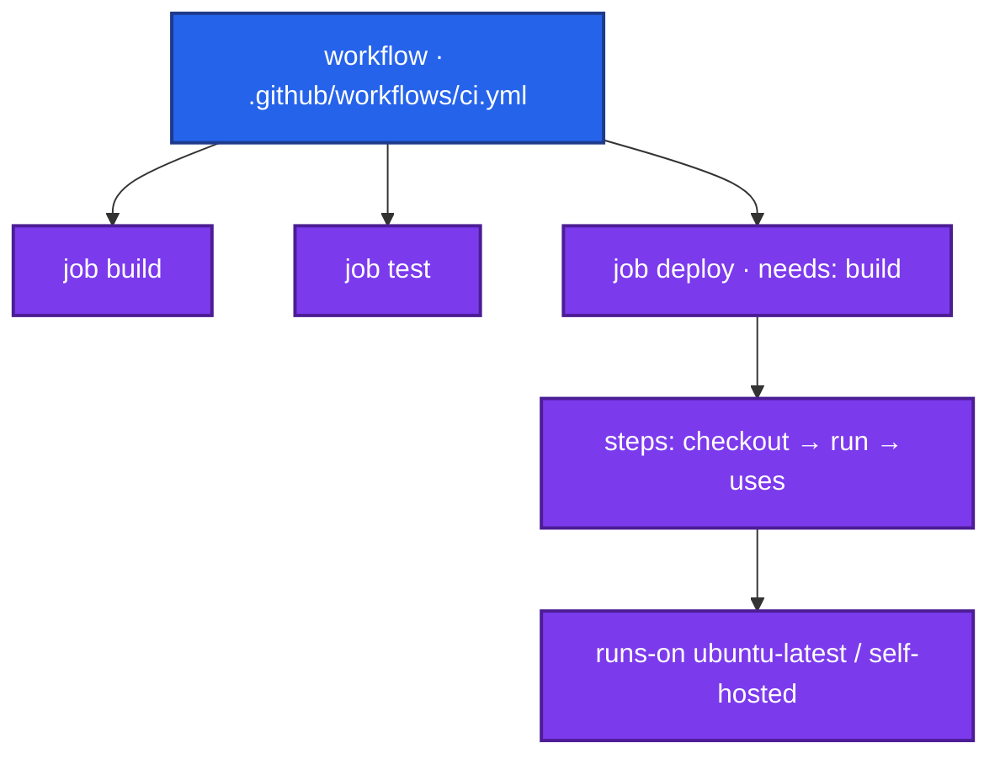
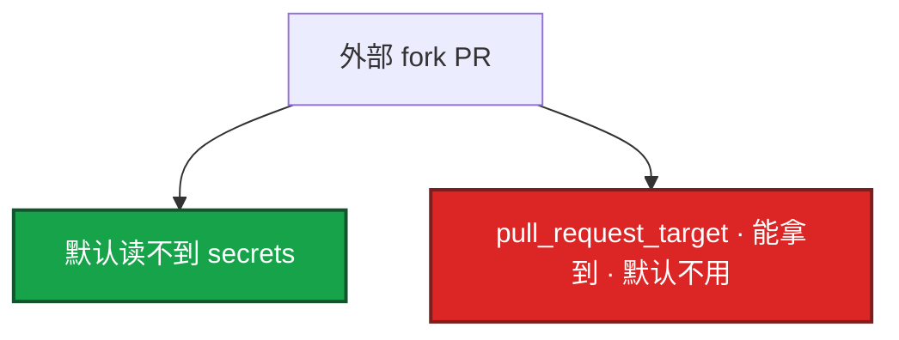
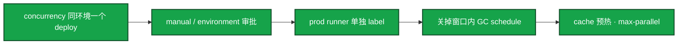

# 08｜GitHub Actions 与 GitLab CI · 练习题

先自己画图或口述，再对照解答。每题标了覆盖范围：

| 标记 | 含义 |
|------|------|
| **核心** | 不懂整章就没建立起来 |
| **必会** | 值班和面试都要能讲 |
| **常用** | 线上会反复碰到 |
| **常考** | 白板和追问的高频口径 |

流水线门禁设计见 02，本题考 YAML、runner、密钥作用域、发版夜怎么焊。

## 本题目录

- [Q1 四个名词 / 并行](#q1)
- [Q2 密钥 / fork PR](#q2)
- [Q3 自托管 runner](#q3)
- [Q4 artifacts vs cache](#q4)
- [Q5 main 才部署](#q5)
- [Q6 matrix / fail-fast](#q6)
- [Q7 pin action / Jenkins](#q7)
- [Q8 monorepo paths](#q8)
- [Q9 发版值班](#q9)
- [Q10 排障分流](#q10)
- [合上书](#合上书)

---

## Q1

**★★★★★｜GHA 的 workflow / job / step / runner 是什么？job 怎么并行？**

**覆盖**：核心 · 必会 · 常考

### 场景

白板：「画一条 GitHub Actions。」有人把四个名词背成「就是 Jenkins stage」。feature 分支的 deploy job 也跑了。

### 完整解答



同一 job 内 step 串行。多个 job **默认并行**。`needs` 串行 job。GitLab 用 stage，同 stage 并行。`strategy.matrix` 多版本并行。`if: github.ref == 'refs/heads/main'` 才 deploy。

### 再追问

- 一个 step 失败后面还跑吗？——默认停。`continue-on-error` 是例外，生产门禁不要拿它跳过测试。
- GitLab 对应名词？——pipeline ← stages ← job；`script:`；复用是 include 不是 marketplace action。

---

## Q2

**★★★★★｜密钥怎么管？fork PR 为什么默认没有 secrets？**

**覆盖**：核心 · 必会 · 常考

### 场景

外部贡献者 fork 了仓，改 workflow 把 `${{ secrets.KUBECONFIG }}` 打到 webhook。另一人用了 `pull_request_target` 让 CI 能拉密钥。日志脱敏了，有人 echo 到文件。

### 完整解答

Settings → Secrets，`${{ secrets.NAME }}` 引用。不要写进 YAML，不要 echo 进文件 / 镜像。日志脱敏不等于文件里没有。按 `environment: production` 拆密钥和审批。staging 碰不到 prod。org 级 secret 权限要收紧。`permissions: write-all` 不要开。OIDC 短周期凭证优于长期 AK。



泄漏：改 Settings + 源头 IAM rotate。自托管上跑 fork 代码 = 内网任意执行。

### 再追问

- org 级 secret 每个仓都能用？——权限要收紧。能读 prod kubeconfig 的仓越少越好。
- GitLab protected 变量 feature 红？——不一定是 YAML 错，是仅保护分支可读。

---

## Q3

**★★★★★｜为什么要自托管 runner？有什么坑？**

**覆盖**：核心 · 必会 · 常用

### 场景

GitHub 托管 runner 拉不了内网 Harbor。有人把 prod 密钥配在共用 self-hosted 上，并且允许 fork PR 使用这组 runner。开服前 30 个 workflow 同时打到同一台。

### 完整解答

内网 / GPU / 合规 / 额度。机器装 agent，`runs-on: self-hosted` 或 label。

```
  对：prod runner 单独 label；fork PR 不上这组；ephemeral
  错：测试、生产、fork 共用一台，磁盘残留 docker login
```

要自己升级、监控在线、清 workspace。runner 能执行任意命令，限制谁能改 workflow。并发打满要排队、`max-parallel` 或 ephemeral（用完销毁）。GitLab runner 的 tag / privileged / DinD 同类，默认关 privileged。不同项目不同 runner / 不同 Linux 用户。不要长期 docker login；用当天的 OIDC / 短 token。workspace 清理进 always 仍不如销毁机器。磁盘 prune 见 07。

### 再追问

- ephemeral 解决什么？——减少上一 job 的凭证、容器、workspace 留到下一 job。
- OIDC 联邦到云，还要长期 AK 进 Secrets 吗？——能短周期凭证就不要长期 AK。长期 kubeconfig 是最后手段，还要配 environment 审批。

---

## Q4

**★★★★★｜GitLab CI 里 artifacts 和 cache 差在哪？GHA cache key 呢？**

**覆盖**：核心 · 必会 · 常用 · 常考

### 场景

build job 编出了 `server`，deploy job 说找不到文件。cache 配了但过几天丢失。有人把 cache 当产物。fork PR 写入的 cache 被 main 用了。

### 完整解答

```
  artifacts  给后续 job 的产物，必须声明 paths，要设 expire_in
  cache      加速依赖，丢了可以再下，不是传递二进制的手段
```

GHA：`upload-artifact` vs `actions/cache`。cache `key` 常用 os + `hashFiles('**/go.sum')`。key 漂 = 永不命中；太粗 = 串环境 / **cache poisoning**。fork PR 写 cache 要谨慎。restore-keys 是前缀回退，可能命中旧依赖。GitLab `cache.key: ${CI_COMMIT_REF_SLUG}` 按分支。产物进 Harbor（03），不要把镜像 tar 当无限 artifacts。`when: manual` 做人闸。`rules:` 替代旧 `only:`。

### 再追问

- artifacts 没设过期？——堆满磁盘。`expire_in` 要写。
- protected 变量？——只在保护分支；feature 红可能是作用域。

---

## Q5

**★★★★☆｜写一段「main 才手动部署」的 GitLab rules，和 GHA 怎么对应？**

**覆盖**：必会 · 常用 · 常考

### 场景

所有分支 push 都在 kubectl apply。要改成只有 main、而且要点一下。`environment: production` 没配审批人。

### 完整解答

GitLab：

```yaml
deploy:
  stage: deploy
  script: ./deploy.sh $CI_COMMIT_SHA
  rules:
    - if: $CI_COMMIT_BRANCH == "main"
      when: manual
```

GHA：`if: github.ref == 'refs/heads/main'` + `environment: production`（审批）或 `workflow_dispatch`。这是语法落地；「生产要不要自动 Deployment」是 02 的设计题，这里不要展开 DORA。YAML 漏一行，feature 就上生产。没配审批人等于没闸。

### 再追问

- tag 发布呢？——`on.push.tags` / `CI_COMMIT_TAG` 另写 job，仍要同一 digest 晋升（02 / 03）。
- 开服夜还能 `workflow_dispatch` 绕过冻结？——environment 保护要和 06 变更系统一起拒。

---

## Q6

**★★★★☆｜matrix 失败一个，整次该不该红？**

**覆盖**：必会 · 常用 · 常考

### 场景

matrix 测 Go 1.21 / 1.22，1.21 红了。有人 `fail-fast: false` 还当成功合并。扫描 job 开了 `allow_failure`。开服夜 matrix 把唯一 self-hosted 打满。

### 完整解答

默认 fail-fast：一个矩阵失败会取消其它。`fail-fast: false` 只让其它跑完，**job 仍应失败**，不能拿来跳过门禁。GitLab 同 stage 多个 job，一个失败默认失败 pipeline（除非 `allow_failure`）。`allow_failure` 给通知类 job，不给测试。Critical 扫描要失败 pipeline（03 / 02）。`max-parallel` 防止打满 runner。游戏多区服用 matrix `server_id`，不要 30 条独立 workflow。

### 再追问

- `continue-on-error` 给测试？——不要。和 allow_failure 同一类口误。
- 同 stage 全绿才 deploy？——GitLab stage 顺序；GHA 用 `needs`。

---

## Q7

**★★★★☆｜第三方 action / include 不 pin 会怎样？GHA 和 Jenkins 怎么选？**

**覆盖**：必会 · 常用

### 场景

`uses: some-org/deploy@main`。某天 supply chain 被换。新游戏工具仓在 GitHub，老区服还在 Jenkins + Ansible。有人要「统一全迁 Actions」。

### 完整解答

pin 到 tag 或 SHA。第三方 action = 在你的 runner 上跑别人的代码。生产只引内部或审计过的。GitLab include / Jenkins Library 同一类：不 pin 下次全红或更糟。官方 action pin 大版本常见；高敏感仓 pin SHA + dependabot。

选型：新建、在 GitHub / GitLab、免养 CI 服务器 → Actions / GitLab CI。已有 Jenkinsfile、遗留插件、混合 VM → 继续 Jenkins。不是一刀切。CD 仍只留一条（02）。可以 YAML 做 CI、Jenkins 做重型 job，但不要双 apply。特殊硬件固定 Agent、老插件、已验证 Shared Library，Actions 替代不了。

### 再追问

- `checkout@v4` 还要 pin SHA 吗？——官方 pin 大版本常见；高敏感仓 pin SHA。答到知道风险即可。
- 趋势？——新仓 YAML，存量按仓迁移。

---

## Q8

**★★★★☆｜monorepo 里怎么避免每次全仓跑 E2E？**

**覆盖**：必会 · 常用

### 场景

改了文档，整条 40 分钟流水线全跑。要在 YAML 里拦住，不是先去买 runner。公共库改了依赖方没测。

### 完整解答

GHA：`on.push.paths` / `paths-ignore`。GitLab：`rules: changes: [src/**/*]`。只是语法开关。重型 E2E 仍放到 staging，那是 02 的阶段设计。两边一起用：路径过滤少跑，阶段设计少做无用功。公共模块变更要列进 `changes`，否则依赖方不测。宁可多跑公共路径，不要漏。发版夜尤其不要让 README 挡住窗口。

### 再追问

- 这是不是 02 的「E2E 后置」整段？——不是。02 是设计；本章是 paths / changes 落地。
- 改 go.mod 要跑吗？——要，写进 changes。

---

## Q9

**★★★★☆｜游戏发版 / 开服夜，YAML 和 runner 怎么焊？**

**覆盖**：必会 · 常用 · 常考

### 场景

开服夜两个 prod deploy 同时 apply。Harbor 复制没完有人点了 manual。schedule 在窗口里 GC 旧镜像。30 个 workflow 打满唯一 self-hosted。失败只打给上个月离职的 Owner。

### 完整解答

流程冻结、升级在 06。本章焊执行器：



镜像预拉 / 本机房 digest（03）再点手动。告警切到当天在职 Owner（06）。YAML 仍能 `workflow_dispatch` 绕过冻结 = environment 没和变更系统一起拒。不要窗口里并行两路 prod apply。

### 再追问

- 和 06 怎么分工？——06 管人、窗口硬拦、升级；本章管 if/rules、concurrency、runner label、别跑 GC workflow。
- 构建冷启动拖窗口？——提前 cache 预热；不要每台 Agent 当场下依赖。

---

## Q10

**★★★★☆｜给出现象，你先走哪条排障路？**

**覆盖**：必会 · 常用

### 场景

六个工单：① feature 上了 prod ② fork 打出 kubeconfig ③ deploy 找不到 `./server` ④ 自托管盘满且 Harbor 密码还在 ⑤ matrix 一个红仍合入 ⑥ 发版夜两次 apply 互踩。

### 完整解答

| # | 走哪条 | 不要做 |
|---|--------|--------|
| ① | `if:` / `rules` / environment | 先加 runner |
| ② | secrets 作用域、`pull_request_target` | 当日志脱敏就没事 |
| ③ | artifacts 声明 / expire_in；别当 cache | 再 build 一次当修复 |
| ④ | ephemeral、拆 label、OIDC、prune（07） | 长期 docker login |
| ⑤ | job 必须红；allow_failure 不给测试 | 拿 fail-fast: false 当成功 |
| ⑥ | concurrency 互斥 | 再点一次 manual |

现场：ref → if/rules → secrets → artifacts → runner label。

### 再追问

- 第三方 action 全红？——没 pin，pin 回 SHA。
- 托管了这章能跳过吗？——不能。fork、environment、CD 一条路仍是你的。

---

## 合上书

- [ ] 能画出 workflow / job / step / runner，并说明 job 默认并行
- [ ] 能说出密钥不进 YAML、fork 默认无 secrets、慎用 `pull_request_target`
- [ ] 能区分 artifacts vs cache、protected 变量、environment 审批 vs `when: manual`
- [ ] 能讲自托管坑：label、fork、ephemeral、docker login 残留
- [ ] 能写 main 才手动部署的 GitLab rules / GHA if；matrix 失败仍应红
- [ ] 能 pin action/include；能讲新仓 YAML vs 遗留 Jenkins，CD 仍一条
- [ ] 能用 concurrency + 单独 runner + 关掉 GC，把发版夜焊住，而不是再点一次 apply
