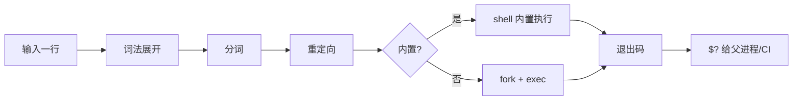
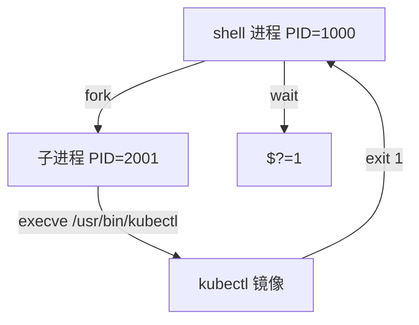
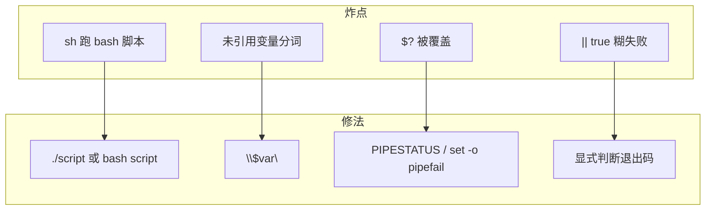

# 01｜基础语法与执行模型 · SRE 开发能力

> 活动前有人把 `deploy.sh` 拷到跳板机直接 `sh deploy.sh`，`[[` 语法报错；CI 里 `kubectl apply` 明明失败，流水线却绿了——群里已经有人在改业务 YAML，手就放在「重跑流水线」上。
> **本章回答**：一条命令 / 一个脚本片段从「输入行」到「退出码」完整走一遍——谁执行、怎么展开、怎么 fork、怎么收尸。
> **不讲**：变量引号与 `${var:-}` → [03](../03-变量引号与参数展开/)；三开关与 trap → [02](../02-脚本骨架与三开关/)；管道与 `PIPESTATUS` → [06](../06-管道重定向与PIPESTATUS/)；SSH 批量 → [10](../10-SSH批量与远程执行/)。

**标记**：🎯重点 · 🔥难点 · ⭐常考 · 🔧实操

---

## 面试怎么考

| 标记 | 考点 |
|------|------|
| **核心** | shebang 与调用方式；bash vs sh；词法展开顺序；`$?` 与 `set -e`；`source` vs 子 shell |
| **必会** | `#!/usr/bin/env bash`；`sh script.sh` 忽略 shebang；退出码 0 / 非 0 |
| **常用** | CI 里 `cmd \|\| true` 掩盖失败；`exec` 替换进程；`type` / `command -v` |
| **常考** | 展开顺序口诀；`./script` vs `bash script`；Debian `dash` 与 `[[`；`$?` 必须立刻读 |

**30 秒怎么说**：Shell 先词法展开（引号、变量、命令替换），再分词，再重定向，最后才 `fork+exec`。`#!/usr/bin/env bash` 让内核用 bash 跑；`sh deploy.sh` 用 sh，shebang 作废。`source` 改当前环境；`()` / `./script` 开子 shell 隔离变量。`$?` 是上一条前台命令成败，CI 和 `set -e` 都盯它——失败别 `|| true` 糊过去。

---

## 能力边界

| 维度 | Shell 执行模型 | Python / Go | 裸 ssh 一行 |
|------|----------------|-------------|-------------|
| **适合** | 编排 CLI、CI 门禁、跳板机刀法 | 结构化逻辑、API、复杂重试 | 单次 ad-hoc |
| **不适合** | 长事务状态机、无类型并发 | 替代 `kubectl`/`grep` 的 C 级过滤 | 百台变更无 dry-run |
| **你要会** | 读懂 sh 下炸、CI 假绿 | 何时换语言 | 何时写成脚本进 Git |

- 🎭 **三个角色别混**
  - **交互式 shell**：人敲命令，环境可残留 → `source` 改的是这个
  - **非交互脚本**：CI / cron / systemd `ExecStart` → 默认无 RC 里的别名
  - **子 shell**：`()`、管道、`./script` → 变量改动不外泄

> ⚠️ **别混**：Shell 是**胶水**——执行模型搞不清，后面三开关、管道、并发全建在沙上。

---

## 语言最小集

读运维脚本的 12 个「句法零件」——认代码下限，不是语法大全。

| 零件 | 示例 | 含义 |
|------|------|------|
| shebang | `#!/usr/bin/env bash` | 内核用哪个解释器 `exec` 本文件 |
| 简单命令 | `kubectl get pods` | 最终 `fork+exec`（或内置） |
| 内置 vs 外部 | `cd /tmp` vs `ls` | `cd` 必须内置；`ls` 是外部 |
| 赋值 | `name=prod` | **等号两侧不能有空格** |
| 引用 | `"$var"`、`'literal'` | 双引号仍展开；单引号全字面 |
| 命令替换 | `$(date +%F)` | 先跑子命令，结果替进当前行 |
| 管道 | `cmd1 \| cmd2` | 左 stdout → 右 stdin；默认看最后一个退出码 |
| 重定向 | `>file`、`2>&1` | **exec 之前**由 shell 建好 fd |
| 逻辑 | `&&`、`\|\|` | 短路；和 `set -e` 纠缠最多 |
| 退出 | `exit 1` | 把码交给父进程 / CI |
| `$?` | 立刻读 | 中间插一条命令就丢 |
| `source` / `.` | `source a.sh` | 当前 shell 读文件，不 fork |

```bash
LOG_DIR="/var/log/app"
TS=$(date +%Y%m%d)                    # ① 命令替换先跑
echo "backup $LOG_DIR $TS"            # ② 双引号内展开
kubectl get pods -A >"/tmp/pods-$TS.txt" 2>&1  # ③ 重定向再执行
echo "kubectl exit=$?"                # ④ 立刻读 $?
```

---

## 一、一张图：一条 shell 命令的一生

> 🎯 **一句话**：你敲下的不是「一个程序」，而是 shell 先**改写成 argv + fd**，再 `fork+exec` 的真正命令。



- 📖 **读图**
  - 🛤️ 主线：输入 → 展开 → 分词 → 重定向 → 内置或 fork/exec → `$?`
  - 📦 管道是多个简单命令串起来（见 [06](../06-管道重定向与PIPESTATUS/)）；CI/监控只认最后 `$?` 是否为 0

本节对应练习题 Q1、Q2、Q14。

---

## 二、出生：谁在执行——shebang 与调用方式

> 🎯 **一句话**：脚本由**谁调用**，比文件里写了什么 shebang 更优先（`sh foo.sh` 场景）。

### 📮 shebang 是什么

- **shebang** = 文件第一行 `#!` 开头的解释器路径
- 内核 `execve` 脚本时读这一行，再用指定解释器打开本文件——前提是**让内核直接 exec 这个文件**

```bash
#!/usr/bin/env bash
# 推荐：env 在 PATH 里找 bash，便携性好于写死 /bin/bash

#!/bin/bash
# 常见但路径因发行版而异；容器里可能没有 /bin/bash
```

> 📝 **面试**：「生产用 `#!/usr/bin/env bash`；还要 `chmod +x`，用 `./deploy.sh`，shebang 才生效。」⭐

### 🔑 三种调用方式 ⭐常考

遮住右列自问：三种调用，shebang 到底听谁的？

| 调用 | shebang | 实际解释器 |
|------|---------|------------|
| `./deploy.sh` | **生效** | shebang 指定（通常 bash） |
| `bash deploy.sh` | 不生效 | 参数里的 bash |
| `sh deploy.sh` | **不生效** | **sh**（Ubuntu 上常链到 dash） |

> 💡 **打个比方**：shebang 像快递面单上的「指定承运商」；你手动交给顺丰（`bash a.sh`）或圆通（`sh a.sh`），面单偏好会被无视。

> ⚠️ **别混**：「文件头是 `#!/bin/bash`」≠「`sh deploy.sh` 会用 bash」。`[[`、数组、`source` 在 dash 下行为不同。

#### ❓ 为什么 `sh deploy.sh` 会忽略 shebang？

- 🧠 **内核只在「直接 exec 这个文件」时读 shebang**
  - `./deploy.sh`（有执行位）→ 内核读 `#!` → 再 exec 解释器 + 脚本路径
  - `sh deploy.sh` → 你已经选定解释器是 `sh`；脚本只是 **argv 参数**，`#!` 行当注释
  - `bash deploy.sh` 同理——解释器是你写死的 bash
- ✅ **口诀**：谁调用听谁的，shebang 只在 `./` 时说话

### 🔥 bash vs sh

| 维度 | bash | sh（POSIX） |
|------|------|-------------|
| 典型路径 | `/bin/bash` | `/bin/sh` → 可能是 dash |
| `[[ ... ]]` | 支持 | **不支持**（用 `[`） |
| 数组 | `arr=(a b)` | 无 |
| `source` | 支持 | POSIX 用 `.` |

```bash
ls -l /bin/sh
# lrwxrwxrwx ... /bin/sh -> dash   # ← Debian/Ubuntu 常见

sh -c '[[ -f /etc/passwd ]]'
# dash: [[: not found   # ← 活动脚本炸点
```

> 🔍 **现场**：脚本莫名 `syntax error near unexpected token`，先问「CI 用的是 `sh` 还是 `bash`？」

```bash
head -1 deploy.sh
# #!/usr/bin/env bash
# 错：CI 里 sh deploy.sh
# 对：bash deploy.sh 或 chmod +x && ./deploy.sh
```

本节对应练习题 Q1、Q2。

---

## 三、理解：词法展开——引号、变量、命令替换

> 🎯 **一句话**：真正 `exec` 之前，shell 先把一行**改写成字面 argv**；顺序错了，现象就像「随机」。

### 🧩 展开顺序 ⭐常考 · 🔥难点

POSIX / bash 大致顺序（背口诀）：

1. **引号处理**（去掉引号，保留规则）
2. **参数展开** `$var`、`${var}`、`$*`
3. **命令替换** `` `cmd` ``、`$(cmd)`
4. **算术展开** `$((expr))`
5. **分词**（IFS 默认空格/tab/换行）
6. **通配符展开** `*`、`?`（未引用时）
7. **重定向** 建立 fd
8. **执行**

```bash
FILE="access.log"
grep ERROR "$FILE"          # ① $FILE 展开 → ② 分词 → ③ 执行

echo "today $(date +%F)"    # 命令替换先于分词
echo '$FILE'                # 单引号：字面 $FILE
```

> 📝 **面试**：「先展开引号里的变量和 `$(cmd)`，再按 IFS 分词，最后才执行；所以 `"$var"` 保含空格路径，`$var` 可能被拆成多个词。」⭐

#### ❓ 为什么必须先展开再执行？

- ❌ **误以为**：shell「看见 `$FILE` 就边跑边查」
- ✅ **实际**：整行先改写成字面 argv，再决定跑谁、带什么参数
  - 不先展开 → 分词边界、通配、重定向目标全不确定
  - `"$var"` 的意义：展开后**当作一个词**，挡住 IFS 分词
- 🔗 深度（`${var:-}`、`nullglob`）→ [03](../03-变量引号与参数展开/)

> ⚠️ **别混**：「变量展开」`echo $TS` vs「命令替换」`echo $(date)`——后者**会先起子 shell 跑 date**。

```bash
ls *.log
# 无匹配时：bash 默认把 *.log 当字面；nomatch 选项则报错
# 生产：先 test，或 shopt -s nullglob（见 03）
```

本节对应练习题 Q3、Q12。

---

## 四、分词与重定向：argv 与 fd 就位

> 🎯 **一句话**：分词决定 `argv[]` 有几个；重定向决定 stdout/stderr 去哪——都在 `exec` 之前完成。

```bash
echo hello world
# argv[0]=echo argv[1]=hello argv[2]=world

kubectl get pods -A > /tmp/pods.txt 2>&1
# 顺序：展开 → 分词 → 打开文件、dup2 → 再 exec kubectl
```

#### ❓ 为什么 `2>&1` 顺序敏感？

- 📎 **重定向从左到右，改的是「当前」fd 指向**
  - `cmd >out.log 2>&1`：先把 stdout 指到文件，再让 stderr **抄 stdout 现在的指向** → 都进文件 ✅
  - `cmd 2>&1 >out.log`：先让 stderr 抄 stdout（还是终端），再把 stdout 指到文件 → stderr 仍去终端 ❌
- 口诀：**要 stderr 进文件，先定 stdout 再 `2>&1`**

> 🔍 **现场**：以为日志进了文件，错误还在 Jenkins 控制台。

```bash
./deploy.sh >deploy.log          # 错：stderr 仍在控制台
./deploy.sh >deploy.log 2>&1     # 对
```

本节对应练习题 Q4。

---

## 五、上路：fork、exec 与内置命令

> 🎯 **一句话**：外部命令 = `fork` 子进程 + `execve` 换镜像；内置在**当前 shell 进程**里跑，没有新 PID。



- 📖 **读图**
  - `kubectl` 失败 → 子进程 exit 1 → 父 shell `wait` 后把 1 放进 `$?`
  - 内置 `cd` **没有子进程**——所以必须影响当前 shell 的 cwd

```bash
type cd
# cd is a shell builtin

type kubectl
# kubectl is /usr/local/bin/kubectl

command -v bash
# /bin/bash
```

#### ❓ 为什么 `cd` 必须是内置？

- 🧠 **工作目录是进程属性**：子进程里 `chdir` 改不了父进程 cwd
- 若 `cd` 是外部命令 → fork 出去改完就死，父 shell 仍停在原地
- 同理：`export`、`set`、部分 `ulimit` 也必须内置（或 `source` 进当前进程）

> 📝 **面试**：「`cd` 不能靠外部脚本改父 shell 目录；要 `source` 或在父 shell 直接 `cd`。」

### 🧭 PATH 与命令查找

```bash
echo "$PATH"
# /usr/local/sbin:/usr/local/bin:/usr/sbin:/usr/bin

command -v kubectl    # 脚本里用这个；别依赖 which 处处存在
# 危险：相对路径 ./kubectl 可能吃到当前目录恶意二进制
```

本节对应练习题 Q9、Q10。

---

## 六、归来：退出码、`$?` 与 CI

> 🎯 **一句话**：退出码 0 = 成功，非 0 = 失败；`$?` 只保存**紧挨着的上一条**前台命令结果。

### 📊 退出码语义 ⭐常考

| 码 | 常见含义 |
|----|----------|
| 0 | 成功 |
| 1 | 通用错误 |
| 2 | 误用（缺参数等） |
| 126 | 不可执行 |
| 127 | 命令未找到 |
| 130 | Ctrl+C（128+SIGINT） |
| 137 | SIGKILL（128+9）OOM 常见 |

```bash
kubectl get pod not-exist 2>/dev/null; echo $?
# 1   # ← API 错误

zzz_not_found; echo $?
# 127 # ← command not found
```

> ⚠️ **别混**：「命令打了 ERROR 日志」≠「退出码非 0」。不少工具失败仍 exit 0——**CI 要看 `$?`，不是 grep ERROR**。⭐

#### ❓ 为什么 `$?` 必须立刻读？

- ☕ **口诀**：`$?` 像热咖啡，隔一杯就凉
- 每条前台命令结束都会**覆盖** `$?`——中间插 `echo`，读到的是 echo 的 0
- ✅ 立刻 `rc=$?`，或写成 `if cmd; then …; fi`（不要「跑完 → 干别的 → 再看 $?」）

```bash
kubectl apply -f deploy.yaml
if [[ $? -ne 0 ]]; then echo "apply failed"; fi   # 正确：立刻用

kubectl apply -f deploy.yaml
echo "step done"
echo $?   # ← 这是 echo 的 0，不是 kubectl 的！
```

> 🔍 **现场**：Jenkins「绿了」但集群没更新——中间有人加了 `echo` 或 `| tee`，`$?` 被覆盖。修法：`PIPESTATUS` / `set -o pipefail`（见 [06](../06-管道重定向与PIPESTATUS/) · [02](../02-脚本骨架与三开关/)）。

### ⚡ `&&` / `||` 与 `set -e` 预告

```bash
kubectl apply -f a.yaml && kubectl rollout status deploy/app

kubectl apply -f a.yaml || true   # ← CI 大忌：永远「成功」

set -e
false
echo "到不了这里"                 # -e 细节见 02 章
```

本节对应练习题 Q5、Q6。

---

## 七、旁路：source、exec 与子 shell

> 🎯 **一句话**：`source` 不换进程，改当前环境；`exec` 换进程不返回；`()` / `./script` 开子 shell 隔离。

### 📥 source vs 执行脚本

| 方式 | 新进程？ | 变量/函数 | 典型场景 |
|------|----------|-----------|----------|
| `source env.sh` / `. env.sh` | 否 | **影响当前 shell** | 加载 `KUBECONFIG`、nvm |
| `./env.sh` | 是 | 父 shell 看不见 | 可执行脚本 |
| `bash env.sh` | 是 | 同上 | CI 显式指定解释器 |

```bash
# env.sh 里：export STAGE=canary
source ./env.sh; echo "$STAGE"   # canary
./env.sh;        echo "$STAGE"   # 空——子进程 export 不回传
```

#### ❓ 为什么 `./env.sh` 里的 `export` 回不来？

- 🧬 **环境变量跟着进程走**：子进程改自己的环境，父进程的环境表不变
- `source` = 当前 shell **读文件当命令跑** → 改的就是「你正在用的」那张表
- 生产：可信 env 可 `source`；不可信脚本 `source` ≈ RCE。变量优先走 systemd `EnvironmentFile` / CI secret

> 📝 **面试**：「上线前 `source prod.env` 可以；随机 `source` 不可信脚本等于 RCE。」

### 🔄 exec：替换当前 shell

```bash
exec /usr/bin/nginx -g 'daemon off;'
# exec 后没有「返回 shell」——后面行不会执行

exec kubectl apply -f app.yaml
echo "cleanup"   # 永远跑不到
```

> 💡 **打个比方**：`source` 像把菜谱**读进脑子**继续在同一厨房做菜；`exec` 像把整个厨房**租给别人**，原来的厨师下班了。

### 🏪 子 shell `()`

```bash
cd /tmp
( cd /var/log; pwd )   # /var/log
pwd                    # 仍是 /tmp
```

- 管道两侧也常在子 shell（bash 细节见 [06](../06-管道重定向与PIPESTATUS/)）——管道里 `export` 外面看不见
- 口诀：**`source` 进脑子，`exec` 交钥匙，`()` 开分店**

本节对应练习题 Q7、Q8、Q11。

---

## 八、原理收束：执行模型凭什么决定「脚本会不会炸」

> 🎯 **一句话**：**调用方式 + 展开顺序 + 退出码** 三件事串起来，解释 80% 「本地好使 CI 炸」。



- 📖 **读图**：左栏四类炸点 ↔ 右栏四类修法；面试按「调用 / 展开 / 退出码」三组背。

**可背清单（七件套）**：

1. shebang + `chmod +x` + `./script` 三件套
2. CI 禁止默认 `sh script`（除非确认 POSIX）
3. 变量路径**双引号**
4. 重定向顺序：`>file 2>&1`
5. 外部命令失败看 `$?`，立刻读
6. 环境变量用 `source` 或平台注入，别指望 `./export.sh`
7. 长期脚本上 `set -euo pipefail`（下一章）

> ⚠️ **别混**：执行模型**不保证**并发安全、不保证事务——百台变更还要 dry-run、失败列表、并发上限（见 08～10 章）。

本节对应练习题 Q14。

---

## 九、作战：CI 假绿与「语法突然坏了」

> 🎯 **一句话**：先查解释器链，再查退出码有没有被糊掉——别先改业务 YAML。

**现象 · 先做 · 别做**

| 现象 | 先做 | 别做 |
|------|------|------|
| `[[` syntax error | `head -1` + CI 是 `sh` 还是 `bash` | 不查根因狂改 `[` |
| 步骤绿但集群没变 | 查 `$?`、`\|\| true`、`\| tee` | 重跑碰运气 |
| `command not found` | `echo $PATH`、`command -v` | 写死路径不文档化 |
| 变量「空」 | `set -x` 看展开 | 狂 echo 不引号 |

### 🔧 60 秒剧本

```text
① 0–10s   复制 CI 完整一行命令，本地同用户同 shell 复现
② 10–30s  head -1 script.sh；ls -l /bin/sh；bash --version
③ 30–45s  bash -x script.sh 看展开后 argv（禁泄密）
④ 45–60s  script; echo $?；有管道加 set -o pipefail 试跑
```

```bash
head -1 deploy.sh
readlink -f /bin/sh
bash --version | head -1
```

本节对应练习题 Q6、Q13。

---

## 生产模板

### 模板 1：可移植 shebang + 显式 bash（CI 友好）

```bash
#!/usr/bin/env bash
# deploy.sh — 片段；完整骨架见 02 章
set -euo pipefail

main() {
  nginx -t
  systemctl reload nginx
}

main "$@"
```

```bash
chmod +x deploy.sh && ./deploy.sh
# 或 CI：bash deploy.sh ——两种都对，但要全流水线一致
```

### 模板 2：加载环境 vs 执行脚本

```bash
#!/usr/bin/env bash
# load-stage.sh — 仅供 source
export STAGE="${STAGE:-prod}"
export KUBECONFIG="${KUBECONFIG:-$HOME/.kube/config-prod}"
# 用法：source ./load-stage.sh
# 禁止：./load-stage.sh 后指望环境还在
```

### 模板 3：exec 容器入口

```bash
#!/usr/bin/env bash
set -euo pipefail
python /app/render_config.py          # 前置在 exec 之前做完
exec /app/game-server --config /etc/app/config.yaml
# 之后无 shell——信号直接给 game-server
```

### 模板 4：安全认命令

```bash
#!/usr/bin/env bash
set -euo pipefail

need_cmd() {
  command -v "$1" >/dev/null 2>&1 || {
    echo "missing dependency: $1" >&2
    exit 127
  }
}

need_cmd kubectl
need_cmd jq
kubectl version --client=true
```

```text
Client Version: v1.29.0
# ← client 能跑就行；集群连不上是另一类问题
```

---

## 踩坑清单

| 现象 | 原因 | 修法 |
|------|------|------|
| `[[` syntax error | `sh`/`dash` 跑 bash | `bash script` 或 shebang + `./script` |
| CI 绿集群没更新 | `\|\| true`、`\| tee` 吞 `$?` | 去糊失败；`pipefail` + `PIPESTATUS` |
| 路径含空格炸 | 未引用 `$var` | `"$var"`（03 深化） |
| `export` 不生效 | 用了 `./setenv.sh` | `source` 或 CI variables |
| `exec` 后清理没跑 | exec 不返回 | 清理放 exec 前 |
| `command not found` | PATH 不含工具 | `command -v` 前置检查 |
| 日志只有 stdout | 没 `2>&1` | `>file 2>&1` |
| `$?` 总是 0 | 中间插了 echo | 立刻 `rc=$?` 或 `if cmd` |
| Permission denied | 没执行位 | `chmod +x` 或 `bash script` |
| 通配符字面进命令 | 引号/通配不对 | 见 03 |

---

## 必会 · 常考

| 说法 | 对错 | 口径 |
|------|:----:|------|
| shebang 在任何调用下都生效 | 错 | `sh a.sh` 用 sh，忽略 shebang |
| `$?` 可以隔几行再读 | 错 | 只代表**上一条**前台命令 |
| 打了 ERROR 就一定非 0 | 错 | 看退出码 |
| `source` 和 `./script` 一样 | 错 | source 不换进程 |
| `cd` 可当外部命令生效 | 错 | 必须内置 |
| bash 就是 sh | 错 | `/bin/sh` 可能是 dash |
| `exec` 后还能 echo 清理 | 错 | 进程被替换 |
| CI 里 `\|\| true` 是好习惯 | 错 | 掩盖失败 |
| 展开在分词之前 | 对 | 先 `$()` / `$var` 再 IFS 分词 |
| `2>&1 >f` 和 `>f 2>&1` 一样 | 错 | 顺序敏感 |

---

## 收口

### 命令速查 🔧

```bash
head -1 script.sh              # shebang
readlink -f /bin/sh            # sh 指向谁
type cmd                       # 内置还是外部
command -v kubectl             # 路径（脚本里用这个）
bash -x script.sh              # 展开跟踪（禁泄密）
cmd; echo $?                   # 退出码
ls -l script.sh                # 执行位
```

### 面试锚点

| 问 | 30 秒答 |
|----|---------|
| shebang 干什么？ | 内核直接 exec 脚本时用指定解释器；推荐 `env bash` |
| `sh a.sh` 和 `./a.sh`？ | 前者用 sh 且忽略 shebang；后者走 shebang |
| 展开顺序？ | 引号→参数→命令替换→算术→分词→通配→重定向→执行 |
| `$?` 怎么用？ | 上一条前台退出码；必须立刻读 |
| source 干嘛？ | 当前 shell 读文件改环境；不 fork |
| 为什么 CI 假绿？ | `\|\| true`、管道吞码、`$?` 被覆盖 |

### 易错一句话对照

- shebang 写了就永远生效 → 只有 `./script`（内核直接 exec）才读；`sh`/`bash` 调用时 `#!` 当注释
- 看日志里有 ERROR 就算失败 → CI 只认退出码；工具可以 ERROR 仍 exit 0
- `$?` 隔几行再读 → 中间任何前台命令都会覆盖
- `source` ≈ `./script` → 一个改当前环境，一个在子进程里死
- `cd` 写成外部脚本能改目录 → cwd 是进程属性，必须内置
- `2>&1 >f` 等同 `>f 2>&1` → 从左到右改 fd；要 stderr 进文件用后者
- bash 就是增强版 sh，随便 `sh` 跑 → Ubuntu 上 `/bin/sh` 常是 dash，`[[` 直接炸
- `exec` 后还能做 cleanup → 当前进程镜像已被替换，后面行永不执行
- `|| true` 让流水线稳 → 门禁失效，假绿

### 数字墙

> 退出码 **0** = 成功 · **127** = command not found · **126** = 不可执行 · **130** = Ctrl+C（128+2）· **137** = SIGKILL/OOM（128+9）· 管道默认 `$?` 看**最后一个**命令（`pipefail` 见 02/06）· 展开 **8** 步口诀 · 调用方式 **3** 种 · 七件套 **7** 条

---

## 合上书

对着第一节主图口述一遍，卡住就回对应小节。开头那个现场——`sh deploy.sh` 炸、`CI` 假绿——现在该能说清该先查哪三件事。

- [ ] **默画主图**：输入 → 展开 → 分词 → 重定向 → 内置/fork+exec → `$?`。（→ Q14）
- [ ] **口述出生**：`#!/usr/bin/env bash` 好在哪；`sh deploy.sh` 为何忽略 shebang；三种调用各听谁的。（→ Q1 · Q2）
- [ ] **口述展开**：八步口诀；为什么 `"$var"`；变量展开 vs 命令替换。（→ Q3 · Q12）
- [ ] **口述重定向**：`>f 2>&1` vs `2>&1 >f`，各举一个线上后果。（→ Q4）
- [ ] **口述上路**：为什么 `cd` 必须内置；`type` / `command -v` 怎么认。（→ Q9 · Q10）
- [ ] **口述归来**：`$?` 为何立刻读；127/130/137；CI 假绿三个执行模型原因。（→ Q5 · Q6）
- [ ] **口述旁路**：`source` vs `./script`；`exec` 后为何跑不到 cleanup；`()` 里 `cd` 外面看不见。（→ Q7 · Q8 · Q11）
- [ ] **定责**：60 秒剧本四步；七件套背一遍。（→ Q13 · Q14）

全部打勾后，十分钟讲清「活动前现场：为什么 `sh deploy.sh` 会炸、CI 假绿该先查哪三件事」。讲得下来，你就能拦住「改业务 YAML」。下一章用三开关和 trap 钉死「从启动到安全退出」。
