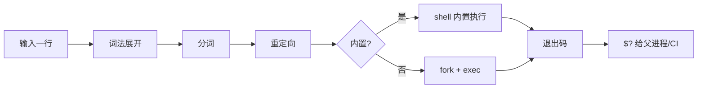
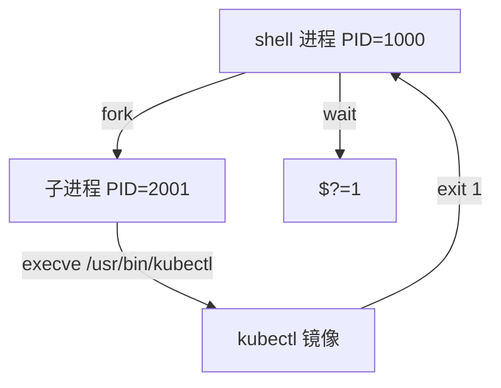
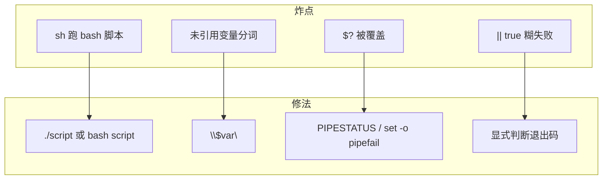

# 01｜基础语法与执行模型 · SRE 开发能力

> 大家好，欢迎来到这次分享。开讲之前，先带大家回到一个很多值班同学都踩过的现场：
> 活动前有人把 `deploy.sh` 拷到跳板机直接 `sh deploy.sh`，`[[` 语法报错；CI 里 `kubectl apply` 明明失败，流水线却绿了——群里已经有人在改业务 YAML，手就放在「重跑流水线」上。
> 这一章讲完，你会知道当时那两个人各自错在哪——根子往往不在业务，而在**一条 shell 命令从敲下到进程退出**这段路。
> **本章回答的问题**：一条命令 / 一个脚本片段从「输入行」到「退出码」完整走一遍——谁执行、怎么展开、怎么 fork、怎么收尸。
> **本章不讲**：变量引号与 `${var:-}` → [03 变量引号与参数展开](../03-变量引号与参数展开/)；三开关与 trap → [02 脚本骨架与三开关](../02-脚本骨架与三开关/)；管道与 `PIPESTATUS` → [06 管道重定向与PIPESTATUS](../06-管道重定向与PIPESTATUS/)；SSH 批量 → [10 SSH批量与远程执行](../10-SSH批量与远程执行/)。

**怎么听这场分享**：先把「一条命令的一生」主图装进脑子——后面每一节都是这张图上的一段；从 shebang 出生 → 词法展开 → 分词重定向 → fork/exec → 退出码归来，一站一节；旁路讲 `source`/`exec`/子 shell；收束七件套之后专门讲开头那个「CI 假绿 / 语法突然坏了」怎么定责。每一节讲完会提示对应练习题，趁热打铁。

## 面试怎么考

| 标记 | 考点 |
|------|------|
| **核心** | shebang 与调用方式；bash vs sh；词法展开顺序；`$?` 与 `set -e` 的关系；`source` vs 子 shell |
| **必会** | `#!/usr/bin/env bash` 为什么比写死 `/bin/bash`；`sh script.sh` 会忽略 shebang；退出码 0 / 非 0 语义 |
| **常用** | CI 里 `cmd \|\| true` 掩盖失败；`exec` 替换当前进程；`type` / `command -v` 认内置与外部命令 |
| **常考** | 展开顺序口诀；`./script` vs `bash script`；Debian `dash` 与 `[[`；`$?` 必须立刻读 |

**30 秒怎么说**：Shell 不是「解释一行跑一行」那么简单——先词法展开（引号、变量、命令替换），再分词，再重定向，最后才 `fork+exec`。`#!/usr/bin/env bash` 让内核用 bash 跑脚本；`sh deploy.sh` 会用 sh 解释，shebang 作废。`source` 在当前 shell 改环境；子 shell `()` 或 `./script` 隔离变量。退出码 `$?` 表示上一条**前台管道**的成败，CI 和 `set -e` 都盯它——失败别 `|| true` 糊过去。

---

## 能力边界

| 维度 | Shell 执行模型 | Python / Go | 裸 ssh 一行 |
|------|----------------|-------------|-------------|
| **适合** | 编排已有 CLI、CI 门禁、跳板机 5 分钟刀法 | 结构化逻辑、API、复杂重试 | 单次 ad-hoc，不可入库 |
| **不适合** | 长事务状态机、复杂并发（无类型） | 替代 `kubectl`/`grep` 的 C 级过滤 | 百台变更无 dry-run |
| **你要会** | 读懂脚本为何在 sh 下炸、为何 CI 假绿 | 何时该换语言 | 何时该写成脚本进 Git |

三个角色别混：

| 角色 | 干什么 | 面试口径 |
|------|--------|----------|
| **交互式 shell** | 人敲命令，环境变量可残留 | `source` 改的是这个 |
| **非交互脚本** | CI、cron、systemd `ExecStart` | 默认无 RC 里那些「人性化」别名 |
| **子 shell** | `()`、管道、`./script` | 变量改动不外泄 |

> **记住**：Shell 是**胶水**，执行模型搞不清，后面三开关、管道、并发全建在沙上。

好，边界清楚了。接下来先把认代码的「最小零件」过一遍——不是语法大全，是读脚本下限。

---

## 语言最小集

读任何运维脚本，先认这 12 个「句法零件」——不是语法大全，是认代码下限。

| 零件 | 示例 | 含义 |
|------|------|------|
| shebang | `#!/usr/bin/env bash` | 内核用哪个解释器 `exec` 本文件 |
| 简单命令 | `kubectl get pods` | 最终都会变成 `fork+exec` 外部程序（或 shell 内置） |
| 内置 vs 外部 | `cd /tmp` vs `/bin/cd` | `cd` 必须内置；`ls` 是外部命令 |
| 赋值 | `name=prod` | **等号两侧不能有空格** |
| 引用 | `"$var"`、`'literal'` | 双引号仍展开变量；单引号全字面 |
| 命令替换 | `$(date +%F)` | 先跑子命令，结果替换进当前行 |
| 管道 | `cmd1 \| cmd2` | 左 stdout 接右 stdin；退出码默认看最后一个 |
| 重定向 | `>file`、`2>&1` | 在「执行命令」之前由 shell 建好 fd |
| 逻辑 | `&&`、`||` | 短路；和 `set -e` 纠缠最多 |
| 退出 | `exit 1` | 把退出码交给父进程 / CI |
| 上一条结果 | `$?` | **必须紧挨着**读，中间插一条命令就丢 |
| 执行方式 | `source a.sh` / `. a.sh` | 当前 shell 读文件，不 fork 新解释器 |

```bash
# 最小可读片段：看懂「谁先展开、谁后执行」
LOG_DIR="/var/log/app"
TS=$(date +%Y%m%d)          # ① 命令替换先跑
echo "backup $LOG_DIR $TS"  # ② 双引号内 $LOG_DIR 展开
kubectl get pods -A >"/tmp/pods-$TS.txt" 2>&1  # ③ 重定向再执行
echo "kubectl exit=$?"      # ④ 立刻读 $?，别中间再 echo 别的
```

零件认完，咱们正式上主图——一条命令从敲下到退出码，中间到底过了哪几站。

---

## 一、一张图：一条 shell 命令的一生

> 🎯 **一句话**：你敲下的不是「一个程序」，而是 shell 先**改写成 argv + fd**，再 `fork+exec` 的真正命令。



**读图**：咱们先把这张图当地图——从左上「输入」到「退出码」是**单条简单命令**的路径；管道是多个简单命令串起来（见 [06](../06-管道重定向与PIPESTATUS/)）。监控和 CI 只看最后 `$?` 是否为 0——中间日志再漂亮，非 0 就是失败。

好，主图装进脑子了。接下来从「出生」开始——大家想想：文件头明明写了 `#!/bin/bash`，为什么 CI 里还是会炸？

本节对应练习题 Q1、Q2、Q14。

---

## 二、出生：谁在执行——shebang 与调用方式

> 🎯 **一句话**：脚本由**谁调用**，比文件里写了什么 shebang 更优先（在 `sh foo.sh` 这种场景）。

### shebang 是什么

**shebang** 是文件第一行 `#!` 开头的解释器路径。大白话：内核 `execve` 脚本时，会读这一行，再用指定解释器打开本文件——但前提是**你让内核直接 exec 这个文件**。

```bash
#!/usr/bin/env bash
# 推荐：env 在 PATH 里找 bash，便携性好于写死 /bin/bash
```

```bash
#!/bin/bash
# 常见但路径因发行版而异；容器里可能没有 /bin/bash
```

> 📝 **面试**：「生产 shebang 用 `#!/usr/bin/env bash`，避免写死路径；还要 `chmod +x`，用 `./deploy.sh` 执行，shebang 才生效。」

### 三种调用方式（⭐常考）

⭐ 这是面试必考，也是开头那个「活动前 `[[` 报错」的根因。遮住右列自问：三种调用，shebang 到底听谁的？

| 调用 | shebang 是否生效 | 实际解释器 |
|------|------------------|------------|
| `./deploy.sh` | **生效** | shebang 指定（通常 bash） |
| `bash deploy.sh` | 不生效 | 参数里的 bash |
| `sh deploy.sh` | **不生效** | **sh**（Ubuntu 上常链到 dash） |

> ⚠️ **别混**：「文件头是 `#!/bin/bash`」≠「`sh deploy.sh` 会用 bash」。面试爱考：`[[`、数组、`source` 在 dash 下行为不同。

> 💡 **打个比方**：shebang 像快递单上的「指定承运商」；你手动交给顺丰（`bash a.sh`）或圆通（`sh a.sh`），面单上的偏好会被无视。

### bash vs sh（🔥难点）

大家先别背对照表。很多人会答「bash 就是 sh 的增强版，差不多」——⭐ 这是高频错答。先问一句：Ubuntu 上 `/bin/sh` 指向谁？

| 维度 | bash | sh（POSIX） |
|------|------|-------------|
| 典型路径 | `/bin/bash` | `/bin/sh` → 可能是 dash |
| `[[ ... ]]` | 支持 | **不支持**（用 `[`） |
| 数组 | `arr=(a b)` | 无 |
| `source` | 支持 | POSIX 用 `.` |
| 脚本默认 | 复杂脚本写 bash | 极简可追求 POSIX |

**现场**：

```bash
# Debian/Ubuntu 上 sh 常是 dash
ls -l /bin/sh
# lrwxrwxrwx ... /bin/sh -> dash   # ← 不是 bash

sh -c 'echo $((1+1))'    # dash 也算术展开 OK
sh -c '[[ -f /etc/passwd ]]'  # dash: [[: not found   # ← 活动脚本炸点
```

> 🔍 **现场**：脚本莫名 `syntax error near unexpected token`，先问「CI 用的是 `sh` 还是 `bash`？」

```bash
head -1 deploy.sh
# #!/usr/bin/env bash

# 错：CI 里 sh deploy.sh
# 对：bash deploy.sh 或 chmod +x && ./deploy.sh
```

口诀先记一句：**谁调用听谁的，shebang 只在 `./` 时说话**。好，解释器定了，接下来自然会问——真正执行前，那一行字怎么变成 argv？

本节对应练习题 Q1、Q2。

---

## 三、理解：词法展开——引号、变量、命令替换

> 🎯 **一句话**：真正 `exec` 之前，shell 先把一行**改写成字面 argv**；顺序错了，现象就像「随机」。

### 展开顺序（⭐常考 · 🔥难点）

🔥 这一步是全章最难背的一段。大家想想：`echo $(date)-$STAGE` 和 `echo '$STAGE'`，为什么结果差这么远？别急着背表，先把口诀装进脑子：

POSIX / bash 大致顺序（背口诀用）：

1. **引号处理**（去掉引号，保留规则）
2. **参数展开** `$var`、`${var}`、`$*`
3. **命令替换** `` `cmd` ``、`$(cmd)`
4. **算术展开** `$((expr))`
5. **分词**（IFS 默认空格/tab/换行）
6. **通配符展开** `*`、`?`（未引用时）
7. **重定向** 建立 fd
8. **执行**

```bash
FILE="access.log"
# ① $FILE 展开 → access.log  ② 分词  ③ 执行 grep
grep ERROR "$FILE"

# 命令替换先于分词
echo "today $(date +%F)"
# 先跑 date，再 echo 一整段

# 单引号：里面什么都不展开
echo '$FILE'    # 字面 $FILE
```

> 📝 **面试**：「先展开引号里的变量和 `$(cmd)`，再按 IFS 分词，最后才执行；所以 `"$var"` 能保含空格的路径，`$var` 可能被拆成多个词。」

### 经典坑：未引用通配符

```bash
ls *.log
# 若当前目录无 .log，bash 可能把 *.log 当字面（bash 默认），或报错（nomatch 选项）
# 生产：先 test -f 或 shopt -s nullglob（见 03 章）
```

> ⚠️ **别混**：「变量展开」和「命令替换」——`echo $TS` 是参数展开；`echo $(date)` 是命令替换，**会先起子 shell 跑 date**。

口诀再压短一句：**引号 → 参数 → 命令替换 → 算术 → 分词 → 通配 → 重定向 → 执行**。展开定了字面内容，下一站才是分词和 fd。

本节对应练习题 Q3、Q12。

---

## 四、分词与重定向：argv 与 fd 就位

> 🎯 **一句话**：分词决定 `argv[]` 有几个；重定向决定 stdout/stderr 去哪——都在 `exec` 之前完成。

```bash
# 分词：WORD1 WORD2 → argv[0]=echo argv[1]=hello
echo hello world

# 重定向附着在前一个「简单命令」上
kubectl get pods -A > /tmp/pods.txt 2>&1
# 顺序：展开 → 分词 → 打开 /tmp/pods.txt，dup2 → 再 exec kubectl
```

```bash
# 2>&1 顺序敏感（常考）
cmd >out.log 2>&1   # stderr 跟 stdout 进 out.log  ✓
cmd 2>&1 >out.log   # stderr 仍去终端，stdout 进文件  ✗ 常踩
```

> 🔍 **现场**：

```bash
# 以为日志进了文件，其实错误还在 Jenkins 控制台
./deploy.sh >deploy.log
# 改：
./deploy.sh >deploy.log 2>&1
```

口诀：**要 stderr 进文件，先定 stdout 再 `2>&1`**——`>f 2>&1` 对，`2>&1 >f` 错。argv 和 fd 就位了，才真正上路执行。

本节对应练习题 Q4。

---

## 五、上路：fork、exec 与内置命令

> 🎯 **一句话**：外部命令 = `fork` 子进程 + `execve` 换镜像；内置命令在**当前 shell 进程**里跑，没有新 PID。



**读图**：`kubectl` 失败时，子进程 exit 1，父 shell `wait` 后把 1 放进 `$?`。内置 `cd` 没有子进程——所以 `cd` 必须影响当前 shell 的工作目录。

```bash
type cd
# cd is a shell builtin

type kubectl
# kubectl is /usr/local/bin/kubectl

command -v bash
# /bin/bash
```

> 📝 **面试**：「`cd` 不能写成外部脚本里的子进程命令去改父 shell 目录；要 `source` 或在父 shell 直接 `cd`。」

### PATH 与命令查找

```bash
echo "$PATH"
# /usr/local/sbin:/usr/local/bin:/usr/sbin:/usr/bin

# 危险：相对路径 ./kubectl 可能吃到当前目录恶意二进制
which kubectl
command -v kubectl   # 更便携，别依赖 which 在所有系统存在
```

大家想想：为什么 `cd` 写成外部脚本改不了父 shell 目录？——因为没有新 PID 的内置，才改得了当前进程的 cwd。执行完了，父进程怎么知道成败？看退出码。

本节对应练习题 Q9、Q10。

---

## 六、归来：退出码、`$?` 与 CI

> 🎯 **一句话**：退出码 0 = 成功，非 0 = 失败；`$?` 只保存**紧挨着的上一条**前台命令结果。

### 退出码语义（⭐常考）

| 码 | 常见含义 |
|----|----------|
| 0 | 成功 |
| 1 | 通用错误 |
| 2 | 误用（如缺少参数） |
| 126 | 不可执行 |
| 127 | 命令未找到 |
| 130 | Ctrl+C（128+SIGINT=2） |
| 137 | SIGKILL（128+9）OOM 常见 |

```bash
kubectl get pod not-exist 2>/dev/null
echo $?
# 1   # ← API 错误

kubectl not-a-subcommand 2>/dev/null
echo $?
# 1 或 2

zzz_not_found
echo $?
# 127   # ← command not found
```

> ⚠️ **别混**：「命令打了 ERROR 日志」≠「退出码非 0」。很多工具失败仍 exit 0——**CI 要看 `$?`，不是 grep ERROR**。⭐ 这是高频错答：看着日志里一堆 ERROR 就当失败，流水线却只认退出码。

### `$?` 必须立刻读

口诀：**`$?` 像热咖啡，隔一杯就凉**——中间插一条 `echo`，你读到的就是 echo 的 0。

```bash
kubectl apply -f deploy.yaml
if [[ $? -ne 0 ]]; then   # 正确：立刻用
  echo "apply failed"
fi

kubectl apply -f deploy.yaml
echo "step done"
echo $?   # ← 这是 echo 的退出码 0，不是 kubectl 的！
```

> 🔍 **现场**：Jenkins 步骤「绿了」但集群没更新——中间有人加了 `echo` 或 `| tee`，`$?` 被覆盖。修法：`| tee` 配合 `PIPESTATUS`（见 06 章）或 `set -o pipefail`。

### `&&` / `||` 与 `set -e` 预告

```bash
# 短路
kubectl apply -f a.yaml && kubectl rollout status deploy/app

# 掩盖失败（CI 大忌）
kubectl apply -f a.yaml || true   # ← 永远「成功」，门禁失效

# set -e：任一简单命令非 0 即退出（细节见 02 章）
set -e
false
echo "到不了这里"
```

退出码这条线，就是开头「CI 假绿」的另一半根因。好，主路径走完了——还有三条旁路：`source`、`exec`、子 shell，值班天天碰。

本节对应练习题 Q5、Q6。

---

## 七、旁路：source、exec 与子 shell

> 🎯 **一句话**：`source` 不换进程，改当前环境；`exec` 换进程不返回；`()` 和 `./script` 开子 shell 隔离。

### source vs 执行脚本

| 方式 | 新解释器进程？ | 变量/函数 | 典型场景 |
|------|----------------|-----------|----------|
| `source env.sh` / `. env.sh` | 否 | **影响当前 shell** | 加载 `KUBECONFIG`、nvm、venv |
| `./env.sh` | 是 | 子进程内，父 shell 看不见 | 可执行脚本 |
| `bash env.sh` | 是 | 同上 | CI 显式指定解释器 |

```bash
# env.sh
export STAGE=canary

# 父 shell
source ./env.sh
echo "$STAGE"    # canary

# 对比
./env.sh
echo "$STAGE"    # 空——子进程 export 没传回父 shell
```

> 📝 **面试**：「上线前 `source prod.env` 可以；随机 `source` 不可信脚本等于 RCE。生产变量走 systemd EnvironmentFile 或 CI secret。」

### exec：替换当前 shell

```bash
# systemd / 容器入口常见
exec /usr/bin/nginx -g 'daemon off;'
# exec 后没有「返回 shell」——后面行不会执行

# 错：脚本里 exec kubectl 后还想 echo 清理
exec kubectl apply -f app.yaml
echo "cleanup"   # 永远跑不到
```

> 💡 **打个比方**：`source` 像把菜谱**读进脑子**继续在同一厨房做菜；`exec` 像把整个厨房**租给别人**，原来的厨师下班了。

### 子 shell `()`

```bash
cd /tmp
(
  cd /var/log
  pwd    # /var/log
)
pwd      # 仍是 /tmp——括号里是子 shell
```

管道两侧也常在子 shell（bash 细节见 06）——所以管道里 `export` 外面看不见。

口诀：**`source` 进脑子，`exec` 交钥匙，`()` 开分店**。旁路清楚了，咱们把散落的机制收成一张清单。

本节对应练习题 Q7、Q8、Q11。

---

## 八、原理收束：执行模型凭什么决定「脚本会不会炸」

> 🎯 **一句话**：**调用方式 + 展开顺序 + 退出码** 三件事串起来，解释 80% 「本地好使 CI 炸」。



**可背清单（七件套）**：

1. shebang + `chmod +x` + `./script` 三件套
2. CI 禁止默认 `sh script` 除非确认 POSIX
3. 变量路径**双引号**
4. 重定向 `2>&1` 顺序：`>file 2>&1`
5. 外部命令失败看 `$?`，立刻读
6. 环境变量用 `source` 或平台注入，别指望 `./export.sh`
7. 长期脚本上 `set -euo pipefail`（下一章）

> ⚠️ **别混**：执行模型**不保证**并发安全、不保证事务——百台变更还要 dry-run、失败列表、并发上限（见 08～10 章）。

七件套背熟，咱们回到开头那个现场——CI 假绿、语法突然坏了，60 秒怎么定责。

本节对应练习题 Q14。

---

## 九、作战：CI 假绿与「语法突然坏了」

**现象 · 先做 · 别做**

| 现象 | 先做 | 别做 |
|------|------|------|
| `[[` syntax error | `head -1` + 看 CI 是 `sh` 还是 `bash` | 删掉 `[[` 改一堆 `[` 不查根因 |
| 步骤绿但集群没变 | 查 `$?`、`|| true`、`| tee` 吞码 | 重跑一遍碰运气 |
| `command not found` | `echo $PATH`、`command -v` | 写死 `/usr/local/bin` 不文档化 |
| 变量「空」 | `set -x` 看展开结果 | 加一堆 echo 不引号 |

**60 秒剧本** 🔧：

| 时段 | 动作 |
|------|------|
| 0–10s | 复制 CI 日志里**完整一行**命令，本地同样用户同样 shell 复现 |
| 10–30s | `head -1 script.sh`；`ls -l /bin/sh`；`bash --version` |
| 30–45s | `bash -x script.sh` 看展开后实际 argv（别在生产写密钥） |
| 45–60s | 对一下退出码：`script; echo $?`；有管道加 `set -o pipefail` 试跑 |

```bash
# 一键看解释器链
head -1 deploy.sh
readlink -f /bin/sh
bash --version | head -1
```

现在再看群里那句「改业务 YAML / 重跑流水线」，你知道该怎么拦住他了——先查 shebang 和调用方式，再查 `$?` 有没有被糊掉。下面是可复制的生产模板（代码块一字不改，直接拿走）。

本节对应练习题 Q6、Q13。

---

## 生产模板

### 模板 1：可移植 shebang + 显式 bash 调用（CI 友好）

```bash
#!/usr/bin/env bash
# deploy.sh — 活动前滚动 reload Nginx（片段，完整见 02 章骨架）
set -euo pipefail

main() {
  nginx -t
  systemctl reload nginx
}

main "$@"
```

```bash
# CI 里两种都对，但要一致：
chmod +x deploy.sh && ./deploy.sh
# 或
bash deploy.sh
```

### 模板 2：加载环境 vs 执行脚本

```bash
#!/usr/bin/env bash
# load-stage.sh — 仅供 source
export STAGE="${STAGE:-prod}"
export KUBECONFIG="${KUBECONFIG:-$HOME/.kube/config-prod}"

# 用法（README 里写清）：
#   source ./load-stage.sh
# 禁止：./load-stage.sh 后指望环境还在
```

### 模板 3：exec 容器入口

```bash
#!/usr/bin/env bash
set -euo pipefail
# 前置准备（迁移、渲染配置）在 exec 之前做完
python /app/render_config.py
exec /app/game-server --config /etc/app/config.yaml
# 之后无 shell——信号直接给 game-server（PID 1 场景另见容器章）
```

### 模板 4：安全认命令

```bash
#!/usr/bin/env bash
set -euo pipefail

need_cmd() {
  command -v "$1" >/dev/null 2>&1 || {
    echo "missing dependency: $1" >&2
    exit 127
  }
}

need_cmd kubectl
need_cmd jq
kubectl version --client=true
```

```text
Client Version: v1.29.0
Kustomize Version: v5.0.0
# ← client 能连就行；集群连不上是另一类问题
```

---

## 踩坑清单

| 现象 | 原因 | 修法 |
|------|------|------|
| `[[` syntax error | `sh`/`dash` 跑 bash 脚本 | `bash script` 或改 shebang + `./script` |
| CI 绿集群没更新 | `|| true`、`| tee` 吞 `$?` | 去掉糊失败；`pipefail` + 查 `PIPESTATUS` |
| 路径含空格炸 | 未引用 `$var` 分词 | `"$var"`（03 章深化） |
| `export` 不生效 | 用了 `./setenv.sh` | 改 `source` 或 CI variables |
| `exec` 后清理没跑 | exec 不返回 | 清理放 exec 前，或 wrapper |
| `command not found` | PATH 不含工具目录 | `command -v` 前置检查 |
| 日志只有 stdout | 没 `2>&1` | `>file 2>&1` |
| `$?` 总是 0 | 中间插了 echo | 立刻存 `rc=$?` 或 `if cmd; then` |
| `./script` Permission denied | 没执行位 | `chmod +x` 或 `bash script` |
| 通配符字面进 kubectl | 引号不对 | 引号包住参数，见 03 |

---

## 必会 · 常考

| 说法 | 对错 | 口径 |
|------|:----:|------|
| shebang 在任何调用下都生效 | 错 | `sh a.sh` 用 sh，忽略 shebang |
| `$?` 可以隔几行再读 | 错 | 只代表**上一条**前台命令 |
| 命令打了 ERROR 就一定非 0 | 错 | 看退出码，不少工具 warn 仍 0 |
| `source` 和 `./script` 一样 | 错 | source 不换进程，改当前环境 |
| `cd` 可以是外部命令生效 | 错 | 必须内置 |
| bash 就是 sh | 错 | `/bin/sh` 可能是 dash |
| `exec` 后还能 echo 清理 | 错 | 当前进程被替换 |
| CI 里 `|| true` 是好习惯 | 错 | 掩盖失败，门禁失效 |
| 展开在分词之前 | 对 | 先 `$()` / `$var` 再 IFS 分词 |
| `2>&1 >f` 和 `>f 2>&1` 一样 | 错 | 顺序敏感 |

**数字**：退出码 0 成功；127 not found；130 Ctrl+C；137 SIGKILL。管道默认 `$?` 看**最后一个**命令（`pipefail` 见 02/06）。

**易混**：`bash script` vs `sh script`；`source` vs `./script`；`$?` vs 日志 ERROR；内置 vs 外部；展开 vs 执行。

---

## 命令速查 🔧

```bash
head -1 script.sh              # shebang
readlink -f /bin/sh            # sh 指向谁
type cmd                       # 内置还是外部
command -v kubectl             # 路径（脚本里用这个）
bash -x script.sh              # 展开跟踪（禁泄密）
cmd; echo $?                   # 退出码
ls -l script.sh                # 执行位
```

---

## 面试锚点

遮住右列自问自答，卡壳的行回去重读对应小节——能讲出来才算会，看着答案点头不算。

| 问 | 30 秒答 |
|----|---------|
| shebang 干什么？ | 内核 exec 脚本时用指定解释器；推荐 `env bash` |
| `sh a.sh` 和 `./a.sh` 区别？ | 前者用 sh 且忽略 shebang；后者走 shebang |
| 展开顺序？ | 引号→参数→命令替换→算术→分词→通配→重定向→执行 |
| `$?` 怎么用？ | 上一条前台命令退出码；必须立刻读 |
| source 干嘛？ | 当前 shell 读文件，改环境；不 fork 新解释器 |
| 为什么 CI 假绿？ | `|| true`、管道吞码、`$?` 被覆盖 |

---

## 合上书，问自己

学到这里，先别急着翻下一章。合上书，试试下面这几件事能不能做到——能做到，这章才算真的听懂了。卡住的那一条，就回到对应的小节再听一遍：

- [ ] 画出「输入一行 → 退出码」主路径，标出展开、分词、重定向、fork/exec 四站。（对应练习题 Q14）
- [ ] `#!/usr/bin/env bash` 比 `#!/bin/bash` 好在哪里？CI 写 `sh deploy.sh` 会怎样？（Q1、Q2）
- [ ] `source env.sh` 和 `./env.sh` 对父 shell 环境有什么不同？（Q7）
- [ ] `cmd >f 2>&1` 和 `cmd 2>&1 >f` 差在哪？各举一个线上后果。（Q4）
- [ ] 为什么 `cd` 必须是内置？子 shell `()` 里 `cd` 外面能看见吗？（Q9、Q11）
- [ ] kubectl 失败但 CI 绿——列三个执行模型层面的原因和查法。（Q5、Q6）
- [ ] `exec` 适合什么场景？exec 之后还能不能 `trap` 清理？（Q8）
- [ ] 退出码 127、130、137 各常表示什么？（Q5）

全部打勾之后，给自己出一个终极测试：找一位同事，十分钟讲清「开头那个活动前现场，为什么 `sh deploy.sh` 会炸、CI 假绿该先查哪三件事」。讲得下来，你就是下一个能拦住「改业务 YAML」的人。

八题能口述，执行模型就过关了。下一章把「脚本从启动到安全退出」用三开关和 trap 钉死。
