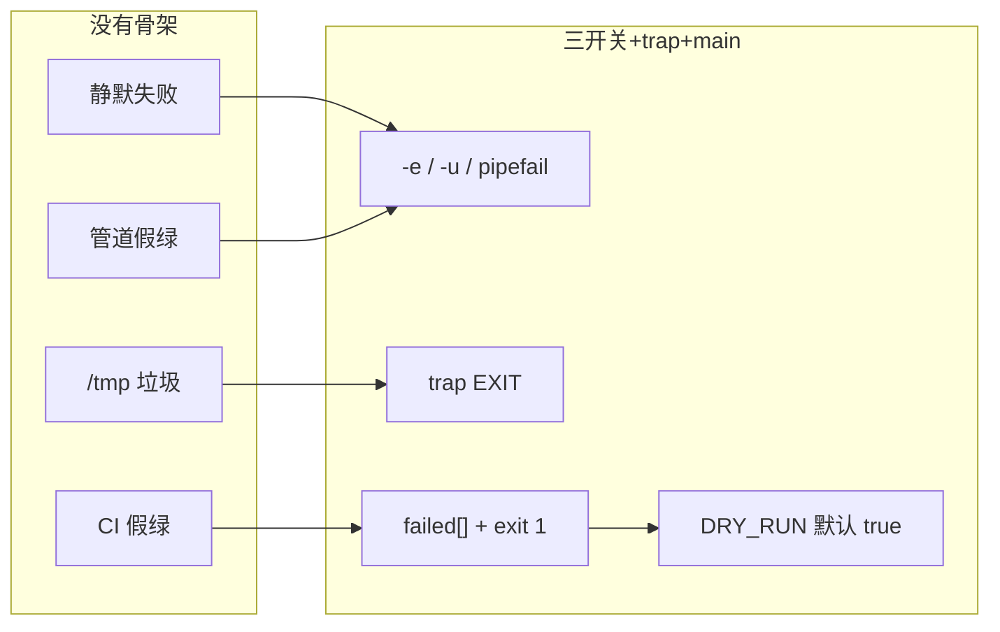

# 02｜脚本骨架与三开关

> 凌晨发版：脚本跑一半被 SIGTERM 掐断，`/tmp` 堆临时文件；有人去掉 `set -e`「好调试」，第 50 台 `nginx -t` 失败后面 49 台仍 reload——群里喊「再跑一遍就行」。
> **本章回答**：生产 Bash 从启动到安全退出——三开关筑基、`trap` 善后、`main` 收口、退出码交给 CI。
> **不讲**：变量展开与引号 → [03](../03-变量引号与参数展开/)；管道与 `PIPESTATUS` → [06](../06-管道重定向与PIPESTATUS/)；并发 `xargs -P` → [08](../08-并发与限流/)；完整发布模板 → [12](../12-生产脚本规范与模板/)。

**标记**：🎯重点 · 🔥难点 · ⭐常考 · 🔧实操

---

## 面试怎么考

| 标记 | 考点 |
|------|------|
| **核心** | `set -euo pipefail` 各管什么；`trap` 清理与信号；`main "$@"`；失败非 0 退出 |
| **必会** | `-e` 对 `if` / `\|\|` 的例外；`-u` 未定义变量；`pipefail` 管道左端失败 |
| **常用** | `trap 'rm -f "$tmp"' EXIT`；`ERR` 打行号；`DRY_RUN` 默认 true |
| **常考** | 三开关为何一起上；去掉 `-e` 的后果；SIGTERM 怎么优雅退出 |

> 📝 **面试（30 秒）**：生产 Bash 固定 `set -euo pipefail`——`-e` 失败即停、`-u` 禁未定义变量、`pipefail` 管道全链问责。`trap` 在 EXIT/INT/TERM 清理并打日志。逻辑进 `main`，底部 `main "$@"`。CI 只认退出码：失败写 stderr，`exit 1`。`DRY_RUN` 默认 true，真变更显式关。

---

## 能力边界

| 维度 | 三开关 + trap | 裸 for + ssh | Ansible / GitOps |
|------|---------------|--------------|------------------|
| **适合** | 10～500 台编排、CI 门禁、一次性发布 | 2～3 台 ad-hoc | 可审计、幂等、回滚 |
| **不适合** | 无失败策略的「尽力而为」 | 入库、无 dry-run | 5 分钟临时刀（过重） |
| **退出契约** | **非 0 = 失败**，CI 认 | 常假绿 | playbook failed hosts |

- 🔑 **四个零件各管一段**
  - `-e`：单条命令非 0 即停——**不**管管道左端（要 `pipefail`）
  - `-u`：拼错变量名即炸——**不**管逻辑分支写错
  - `pipefail`：`| tee` 不再吞失败——**不**管并发竞态（见 08）
  - `trap`：临时文件、锁、日志——**不**管远端已执行的不可逆操作

> ⚠️ **别混**：骨架保证「**错就停、停能清理、清理完告诉 CI**」——业务正确性还要 dry-run、并发上限、失败列表（08～10）。

---

## 语言最小集

写/读生产脚本，骨架层认这些即可：

```bash
#!/usr/bin/env bash
set -euo pipefail                    # 三开关
IFS=$'\n\t'                          # 可选：收紧分词（见 03）
SCRIPT_DIR="$(cd "$(dirname "${BASH_SOURCE[0]}")" && pwd)"

log() { printf '[%s] %s\n' "$(date '+%F %T')" "$*" >&2; }

cleanup() {
  local rc=$?
  [[ -n "${tmpfile:-}" && -f "$tmpfile" ]] && rm -f "$tmpfile"
  exit "$rc"                         # 保留原退出码
}
trap cleanup EXIT
trap 'log "INT"; exit 130' INT
trap 'log "TERM"; exit 143' TERM

main() {
  : # 业务逻辑
}

main "$@"
```

- 🧩 **四行钉子**
  - `set -euo pipefail` → 生产默认头
  - `trap ... EXIT` → 任何离开路径都清理
  - `main "$@"` → 参数原样传入，可 source 后单测
  - `exit "$rc"` in cleanup → **别把失败洗成 0**

零件认完，上主图。

---

## 一、一张图：脚本从启动到安全退出

> 🎯 **一句话**：**筑基（三开关）→ 注册善后（trap）→ 干正事（main）→ 交卷（exit code）**。


- 📖 **读图**
  - 🛤️ 主线四站：筑基 → 善后 → main → 交卷；卡在哪一站就查哪一站
  - 🧹 `trap EXIT` 在**任何**离开路径都会跑（正常结束、`exit`、信号）——临时文件和锁在这里收
  - 📟 CI 只认最后 `$?`；Jenkins 步骤里的 `set -e` **≠** 脚本内三开关，**脚本自己要写**

本节对应练习题 Q1、Q14。

---

## 二、筑基：`set -euo pipefail` 🎯⭐🔥

> 🎯 **一句话**：三开关挡住「静默失败、空变量、管道假绿」三类线上惨案。

### 🛑 `set -e`（errexit）

- 🔥 **大白话**：命令返回非 0 → **立即退出**（若干例外见下）
- ⭐ 高频错答：「开了 `-e` 就万事大吉」——先看例外

```bash
set -e
false
echo "不会执行"
```

- 📋 **`-e` 不退出的例外**（⭐常考）

  | 场景 | 示例 |
  |------|------|
  | `if` 条件 | `if false; then ...; fi` |
  | `while` / `until` 条件 | `while false; do ...; done` |
  | 逻辑或左侧 | `false \|\| echo ok` |
  | 管道（无 pipefail） | `false \| true` 整体 0 |

#### ❓ 为什么 `if false` 不触发 `-e`？

- 🧠 **设计意图**：条件判断**本来就要**看失败——若 `if` 里失败也退出，分支语句写不成
- ✅ **因此**：批处理里用 `if ! deploy_host; then failed+=; fi` 或 `deploy_host || failed+=` 才能「记失败、继续下一台」
- ❌ **别用**：`deploy_host || true` 糊失败——`-e` 被绕过，CI 假绿

```bash
set -e
kubectl apply -f bad.yaml || true   # 继续跑——假绿
kubectl apply -f bad.yaml           # 直接退出——对
```

> 📝 **面试**：`-e` 不是万能：管道默认只看最后一个，所以必须加 `pipefail`；别用 `|| true` 糊 kubectl。

### 🔤 `set -u`（nounset）

- 引用**未定义**变量 → 报错退出

```bash
set -u
echo "$HOSTNMAE"   # 拼写错误 → unbound variable
```

```bash
# 安全默认值（03 章展开）
echo "${HOSTNAME:-unknown}"
```

> 🔍 **现场**：发版脚本 `STAGE=prod` 漏 export，`-u` 在第一行引用就炸——比「静默用空串连错集群」好。

### 🔗 `set -o pipefail`

- 口诀：**管道问责看全链，不只看最后一个**
- 管道**任一**命令非 0 → 整条管道非 0

```bash
set -euo pipefail
kubectl get pods -A | tee /tmp/pods.txt | wc -l
# kubectl 失败 → 管道非 0 → -e 退出
```

```bash
# 无 pipefail：tee 成功 → 整体 0，kubectl 挂了也绿
set -e
kubectl get pods -A 2>/dev/null | tee /tmp/pods.txt
echo $?   # ← 0
```

#### ❓ 为什么三开关要一起上？

| 只开 | 仍可能 |
|------|--------|
| 只有 `-e` | 空变量、`false \| true` |
| 只有 `-u` | 命令失败继续跑 |
| 只有 `pipefail` | 未定义变量变空串 |

> 💡 **打个比方**：`-e` 是刹车，`-u` 是安全带，`pipefail` 是看后视镜——少一个都能撞。

> ⚠️ **别混**：Jenkins 里 `set -e` 只保护**单条** shell 步骤；脚本内部还要自己写全 `pipefail`。

```bash
# 生产固定头
#!/usr/bin/env bash
set -euo pipefail
```

本节对应练习题 Q1、Q2、Q3。

---

## 三、善后：`trap` 与信号 🔥⭐

> 🎯 **一句话**：`trap` 在脚本**离开前**跑清理；SIGINT/SIGTERM 要能收尾再退出。

### 🧹 EXIT trap

```bash
tmpfile="$(mktemp)"
trap 'rm -f "$tmpfile"' EXIT
# 正常结束或 set -e 退出都会 rm
```

- 🔥 **保留退出码**（本节难点）

```bash
cleanup() {
  local rc=$?
  rm -f "${tmpfile:-}"
  exit "$rc"
}
trap cleanup EXIT
```

#### ❓ 为什么 cleanup 必须先抓 `rc=$?`？

- 👻 **裸 `exit` 无参数**：退出码变成 cleanup **最后一条命令**的状态——常把失败**洗成 0**
- ✅ **口诀**：cleanup 先抓 `rc=$?`，再 `exit "$rc"`——别把失败洗成绿
- 📌 `$?` 必须在 cleanup **第一行**读：中间插 `rm`/`echo` 就丢了业务失败码

### 📍 ERR trap（可选）

```bash
on_err() {
  local ln=$1
  log "ERR at line $ln: $BASH_COMMAND"
}
trap 'on_err $LINENO' ERR
```

- 函数里要继承 ERR trap → `set -o errtrace`（`set -E`）；简单脚本用 `log` 即可

### 📡 INT / TERM

| 信号 | 谁发 | 脚本应 |
|------|------|--------|
| SIGINT (2) | Ctrl+C | 清理 + exit 130 |
| SIGTERM (15) | systemd、K8s 删 Pod | 清理 + exit 143，别死扛 |

```bash
trap 'log "received TERM, stopping..."; exit 143' TERM
trap 'log "received INT"; exit 130' INT
```

#### ❓ 为什么已有 EXIT trap 还要单独 trap TERM？

- 🚪 **EXIT 负责「怎么走」**：删临时文件、放锁——**不负责**「收到信号时要不要立刻停接收新任务」
- ⏱️ **TERM 负责「何时停」**：打日志、停收新主机、当前步骤收尾后 `exit 143`
- ☠️ **不捕 TERM**：K8s `terminationGracePeriodSeconds` 到期 → SIGKILL 137，cleanup 也可能跑不完

> 🔍 **现场**：K8s `preStop` + grace 窗口内，脚本必须响应 TERM；长循环里在 `deploy_one` 内也要能被打断（见 08）。

> 📝 **面试**：`trap EXIT` 做 rm / flock；TERM 时停止接收新任务、写完当前步骤就 exit。

本节对应练习题 Q4、Q5。

---

## 四、结构：`main` 与参数 ⭐

> 🎯 **一句话**：业务全进 `main`，底部 `main "$@"`——可测试、可 source、入口单一。

```bash
#!/usr/bin/env bash
set -euo pipefail

usage() {
  echo "Usage: $0 [--dry-run] hosts.txt" >&2
  exit 2
}

main() {
  local dry_run=true
  [[ "${1:-}" == "--dry-run" ]] && { dry_run=true; shift; }
  [[ $# -eq 1 ]] || usage
  local hosts_file=$1
  [[ -f "$hosts_file" ]] || { log "missing file: $hosts_file"; exit 1; }
  # ...
}

main "$@"
```

- ✅ **好处**
  - `source script.sh` 后只定义函数，**不会误跑**（执行放最后）
  - 单测：`source ./deploy.sh && main --dry-run test_hosts.txt`
  - `"$@"` 保留带空格的参数（比 `$*`）

#### ❓ 为什么不能全局裸写业务逻辑？

- 🧪 **source 测函数**时，文件一加载就跑完全部——污染环境、误改生产
- 🎯 **入口单一**：参数校验、dry-run、失败汇总都在 `main`，读者扫一眼知道从哪进

> ⚠️ **别混**：`main "$@"` vs `main $*`——后者在 IFS 下拆坏含空格参数。

本节对应练习题 Q6、Q7。

---

## 五、交卷：退出码与 DRY_RUN ⭐🔧

> 🎯 **一句话**：**局部失败可记列表，全局契约是 `exit 1` 让 CI 红**；`DRY_RUN` 默认 true。

### 模式 1：遇错即停（默认）

```bash
set -euo pipefail
nginx -t
systemctl reload nginx
```

### 模式 2：批处理汇总失败（08 完整版）

```bash
failed=()
for h in "${hosts[@]}"; do
  if ! deploy_host "$h"; then
    failed+=("$h")
  fi
done
if ((${#failed[@]} > 0)); then
  printf 'failed: %s\n' "${failed[*]}" >&2
  exit 1
fi
```

#### ❓ 为什么 `set -e` 下还要 `cmd || failed+=`？

- 🛑 **裸调** `deploy_host "$h"`：第一台失败整脚本 exit，走不到下一台
- ✅ **捕获失败**：`deploy_host || failed+=` / `if ! deploy_host`——利用 `-e` 例外，记列表后继续
- 📟 **最后** `exit 1`：局部可容错，全局仍告诉 CI「这次红了」

```bash
# 错：失败直接 exit
deploy_host "$h"

# 对
deploy_host "$h" || failed+=("$h")
```

### 🦺 DRY_RUN 默认 true（⭐常考）

```bash
DRY_RUN="${DRY_RUN:-true}"

deploy_host() {
  local host=$1
  if [[ "$DRY_RUN" == "true" ]]; then
    log "[DRY-RUN] would deploy to $host"
    return 0
  fi
  scp -q cfg "$host:/etc/app/" && ssh -n "$host" "nginx -t && systemctl reload nginx"
}
```

```bash
# 真执行必须显式：
DRY_RUN=false ./deploy.sh hosts.txt
```

#### ❓ 为什么默认 true 而不是 false？

- 📋 **拷贝脚本忘改环境** → 默认 false 会直接打生产
- ✅ **安全默认**：演练/CI 干跑是 0 成本；真变更要变更单 + 显式 `DRY_RUN=false`
- 🔗 参数解析细节见 [09](../09-参数解析与dry-run/)

本节对应练习题 Q8、Q9、Q10。

---

## 六、收束：骨架凭什么能上线

> 🎯 **一句话**：八件套把「静默失败 / 假绿 / 垃圾文件 / 误操作」压成可审计退出。



- 📖 **读图**
  - 左列四类事故 → 右列四类对策；骨架是**映射**，不是「多写几行漂亮代码」
  - ⚠️ 右列**不保证**远端事务回滚——第 50 台失败前 49 台可能已 reload

**可背清单**：

1. 头两行：`#!/usr/bin/env bash` + `set -euo pipefail`
2. `mktemp` + `trap EXIT`，cleanup 保留 `$?`
3. TERM/INT → exit 130/143
4. `main "$@"`，业务不进全局
5. 批处理：`failed[]` + 最后 `exit 1`
6. `DRY_RUN` 默认 true
7. 日志 `>&2`，stdout 留给机器可读结果
8. 依赖 `command -v` 前置检查（01 章）

> ⚠️ **别混**：骨架**不保证**远端回滚——回滚是另一套 job（见练习题 Q11）。
> 📝 **面试**：八件套按「拦失败 / 善后 / 入口 / 交卷」四组背，别背成无序 bullet。

本节对应练习题 Q10、Q11、Q12。

---

## 七、作战：跑一半挂了与 CI 假绿 🔧

> 🎯 **一句话**：先看头 20 行有没有三开关和 trap，再决定动刀——别先去掉 `-e`。

| 现象 | 先做 | 别做 |
|------|------|------|
| `/tmp` 一堆 `.tmp` | 查 EXIT trap | 靠 cron 扫垃圾代替 |
| 管道步骤绿但前面失败 | 查 `pipefail` | 只加 `set -e` |
| 批处理只跑第一台 | `-e` 下未捕获失败 | 去掉 `-e`「修好」 |
| Pod 卡 Terminating | 脚本是否捕 TERM | 忽略信号硬跑 |
| 变量空串连错环境 | 开 `-u` + 默认值 | 到处 `\|\| true` |

### 60 秒剧本 🔧

> 🔍 **现场**：接到「脚本挂了 / CI 假绿」，60 秒走完再改生产。

```text
① 0–10s   head -20 script.sh → 有没有三开关和 trap
② 10–30s  测试环境 bash -x script.sh → 看在哪条 exit
③ 30–45s  故意 false | true；echo $? → 验证 pipefail
④ 45–60s  DRY_RUN=false 前确认 hosts 与变更单
```

本节对应练习题 Q13、Q14。

---

## 生产模板

### 模板 1：标准骨架（单目标）

```bash
#!/usr/bin/env bash
set -euo pipefail

SCRIPT_DIR="$(cd "$(dirname "${BASH_SOURCE[0]}")" && pwd)"
# shellcheck source=./lib.sh
source "${SCRIPT_DIR}/lib.sh"

tmpfile=""
cleanup() {
  local rc=$?
  [[ -n "$tmpfile" && -f "$tmpfile" ]] && rm -f "$tmpfile"
  exit "$rc"
}
trap cleanup EXIT
trap 'log "INT"; exit 130' INT
trap 'log "TERM"; exit 143' TERM

main() {
  tmpfile="$(mktemp)"
  need_cmd kubectl
  kubectl get nodes -o wide >"$tmpfile"
  wc -l <"$tmpfile"
}

main "$@"
```

### 模板 2：批量 Nginx reload（dry-run + 失败列表）

```bash
#!/usr/bin/env bash
set -euo pipefail

DRY_RUN="${DRY_RUN:-true}"
CONFIG_SRC="${CONFIG_SRC:-./nginx.conf}"
CONFIG_DST="${CONFIG_DST:-/etc/nginx/nginx.conf}"
HOSTS_FILE="${1:-hosts.txt}"

log() { printf '[%s] %s\n' "$(date '+%F %T')" "$*" >&2; }

deploy_host() {
  local host=$1
  if [[ "$DRY_RUN" == "true" ]]; then
    log "[DRY-RUN] $host: backup scp nginx -t reload"
    return 0
  fi
  ssh -n "$host" "cp -a '$CONFIG_DST' '${CONFIG_DST}.bak.$(date +%Y%m%d%H%M%S)'"
  scp -q "$CONFIG_SRC" "$host:$CONFIG_DST"
  ssh -n "$host" "nginx -t && systemctl reload nginx"
}

main() {
  [[ -f "$HOSTS_FILE" ]] || { log "missing $HOSTS_FILE"; exit 1; }
  local failed=()
  while read -r host; do
    [[ -z "$host" || "$host" =~ ^# ]] && continue
    deploy_host "$host" || failed+=("$host")
  done <"$HOSTS_FILE"

  if ((${#failed[@]} > 0)); then
    log "failed hosts: ${failed[*]}"
    exit 1
  fi
  log "ok"
}

main "$@"
```

```bash
# 演练
./deploy-nginx.sh hosts.txt
DRY_RUN=false ./deploy-nginx.sh hosts.txt
```

### 模板 3：CI 门禁 + flock 互斥

```bash
#!/usr/bin/env bash
set -euo pipefail

# --- CI 门禁 ---
main_ci() {
  docker build -t "reg/app:${GIT_SHA:?}" .
  trivy image --exit-code 1 --severity CRITICAL "reg/app:${GIT_SHA}"
  docker push "reg/app:${GIT_SHA}"
}
# 任一步非 0 → CI 红；禁止 trivy ... || true

# --- cron 互斥 ---
main_cron() {
  LOCK=/var/lock/myjob.lock
  exec 9>"$LOCK"
  flock -n 9 || { echo "another instance running" >&2; exit 0; }
  trap 'flock -u 9' EXIT
  /usr/local/bin/do_sync.sh
}
```

---

## 踩坑清单

| 现象 | 原因 | 修法 |
|------|------|------|
| CI 绿但变更未生效 | `\|\| true`、无 pipefail | 三开关；去掉糊失败 |
| 只部署了第一台 | `set -e` + 循环内裸失败 | `cmd \|\| failed+=` |
| cleanup 把失败洗成 0 | trap 里裸 `exit` | `local rc=$?; exit "$rc"` |
| `/tmp` 泄漏 | 无 EXIT trap | `mktemp` + trap rm |
| Terminating 很久 | 不捕 TERM | trap TERM + 缩短步骤 |
| unbound variable | `-u` + 拼写错 | 修拼写或 `${var:-}` |
| source 脚本误执行 | 底部直接写逻辑 | 收进 `main` |
| DRY_RUN 默认 false | 误操作生产 | 默认 true |
| ERR trap 函数里不触发 | 未 `set -E` | 简单脚本用 log |
| 并发过高打满 SSH | 无 `-P` 限制 | `xargs -P`（08） |

---

## 必会 · 常考

| 说法 | 对错 | 口径 |
|------|:----:|------|
| `set -e` 能捕获管道左端失败 | 错 | 要 `pipefail` |
| `if false; then` 会触发 -e 退出 | 错 | if 条件是例外 |
| `-u` 对 `${var:-}` 报错 | 错 | 有默认值不报错 |
| trap EXIT 只在成功时跑 | 错 | 失败、信号也跑 |
| 去掉 `-e` 更好调试 | 错 | 用 `bash -x`、DRY_RUN |
| `main "$@"` 可有可无 | 错 | 可测试、防 source 误跑 |
| 批处理失败应 silent | 错 | stderr 列 host + `exit 1` |
| TERM 可以忽略 | 错 | K8s/systemd 会 SIGKILL |
| `DRY_RUN` 应默认 false | 错 | 默认 true 防误操作 |
| Jenkins `set -e` 等于脚本三开关 | 错 | 脚本自己要写全 |

---

## 收口

### 命令速查 🔧

```bash
bash -n script.sh              # 语法检查
bash -x script.sh              # 跟踪（禁泄密）
shellcheck script.sh           # 静态检查（11 章）
trap -p                        # 看当前 trap 表
set -o | grep -E 'errexit|pipefail|nounset'
DRY_RUN=false ./script.sh      # 真执行
```

### 面试锚点

遮住右列自问自答，卡壳的行回去重读对应小节。

| 问 | 30 秒答 |
|----|---------|
| 三开关分别什么？ | `-e` 失败即停；`-u` 未定义变量错；`pipefail` 管道全链问责 |
| `-e` 什么时候不退出？ | `if`/`while` 条件、`false \|\| true`、无 pipefail 的管道 |
| trap 干什么？ | 退出/信号时清理临时文件、释放锁、打日志 |
| 为什么 cleanup 要 `exit $rc`？ | 避免清理把失败洗成 0 |
| 批处理怎么又 `-e` 又跑完全部？ | 循环里 `cmd \|\| failed+=`，最后 `exit 1` |
| DRY_RUN 为什么默认 true？ | 防误操作；真变更显式 false |

### 易错一句话对照

- 开了 `-e` 就万事大吉 → 管道默认只看最后一个，必须加 `pipefail`
- `if false` 会触发 `-e` 退出 → 条件判断是例外，批处理靠这个记失败
- cleanup 里裸 `exit` → 会把失败洗成 0；先 `rc=$?` 再 `exit "$rc"`
- 有 EXIT trap 就不用捕 TERM → EXIT 管清理，TERM 管「何时停接收」
- 去掉 `-e` 更好调试 → 用 `bash -x` / DRY_RUN，别拆刹车
- 全局裸写业务逻辑 → source 会误跑；收进 `main "$@"`
- `main $*` 和 `main "$@"` 一样 → `$*` 会拆坏含空格参数
- 批处理失败 silent 即可 → stderr 列 host + `exit 1`，CI 才红
- `DRY_RUN` 默认 false → 拷贝脚本直接打生产；默认 true
- Jenkins `set -e` = 脚本三开关 → 脚本自己要写全 `-euo pipefail`
- 三开关能保证前 49 台回滚 → 不保证远端事务；回滚另开 job

### 数字墙

> exit **130** = INT（128+2）；exit **143** = TERM（128+15）；SIGKILL = **137**。批处理并发常用 `xargs -P 10`（08）。`DRY_RUN` 默认 **true**。

---

## 合上书

- [ ] **默写**脚本头 15 行：shebang、三开关、trap、cleanup 保留 `$?`、`main "$@"`（Q1、Q4、Q6）
- [ ] 没有 `pipefail` 时，`false | true` 的 `$?` 是多少？对 CI 意味着什么？（Q2）
- [ ] `set -e` 下裸 `deploy` 循环 vs `deploy || failed+=` 差在哪？（Q3、Q8）
- [ ] SIGTERM 和 EXIT trap 各管什么？为什么要单独 trap TERM？（Q5）
- [ ] **默画**批量发布数据流：hosts → dry-run → scp → nginx -t → reload → failed 列表（Q9、Q14）
- [ ] 说出三个让 CI「假绿」的 Shell 写法及修法（Q10）
- [ ] `main "$@"` 比全局裸逻辑好在哪里？（Q6）
- [ ] 第 50 台失败时，三开关能保证前 49 台回滚吗？（Q11）

八题能口述，骨架过关。下一章钉死引号与 `${var:-}`，三开关才不会被空变量误伤。
