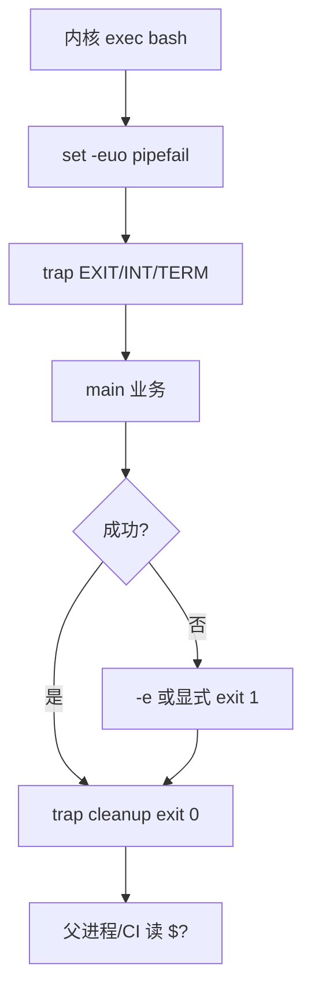

# 02｜脚本骨架与三开关 · SRE 开发能力

> 大家好，欢迎来到这次分享。开讲之前，先带大家回到一个凌晨发版的现场：
> 脚本跑到一半被 SIGTERM 掐断，临时文件堆在 `/tmp`；有人把 `set -e` 去掉「好调试」，第 50 台 `nginx -t` 失败后面 49 台仍 reload——群里已经有人在喊「再跑一遍就行」。
> 这一章讲完，你会知道当时那两个人各自错在哪——**不是命令不会写，是脚本没有「从启动到安全退出」的骨架**。
> **本章回答的问题**：生产 Bash 脚本的标准生命周期——三开关筑基、`trap` 善后、`main` 收口、退出码交给 CI。
> **本章不讲**：变量展开与引号 → [03 变量引号与参数展开](../03-变量引号与参数展开/)；管道与 `PIPESTATUS` → [06 管道重定向与PIPESTATUS](../06-管道重定向与PIPESTATUS/)；并发 `xargs -P` → [08 并发与限流](../08-并发与限流/)；完整发布模板 → [12 生产脚本规范与模板](../12-生产脚本规范与模板/)。

**怎么听这场分享**：先把「一个脚本从启动到安全退出」主图装进脑子——筑基 → 善后 → main → 交卷；第二到第五节顺着这条线走；第六节收束清单；第七节专门讲开头那个「跑一半挂了 / CI 假绿」怎么定责。每一节讲完会提示对应练习题，趁热打铁。

## 面试怎么考

| 标记 | 考点 |
|------|------|
| **核心** | `set -euo pipefail` 各管什么；`trap` 清理与信号；`main "$@"` 结构；失败时非 0 退出 |
| **必会** | `-e` 对 `if cmd`、`cmd \|\|` 的例外；`-u` 未定义变量；`pipefail` 管道左端失败 |
| **常用** | `trap 'rm -f "$tmp"' EXIT`；`ERR` trap 打行号；`DRY_RUN` 默认 true |
| **常考** | 为什么三开关要一起上；去掉 `-e` 的后果；systemd/K8s 发 SIGTERM 时怎么优雅退出 |

**30 秒怎么说**：生产 Bash 开头固定 `set -euo pipefail`——`-e` 命令失败就停，`-u` 未定义变量当错误，`-pipefail` 管道任一环节失败整体失败。`trap` 在 EXIT/ERR/INT/TERM 做清理和日志。逻辑放 `main`，底部 `main "$@"`，方便 source 测试。CI 只看退出码：失败汇总写 stderr，`exit 1`。默认 `DRY_RUN=true`，真变更要显式关。

---

## 能力边界

| 维度 | 有三开关 + trap 的脚本 | 裸 for 循环 ssh | Ansible / GitOps |
|------|------------------------|-----------------|------------------|
| **适合** | 10～500 台编排、CI 门禁、一次性发布 | 2～3 台 ad-hoc | 可审计、幂等、回滚 |
| **不适合** | 无失败策略的「尽力而为」 | 入库、无 dry-run | 5 分钟临时刀（过重） |
| **退出契约** | **非 0 = 失败**，Jenkins/GitLab 认 | 常假绿 | playbook failed hosts |

| 开关 | 解决什么 | 不解决什么 |
|------|----------|------------|
| `-e` | 单条命令非 0 即停 | 管道左端（要靠 pipefail） |
| `-u` | 拼写错误的变量名 | 逻辑分支写错 |
| `pipefail` | `\| tee` 吞失败 | 并发竞态（靠限流） |
| `trap` | 临时文件、子进程 | 远端已执行的不可逆操作 |

> **记住**：骨架保证「**错就停、停能清理、清理完告诉 CI**」——业务正确性还要 dry-run、并发上限、失败列表（08～10 章）。

好，边界清楚了。先把骨架层的「最小零件」过一遍——后面每一节都是这些行的展开。

---

## 语言最小集

写/读生产脚本，骨架层只需认这些：

```bash
#!/usr/bin/env bash
set -euo pipefail                    # 三开关：失败即停、禁未定义变量、管道全链问责
IFS=$'\n\t'                          # 可选：收紧分词，路径含空格更安全（见 03）
SCRIPT_DIR="$(cd "$(dirname "${BASH_SOURCE[0]}")" && pwd)"  # 脚本所在目录

log() { printf '[%s] %s\n' "$(date '+%F %T')" "$*" >&2; }   # 日志走 stderr

cleanup() {
  local rc=$?
  [[ -n "${tmpfile:-}" && -f "$tmpfile" ]] && rm -f "$tmpfile"
  exit "$rc"                           # 保留原退出码
}
trap cleanup EXIT
trap 'log "INT"; exit 130' INT
trap 'log "TERM"; exit 143' TERM

main() {
  : # 业务逻辑
}

main "$@"
```

| 行 | 作用 |
|----|------|
| `set -euo pipefail` | 三开关，生产默认 |
| `trap ... EXIT` | 无论成功失败都清理 |
| `main "$@"` | 参数原样传入，可被单元测试 source 后调 `main` |
| `exit "$rc"` in cleanup | 清理后不把失败洗成 0 |

零件认完，咱们上主图——一个脚本从启动到安全退出，中间过哪几站。

---

## 一、一张图：一个脚本从启动到安全退出的一生

> 🎯 **一句话**：**筑基（三开关）→ 注册善后（trap）→ 干正事（main）→ 交卷（exit code）**。



**读图**：咱们先把这张图当地图——`trap EXIT` 在**任何**离开路径都会跑（正常结束、`exit`、信号）——临时文件和锁在这里收。CI 只认最后 `$?`；Jenkins `set -e` 不等价于脚本里的三开关，**脚本自己要写**。

好，主图装进脑子了。接下来从「筑基」开始——大家想想：为什么三个开关要一起上，少一个会怎样？

本节对应练习题 Q1、Q14。

---

## 二、筑基：`set -euo pipefail` 逐个讲透

> 🎯 **一句话**：三开关把「静默失败、空变量、管道假绿」三类线上惨案挡在门外。

### `set -e`（errexit）

🔥 大白话先钉死：命令返回非 0 → **立即退出**（若干例外见下）。很多人以为「开了 `-e` 就万事大吉」——⭐ 这是高频错答，先看例外表。

```bash
set -e
false
echo "不会执行"
```

**例外（⭐常考）**——这些非 0 **不会**触发 `-e` 退出：

| 场景 | 示例 |
|------|------|
| `if` 测试条件 | `if false; then ...; fi` |
| `while` / `until` 条件 | `while false; do ...; done` |
| 逻辑或左侧 | `false \|\| echo ok` |
| 逻辑与右侧 | `true && false` 会退（右侧是简单命令） |
| 管道（无 pipefail） | `false \| true` 整体 0 |

> 📝 **面试**：「`-e` 不是万能：管道默认只看最后一个；所以必须加 `pipefail`。别用 `|| true` 糊 kubectl 失败。」

```bash
set -e
kubectl apply -f bad.yaml || true   # 继续跑——CI 假绿
kubectl apply -f bad.yaml           # 直接退出——对
```

### `set -u`（nounset）

引用**未定义**变量 → 报错退出。

```bash
set -u
echo "$HOSTNMAE"   # HOSTNMAE 拼写错误 → unbound variable
```

```bash
# 安全默认值（03 章展开）
echo "${HOSTNAME:-unknown}"
```

> 🔍 **现场**：发版脚本 `STAGE=prod` 漏 export，`-u` 在第一行引用就炸——比「静默用空串连错集群」好。

### `set -o pipefail`

口诀：**管道问责看全链，不只看最后一个**。管道**任一**命令非 0 → 整条管道非 0。

```bash
set -euo pipefail
kubectl get pods -A | tee /tmp/pods.txt | wc -l
# kubectl 失败 → 管道非 0 → -e 退出
```

对比无 pipefail：

```bash
set -e
kubectl get pods -A 2>/dev/null | tee /tmp/pods.txt
echo $?   # 0——tee 成功，kubectl 挂了也绿
```

> ⚠️ **别混**：Jenkins 里 `set -e` 只保护**单条** shell 步骤；脚本内部还要自己 `pipefail`。

### 三开关一起上的理由

| 只开 | 仍可能 |
|------|--------|
| 只有 `-e` | 空变量、`false \| true` |
| 只有 `-u` | 命令失败继续跑 |
| 只有 `pipefail` | 未定义变量变空串 |

> 💡 **打个比方**：`-e` 是刹车，`-u` 是安全带，`-pipefail` 是看后视镜——少一个都能撞。

三开关钉死了，接下来自然会问：脚本被掐断或出错退出时，临时文件和锁谁来收？

本节对应练习题 Q1、Q2、Q3。

三开关钉死了，接下来自然会问：脚本被掐断或出错退出时，临时文件和锁谁来收？

本节对应练习题 Q1、Q2、Q3。

```bash
# 生产固定头（可复制）
#!/usr/bin/env bash
set -euo pipefail
```

---

## 三、善后：`trap` 与信号

> 🎯 **一句话**：`trap` 在脚本**离开前**跑清理；SIGINT/SIGTERM 要能收尾再退出。

### EXIT trap

🔥 保留退出码是本节难点。大家想想：cleanup 里写了个裸 `exit`，失败会被怎样？

```bash
tmpfile="$(mktemp)"
trap 'rm -f "$tmpfile"' EXIT

# 业务用 $tmpfile ...
# 正常结束或 set -e 退出都会 rm
```

**保留退出码**（🔥难点）：

```bash
cleanup() {
  local rc=$?
  rm -f "${tmpfile:-}"
  # 可选：删锁文件、打日志
  exit "$rc"
}
trap cleanup EXIT
```

若 `cleanup` 里最后裸 `exit` 无参数，会把失败**洗成 0**。口诀：**cleanup 先抓 `rc=$?`，再 `exit "$rc"`——别把失败洗成绿**。

### ERR trap（可选，打行号）

```bash
on_err() {
  local ln=$1
  log "ERR at line $ln: $BASH_COMMAND"
}
trap 'on_err $LINENO' ERR
```

需 `set -o errtrace`（`set -E`）才能在函数里继承 ERR trap——复杂脚本才需要。

### INT / TERM

| 信号 | 谁发 | 脚本应 |
|------|------|--------|
| SIGINT (2) | Ctrl+C | 清理 + exit 130 |
| SIGTERM (15) | systemd、K8s 删 Pod | 清理 + exit 143，别死扛 |

```bash
trap 'log "received TERM, stopping..."; exit 143' TERM
trap 'log "received INT"; exit 130' INT
```

> 🔍 **现场**：K8s `preStop` + `terminationGracePeriodSeconds` 内，脚本必须响应 TERM，否则被 SIGKILL 137。

```bash
# 长循环里周期性检查（片段）
while read -r host; do
  deploy_one "$host"
done < hosts.txt
# 更好：在 deploy_one 内也 trap TERM，或用心跳文件（08 章）
```

> 📝 **面试**：「`trap EXIT` 做 rm 临时文件、释放 flock；TERM 时停止接收新任务、写完当前步骤就 exit。」

善后讲完，业务逻辑放哪？——别散在全局，收进 `main`。

本节对应练习题 Q4、Q5。

---

## 四、结构：`main` 与参数

> 🎯 **一句话**：业务全进 `main`，底部 `main "$@"`——可测试、可 source、入口单一。

```bash
#!/usr/bin/env bash
set -euo pipefail

usage() {
  echo "Usage: $0 [--dry-run] hosts.txt" >&2
  exit 2
}

main() {
  local dry_run=true
  [[ "${1:-}" == "--dry-run" ]] && { dry_run=true; shift; }
  [[ $# -eq 1 ]] || usage
  local hosts_file=$1
  [[ -f "$hosts_file" ]] || { log "missing file: $hosts_file"; exit 1; }
  # ...
}

main "$@"
```

好处：

- `source script.sh` 后只定义函数，**不会误跑**（没有底部 `main` 调用才会误跑——所以要把执行放最后）
- 测试：`source ./deploy.sh && main --dry-run test_hosts.txt`
- `$@` 保留带空格的参数（比 `$*` 常用）

> ⚠️ **别混**：`main "$@"` 和 `main $*`——后者会在 IFS 下拆坏含空格的参数。

入口单一了，最后一站：怎么把失败交给 CI——以及 `DRY_RUN` 为什么默认 true。

本节对应练习题 Q6、Q7。

---

## 五、交卷：退出码与失败汇总

> 🎯 **一句话**：**局部失败可记列表，全局契约是 `exit 1` 让 CI 红**。

### 模式 1：遇错即停（默认）

```bash
set -euo pipefail
nginx -t
systemctl reload nginx
```

### 模式 2：批处理汇总失败（08 章完整版）

```bash
failed=()
for h in "${hosts[@]}"; do
  if ! deploy_host "$h"; then
    failed+=("$h")
  fi
done
if ((${#failed[@]} > 0)); then
  printf 'failed: %s\n' "${failed[*]}" >&2
  exit 1
fi
```

> **关键**：循环里用 `if ! deploy_host` 或 `deploy_host || failed+=`——**不要**在 `set -e` 下裸调会失败的函数而不捕获。

```bash
# set -e 下错误写法
deploy_host "$h"    # 失败直接 exit，走不到下一台

# 正确
deploy_host "$h" || failed+=("$h")
```

### DRY_RUN 默认 true（⭐常考）

⭐ 这是面试必考，也是防误操作的底线。大家想想：默认 false 会怎样？——有人拷贝脚本忘改环境，直接打生产。

```bash
DRY_RUN="${DRY_RUN:-true}"

deploy_host() {
  local host=$1
  if [[ "$DRY_RUN" == "true" ]]; then
    log "[DRY-RUN] would deploy to $host"
    return 0
  fi
  scp -q cfg "$host:/etc/app/" && ssh -n "$host" "nginx -t && systemctl reload nginx"
}
```

```bash
# 真执行必须显式：
DRY_RUN=false ./deploy.sh hosts.txt
```

---

## 六、原理收束：骨架凭什么能上线

```mermaid
flowchart LR
    subgraph 没有骨架
        A1[静默失败]
        A2[管道假绿]
        A3[/tmp 垃圾]
        A4[CI 假绿]
    end
    subgraph 三开关+trap+main
        B1[-e / -u / pipefail]
        B2[trap EXIT]
        B3[failed 列表 exit 1]
        B4[DRY_RUN 默认 true]
    end
    A1 --> B1
    A2 --> B1
    A3 --> B2
    A4 --> B3
    B3 --> B4
```

**可背清单**：

1. 头两行：`#!/usr/bin/env bash` + `set -euo pipefail`
2. `mktemp` + `trap EXIT` 删临时文件，cleanup 保留 `$?`
3. TERM/INT 打日志并 exit 130/143
4. `main "$@"`，业务不进全局裸执行
5. 批处理：`failed[]` + 最后 `exit 1`
6. `DRY_RUN` 默认 true，变更单显式 false
7. 日志 `>&2`，stdout 留给机器可读结果
8. 依赖 `command -v` 前置检查（01 章）

> ⚠️ **别混**：骨架**不保证**远端事务——第 50 台失败前 49 台可能已 reload，回滚是另一套 job（见 05 实战题）。

现在再看群里那句「再跑一遍就行」和「去掉 `-e` 好调试」，你知道该怎么拦住他了。收口前先把作战剧本过一遍。

本节对应练习题 Q10、Q11、Q12。

---

## 七、作战：脚本「跑一半挂了」与 CI 假绿

| 现象 | 先做 | 别做 |
|------|------|------|
| `/tmp` 一堆 `.tmp` | 查是否有 EXIT trap | 靠 cron 扫垃圾代替 |
| 管道步骤绿但前面失败 | 查是否缺 `pipefail` | 只加 `set -e` |
| 批处理只跑第一台 | `set -e` 下未捕获失败 | 去掉 `-e`「修好」 |
| K8s 删 Pod 卡 Terminating | 脚本是否捕 TERM | 忽略信号硬跑 |
| 变量空串连错环境 | 开 `-u` + 默认值 | 到处 `|| true` |

**60 秒剧本** 🔧：

| 时段 | 动作 |
|------|------|
| 0–10s | `head -20 script.sh` 看有没有三开关和 trap |
| 10–30s | `bash -x script.sh`（测试环境）看在哪条 exit |
| 30–45s | 故意 `false \| true`，`echo $?` 验证 pipefail |
| 45–60s | `DRY_RUN=false` 前确认 hosts 文件与变更单 |

下面是可复制的生产模板（代码块一字不改，直接拿走）。

本节对应练习题 Q13、Q14。

---

## 生产模板

### 模板 1：标准骨架（单目标）

```bash
#!/usr/bin/env bash
set -euo pipefail

SCRIPT_DIR="$(cd "$(dirname "${BASH_SOURCE[0]}")" && pwd)"
# shellcheck source=./lib.sh
source "${SCRIPT_DIR}/lib.sh"

tmpfile=""
cleanup() {
  local rc=$?
  [[ -n "$tmpfile" && -f "$tmpfile" ]] && rm -f "$tmpfile"
  exit "$rc"
}
trap cleanup EXIT
trap 'log "INT"; exit 130' INT
trap 'log "TERM"; exit 143' TERM

main() {
  tmpfile="$(mktemp)"
  need_cmd kubectl
  kubectl get nodes -o wide >"$tmpfile"
  wc -l <"$tmpfile"
}

main "$@"
```

### 模板 2：批量 Nginx reload（dry-run + 失败列表）

```bash
#!/usr/bin/env bash
set -euo pipefail

DRY_RUN="${DRY_RUN:-true}"
PARALLEL="${PARALLEL:-10}"
CONFIG_SRC="${CONFIG_SRC:-./nginx.conf}"
CONFIG_DST="${CONFIG_DST:-/etc/nginx/nginx.conf}"
HOSTS_FILE="${1:-hosts.txt}"

log() { printf '[%s] %s\n' "$(date '+%F %T')" "$*" >&2; }

deploy_host() {
  local host=$1
  if [[ "$DRY_RUN" == "true" ]]; then
    log "[DRY-RUN] $host: backup scp nginx -t reload"
    return 0
  fi
  ssh -n "$host" "cp -a '$CONFIG_DST' '${CONFIG_DST}.bak.$(date +%Y%m%d%H%M%S)'"
  scp -q "$CONFIG_SRC" "$host:$CONFIG_DST"
  ssh -n "$host" "nginx -t && systemctl reload nginx"
}

main() {
  [[ -f "$HOSTS_FILE" ]] || { log "missing $HOSTS_FILE"; exit 1; }
  local failed=()
  while read -r host; do
    [[ -z "$host" || "$host" =~ ^# ]] && continue
    deploy_host "$host" || failed+=("$host")
  done <"$HOSTS_FILE"

  if ((${#failed[@]} > 0)); then
    log "failed hosts: ${failed[*]}"
    exit 1
  fi
  log "ok"
}

main "$@"
```

```bash
# 演练
./deploy-nginx.sh hosts.txt
DRY_RUN=false PARALLEL=10 ./deploy-nginx.sh hosts.txt
```

### 模板 3：CI 门禁片段

```bash
#!/usr/bin/env bash
set -euo pipefail

main() {
  docker build -t "reg/app:${GIT_SHA:?}" .
  trivy image --exit-code 1 --severity CRITICAL "reg/app:${GIT_SHA}"
  docker push "reg/app:${GIT_SHA}"
}

main "$@"
# 任一步非 0 → CI 红；禁止 trivy ... || true
```

### 模板 4：带 flock 的 cron 互斥

```bash
#!/usr/bin/env bash
set -euo pipefail

LOCK=/var/lock/myjob.lock
exec 9>"$LOCK"
flock -n 9 || { echo "another instance running" >&2; exit 0; }

main() {
  /usr/local/bin/do_sync.sh
}

trap 'flock -u 9' EXIT
main "$@"
```

---

## 踩坑清单

| 现象 | 原因 | 修法 |
|------|------|------|
| CI 绿但变更未生效 | `|| true`、无 pipefail | 三开关；去掉糊失败 |
| 只部署了第一台 | `set -e` + 循环内裸失败 | `cmd \|\| failed+=` |
| cleanup 把失败洗成 0 | `trap` 里裸 `exit` | `local rc=$?; exit "$rc"` |
| `/tmp` 泄漏 | 无 EXIT trap | `mktemp` + trap rm |
| Terminating 很久 | 不捕 TERM | trap TERM + 缩短步骤 |
| `unbound variable` | `-u` + 拼写错 | 修拼写或 `${var:-}` |
| source 脚本误执行 | 底部直接写逻辑 | 收进 `main`，底部才调用 |
| DRY_RUN 默认 false | 误操作生产 | 默认 true，文档写清 |
| ERR trap 函数里不触发 | 未 `set -E` | 简单脚本用 log 即可 |
| 并发过高打满 SSH | 无 `-P` 限制 | `xargs -P`（08 章） |

---

## 必会 · 常考

| 说法 | 对错 | 口径 |
|------|:----:|------|
| `set -e` 能捕获管道左端失败 | 错 | 要 `pipefail` |
| `if false; then` 会触发 -e 退出 | 错 | if 条件是例外 |
| `-u` 对 `${var:-}` 报错 | 错 | 有默认值不报错 |
| trap EXIT 只在成功时跑 | 错 | 失败、信号也跑（看实现） |
| 去掉 `-e` 更好调试 | 错 | 用 `bash -x`、DRY_RUN |
| `main "$@"` 可有可无 | 错 | 可测试、防 source 误跑 |
| 批处理失败应 silent | 错 | stderr 列 host + `exit 1` |
| TERM 可以忽略 | 错 | K8s/systemd 会 SIGKILL |
| `DRY_RUN` 应默认 false | 错 | 默认 true 防误操作 |
| Jenkins `set -e` 等于脚本三开关 | 错 | 脚本自己要写全 |

**数字**：exit 130 = INT；143 = 128+15 TERM。批处理并发常用 `xargs -P 10`（08 章）。

---

## 命令速查 🔧

```bash
bash -n script.sh              # 语法检查
bash -x script.sh              # 跟踪（禁泄密）
shellcheck script.sh           # 静态检查（11 章）
trap -p                        # 看当前 trap 表
set -o | grep -E 'errexit|pipefail|nounset'
DRY_RUN=false ./script.sh      # 真执行
```

---

## 面试锚点

遮住右列自问自答，卡壳的行回去重读对应小节——能讲出来才算会，看着答案点头不算。

| 问 | 30 秒答 |
|----|---------|
| 三开关分别什么？ | `-e` 失败即停；`-u` 未定义变量错；`pipefail` 管道全链问责 |
| `-e` 什么时候不退出？ | `if`/`while` 条件、`false \|\| true`、无 pipefail 的管道 |
| trap 干什么？ | 退出/信号时清理临时文件、释放锁、打日志 |
| 为什么 cleanup 要 `exit $rc`？ | 避免清理把失败洗成 0 |
| 批处理怎么又 `-e` 又跑完全部？ | 循环里 `cmd \|\| failed+=`，最后 `exit 1` |
| DRY_RUN 为什么默认 true？ | 防误操作；真变更显式 false |

---

## 合上书，问自己

学到这里，先别急着翻下一章。合上书，试试下面这几件事能不能做到——卡住的那一条，就回到对应小节再听一遍：

- [ ] 默写脚本头 15 行：shebang、三开关、trap、cleanup 保留 `$?`、`main "$@"`。（对应练习题 Q1、Q4、Q6）
- [ ] 没有 `pipefail` 时，`false | true` 的 `$?` 是多少？对 CI 意味着什么？（Q2）
- [ ] `set -e` 下写 `for h in ...; deploy "$h"; done` 和 `deploy "$h" || failed+=` 差在哪？（Q3、Q8）
- [ ] SIGTERM 和 EXIT trap 执行顺序？为什么要单独 trap TERM？（Q5）
- [ ] 画批量发布数据流：hosts 文件 → dry-run → scp → nginx -t → reload → failed 列表。（Q9、Q14）
- [ ] 说出三个让 CI「假绿」的 Shell 写法及修法。（Q10）
- [ ] `main "$@"` 比直接在全局写逻辑好在哪里？（Q6）
- [ ] 第 50 台失败时，三开关能保证前 49 台回滚吗？应该怎么做？（Q11）

全部打勾之后，找一位同事十分钟讲清「凌晨那个现场，为什么不能去掉 `-e`、cleanup 为什么要保留 `$?`」。讲得下来，你就是下一个能拦住「再跑一遍」的人。

八题能口述，脚本骨架就过关。下一章把引号与 `${var:-}` 钉死，三开关才不会被空变量误伤。
