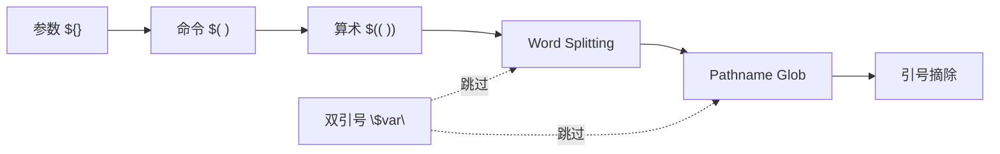
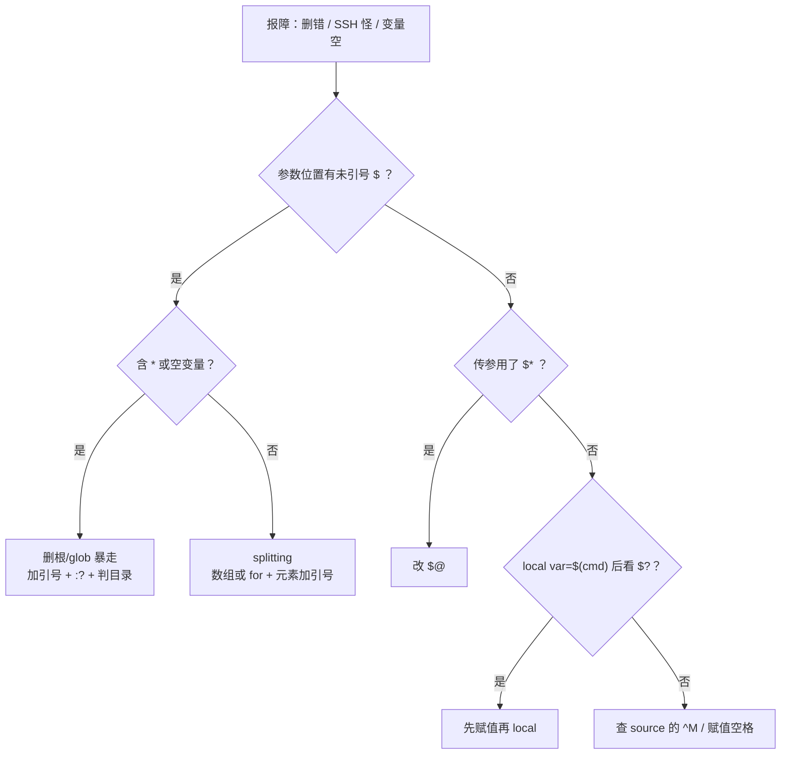

# 03｜变量引号与参数展开 · SRE 开发能力

> 活动前批量改配置：有人 `for i in $hosts` 把三台打成一条 SSH；有人 `rm -rf $dir/*` 在 `dir` 为空时删了根——群里已经在问「能不能从备份回滚」。
> **本章回答**：一个 Shell 字符串从赋值 → 引号 → `${}` → splitting → glob → `argv[]`，哪一步会炸、生产怎么写才稳。
> **不讲**：三开关 `set -euo pipefail` → [02](../02-脚本骨架与三开关/)；管道与 `PIPESTATUS` → [06](../06-管道重定向与PIPESTATUS/)；正则抽字段 → [04 正则](../../04-正则与文本处理/)。

**标记**：🎯重点 · 🔥难点 · ⭐常考 · 🔧实操

---

## 面试怎么考

| 标记 | 考点 |
|------|------|
| **核心** | 展开顺序；单引号 vs 双引号；`"$var"` 防 splitting；`${var:-}` 默认值 |
| **必会** | `IFS` 与 word splitting；空变量 + glob 删根；`${var#*/}` 路径裁剪 |
| **常用** | `${var:?}` 缺参即退；`${var//old/new}` 批量替换；`"$@"` vs `$*` |
| **常考** | 不加引号 `*` 匹配当前目录；`$(( ))` vs `` ` ``；赋值 `=` 两侧不能有空格 |

> 📝 **30 秒怎么说**：生产变量**一律双引号** `"$var"`，只有故意 splitting / glob 才放开。默认值 `${var:-default}`，缺参致命 `${var:?msg}`。`for f in $files` 在空变量时可能变成 `for f in *`——用数组 + `"${arr[@]}"`，或先判非空。取 basename 用 `${path##*/}`。

---

## 能力边界

| 维度 | 变量/引号/展开 | Python str | Go string |
|------|----------------|------------|-----------|
| **适合** | 跳板机脚本、kubectl 包装、批量 SSH | 结构化日志、API 响应 | 常驻工具、并发 worker |
| **不适合** | 复杂嵌套结构（换数组或换语言） | 一行 shell 里嵌十层 `${}` | 五分钟改三台机配置 |
| **生命周期** | Runbook、CI 一步 | 可入库、单测 | 二进制分发 |

- 🔑 **引号三角色**（别混）
  - **双引号**：保留字面空格、挡 splitting/glob，仍展开 `$` —— **生产默认**
  - **单引号**：完全字面 —— 包 `awk '{print $1}'`
  - **不加引号**：主动 splitting + glob —— 仅 `case` 模式或刻意 `*`

> ⚠️ **别混**：review 第一眼看引号——凡 `$` 在命令参数位置、没双引号就标红。

---

## 语言最小集

```bash
name="game-01"                          # 赋值：= 两侧无空格
echo "$name"                            # 双引号：展开仍挡 splitting/glob
msg='cost=$HOME'                        # 单引号：一字不碰
port=${PORT:-8080}                      # 空/未设 → 默认值
host=${1:?usage: $0 <host>}             # 空/未设 → 报错退出
base="${path##*/}"                      # 最长前缀裁剪 → basename
for h in "${hosts[@]}"; do ssh "$h"; done  # 数组：一人一份
```

零件认完，上主图——字符串从 `=` 到 `argv[]`，中间哪几步会炸。

---

## 一、一张图：一个字符串从赋值到 argv 的一生

> 🎯 **一句话**：`name=value` 进内存 → 引号决定谁参与展开 → 七步切词 → `execve` 的 `argv[]`。

```mermaid
flowchart LR
    A["赋值 name=value"] --> B["引号层<br/>' 字面 / \" 半展开"]
    B --> C["参数 ${}<br/>默认值 / 裁剪"]
    C --> D["命令 $( ) · 算术 $(( ))"]
    D --> E["Word Splitting<br/>按 IFS 切词"]
    E --> F["Pathname Glob<br/>* ? []"]
    F --> G["引号摘除 → argv[]"]
    H["炸点"] -.-> E
    H -.-> F
```

- 📖 **读图**
  - 🛤️ 左→右是**未加引号**片段的处理顺序（简化）；`"$var"` 在引号摘除前**跳过** ⑤ splitting 与 ⑥ glob
  - 💣 监控里「偶发删错目录」多半出在 ⑤⑥：空变量 `cmd $dir/*` 可变成 `cmd /*`

本节对应练习题 Q1、Q14。

---

## 二、出生：赋值与名字

> 🎯 **一句话**：`=` 两侧**不能有空格**；`export` 才进子进程；`name=value cmd` 只对该命令临时生效。

```bash
name="game-server-01"
count=3
readonly DEPLOY_ENV="prod"

name = "foo"    # ← bash: command not found: name（空格把 name 当命令）

ts=$(date +%Y%m%d)
ip=$(hostname -I | awk '{print $1}')
```

- 🔑 **两种赋值语境**
  - `name=value`：当前 shell 持久（到该 shell 结束）
  - `name=value command`：**仅**这一条命令的环境；不等于先赋值再跑 `command`
- 🔑 **`export VAR`**：子进程才看得见；普通赋值子 shell / `./script` 看不到

> 🔍 **现场**：配置常混两种来源——

```bash
# deploy.conf: REPLICAS=3
source ./deploy.conf
echo "replicas=${REPLICAS:-1}"

# K8s downward API / CI 注入
echo "namespace=${NAMESPACE:?must set NAMESPACE}"
```

- 📖 **读图**
  - 🧾 赋值只定「内存里有什么」
  - 🛤️ 交给命令时长什么样 → 后面引号与展开；本节炸点是 `=` 两侧空格

本节对应练习题 Q14。

---

## 三、引号：字面量 vs 可展开 🎯⭐

> 🎯 **一句话**：单引号里**一切字面**；双引号里 `$`、`` ` ``、`\`、`!`（history）仍展开；不加引号触发 splitting 和 glob。

### 📮 单引号 `'...'`

> 💡 **打个比方**：单引号是冷冻舱——进去什么出来什么，Shell 不碰里面。

```bash
msg='root is $HOME, today is $(date)'   # 原样，$ 与 $( ) 都不跑
awk_script='{print $1, $9}'             # awk 的 $1 不会被 shell 吃掉
grep -E 'error+' app.log
```

### 📮 双引号 `"..."`

```bash
user="ops"
echo "hello $user"           # hello ops
echo "today $(date +%F)"     # 命令替换仍执行

# 生产必写：防空格、防空、防 glob
ssh "$target_host" "systemctl restart $svc"
```

#### ❓ 为什么不是「一律单引号」？

- ❄️ **单引号**挡一切——连你要的 `$HOME`、`${port}`、`$(date)` 也冻死
- 🌡️ **双引号**才是「半展开」：变量与命令替换仍跑，**splitting / glob 被挡**
- ✅ **生产默认双引号**；单引号专包「里面有 `$` 但不能给 shell 看」的片段（awk/sed）

> ⚠️ **别混**：`"$a $b"` 是**一个**参数（中间空格属字面）；`$a $b` 是**两个**。`"$@"` 每人一份；`"$*"` 糊成一坨（五节、八节）。

### 📮 不加引号：何时故意放开

```bash
# 刻意 glob
find /var/log/app -name '*.log' -mtime +7 -delete

# case 右边是模式，不是 argv
case "$status" in
  200|201|204) echo ok ;;
  5*) echo 5xx ;;
esac
```

> 📝 **面试**：⭐「生产默认双引号；单引号包 awk/sed 带 `$` 的片段；不加引号只在明确要 glob 或 case 模式。」

本节对应练习题 Q5。

---

## 四、参数展开：`${}` 全家桶 ⭐🔧

> 🎯 **一句话**：`${var}` ≈ `$var`，但 `{}` 才能接后缀；**默认值四兄弟**与**裁剪**是 SRE 天天写的。

### 🔑 默认值四兄弟 ⭐

⭐ `set -u` 抓「未定义」，抓不住「已定义但空串」——空串要靠 `:?` / `:-`。

| 写法 | 未设或空 | 有值 | 副作用 |
|------|----------|------|--------|
| `${var:-default}` | 用 default | 用 var | 无 |
| `${var:=default}` | 赋 default 给 var | 用 var | **会赋值** |
| `${var:+alt}` | 空 | 用 alt | 无 |
| `${var:?msg}` | **报错退出** | 用 var | 无 |

```bash
port=${PORT:-8080}
curl -s "http://127.0.0.1:${port}/health"

host=${1:?usage: $0 <host>}
ssh "$host" 'uptime'

${DEBUG:+set -x}    # DEBUG 非空才展开为 set -x
```

#### ❓ 为什么 `${var-}` 和 `${var:-}` 不一样？

- 📌 **少冒号** `${var-default}`：仅 **未定义** 才用 default；已定义空串 `""` **不触发**
- 📌 **有冒号** `${var:-default}`：未定义 **或** 空串都用 default
- 🔥 线上漏写冒号 → 「明明空了却不进默认」——笔试高频

> 🔍 **现场**：CI 批量重启——

```bash
#!/usr/bin/env bash
NS=${NAMESPACE:?set NAMESPACE}
DEPLOY=${DEPLOYMENT:?set DEPLOYMENT}
kubectl rollout restart "deployment/${DEPLOY}" -n "$NS"
```

### 🔑 前缀/后缀裁剪 🔧

口诀：**`#` 砍头、`%` 砍尾，写两遍是最长匹配**。

```bash
path="/var/log/nginx/access.log"
echo "${path##*/}"      # access.log
echo "${path%/*}"       # /var/log/nginx
echo "${path#*/}"       # var/log/nginx/access.log

host="game-server-03.prod.example.com"
echo "${host%%.*}"      # game-server-03
echo "${host#*.}"       # prod.example.com

echo "${image//:/ }"    # 批量替换——镜像 tag 含 port 时慎用
ver="${tag%-*}"         # v1.2.3-rc1 → v1.2.3
```

> 📝 **面试**：「`${var#pat}` 最短前缀删，`##` 最长；`%` 后缀同理。basename 用 `${p##*/}`，少一次 `basename` fork。」

### 🔑 长度与切片

```bash
s="abcdefghij"
echo "${#s}"        # 10
echo "${s:2:4}"     # cdef
echo "${s: -3}"     # hij（负偏移前要空格）
```

本节对应练习题 Q3、Q6。

---

## 五、Word Splitting：一个词怎么变成很多个 🔥

> 🎯 **一句话**：展开后按 **`IFS`（默认空格/Tab/换行）** 切成多词再当参数；**双引号包住整段可跳过**。

> 💡 **打个比方**：splitting 像按空格切香肠——`"$sausage"` 整根下锅，`$sausage` 先切片。开头 `ssh $hosts` 把三台打成一条，根因就在这儿。

```bash
hosts="10.0.0.1 10.0.0.2 10.0.0.3"

# ssh $hosts uptime     → 三个参数，ssh 只认真吃第一台（行为诡异）
# ssh "$hosts" uptime   → 一个参数「三台空格拼接」，ssh 报错

# 正确：故意 splitting 后循环，或改用数组（八节）
for h in $hosts; do
  ssh "$h" uptime
done
```

> ⚠️ **别混**：`IFS` 只影响 splitting，**不影响**引号内字面空格。临时改 IFS 解析 CSV 是老写法，复杂表用 Python：

```bash
line="10.0.0.1,game-srv-01,running"
IFS=',' read -r ip name st <<< "$line"
echo "$ip $name"
```

#### ❓ 为什么 `"$@"` 不能换成 `"$*"`？

- 🎫 **`"$@"`**：每个位置参数**各一个**词（含内部空格的参数仍完整）
- 🧱 **`"$*"`**：全部糊成**一个**字符串（首字符 IFS 当胶水，默认空格）
- 🔥 传给函数 / 转发参数时写 `"$*"` → 文件名含空格必炸

```bash
run() { echo "argc=$#"; printf '<%s>\n' "$@"; }
run "a b" c
# argc=2
# <a b>
# <c>

run2() { printf '<%s>\n' "$*"; }
run2 "a b" c
# <a b c>    ← 合成一个
```

本节对应练习题 Q4、Q7、Q8。

---

## 六、Pathname Expansion：glob 何时帮倒忙 🔥

> 🎯 **一句话**：未加引号的 `*` `?` `[...]` 展开成匹配路径；无匹配时默认字面保留（`nullglob` 关）。

```bash
ls *.log
rm -f /tmp/cache/*          # 正常

dir=""
# rm -rf $dir/*             # ← 灾难：变成 rm -rf /*
rm -rf "${dir:?dir empty}/"*
[[ -n "$dir" && -d "$dir" ]] && rm -rf "$dir"/*
```

#### ❓ 为什么空变量 + `*` 会删根？

```text
dir=""                    ← 配置漏了 / 空串
rm -rf $dir/*             ← 未引号
        ↓ 参数展开
rm -rf /*                 ← pathname expansion 匹配根下
        ↓
磁盘告警 / 根分区被清      ← 错在展开层，不在 rm
```

- 📖 **读图**
  - ① `$dir` 变空 → ② 裸 `/*` 进 glob → ③ `rm -rf /*`
  - 🛡️ 三条防线：`${dir:?}` / 先 `[[ -d "$dir" ]]` / 绝对路径校验（见模板 3）

> ⚠️ **别混**：`*.txt` 是 **Shell glob**；`grep '*.txt'` 里的 `*` 是 **grep 的 BRE/正则**——两层见 [04](../../04-正则与文本处理/)。

```bash
shopt -s nullglob
files=(/var/log/app/*.log)
(( ${#files[@]} == 0 )) && { echo "no logs"; exit 0; }
```

> 📝 **面试**：⭐「空变量加 glob 是删根经典坑；`set -u` 抓未定义，空串仍过；用 `${var:?}` 或先判目录。」

本节对应练习题 Q2、Q13。

---

## 七、展开顺序：七步口诀 🔥⭐

> 🎯 **一句话**：brace → tilde → parameter → command → arithmetic → **splitting** → **pathname** → quote removal。



- 📖 **读图**
  - 🛤️ 前三段（参数/命令/算术）在引号里**照跑**；双引号只跳过 splitting 与 glob
  - 🔍 现场用 `set -x` 对照：未引号 `$hosts` 会在 S 步切成多词

```bash
echo "disk=$(df -h / | awk 'NR==2{print $5}')"   # $( ) 仍执行
i=0; ((i++)); echo $((i * 2))
files=$(ls *.conf 2>/dev/null)   # 先命令替换；无引号时再可能 splitting
```

#### ❓ 为什么 `"$var"` 能挡 splitting/glob，挡不住 `$()`？

- 🧱 **双引号挡的是后两步**：word splitting、pathname expansion
- ⚙️ **参数 / 命令 / 算术**发生在更早——引号内 `$()`、`$(( ))`、`${}` **仍执行**
- ✅ 所以 `"disk=$(df …)"` 会跑 `df`；`"*.log"` 才是字面星号

> 🔍 **现场**：`set -x` 看参数从哪来——

```bash
set -x
target="10.0.0.1 10.0.0.2"
echo ssh $target uptime
# → ssh 10.0.0.1 10.0.0.2 uptime
set +x
```

| 阶段 | 示例 | 双引号能挡？ |
|------|------|:------------:|
| Parameter | `$HOME` `${port:-8080}` | 内层仍展开 |
| Command | `$(date)` | 会执行 |
| Arithmetic | `$((1+1))` | 会计算 |
| Splitting | `$hosts` | **能挡** `"$hosts"` |
| Pathname | `*.log` | **能挡** `"*.log"` |
| Quote removal | 去掉引号壳 | — |

本节对应练习题 Q1、Q14。

---

## 八、数组：多值别用空格字符串硬扛 🎯

> 🎯 **一句话**：`hosts=(a b c)` + `"${hosts[@]}"` 才是多值正道；`hosts="a b c"` 只是妥协。

#### ❓ 为什么多值不要用空格字符串？

- 💣 空格字符串 + 未引号 → splitting 把含空格的文件名切碎
- 💣 空变量时 `for f in $files` 可能变成 `for f in *`（glob）
- ✅ 数组 `"${arr[@]}"`：每元素独立一词，空数组循环零次（配合 `nullglob` 更稳）

```bash
hosts=(10.0.0.1 10.0.0.2 10.0.0.3)
printf '<%s>\n' "${hosts[@]}"

for h in "${hosts[@]}"; do
  ssh "$h" 'hostname'
done

mapfile -t pods < <(kubectl get pods -n game -o jsonpath='{.items[*].metadata.name}')
echo "count=${#pods[@]}"
```

> 🔍 **现场**：批量滚动重启——

```bash
mapfile -t deploys < <(kubectl get deploy -n "$NS" -o name)
for d in "${deploys[@]}"; do
  kubectl rollout restart "$d" -n "$NS"
done
```

> ⚠️ **别混**：`${arr[@]}` **不加引号**仍会 splitting；永远写 `"${arr[@]}"`。`${arr[*]}` 与 `$*` 同病——糊成一串时才用。

本节对应练习题 Q9、Q10。

---

## 九、原理收束：三条铁律凭什么成立

> 🎯 **一句话**：删根、假绿、退出码丢——根因都在「展开层 / 属性命令」而不在业务逻辑。

### 🧱 铁律 1：`"$var"` 是生产默认

- 未引用的展开结果会再走 splitting + glob——空格、空串、`*` 在**命令行解析层**改语义
- 🎭 **小剧场**：`CACHE_DIR=` 漏配 → `rm -rf $CACHE_DIR/*` → `rm -rf /*` → 跳板机磁盘异常——错在展开，不在 `rm`

### 🧱 铁律 2：`set -u` 与 `${var:?}` 分工

#### ❓ 为什么 `set -u` 挡不住删根？

| 机制 | 抓什么 | 不抓什么 |
|------|--------|----------|
| `set -u` | **未定义** | 已定义空串 `""` |
| `${var:?}` | 未定义 **或** 空 | — |
| `${var:-d}` | 给默认值 | 不报错 |

```bash
set -u
empty=""
echo "${empty:-default}"   # default —— empty 已定义
# echo "$unset"            # unbound variable
```

### 🧱 铁律 3：`local` 会盖退出码

#### ❓ 为什么 `local var=$(cmd)` 后 `$?` 不是 cmd 的？

- `local` **本身是命令**——成功则 `$?=0`，盖掉 `$(cmd)` 的失败码
- ✅ 先 `var=$(cmd)` / `rc=$?`，再 `local var="$var"`；或 `local var` 后再赋值

```bash
# 错
f() { local x=$(false); echo "rc=$?"; }   # 常打印 0
# 对
f() { local x; x=$(false); local rc=$?; echo "rc=$rc"; }
```

> 📝 **面试**：「引号三层：单冷冻、双半展开、不加全展开+splitting+glob；`set -u`≠防空串；`local` 覆盖 `$?`。」

本节对应练习题 Q11、Q12。

---

## 十、作战：定责树 + 60 秒剧本 🔧

> 🎯 **一句话**：接到「脚本删错 / SSH 行为怪 / 变量明明有却空」——先问卡在展开哪一步。



- 📖 **读图**
  - 🚪 第一刀永远是「未引号的 `$`」
  - 🔀 有 `*` → 优先 glob；无 `*` → 怀疑 splitting；再查 `$*` / `local` / CRLF

| 现象 | 先做 | 别做 |
|------|------|------|
| 疑似删根 | 停脚本；查 `dir` 是否空；看历史命令是否 `$dir/*` | 先从备份回滚再查根因 |
| SSH 只连一台 | `set -x` 看展开成几个词 | 改 ssh 配置 / 加超时瞎试 |
| 「变量有值却空」 | `od -c` / `dos2unix` 查 `^M`；查 `=` 两侧空格 | 直接改业务逻辑 |

### 60 秒剧本 🔧

```text
① 0–10s   复现命令；set -x 看 argv 切成几段
② 10–30s  有未引号 $ ？有 * ？空变量？
③ 30–45s  定型：A glob 删根 · B splitting · C $* 糊参 · D local 盖 $? · E 赋值/CRLF
④ 45–60s  修法落地：引号 / :? / 数组 / 先赋值再 local；补一条 shellcheck
```

---

## 十一、生产模板

### 模板 1：带默认值的配置块

```bash
#!/usr/bin/env bash
set -euo pipefail

NS=${NAMESPACE:-game}
PORT=${PORT:-8080}
TIMEOUT=${CURL_TIMEOUT:-5}
API="http://127.0.0.1:${PORT}/health"

code=$(curl -s -o /dev/null -w '%{http_code}' --max-time "$TIMEOUT" "$API" || echo "000")
echo "health=$code ns=$NS"
```

### 模板 2：批量 SSH（引号 + 远程单引号）

```bash
#!/usr/bin/env bash
hosts=(10.0.0.11 10.0.0.12 10.0.0.13)
cmd='systemctl is-active nginx'

for h in "${hosts[@]}"; do
  echo "=== $h ==="
  ssh "$h" "$cmd"
done
```

```text
=== 10.0.0.11 ===
active
=== 10.0.0.12 ===
active
```

### 模板 3：安全清理目录

```bash
#!/usr/bin/env bash
set -euo pipefail

CACHE_DIR=${1:?usage: $0 <cache_dir>}
[[ -d "$CACHE_DIR" ]] || { echo "not a dir: $CACHE_DIR" >&2; exit 1; }
[[ "$CACHE_DIR" == /* ]] || { echo "must be absolute" >&2; exit 1; }

shopt -s nullglob dotglob
files=("$CACHE_DIR"/*)
if (( ${#files[@]} == 0 )); then
  echo "nothing to clean in $CACHE_DIR"
  exit 0
fi
rm -rf "${files[@]}"
echo "cleaned ${#files[@]} entries under $CACHE_DIR"
```

### 模板 4：从镜像 tag 抽版本

```bash
image="registry.example.com/game/login-svc:v2.14.3-rc1"
repo="${image%%:*}"
tag="${image##*:}"
ver="${tag%-*}"
echo "repo=$repo ver=$ver"
```

```text
repo=registry.example.com/game/login-svc
ver=v2.14.3
```

### 模板 5：heredoc 与缩进（`<<-`）

```bash
cat <<-EOF
	deploy: ${DEPLOY:-unknown}
	ns: ${NAMESPACE:-default}
EOF
```

---

## 十二、收口

### 命令速查 🔧

```bash
# 看展开（调试第一刀）
set -x; 你的命令; set +x

# 缺参 / 空串立刻死
: "${VAR:?must set VAR}"

# 默认值
port=${PORT:-8080}

# basename / dirname（少 fork）
base="${path##*/}"; dir="${path%/*}"

# 安全 glob 列表
shopt -s nullglob; files=("$dir"/*); echo "${#files[@]}"

# 数组遍历
for x in "${arr[@]}"; do …; done

# 查 CRLF
od -c deploy.conf | head
```

### 面试锚点

| 问 | 30 秒答 |
|----|---------|
| 展开顺序？哪两步最危险？ | 参数/命令/算术 → splitting → glob → 引号摘除；危险在 splitting 与 glob。 |
| 为何生产默认双引号？ | 仍展开 `$`/`$()`，但挡 splitting/glob；单引号全冻，不加引号全开。 |
| 为何 `rm $dir/*` 能删根？ | `dir` 空 → 变成 `rm /*`；`set -u` 不挡空串；用 `${dir:?}` + 判目录。 |
| `:-` `:=` `:?` `:+`？ | 默认 / 赋默认 / 空则死 / 非空才替换；注意少冒号时空串不触发。 |
| `"$@"` vs `"$*"`？ | 前者每人一份，后者糊成一串。 |
| `#` `%` 裁剪？ | `#` 砍头 `%` 砍尾，写两遍最长；`${p##*/}` = basename。 |
| `local var=$(cmd)` 与 `$?`？ | `local` 是命令，盖退出码；先赋值再 local。 |

### 踩坑清单

| 现象 | 原因 | 修法 |
|------|------|------|
| `rm -rf /*` | `dir` 空 + `$dir/*` | `"${dir:?}"` + 判目录 |
| SSH 只连第一台 | `ssh $hosts` splitting | `for h; do ssh "$h"` |
| 文件名空格断两截 | `for f in $files` | 数组 + `"${arr[@]}"` |
| 变量「有值」却空 | `source` 带 `^M` | `dos2unix` |
| `[$var]` 语法错 | `[` 是命令，要空格 | `[[ "$var" == foo ]]` |
| awk `$1` 被 shell 吃 | 双引号包 awk 脚本 | 单引号 `{print $1}` |
| `"*.log"` 不展开 | 引号挡 glob | 要 glob 就别引这段 |
| 默认值没生效 | `${var-}` 少冒号 | `${var:-default}` |
| 传参全糊一个 | `"$*"` | `"$@"` |
| `local` 后 `$?` 不对 | `local` 盖码 | 先赋值再 local |
| `${arr[@]}` 无引号 | 仍会 splitting | `"${arr[@]}"` |
| `echo $var` 换行变空格 | 未引号 splitting | `echo "$var"` |

### 易错一句话对照

- 赋值 `name = value` → `name=value`，两侧不能有空格
- 双引号阻止变量展开 → 双引号**允许** `$` 展开，挡的是 splitting/glob
- `${var}` 与 `$var` 完全一样 → 只有 `{}` 才能接 `:-` `#` 等
- `set -u` 能防空串 glob → 只防未定义，不防 `""`
- `"$@"` 与 `"$*"` 一样 → `$@` 独立，`$*` 合成
- word splitting 按逗号切 → 默认 IFS 是空格/Tab/换行
- `${var-default}` = `${var:-default}` → 少冒号时空串不触发
- `local var=$(cmd)` 后 `$?` 是 cmd 的 → `local` 覆盖退出码
- `for f in $files` 对含空格文件名安全 → 会 splitting，用数组

### 数字墙

> `${var:0:5}` 从 0 起取 5 字符 · `"${#var}"` 长度 · IFS 默认空格/Tab/换行 · `nullglob` 无匹配 → 空列表 · 删根经典形态 `$dir/*` 且 `dir` 空 · 退出码被 `local` 盖成 0 是常见假绿

### 必会 · 常考

| 说法 | 对错 | 口径 |
|------|:----:|------|
| 赋值 `=` 两侧可以有空格 | 错 | 有空格是跑 `name` 命令 |
| 单引号里能写 `$HOME` | 对 | 但是**字面** `$HOME` |
| 双引号阻止变量展开 | 错 | 双引号**允许** `$` 展开 |
| `${var}` 和 `$var` 完全一样 | 错 | `{}` 才能接 `:-` `#` |
| 空变量时 `*` 可匹配到根下 | 对 | 所以 `rm $d/*` 危险 |
| `set -u` 能防止空串 glob | 错 | 只防未定义 |
| `"$@"` 和 `"$*"` 一样 | 错 | `$@` 每人独立 |
| word splitting 按逗号切 | 错 | 默认 IFS 空白类 |
| `local var=$(cmd)` 后 `$?` 是 cmd 的 | 错 | `local` 覆盖 |
| `${var-d}` 等于 `${var:-d}` | 错 | 少冒号空串不触发 |

---

## 合上书

对着第一节主图口述一遍，卡住就回对应小节。开头那个删根 / SSH 打成一条——各自错在展开哪一步，现在该能说清了。

- [ ] **默画主图**：赋值 → 引号 → `${}`/命令/算术 → splitting → glob → argv；标出 `"$var"` 跳过哪两步。（→ Q1）
- [ ] **口述删根**：`rm -rf $dir/*` 为何变 `/*`；三条防线。（→ Q2 · Q13）
- [ ] **口述默认值**：`:-` `:=` `:?` `:+`；少冒号时空串怎样。（→ Q3 · Q12）
- [ ] **口述 splitting**：`ssh $hosts` 为何怪；`IFS` 管什么；`"$@"` vs `"$*"`。（→ Q4 · Q7 · Q8）
- [ ] **口述引号三层**：单 / 双 / 不加各举一个生产正确用法。（→ Q5）
- [ ] **手写裁剪**：`/var/log/nginx/access.log` 的 basename 与父目录。（→ Q6）
- [ ] **口述数组**：为何不用空格字符串；`"${arr[@]}"` 怎么写。（→ Q9 · Q10）
- [ ] **口述 local**：为何看不到 cmd 的退出码；正确写法。（→ Q11）
- [ ] **白板展开**：给定一行未引号命令，逐步写出 splitting / glob 后的 argv。（→ Q14）

全部打勾之后，找同事十分钟讲清「删根现场三条防线」。下一章：**条件测试与流程控制**——`[[` / `if` / `case` 怎么判。

> 📝 **面试**：⭐「Shell 引号三层：单冷冻、双半展开、不加全展开+splitting+glob；生产默认双引号；`set -u` 不防空串；`local` 盖 `$?`。」
