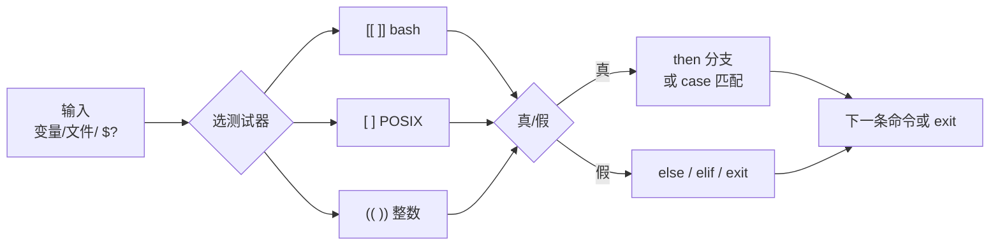

# 04｜条件测试与流程控制 · SRE 开发能力

> 发版脚本里有人写 `[ $status = 200 ]`，变量一为空就变成 `[ = 200 ]` 语法错误；有人用 `[ $count -gt 10 ]` 比较 `"08"` 和 `"9"`，活动高峰误判「连接数正常」。分支写错不是业务不懂，是**测试命令**和**流程控制**没按 Shell 语义写。
> **本章回答**：一个分支判断从「测什么」（数值/字符串/文件）→「用什么测」（`[[ ]]` / `[ ]` / `test`）→「怎么走」（`if` / `case` / `&&` `||`）的完整路径。
> **不讲**：三开关与 `errexit` 交互 → [02 脚本骨架](../02-脚本骨架与三开关/)；`PIPESTATUS` 管道成败 → [06](../06-管道重定向与PIPESTATUS/)；复杂参数解析 → [09](../09-参数解析与dry-run/)。

## 面试怎么考

> 🎯 **一句话**：`[[ ]]` vs `[ ]` 选型、字符串 `=` vs 数值 `-eq`、文件测试、`case` 分发——四个高频考点。

| 标记 | 考点 |
|------|------|
| **核心** | `[[ ]]` vs `[ ]`；字符串用 `=`，数值用 `-eq`；`[ "$var" ]` 防空 |
| **必会** | 文件测试 `-f` `-d` `-e` `-s`；`if`/`elif`/`else`；`case` 多分支 |
| **常用** | `&&` `||` 短路；`(( ))` 算术比较；`[[ $s == *.log ]]` 模式 |
| **常考** | `[` 两侧必须有空格；`=` 与 `==` 在 bash `[[` 里；`-z` 测空串 |

**30 秒怎么说**：生产分支优先 `[[ ]]`——不拆词、支持 `&&` 和模式匹配。字符串比较 `[[ "$a" == "$b" ]]`，整数用 `(( n > 10 ))` 或 `[[ $n -eq 10 ]]`，**别用 `-gt` 比字符串**。文件先 `-e` 再 `-f`/`-d`。`[` 是外部命令，变量必须加引号。`case` 做服务状态/退出码多路分发；简单二选一可用 `cmd && ok || fail`。

---

## 能力边界

> 🎯 **一句话**：Shell 条件测试擅文件/进程/退出码分支，浮点和复杂逻辑换 Python。

| 维度 | Shell 条件 | Python if | Go if |
|------|-----------|-----------|-------|
| **适合** | 部署前检查、健康探测、按退出码分支 | 复杂布尔逻辑、类型明确 | 强类型比较 |
| **不适合** | 浮点比较、嵌套十层括号 | 一行改 fifty 台 | 快速跳板机草稿 |
| **生命周期** | Runbook、CI gate | 可单测 | 编译分发 |
| **vs 彼此** | 测文件/进程最快 | 可读性高 | 编译期抓类型错 |

| 写法 | 何时用 | 别用于 |
|------|--------|--------|
| `[[ ]]` | **bash 脚本默认** | POSIX sh 严格模式 |
| `[ ]` / `test` | 要 POSIX、极简环境 | 模式匹配、含 `&&` 的复合条件 |
| `(( ))` | 整数比较、自增 | 字符串 |
| `case` | 多枚举值（状态码、命令名） | 连续区间（用 `if`） |

> ⚠️ **别混**：review 脚本时搜 `[ `——凡 `$` 没引号、`[` 贴变量的，优先改 `[[ "$var" ... ]]`。`[[ ]]` 是 bash 关键字，`[ ]` 是 POSIX 命令，两者不是同一层东西。

---

## 一、一张图：一个分支判断的一生

> 🎯 **一句话**：收集条件（变量/文件/退出码）→ 选测试器（`[[`/`[`/`((`）→ 得到真/假 → `if`/`case`/`&&` 选路径 → 可能 `exit` 结束脚本。



**读图**：菱形「选测试器」是面试高频——字符串、数值、文件三类**不能混操作符**。`$?` 是**上一条命令**的退出码，要在下一条命令跑之前立刻读。`set -e` 下未捕获的假分支可能导致脚本直接退出，见 [02](../02-脚本骨架与三开关/)。

---

## 二、出生：test 与 `[ ]` ⭐

> 🎯 **一句话**：`[` 是 `test` 的别名，都是**命令**——返回 0 真 / 非 0 假；**括号内侧必须有空格**。

```bash
# 等价
test -f /etc/passwd
[ -f /etc/passwd ]

# 经典笔试坑：没空格
#[ -f /etc/passwd ]   # 找名为 [-f 的命令

# 变量必须引号——否则空变量语法炸
status="200"
[ "$status" = "200" ] && echo ok

# 空变量灾难
empty=""
# [ $empty = foo ]     # 变成 [ = foo ] → 语法错误
[ "$empty" = "foo" ]   # 假，但合法
```

> ⚠️ **别混**：`=` 在 `[ ]` 里是**字符串**比较，不是赋值。赋值只在 `name=value` 且**无空格**时出现。

> 💡 **打个比方**：`[ ]` 是外部命令——像往邮局投递表格，空一栏就「格式错误」退回；`[[ ]]` 是 bash 自己人——像口头传话，少了一个人也不会报语法错，只是判断结果为假。

> 🔍 **现场** 🔧：检查配置文件存在再 source：

```bash
# 检查配置文件存在再 source
cfg="/etc/game/deploy.conf"
if [ -f "$cfg" ]; then
  # shellcheck source=/dev/null
  source "$cfg"
else
  echo "missing $cfg" >&2
  exit 1
fi
```

---

## 三、进化：`[[ ]]` —— bash 内置、生产首选 ⭐

> 🎯 **一句话**：`[[ ]]` 是 shell 关键字——**不 word-splitting**、支持 `&&` `||`、右侧可做**模式**（不是路径 glob）。

```bash
# 字符串
[[ "$USER" == root ]] && echo "running as root"

# 复合条件
[[ -f "$f" && -s "$f" ]] && process "$f"

# 模式匹配（右侧无引号时）
file="access.log"
[[ $file == *.log ]] && echo "log file"

# 正则（bash 3.2+）
[[ $line =~ ^[0-9]+\.[0-9]+\.[0-9]+\.[0-9]+$ ]] && echo ip

# 空与非空
[[ -z "$TOKEN" ]] && { echo "TOKEN required"; exit 1; }
[[ -n "$DEBUG" ]] && set -x
```

> 💡 **打个比方**：`[ ]` 像寄明信片——字多字少、空格都要规矩；`[[ ]]` 像微信语音——bash 自己解析，变量少踩 splitting 坑。

> 📝 **面试**：「bash 脚本用 `[[ ]]`；要 POSIX 才 `[ ]`。`[[` 里 `==` 和 `=` 都行；`[ ]` 里字符串比较常用 `=`。」

| 特性 | `[ ]` | `[[ ]]` |
|------|:-----:|:-------:|
| 单词分割变量 | 会 | **不会** |
| 内嵌 `&&` `\|\|` | 不行 | **可以** |
| 模式 `== *.log` | 不行 | **可以** |
| 正则 `=~` | 不行 | **可以** |
| POSIX | 是 | 否（bash/ksh） |

---

## 四、三类测试：数值 · 字符串 · 文件 ⭐

> 🎯 **一句话**：**数值**用 `-eq/-ne/-lt` 或 `(( ))`；**字符串**用 `=`/`==` 或 `[[ < > ]]`；**文件**用 `-e/-f/-d/-s/-r/-w/-x`。

### 4.1 数值比较 🔥

```bash
count=42
[[ $count -eq 42 ]]    # ← 真（整数相等）
(( count > 10 ))        # ← 真（算术环境，count=42 > 10）

# 陷阱：前导零被当八进制
a=08
# (( a > 7 ))          # ← bash: 08: value too great for base（八进制无 8）

# 陷阱：字符串比较当数字
[[ "10" -gt "9" ]]     # ← 假！按字符串/字典序部分实现——别这样写
(( 10 > 9 ))           # ← 真（算术比较）
```

> ⚠️ **别混**：`-eq` 只给整数；浮点用 `bc` 或换 Python。`(( ))` 里未定义变量当 0，和 `set -u` 冲突时要注意。

> 💡 **打个比方**：`(( 08 ))` 像你跟系统说「这是八进制 08」——但八进制只有 0–7，8 是非法位。系统不是在算数学，是在按「0 开头 = 八进制」的规矩解析你的字面量。

```bash
# 从命令取数
load=$(awk '{print int($1)}' /proc/loadavg)
cores=$(nproc)
if (( load > cores * 2 )); then
  echo "load high: $load cores=$cores"
fi
```

### 4.2 字符串比较

```bash
env="${DEPLOY_ENV:-prod}"

[[ "$env" == "prod" ]] && echo production    # ← production（字符串相等）
[[ "$env" != "staging" ]]                     # ← 真（不等）

# 字典序（版本串要小心）
[[ "v1.10" < "v1.9" ]]   # ← 假——字符串比较不是语义版本（'1' < '9' 按字典序）

# 空串
[[ -z "$reply" ]] && reply="default"          # ← 空串时赋默认值
```

> 🔍 **现场** 🔧：curl 健康检查：

```bash
code=$(curl -s -o /dev/null -w '%{http_code}' --max-time 3 "$URL" || echo "000")
if [[ "$code" == "200" ]]; then
  echo "healthy"
elif [[ "$code" =~ ^5 ]]; then
  echo "upstream 5xx: $code" >&2
  exit 1
else
  echo "unexpected: $code" >&2
  exit 1
fi
```

### 4.3 文件与目录测试 🔧

| 操作符 | 含义 | 典型用法 |
|--------|------|----------|
| `-e` | 存在（任意类型） | 先存在再细分 |
| `-f` | 普通文件 | 配置文件 |
| `-d` | 目录 | 日志目录 |
| `-s` | 存在且非空 | 避免处理空日志 |
| `-r` / `-w` / `-x` | 可读/可写/可执行 | 权限预检 |
| `-L` | 符号链接 | 追软链 |
| `f1 -nt f2` | f1 比 f2 新 | 比较 mtime |

```bash
log="/var/log/nginx/access.log"
[[ -f "$log" && -s "$log" ]] || { echo "no log"; exit 0; }

[[ -d "$BACKUP_DIR" ]] || mkdir -p "$BACKUP_DIR"
[[ -w "$BACKUP_DIR" ]] || { echo "not writable"; exit 1; }
```

```bash
# 链式：存在且是文件且非空
[[ -e "$f" && -f "$f" && -s "$f" ]]
```

---

## 五、流程控制：`if` · `elif` · `else` ⭐

> 🎯 **一句话**：`if` 测的是**命令退出码**——`0` 走 then；`[[`/`[`/`((` 都是命令。

```bash
#!/usr/bin/env bash
set -euo pipefail

disk_pct=$(df -P / | awk 'NR==2 {gsub(/%/,""); print $5}')

if (( disk_pct >= 90 )); then
  echo "CRITICAL disk ${disk_pct}%" >&2  # ← 磁盘 ≥90%，exit 2 给监控
  exit 2
elif (( disk_pct >= 80 )); then
  echo "WARN disk ${disk_pct}%"           # ← 80-89% 告警但不退出
else
  echo "OK disk ${disk_pct}%"             # ← <80% 正常
fi
```

> ⚠️ **别混**：`if grep foo file` 是测 grep **有没有匹配到**，不是测 file 内容布尔——没匹配退出 1 走 else。要「文件含 foo」写 `if grep -q foo file; then`。

```bash
# 检查命令是否存在
if command -v kubectl >/dev/null 2>&1; then
  kubectl version --client --short
else
  echo "kubectl not in PATH" >&2
  exit 1
fi
```

### 5.1 收束：`if` 凭什么能嵌套一切

> 🎯 **一句话**：`if` 后面跟**任意命令**——`[[`、普通命令、`!` 取反都行；`set -e` 下 then 里失败的命令仍会触发退出（除非在 `if` 条件位）。

```bash
# 条件位上的失败不算 errexit 触发（bash）
if ! ping -c1 -W1 "$host" >/dev/null 2>&1; then
  echo "$host down"
fi

# 管道在 if 里
if echo "$line" | grep -q ERROR; then
  echo "has error"
fi
```

---

## 六、多路分发：`case` ⭐

> 🎯 **一句话**：`case word in pattern)` 按**模式**匹配——适合退出码、服务名、HTTP 前缀；`|` 表或；`*)` 默认。

```bash
handle_exit() {
  local code=$1
  case "$code" in
    0)
      echo "success"
      ;;
    1|2|3)
      echo "retryable: $code"
      return 1
      ;;
    12[0-7])                    # 120-127
      echo "ssh/signal: $code"
      return "$code"
      ;;
    *)
      echo "unknown: $code" >&2
      return 99
      ;;
  esac
}

svc="${1:-}"
case "$svc" in
  nginx|openresty)
    systemctl reload nginx
    ;;
  game-logic|login-svc)
    kubectl rollout restart "deployment/$svc" -n game
    ;;
  "")
    echo "usage: $0 <svc>" >&2
    exit 1
    ;;
  *)
    echo "unsupported svc: $svc" >&2
    exit 1
    ;;
esac
```

> 🔍 **现场** 🔧：按 HTTP 码分支告警级别：

```bash
case "$http_code" in
  2*) level=OK ;;        # ← 2xx 正常
  3*) level=REDIRECT ;;  # ← 3xx 重定向
  4*) level=CLIENT ;;    # ← 4xx 客户端错
  5*) level=SERVER ;;   # ← 5xx 服务端错
  *)  level=UNKNOWN ;;   # ← 非数字或异常
esac
```

> 📝 **面试**：「多枚举用 `case`；区间可用 `12[0-7]` 模式。每个分支结尾 `;;` 别漏。默认 `*)` 处理意外输入。」

---

## 七、短路：`&&` 与 `||` 🔥

> 🎯 **一句话**：`cmd1 && cmd2`——前者 0 才跑后者；`cmd1 || cmd2`——前者非 0 才跑后者；和 `set -e` 组合是常见踩坑点。

> 💡 **打个比方**：`A && B` 像「前面的人过了安检，你才过」——前面被拦住（非 0），你不动；`A || B` 像「前面的人没过，你上」——前面过了（0），你就不需要上了。`A && B || C` 是「A 过了但 B 被拦 → C 上」——这不是 if-else，是两个独立短路拼出来的意外效果。

```bash
# 常见：存在才删
[[ -f "$tmp" ]] && rm -f "$tmp"

# 默认赋值
[[ -z "${TAG:-}" ]] && TAG="$(git describe --tags --always)"

# 注意优先级
mkdir -p /var/log/app && touch /var/log/app/run.log
# 等价于 (mkdir ...) && (touch ...) 在同一 shell 顺序执行
```

```bash
# 反模式：A || B && C  —— 可读性差，改 if
# 推荐
if ! deploy; then
  rollback
  exit 1
fi
```

> ⚠️ **别混**：`cmd && exit 1` 在 `set -e` 下——条件位的失败不触发 errexit，then/else **块外**的下一条会。复杂逻辑写 `if`。

---

## 八、退出码 `$?` 与 `exit` ⭐

> 🎯 **一句话**：每条命令返回 0–255；`$?` 是**紧挨着的上一条**的码；脚本用 `exit n` 交给 CI/监控。

```bash
kubectl rollout status "deployment/login-svc" -n game --timeout=120s
rc=$?
if (( rc != 0 )); then
  echo "rollout failed: $rc" >&2
  exit "$rc"
fi
```

```bash
# 函数返回
is_port_open() {
  local port=$1
  if ss -ltn | grep -q ":${port} "; then
    return 0
  fi
  return 1
}
if is_port_open 8080; then echo "listening"; fi
```

> 🔍 **现场** 🔧：多检查汇总退出码：

```bash
err=0
check_disk || err=1
check_load || err=1
check_svc  || err=1
exit "$err"
```

---

## 原理讲透

> 🎯 **一句话**：三个高频踩坑——空变量炸、数值当字符串比、模式当 glob——都是没分清「测试器怎么解析参数」。

### 8.1 为什么 `[ $x = y ]` 会炸 🔥

> 🎯 **一句话**：`[` 启动后 arguments 必须完整；空 `$x` 让 argv 缺项，bash 报 syntax error——不是「条件为假」。

**现场走一遍**：

```bash
x=""
[ $x = "" ]    # ← bash: [: =: unary operator expected（argv 缺项，语法错误）
[[ $x = "" ]]  # ← 真——[[ 由 shell 解析，不炸
[ "$x" = "" ]  # ← 真——POSIX 安全写法
```

### 8.2 数值 vs 字符串：活动监控误判 🔥

> 🎯 **一句话**：`-gt` 等是**整数**比较；传 `"08"`、`"9"` 或版本串会得出反直觉结果。

```bash
# 错：字符串字典序陷阱
[[ "9" -gt "10" ]]    # ← 可能为真（实现相关，别依赖）

# 对
(( 9 > 10 ))          # ← 假（算术比较，9 不大于 10）
```

### 8.3 `[[` 模式 vs 路径 glob 🔥

> 🎯 **一句话**：`[[ $f == *.log ]]` 是**字符串模式**（case 风格），不是路径展开；`*.log` 不会读目录。

```bash
f="access.log"
[[ $f == *.log ]] && echo match    # ← match（字符串模式，不读目录）

f="access.txt"
[[ $f == *.log ]] || echo no       # ← no（模式不匹配）
```

---

## 生产模板 🔧

> 🎯 **一句话**：五个可直接复制的脚本——发布 gate、负载分级、命令分发、重试退出码、日志轮转检查。

### 模板 1：发布前 gate

```bash
#!/usr/bin/env bash
set -euo pipefail

NS=${NAMESPACE:?}
DEPLOY=${DEPLOYMENT:?}
MIN_READY=${MIN_READY:-80}

ready=$(kubectl get deploy "$DEPLOY" -n "$NS" \
  -o jsonpath='{.status.readyReplicas}' 2>/dev/null || echo 0)
desired=$(kubectl get deploy "$DEPLOY" -n "$NS" \
  -o jsonpath='{.spec.replicas}')

if [[ -z "$ready" || "$ready" == "0" ]]; then
  echo "no ready replicas" >&2
  exit 1
fi

pct=$(( ready * 100 / desired ))
if (( pct < MIN_READY )); then
  echo "ready ${pct}% < ${MIN_READY}%" >&2
  exit 1
fi
echo "gate ok: ${ready}/${desired}"
```

### 模板 2：磁盘/负载分级

```bash
#!/usr/bin/env bash
load_1m=$(awk '{print int($1+0.5)}' /proc/loadavg)
cores=$(nproc)

if (( load_1m > cores * 3 )); then
  level=CRITICAL
elif (( load_1m > cores * 2 )); then
  level=WARN
else
  level=OK
fi
echo "load=$load_1m cores=$cores level=$level"
```

### 模板 3：按命令名分发运维动作

```bash
#!/usr/bin/env bash
set -euo pipefail
cmd=${1:?usage: $0 restart|status|logs <svc>}

case "$cmd" in
  restart)
    svc=${2:?svc required}
    kubectl rollout restart "deployment/$svc" -n game
    ;;
  status)
    svc=${2:?svc required}
    kubectl rollout status "deployment/$svc" -n game --timeout=180s
    ;;
  logs)
    svc=${2:?svc required}
    kubectl logs -n game "deploy/$svc" --tail=100
    ;;
  *)
    echo "unknown cmd: $cmd" >&2
    exit 1
    ;;
esac
```

### 模板 4：重试与退出码

```bash
#!/usr/bin/env bash
max=5
n=0
until curl -sf --max-time 3 "$HEALTH_URL" >/dev/null; do
  (( n++ )) || true
  if (( n >= max )); then
    echo "health failed after $max tries" >&2
    exit 1
  fi
  sleep $(( n * 2 ))
done
echo "healthy"
```

### 模板 5：文件轮转前检查

```bash
#!/usr/bin/env bash
log=${1:?log path}
archive_dir=${2:-/var/log/archive}

[[ -f "$log" ]] || { echo "not a file: $log"; exit 1; }
[[ -s "$log" ]] || { echo "empty, skip"; exit 0; }
[[ -d "$archive_dir" ]] || mkdir -p "$archive_dir"
[[ -w "$archive_dir" ]] || { echo "archive not writable"; exit 1; }

ts=$(date +%Y%m%d%H%M%S)
cp -a "$log" "$archive_dir/$(basename "$log").$ts"
: > "$log"
echo "rotated to $archive_dir"
```

---

## 踩坑清单

> 🎯 **一句话**：十个高频踩坑——空变量炸、八进制误判、字符串当整数、漏 `;;`、`$?` 时机错——一条一条对。

| 现象 | 原因 | 修法 |
|------|------|------|
| `[: =: unary operator expected` | 空变量未引号 | `"$var"` 或 `[[ ]]` |
| `08: value too great for base` | 前导零八进制 | `10#08` 或去前导零 |
| `"10" -gt "9"` 为假 | 字符串当整数 | `(( 10 > 9 ))` |
| `if foo=bar` 不赋值 | `if` 测的是命令 | 写 `if [[ foo == bar ]]` |
| `case` 穿透到下分支 | 漏 `;;` | 每分支 `;;` |
| `grep` 在 `if` 里误判 | 无匹配退出 1 | 预期无匹配用 `if ! grep -q` |
| `[[ $a > $b ]]` 字典序 | 字符串比较 | 数值进 `(())` |
| `[ $a == $b ]` 在 sh 失败 | `==` 非 POSIX | `[ "$a" = "$b" ]` |
| 函数 `return 300` 变 44 | 退出码模 256 | 保持 0–255 |
| `set -e` 与 `foo \|\| true` | 故意吞错 | 文档说明或改 `if` |

---

## 必会 · 常考

> 🎯 **一句话**：八条对错判断 + 易混清单——面试笔试高频，一条一条过。

| 说法 | 对错 | 口径 |
|------|:----:|------|
| `[` 和 `test` 不等价 | 错 | `[` 是 `test` 同名 |
| `[[ ]]` 比 `[ ]` 更慢 | 错 | 内置通常更快 |
| `-eq` 能比较 `"1.5"` | 错 | 整数专用 |
| `=` 在 `[ ]` 里是赋值 | 错 | 字符串比较 |
| `[[ -z "" ]]` 为真 | 对 | 空串 |
| `case` 默认穿透 | 错 | 要 `;;` 才结束 |
| `$?` 能隔很多行仍准确 | 错 | 只反映**上一条**命令 |
| `if [ -f $f ]` 安全 | 错 | `$f` 含空格炸 |

**数字**：退出码 0 成功；`return`/`exit` 超过 255 会模 256。`ping` 丢包仍可能返回 0 需看平台。

**易混**：`[[` vs `[`；`-eq` vs `==`；数值 `(())` vs 字符串 `[[ < ]]`；`case` 模式 vs 路径 glob；`$?` 时机。

---

## 合上书，问自己

- [ ] 画分支判断主线：`[[`/`[`/`((` 怎么选？
- [ ] 空变量时 `[ $x = y ]` 为什么语法错误？三种安全写法？
- [ ] 比较 `count` 是否大于 10，写两种正确写法；为什么别用 `"9" -gt "10"`？
- [ ] 文件检查 `-e` `-f` `-s` 组合表示什么？日志轮转前为什么要 `-s`？
- [ ] `case` 里 `1|2|3)` 和 `5*)` 分别匹配什么？漏 `;;` 会怎样？
- [ ] `$?` 应该在什么时候立刻读取？和 `set -e` 怎么配合？

六题都能口述，分支这一关就过了。下一章：**函数**与作用域，把重复检查收成可复用块。
