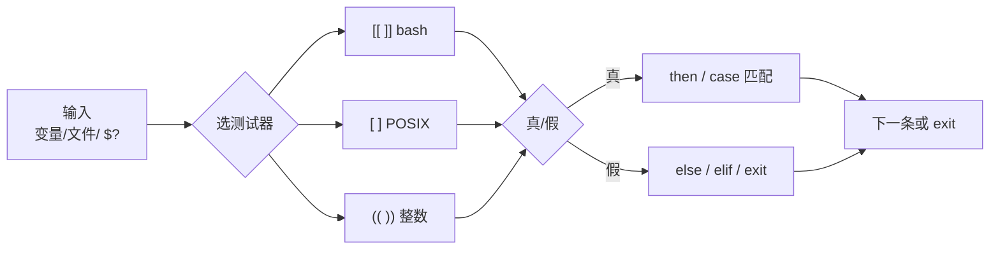

# 04｜条件测试与流程控制 · SRE 开发能力

> 发版脚本翻车现场：有人写 `[ $status = 200 ]`，变量一空就变成 `[ = 200 ]` 语法错误；有人用 `[ $count -gt 10 ]` 比 `"08"` 和 `"9"`，活动高峰误判「连接数正常」——群里已在喊「逻辑写错了，重发」。
> **本章回答**：一个分支从「测什么」（数值/字符串/文件）→「用什么测」（`[[ ]]` / `[ ]` / `test`）→「怎么走」（`if` / `case` / `&&` `||`）→「怎么交码」（`$?` / `exit`）的完整路径。
> **不讲**：三开关与 `errexit` 交互 → [02 脚本骨架](../02-脚本骨架与三开关/)；`PIPESTATUS` 管道成败 → [06](../06-管道重定向与PIPESTATUS/)；复杂参数解析 → [09](../09-参数解析与dry-run/)。

**标记**：🎯重点 · 🔥难点 · ⭐常考 · 🔧实操

---

## 面试怎么考

> 🎯 **一句话**：`[[ ]]` vs `[ ]` 选型、字符串 `=` vs 数值 `-eq`、文件测试、`case` 分发——四个高频考点。

| 标记 | 考点 |
|------|------|
| **核心** | `[[ ]]` vs `[ ]`；字符串用 `=`，数值用 `-eq`；`[ "$var" ]` 防空 |
| **必会** | 文件测试 `-f` `-d` `-e` `-s`；`if`/`elif`/`else`；`case` 多分支 |
| **常用** | `&&` `||` 短路；`(( ))` 算术比较；`[[ $s == *.log ]]` 模式 |
| **常考** | `[` 两侧必须有空格；`=` 与 `==` 在 bash `[[` 里；`-z` 测空串 |

**30 秒怎么说**：生产分支优先 `[[ ]]`——不拆词、支持 `&&` 和模式匹配。字符串 `[[ "$a" == "$b" ]]`，整数 `(( n > 10 ))` 或 `[[ $n -eq 10 ]]`，**别用 `-gt` 比字符串**。文件先 `-e` 再 `-f`/`-d`。`[` 是外部命令，变量必须加引号。`case` 做服务状态/退出码多路分发；简单二选一可用 `cmd && ok || fail`——但别当真 if-else。

---

## 能力边界

> 🎯 **一句话**：Shell 条件测试擅文件/进程/退出码分支，浮点和复杂逻辑换 Python。

| 维度 | Shell 条件 | Python if | Go if |
|------|-----------|-----------|-------|
| **适合** | 部署前检查、健康探测、按退出码分支 | 复杂布尔、类型明确 | 强类型比较 |
| **不适合** | 浮点比较、嵌套十层括号 | 一行改五十台 | 跳板机草稿 |
| **生命周期** | Runbook、CI gate | 可单测 | 编译分发 |

| 写法 | 何时用 | 别用于 |
|------|--------|--------|
| `[[ ]]` | **bash 脚本默认** | POSIX sh 严格模式 |
| `[ ]` / `test` | 要 POSIX、极简环境 | 模式匹配、含 `&&` 的复合条件 |
| `(( ))` | 整数比较、自增 | 字符串 |
| `case` | 多枚举（状态码、命令名） | 连续区间（用 `if`） |

> ⚠️ **别混**：review 脚本时搜 `[ `——凡 `$` 没引号、`[` 贴变量的，优先改 `[[ "$var" ... ]]`。`[[ ]]` 是 bash **关键字**，`[ ]` 是 POSIX **命令**，不是同一层东西。

---

## 一、一张图：一个分支判断的一生

> 🎯 **一句话**：收集条件 → 选测试器（`[[`/`[`/`((`）→ 真/假 → `if`/`case`/`&&` 选路径 → 可能 `exit`。



- 📖 **读图**
  - 🔀 菱形「选测试器」是面试高频——字符串、数值、文件三类**不能混操作符**
  - ⏱️ `$?` 是**上一条命令**的退出码，要在下一条跑之前立刻读；`set -e` 下未捕获的假分支可能直接退出 → [02](../02-脚本骨架与三开关/)

本节对应练习题 Q1、Q14。

---

## 二、出生：test 与 `[ ]` ⭐

> 🎯 **一句话**：`[` 是 `test` 的别名，都是**命令**——返回 0 真 / 非 0 假；**括号内侧必须有空格**。

### 📮 `[` 是命令，不是语法糖

- 🔑 **`[` = `test`**：POSIX 命令（常是 builtin，语义仍是「带参数的命令」）
- 🔥 **空格硬规则**：`[ -f /etc/passwd ]` 对；`[-f /etc/passwd]` 找名为 `[-f` 的命令
- 🎭 **小剧场**：很多人答「`[` 是语法糖」——错。它吃 argv，缺一项就**语法错误**，不是「条件为假」

```bash
# 等价
test -f /etc/passwd
[ -f /etc/passwd ]

status="200"
[ "$status" = "200" ] && echo ok

empty=""
# [ $empty = foo ]     # 变成 [ = foo ] → 语法错误
[ "$empty" = "foo" ]   # 假，但合法
```

#### ❓ 为什么空变量是「语法炸」不是「假」？

- 💣 `[` 启动后 arguments 必须完整；空 `$x` 让 argv 缺项 → `unary operator expected`
- ✅ 三种安全写法：`[ "$x" = "" ]` · `[[ $x = "" ]]` · `[[ -z "$x" ]]`
- ⚠️ **别混**：`=` 在 `[ ]` 里是**字符串比较**，不是赋值；赋值只在 `name=value` 且**无空格**

> 💡 **打个比方**：`[ ]` 像往邮局投表格——空一栏就「格式错误」退回；`[[ ]]` 是 bash 自己人——少了一个人不会报语法错，只是判断为假。

> 🔍 **现场** 🔧：配置存在再 source

```bash
cfg="/etc/game/deploy.conf"
if [ -f "$cfg" ]; then
  # shellcheck source=/dev/null
  source "$cfg"
else
  echo "missing $cfg" >&2
  exit 1
fi
```

本节对应练习题 Q1、Q2。

---

## 三、进化：`[[ ]]` —— bash 生产首选 ⭐

> 🎯 **一句话**：`[[ ]]` 是 shell 关键字——**不 word-splitting**、支持 `&&` `||`、右侧可做**模式**（不是路径 glob）。

```bash
[[ "$USER" == root ]] && echo "running as root"
[[ -f "$f" && -s "$f" ]] && process "$f"

file="access.log"
[[ $file == *.log ]] && echo "log file"   # 右侧无引号 → 模式

[[ $line =~ ^[0-9]+\.[0-9]+\.[0-9]+\.[0-9]+$ ]] && echo ip

[[ -z "$TOKEN" ]] && { echo "TOKEN required"; exit 1; }
[[ -n "$DEBUG" ]] && set -x
```

#### ❓ 为什么 bash 默认不用 `[ ]`？

- 🛡️ **不拆词**：`[[ $x = "" ]]` 空变量不炸；`[ $x = "" ]` 炸
- 🔗 **内嵌复合**：`[[ -f "$f" && -s "$f" ]]` 合法；`[ -f "$f" && -s "$f" ]` 不行
- 🧩 **模式 / 正则**：`== *.log`、`=~` 只有 `[[` 有
- 📜 **POSIX 例外**：严格 `sh` / 极简环境才退回 `[ ]`

| 特性 | `[ ]` | `[[ ]]` |
|------|:-----:|:-------:|
| 单词分割变量 | 会 | **不会** |
| 内嵌 `&&` `\|\|` | 不行 | **可以** |
| 模式 `== *.log` | 不行 | **可以** |
| 正则 `=~` | 不行 | **可以** |
| POSIX | 是 | 否（bash/ksh） |

> 📝 **面试**：「bash 用 `[[ ]]`；要 POSIX 才 `[ ]`。`[[` 里 `==`/`=` 都行；`[ ]` 字符串比较常用 `=`。」⭐

口诀：**bash 默认 `[[`，POSIX 才 `[`；空变量用 `[[` 不炸，用 `[` 要加引号**。

本节对应练习题 Q2、Q3。

---

## 四、三类测试：数值 · 字符串 · 文件 ⭐

> 🎯 **一句话**：**数值**用 `-eq/-ne/-lt` 或 `(( ))`；**字符串**用 `=`/`==`；**文件**用 `-e/-f/-d/-s/-r/-w/-x`。

### 🔢 数值比较 🔥

```bash
count=42
[[ $count -eq 42 ]]    # ← 真
(( count > 10 ))        # ← 真

a=08
# (( a > 7 ))          # ← 08: value too great for base（八进制无 8）

# 陷阱：别用 -gt 当「数字比大小」却喂字符串语义
(( 10 > 9 ))           # ← 真（算术）
```

#### ❓ 为什么 `(( a > 7 ))` 里 `a=08` 会炸？

- 🧮 `(( ))` 把 `0` 开头当**八进制**；八进制只有 0–7，`8` 非法位
- ✅ 修法：去前导零，或 `10#08` 强制十进制，或先 `a=$((10#$a))`
- ⚠️ **别混**：`-eq` 只给整数；浮点用 `bc` 或换 Python。`(( ))` 里未定义变量当 0，和 `set -u` 冲突时要注意

> 💡 **打个比方**：`(( 08 ))` 像你跟系统说「这是八进制 08」——系统不是在算数学，是在按「0 开头 = 八进制」解析字面量。

```bash
load=$(awk '{print int($1)}' /proc/loadavg)
cores=$(nproc)
if (( load > cores * 2 )); then
  echo "load high: $load cores=$cores"
fi
```

### 🔤 字符串比较

```bash
env="${DEPLOY_ENV:-prod}"
[[ "$env" == "prod" ]] && echo production
[[ "$env" != "staging" ]]

# 字典序——版本串别当数字
[[ "v1.10" < "v1.9" ]]   # ← 假（'1' vs '9' 字典序，不是语义版本）

[[ -z "$reply" ]] && reply="default"
```

> 🔍 **现场** 🔧：curl 健康检查

```bash
code=$(curl -s -o /dev/null -w '%{http_code}' --max-time 3 "$URL" || echo "000")
if [[ "$code" == "200" ]]; then
  echo "healthy"
elif [[ "$code" =~ ^5 ]]; then
  echo "upstream 5xx: $code" >&2
  exit 1
else
  echo "unexpected: $code" >&2
  exit 1
fi
```

### 📁 文件与目录 🔧

| 操作符 | 含义 | 典型用法 |
|--------|------|----------|
| `-e` | 存在（任意类型） | 先存在再细分 |
| `-f` | 普通文件 | 配置文件 |
| `-d` | 目录 | 日志目录 |
| `-s` | 存在且非空 | 避免处理空日志 |
| `-r` / `-w` / `-x` | 可读/可写/可执行 | 权限预检 |
| `-L` | 符号链接 | 追软链 |
| `f1 -nt f2` | f1 比 f2 新 | 比较 mtime |

```bash
log="/var/log/nginx/access.log"
[[ -f "$log" && -s "$log" ]] || { echo "no log"; exit 0; }

[[ -d "$BACKUP_DIR" ]] || mkdir -p "$BACKUP_DIR"
[[ -w "$BACKUP_DIR" ]] || { echo "not writable"; exit 1; }

# 链式：存在且是文件且非空
[[ -e "$f" && -f "$f" && -s "$f" ]]
```

本节对应练习题 Q4、Q5、Q6。

---

## 五、流程控制：`if` · `elif` · `else` ⭐

> 🎯 **一句话**：`if` 测的是**命令退出码**——`0` 走 then；`[[`/`[`/`((` 都是命令。

```bash
#!/usr/bin/env bash
set -euo pipefail

disk_pct=$(df -P / | awk 'NR==2 {gsub(/%/,""); print $5}')

if (( disk_pct >= 90 )); then
  echo "CRITICAL disk ${disk_pct}%" >&2
  exit 2
elif (( disk_pct >= 80 )); then
  echo "WARN disk ${disk_pct}%"
else
  echo "OK disk ${disk_pct}%"
fi
```

- ⚠️ **别混**：`if grep foo file` 测的是 grep **有没有匹配**，不是「文件内容布尔」——没匹配退出 1 走 else。要「含 foo」写 `if grep -q foo file; then`
- 🔧 **查命令在不在 PATH**

```bash
if command -v kubectl >/dev/null 2>&1; then
  kubectl version --client --short
else
  echo "kubectl not in PATH" >&2
  exit 1
fi
```

### 🧱 收束：`if` 凭什么能嵌套一切

> 🎯 **一句话**：`if` 后面跟**任意命令**——`[[`、普通命令、`!` 取反都行；条件位上的失败**不触发** `errexit`（bash）。

```bash
if ! ping -c1 -W1 "$host" >/dev/null 2>&1; then
  echo "$host down"
fi

if echo "$line" | grep -q ERROR; then
  echo "has error"
fi
```

- 📖 **读图（条件位 vs then 块）**
  - 条件位失败 → 走 else / 跳过 then，**不**因 `set -e` 直接退
  - then/else **块里**失败 → 仍会触发 `errexit`（细节 → [02](../02-脚本骨架与三开关/)）

本节对应练习题 Q7。

---

## 六、多路分发：`case` ⭐

> 🎯 **一句话**：`case word in pattern)` 按**模式**匹配——适合退出码、服务名、HTTP 前缀；`|` 表或；`*)` 默认。

```bash
handle_exit() {
  local code=$1
  case "$code" in
    0) echo "success" ;;
    1|2|3)
      echo "retryable: $code"
      return 1
      ;;
    12[0-7])
      echo "ssh/signal: $code"
      return "$code"
      ;;
    *)
      echo "unknown: $code" >&2
      return 99
      ;;
  esac
}

svc="${1:-}"
case "$svc" in
  nginx|openresty) systemctl reload nginx ;;
  game-logic|login-svc)
    kubectl rollout restart "deployment/$svc" -n game
    ;;
  "")
    echo "usage: $0 <svc>" >&2
    exit 1
    ;;
  *)
    echo "unsupported svc: $svc" >&2
    exit 1
    ;;
esac
```

> 🔍 **现场** 🔧：按 HTTP 码定告警级别

```bash
case "$http_code" in
  2*) level=OK ;;
  3*) level=REDIRECT ;;
  4*) level=CLIENT ;;
  5*) level=SERVER ;;
  *)  level=UNKNOWN ;;
esac
```

> 📝 **面试**：「多枚举用 `case`；区间可用 `12[0-7]`。每分支结尾 `;;` 别漏。默认 `*)` 处理意外输入。」

口诀：**`case` 多枚举，漏 `;;` 会穿透**。

本节对应练习题 Q8、Q9。

---

## 七、短路：`&&` 与 `||` 🔥

> 🎯 **一句话**：`cmd1 && cmd2`——前者 0 才跑后者；`cmd1 || cmd2`——前者非 0 才跑后者；和 `set -e` 组合是常见踩坑。

> 💡 **打个比方**：`A && B` 像「前面过了安检，你才过」；`A || B` 像「前面没过，你上」。`A && B || C` 是「A 过了但 B 被拦 → C 上」——**不是 if-else**，是两个短路拼出来的意外效果。

#### ❓ 为什么 `A && B || C` 不能当 if-else？

- ✅ 真 if-else：`A` 真 → 只跑 `B`；`A` 假 → 只跑 `C`
- 💣 `A && B || C`：若 `A` 真且 `B` 失败（非 0），`C` **仍会执行**
- ✅ 复杂逻辑写 `if`；短路只留给「存在才删」「空则赋默认」这类一行意图

```bash
[[ -f "$tmp" ]] && rm -f "$tmp"
[[ -z "${TAG:-}" ]] && TAG="$(git describe --tags --always)"

# 反模式：A || B && C —— 可读性差，改 if
if ! deploy; then
  rollback
  exit 1
fi
```

> ⚠️ **别混**：`cmd && exit 1` 在 `set -e` 下——条件链里的失败语义和独立命令不同；复杂逻辑写 `if`。

本节对应练习题 Q10。

---

## 八、退出码 `$?` 与 `exit` ⭐

> 🎯 **一句话**：每条命令返回 0–255；`$?` 是**紧挨着的上一条**的码；脚本用 `exit n` 交给 CI/监控。

```bash
kubectl rollout status "deployment/login-svc" -n game --timeout=120s
rc=$?
if (( rc != 0 )); then
  echo "rollout failed: $rc" >&2
  exit "$rc"
fi

is_port_open() {
  local port=$1
  if ss -ltn | grep -q ":${port} "; then
    return 0
  fi
  return 1
}
if is_port_open 8080; then echo "listening"; fi
```

> 🔍 **现场** 🔧：多检查汇总退出码

```bash
err=0
check_disk || err=1
check_load || err=1
check_svc  || err=1
exit "$err"
```

- 🔑 **时机**：`rc=$?` 必须紧跟目标命令；中间插一句 `echo` 就丢了
- 🔢 **模 256**：`return 300` → 实际 44；保持 0–255

本节对应练习题 Q11、Q12。

---

## 原理讲透：三个炸点 🔥

> 🎯 **一句话**：空变量炸、数值当字符串比、模式当 glob——都是没分清「测试器怎么解析参数」。

### 💥 空变量：`[ $x = y ]`

见第二节 ❓；现场三行对照：

```bash
x=""
[ $x = "" ]    # ← [: =: unary operator expected
[[ $x = "" ]]  # ← 真
[ "$x" = "" ]  # ← 真（POSIX 安全）
```

### 📊 数值 vs 字符串：活动监控误判

```bash
# 错：别依赖 -gt 喂字符串的「看起来像数字」
# 对
(( 9 > 10 ))          # ← 假
[[ 9 -gt 10 ]]        # ← 假（整数比较，变量要先清洗）
```

### 🧩 `[[` 模式 vs 路径 glob

#### ❓ 为什么 `[[ $f == *.log ]]` 不会读目录？

- 🧵 `[[ == ]]` 右侧无引号时是 **case 风格字符串模式**，不是 pathname expansion
- 📂 路径 glob 发生在**未加引号**的普通命令参数上（见 [03 变量引号](../03-变量引号与参数展开/)）
- ✅ `[[ $f == *.log ]]` 只问「这个字符串像不像 `*.log`」

```bash
f="access.log"
[[ $f == *.log ]] && echo match    # ← match
f="access.txt"
[[ $f == *.log ]] || echo no       # ← no
```

本节对应练习题 Q13、Q14。

---

## 生产模板 🔧

> 🎯 **一句话**：五个可直接复制的脚本——发布 gate、负载分级、命令分发、重试退出码、日志轮转检查。

### 模板 1：发布前 gate

```bash
#!/usr/bin/env bash
set -euo pipefail

NS=${NAMESPACE:?}
DEPLOY=${DEPLOYMENT:?}
MIN_READY=${MIN_READY:-80}

ready=$(kubectl get deploy "$DEPLOY" -n "$NS" \
  -o jsonpath='{.status.readyReplicas}' 2>/dev/null || echo 0)
desired=$(kubectl get deploy "$DEPLOY" -n "$NS" \
  -o jsonpath='{.spec.replicas}')

if [[ -z "$ready" || "$ready" == "0" ]]; then
  echo "no ready replicas" >&2
  exit 1
fi

pct=$(( ready * 100 / desired ))
if (( pct < MIN_READY )); then
  echo "ready ${pct}% < ${MIN_READY}%" >&2
  exit 1
fi
echo "gate ok: ${ready}/${desired}"
```

### 模板 2：磁盘/负载分级

```bash
#!/usr/bin/env bash
load_1m=$(awk '{print int($1+0.5)}' /proc/loadavg)
cores=$(nproc)

if (( load_1m > cores * 3 )); then
  level=CRITICAL
elif (( load_1m > cores * 2 )); then
  level=WARN
else
  level=OK
fi
echo "load=$load_1m cores=$cores level=$level"
```

### 模板 3：按命令名分发运维动作

```bash
#!/usr/bin/env bash
set -euo pipefail
cmd=${1:?usage: $0 restart|status|logs <svc>}

case "$cmd" in
  restart)
    svc=${2:?svc required}
    kubectl rollout restart "deployment/$svc" -n game
    ;;
  status)
    svc=${2:?svc required}
    kubectl rollout status "deployment/$svc" -n game --timeout=180s
    ;;
  logs)
    svc=${2:?svc required}
    kubectl logs -n game "deploy/$svc" --tail=100
    ;;
  *)
    echo "unknown cmd: $cmd" >&2
    exit 1
    ;;
esac
```

### 模板 4：重试与退出码

```bash
#!/usr/bin/env bash
max=5
n=0
until curl -sf --max-time 3 "$HEALTH_URL" >/dev/null; do
  (( n++ )) || true
  if (( n >= max )); then
    echo "health failed after $max tries" >&2
    exit 1
  fi
  sleep $(( n * 2 ))
done
echo "healthy"
```

### 模板 5：文件轮转前检查

```bash
#!/usr/bin/env bash
log=${1:?log path}
archive_dir=${2:-/var/log/archive}

[[ -f "$log" ]] || { echo "not a file: $log"; exit 1; }
[[ -s "$log" ]] || { echo "empty, skip"; exit 0; }
[[ -d "$archive_dir" ]] || mkdir -p "$archive_dir"
[[ -w "$archive_dir" ]] || { echo "archive not writable"; exit 1; }

ts=$(date +%Y%m%d%H%M%S)
cp -a "$log" "$archive_dir/$(basename "$log").$ts"
: > "$log"
echo "rotated to $archive_dir"
```

---

## 九、收口

### 命令速查 🔧

```bash
[[ -f "$f" && -s "$f" ]]          # 文件存在且非空
[[ -z "$v" ]] / [[ -n "$v" ]]     # 空 / 非空
[[ $n -eq 10 ]] / (( n > 10 ))    # 整数比较
[ "$v" = "x" ]                    # POSIX 字符串（必须引号）
case "$code" in 2*) ;; esac       # 多路分发
cmd && ok || fail                 # 短路（别当真 if-else）
rc=$?; exit "$rc"                 # 立刻读退出码再交
```

### 踩坑清单

| 现象 | 原因 | 修法 |
|------|------|------|
| `[: =: unary operator expected` | 空变量未引号 | `"$var"` 或 `[[ ]]` |
| `08: value too great for base` | 前导零八进制 | `10#08` 或去前导零 |
| `"10" -gt "9"` 反直觉 | 字符串当整数语义混用 | `(( 10 > 9 ))` |
| `if foo=bar` 不赋值 | `if` 测的是命令 | `if [[ foo == bar ]]` |
| `case` 穿透 | 漏 `;;` | 每分支 `;;` |
| `grep` 在 `if` 里误判 | 无匹配退出 1 | `if ! grep -q` 或预期匹配 |
| `[[ $a > $b ]]` 字典序 | 字符串比较 | 数值进 `(())` |
| `[ $a == $b ]` 在 sh 失败 | `==` 非 POSIX | `[ "$a" = "$b" ]` |
| `return 300` 变 44 | 退出码模 256 | 保持 0–255 |
| `A && B \|\| C` 跑了 C | 短路不是 if-else | 改 `if` |

### 面试锚点

| 问 | 30 秒答 |
|----|---------|
| `[[` vs `[`？ | bash 默认 `[[`；POSIX 才 `[`；`[[` 不拆词、可 `&&`/模式 |
| 空变量为什么炸？ | `[` 是命令，argv 缺项 → 语法错；引号或改 `[[` |
| 怎么比整数？ | `(( n > 10 ))` 或 `[[ $n -eq 10 ]]`；别用 `-gt` 比版本串 |
| 文件先测啥？ | 先 `-e`，再 `-f`/`-d`；轮转前加 `-s` |
| 多分支用啥？ | `case`；漏 `;;` 穿透；`*)` 兜底 |
| `$?` 何时读？ | 紧跟目标命令；中间插 echo 就丢 |
| `A && B \|\| C`？ | 不是 if-else；B 失败会跑 C |

### 易错一句话对照

- `[` 是语法糖 → `[`/`test` 是命令，空格和 argv 完整才合法
- bash 随便用 `[` 也行 → 生产默认 `[[`，POSIX 才 `[`
- `-eq`/`-gt` 能比版本串 / 浮点 → 整数专用；版本字典序，浮点换 `bc`/Python
- `=` 在 `[ ]` 里是赋值 → 字符串比较；赋值是无空格的 `name=value`
- `[[ $f == *.log ]]` 会扫目录 → 字符串模式，不是路径 glob
- `A && B \|\| C` = if-else → B 失败仍可能跑 C
- `$?` 隔几行还准 → 只反映上一条
- `case` 默认穿透 → 要 `;;` 才结束该分支
- `if [ -f $f ]` 安全 → `$f` 含空格/空值会炸

### 数字墙

> 退出码 **0** 成功 · `return`/`exit` 超过 **255** 模 256 · 健康检查常见 `--max-time 3` · 重试示例 **5** 次、退避 `n*2` 秒 · 磁盘分级 **80%** WARN / **90%** CRITICAL · ready gate 默认 **MIN_READY=80**

### 必会 · 常考（对错）

| 说法 | 对错 | 口径 |
|------|:----:|------|
| `[` 和 `test` 不等价 | 错 | `[` 是 `test` 同名接口 |
| `[[ ]]` 比 `[ ]` 更慢 | 错 | 关键字，通常更快更安全 |
| `-eq` 能比较 `"1.5"` | 错 | 整数专用 |
| `=` 在 `[ ]` 里是赋值 | 错 | 字符串比较 |
| `[[ -z "" ]]` 为真 | 对 | 空串 |
| `case` 默认穿透 | 错 | 要 `;;` |
| `$?` 能隔很多行仍准 | 错 | 只反映上一条 |
| `if [ -f $f ]` 安全 | 错 | 必须 `"$f"` 或 `[[ ]]` |

---

## 合上书

对着第一节主图口述一遍，卡住就回对应小节。开头那个「重发」现场——现在该能拦住他了。

- [ ] **默画主线**：选测试器 → 三类测什么 → `if`/`case`/`&&` → `exit`（→ Q1、Q14）
- [ ] **口述 `[`**：为什么是命令？空变量为什么语法炸？三种安全写法？（→ Q1、Q2）
- [ ] **口述 `[[`**：相对 `[` 三个优势；何时必须退回 `[`？（→ Q2、Q3）
- [ ] **口述数值**：比较 `count > 10` 两种正确写法；`08` 为什么炸；为何别用 `-gt` 比字符串？（→ Q4）
- [ ] **口述文件**：`-e`/`-f`/`-s` 组合；轮转前为什么要 `-s`？（→ Q6）
- [ ] **口述 `case`**：`1|2|3)` 与 `5*)`；漏 `;;` 会怎样？（→ Q8）
- [ ] **口述短路与 `$?`**：为什么 `A && B || C` 不是 if-else？`$?` 何时立刻读？（→ Q10、Q11）

七题都能口述，分支这一关就过了。下一章：**函数**与作用域，把重复检查收成可复用块。
