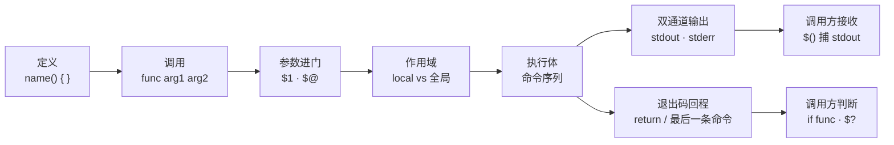
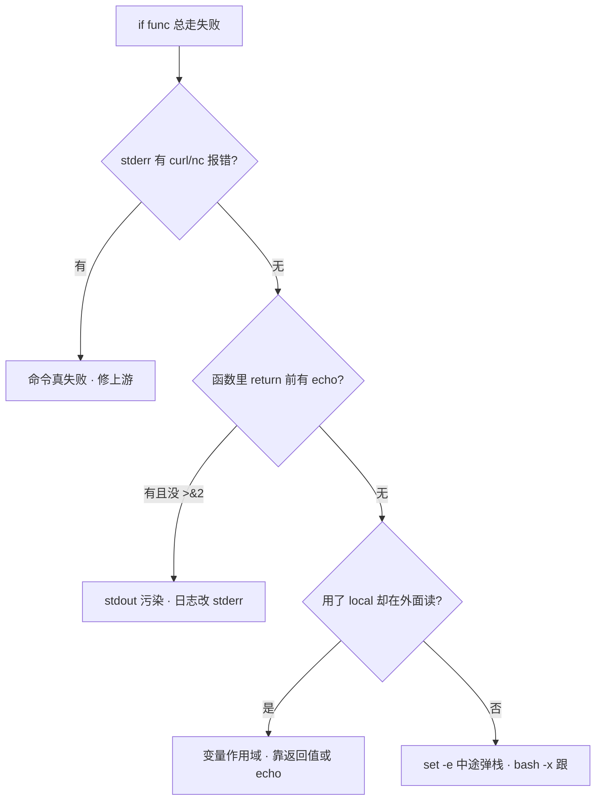

# 05 函数与作用域 · 知识点

> 巡检脚本里 `check_disk` 明明 echo 了 `OK`，上层 `if check_disk; then` 却走了失败分支；有人把 `local` 写在函数外，整脚本变量全空；还有人 `result=$(get_ip)` 却只收到空行——stderr 里明明有报错。
> **本章回答**：一次**函数调用**从定义到返回，参数怎么进、变量在哪活、`stdout`/`stderr`/`exit code` 三条通道各传什么、调用方怎么接。
> **不讲**：subshell 与 `( )` 的差异、后台 `&`/`wait` → [07](../07-进程作业与subshell/)；`set -euo pipefail` 三开关 → [02](../02-脚本骨架与三开关/)；管道中间失败 → [06](../06-管道重定向与PIPESTATUS/)。

**标记**：🎯重点 · 🔥难点 · ⭐常考 · 🔧实操

## 面试怎么考

- **核心**：函数没有「返回值类型」；`return` 只能传 0–255 退出码；字符串靠 `stdout`。
- **必会**：`local` 防污染全局；`$()` 只捕 stdout；日志/报错走 `>&2`。
- **常用**：`"$@"` 透传参数；默认参数 `${1:-}`；函数里 `set -e` 的行为。
- **常考**：`return` vs `exit`；`local` 在函数外报错；`echo` 捕结果 vs 退出码判成功。

**30 秒怎么说**：Bash 函数像子程序调用——参数用 `$1`/`"$@"` 进来，变量默认全局必须用 `local` 挡污染；**没有 return 字符串**，`return N` 只传退出码 0–255，业务数据走 `stdout`，日志和错误走 `stderr`；调用方 `if func` 看的是退出码，`$(func)` 捕的是 stdout。`exit` 会杀掉整个脚本，`return` 只从当前函数弹栈。

---

## 能力边界

| 维度 | Bash 函数 | Python `def` | Go `func` |
|------|-----------|--------------|-----------|
| **返回值** | 只有退出码；字符串靠 print/echo | 任意对象 `return` | 多返回值 `(T, error)` |
| **作用域** | 默认全局；`local` 手动隔离 | `LEGB` 规则 | 块级 + 包级 |
| **适合** | 脚本内复用、探活片段、库函数 `source` | 结构化逻辑、异常 | 常驻服务、并发 |
| **不适合** | 复杂状态机、深层嵌套 OOP | 编排 kubectl 一行链 | 写 20 行巡检 one-liner |

Shell 函数是**同进程内的代码块复用**，不是独立进程（除非你在函数里再 `fork` 外部命令）。理解这一点，才能解释为什么改全局变量会泄漏、为什么 `$(func)` 会开 subshell 捕输出。

---

## 一、一张图：一次函数调用的一生

> 🎯 **一句话**：函数调用像一次「有去有回」的子旅程——参数进门、作用域划定、双通道输出、退出码回程。



**读图**：从左到右跟一次真实调用——定义只是登记入口；`func a b` 把 `a`→`$1`、`b`→`$2`；`local` 在函数内圈一块临时地盘；执行时 stdout/stderr 各走各的 fd；最后 `return` 或最后一条命令的退出码回到 `$?`。`$()` 只接 stdout 那一段，**不接退出码**——判成败必须看 `if` 或 `$?`。

---

## 二、定义：函数怎么登记入口

> 🎯 **一句话**：两种写法等价，但函数名后必须有空格或 `()`，且要先定义再调用（除非 `source` 整文件）。

### 语法最小集

```bash
# 写法 A（推荐，POSIX 习惯）
check_port() {
  local host=$1 port=$2
  nc -z "$host" "$port"
}

# 写法 B（bashism，老脚本常见）
function check_port {
  local host=$1 port=$2
  nc -z "$host" "$port"
}
```

**`function` 关键字**：加不加都行；加了之后 `{` 前可以没有 `()`，但可读性更差。生产脚本统一用 `name() {`。

### 定义 vs 执行

```bash
# 文件 lib.sh 里只有定义
source ./lib.sh          # 或 . ./lib.sh —— 在当前 shell 里展开函数
check_port 127.0.0.1 3306

# 子脚本直接执行 —— 函数只在子进程里存在，父 shell 看不见
bash lib.sh              # 若 lib.sh 末尾没调用，等于白定义
```

> ⚠️ **别混**：`source lib.sh` 是在**当前 shell** 注册函数；`bash lib.sh` 是**子进程**跑完就销毁。库文件末尾常加 `[[ "${BASH_SOURCE[0]}" == "${0}" ]] || return` 防止被 `source` 时误执行主逻辑——完整模式见 [12](../12-生产脚本规范与模板/)。

> 🔍 **现场**：

```bash
declare -F | head -5     # ← 列出当前 shell 已注册的函数名
type check_port          # ← 看函数体来源（定义在哪个文件第几行）
```

---

## 三、调用：参数怎么进门 ⭐

> 🎯 **一句话**：位置参数 `$1..$n` 只在函数执行期间有效；透传子命令用 `"$@"`，不要用未加引号的 `$*`。

### 位置参数与默认值

```bash
usage() {
  echo "Usage: $0 [-h host] [-p port]" >&2
}

probe() {
  local host=${1:-127.0.0.1}    # ← 第一个参数缺省用 localhost
  local port=${2:-8080}
  curl -sf "http://${host}:${port}/health" >/dev/null
}
```

| 符号 | 含义 | 生产写法 |
|------|------|----------|
| `$1` `$2` … | 第 n 个参数 | 先 `local` 拷一份再改 |
| `$#` | 参数个数 | `[[ $# -lt 1 ]]` 做校验 |
| `$@` | 全部参数，每个独立单词 | `"$@"` 透传 |
| `$*` | 全部参数，IFS 合成一串 | 几乎不用 |
| `$0` | 脚本名（函数里仍是脚本名） | 写 usage 时用 |

```bash
run_remote() {
  ssh deploy@"$1" -- "${@:2}"    # ← $1 是主机，后面原样透传远程命令
}
run_remote web1 systemctl is-active nginx
```

**读图**：`"${@:2}"` 是 Bash 切片，从第 2 个参数起到末尾——比 `shift` 再 `"$@"` 更直观。

> 💡 **打个比方**：`$@` 像把行李一件件搬进函数；`$*` 像用一个大网兜全兜走——路径里有空格时网兜会把一件行李拆成两件。

> 📝 **面试**：透传参数为什么必须 `"$@"` 而不是 `$@` 或 `$*`？——引号保证每个参数仍是一个单词，空格/通配符不会被二次拆分。

---

## 四、作用域：变量在哪活着 ⭐🔥

> 🎯 **一句话**：Bash 函数内赋值**默认全局**；要用 `local` 显式圈局部，否则函数就是全局变量的「写穿器」。

### local 的机制

```bash
count=0

bad_inc() {
  count=$((count + 1))    # ← 没写 local，改的是全局 count
}

good_inc() {
  local count=0           # ← 函数内独立的 count，出了函数就销毁
  count=$((count + 1))
  echo "$count"
}
```

```bash
$ good_inc
1
$ echo "$count"           # ← 全局 count 仍是 0
0
```

> ⚠️ **别混**：`local` **只能在函数内**用——写在函数外直接语法错误。`local` 不是「声明后才能赋值」，可以 `local x=1` 一行写完。`declare -i`/`readonly` 可以和 `local` 叠用：`local -r cfg=/etc/app.conf`。

### 函数能读但不能随便写外层变量

```bash
retry=3

do_wait() {
  echo "retry=$retry"     # ← 读全局 OK
  retry=0                 # ← 写全局：能，但污染调用方
  local retry=5             # ← local 遮蔽全局，函数内看到的是 5
}
```

**遮蔽（shadowing）**：函数里 `local retry=5` 之后，函数体内 `retry` 指局部变量；全局 `retry` 没被改。出了函数，局部销毁，全局仍是 3。

> 🔍 **现场**（变量 mysteriously 变空）：

```bash
bash -x script.sh 2>&1 | grep -E '^\+ (local|count=)'   # ← 看哪一步把全局盖掉
```

### 与 subshell 的边界

函数体**不是** subshell——`count=$((count+1))` 没写 `local` 就真的改了全局。对比：

```bash
( count=$((count+1)) )    # ← 圆括号是 subshell，改不到外面
```

subshell 与后台作业的完整规则 → [07](../07-进程作业与subshell/)。本章只记：**函数 = 同 shell 作用域；`$()` / `( )` = 子 shell**。

### 收束：作用域三句话

```text
① 进函数先 local 一切会改的变量
② 需要回写全局：故意不写 local，但函数名要叫 set_* 让人一眼看出副作用
③ 读配置用全局/环境变量；临时变量一律 local
```

---

## 五、执行体：函数里命令怎么跑

> 🎯 **一句话**：函数体就是一串命令；开启 `set -e` 时，任一命令非零退出会立刻弹出——除非在 `if`/`while` 条件里。

```bash
set -euo pipefail

safe_deploy() {
  local ver=$1
  kubectl set image deploy/app app=registry/app:"$ver"   # ← 失败则函数退出
  kubectl rollout status deploy/app --timeout=120s
}
```

- 函数体顶层命令失败：函数立即返回该退出码。
- `if cmd; then`：**不**触发 `-e`，条件位里的失败被当作判断信号。
- `cmd || true`：人为吞掉，继续执行下一行——但失败信息已丢。
- 管道中间失败：需 `pipefail`（见 [06](../06-管道重定向与PIPESTATUS/)），否则 `-e` 只看末尾。

> 🔍 **现场**（函数在第二行静默退出，第三行没跑）：

```bash
bash -x deploy.sh 2>&1 | tail -20   # ← 看到 +kubectl rollout status 后没下一行 = 在这弹栈了
echo "rc=$?"                        # ← 函数退出码，非 0 说明 rollout 超时或失败
```

> 📝 **面试**：函数里 `set -e` 和外面一样生效——函数不是 `-e` 的避风港。要在函数内容忍失败，用 `if ! cmd` 或 `cmd || return 1` 显式处理。

---

## 六、输出：stdout 与 stderr 两条路 ⭐🔥

> 🎯 **一句话**：`stdout` 传**数据**，`stderr` 传**给人看的话**；`$()` 只接 `stdout`，接 stderr 会糊进终端或进不了变量。

### 通道分工

```bash
get_primary_ip() {
  local ip
  ip=$(ip -4 route get 1.1.1.1 2>/dev/null | awk '{print $7; exit}')
  if [[ -z "$ip" ]]; then
    echo "ERROR: cannot detect primary IP" >&2    # ← 报错走 stderr
    return 1
  fi
  echo "$ip"                                        # ← 数据走 stdout，给 $() 捕
}
```

```bash
$ ip_addr=$(get_primary_ip) && echo "ip=$ip_addr"
ip=10.0.0.5

$ ip_addr=$(get_primary_ip bogus) 2>/dev/null || echo "failed with $?"
failed with 1                        # ← stderr 被重定向走；退出码 1 被 if/|| 捕到
```

**读图**：成功路径只有**一行**干净数据在 stdout——方便 `$(get_primary_ip)` 赋值。若在 stdout 混 `echo "checking..."`，变量里就脏了。

> 💡 **打个比方**：stdout 是快递传送带，`$()` 是终点收件筐——传送带上放什么，筐里就有什么；stderr 是旁边的广播喇叭，喊得再响也进不了筐，只在车间里响。日志混进 stdout 就像往快递包裹里塞了一张广告传单，收件人拆开一看全是废纸。

> ⚠️ **别混**：`echo` 不是日志库——调试信息、进度、错误提示一律 `>&2`。`logger`/`printf '%s\n'` 同理：给机器吃的走 stdout，给人看的走 stderr。

### echo 的坑

```bash
# 危险：选项注入
name="-n"
echo "$name"              # ← 可能不吃换行

# 生产用 printf
printf '%s\n' "$name"
```

- `echo "$var"`：`-n`、`-e` 以变量开头时会被当选项吞掉。
- `echo $var`：未引用，分词 + 通配展开。
- `printf '%s\n' "$var"`：**推荐**，不受选项注入影响。

> 🔍 **现场**（捕到的变量带 `OK` 前缀导致 curl 404）：

```bash
# 坏：stdout 混了提示
bad() { echo "checking..."; echo "10.0.0.1"; }
host=$(bad)    # host='checking...\n10.0.0.1'

# 好
good() { echo "checking..." >&2; echo "10.0.0.1"; }
```

---

## 七、返回：退出码怎么传回去 ⭐🔥

> 🎯 **一句话**：`return N` 设置函数退出码（0–255）；不写 `return` 时，退出码 = **最后一条命令**的码；**不能** `return` 字符串。

> 💡 **打个比方**：`return` 像考场里举手示意「做完了」还是「卡住了」——只有一个 0 或非零的手势；你写了什么答案得另交答题纸（stdout），不能靠举手的姿势来传内容。`return 404` 和 `return 1` 对调用方来说就是「举手说卡住了」，具体是 404 还是 1 要看 stderr 上的说明。

### return 与 $?

```bash
is_listening() {
  local port=$1
  ss -lnt | grep -q ":${port} " && return 0
  return 1
}

if is_listening 3306; then
  echo "mysql up"
fi

is_listening 9999
echo $?                    # ← 1
```

```bash
calc() {
  echo $(( $1 + $2 ))       # ← 最后一条是 echo，退出码 0（即使算错也不会非零）
}
calc 1 2
echo $?                    # ← 0，不是「计算结果」
```

> ⚠️ **别混**：`return` 只在函数里用；`exit` 结束**整个脚本**（或子 shell）。库函数里手滑 `exit 1` 会把整台巡检脚本杀掉——这是 P0 事故源。

| 机制 | 传什么 | 调用方怎么接 |
|------|--------|--------------|
| `return N` / 最后命令 | 退出码 0–255 | `if func`、`$?` |
| `echo` / `printf` stdout | 字符串/数据 | `var=$(func)` |
| `>&2` | 日志/错误文案 | 重定向到文件或 `/dev/null` |

### 退出码 > 255

```bash
return 300
echo $?                    # ← 44（300 % 256）——别拿 return 传业务错误码
```

业务错误码用 **stdout 结构化输出** 或 **stderr + 约定退出码表**，不要指望 `return 404`。

> 📝 **面试**：Bash 函数能否 `return` 字符串？——不能。字符串走 stdout；失败走非零退出码 + stderr 说明原因。和 Python/Go 的 `return value, err` 不是一套模型。

---

## 八、组合模式：数据与成败拆开

> 🎯 **一句话**：成熟函数同时交付「干净 stdout」+「可靠退出码」+「可选 stderr 日志」——三个通道各干各的。

```bash
fetch_json() {
  local url=$1 out
  if ! out=$(curl -sf --max-time 5 "$url"); then
    echo "curl failed: $url" >&2
    return 1
  fi
  printf '%s' "$out"        # ← 不加多余换行时业务方更好 jq
}
```

```bash
if data=$(fetch_json "http://api/status"); then
  echo "$data" | jq -r '.phase'
else
  echo "skip" >&2
fi
```

### 反模式对照

```text
❌  stdout 打日志 + 数据混在一起 → $(func) 解析崩
❌  失败仍 echo 默认值且 return 0 → 上层以为成功
❌  用全局变量回传结果 → 并发/嵌套调用互相踩
✅  数据 stdout、日志 stderr、成败看退出码
✅  需要多个返回值：stdout 打 JSON/TAB 分隔，或命名全局只在文档里声明副作用
```

---

## 九、生产模板 🔧

### 模板 1：探活函数（成败 + 原因）

```bash
#!/usr/bin/env bash
set -euo pipefail

log() { printf '%s\n' "$*" >&2; }

check_http() {
  local url=${1:?url required}
  local code
  code=$(curl -o /dev/null -sf -w '%{http_code}' --max-time 3 "$url" || echo "000")
  if [[ "$code" == "200" ]]; then
    return 0
  fi
  log "FAIL $url http_code=$code"
  return 1
}

main() {
  local failed=0
  check_http "http://127.0.0.1/health" || failed=$((failed + 1))
  check_http "http://127.0.0.1/metrics" || failed=$((failed + 1))
  return "$failed"    # ← 0=全过，非零=失败个数（注意上限 255）
}
main
```

### 模板 2：库函数 + main 守卫

```bash
# lib/log.sh
log_info()  { printf '[INFO] %s\n' "$*" >&2; }
log_error() { printf '[ERROR] %s\n' "$*" >&2; }

# scripts/deploy.sh
set -euo pipefail
source "$(dirname "$0")/../lib/log.sh"

deploy() {
  local ver=${1:?}
  log_info "deploy version=$ver"
  kubectl set image deploy/app app="registry/app:${ver}"
}

if [[ "${BASH_SOURCE[0]}" == "${0}" ]]; then
  deploy "${1:?usage: deploy VER}"
fi
```

### 模板 3：纯数据函数（供 `$()` 消费）

```bash
pod_ip() {
  local ns=$1 name=$2
  kubectl get pod -n "$ns" "$name" -o jsonpath='{.status.podIP}' 2>/dev/null
}

ip=$(pod_ip default nginx-0)
[[ -n "$ip" ]] || { echo "no ip" >&2; exit 1; }
```

---

## 十、作战：函数相关故障定责



| 现象 | 先做 | 别做 |
|------|------|------|
| `$(func)` 为空 | `type func`；单独跑函数看 stdout | 以为是退出码问题 |
| 全局变量被改乱 | `grep -n '^[a-z].*=' script.sh` 找缺 `local` | 加 `export` 掩盖 |
| 库脚本 `exit` 杀主流程 | 改 `return`；`source` 加 main 守卫 | `set +e` 全局关 |

**60 秒剧本** 🔧：

```text
0–15s   复现：bash -x script.sh 2>&1 | tail -30
15–30s  单独执行可疑函数，分看 stdout / stderr / echo $?
30–45s  查 local：函数内是否写穿全局
45–60s  查通道：日志是否误走 stdout
```

---

## 十一、踩坑清单

| 现象 | 原因 | 修法 |
|------|------|------|
| `local: can only be used in a function` | `local` 写在函数外 | 移到函数内或改普通赋值 |
| `$(func)` 带调试前缀 | `echo` 打进度没 `>&2` | 日志改 stderr |
| `if func` 永远失败 | 最后一条是 `echo` 前的失败命令被 `\|\|` 吞了？或 `return` 路径错 | `bash -x` |
| 全局计数器乱跳 | 函数内忘 `local` | 进函数先 `local` |
| 库脚本一 source 就部署 | 缺 `BASH_SOURCE` 守卫 | 见模板 2 |
| `return 404` 上层收到 148 | 退出码模 256 | 用 stdout 传码表 |
| `host=$(get_ip)` 多行 | stdout 多条 echo | 只 echo 一行数据 |
| 函数里 `exit 1` 脚本全停 | `exit` vs `return` 混用 | 库函数只 `return` |

---

## 十二、必会 · 常考

| 说法 | 对错 | 口径 |
|------|:----:|------|
| Bash 函数能 `return "ok"` | 错 | 只能 `return` 0–255；字符串走 stdout |
| 函数内变量默认局部 | 错 | **默认全局**，必须 `local` |
| `$()` 能捕到退出码 | 错 | 捕 stdout；退出码看 `$?`/`if` |
| `echo` 适合打日志 | 错 | 日志 `>&2`；数据 `printf` |
| `return` 和 `exit` 一样 | 错 | `return` 弹栈；`exit` 杀进程 |
| `"$@"` 和 `$*` 等价 | 错 | 透传用 `"$@"` |
| 函数体会开 subshell | 错 | 同 shell；`$()` 才 subshell |
| `set -e` 在函数里不生效 | 错 | 一样生效 |

**面试锚点**

| 问 | 30 秒答 |
|----|---------|
| 函数怎么返回值？ | 退出码 `return`/最后命令；数据 stdout；日志 stderr |
| 为什么要 `local`？ | 默认全局，函数是写穿器 |
| `$()` 和 `if func` 区别？ | 前者捕 stdout；后者看退出码 |
| `return` 和 `exit`？ | `return` 结束函数；`exit` 结束脚本 |

**易错一句话**

```text
错：函数 return 字符串给调用方
对：字符串 echo 到 stdout，成败看退出码

错：调试 echo 无所谓通道
对：给人看的 >&2，给 $() 的只有 stdout 一行

错：函数里随便改外面变量
对：要改就故意命名 set_*；否则 local
```

**数字墙**

```text
退出码：0 成功 · 1–255 失败语义 · >255 会 %256
return：与 exit 不同，不结束脚本
$?：紧挨命令后读取，中间别插别的命令
```

---

## 合上书，问自己

- [ ] **默画**「一次函数调用的一生」：定义 → 参数 → 作用域 → 执行 → stdout/stderr → 退出码 → 调用方接收。
- [ ] 为什么说 Bash 函数默认是全局变量的写穿器？`local` 写在外面会怎样？
- [ ] `$(get_ip)` 和 `if get_ip; then` 分别接的是什么？为什么日志不能 `echo` 到 stdout？
- [ ] `return 300` 上层看到多少？业务错误码应该怎么传？
- [ ] `return` 和 `exit` 在库函数里用错会怎样？
- [ ] 透传参数为什么写 `"$@"`？`"${@:2}"` 干什么用？
- [ ] 说出探活函数的三通道分工：数据、日志、成败各走哪。
- [ ] `set -e` 在函数里失败时会发生什么？什么情况下不触发？

八题都能口述，这一章就过了。下一章：[06 管道重定向与 PIPESTATUS](../06-管道重定向与PIPESTATUS/)——一条管道中间挂了为什么 `$?` 还是 0。
