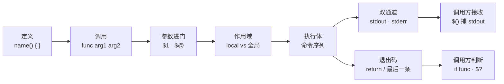
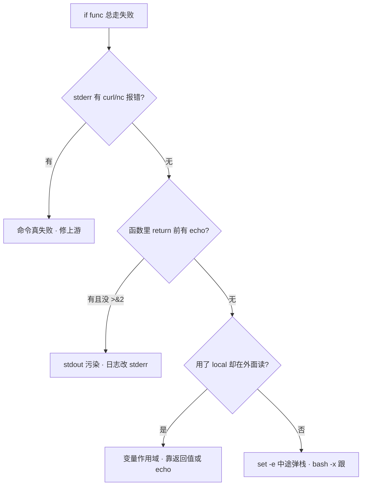

# 05｜函数与作用域 · SRE 开发能力

> 巡检脚本里 `check_disk` 明明 echo 了 `OK`，上层 `if check_disk; then` 却走失败分支；有人把 `local` 写在函数外，整脚本变量全空；还有人 `result=$(get_ip)` 只收到空行——stderr 里明明有报错。群里已有人喊「探活函数写坏了，先注释掉」。
> **本章回答**：一次**函数调用**从定义到返回——参数怎么进、变量在哪活、`stdout` / `stderr` / 退出码三条通道各传什么、调用方怎么接。
> **不讲**：subshell 与 `( )`、后台 `&`/`wait` → [07](../07-进程作业与subshell/)；`set -euo pipefail` → [02](../02-脚本骨架与三开关/)；管道中间失败 → [06](../06-管道重定向与PIPESTATUS/)。

**标记**：🎯重点 · 🔥难点 · ⭐常考 · 🔧实操

---

## 一、一张图：一次函数调用的一生

> 🎯 **一句话**：函数调用是同进程里的「有去有回」——参数进门、作用域划定、双通道输出、退出码回程；卡在哪一段，第一刀就落在哪条通道。



- 📖 **读图**
  - 🛤️ 主线「定义 → 参数 → 作用域 → 执行 → 双通道 → 退出码」；`$()` 只接 stdout，**不接退出码**
  - 🔪 开篇三个现场：`if` 失败看退出码线；`$()` 空看 stdout/stderr 拆没拆；变量写穿看缺不缺 `local`（Q1、Q8、Q14）

- 🗺️ **能力边界（一眼）**
  - Bash 函数 = **同进程**代码块复用，不是独立进程（除非函数里再 fork）
  - 返回值只有退出码 0–255；字符串靠 stdout；作用域默认**全局**，要 `local` 才隔离
  - 适合：探活片段、库函数 `source`、脚本内复用；不适合：深层状态机、复杂 OOP → 换 Python/Go

> 📝 **面试**：Bash 函数像子程序——`$1`/`"$@"` 进门，默认全局必须 `local`；**没有 return 字符串**，数据走 stdout、日志走 stderr、成败看退出码；`exit` 杀整脚本，`return` 只弹栈。⭐

本节对应练习题 Q1、Q8、Q14。

---

## 二、定义：函数怎么登记入口

> 🎯 **一句话**：两种写法等价，生产统一 `name() {`；要先定义再调用（除非 `source` 整文件）。

### 📝 语法最小集

```bash
# 写法 A（推荐，POSIX 习惯）
check_port() {
  local host=$1 port=$2
  nc -z "$host" "$port"
}

# 写法 B（bashism，老脚本常见）
function check_port {
  local host=$1 port=$2
  nc -z "$host" "$port"
}
```

- 🔑 **`function` 关键字**：加不加都行；加了后 `{` 前可以没有 `()`，可读性更差——生产统一 `name() {`

### 📦 定义 vs 执行

```bash
# 文件 lib.sh 里只有定义
source ./lib.sh          # 或 . ./lib.sh —— 在当前 shell 里展开函数
check_port 127.0.0.1 3306

# 子脚本直接执行 —— 函数只在子进程里存在，父 shell 看不见
bash lib.sh              # 若 lib.sh 末尾没调用，等于白定义
```

> ⚠️ **别混**：`source lib.sh` 是在**当前 shell**注册函数；`bash lib.sh` 是**子进程**跑完就销毁。库文件末尾常加 `[[ "${BASH_SOURCE[0]}" == "${0}" ]] || return` 防止被 `source` 时误执行主逻辑——完整模式见 [12](../12-生产脚本规范与模板/)。

> 🔍 **现场**：

```bash
declare -F | head -5     # ← 列出当前 shell 已注册的函数名
type check_port          # ← 看函数体来源（定义在哪个文件第几行）
```

入口登记清楚了，参数怎么进门？

本节对应练习题 Q8、Q13。

---

## 三、调用：参数怎么进门 ⭐

> 🎯 **一句话**：位置参数 `$1..$n` 只在函数执行期间有效；透传子命令永远 `"$@"`，不要未加引号的 `$*`。

### 📬 位置参数与默认值

```bash
usage() {
  echo "Usage: $0 [-h host] [-p port]" >&2
}

probe() {
  local host=${1:-127.0.0.1}    # ← 第一个参数缺省用 localhost
  local port=${2:-8080}
  curl -sf "http://${host}:${port}/health" >/dev/null
}
```

- 🔑 **符号一览**（生产写法钉死）
  - `$1` `$2` … → 第 n 个参数；先 `local` 拷一份再改
  - `$#` → 参数个数；`[[ $# -lt 1 ]]` 做校验
  - `"$@"` → 全部参数、每个独立单词；**透传唯一正解**
  - `$*` → IFS 合成一串；几乎不用
  - `$0` → 脚本名（函数里仍是脚本名）；写 usage 用

```bash
run_remote() {
  ssh deploy@"$1" -- "${@:2}"    # ← $1 是主机，后面原样透传远程命令
}
run_remote web1 systemctl is-active nginx
```

- 📖 **读图**：`"${@:2}"` 是 Bash 切片，从第 2 个参数起到末尾——比 `shift` 再 `"$@"` 更直观

#### ❓ 为什么透传必须 `"$@"`，不能 `$*`？

> 💡 **打个比方**：`$@` 像把行李一件件搬进函数；`$*` 像用一个大网兜全兜走——路径里有空格时网兜会把一件行李拆成两件。

- ❌ **未加引号的 `$@` / `$*`**：二次 word splitting + glob，路径空格炸成多个参数
- ✅ **`"$var"` 透传**：每个参数仍是一个单词
- ✂️ **切片**：`"$@"` 全透；`"${@:2}"` 从第 2 个起；几乎不用 `$*`

> 📝 **面试**：透传为什么必须 `"$@"`？——引号保证每个参数仍是一个单词，空格/通配符不会被二次拆分。⭐（Q6）

口诀：**透传用 `"$@"`，切片用 `"${@:2}"`，几乎不用 `$*`**。

本节对应练习题 Q6。

---

## 四、作用域：变量在哪活着 ⭐🔥

> 🎯 **一句话**：Bash 函数内赋值**默认全局**；要用 `local` 显式圈局部，否则函数就是全局变量的「写穿器」。

🔥 高频错答：「函数里的变量当然是局部的」。大白话：**Bash 函数默认跟外面共用一张变量表**；不写 `local`，你改的就是全局。

### 🧱 local 的机制

```bash
count=0

bad_inc() {
  count=$((count + 1))    # ← 没写 local，改的是全局 count
}

good_inc() {
  local count=0           # ← 函数内独立的 count，出了函数就销毁
  count=$((count + 1))
  echo "$count"
}
```

```bash
$ good_inc
1
$ echo "$count"           # ← 全局 count 仍是 0
0
```

#### ❓ 为什么默认不是局部的？函数是不是 subshell？

- 🧬 **历史/模型**：Bash 函数是**同 shell 作用域**的命名代码块，不是新进程——共享变量表是刻意设计，方便「库函数改配置」
- ✅ **要隔离就显式 `local`**：进函数先 `local` 一切会改的临时量
- 🫧 **对比 subshell**：`( count=$((count+1)) )` 改不到外面；`$()` 也是子 shell——本章只记：**函数 = 同 shell；`$()` / `( )` = 子 shell**（完整规则 → [07](../07-进程作业与subshell/)）

> ⚠️ **别混**：`local` **只能在函数内**用——写在函数外直接语法错误。可以 `local x=1` 一行写完；可叠属性：`local -r cfg=/etc/app.conf`。

### 🪞 读全局 vs 写全局 vs 遮蔽

```bash
retry=3

do_wait() {
  echo "retry=$retry"     # ← 读全局 OK
  retry=0                 # ← 写全局：能，但污染调用方
  local retry=5           # ← local 遮蔽全局，函数内看到的是 5
}
```

- 🔑 **遮蔽（shadowing）**：`local retry=5` 之后函数体内指局部；全局没被改。出函数局部销毁，全局仍是 3
- 🏷️ **故意回写全局**：不写 `local`，但函数名要叫 `set_*`，让人一眼看出副作用

> 🔍 **现场**（变量 mysteriously 变空）：

```bash
bash -x script.sh 2>&1 | grep -E '^\+ (local|count=)'   # ← 看哪一步把全局盖掉
```

### 收束：作用域三句话

```text
① 进函数先 local 一切会改的变量
② 需要回写全局：故意不写 local，但函数名要叫 set_* 让人一眼看出副作用
③ 读配置用全局/环境变量；临时变量一律 local
```

变量在哪活清楚了——函数体里命令失败了，会不会立刻停？

本节对应练习题 Q2、Q10、Q14。

---

## 五、执行体：函数里命令怎么跑

> 🎯 **一句话**：函数体就是一串命令；开启 `set -e` 时，任一命令非零退出会立刻弹栈——除非在 `if`/`while` 条件里。

```bash
set -euo pipefail

safe_deploy() {
  local ver=$1
  kubectl set image deploy/app app=registry/app:"$ver"   # ← 失败则函数退出
  kubectl rollout status deploy/app --timeout=120s
}
```

- 🧨 **顶层命令失败**：函数立即返回该退出码
- 🛡️ **`if cmd; then`**：**不**触发 `-e`，条件位里的失败当判断信号
- 🙈 **`cmd || true`**：人为吞掉，继续下一行——失败信息已丢
- 🔗 **管道中间失败**：需 `pipefail`（见 [06](../06-管道重定向与PIPESTATUS/)），否则 `-e` 只看末尾

> 🔍 **现场**（函数在第二行静默退出，第三行没跑）：

```bash
bash -x deploy.sh 2>&1 | tail -20   # ← 看到 +kubectl rollout status 后没下一行 = 在这弹栈了
echo "rc=$?"                        # ← 函数退出码，非 0 说明 rollout 超时或失败
```

> 📝 **面试**：函数里 `set -e` 和外面一样生效——函数不是 `-e` 的避风港。要容忍失败，用 `if ! cmd` 或 `cmd || return 1` 显式处理。（Q7）

本节对应练习题 Q7。

---

## 六、输出：stdout 与 stderr 两条路 ⭐🔥

> 🎯 **一句话**：`stdout` 传**数据**，`stderr` 传**给人看的话**；`$()` 只接 `stdout`，接错通道会糊进终端或进不了变量。

🔥 开头「`$()` 空、终端却有输出」的根因。终端「看得见」的，不一定是 stdout。

### 🛤️ 通道分工

```bash
get_primary_ip() {
  local ip
  ip=$(ip -4 route get 1.1.1.1 2>/dev/null | awk '{print $7; exit}')
  if [[ -z "$ip" ]]; then
    echo "ERROR: cannot detect primary IP" >&2    # ← 报错走 stderr
    return 1
  fi
  echo "$ip"                                        # ← 数据走 stdout，给 $() 捕
}
```

```bash
$ ip_addr=$(get_primary_ip) && echo "ip=$ip_addr"
ip=10.0.0.5

$ ip_addr=$(get_primary_ip bogus) 2>/dev/null || echo "failed with $?"
failed with 1                        # ← stderr 被重定向走；退出码 1 被 if/|| 捕到
```

- 📖 **读图**：成功路径只有**一行**干净数据在 stdout——方便 `$(get_primary_ip)`。若在 stdout 混 `echo "checking..."`，变量里就脏了

#### ❓ 为什么 `$()` 捕不到退出码？日志为什么不能 echo 到 stdout？

> 💡 **打个比方**：stdout 是快递传送带，`$()` 是终点收件筐——传送带上放什么，筐里就有什么；stderr 是旁边的广播喇叭，喊得再响也进不了筐。日志混进 stdout = 往包裹里塞广告传单。

- 📦 **`$()` 的契约**：只捕 stdout 字节流；退出码另看 `$?` / `if`
- 📢 **给人看的**（进度、错误、调试）：一律 `>&2`
- 🧾 **给机器吃的**（IP、JSON、路径）：干净 stdout，最好一行
- ❌ **反模式**：失败仍 `echo` 默认值且 `return 0` → 上层以为成功

> ⚠️ **别混**：`echo` 不是日志库——调试/进度/错误提示一律 `>&2`。`logger`/`printf '%s\n'` 同理：给机器吃的走 stdout，给人看的走 stderr。

### 🪤 echo 的坑

```bash
# 危险：选项注入
name="-n"
echo "$name"              # ← 可能不吃换行

# 生产用 printf
printf '%s\n' "$name"
```

- `echo "$var"`：`-n`、`-e` 以变量开头时会被当选项吞掉
- `echo $var`：未引用，分词 + 通配展开
- `printf '%s\n' "$var"`：**推荐**，不受选项注入影响

> 🔍 **现场**（捕到的变量带 `OK` 前缀导致 curl 404）：

```bash
# 坏：stdout 混了提示
bad() { echo "checking..."; echo "10.0.0.1"; }
host=$(bad)    # host='checking...\n10.0.0.1'

# 好
good() { echo "checking..." >&2; echo "10.0.0.1"; }
```

口诀：**数据进筐（stdout），喇叭给人听（stderr）**——`$()` 只收筐里的。

本节对应练习题 Q3、Q5、Q12。

---

## 七、返回：退出码怎么传回去 ⭐🔥

> 🎯 **一句话**：`return N` 设置函数退出码（0–255）；不写 `return` 时，退出码 = **最后一条命令**的码；**不能** `return` 字符串。

🔥 高频错答：「函数能 `return "ok"`，跟 Python 一样」。`return` 传的到底是什么？

> 💡 **打个比方**：`return` 像考场举手示意「做完了 / 卡住了」——只有一个 0 或非零的手势；答案另交答题纸（stdout），不能靠举手姿势传内容。

### ✅ return 与 $?

```bash
is_listening() {
  local port=$1
  ss -lnt | grep -q ":${port} " && return 0
  return 1
}

if is_listening 3306; then
  echo "mysql up"
fi

is_listening 9999
echo $?                    # ← 1
```

```bash
calc() {
  echo $(( $1 + $2 ))       # ← 最后一条是 echo，退出码 0（即使算错也不会非零）
}
calc 1 2
echo $?                    # ← 0，不是「计算结果」
```

#### ❓ 为什么不能 `return` 字符串？`return` 和 `exit` 差在哪？

- 🚫 **没有返回值类型**：`return` 只写进程退出码语义（0–255）；字符串必须 `echo`/`printf` 到 stdout
- 🧨 **`return`**：只从当前函数弹栈；**`exit`**：结束**整个脚本**（或子 shell）
- 🚨 **库函数手滑 `exit 1`** = 整台巡检脚本被杀掉——P0 事故源

| 机制 | 传什么 | 调用方怎么接 |
|------|--------|--------------|
| `return N` / 最后命令 | 退出码 0–255 | `if func`、`$?` |
| `echo` / `printf` stdout | 字符串/数据 | `var=$(func)` |
| `>&2` | 日志/错误文案 | 重定向到文件或 `/dev/null` |

#### ❓ 为什么 `return 300` 上层看到 44？

```bash
return 300
echo $?                    # ← 44（300 % 256）——别拿 return 传业务错误码
```

- 🔢 **退出码是 8 位**：大于 255 会 `% 256`
- 📋 **业务错误码**：用 stdout 结构化输出，或 stderr + 约定小退出码表——不要指望 `return 404`

> ⚠️ **别混**：`return` 只在函数里用；`exit` 结束整个脚本。`calc` 那种「最后一条 echo」永远 exit 0——算错也不会非零，成败要用显式 `return`。

> 📝 **面试**：Bash 函数能否 `return` 字符串？——不能。字符串走 stdout；失败走非零退出码 + stderr。和 Python/Go 的 `return value, err` 不是一套模型。⭐（Q1、Q4、Q9）

本节对应练习题 Q1、Q4、Q9。

---

## 八、组合模式：数据与成败拆开

> 🎯 **一句话**：成熟函数同时交付「干净 stdout」+「可靠退出码」+「可选 stderr 日志」——三个通道各干各的。

三条通道各自讲清了，收成一套能上线的写法。

```bash
fetch_json() {
  local url=$1 out
  if ! out=$(curl -sf --max-time 5 "$url"); then
    echo "curl failed: $url" >&2
    return 1
  fi
  printf '%s' "$out"        # ← 不加多余换行时业务方更好 jq
}
```

```bash
if data=$(fetch_json "http://api/status"); then
  echo "$data" | jq -r '.phase'
else
  echo "skip" >&2
fi
```

### 收束：函数凭什么「可组合」🎯

```text
① 数据 → stdout（一行或结构化，不夹日志）
② 成败 → return / 最后命令退出码（0–255）
③ 说明 → stderr（人看的；可被 2>/dev/null）
④ 临时量 → 一律 local；副作用函数命名 set_*
⑤ 透传 → "$@"；切片 "${@:2}"
```

- 📖 **读图**：五条是调用方契约——缺任一条，组合就会在 `$()` / `if` / 全局变量上炸

- ❌ **反模式**
  - stdout 打日志 + 数据混在一起 → `$(func)` 解析崩
  - 失败仍 echo 默认值且 `return 0` → 上层以为成功
  - 用全局变量回传结果 → 并发/嵌套调用互相踩
- ✅ **正解**
  - 数据 stdout、日志 stderr、成败看退出码
  - 多返回值：stdout 打 JSON/TAB，或文档声明命名全局副作用

本节对应练习题 Q11。

---

## 九、生产模板 🔧

下面可复制（**代码块一字不改**）。

### 模板 1：探活函数（成败 + 原因）

```bash
#!/usr/bin/env bash
set -euo pipefail

log() { printf '%s\n' "$*" >&2; }

check_http() {
  local url=${1:?url required}
  local code
  code=$(curl -o /dev/null -sf -w '%{http_code}' --max-time 3 "$url" || echo "000")
  if [[ "$code" == "200" ]]; then
    return 0
  fi
  log "FAIL $url http_code=$code"
  return 1
}

main() {
  local failed=0
  check_http "http://127.0.0.1/health" || failed=$((failed + 1))
  check_http "http://127.0.0.1/metrics" || failed=$((failed + 1))
  return "$failed"    # ← 0=全过，非零=失败个数（注意上限 255）
}
main
```

### 模板 2：库函数 + main 守卫

```bash
# lib/log.sh
log_info()  { printf '[INFO] %s\n' "$*" >&2; }
log_error() { printf '[ERROR] %s\n' "$*" >&2; }

# scripts/deploy.sh
set -euo pipefail
source "$(dirname "$0")/../lib/log.sh"

deploy() {
  local ver=${1:?}
  log_info "deploy version=$ver"
  kubectl set image deploy/app app="registry/app:${ver}"
}

if [[ "${BASH_SOURCE[0]}" == "${0}" ]]; then
  deploy "${1:?usage: deploy VER}"
fi
```

### 模板 3：纯数据函数（供 `$()` 消费）

```bash
pod_ip() {
  local ns=$1 name=$2
  kubectl get pod -n "$ns" "$name" -o jsonpath='{.status.podIP}' 2>/dev/null
}

ip=$(pod_ip default nginx-0)
[[ -n "$ip" ]] || { echo "no ip" >&2; exit 1; }
```

本节对应练习题 Q11、Q13。

---

## 十、作战：函数相关故障定责 🔧

回到开篇：`if check_disk` 失败、`$()` 空、`local` 写穿——按这棵树定责。



- 📖 **读图**：先分叉「真失败 vs 通道拧了 vs 作用域」；三节刀分别落在六、七、四节

| 现象 | 先做 | 别做 |
|------|------|------|
| `$(func)` 为空 | `type func`；单独跑函数看 stdout | 以为是退出码问题 |
| 全局变量被改乱 | `grep -n` 找缺 `local` | 加 `export` 掩盖 |
| 库脚本 `exit` 杀主流程 | 改 `return`；`source` 加 main 守卫 | `set +e` 全局关 |
| `if func` 永远失败 | `bash -x` 看最后一条 / `return` 路径 | 盲目注释探活 |
| `local: can only be used in a function` | 移到函数内 | 改成 `export` 硬扛 |

**60 秒剧本** 🔧：

```text
0–15s   复现：bash -x script.sh 2>&1 | tail -30
15–30s  单独执行可疑函数，分看 stdout / stderr / echo $?
30–45s  查 local：函数内是否写穿全局
45–60s  查通道：日志是否误走 stdout
```

本节对应练习题 Q3、Q10、Q11。

---

## 十一、收口

### 命令速查 🔧

```bash
declare -F | head            # 已注册函数名
type func_name               # 函数体来源
bash -x script.sh 2>&1 | tail -30   # 跟弹栈点
# 单独验三通道：
func_name arg; echo "rc=$?"
out=$(func_name arg); printf 'out=%q\n' "$out"
func_name arg >/dev/null     # 只听 stderr
```

### 面试锚点

| 问 | 30 秒答 |
|----|---------|
| 函数怎么返回值？ | 退出码 `return`/最后命令；数据 stdout；日志 stderr |
| 为什么要 `local`？ | 默认全局，函数是写穿器 |
| `$()` 和 `if func` 区别？ | 前者捕 stdout；后者看退出码 |
| `return` 和 `exit`？ | `return` 结束函数；`exit` 结束脚本 |
| 透传为什么 `"$@"`？ | 保单词边界，防二次 splitting |

### 易错一句话对照

```text
错：函数 return 字符串给调用方
对：字符串 echo 到 stdout，成败看退出码

错：函数内变量默认局部
对：默认全局，必须 local

错：调试 echo 无所谓通道
对：给人看的 >&2，给 $() 的只有 stdout 一行

错：函数里随便改外面变量
对：要改就故意命名 set_*；否则 local

错：$() 能捕到退出码
对：捕 stdout；退出码看 $? / if

错：return 和 exit 一样
对：return 弹栈；exit 杀进程

错："$@" 和 $* 等价
对：透传用 "$@"

错：函数体会开 subshell
对：同 shell；$() 才 subshell

错：set -e 在函数里不生效
对：一样生效

错：return 404 上层收到 404
对：300→44（%256）；业务码走 stdout
```

### 数字墙

```text
退出码：0 成功 · 1–255 失败语义 · >255 会 %256
return：与 exit 不同，不结束脚本
$?：紧挨命令后读取，中间别插别的命令
local：仅函数内；写在外面语法错误
```

---

## 合上书

学到这里，合上书试这几条——卡住的回到对应小节：

- [ ] **默画**「一次函数调用的一生」：定义 → 参数 → 作用域 → 执行 → stdout/stderr → 退出码 → 调用方接收（Q1、Q14）
- [ ] 为什么说 Bash 函数默认是全局变量的写穿器？`local` 写在外面会怎样？（Q2、Q10）
- [ ] `$(get_ip)` 和 `if get_ip; then` 分别接的是什么？为什么日志不能 `echo` 到 stdout？（Q3、Q5）
- [ ] `return 300` 上层看到多少？业务错误码应该怎么传？（Q9）
- [ ] `return` 和 `exit` 在库函数里用错会怎样？（Q4）
- [ ] 透传参数为什么写 `"$@"`？`"${@:2}"` 干什么用？（Q6）
- [ ] 说出探活函数的三通道分工：数据、日志、成败各走哪。（Q11）
- [ ] `set -e` 在函数里失败时会发生什么？什么情况下不触发？（Q7）

全部打勾后，找同事十分钟讲清「开篇 `if check_disk` 失败、`$()` 空、`local` 写穿——各自错在哪条通道」。讲得下来，你就能拦住「先注释掉探活」的冲动。

下一章：[06 管道重定向与 PIPESTATUS](../06-管道重定向与PIPESTATUS/)——一条管道中间挂了为什么 `$?` 还是 0。
