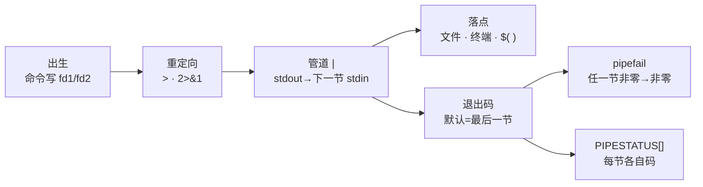
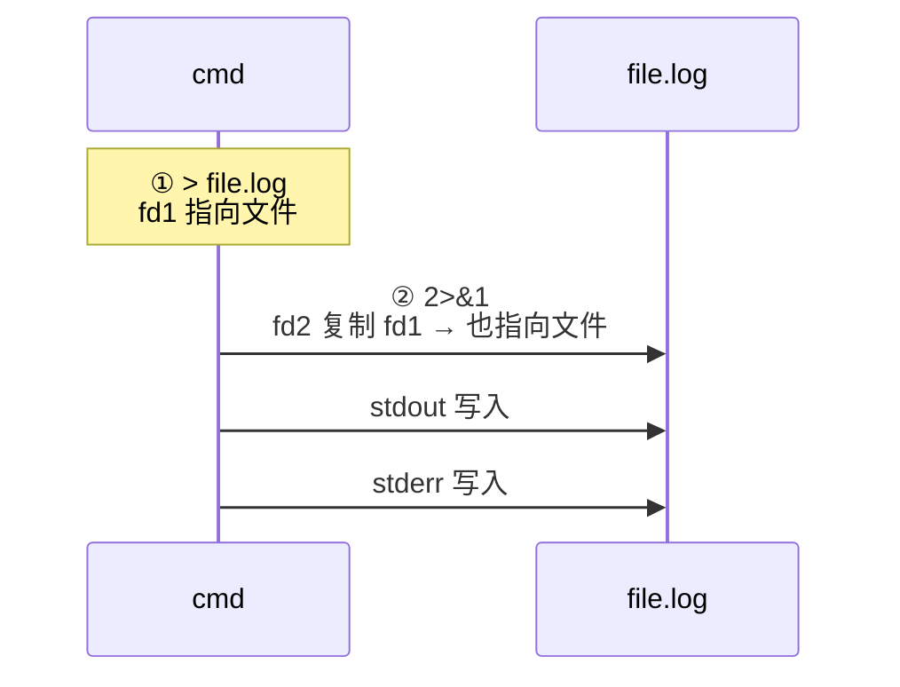
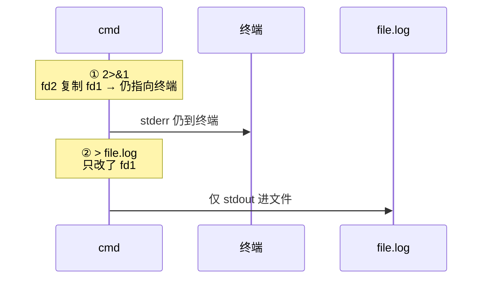
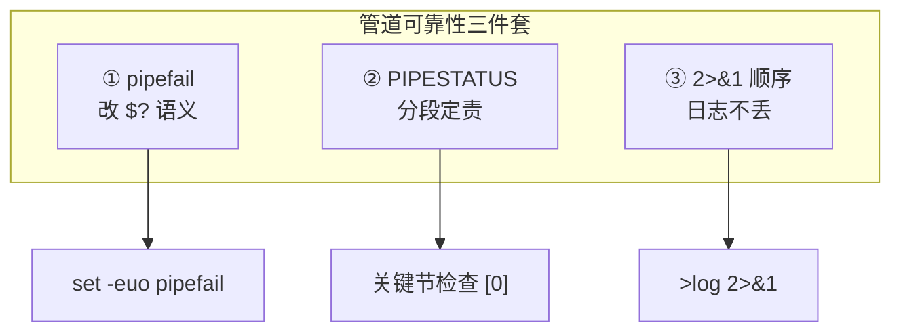
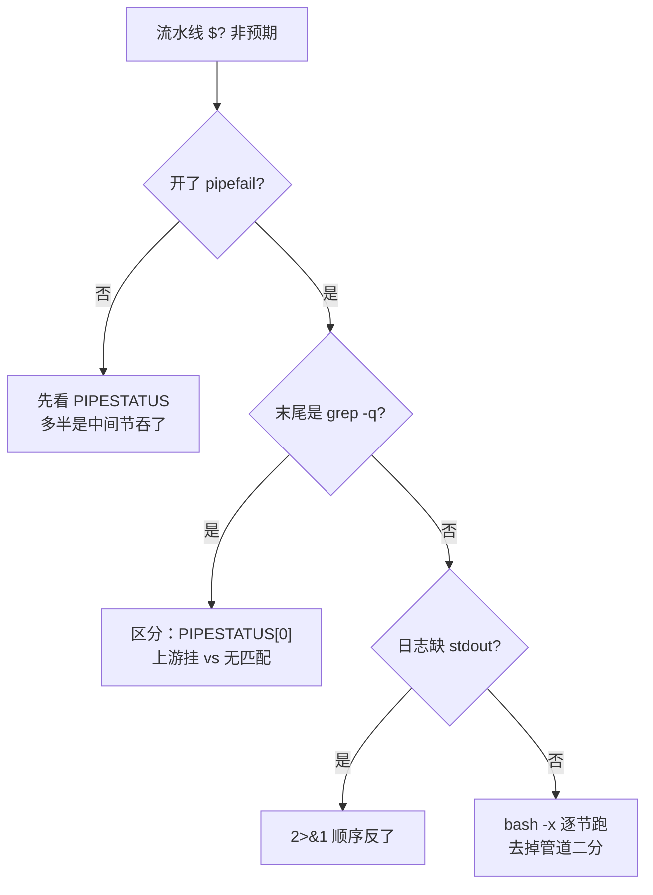

# 06｜管道重定向与 PIPESTATUS · SRE 开发能力

> 发版脚本 `kubectl apply | grep -q created` 明明 apply 失败了，流水线却绿着；有人把 `2>&1` 写在 `>` 前面，日志文件里只有 stderr、stdout 丢了；还有人关了 `pipefail` 以为「管道更快」——中间 `awk` 挂了没人知道。群里已经有人在说「流水线绿了就行，先发」。
> **本章回答**：一条**管道/重定向**从命令产生字节到落盘或进下一节——fd 0/1/2 怎么分叉合并、`2>&1` 为什么顺序致命、`|` 只把谁的退出码交给 `$?`、`PIPESTATUS` 和 `pipefail` 怎么补洞。
> **不讲**：subshell 与 `( )` → [07](../07-进程作业与subshell/)；三开关总览 → [02](../02-脚本骨架与三开关/)；函数内通道分工 → [05](../05-函数与作用域/)。

**标记**：🎯重点 · 🔥难点 · ⭐常考 · 🔧实操

---

## 面试怎么考

| 标记 | 考点 |
|------|------|
| **核心** | 管道默认 `$?` 只等于**最后一个**命令的退出码；中间失败被吞 |
| **必会** | `set -o pipefail`；`PIPESTATUS` 数组；`cmd >file 2>&1` vs `cmd 2>&1 >file` |
| **常用** | `>/dev/null` 静音；`tee` 旁路；here-doc `<<EOF` |
| **常考** | 为什么 `set -e` + 管道中间失败不退出；`2>&1` 顺序口诀 |

**30 秒怎么说**：Shell 三条标准流——0 stdin、1 stdout、2 stderr。重定向 `>` 只动 fd1，`2>&1` 把 fd2 指到**当时** fd1 指向的地方，所以顺序不能反。管道 `A|B|C` 只把 C 的退出码给 `$?`，A/B 挂了默认仍可能显示成功——生产开 `set -o pipefail`，或读 `PIPESTATUS` 数组看每一段。日志合并用 `>>"$log" 2>&1` 写在**最后**。

---

## 能力边界

> 🎯 **一句话**：Shell 管道是 **glue**——擅长把现成工具串成一行，不擅长结构化错误处理和超时控制。

- ✅ **适合**
  - kubectl / grep / awk 编排、日志过滤——几个命令拼一行，比写 Python 快十倍
  - GB 级日志处理——内核管道缓冲、少落盘，吞吐远高于「子进程 + Python 解析」
- ❌ **不适合**
  - 10 段无人 review 的管道——复杂度超过可读性上限，改一次炸三次
  - 结构化错误处理、超时控制、JSON 深解析——交给 Python `subprocess` + `check_returncode()`
- 🔑 **错误发现的关键差异**：管道默认**不**传播中间失败，要 `pipefail` / `PIPESTATUS` 显式补洞；`subprocess` 有 `check_returncode()`，默认更安全

> 💡 **打个比方**：管道像「生产线传送带」——每节工人（命令）只管自己手上的活，品控（退出码）默认只有最后一个工人签；中间出了废品，传送带照样转。`pipefail` 就是装一个总检员，任一节废品就全线停。

---

## 一、一张图：一条管道的一生

> 🎯 **一句话**：数据从左向右流过每一节命令；退出码默认只把**最后一节**交还给 shell。



- 📖 **读图**
  - 🛤️ 上面是**数据流**（左→右）；下面是**成败信号**汇总到 `$?`
  - 🔒 没开 `pipefail`：只有最右一节进 `$?`；开了：任一中间节非零，整条非零
  - 📼 `PIPESTATUS` 是黑匣子——按节号存每一段的码，**下一条命令就会覆盖**

本节对应练习题 Q1、Q14。主图装进脑子后，先问：一条命令往屏幕打字，到底走哪条 fd？

---

## 二、出生：三个标准流 fd 0/1/2

> 🎯 **一句话**：每个命令启动时继承三个 fd——0 读入、1 正常输出、2 诊断输出；重定向改的是 **fd 编号指向哪**，不是「文件名本身」。

### 📮 三条流各干什么

| fd | 名 | 默认 | SRE 分工 |
|----|-----|------|----------|
| 0 | stdin | 键盘 / 上一节管道 | `read`、here-doc |
| 1 | stdout | 终端 | 给下游管道、`$()`、文件 |
| 2 | stderr | 终端 | 日志、错误，**默认不**进管道 |

```bash
ls /etc /nope
# stdout: /etc 下文件名列表
# stderr: ls: cannot access '/nope': No such file or directory
# 退出码: 2（有失败）
```

#### ❓ 为什么管道不传 stderr？

- 🔌 **管道只接 `fd1 → 下一命令 fd0`**——这是 POSIX 契约，不是「把命令的所有输出都串起来」
- 📣 stderr 默认仍去终端，方便人眼看见报错，同时让下游 `grep` 只吃「正常数据」
- ✅ 要把错误也并进管道或文件：显式 `2>&1` 或 bash `|&`

> ⚠️ **别混**：`|` ≠「整条命令的输出」；没写 `2>&1` 时，stderr 永远旁路在管道外。

> 🔍 **现场**：

```bash
ls /etc /nope 2>/dev/null           # ← 只看「成功输出」
ls /etc /nope >/dev/null            # ← 只看 stderr（排障时常用）
ls /etc /nope &>/dev/null           # ← bash 简写：stdout+stderr 都丢
echo $?
```

本节对应练习题 Q6、Q13。

---

## 三、重定向：数据改道

> 🎯 **一句话**：`n>file` 让 fd `n` 指向文件；`>>` 追加；`<` 把 stdin 绑到文件。

### 🧭 常用形式

```bash
cmd > out.log              # stdout 覆盖写
cmd >> out.log             # stdout 追加
cmd 2> err.log             # 只 stderr 进文件
cmd >all.log 2>&1          # stdout 进 all.log，stderr 跟过去（正确顺序）
cmd < input.txt            # stdin 来自文件
cmd <<'EOF'                # here-doc，引号 EOF 不展开变量
line $HOST
EOF
```

```bash
# 典型：脚本自身日志
exec >>"$LOG" 2>&1         # 此后整个脚本的 stdout+stderr 都进 LOG
```

- 🔑 **`exec` 重定向**：不启动新命令，只改**当前 shell** 的 fd——适合脚本开头一次性定日志落点（见 [02](../02-脚本骨架与三开关/)）
- 🧱 **符号墙**（先认形状，顺序细节下一节）
  - `>` / `>>` → 覆盖 / 追加 fd1
  - `2>` → 只动 fd2
  - `&>` → bash：fd1+fd2 同文件（简写；POSIX 用 `>f 2>&1`）
  - `2>&1` → 把 fd2 **复制到「当前 fd1 指向」**

本节对应练习题 Q2、Q9。

---

## 四、合并：2>&1 的顺序 ⭐🔥

🔥 开篇那个「日志只有 stderr、stdout 丢了」的根因。很多人答「`2>&1` 写哪都行」——⭐ 高频错答。

> 🎯 **一句话**：`2>&1` =「让 fd2 指向**此刻** fd1 指向的地方」——先写谁，谁就还没被改掉。

### ✅ 正确 vs ❌ 错误

```bash
# ✅ 两者都进 file.log
cmd > file.log 2>&1

# ❌ stderr 仍去终端；stdout 进 file.log
cmd 2>&1 > file.log
```

**正确顺序**：



**错误顺序**：



- 📖 **读图**
  - `2>&1` **不是**中文直觉「把 2 合并进 1 的那个文件」——它是**复制 fd 指针**
  - 先 `2>&1` 时 fd1 还指着终端 → fd2 也被拷到终端；后面 `>file` 只搬走了 fd1

#### ❓ 为什么顺序会致命？

- 🪞 **语义是「跟着此刻的 fd1」**，不是「跟着名叫 stdout 的那个文件」
- 🚪 大哥还没进包厢（文件）时，小弟（fd2）也还在大厅（终端）——再搬大哥，小弟不会自动跟过去
- 📝 口诀：**「先定 stdout 落点，再 `2>&1`」** → 一行背 `cmd >f 2>&1`

> 💡 **打个比方**：`2>&1` 像「跟着大哥走」——大哥还没进包厢，小弟也还在大厅。

> 📝 **面试**：正确写 `cmd >f 2>&1`；反了就是 `cmd 2>&1 >f`——stderr 留终端、文件里只有 stdout。⭐（Q2）

> 🔍 **现场**（日志文件只有报错、没有正常输出）：

```bash
# 错
some_cmd 2>&1 > /var/log/job.log

# 对
some_cmd > /var/log/job.log 2>&1
# 或 bash 简写
some_cmd &>> /var/log/job.log
```

本节对应练习题 Q2。

---

## 五、管道：| 怎么接力 ⭐

> 🎯 **一句话**：`A | B` 把 A 的 stdout 接到 B 的 stdin；两进程**并行**，内核缓冲接力。

```bash
kubectl get pods -A 2>/dev/null | grep -v Running | wc -l
```

- 🔌 **只连 fd1→fd0**：A 的 stderr 默认仍上终端
- ⚡ **并行**：A 写、B 读同时进行，不是 A 跑完再 B
- 🧾 **退出码**：默认只有 B 的进 `$?`
- 🛑 **`set -e`**：中间 A 失败，默认**不**触发 `-e`（除非 `pipefail`）

```bash
false | true
echo $?                    # ← 0（true 的码），false 被吞

true | false
echo $?                    # ← 1（false 的码）
```

#### ❓ 为什么默认 `$?` 只看最后一节？

- 📜 **历史契约**：管道被当成「一条复合命令」，shell 历史上只把**最右命令**的状态当整条状态
- 🕳️ 中间失败被吞 = CI 假绿的根——`kubectl|grep` 类流水线尤其危险
- ✅ 补洞两招：`set -o pipefail`（改 `$?` 语义）或立刻读 `PIPESTATUS`（分段定责）

> ⚠️ **别混**：`grep` 无匹配退出码 **1** 是**正常语义**——管道末尾 `grep -q` 没匹配会让整条显示失败，这是设计如此，不是 bug（定责用 `PIPESTATUS[0]`，见六、七节）。

### 🔀 把 stderr 也并进管道

```bash
cmd |& grep ERROR          # bash：等同 2>&1 |
# 等价
cmd 2>&1 | grep ERROR
```

### 🔧 管道与缓冲

```bash
# 长任务：左侧 stderr 提示进度，右侧慢慢消费
tar czf - /data 2>/tmp/tar.err | ssh backup 'tar xzf - -C /bak'
# ← tar 的进度在 err 文件，stdout 纯数据流进 ssh

# 行缓冲：避免 grep 长时间无输出（gnu stdbuf）
stdbuf -oL tail -F app.log | grep --line-buffered ERROR
```

- 📖 **读图**
  - ⚡ 两节并行：左侧写满内核缓冲会**阻塞**左侧，不是「A 全跑完再 B」
  - 🧊 右侧 `grep` 长时间无输出 → 先怀疑缓冲未 flush，再怀疑管道坏了

> 🔍 **现场**（怀疑管道「卡住」）：

```bash
# 二分：先只跑左侧看是否本身 hang
kubectl logs -f pod/foo --tail=100 > /tmp/left.out
# 再 cat /tmp/left.out | 右侧命令
```

本节对应练习题 Q1、Q6、Q8。

---

## 六、PIPESTATUS：每一节的黑匣子 ⭐🔥

🔥 大白话：`PIPESTATUS` = **管道每一节的退出码数组**。`$?` 只告诉你最后一节，中间挂了怎么查？

> 🎯 **一句话**：`${PIPESTATUS[i]}` 是第 i 节（从 0 起）的退出码；**必须在下一条命令前立刻读**，否则被覆盖。

```bash
false | true | echo ok
echo "last=\$? PIPESTATUS=${PIPESTATUS[*]}"
# last=0 PIPESTATUS=1 0 0
#        ↑false ↑true ↑echo
```

```bash
kubectl apply -f bad.yaml 2>/dev/null | grep -q .
if [[ ${PIPESTATUS[0]} -ne 0 ]]; then
  echo "apply failed" >&2
fi
```

- 📖 **读图**
  - `$?` = 最后一节；`PIPESTATUS[0]` = 第一节
  - 发版脚本要查的是 **`[0]` 是否为 0**，不是只看 `$?`

#### ❓ 为什么必须立刻读？

- 📼 `PIPESTATUS` 只反映**上一条管道**；任意后续命令（包括无辜的 `echo`）都会刷新它
- 💾 落地姿势：管道后立刻 `save=("${PIPESTATUS[@]}")`，再打印、再分支
- 🧪 现场常见：`curl|jq` 后 `rc=$?`——`jq?=0` 但 `PIPESTATUS=22 0`，curl 已挂、jq 仍「成功」解析了空/错输入

> 💡 **打个比方**：像航班黑匣子——每段航程都有独立记录，但落地后只有**下一次起飞前**能读；中间隔了一个 `echo`，记录就被覆盖。

> 🔍 **现场**：

```bash
curl -sf http://bad/api | jq .
rc=$?
echo "jq?=$rc PIPESTATUS=${PIPESTATUS[*]}"
# 常见：jq?=0 PIPESTATUS=22 0  ← curl 22，jq 仍成功
```

```bash
cmd1 | cmd2 | cmd3
save=("${PIPESTATUS[@]}")    # ← 立刻拷贝
echo "c1=${save[0]} c2=${save[1]} c3=${save[2]}"
```

本节对应练习题 Q4、Q12。

---

## 七、pipefail：任一节失败，全线失败 ⭐🔥

🔥 开篇「CI 假绿」的保险丝。口诀：**管道要问责，`pipefail` 一起开**。

> 🎯 **一句话**：`set -o pipefail` 让管道 `$?` 取**最右非零**那一节的码；全 0 才 0——和 `set -e` 搭配才是生产默认三开关之一（见 [02](../02-脚本骨架与三开关/)）。

```bash
set -o pipefail

false | true
echo $?                    # ← 1（false 的码传出来了）

true | false
echo $?                    # ← 1

false | false
echo $?                    # ← 1
```

### 🔗 与 `set -e` 的组合

| 组合 | 中间失败 | 末尾失败 |
|------|----------|----------|
| 默认 | `$?` 可能 0 | `$?` 非零 |
| `pipefail` | `$?` 非零 | `$?` 非零 |
| `pipefail` + `-e` | 脚本退出（除非 if/while） | 脚本退出 |

```bash
set -eo pipefail
false | true            # ← 脚本直接退出
if false | true; then   # ← 不退出，if 捕获了非零码
  echo "won't print"
fi
echo "still alive"      # ← 正常执行
```

#### ❓ 为什么开了 `set -e` 管道中间失败还不退出？

- 🕳️ **默认管道**：`$?` 只看末节 → 中间非零时整条仍可能是 0 → `-e` **看不见失败**
- 🔧 **补上 `pipefail`**：整条非零 → `-e` 才能停（不在 `if`/`while`/`||`/`&&` 例外里时）
- 🎭 **`if cmd1 | cmd2`**：`if` 本身在测退出码 → `-e` **故意不**因非零退出——这是设计，不是 pipefail 坏了

#### ❓ 为什么 `grep -q` 无匹配 ≠ 上游失败？

- 1️⃣ `grep` 无匹配 = exit **1**（正常「没找到」）
- 2️⃣ 上游 `kubectl`/`curl` 挂了 = 通常 **非 1** 的业务码（或网络/权限码）
- 🧭 定责：先看 `PIPESTATUS[0]`；不要用 `| true` 掩盖上游失败
- ⚠️ `pipefail` 改的是 **`$?` 语义**，不是让 stderr 进管道

> 📝 **面试**：为什么生产开 `pipefail`？——默认 `$?` 只看最后一节，`kubectl|grep` 中间挂了仍显示成功，是静默故障源头。⭐（Q3、Q7）

> 💡 **打个比方**：默认只看灯泡末端亮不亮；装了 `pipefail`，回路任一处断线总闸就跳。

本节对应练习题 Q3、Q5、Q7。

---

## 八、收束：管道可靠性三件套



- 📖 **读图**
  - ① 让脚本整体能失败
  - ② 让你知道是哪一节失败
  - ③ 让日志文件完整
  - 缺任一环 → 线上都会出现「脚本绿了但活没干成」

**可背清单**：

```text
① 脚本头：set -euo pipefail
② 发版/拉配置：cmd | tee /dev/stderr | filter  → 或查 PIPESTATUS[0]
③ 落盘日志：>>"$LOG" 2>&1（先 > 再 2>&1）
④ grep 收尾：接受 exit 1=无匹配，但别用它掩盖上游失败
```

> ⚠️ **别混**：三件套解决的是**失败可见 + 日志完整**——不保证业务逻辑对、不保证超时、不保证并发安全（→ [08](../08-并发与限流/)）。

> 📝 **面试**：管道可靠性 = `pipefail`（整条问责）+ `PIPESTATUS`（分段定责）+ `>f 2>&1`（日志不丢）。按「看见失败—定位节—留证据」分组记。⭐（Q14）

本节对应练习题 Q14。

---

## 九、生产模板 🔧

下面是可复制的生产模板（**代码块一字不改**，直接拿走）。

### 模板 1：标准三开关 + 日志

```bash
#!/usr/bin/env bash
set -euo pipefail

LOG=${LOG:-/var/log/deploy.log}
exec > >(tee -a "$LOG") 2>&1    # ← 终端仍可见，同时落盘（进程替换见 07）

main() {
  kubectl apply -f manifests/
  kubectl rollout status deploy/app --timeout=180s
}
main "$@"
```

### 模板 2：apply | grep 正确写法

```bash
#!/usr/bin/env bash
set -euo pipefail

apply_and_show() {
  local f=$1
  kubectl apply -f "$f" | grep -E 'created|configured'
  # pipefail 下：apply 失败 → 整条非零 → -e 退出
}

# 若要区分 apply 失败 vs grep 无输出
apply_check() {
  local f=$1
  kubectl apply -f "$f" 2>&1 | tee /dev/stderr | grep -q .
  local k8s_rc=${PIPESTATUS[0]}
  [[ $k8s_rc -eq 0 ]] || { echo "apply failed rc=$k8s_rc" >&2; return "$k8s_rc"; }
}
```

### 模板 3：curl | jq 定责

```bash
fetch_phase() {
  local ns=$1 pod=$2
  kubectl get pod -n "$ns" "$pod" -o json | jq -r '.status.phase'
  if [[ ${PIPESTATUS[0]} -ne 0 ]]; then
    echo "kubectl failed" >&2
    return "${PIPESTATUS[0]}"
  fi
}
```

### 模板 4：大日志先缩再算（与 [04 正则](../../04-正则与文本处理/) 衔接）

```bash
grep -E 'HTTP/[0-9.]+" 5[0-9][0-9]' access.log \
  | awk '{c[$1]++} END{for (k in c) print c[k],k}' \
  | sort -rn | head -10
# pipefail：任一节读盘/语法错都会非零
```

### 模板 5：临时调试 fd（不改脚本结构）

```bash
# 把某一节的 stderr 旁路到文件，stdout 仍进管道
kubectl apply -f app.yaml 2> >(tee /tmp/apply.err >&2) | grep -E 'created|configured'
cat /tmp/apply.err    # ← apply 的报错原文，即使进了 pipefail 也能复盘
```

```bash
# 只看管道每一节耗时（粗略）
time ( kubectl get pods -A -o wide 2>/dev/null | wc -l )
```

### 模板 6：POSIX 可移植重定向（无 bash `&>`）

```bash
# 部署到 sh/dash 的极简片段
cmd >"$LOG" 2>&1                    # 合并日志
cmd >>"$LOG" 2>&1                   # 追加
{ cmd1; cmd2; } >>"$LOG" 2>&1      # 一组命令共用一个落点
```

> 📝 **面试**：cron 收日志——`>>/var/log/job.log 2>&1` 写在重定向**最后**；邮件里只有 stderr 多半是 `2>&1 >file` 写反了（Q2）。

本节对应练习题 Q9、Q10、Q11。

---

## 十、作战：管道失败定责



- 📖 **读图**
  - 🛤️ 先问有没有 `pipefail` → 再问末尾是不是 `grep -q` → 再问日志是否缺 stdout
  - 🔪 三条开篇事故分别落在 A1 / A2 / A3

| 现象 | 先做 | 别做 |
|------|------|------|
| apply 失败流水线绿 | `echo ${PIPESTATUS[*]}` | 只看 `$?` |
| 日志只有 stderr | 查 `2>&1` 顺序 | 再加一层重定向 |
| `set -e` 没退出 | 是否 `if cmd\|...` 或缺 `pipefail` | `set +e` 全局关 |
| `grep` 导致失败 | 看是 `-q` 无匹配还是上游错 | 盲目 `\| true` |

### 60 秒剧本 🔧

> 🔍 **现场**：接到「流水线绿了 / 日志缺行 / 管道假成功」，60 秒走完再下结论。

```text
0–15s   复现一行管道，立刻 echo "${PIPESTATUS[@]}" "$?"
15–30s  去掉右侧，只跑左侧，看上游是否已错
30–45s  检查 head：有无 pipefail；日志重定向顺序
45–60s  必要时 bash -x 或 set -o xtrace 跟 fd
```

本节对应练习题 Q5、Q11、Q12。

---

## 十一、收口

### 命令速查 🔧

```bash
# 退出码与分段定责
false | true; echo $?                          # 默认 0（末节）
set -o pipefail; false | true; echo $?         # 1
cmd1 | cmd2 | cmd3; echo "${PIPESTATUS[@]}"    # 立刻读，勿插 echo
save=("${PIPESTATUS[@]}")                      # 拷贝后再分支

# 重定向顺序
cmd >"$LOG" 2>&1                               # ✅ 合并
cmd 2>&1 >"$LOG"                               # ❌ stderr 仍终端
cmd &>>"$LOG"                                  # bash 简写追加合并

# 静音 / 旁路
cmd >/dev/null                                 # 只看 stderr
cmd 2>/dev/null                                # 只看 stdout
cmd 2>&1 | grep ERROR                          # stderr 也进管道
cmd |& grep ERROR                              # bash 等价

# 缓冲与二分
stdbuf -oL tail -F app.log | grep --line-buffered ERROR
# 卡住时先只跑左侧落盘，再 cat | 右侧
```

### 踩坑清单

| 现象 | 原因 | 修法 |
|------|------|------|
| 中间命令失败脚本继续 | 默认 `$?` 只看最后 | `set -o pipefail` |
| 不知哪一节失败 | 未读 `PIPESTATUS` | 管道后立刻存数组 |
| 日志文件只有错误行 | `2>&1 >file` 顺序反 | `>file 2>&1` |
| stderr 没进管道 | 管道只连 fd1 | `2>&1 \|` 或 `\|&` |
| `PIPESTATUS` 全是 0 | 中间插了 `echo` | 在**第一条**后续命令前读 |
| `grep` 让部署失败 | 无匹配 exit 1 | 接受或查 `[0]`，别 `\| true` 掩盖 |
| `set -e` 管道不退出 | 缺 `pipefail` 或在 `if` 里 | 三开关一起开；认清 if 例外 |
| `cat file \| grep` | 多一次进程 | `grep pat file` |
| 管道「卡住」 | 缓冲 / 左侧阻塞 | `stdbuf -oL`；二分测左侧 |
| cron 邮件只有 stderr | 重定向顺序反 | `>>log 2>&1` |

### 必会 · 常考

| 说法 | 对错 | 口径 |
|------|:----:|------|
| 管道 `$?` 是第一个命令的码 | 错 | **默认最后一个** |
| `2>&1` 与顺序无关 | 错 | 先 `>file` 再 `2>&1` |
| 管道会传 stderr | 错 | 默认只 fd1 |
| `pipefail` 让 grep 无匹配不算失败 | 错 | 仍看最右非零；要分项用 PIPESTATUS |
| `PIPESTATUS` 可晚点再读 | 错 | 下条命令就覆盖 |
| `\| true` 是正经修法 | 错 | 掩盖上游失败 |
| `&>` 是 POSIX | 错 | bash 扩展；POSIX 用 `>f 2>&1` |

### 面试锚点

| 问 | 30 秒答 |
|----|---------|
| 管道默认 `$?` 是谁的？ | 最后一个命令；中间失败被吞 |
| `cmd >f 2>&1` 和反过来？ | 前者都进 f；后者 stderr 仍终端 |
| `pipefail` 干什么？ | 任一非零则管道非零（最右非零码） |
| `PIPESTATUS` 怎么用？ | 数组，下条命令前读；`[0]` 定上游 |
| 为何 `set -e` 管不住管道中间失败？ | 默认 `$?` 仍可能为 0；要配 `pipefail`，且认清 `if` 例外 |

### 易错一句话对照

- `kubectl apply \| grep -q .` 失败就是 apply 挂了 → 先看 `PIPESTATUS[0]`；grep 无匹配也是 1
- `2>&1` 把 stderr 合并到 stdout 文件，写哪都行 → 先定 fd1 落点，再 `2>&1`
- 开了 `set -e` 管道就安全 → 还要 `pipefail`，否则中间挂 `-e` 看不见
- `pipefail` 会把 stderr 并进管道 → 只改 `$?` 语义；并流仍要 `2>&1` / `|&`
- `PIPESTATUS` 可以脚本末尾再读 → 任意后续命令覆盖；立刻 `save=(...)`
- `| true` 修 grep 无匹配 → 掩盖上游失败；用 `[0]` 定责或接受 exit 1

### 数字墙

> fd：**0** stdin · **1** stdout · **2** stderr · `PIPESTATUS` **0-based** 与管道从左到右一致 · `grep` 无匹配 exit **1**（不是 2）· `pipefail` 取**最右非零** · 与 `set -e` 合用才是生产默认三开关之一

---

## 合上书

对着第一节主图口述一遍，卡住就回对应小节。开头那个现场——`kubectl|grep` 假绿、`2>&1` 写反丢 stdout、关 `pipefail`——三个人各自错在哪，现在该能说清了。

- [ ] **默画主图**：出生三 fd → 重定向 → `|` 接力 → 落点 → `$?` → `pipefail` / `PIPESTATUS`。（→ Q1 · Q14）
- [ ] **写出正确日志合并一行**，并解释错误顺序 `2>&1 >file` 发生了什么（fd 指针怎么拷）。（→ Q2）
- [ ] `false | true` 默认 `$?`？开 `pipefail` 后呢？（→ Q1 · Q3）
- [ ] `kubectl apply | grep -q .` 失败时，如何用 `PIPESTATUS` 判断是 apply 还是 grep？（→ Q4 · Q5）
- [ ] 为什么管道不传 stderr？要让错误也进 `grep` 怎么写？（→ Q6）
- [ ] 为什么 `set -e` 管不住管道中间失败？缺哪一块？`if` 里为什么还不退？（→ Q7）
- [ ] `PIPESTATUS` 为什么必须立刻读？插一个 `echo` 会怎样？（→ Q4）
- [ ] 说出管道可靠性三件套，各解决什么问题。（→ Q14）

全部打勾之后，找同事十分钟讲清「假绿 / 丢 stdout / 关 pipefail」各自错在哪。讲得下来，你就是下一个能拦住「流水线绿了就发」冲动的人。

下一章：[07 进程作业与 subshell](../07-进程作业与subshell/)——`$()` 和 `( )` 何时真的开子进程。
